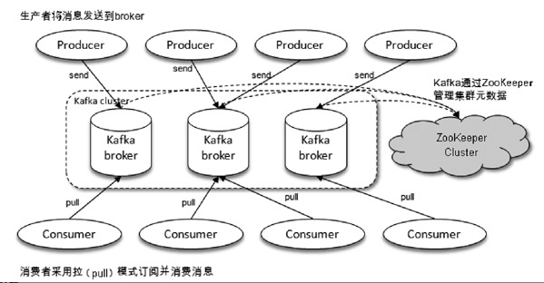
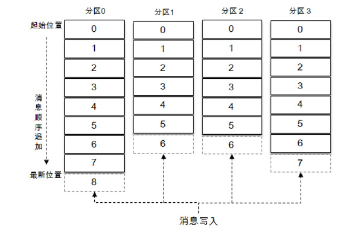
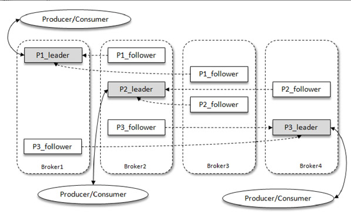
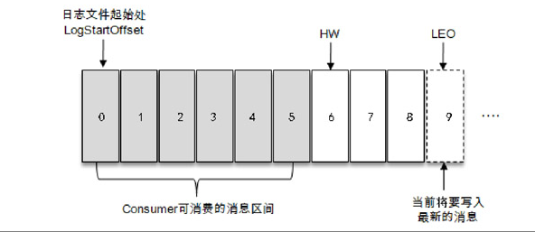
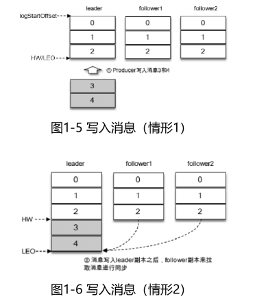
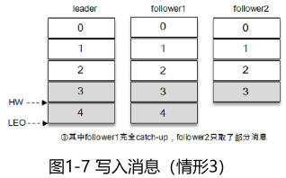
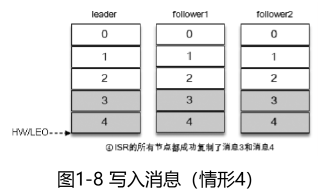
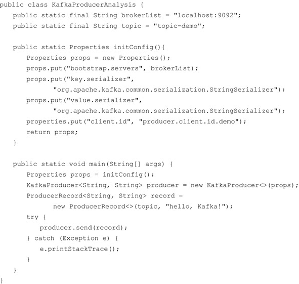

《深入理解Kafka：核心设计与实践原理》

## 概念

### 1 基本概念

一个典型的 Kafka 体系架构包括若干 Producer、若干 Broker、若干Consumer，以及一个ZooKeeper集群，如图1-1所示。其中**ZooKeeper是Kafka用来负责集群元数据的管理、控制器的选举等操作的。Producer将消息发送到Broker，Broker负责将收到的消息存储到磁盘中，而Consumer负责从Broker订阅并消费消息**。



​											图 1-1 Kafka体系架构

##### 生产者

（1）Producer：生产者，也就是发送消息的一方。生产者负责创建消息，然后将其投递到Kafka中。

##### 消费者

（2）Consumer：消费者，也就是接收消息的一方。消费者连接到Kafka上并接收消息，进而进行相应的业务逻辑处理。

##### 服务代理节点

（3）Broker：服务代理节点。对于Kafka而言，Broker可以简单地看作一个独立的Kafka服务节点或Kafka服务实例。大多数情况下也可以将Broker看作一台Kafka服务器，前提是这台服务器上只部署了一个Kafka实例。一个或多个Broker组成了一个Kafka集群。一般而言，我们更习惯使用首字母小写的broker来表示服务代理节点。

在Kafka中还有两个特别重要的概念—主题（Topic）与分区（Partition）。

##### **主题**

**Kafka中的消息以主题为单位进行归类**，生产者负责将消息发送到特定的主题（发送到Kafka集群中的每一条消息都要指定一个主题），而消费者负责订阅主题并进行消费。

##### 分区

**主题是一个逻辑上的概念，它还可以细分为多个分区，一个分区只属于单个主题，很多时候也会把分区称为主题分区（Topic-Partition）**。**同一主题下的不同分区包含的消息是不同的**，分区在存储层面可以看作一个可追加的日志（Log）文件，消息在被追加到分区日志文件的时候都会分配一个特定的偏移量（offset）。**offset是消息在分区中的唯一标识，Kafka通过它来保证消息在分区内的顺序性，不过offset并不跨越分区**，也就是说，**Kafka保证的是分区有序而不是主题有序**。

###### 如何保持主题有序？

> 如何保持主题有序么?方案一：kafka默认保证同个partition分区内的消息是有序的，则可以设置topic只使用一个分区，这样消息就是全局有序，缺点是只能被consumer group里的一个消费者消费降低了性能，不适用高并发的情况。
>
> 方案二：既然kafka默认保证同一个partition分区内的消息是有序的，则producer可以在发送消息时可以指定需要保证顺序的几条消息发送到同一个分区，这样消费者消费时，消息就是有序。

如图 1-2 所示，**主题中有 4 个分区，消息被顺序追加到每个分区日志文件的尾部**。**Kafka中的分区可以分布在不同的服务器（broker）上，也就是说，一个主题可以横跨多个broker，以此来提供比单个broker更强大的性能**。



​																		图1-2 消息追加写入

**每一条消息被发送到broker之前，会根据分区规则选择存储到哪个具体的分区**。如果分区规则设定得合理，所有的消息都可以均匀地分配到不同的分区中。**如果一个主题只对应一个文件，那么这个文件所在的机器 I/O 将会成为这个主题的性能瓶颈，而分区解决了这个问题**。在创建主题的时候可以通过指定的参数来设置分区的个数，当然也可以在主题创建完成之后去修改分区的数量，通过增加分区的数量可以实现水平扩展。

**Kafka 为分区引入了多副本（Replica）机制，通过增加副本数量可以提升容灾能力**。**同一分区的不同副本中保存的是相同的消息（在同一时刻，副本之间并非完全一样），副本之间是“一主多从”的关系，其中leader副本负责处理读写请求，follower副本只负责与leader副本的消息同步**。副本处于不同的broker中，当leader副本出现故障时，从follower副本中重新选举新的leader副本对外提供服务。Kafka通过多副本机制实现了故障的自动转移，当Kafka集群中某个broker失效时仍然能保证服务可用。

如图1-3所示，Kafka集群中有4个broker，某个主题中有3个分区，且副本因子（即副本个数）也为3，如此每个分区便有1个leader副本和2个follower副本。生产者和消费者只与leader副本进行交互，而follower副本只负责消息的同步，很多时候follower副本中的消息相对leader副本而言会有一定的滞后。



​																	图 1-3 多副本架构

###### Kafka 消费端也具备一定的容灾能力

Kafka 消费端也具备一定的容灾能力。Consumer 使用拉（Pull）模式从服务端拉取消息，并且保存消费的具体位置，当消费者宕机后恢复上线时可以根据之前保存的消费位置重新拉取需要的消息进行消费，这样就不会造成消息丢失。

分区中的所有副本统称为AR（Assigned Replicas）。**所有与leader副本保持一定程度同步的副本（包括leader副本在内）组成ISR（In-Sync Replicas）**，ISR集合是AR集合中的一个子集。消息会先发送到leader副本，然后follower副本才能从leader副本中拉取消息进行同步，同步期间内follower副本相对于leader副本而言会有一定程度的滞后。前面所说的“一定程度的同步”是指可忍受的滞后范围，这个范围可以通过参数进行配置。**与leader副本同步滞后过多的副本（不包括leader副本）组成OSR（Out-of-Sync Replicas）**，由此可见，AR=ISR+OSR。在正常情况下，所有的 follower 副本都应该与 leader 副本保持一定程度的同步，即 AR=ISR，OSR集合为空。

leader副本负责维护和跟踪ISR集合中所有follower副本的滞后状态，当follower副本落后太多或失效时，leader副本会把它从ISR集合中剔除。如果OSR集合中有follower副本“追上”了leader副本，那么leader副本会把它从OSR集合转移至ISR集合。默认情况下，当leader副本发生故障时，只有在ISR集合中的副本才有资格被选举为新的leader，而在OSR集合中的副本则没有任何机会（不过这个原则也可以通过修改相应的参数配置来改变）。

ISR与HW和LEO也有紧密的关系。**HW是High Watermark的缩写，俗称高水位，它标识了一个特定的消息偏移量（offset），消费者只能拉取到这个offset之前的消息**。

如图 1-4 所示，它代表一个日志文件，这个日志文件中有 9 条消息，第一条消息的 offset（LogStartOffset）为0，最后一条消息的offset为8，offset为9的消息用虚线框表示，代表下一条待写入的消息。日志文件的HW为6，表示消费者只能拉取到offset在0至5之间的消息，而offset为6的消息对消费者而言是不可见的。



​														图1-4 分区中各种偏移量的说明

**LEO是Log End Offset的缩写，它标识当前日志文件中下一条待写入消息的offset**，图1-4中offset为9的位置即为当前日志文件的LEO，**LEO的大小相当于当前日志分区中最后一条消息的offset值加1**。分区ISR集合中的每个副本都会维护自身的LEO，而ISR集合中最小的LEO即为分区的HW，对消费者而言只能消费HW之前的消息。

**注意要点：很多资料中误将图1-4中的offset为5的位置看作HW，而把offset为8的位置看作LEO，这显然是不对的**。

案例

如图1-5所示，假设某个分区的ISR集合中有3个副本，即一个leader副本和2个follower副本，此时分区的LEO和HW都为3。消息3和消息4从生产者发出之后会被先存入leader副本，如图1-6所示。



在消息写入leader副本之后，follower副本会发送拉取请求来拉取消息3和消息4以进行消息同步。

在同步过程中，不同的 follower 副本的同步效率也不尽相同。如图 1-7 所示，在某一时刻follower1完全跟上了leader副本而follower2只同步了消息3，如此leader副本的LEO为5，follower1的LEO为5，follower2的LEO为4，那么当前分区的HW取最小值4，此时消费者可以消费到offset为0至3之间的消息。



写入消息（情形4）如图1-8所示，所有的副本都成功写入了消息3和消息4，整个分区的HW和LEO都变为5，因此消费者可以消费到offset为4的消息了。



由此可见，**Kafka 的复制机制既不是完全的同步复制，也不是单纯的异步复制**。事实上，同步复制要求所有能工作的 follower 副本都复制完，这条消息才会被确认为已成功提交，这种复制方式极大地影响了性能。而在异步复制方式下，follower副本异步地从leader副本中复制数据，数据只要被leader副本写入就被认为已经成功提交。在这种情况下，如果follower副本都还没有复制完而落后于leader副本，突然leader副本宕机，则会造成数据丢失。Kafka使用的这种ISR的方式则有效地权衡了数据可靠性和性能之间的关系。

#### 服务端参数配置

参数都配置在$KAFKA_HOME/config/server.properties文件中。

##### 1.zookeeper.connect

##### 2.listeners

该参数指明broker监听客户端连接的地址列表，即为客户端要连接broker的入口地址列表，配置格式为 protocol1：//hostname1：port1，protocol2：//hostname2：port2，其中protocol代表协议类型，Kafka当前支持的协议类型有PLAINTEXT、SSL、SASL_SSL等，如果未开启安全认证，则使用简单的PLAINTEXT即可。hostname代表主机名，port代表服务端口，此参数的默认值为 null。比如此参数配置为 PLAINTEXT：//198.162.0.2：9092，如果有多个地址，则中间以逗号隔开。如果不指定主机名，则表示绑定默认网卡，注意有可能会绑定到127.0.0.1，这样无法对外提供服务，所以主机名最好不要为空；如果主机名是0.0.0.0，则表示绑定所有的网卡。与此参数关联的还有advertised.listeners，作用和listeners类似，默认值也为 null。不过advertised.listeners 主要用于 IaaS（Infrastructure as a Service）环境，比如公有云上的机器通常配备有多块网卡，即包含私网网卡和公网网卡，对于这种情况而言，可以设置advertised.listeners参数绑定公网IP供外部客户端使用而配置listeners参数来绑定私网IP地址供broker间通信使用。

##### 3.broker.id

该参数用来指定Kafka集群中broker的唯一标识，默认值为-1。如果没有设置，那么Kafka会自动生成一个。这个参数还和meta.properties文件及服务端参数broker.id.generation.enable和reserved.broker.max.id有关，相关深度解析可以参考6.5.1节的内容。

##### 4.log.dir和log.dirs

**Kafka 把所有的消息都保存在磁盘上**，而这两个参数用来配置 Kafka 日志文件存放的根目录。一般情况下，log.dir 用来配置单个根目录，而 log.dirs 用来配置多个根目录（以逗号分隔），但是Kafka并没有对此做强制性限制，也就是说，log.dir和log.dirs都可以用来配置单个或多个根目录。log.dirs 的优先级比log.dir 高，但是如果没有配置log.dirs，则会以 log.dir 配置为准。默认情况下只配置了 log.dir 参数，其默认值为/tmp/kafka-logs。

##### 5.message.max.bytes

**该参数用来指定broker所能接收消息的最大值，默认值为1000012（B），约等于976.6KB**。如果 Producer 发送的消息大于这个参数所设置的值，那么（Producer）就会报出RecordTooLargeException的异常。如果需要修改这个参数，那么还要考虑max.request.size （客户端参数）、max.message.bytes（topic端参数）等参数的影响。为了避免修改此参数而引起级联的影响，建议在修改此参数之前考虑分拆消息的可行性。

##### 其他

###### unclean.leader.election.enable

###### log.segment.bytes

#### 生产消息



KafkaProducer是线程安全的，可以在多个线程中共享单个KafkaProducer实例，也可以将KafkaProducer实例进行池化来供其他线程调用。

配置：

```yaml
consumer:
  topics:
  	t_tiktok_product_status_changed: "dk.tiktok.product.status.changed"
```

代码：

```java
import com.meiyunji.dk.queue.service.producer.TiktokGoodsSyncProduceService;
import lombok.extern.slf4j.Slf4j;
import org.springframework.beans.factory.annotation.Autowired;
import org.springframework.beans.factory.annotation.Value;
import org.springframework.kafka.core.KafkaTemplate;
import org.springframework.kafka.support.SendResult;
import org.springframework.stereotype.Service;
import org.springframework.util.concurrent.ListenableFuture;
import org.springframework.util.concurrent.ListenableFutureCallback;

@Service
@Slf4j
public class TiktokGoodsSyncProduceServiceImpl implements TiktokGoodsSyncProduceService {

    @Autowired
    KafkaTemplate<String, String> kafkaTemplate;

    @Value("${consumer.topics.t_tiktok_goods_sync}${dk.topic.suff:}")
    private String topicName;

    @Value("${consumer.topics.t_tiktok_product_status_changed}${dk.topic.suff:}")
    private String productStatusChangedTopicName;

    @Override
    public void emit(String shopId, String body) {
        final String bodyJson = body;
        ListenableFuture<SendResult<String, String>> future = kafkaTemplate.send(topicName, shopId, body);
        future.addCallback(new ListenableFutureCallback<SendResult<String, String>>() {
            @Override
            public void onFailure(Throwable ex) {
                log.error("TikTokMessagePushProducerServiceImpl: 消息队列失败" + bodyJson);
            }

            @Override
            public void onSuccess(SendResult<String, String> result) {
//                log.info("TikTokMessagePushProducerServiceImpl: 消息队列成功" + bodyJson);
            }
        });
    }


    /**
     * 商品状态变更后，同步商品信息
     *
     * @param shopId 店铺id
     * @param body   推送的消息
     */
    @Override
    public void emitProductStatusChangedEvent(String shopId, String body) {
        final String bodyJson = body;
        ListenableFuture<SendResult<String, String>> future = kafkaTemplate.send(productStatusChangedTopicName, shopId, body);
        future.addCallback(new ListenableFutureCallback<SendResult<String, String>>() {
            @Override
            public void onFailure(Throwable ex) {
                log.error("TikTokMessagePushProducerServiceImpl: product status changed push queue failed: {}", bodyJson);
            }

            @Override
            public void onSuccess(SendResult<String, String> result) {
                log.info("TikTokMessagePushProducerServiceImpl: product status changed push queue success: {}", bodyJson);
            }
        });
    }
}
```

##### ProducerRecord

```java
public class ProducerRecord<K, V> {
    private final String topic;
    private final Integer partition;
    private final Headers headers;
    private final K key;
    private final V value;
    private final Long timestamp;
```

其中topic和partition字段分别代表消息要发往的主题和分区号。headers字段是消息的头部，Kafka 0.11.x版本才引入这个属性，它大多用来设定一些与应用相关的信息，如无需要也可以不用设置。key是用来指定消息的键，它不仅是消息的附加信息，还可以用来计算分区号进而可以让消息发往特定的分区。前面提及消息以主题为单位进行归类，而这个key可以让消息再进行二次归类，**同一个key的消息会被划分到同一个分区中**，有key的消息还可以支持日志压缩的功能，value是指消息体，一般不为空，如果为空则表示特定的消息—墓碑消息，timestamp是指消息的时间戳，它有CreateTime和LogAppendTime两种类型，前者表示消息创建的时间，后者表示消息追加到日志文件的时间。

##### 配置

```yaml
spring:
  kafka:
    bootstrap-servers: kafka-dev.meiyunji.net:9092
    producer:
      key-deserializer: org.apache.kafka.common.serialization.StringDeserializer
      value-deserializer: org.apache.kafka.common.serialization.StringDeserializer
```

###### bootstrap.servers

该参数用来指定生产者客户端连接Kafka集群所需的broker地址清单，具体的内容格式为host1：port1，host2：port2，可以设置一个或多个地址，中间以逗号隔开，此参数的默认值为“”。注意这里并非需要所有的broker地址，因为生产者会从给定的broker里查找到其他broker的信息。不过建议至少要设置两个以上的broker 地址信息，当其中任意一个宕机时，生产者仍然可以连接到 Kafka集群上。

###### key.serializer 和 value.serializer

broker 端接收的消息必须以字节数组（byte[]）的形式存在。代码清单2-1中生产者使用的KafkaProducer＜String，String＞和ProducerRecord＜String，String＞中的泛型＜String，String＞对应的就是消息中key和value的类型，生产者客户端使用这种方式可以让代码具有良好的可读性，不过在发往broker之前需要将消息中对应的key和value做相应的序列化操作来转换成字节数组。key.serializer和value.serializer这两个参数分别用来指定key和value序列化操作的序列化器，这两个参数无默认值。注意这里必须填写序列化器的全限定名。

###### 具体的配置类中有配置参数 ProducerConfig

```
package org.apache.kafka.clients.producer;

public class ProducerConfig extends AbstractConfig {
    private static final ConfigDef CONFIG;
    public static final String BOOTSTRAP_SERVERS_CONFIG = "bootstrap.servers";
    public static final String CLIENT_DNS_LOOKUP_CONFIG = "client.dns.lookup";
    public static final String METADATA_MAX_AGE_CONFIG = "metadata.max.age.ms";
    ...
}
```

#### 消费消息

配置：

```yaml
kafka:
  topics:
    TiktokProductSyncConsumer:
      topic: "dk.tiktok.product.status.changed"
      group: tiktok-product-sync-group
      open: true
```

代码：

```java
@Slf4j
@Service
public class TiktokProductSyncConsumer {
    @KafkaListener(topics = "${kafka.topics.TiktokProductSyncConsumer.topic}${dk.topic.suff:}",
            containerFactory = "simpleConsumerFactoryForTiktokGoodsStatusChangedSync",
            groupId = "${kafka.topics.TiktokProductSyncConsumer.group}",
            autoStartup = "${kafka.topics.TiktokProductSyncConsumer.open}",
            concurrency = "4")
    public void onMessageInProductStatusChangedCondition(List<ConsumerRecord<String, String>> records, Acknowledgment ack) {
        try {
            if (CollectionUtils.isEmpty(records)) {
                return;
            }
            for (ConsumerRecord<String, String> record : records) {
                String s = record.value();
                if (StringUtils.isBlank(s)) {
                    continue;
                }

                TiktokProductStatusChangedVo productStatusChangedVo = JsonUtils.toObject(s, TiktokProductStatusChangedVo.class);
                if (productStatusChangedVo == null || productStatusChangedVo.getData() == null || productStatusChangedVo.getShopId() == null) {
                    log.info("lanwenquan | simpleConsumerFactoryForTiktokGoodsStatusChangedSync: productStatusChangedVo is null, s: {}", s);
                    continue;
                }

                String sellerId = productStatusChangedVo.getShopId();
                String productId = String.valueOf(productStatusChangedVo.getData().getProductId());
                if (StringUtils.isBlank(productId)) {
                    continue;
                }

                TiktokShop shop = tiktokShopMapper.selectOneBySellerId(sellerId);
                if (shop == null) {
                    log.info("lanwenquan | parse tiktok product status changed message: shop not found，sellerId: {}", sellerId);
                    continue;
                }
                log.info("lanwenquan | tiktok product status changed to synchronize with the consumer, puid: {}, shopId: {},productId: {}", shop.getPuid(), shop.getId(), productId);
                tiktokProductService.syncByItemId(shop.getPuid(), shop.getId(), productId);
            }
        } catch (Exception e) {
            log.error("TiktokProductSyncConsumer encountered an error while processing the product status changed topic", e);
        } finally {
            ack.acknowledge();
        }
    }
}
```


##### 配置

###### 具体的配置类中有配置参数 ConsumerConfig

```java
package org.apache.kafka.clients.consumer;
public class ConsumerConfig extends AbstractConfig {
    private static final ConfigDef CONFIG;
    public static final List<String> ASSIGN_FROM_SUBSCRIBED_ASSIGNORS = Collections.unmodifiableList(Arrays.asList("range", "roundrobin", "sticky", "cooperative-sticky"));
    public static final String GROUP_ID_CONFIG = "group.id";
    private static final String GROUP_ID_DOC = "A unique string that identifies the consumer group this consumer belongs to. This property is required if the consumer uses either the group management functionality by using <code>subscribe(topic)</code> or the Kafka-based offset management strategy.";
    public static final String GROUP_INSTANCE_ID_CONFIG = "group.instance.id";
    ...
}
```
