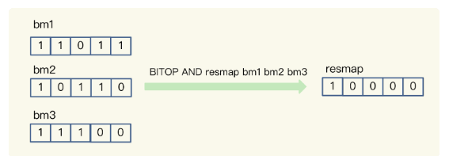
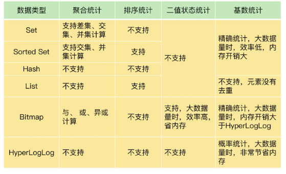

### 12|有一亿个keys要统计，应该用哪种集合？

##### **聚合统计**

**所谓的聚合统计，就是指统计多个集合元素的聚合结果**，包括：**统计多个集合的共有元素（交集统计）；把两个集合相比，统计其中一个集合独有的元素（差集统计）；统计多个集合的所有元素（并集统计）**。  

场景：在移动应用中，需要统计每天的新增用户数和第二天的留存用户数。

方案：要完成这个统计任务，我们可以用一个集合记录所有登录过 App 的用户 ID，同时，用另一个集合记录每一天登录过 App 的用户 ID。

**Set** 的差集、并集和交集的计算复杂度较高，在数据量较大的情况下，如果直接执行这些计算，会导致 Redis 实例阻塞。所以，我给你分享一个小建议：**你可以从主从集群中选择一个从库，让它专门负责聚合计算，或者是把数据读取到客户端，在客户端来完成聚合统计**。

##### **排序统计**

场景：在电商网站的商品评论中，需要统计评论列表中的最新评论；

在 Redis 常用的 4 个集合类型中（List、Hash、Set、Sorted Set），List 和 Sorted Set 就属于有序集合。

最新评论列表包含了所有评论中的最新留言，这就要求集合类型能对元素保序，也就是说，集合中的元素可以按序排列，这种对元素保序的集合类型叫作有序集合。

**List 是按照元素进入 List 的顺序进行排序的，而 Sorted Set 可以根据元素的权重来排序，我们可以自己来决定每个元素的权重值**。

**使用 List 会有问题**，List 是通过元素在 List 中的位置来排序的，当有一个新元素插入时，原先的元素在 List 中的位置都后移了一位，比如说原来在第 1 位的元素现在排在了第 2 位。所以，对比新元素插入前后，List 相同位置上的元素就会发生变化，用 LRANGE 读取时，就会读到旧元素。

和 List 相比，**Sorted Set** 就不存在这个问题，因为它是根据元素的实际权重来排序和获取数据的。

我们可以按评论时间的先后给每条评论设置一个权重值，然后再把评论保存到 Sorted Set 中。Sorted Set 的 ZRANGEBYSCORE 命令就可以按权重排序后返回元素。这样的话，即使集合中的元素频繁更新，Sorted Set 也能通过 ZRANGEBYSCORE 命令准确地获取到按序排列的数据。

假设越新的评论权重越大，目前最新评论的权重是 N，我们执行下面的命令时，就可以获得最新的 10 条评论。

`ZRANGEBYSCORE comments N-9 N`

所以，在**面对需要展示最新列表、排行榜等场景时，如果数据更新频繁或者需要分页显示，建议你优先考虑使用 Sorted Set**  。

##### 二值状态统计

场景：在签到打卡中，需要统计一个月内连续打卡的用户数；

这里的二值状态就是指集合元素的取值就只有 0 和 1 两种。在签到打卡的场景中，我们只用记录签到（1）或未签到（0），所以它就是非常典型的二值状态。

在签到统计时，每个用户一天的签到用 1 个 bit 位就能表示，一个月（假设是 31 天）的签到情况用 31 个 bit 位就可以，而一年的签到也只需要用 365 个 bit 位，根本不用太复杂的集合类型。这个时候，我们就可以选择 **Bitmap**。这是 Redis 提供的扩展数据类型。

**Bitmap 本身是用 String 类型作为底层数据结构实现的一种统计二值状态的数据类型。String 类型是会保存为二进制的字节数组，所以，Redis 就把字节数组的每个 bit 位利用起来，用来表示一个元素的二值状态**。你可以把 **Bitmap 看作是一个 bit 数组**。

Bitmap 提供了 GETBIT/SETBIT 操作，使用一个偏移值 offset 对 bit 数组的某一个 bit 位进行读和写。不过，需要注意的是，Bitmap 的偏移量是从 0 开始算的，也就是说 offset的最小值是 0。当使用 SETBIT 对一个 bit 位进行写操作时，这个 bit 位会被设置为 1。Bitmap 还提供了 BITCOUNT 操作，用来统计这个 bit 数组中所有“1”的个数。  

假设我们要统计 ID 3000 的用户在 2020 年 8 月份的签到情况，就可以按照下面的步骤进行操作。

第一步，执行下面的命令，记录该用户 8 月 3 号已签到. `SETBIT uid:sign:3000:202008 2 1 `

第二步，检查该用户 8 月 3 日是否签到,`GETBIT uid:sign:3000:202008 2 `

第三步，统计该用户在 8 月份的签到次数, `BITCOUNT uid:sign:3000:202008`

如果记录了 1 亿个用户 10 天的签到情况，你有办法统计出这 10 天连续签到的用户总数吗？

**Bitmap 支持用 BITOP 命令对多个 Bitmap 按位做“与”“或”“异或”的操作，操作的结果会保存到一个新的 Bitmap 中**。我以按位“与”操作为例来具体解释一下。从下图中，可以看到，三个 Bitmap bm1、bm2 和 bm3，对应 bit 位做“与”操作，结果保存到了一个新的 Bitmap 中（示例中，这个结果 Bitmap 的 key 被设为“resmap”）。

在统计 1 亿个用户连续 10 天的签到情况时，你可以把每天的日期作为 key，每个 key 对应一个 1 亿位的 Bitmap，每一个 bit 对应一个用户当天的签到情况。

接下来，我们对 10 个 Bitmap 做“与”操作，得到的结果也是一个 Bitmap。在这个 Bitmap 中，只有 10 天都签到的用户对应的 bit 位上的值才会是 1。最后，我们可以用 BITCOUNT 统计下 Bitmap 中的 1 的个数，这就是连续签到 10 天的用户总数。

所以，**如果只需要统计数据的二值状态，例如商品有没有、用户在不在等，就可以使用Bitmap**，因为它只用一个 bit 位就能表示 0 或 1。在记录海量数据时，Bitmap 能够有效地节省内存空间。

##### 基数统计

场景：在网页访问记录中，需要统计独立访客（Unique Visitor，UV）量。

**基数统计就是指统计一个集合中不重复的元素个数。对应到我们刚才介绍的场景中，就是统计网页的 UV**。

**在 Redis 的集合类型中，Set 类型默认支持去重，所以看到有去重需求时，我们可能第一时间就会想到用 Set 类型**。

我们来结合一个例子看一看用 Set 的情况。有一个用户 user1 访问 page1 时，你把这个信息加到 Set 中：`SADD page1:uv user1` 

对于一个搞大促的电商网站而言，这样的页面可能有成千上万个，**如果每个页面都用这样的一个 Set，就会消耗很大的内存空间**。

你也可以用 Hash 类型记录 UV ，但是，和 Set 类型相似，当页面很多时，Hash 类型也会消耗很大的内存空间。那么，有什么办法既能完成统计，还能节省内存吗？

**HyperLogLog 是一种用于统计基数的数据集合类型，它的最大优势就在于，当集合元素数量非常多时，它计算基数所需的空间总是固定的，而且还很小**。

在 Redis 中，每个 HyperLogLog 只需要花费 12 KB 内存，就可以计算接近 2^64 个元素的基数。

在统计 UV 时，你可以用 PFADD 命令（用于向 HyperLogLog 中添加新元素）把访问页面的每个用户都添加到 HyperLogLog 中。

`PFADD page1:uv user1 user2 user3 user4 user5`

接下来，就可以用 PFCOUNT 命令直接获得 page1 的 UV 值了，这个命令的作用就是返回 HyperLogLog 的统计结果。

`PFCOUNT page1:uv`

不过，有一点需要你注意一下，**HyperLogLog 的统计规则是基于概率完成的，所以它给出的统计结果是有一定误差的，标准误算率是 0.81%**。这也就意味着，你使用 HyperLogLog 统计的 UV 是 100 万，但实际的 UV 可能是 101 万。虽然误差率不算大，但是，如果你需要精确统计结果的话，最好还是继续用 Set 或 Hash 类型。

##### 总结

