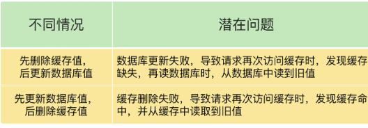
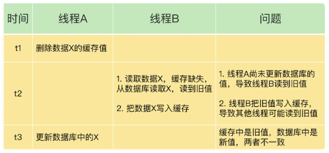
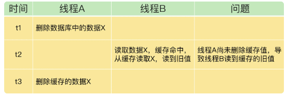
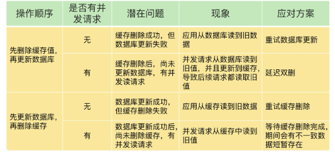

### 25 | 缓存异常（上）：如何解决缓存和数据库的数据不一致问题？

在实际应用 Redis 缓存时，我们经常会遇到一些异常问题，概括来说有 4 个方面：**缓存中的数据和数据库中的不一致；缓存雪崩；缓存击穿和缓存穿透**。

**缓存和数据库的数据不一致是如何发生的**？

首先，我们得清楚“数据的一致性”具体是啥意思。其实，这里的“一致性”包含了两种情况：

- **缓存中有数据，那么，缓存的数据值需要和数据库中的值相同**；
- **缓存中本身没有数据，那么，数据库中的值必须是最新值**。

不符合这两种情况的，就属于缓存和数据库的数据不一致问题了。不过，当缓存的读写模式不同时，缓存数据不一致的发生情况不一样，我们的应对方法也会有所不同，所以，我们先按照缓存读写模式，来分别了解下不同模式下的缓存不一致情况。

23 讲有介绍，根据是否接收写请求，我们可以把缓存分成**读写缓存和只读缓存**。

**对于读写缓存来说**，如果要对数据进行增删改，就需要在缓存中进行，同时还要根据采取的写回策略，决定是否同步写回到数据库中。

- **同步直写策略**：**写缓存时，也同步写数据库，缓存和数据库中的数据一致**；
- **异步写回策略**：**写缓存时不同步写数据库，等到数据从缓存中淘汰时，再写回数据库**。使用这种策略时，如果数据还没有写回数据库，缓存就发生了故障，那么，此时，数据库就没有最新的数据了。

**读写缓存数据一致性问题采用同步直写策略**

所以，**对于读写缓存来说，要想保证缓存和数据库中的数据一致，就要采用同步直写策略**。不过，需要注意的是，**如果采用这种策略，就需要同时更新缓存和数据库**。所以，**我们要在业务应用中使用事务机制，来保证缓存和数据库的更新具有原子性**，也就是说，两者要不一起更新，要不都不更新，返回错误信息，进行重试。否则，我们就无法实现同步直写。

当然，在有些场景下，我们对数据一致性的要求可能不是那么高，比如说缓存的是电商商品的非关键属性或者短视频的创建或修改时间等，那么，我们可以使用异步写回策略。

#### 只读缓存删除缓存值、更新数据库一方失败时

下面我们再来说说**只读缓存**。**原理**：**对于只读缓存来说，如果有数据新增，会直接写入数据库**；而**有数据删改时，就需要把只读缓存中的数据标记为无效**。这样一来，**应用后续再访问这些增删改的数据时，因为缓存中没有相应的数据，就会发生缓存缺失**。**此时，应用再从数据库中把数据读入缓存，这样后续再访问数据时，就能够直接从缓存中读取了**。

接下来，我以 Tomcat 向 MySQL 中写入和删改数据为例，来给你解释一下，数据的增删改操作具体是如何进行的，如下图所示：


那么，这个过程中会不会出现数据不一致的情况呢？

1. **新增数据**

如果是新增数据，数据会直接写到数据库中，不用对缓存做任何操作，此时，缓存中本身就没有新增数据，而数据库中是最新值，这种情况符合我们刚刚所说的一致性的第 2 种情况，所以，此时，缓存和数据库的数据是一致的。

2. **删改数据**

**如果发生删改操作，应用既要更新数据库，也要在缓存中删除数据**。**这两个操作如果无法保证原子性，也就是说，要不都完成，要不都没完成，此时，就会出现数据不一致问题了**。

我们假设应用先删除缓存，再更新数据库，如果缓存删除成功，但是数据库更新失败，那么，应用再访问数据时，缓存中没有数据，就会发生缓存缺失。然后，应用再访问数据库，但是数据库中的值为旧值，应用就访问到旧值了。例子如下图所示：


如果我们先更新数据库，再删除缓存中的值，是不是就可以解决这个问题呢？

如果应用先完成了数据库的更新，但是，在删除缓存时失败了，那么，数据库中的值是新值，而缓存中的是旧值，这肯定是不一致的。这个时候，如果有其他的并发请求来访问数据，按照正常的缓存访问流程，就会先在缓存中查询，但此时，就会读到旧值了。例子如下图所示：


两种情况总结如下图：



##### 如何解决数据不一致问题？

##### 一种方案：重试机制

具体来说，**可以把要删除的缓存值或者是要更新的数据库值暂存到消息队列中**（例如使用 Kafka 消息队列）。**当应用没有能够成功地删除缓存值或者是更新数据库值时，可以从消息队列中重新读取这些值，然后再次进行删除或更新**。

**如果能够成功地删除或更新，我们就要把这些值从消息队列中去除，以免重复操作，此时，我们也可以保证数据库和缓存的数据一致了**。**否则的话，我们还需要再次进行重试**。**如果重试超过的一定次数，还是没有成功，我们就需要向业务层发送报错信息了**。

下图显示了先更新数据库，再删除缓存值时，如果缓存删除失败，再次重试后删除成功的情况。


刚刚说的是在更新数据库和删除缓存值的过程中，其中一个操作失败的情况，**实际上，即使这两个操作第一次执行时都没有失败，当有大量并发请求时，应用还是有可能读到不一致的数据**。

#### 删除缓存、更新数据库时有大量并发读操作

同样，我们按照不同的删除和更新顺序，分成两种情况来看。在这两种情况下，我们的解决方法也有所不同。

###### 情况一：先删除缓存，再更新数据库

假设线程 A 删除缓存值后，还没有来得及更新数据库（比如说有网络延迟），线程 B 就开始读取数据了，那么这个时候，线程 B 会发现缓存缺失，就只能去数据库读取。这会带来两个问题：

- 线程 B 读取到了旧值；
- 线程 B 是在缓存缺失的情况下读取的数据库，所以，它还会把旧值写入缓存，这可能会导致其他线程从缓存中读到旧值。

等到线程 B 从数据库读取完数据、更新了缓存后，线程 A 才开始更新数据库，此时，缓存中的数据是旧值，而数据库中的是最新值，两者就不一致了。



这该怎么办呢？我来给你提供一种解决方案。

**在线程 A 更新完数据库值以后，我们可以让它先 sleep 一小段时间，再进行一次缓存删除操作**。

**之所以要加上 sleep 的这段时间，就是为了让线程 B 能够先从数据库读取数据，再把缺失的数据写入缓存，然后，线程 A 再进行删除**。所以，**线程 A sleep 的时间，就需要大于线程 B 读取数据再写入缓存的时间**。这个时间怎么确定呢？建议你在业务程序运行的时候，统计下线程读数据和写缓存的操作时间，以此为基础来进行估算。

###### 延迟双删

**这样一来，其它线程读取数据时，会发现缓存缺失，所以会从数据库中读取最新值**。**因为这个方案会在第一次删除缓存值后，延迟一段时间再次进行删除**，所以我们也把它叫做“**延迟双删**”。

下面的这段伪代码就是“延迟双删”方案的示例：

```java
redis.delKey(X)
db.update(X)
Thread.sleep(N)
redis.delKey(X)
```

###### 情况二：先更新数据库值，再删除缓存值。

**如果线程 A 删除了数据库中的值，但还没来得及删除缓存值，线程 B 就开始读取数据了，那么此时，线程 B 查询缓存时，发现缓存命中，就会直接从缓存中读取旧值**。不过，在这种情况下，如果其他线程并发读缓存的请求不多，那么，就不会有很多请求读取到旧值。而且，线程 A 一般也会很快删除缓存值，这样一来，其他线程再次读取时，就会发生缓存缺失，进而从数据库中读取最新值。所以，这种情况对业务的影响较小。



缓存和数据库的数据不一致一般是由两个原因导致的：

- **删除缓存值或更新数据库失败而导致数据不一致**，你可以使用重试机制确保删除或更新操作成功。
- 在删除缓存值、更新数据库的这两步操作中，有其他线程的并发读操作，导致其他线程读取到旧值，应对方案是延迟双删。

#### 总结

**对于读写缓存来说，如果我们采用同步写回策略，那么可以保证缓存和数据库中的数据一致**。只读缓存的情况比较复杂，如下图。



**针对只读缓存来说，我们既可以先删除缓存值再更新数据库，也可以先更新数据库再删除缓存**。我的建议是，**优先使用先更新数据库再删除缓存的方法**，原因主要有两个：

- 先删除缓存值再更新数据库，有可能导致请求因缓存缺失而访问数据库，给数据库带来压力；
- 如果业务应用中读取数据库和写缓存的时间不好估算，那么，延迟双删中的等待时间就不好设置。

不过，当使用先更新数据库再删除缓存时，也有个地方需要注意，如果业务层要求必须读取一致的数据，那么，**我们就需要在更新数据库时，先在 Redis 缓存客户端暂存并发读请求，等数据库更新完、缓存值删除后，再读取数据，从而保证数据一致性**。如何暂存？哈哈哈哈，虽然我还不懂。

#### 问题

在只读缓存中进行数据的删改操作时，需要在缓存中删除相应的缓存值。我想请你思考一下，如果在这个过程中，我们不是删除缓存值，而是直接更新缓存的值，你觉得和删除缓存值相比，有什么好处和不足吗？

##### 答案