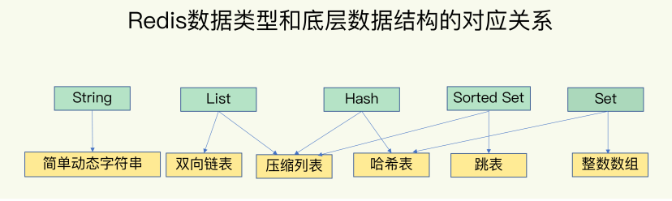
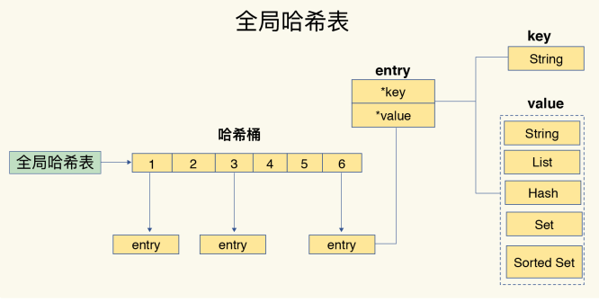
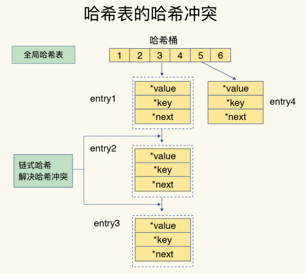
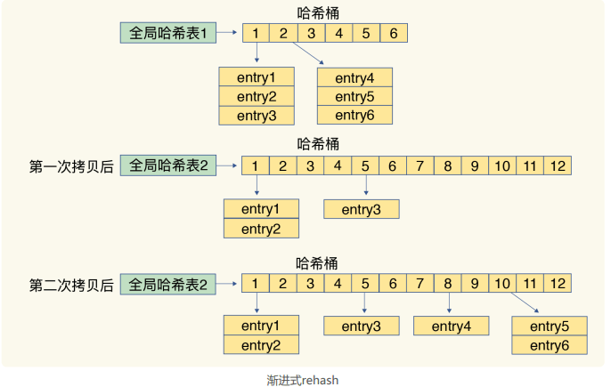
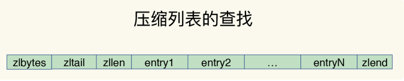
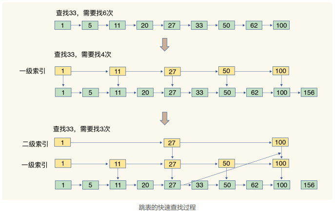
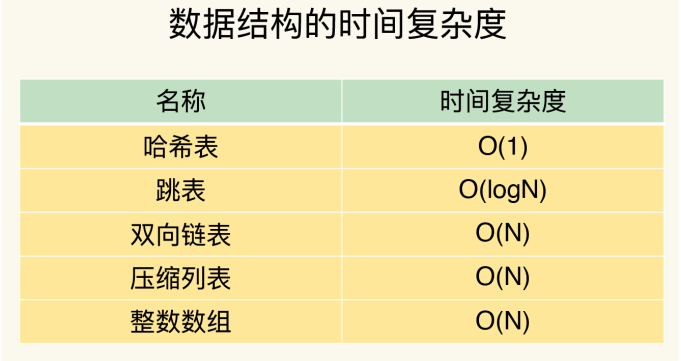

### 02 | 数据结构：快速的Redis有哪些慢操作？  

在线的[redis环境](https://try.redis.io/) 

为什么Redis会这么快？它接收到一个键值对操作后，能以**微秒级别**的速度找到数据，并快速完成操作。  

一方面，这是因为它是内存数据库，所有操作都在内存上完成，内存的访问速度本身就很快。另一方面，这要归功于它的数据结构。这是因为，键值对是按一定的数据结构来组织的，**操作键值对最终就是对数据结构进行增删改查操作**，所以高效的数据结构是 Redis 快速处理数据的基础。  

#### 数据类型和数据结构对应关系

简单来说redis有主要这些数据类型：String（字符串）、List（列表）、Hash（哈希）、Set（集合）和 Sorted Set（有序集合）。这些数据类型的底层数据结构一共有6种，分别是简单动态字符串、双向链表、压缩列表、哈希表、跳表和整数数组 。对应关系如下：

List、Hash、Set 和 Sorted Set  这四种称为**集合类型**， **一个键对应了一个集合的数据**。

#### 键和值本身之间用什么结构组织

这些数据结构都是值的底层实现，**键和值本身之间用什么结构组织**？

为了实现从键到值的快速访问，**Redis 使用了一个哈希表来保存所有键值对**。

一个哈希表，其实就是一个数组，**数组的每个元素称为一个哈希桶**。所以，我们常说，**一个哈希表是由多个哈希桶组成的，每个哈希桶中保存了键值对数据**。  

哈希桶中的元素都是指向他们的指针，分别指向了实际的key和value值。在下图中，可以看到，哈希桶中的 entry 元素中保存了 * key和 * value指针，分别指向了实际的键和值，这样一来，即使值是一个集合，也可以通过 * value指针被查找到。

因为这个哈希表保存了所有的键值对，所以，我也把它称为**全局哈希表**。哈希表的最大好处很明显，就是让我们可以**用 O(1) 的时间复杂度来快速查找到键值对**——我们只需要计算键的哈希值，就可以知道它所对应的哈希桶位置，然后就可以访问相应的 entry 元素。

但是，**当往 Redis 中写入大量数据后**，就可能发现操作有时候突然变慢了。这是因为 **哈希表的冲突问题 和 rehash 可能带来的操作阻塞**。

#### 为什么hash表操作变慢了 

当你往哈希表中写入更多数据时，哈希冲突是不可避免的问题。  

如果哈希表里写入的数据越来越多，哈希冲突可能也会越来越多，这就会导致**某些哈希冲突链过长，进而导致这个链上的元素查找耗时长，效率降低**。对于追求“快”的 Redis 来说，这是不太能接受的。  

所以，**Redis 会对哈希表做 rehash 操作**。**rehash 也就是增加现有的哈希桶数量，让逐渐增多的 entry 元素能在更多的桶之间分散保存，减少单个桶中的元素数量，从而减少单个桶中的冲突**。

##### **rehash 过程**

为了使 rehash 操作更高效，Redis 默认使用了两个全局哈希表：哈希表 1 和哈希表 2。一开始，当你刚插入数据时，默认使用哈希表 1，此时的哈希表 2 并没有被分配空间。随着数据逐步增多，Redis 开始执行 rehash，这个过程分为三步：  

1. 给哈希表 2 分配更大的空间，例如是当前哈希表 1 大小的两倍；
2. 把哈希表 1 中的数据重新映射并拷贝到哈希表 2 中；
3. 释放哈希表 1 的空间。  

哈希表1留着下一次扩容备用。这个过程看似简单，但是**第二步涉及大量的数据拷贝**，**如果一次性把哈希表 1 中的数据都迁移完，会造成 Redis 线程阻塞，无法服务其他请求**。此时，Redis 就无法快速访问数据了。  

##### 渐进式 rehash

简单来说就是在第二步拷贝数据时，Redis 仍然正常处理客户端请求，**每处理一个请求时，从哈希表 1 中的第一个索引位置开始，顺带着将这个索引位置上的所有 entries 拷贝到哈希表 2 中；等处理下一个请求时，再顺带拷贝哈希表 1 中的下一个索引位置的entries**。如下图所示：

这样就巧妙地把一次性大量拷贝的开销，分摊到了多次处理请求的过程中，避免了耗时操作，保证了数据的快速访问。

#### 集合数据操作效率

和 String 类型不同，一个集合类型的值，第一步是通过全局哈希表找到对应的哈希桶位置，第二步是在集合中再增删改查。那么，集合的操作效率和哪些因素相关呢？  

（1）**与集合的底层数据结构有关**。例如，使用哈希表实现的集合要比使用链表实现的集合访问效率更高。

（2）**操作效率和这些操作本身的执行特点有关**。比如读写一个元素的操作比读写所有元素的效率高。

##### 底层数据结构

###### 压缩列表

**压缩列表**实际上**类似于一个数组，数组中的每一个元素都对应保存一个数据**。和数组不同的是，**压缩列表在表头有三个字段 zlbytes、zltail 和 zllen，分别表示列表长度、列表尾的偏移量和列表中的 entry 个数**；**压缩列表在表尾还有一个 zlend，表示列表结束**。

在压缩列表中，如果我们要**查找定位第一个元素和最后一个元素**，可以通过表头三个字段的长度直接定位，**复杂度是 O(1)**。而**查找其他元素时**，就没有这么高效了，只能逐个查找，此时的**复杂度就是 O(N)** 了。

###### 跳表

有序链表只能逐一查找元素，导致操作起来非常缓慢，于是就出现了跳表。具体来说，**跳表在链表的基础上，增加了多级索引，通过索引位置的几个跳转，实现数据的快速定位**，如下图所示：  

如果我们要查找33，需要从头开始遍历链表，查找6次。此时，复杂度为 O(N)，查找效率很低。

为了提高查询速度，我们增加了**一级索引**：**从第一个元素开始，每两个元素选一个出来作为索引**。这些索引再通过指针指向原始的链表。此时，我们只需要查找4次就可以找到元素 33 了。

如果我们还想再快，可以增加**二级索引**：从**一级索引**中，再抽取部分元素作为二级索引。例如，从一级索引中抽取 1、27、100 作为二级索引，二级索引指向一级索引。这样，我们只需要 3 次查找，就能定位到元素 33 了。

**当数据量很大时，跳表的查找复杂度就是 O(logN**)。  

时间复杂度如下：

##### 不同操作的复杂度

集合类型的操作类型很多，有读写单个集合元素的，例如 HGET、HSET，也有操作多个元素的，例如 SADD，还有对整个集合进行遍历操作的，例如 SMEMBERS。这么多操作，它们的复杂度也各不相同。而复杂度的高低又是我们选择集合类型的重要依据。

四句口诀：

**单元素操作是基础**；
**范围操作非常耗时**；
**统计操作通常高效**；
**例外情况只有几个**。  

**单元素操作，是指每一种集合类型对单个数据实现的增删改查操作**，例如，Hash 类型的 HGET、HSET 和 HDEL，复杂度 O(1)，Set 类型的 SADD、SREM、SRANDMEMBER，复杂度O(1) 等。这些操作的复杂度由集合采用的数据结构决定。

集合类型支持同时对多个元素进行增删改查，例如 Hash类型的 HMGET 和 HMSET，Set 类型的 SADD 也支持同时增加多个元素。此时，这些操作的复杂度，就是由单个元素操作复杂度和元素个数决定的。例如，HMSET 增加 M 个元素时，复杂度就从 O(1) 变成 O(M) 了。

**范围操作，是指集合类型中的遍历操作，可以返回集合中的所有数据**。比如 Hash类型的 HGETALL 和 Set 类型的 SMEMBERS，或者返回一个范围内的部分数据，比如 List类型的 LRANGE 和 ZSet 类型的 ZRANGE。这类操作的复杂度一般是 O(N)，比较耗时，我们应该尽量避免。

**Redis 从2.8版本提供了 SCAN 系列操作**（包括 HSCAN，SSCAN 和ZSCAN），这类操作实现了渐进式遍历，每次只返回有限数量的数据。这样一来，相比于HGETALL、SMEMBERS 这类操作来说，就避免了一次性返回所有元素而导致的 Redis 阻塞。  

**统计操作，是指集合类型对集合中所有元素个数的记录**，例如 LLEN 和 SCARD。这类操作复杂度只有 O(1)，这是因为**当集合类型采用压缩列表、双向链表、整数数组这些数据结构时，这些结构中专门记录了元素的个数统计**，因此可以高效地完成相关操作。

**例外情况，是指某些数据结构的特殊记录**，例如压缩列表和双向链表都会记录表头和表尾的偏移量。这样一来，对于 List 类型的 LPOP、RPOP、LPUSH、RPUSH 这四个操作来说，它们是在列表的头尾增删元素，这就可以通过偏移量直接定位，所以它们的复杂度也只有 O(1)，可以实现快速操作。

#### 使用建议

集合类型的范围操作，因为要遍历底层数据结构，复杂度通常是 O(N)。建议这里用**其他命令来替代**，例如可以用 SCAN 来替代，避免在 Redis 内部产生费时的全集合遍历操作。

对于复杂度较高的 List 类型，它的两种底层实现结构：双向链表和压缩列表的操作复杂度都是O(N)。  因此，建议**因地制宜地使用 List  类型**。例如，既然它的 POP/PUSH 效率很高，那么就将它主要用于 FIFO 队列场景，而不是作为一个可以随机读写的集合。

