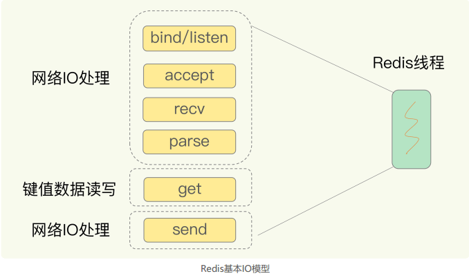

### 03 | 为什么单线程的 Redis 能这么快

为什么单线程的 Redis 能那么快？  

首先，我们通常说，**Redis 是单线程，主要是指 Redis 的网络 IO 和键值对读写是由一个线程来完成的**，这也是 Redis 对外提供键值存储服务的主要流程。**但 Redis 的其他功能，比如持久化、异步删除、集群数据同步等，其实是由额外的线程执行的**。  

所以，严格来说，Redis 并不是单线程，但是我们一般把 Redis 称为单线程高性能。需要弄明白这个问题，我们要搞懂 **Redis 的单线程设计机制以及多路复用机制**。

#### Redis 为什么用单线程

##### 多线程的问题

我们经常会听到一种说法：“使用多线程，可以增加系统吞吐率，或是可以增加系统扩展性。”的确，**对于一个多线程的系统来说，在有合理的资源分配的情况下，可以增加系统中处理请求操作的资源实体，进而提升系统能够同时处理的请求数**，即吞吐率。

但是，通常情况下，在我们采用多线程后，**如果没有良好的系统设计**，实际得到的结果，其实是右图所展示的那样。我们刚开始增加线程数时，系统吞吐率会增加，但是，再进一步增加线程时，系统吞吐率就增长迟缓了，有时甚至还会出现下降的情况。

  

为什么会出现这种情况呢？一个关键的瓶颈在于，**系统中通常会存在被多线程同时访问的共享资源**，比如一个共享的数据结构。**当有多个线程要修改这个共享资源时，为了保证共享资源的正确性，就需要有额外的机制进行保证，而这个额外的机制，就会带来额外的开销**。  

**多线程编程模式面临的共享资源并发控制问题**。

并发访问控制以及采用多线程开发一般会引入同步原语来保护共享资源的并发访问，这也会降低系统代码的易调试性和可维护性。为了避免这些问题，Redis 直接采用了单线程模式。

#### 单线程 Redis 为什么这么快

通常来说，单线程的处理能力要比多线程差很多，但是 Redis 却能使用单线程模型达到每秒数十万级别的处理能力，这是为什么呢？其实，这是 Redis 多方面设计选择的一个综合结果。  

一方面，**Redis 的大部分操作在内存上完成，再加上它采用了高效的数据结构**，例如哈希表和跳表，这是它实现高性能的一个重要原因。

另一方面，就是 **Redis 采用了多路复用机制，使其在网络 IO 操作中能并发处理大量的客户端请求，实现高吞吐率**。  

##### 基本 IO 模型与阻塞点

以 Get 请求为例，SimpleKV 为了处理一个 Get 请求，需要监听客户端请求（bind/listen），和客户端建立连接（accept），从 socket 中读取请求（recv），解析客户端发送请求（parse），根据请求类型读取键值数据（get），最后给客户端返回结果，即向 socket 中写回数据（send）。  

但是这里的网络IO操作有潜在的阻塞点，分别时 accept() 和 recv()。当 Redis监听到一个客户端有连接请求，但一直未能成功建立起连接时，会阻塞在 accept() 函数这里，导致其他客户端无法和 Redis 建立连接。类似的，当 Redis 通过 recv() 从一个客户端读取数据时，如果数据一直没有到达，Redis 也会一直阻塞在 recv()。

这就导致 Redis 整个线程阻塞，无法处理其他客户端请求，效率很低。不过，幸运的是，**socket 网络模型本身支持非阻塞模式**。

#####  非阻塞模式

**在 socket 模型中，不同操作调用后会返回不同的套接字类型**。**socket() 方法会返回主动套接字**，然后**调用 listen() 方法，将主动套接字转化为监听套接字**，此时，可以监听来自客户端的连接请求。最后，**调用 accept() 方法接收到达的客户端连接，并返回已连接套接字**。

针对监听套接字，我们可以设置非阻塞模式：**当 Redis 调用 accept() 但一直未有连接请求到达时，Redis 线程可以返回处理其他操作，而不用一直等待**。但是，你要注意的是，**调用 accept() 时，已经存在监听套接字**了。

虽然 Redis 线程可以不用继续等待，但是总得有机制继续在监听套接字上等待后续连接请求，并在有请求时通知 Redis。  

类似的，我们也可以针对已连接套接字设置非阻塞模式：Redis 调用 recv() 后，如果已连接套接字上一直没有数据到达，Redis 线程同样可以返回处理其他操作。我们也需要有机制继续监听该已连接套接字，并在有数据达到时通知 Redis。

这样才能保证 Redis 线程，既不会像基本 IO 模型中一直在阻塞点等待，也不会导致 Redis无法处理实际到达的连接请求或数据。

至此，Linux 中的 IO 多路复用机制就要登场了。

##### 基于多路复用的高性能I/O模型

**Linux 中的 IO 多路复用机制是指一个线程处理多个 IO 流，就是我们经常听到的select/epoll 机制**。简单来说，**在 Redis 只运行单线程的情况下，该机制允许内核中，同时存在多个监听套接字和已连接套接字**。内核会一直监听这些套接字上的连接请求或数据请求。一旦有请求到达，就会交给 Redis 线程处理，这就实现了一个 Redis 线程处理多个IO 流的效果。

下图就是基于多路复用的 Redis IO 模型。图中的多个 FD 就是刚才所说的多个套接字。**Redis 网络框架调用 epoll 机制，让内核监听这些套接字**。此时，**Redis 线程不会阻塞在某一个特定的监听或已连接套接字上**，也就是说，不会阻塞在某一个特定的客户端请求处理上。正因为此，Redis 可以同时和多个客户端连接并处理请求，从而提升并发性。

**为了在请求到达时能通知到 Redis 线程，select/epoll 提供了基于事件的回调机制，即针对不同事件的发生，调用相应的处理函数**。

回调机制，**select/epoll 一旦监测到 FD 上有请求到达时，就会触发相应的事件**。  

**这些事件会被放进一个事件队列，Redis 单线程对该事件队列不断进行处理**。这样一来，Redis 无需一直轮询是否有请求实际发生，这就可以避免造成 CPU 资源浪费。同时，Redis 在对事件队列中的事件进行处理时，会调用相应的处理函数，这就实现了基于事件的回调。因为 Redis 一直在对事件队列进行处理，所以能及时响应客户端请求，提升Redis 的响应性能。

例如，两个请求，连接请求和读数据请求。这两个请求分别对应 Accept 事件和 Read 事件，Redis 分别对这两个事件注册 accept 和get 回调函数。当 Linux 内核监听到有连接请求或读数据请求时，就会触发 Accept 事件和 Read 事件，此时，内核就会回调 Redis 相应的 accept 和 get 函数进行处理。  

不过，需要注意的是，即使你的应用场景中部署了不同的操作系统，多路复用机制也是适用的。因为这个机制的实现有很多种，既有**基于 Linux 系统下的 select 和 epoll 实现**，也有**基于 FreeBSD 的 kqueue 实现**，以及**基于 Solaris 的 evport 实现**，这样，你可以根据Redis 实际运行的操作系统，选择相应的多路复用实现。  

#### 具体的关于redis的io多路复用的实例

[为什么单线程的 Redis 如何做到每秒数万 QPS ？](https://mp.weixin.qq.com/s/oeOfsgF-9IOoT5eQt5ieyw)

