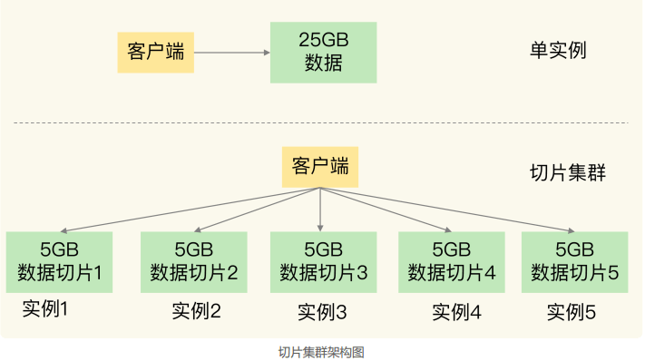
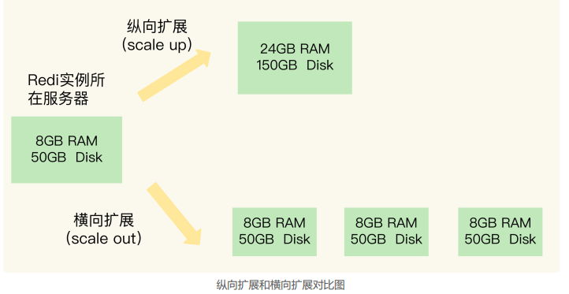
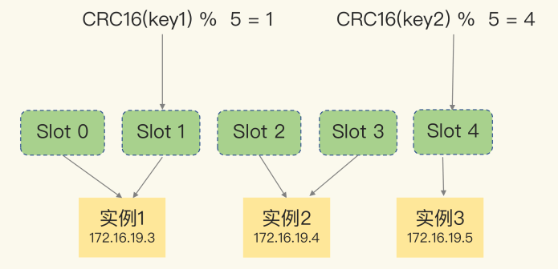
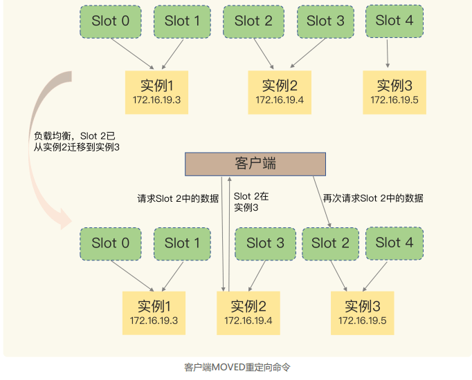
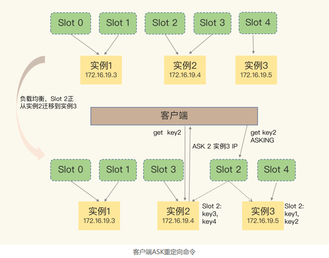
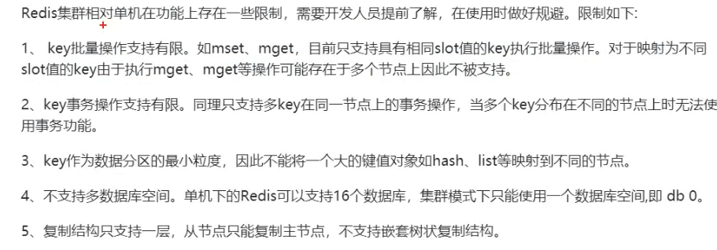
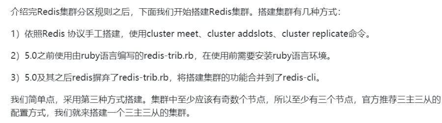

### 09 | 切片集群：数据增多了，是该加内存还是加实例

我曾遇到过这么一个需求：要用 Redis 保存 5000 万个键值对，每个键值对大约是 512B，为了能快速部署并对外提供服务，我们采用云主机来运行 Redis 实例，那么，该如何选择云主机的内存容量呢？

我粗略地计算了一下，这些键值对所占的内存空间大约是 25GB（5000 万 *512B）。所以，当时，我想到的第一个方案就是：选择一台 32GB 内存的云主机来部署 Redis。因为32GB 的内存能保存所有数据，而且还留有 7GB，可以保证系统的正常运行。同时，我还采用 RDB 对数据做持久化，以确保 Redis 实例故障后，还能从 RDB 恢复数据。  

但是，在使用的过程中，我发现，**Redis 的响应有时会非常慢**。后来，我们使用 INFO 命令查看 Redis 的 latest_fork_usec 指标值（表示最近一次 fork 的耗时），结果显示这个指标值特别高，快到秒级别了。

这跟 Redis 的持久化机制有关系。在使用 RDB 进行持久化时，Redis 会 fork 子进程来完成，fork 操作的用时和 Redis 的数据量是正相关的，而 fork 在执行时会阻塞主线程。**数据量越大，fork 操作造成的主线程阻塞的时间越长**。所以，**在使用 RDB 对 25GB 的数据进行持久化时，数据量较大，后台运行的子进程在 fork 创建时阻塞了主线程，于是就导致Redis 响应变慢了**。

 这时候，注意到了**切片集群**。虽然组建切片集群比较麻烦，但是它可以保存大量数据，而且对Redis 主线程的阻塞影响较小。  

#### 切片集群

**切片集群**，也叫**分片集群**，就是指**启动多个 Redis 实例组成一个集群，然后按照一定的规则，把收到的数据划分成多份，每一份用一个实例来保存**。如刚才的场景：



这样，实例在为 5GB 数据生成 RDB 时，数据量就小了很多，fork 子进程一般不会给主线程带来较长时间的阻塞。采用多个实例保存数据切片后，我们既能保存25GB 数据，又避免了 fork 子进程阻塞主线程而导致的响应突然变慢。  

#### 如何保存更多的数据

为了保存大量数据，有两种方案：**纵向扩展（scale up）和横向扩展（scale out）**。  

- **纵向扩展：升级单个 Redis 实例的资源配置**，包括增加内存容量、增加磁盘容量、使用更高配置的 CPU。就像下图中，原来的实例内存是 8GB，硬盘是 50GB，纵向扩展后，内存增加到24GB，磁盘增加到 150GB。
- **横向扩展：横向增加当前 Redis 实例的个数**，就像下图中，原来使用 1 个 8GB 内存、50GB 磁盘的实例，现在使用三个相同配置的实例。  



##### 纵向扩展优缺点

首先，**纵向扩展的好处是，实施起来简单、直接**。不过，这个方案也面临两个潜在的问
题。  

问题一：**当使用 RDB 对数据进行持久化时，如果数据量增加，需要的内存也会增加，主线程 fork 子进程时就可能会阻塞**。 不过，如果你不要求持久化保存 Redis 数据，那么，纵向扩展会是一个不错的选择。 

问题二：**纵向扩展会受到硬件和成本的限制**。这很容易理解，毕竟，把内存从 32GB 扩展到 64GB 还算容易，但是，要想扩充到 1TB，就会面临硬件容量和成本上的限制了。   

##### 横向扩展优缺点

要想保存更多的数据，采用这种方案的话，**只用增加 Redis 的实例个数就行了，不用担心单个实例的硬件和成本限制**。**在面向百万、千万级别的用户规模时，横向扩展的 Redis 切片集群会是一个非常好的选择**。

但是切片集群后不可避免地涉及到多个实力的分布式管理问题。

- **数据切片后，在多个实例之间如何分布**？
- **客户端怎么确定想要访问的数据在哪个实例上**？  

###### 数据切片和实例的对应分布关系

在切片集群中，数据需要分布在不同实例上，那么，数据和实例之间如何对应呢？ 这就和接下来我要讲的 **Redis Cluster** 方案有关了。不过，我们要先弄明白切片集群和 RedisCluster 的联系与区别。   

实际上，切片集群是一种保存大量数据的通用机制，这个机制可以有不同的实现方案。在Redis 3.0 之前，官方并没有针对切片集群提供具体的方案。从 3.0 开始，官方提供了一个名为 Redis Cluster 的方案，用于实现切片集群。Redis Cluster 方案中就规定了数据和实例的对应规则。

具体来说，**Redis Cluster 方案采用哈希槽**（Hash Slot，接下来我会直接称之为 Slot），**来处理数据和实例之间的映射关系**。在 Redis Cluster 方案中，一个切片集群共有 16384个哈希槽，这些哈希槽类似于数据分区，**每个键值对都会根据它的 key，被映射到一个哈希槽中**。  

具体的映射过程分为两大步：**首先根据键值对的 key，按照 CRC16 算法计算一个 16 bit的值；然后，再用这个 16bit 值对 16384 取模，得到 0~16383 范围内的模数，每个模数代表一个相应编号的哈希槽**。  

为什么是对 16384 取模，而不是其他的数值呢？

https://github.com/antirez/redis/issues/2576

https://www.cnblogs.com/rjzheng/p/11430592.html

> - Normal heartbeat packets carry the full configuration of a node, that can be replaced in an idempotent way with the old in order to update an old config. This means they contain the slots configuration for a node, in raw form, that uses 2k of space with16k slots, but would use a prohibitive 8k of space using 65k slots.
> - At the same time it is unlikely that Redis Cluster would scale to more than 1000 mater nodes because of other design tradeoffs.
>
> So 16k was in the right range to ensure enough slots per master with a max of 1000 maters, but a small enough number to propagate the slot configuration as a raw bitmap easily. Note that in small clusters the bitmap would be hard to compress because when N is small the bitmap would have slots/N bits set that is a large percentage of bits set.
>
> 正常的心跳包携带节点的完整配置，可以以幂等方式替换旧的配置，以便更新旧的配置。这意味着它们包含节点的插槽配置，以原始形式，使用2k的空间和16k插槽，但使用65k插槽将使用令人望而却步的8k空间。
>
> 同时，由于其他设计上的权衡，Redis集群不太可能扩展到超过1000个节点。
>
> 因此，16k(16384/1024=16)是一个合适的范围，可以确保每个主机有足够的插槽，最多有1000个主机，但这个数字足够小，可以很容易地将插槽配置传播为原始位图。请注意，在小集群中，位图很难压缩，因为当N很小时，位图将设置槽/N位，这是设置位的很大百分比。

那么，这些**哈希槽又是如何被映射到具体的 Redis 实例上的呢**？  

我们在部署 Redis Cluster 方案时，可以使用 cluster create 命令创建集群，此时，**Redis会自动把这些槽平均分布在集群实例上**。 

例如，如果集群中有 N 个实例，那么，每个实例上的槽个数为 16384/N 个。

当然， 我们也可以使用 cluster meet 命令手动建立实例间的连接，形成集群，再使用 cluster addslots 命令，指定每个实例上的哈希槽个数 。

举个例子，假设集群中不同 Redis 实例的内存大小配置不一，如果把哈希槽均分在各个实例上，在保存相同数量的键值对时，和内存大的实例相比，内存小的实例就会有更大的容量压力。遇到这种情况时，你可以根据不同实例的资源配置情况，使用 cluster addslots 命令手动分配哈希槽。

  

示意图中的切片集群一共有 3 个实例，同时假设有 5 个哈希槽，我们首先可以通过下面的命令手动分配哈希槽：实例 1 保存哈希槽 0 和 1，实例 2 保存哈希槽 2 和 3，实例 3 保存哈希槽 4。  

```java
redis-cli -h 172.16.19.3 –p 6379 cluster addslots 0,1
redis-cli -h 172.16.19.4 –p 6379 cluster addslots 2,3
redis-cli -h 172.16.19.5 –p 6379 cluster addslots 4
```

在集群运行的过程中，key1 和 key2 计算完 CRC16 值后，对哈希槽总个数 5 取模，再根据各自的模数结果，就可以被映射到对应的实例 1 和实例 3 上了。

**在手动分配哈希槽时，需要把 16384 个槽都分配完，否则Redis 集群无法正常工作**。  

但是，即使实例有了哈希槽的映射信息，客户端又是怎么知道要访问的数据在哪个实例上呢？

###### 客户端如何定位数据

在定位键值对数据时，它所处的哈希槽是可以通过计算得到的，这个计算可以在客户端发送请求时来执行。但是，要进一步定位到实例，还需要知道哈希槽分布在哪个实例上。

一般来说，**客户端和集群实例建立连接后，实例就会把哈希槽的分配信息发给客户端**。但是，**在集群刚刚创建的时候，每个实例只知道自己被分配了哪些哈希槽，是不知道其他实例拥有的哈希槽信息的**。  

那么，**客户端为什么可以在访问任何一个实例时，都能获得所有的哈希槽信息呢**？这是因为，**Redis 实例会把自己的哈希槽信息发给和它相连接的其它实例，来完成哈希槽分配信息的扩散**。**当实例之间相互连接后，每个实例就有所有哈希槽的映射关系了**。

客户端收到哈希槽信息后，会把哈希槽信息缓存在本地。当客户端请求键值对时，会先计算键所对应的哈希槽，然后就可以给相应的实例发送请求了。

但是，在集群中，实例和哈希槽的对应关系并不是一成不变的，最常见的变化有两个  ；

- **在集群中，实例有新增或删除，Redis 需要重新分配哈希槽**；  
- **为了负载均衡，Redis 需要把哈希槽在所有实例上重新分布一遍**。  

此时，实例之间还可以通过相互传递消息，获得最新的哈希槽分配信息，但是，客户端是无法主动感知这些变化的。这就会导致，它缓存的分配信息和最新的分配信息就不一致了，那该怎么办呢？  

Redis Cluster 方案提供了一种**重定向机制**，所谓的“重定向”，就是指，**客户端给一个实例发送数据读写操作时，这个实例上并没有相应的数据，客户端要再给一个新实例发送操作命令**。

那客户端又是怎么知道重定向时的新实例的访问地址呢？当客户端把一个键值对的操作请求发给一个实例时，如果这个实例上并没有这个键值对映射的哈希槽，那么，这个实例就会给客户端返回下面的 MOVED 命令响应结果，这个结果中就包含了新实例的访问地址。

 ```java
GET hello:key
(error) MOVED 13320 172.16.19.5:6379
 ```

其中，MOVED 命令表示，客户端请求的键值对所在的哈希槽 13320，实际是在172.16.19.5 这个实例上。通过返回的 MOVED 命令，就相当于把哈希槽所在的新实例的信息告诉给客户端了。

可以看到，由于负载均衡，Slot 2 中的数据已经从实例 2 迁移到了实例 3，但是，客户端缓存仍然记录着“Slot 2 在实例 2”的信息，所以会给实例 2 发送命令。**实例 2 给客户端返回一条 MOVED 命令，把Slot 2 的最新位置（也就是在实例 3 上），返回给客户端，客户端就会再次向实例 3 发送请求，同时还会更新本地缓存，把 Slot 2 与实例的对应关系更新过来**。  

 

需要注意的是，在上图中，当客户端给实例 2 发送命令时，Slot 2 中的数据已经全部迁移到了实例 3。在实际应用时，如果 Slot 2 中的数据比较多，就可能会出现一种情况：客户端向实例 2 发送请求，但此时，**Slot 2 中的数据只有一部分迁移到了实例 3，还有部分数据没有迁移**。这种情况下，客户端就会收到一条 ASK 报错信息：

```java
GET hello:key
(error) ASK 13320 172.16.19.5:6379
```

这个结果中的 ASK 命令就表示，客户端请求的键值对所在的哈希槽 13320，在 172.16.19.5 这个实例上，但是这个哈希槽正在迁移。此时，客户端需要先给 172.16.19.5 这个实例发送一个 ASKING 命令。这个命令的意思是，让这个实例允许执行客户端接下来发送的命令。然后，客户端再向这个实例发送 GET 命令，以读取数据。

**ASK 命令表示两层含义：第一，表明 Slot 数据还在迁移中；第二，ASK 命令把客户端所请求数据的最新实例地址返回给客户端**，此时，客户端需要给实例 3 发送 ASKING 命令，然后再发送操作命令。

和 MOVED 命令不同，**ASK 命令并不会更新客户端缓存的哈希槽分配信息**。  




#### 集群功能限制



#### 搭建集群

【【马士兵教育】2023新版Java面试题300问，金三银四快速通关，5天背完拿下30K！】 https://www.bilibili.com/video/BV1ay4y1D7o7/?p=21&share_source=copy_web&vd_source=3b1efacb505b91ba7db831546c052ed8




#### 每日一问

Redis Cluster 方案通过哈希槽的方式把键值对分配到不同的实例上，这个过程需要对键值对的 key 做 CRC 计算，然后再和哈希槽做映射，这样做有什么好处吗？如果用一个表直接把键值对和实例的对应关系记录下来（例如键值对 1 在实例 2 上，键值对 2 在实例 1 上），这样就不用计算 key 和哈希槽的对应关系了，只用查表就行了，Redis 为什么不这么做呢？ 

##### 答案

