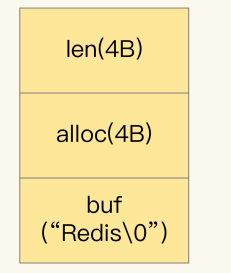
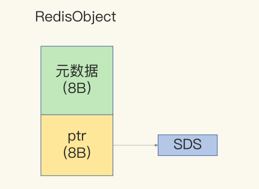
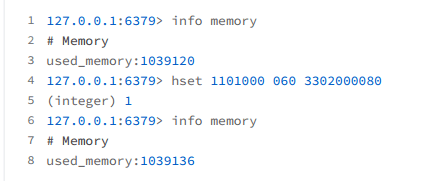

### 11 | “万金油”的String，为什么不好用了  

#### String 类型的内存空间消耗问题

分享一个需求。

当时，我们要开发一个图片存储系统，要求这个系统能快速地记录图片 ID 和图片在存储系统中保存时的 ID（可以直接叫作图片存储对象 ID）。同时，还要能够根据图片 ID 快速查找到图片存储对象 ID。  

因为图片数量巨大，所以我们就用 10 位数来表示图片 ID 和图片存储对象 ID，例如，图片 ID 为 1101000051，它在存储系统中对应的 ID 号是 3301000051。  

> photo_id: 1101000051
> photo_obj_id: 3301000051  

可以看到，图片 ID 和图片存储对象 ID 正好一一对应，是典型的“键 - 单值”模式，这和 String 类型提供的“一个键对应一个值的数据”的保存形式刚好契合。

而且，String 类型可以保存二进制字节流，就像“万金油”一样，只要把数据转成二进制字节数组，就可以保存了。

所以，我们的**第一个方案就是用 String 保存数据**。我们把图片 ID 和图片存储对象 ID 分别作为键值对的 key 和 value 来保存，其中，图片存储对象 ID 用了 String 类型。

刚开始，我们保存了 1 亿张图片，大约用了 6.4GB 的内存。但是，随着图片数据量的不断增加，我们的 Redis 内存使用量也在增加，结果就遇到了大内存 Redis 实例因为生成 RDB而响应变慢的问题。 

在这个过程中，我深入地研究了 String 类型的底层结构，找到了它内存开销大的原因：  **String 类型并不是适用于所有场合的，它有一个明显的短板，就是它保存数据时所消耗的内存空间较多**。

同时，还研究了集合类型的数据结构。我发现，集合类型有非常节省内存空间的底层实现结构，但是，集合类型保存的数据模式，是一个键对应一系列值，并不适合直接保存单值的键值对。所以，我们就**使用二级编码的方法，实现了用集合类型保存单值键值对，Redis 实例的内存空间消耗明显下降了** 。

#### 为什么 String 类型内存开销大

在刚才的案例中，我们保存了 1 亿张图片的信息，用了约 6.4GB 的内存，一个图片 ID 和图片存储对象 ID 的记录平均用了 64 字节。

但问题是，一组图片 ID 及其存储对象 ID 的记录，实际只需要 16 字节就可以了。

我们来分析一下。图片 ID 和图片存储对象 ID 都是 10 位数，我们可以用两个 8 字节的Long 类型表示这两个 ID。因为 8 字节的 Long 类型最大可以表示 2 的 64 次方的数值，所以肯定可以表示 10 位数。但是，为什么 String 类型却用了 64 字节呢。

除了**记录实际数据，String 类型还需要额外的内存空间记录数据长度、空间使用等信息，这些信息也叫作元数据**。**当实际保存的数据较小时，元数据的空间开销就显得比较大了**，有点“喧宾夺主”的意。

##### String 类型是怎么保存数据的呢？

当你保存 64 位有符号整数时，String 类型会把它保存为一个 8 字节的 Long 类型整数，这种保存方式通常也叫作 int 编码方式。

但是，**当你保存的数据中包含字符时，String 类型就会用简单动态字符串（Simple Dynamic String，SDS）结构体来保存**，如下图所示：

    

- buf：字节数组，保存实际数据。为了表示字节数组的结束，Redis 会自动在数组最后加一个“\0”，这就会额外占用 1 个字节的开销。  
- len：占 4 个字节，表示 buf 的已用长度。
- alloc：也占个 4 字节，表示 buf 的实际分配长度，一般大于 len。

可以看到，在 SDS 中，**buf 保存实际数据，而 len 和 alloc 本身其实是 SDS 结构体的额外开销**。还有一个 RedisObject 结构体的开销。

因为 Redis 的数据类型有很多，而且，**不同数据类型都有些相同的元数据要记录**（比如最后一次访问的时间、被引用的次数等），所以，**Redis 会用一个 RedisObject 结构体来统一记录这些元数据，同时指向实际数据**。

**一个 RedisObject 包含了 8 字节的元数据和一个 8 字节指针，这个指针再进一步指向具体数据类型的实际数据所在**，例如指向 String 类型的 SDS 结构所在的内存地址，可以看一下下面的示意图。  

为了节省内存空间，Redis 还对 Long 类型整数和 SDS 的内存布局做了专门的设计。  

一方面，**当保存的是 Long 类型整数时，RedisObject 中的指针就直接赋值为整数数据了，这样就不用额外的指针再指向整数了，节省了指针的空间开销**。

另一方面，**当保存的是字符串数据，并且字符串小于等于 44 字节时**，**RedisObject 中的元数据、指针和 SDS 是一块连续的内存区域，这样就可以避免内存碎片**。这种布局方式也被称为 **embstr 编码方式**。

##### int、embstr 和 raw 这三种编码模式 

现在，我们就可以计算 String 类型 的内存使用量了 。

 因为 10 位数的图片 ID 和图片存储对象 ID 是 Long 类型整数，所以可以直接用 int 编码的 RedisObject 保存。每个 int 编码的 RedisObject 元数据部分占 8 字节，指针部分被直接赋值为 8 字节的整数了。此时，每个 ID 会使用 16 字节，加起来一共是 32 字节。但是，另外的 32 字节去哪儿了呢？

**Redis 会使用一个全局哈希表保存所有键值对，哈希表的每一项是一个 dictEntry 的结构体，用来指向一个键值对。dictEntry 结构中有三个 8 字节的指针，分别指向 key、value 以及下一个 dictEntry，三个指针共 24 字节**，如下图所示：

但是，这三个指针只有 24 字节，为什么会占用了 32 字节呢？这就要提到 Redis 使用的内存分配库 jemalloc 了。

**jemalloc 在分配内存时，会根据我们申请的字节数 N，找一个比 N 大，但是最接近 N 的2 的幂次数作为分配的空间，这样可以减少频繁分配的次数**。

举个例子。如果你申请 6 字节空间，jemalloc 实际会分配 8 字节空间；如果你申请 24 字节空间，jemalloc 则会分配 32 字节。所以，在我们刚刚说的场景里，dictEntry 结构就占用了 32 字节。

#### 用什么数据可以节省内存

Redis 有一种底层数据结构，叫压缩列表（ziplist），这是一种非常节省内存的结构。表头有三个字段 zlbytes、zltail 和 zllen，分别表示列表长度、列表尾的偏移量，以及列表中的 entry 个数。压缩列表尾还有一个 zlend，表示列表结束。  

压缩列表之所以能节省内存，就在于它是用一系列连续的 entry 保存数据。每个 entry 的元数据包括下面几部分：

- **prev_len，表示前一个 entry 的长度**。prev_len 有两种取值情况：1 字节或 5 字节。取值 1 字节时，表示上一个 entry 的长度小于 254 字节。虽然 1 字节的值能表示的数值范围是 0 到 255，但是压缩列表中 zlend 的取值默认是 255，因此，就默认用 255表示整个压缩列表的结束，其他表示长度的地方就不能再用 255 这个值了。所以，当上一个 entry 长度小于 254 字节时，prev_len 取值为 1 字节，否则，就取值为 5 字节。
- **len：表示自身长度，4 字节**；
- **encoding：表示编码方式，1 字节**；  
- **content：保存实际数据**。  

我们以保存图片存储对象 ID 为例，来分析一下压缩列表是如何节省内存空间的。  

每个 entry 保存一个图片存储对象 ID（8 字节），此时，每个 entry 的 prev_len 只需要1 个字节就行，因为每个 entry 的前一个 entry 长度都只有 8 字节，小于 254 字节。这样一来，一个图片的存储对象 ID 所占用的内存大小是 14 字节（1+4+1+8=14），实际分配 16 字节。

Redis 基于压缩列表实现了 List、Hash 和 Sorted Set 这样的集合类型，这样做的最大好处就是节省了 dictEntry 的开销。当你用 String 类型时，一个键值对就有一个 dictEntry，要用 32 字节空间。但采用集合类型时，一个 key 就对应一个集合的数据，能保存的数据多了很多，但也只用了一个 dictEntry，这样就节省了内存。

#### 如何用集合类型保存单值的键值对？  

在保存单值的键值对时，可以采用基于 Hash 类型的二级编码方法。这里说的二级编码，就是把一个单值的数据拆分成两部分，前一部分作为 Hash 集合的 key，后一部分作为Hash 集合的 value，这样一来，我们就可以把单值数据保存到 Hash 集合中了。

以图片 ID 1101000060 和图片存储对象 ID 3302000080 为例，我们可以把图片 ID 的前7 位（1101000）作为 Hash 类型的键，把图片 ID 的最后 3 位（060）和图片存储对象ID 分别作为 Hash 类型值中的 key 和 value。

按照这种设计方法，我在 Redis 中插入了一组图片 ID 及其存储对象 ID 的记录，并且用info 命令查看了内存开销，我发现，增加一条记录后，内存占用只增加了 16 字节，如下所示：

    

在使用 String 类型时，每个记录需要消耗 64 字节，这种方式却只用了 16 字节，所使用的内存空间是原来的 1/4，满足了我们节省内存空间的需求。

“二级编码一定要把图片 ID 的前 7 位作为 Hash 类型的键，把最后 3 位作为 Hash 类型值中的 key 吗？”其实，**二级编码方法中采用的 ID 长度是有讲究的**。    

在第 2 讲中，我介绍过 Redis Hash 类型的两种底层实现结构，分别是压缩列表和哈希表  。那么，Hash 类型底层结构什么时候使用压缩列表，什么时候使用哈希表呢？其实，**Hash类型设置了用压缩列表保存数据时的两个阈值，一旦超过了阈值，Hash 类型就会用哈希表来保存数据**。

这两个阈值分别对应以下两个配置项：  

- hash-max-ziplist-entries：表示用压缩列表保存时哈希集合中的最大元素个数。  
- hash-max-ziplist-value：表示用压缩列表保存时哈希集合中单个元素的最大长度。

如果我们往 Hash 集合中写入的元素个数超过了 hash-max-ziplist-entries，或者写入的单个元素大小超过了 hash-max-ziplist-value，Redis 就会自动把 Hash 类型的实现结构由压缩列表转为哈希表。

一旦从压缩列表转为了哈希表，Hash 类型就会一直用哈希表进行保存，而不会再转回压缩列表了。在节省内存空间方面，哈希表就没有压缩列表那么高效了。

**为了能充分使用压缩列表的精简内存布局，我们一般要控制保存在 Hash 集合中的元素个数**。所以，在刚才的二级编码中，我们只用图片 ID 最后 3 位作为 Hash 集合的 key，也就保证了 Hash 集合的元素个数不超过 1000，同时，我们把 hash-max-ziplist-entries 设置为 1000，这样一来，Hash 集合就可以一直使用压缩列表来节省内存空间了。

SDS 相比于 C 语言中的字符串有如下提升：

1. **可以避免缓冲区溢出**：C 语言中的字符串被修改（比如拼接）时，一旦没有分配足够长度的内存空间，就会造成缓冲区溢出。SDS 被修改时，会先根据 len 属性检查空间大小是否满足要求，如果不满足，则先扩展至所需大小再进行修改操作。
2. **获取字符串长度的复杂度较低**：C 语言中的字符串的长度通常是经过遍历计数来实现的，时间复杂度为 O(n)。SDS 的长度获取直接读取 len 属性即可，时间复杂度为 O(1)。
3. **减少内存分配次数**：为了避免修改（增加/减少）字符串时，每次都需要重新分配内存（C 语言的字符串是这样的），SDS 实现了空间预分配和惰性空间释放两种优化策略。当 SDS 需要增加字符串时，Redis 会为 SDS 分配好内存，并且根据特定的算法分配多余的内存，这样可以减少连续执行字符串增长操作所需的内存重分配次数。当 SDS 需要减少字符串时，这部分内存不会立即被回收，会被记录下来，等待后续使用（支持手动释放，有对应的 API）。
4. **二进制安全**：C 语言中的字符串以空字符 `\0` 作为字符串结束的标识，这存在一些问题，像一些二进制文件（比如图片、视频、音频）就可能包括空字符，C 字符串无法正确保存。SDS 使用 len 属性判断字符串是否结束，不存在这个问题。

------

著作权归Guide所有 原文链接：https://javaguide.cn/database/redis/redis-questions-01.html#string-%E7%9A%84%E5%BA%95%E5%B1%82%E5%AE%9E%E7%8E%B0%E6%98%AF%E4%BB%80%E4%B9%88

