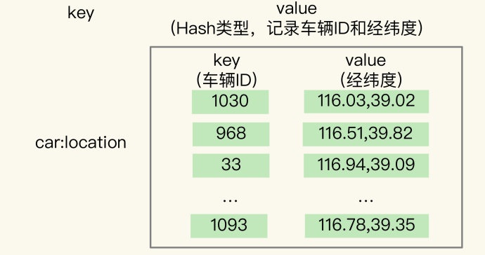
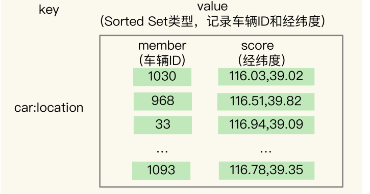
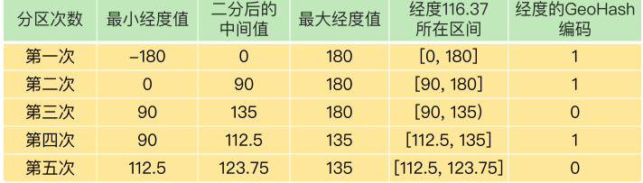
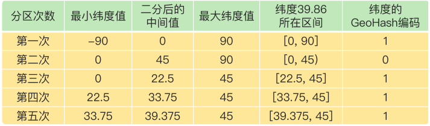
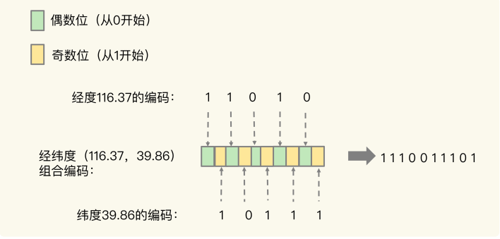
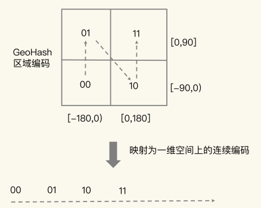
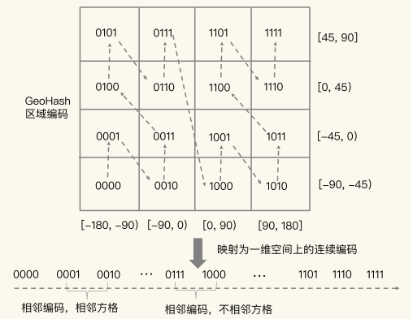
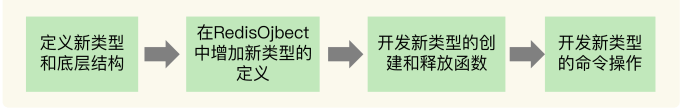

### 13 | GEO是什么？还可以定义新的数据类型吗？  

#### 面向 LBS 应用的 GEO 数据类型  

在日常生活中，我们越来越依赖搜索“附近的餐馆”、在打车软件上叫车，这些都离不开**基于位置信息服务（Location-Based Service，LBS）**的应用。LBS 应用访问的数据是和人或物关联的一组经纬度信息，而且要能查询相邻的经纬度范围，GEO 就非常适合应用在LBS 服务的场景中，我们来看一下它的底层结构。  

#### GEO 的底层结构

**一般来说，在设计一个数据类型的底层结构时，我们首先需要知道，要处理的数据有什么访问特点**。所以，我们需要**先搞清楚位置信息到底是怎么被存取的**。

我以叫车服务为例，来分析下 LBS 应用中经纬度的存取特点 ：

1. 每一辆网约车都有一个编号（例如 33），网约车需要将自己的经度信息（例如116.034579）和纬度信息（例如 39.000452 ）发给叫车应用。  
2. 用户在叫车的时候，叫车应用会根据用户的经纬度位置（例如经度 116.054579，纬度
   39.030452），查找用户的附近车辆，并进行匹配。
3. 等把位置相近的用户和车辆匹配上以后，叫车应用就会根据车辆的编号，获取车辆的信息，并返回给用户。

可以看到，一辆车（或一个用户）对应一组经纬度，并且随着车（或用户）的位置移动，相应的经纬度也会变化。

这种数据记录模式属于一个 key（例如车 ID）对应一个 value（一组经纬度）。当有很多车辆信息要保存时，就需要有一个集合来保存一系列的 key 和 value。Hash 集合类型可以快速存取一系列的 key 和 value，正好可以用来记录一系列车辆 ID 和经纬度的对应关系，所以，我们可以把不同车辆的 ID 和它们对应的经纬度信息存在 Hash 集合中，如下所示：



同时，Hash 类型的 HSET 操作命令，会根据 key 来设置相应的 value 值，所以，我们可以用它来快速地更新车辆变化的经纬度信息。  

redis的在线环境：[Try Redis](https://try.redis.io/) 

```shell
 >hset car:location 1030 116.03,39.02 968 116.51,39.82
 # 获取车辆id，2030 的值
 > hget car:location 1030
"116.03,39.02"
# 获取所有的值
> HGETALL car:location
1) "1030"
2) "116.03,39.02"
3) "968"
4) "116.51,39.82"
#更新id 1030 的值
> hset car:location 1030 116.53,40.01
0
> HGETALL car:location
1) "1030"
2) "116.53,40.01"
3) "968"
4) "116.51,39.82"
```

到这里，Hash 类型看起来是一个不错的选择。但问题是，**对于一个 LBS 应用来说，除了记录经纬度信息，还需要根据用户的经纬度信息在车辆的 Hash 集合中进行范围查询**。一旦涉及到范围查询，就意味着集合中的元素需要有序，但 Hash 类型的元素是无序的，显然不能满足我们的要求。

  看看 **Sorted Set 类型**是不是合适。

Sorted Set 类型也支持一个 key 对应一个 value 的记录模式，其中，key 就是 Sorted Set 中的元素，而 value 则是元素的权重分数。更重要的是，Sorted Set 可以根据元素的权重分数排序，支持范围查询。这就能满足 LBS 服务中查找相邻位置的需求了。

 实际上，**GEO 类型的底层数据结构就是用 Sorted Set 来实现的**。

用 Sorted Set 来保存车辆的经纬度信息时，Sorted Set 的元素是车辆 ID，元素的权重分数是经纬度信息，如下图所示 ：



这时问题来了，Sorted Set 元素的权重分数是一个浮点数（float 类型），而**一组经纬度包含的是经度和纬度两个值，是没法直接保存为一个浮点数的，那具体该怎么进行保存**呢？  

这就要用到 **GEO 类型中的 GeoHash 编码**了。  

#### GeoHash 的编码方法  

二分区间，区间编码：**当我们要对一组经纬度进行 GeoHash 编码时，我们要先对经度和纬度分别编码，然后再把经纬度各自的编码组合成一个最终编码**。

首先，我们来看下经度和纬度的单独编码过程 ：

对于一个地理位置信息来说，它的经度范围是[-180,180]。GeoHash 编码会把一个经度值编码成一个 N 位的二进制值，我们来对经度范围[-180,180]做 N 次的二分区操作，其中 N可以自定义。  

在进行第一次二分区时，经度范围[-180,180]会被分成两个子区间：[-180,0) 和[0,180]（我称之为左、右分区）。此时，我们可以**查看一下要编码的经度值落在了左分区还是右分区**。**如果是落在左分区，我们就用 0 表示；如果落在右分区，就用 1 表示。这样一来，每做完一次二分区，我们就可以得到 1 位编码值**。

然后，我们再对经度值所属的分区再做一次二分区，同时再次查看经度值落在了二分区后的左分区还是右分区，按照刚才的规则再做 1 位编码。当做完 N 次的二分区后，经度值就可以用一个 N bit 的数来表示了。

举个例子，假设我们要编码的经度值是 116.37，我们用 5 位编码值（也就是 N=5，做 5次分区）。

我们先做第一次二分区操作，把经度区间[-180,180]分成了左分区[-180,0) 和右分区[0,180]，此时，经度值 116.37 是属于右分区[0,180]，所以，我们用 1 表示第一次二分区后的编码值。   

接下来，我们做第二次二分区：把经度值 116.37 所属的[0,180]区间，分成[0,90) 和[90,180]。此时，经度值 116.37 还是属于右分区[90,180]，所以，第二次分区后的编码值仍然为 1。等到第三次对[90,180]进行二分区，经度值 116.37 落在了分区后的左分区[90, 135)中，所以，第三次分区后的编码值就是 0。

按照这种方法，做完 5 次分区后，我们把经度值 116.37 定位在[112.5, 123.75]这个区间，并且得到了经度值的 5 位编码值，即 11010。这个编码过程如下表所示  ：

对纬度的编码方式，和对经度的一样，只是纬度的范围是[-90，90]，下面这张表显示了对纬度值 39.86 的编码过程。 

当一组经纬度值都编完码后，我们再把它们的各自编码值组合在一起，组合的规则是：**最终编码值的偶数位上依次是经度的编码值，奇数位上依次是纬度的编码值，其中，偶数位从 0 开始，奇数位从 1 开始**。  



用了 GeoHash 编码后，原来无法用一个权重分数表示的一组经纬度（116.37，39.86）就可以用 1110011101 这一个值来表示，就可以保存为 Sorted Set 的权重分数了。

当然，使用 GeoHash 编码后，我们相当于把整个地理空间划分成了一个个方格，每个方格对应了 GeoHash 中的一个分区。

举个例子。我们把经度区间[-180,180]做一次二分区，把纬度区间[-90,90]做一次二分区，就会得到 4 个分区。我们来看下它们的经度和纬度范围以及对应的 GeoHash 组合编码。

> 分区一：[-180,0) 和[-90,0)，编码 00；
> 分区二：[-180,0) 和[0,90]，编码 01；
> 分区三：[0,180]和[-90,0)，编码 10；
> 分区四：[0,180]和[0,90]，编码 11  

这 4 个分区对应了 4 个方格，每个方格覆盖了一定范围内的经纬度值，分区越多，每个方格能覆盖到的地理空间就越小，也就越精准。我们把所有方格的编码值映射到一维空间时，相邻方格的 GeoHash 编码值基本也是接近的，如下图所示:

  

所以，我们使用 Sorted Set 范围查询得到的相近编码值，在实际的地理空间上，也是相邻的方格，这就可以实现 LBS 应用“搜索附近的人或物”的功能了。

不过，我要提醒你一句，有的编码值虽然在大小上接近，但实际对应的方格却距离比较远。例如，我们用 4 位来做 GeoHash 编码，把经度区间[-180,180]和纬度区间[-90,90]各分成了 4 个分区，一共 16 个分区，对应了 16 个方格。编码值为 0111 和 1000 的两个方格就离得比较远，如下图所示：

 

所以，为了避免查询不准确问题，我们可以同时查询给定经纬度所在的方格周围的 4 个或8 个方格。    

#### 如何操作 GEO 类型？  

在使用 GEO 类型时，我们经常会用到两个命令，分别是 GEOADD 和 GEORADIUS 。

- GEOADD 命令：用于把一组经纬度信息和相对应的一个 ID 记录到 GEO 类型集合中  
- GEORADIUS 命令：会根据输入的经纬度位置，查找以这个经纬度为中心的一定范围内的其他元素。当然，我们可以自己定义这个范围  

我还是以叫车应用的车辆匹配场景为例，介绍下具体如何使用这两个命令。  

假设车辆 ID 是 33，经纬度位置是（116.034579，39.030452），我们可以用一个 GEO集合保存所有车辆的经纬度，集合 key 是 cars:locations。执行下面的这个命令，就可以把 ID 号为 33 的车辆的当前经纬度位置存入 GEO 集合中。

>   GEOADD cars:locations 116.034579 39.030452 33

当用户想要寻找自己附近的网约车时，LBS 应用就可以使用 GEORADIUS 命令。  

例如，LBS 应用执行下面的命令时，Redis 会根据输入的用户的经纬度信息（116.054579，39.030452 ），查找以这个经纬度为中心的 5 公里内的车辆信息，并返回给 LBS 应用。当然， 你可以修改“5”这个参数，来返回更大或更小范围内的车辆信息。

>  GEORADIUS cars:locations 116.054579 39.030452 5 km ASC COUNT 10   

另外，我们还可以进一步限定返回的车辆信息  

比如，我们可以使用 ASC 选项，让返回的车辆信息按照距离这个中心位置从近到远的方式来排序，以方便选择最近的车辆；还可以使用 COUNT 选项，指定返回的车辆信息的数量。毕竟，5 公里范围内的车辆可能有很多，如果返回全部信息，会占用比较多的数据带宽，这个选项可以帮助控制返回的数据量，节省带宽。

####  如何自定义数据类型？

**RedisObject 包括元数据和指针**。其中，**元数据的一个功能就是用来区分不同的数据类型，指针用来指向具体的数据类型的值**。所以，要想开发新数据类型，我们就先来了解下 RedisObject 的元数据和指针。

##### Redis 的基本对象结构

RedisObject 的内部组成包括了 type,、encoding,、lru 和 refcount 4 个元数据，以及 1个*ptr指针。

- type：表示值的类型，涵盖了我们前面学习的五大基本类型；
- encoding：是值的编码方式，用来表示 Redis 中实现各个基本类型的底层数据结构，
- 例如 SDS、压缩列表、哈希表、跳表等；
- lru：记录了这个对象最后一次被访问的时间，用于淘汰过期的键值对；
- refcount：记录了对象的引用计数；
- *ptr：是指向数据的指针。  

##### 开发一个新的数据类型  

首先，**我们需要为新数据类型定义好它的底层结构、type 和 encoding 属性值**，**然后再实现新数据类型的创建、释放函数和基本命令**。  



###### 第一步：定义新数据类型的底层结构  

我们用 newtype.h 文件来保存这个新类型的定义，具体定义的代码如下所示 :

```c
struct NewTypeObject {
struct NewTypeNode *head;
size_t len;
}NewTypeObject;  
```

其中，NewTypeNode 结构就是我们自定义的新类型的底层结构。我们为底层结构设计两个成员变量：一个是 Long 类型的 value 值，用来保存实际数据；一个是*next指针，指向下一个 NewTypeNode 结构。

```c
struct NewTypeNode {
long value;
struct NewTypeNode *next;
};  
```

从代码中可以看到，NewTypeObject 类型的底层结构其实就是一个 Long 类型的单向链表。其他的数据类型也可以自己定义。

###### 第二步：在 RedisObject 的 type 属性中，增加这个新类型的定义  

这个定义是在 Redis 的 server.h 文件中。比如，我们增加一个叫作 OBJ_NEWTYPE 的宏定义，用来在代码中指代 NewTypeObject 这个新类型  。

```c
#define OBJ_STRING 0 /* String object. */
#define OBJ_LIST 1 /* List object. */
#define OBJ_SET 2 /* Set object. */
#define OBJ_ZSET 3 /* Sorted set object. */
…#
define OBJ_NEWTYPE 7
```

###### 第三步：开发新类型的创建和释放函数  

Redis 把数据类型的创建和释放函数都定义在了 object.c 文件中。所以，我们可以在这个文件中增加 NewTypeObject 的创建函数 createNewTypeObject，如下所示：  

```c
robj *createNewTypeObject(void){
NewTypeObject *h = newtypeNew();
robj *o = createObject(OBJ_NEWTYPE,h);
return o;
}
```

先说 **newtypeNew** 函数。它是**用来为新数据类型初始化内存结构的**。这个初始化过程主要是用 zmalloc 做底层结构分配空间，以便写入数据。

 ```c
NewTypeObject *newtypeNew(void){
NewTypeObject *n = zmalloc(sizeof(*n));
n->head = NULL;
n->len = 0;
return n;
}
 ```

**newtypeNew** 函数涉及到新数据类型的具体创建，而 Redis 默认会为每个数据类型定义一个单独文件，实现这个类型的创建和命令操作，例如，t_string.c 和 t_list.c 分别对应String 和 List 类型。按照 Redis 的惯例，我们就把 **newtypeNew 函数定义在名为 t_newtype.c 的文件中**。

**createObject** 是 Redis 本身提供的 RedisObject 创建函数，它的参数是数据类型的 type 和指向数据类型实现的指针*ptr。

我们给 createObject 函数中传入了两个参数，分别是新类型的 type 值 OBJ_NEWTYPE，以及指向一个初始化过的 NewTypeObjec 的指针。这样一来，创建的 RedisObject 就能指向我们自定义的新数据类型了。

```c
robj *createObject(int type, void *ptr) {
robj *o = zmalloc(sizeof(*o));
o->type = type;
o->ptr = ptr;
...
return o;
}
```

对于释放函数来说，它是创建函数的反过程，是用 zfree 命令把新结构的内存空间释放掉 。

###### 第四步：开发新类型的命令操作  

简单来说，增加相应的命令操作的过程可以分成三小步：  

1. 在 t_newtype.c 文件中增加命令操作的实现。比如说，我们定义 ntinsertCommand 函数，由它实现对 NewTypeObject 单向链表的插入操作。

   ```c
   void ntinsertCommand(client *c){
   //基于客户端传递的参数，实现在NewTypeObject链表头插入元素
   }  
   ```

2. 在 server.h 文件中，声明我们已经实现的命令，以便在 server.c 文件引用这个命令，例如：

   ```c 
   void ntinsertCommand(client *c)  
   ```

3. 在 server.c 文件中的 redisCommandTable 里面，把新增命令和实现函数关联起来。例如，新增的 ntinsert 命令由 ntinsertCommand 函数实现，我们就可以用 ntinsert 命令给NewTypeObject 数据类型插入元素了。  

   ```c 
   struct redisCommand redisCommandTable[] = {
   ...
   {"ntinsert",ntinsertCommand,2,"m",...}
   }  
   ```

此时，我们就完成了一个自定义的 NewTypeObject 数据类型，可以实现基本的命令操作了。当然，如果你还希望**新的数据类型能被持久化保存，我们还需要在 Redis 的 RDB 和AOF 模块中增加对新数据类型进行持久化保存的代码**。