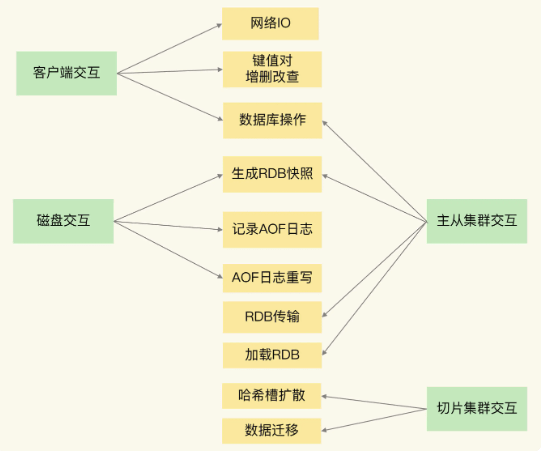
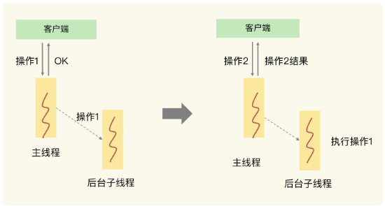

### 16 | 异步机制：如何避免单线程模型的阻塞？

#### 影响 redis 性能的因素

影响 Redis 性能的 5 大方面的潜在因素，分别是：

###### **Redis 内部的阻塞式操作**；

###### **CPU 核和 NUMA 架构的影响**；

###### **Redis 关键系统配置**；

###### **Redis 内存碎片**；

###### **Redis 缓冲区**

在第 3 讲中，我们学习过，Redis 的网络 IO 和键值对读写是由主线程完成的。那么，如果在主线程上执行的操作消耗的时间太长，就会引起主线程阻塞。但是，Redis 既有服务客户端请求的键值对增删改查操作，也有保证可靠性的持久化操作，还有进行主从复制时的数据同步操作，等等。操作这么多，究竟哪些会引起阻塞呢？

#### Redis 实例有哪些阻塞点？

Redis 实例在运行时，要和许多对象进行交互，这些不同的交互就会涉及不同的操作，下面我们来看看和 Redis 实例交互的对象，以及交互时会发生的操作。

- **客户端**：网络 IO，键值对增删改查操作，数据库操作；
- **磁盘**：生成 RDB 快照，记录 AOF 日志，AOF 日志重写；
- **主从节点**：主库生成、传输 RDB 文件，从库接收 RDB 文件、清空数据库、加载 RDB 文件；
- **切片集群实例**：向其他实例传输哈希槽信息，数据迁移。

接下来，我们来逐个分析下在这些交互对象中，有哪些操作会引起阻塞。

##### 1 和客户端交互时的阻塞点

网络 IO 有时候会比较慢，但是 Redis 使用了 IO 多路复用机制，避免了主线程一直处在等待网络连接或请求到来的状态，所以，网络 IO 不是导致 Redis 阻塞的因素。

**键值对的增删改查操作是 Redis 和客户端交互的主要部分，也是 Redis 主线程执行的主要任务**。所以，**复杂度高的增删改查操作肯定会阻塞 Redis**。

那么，怎么判断操作复杂度是不是高呢？这里有一个最基本的标准，就是**看操作的复杂度是否为 O(N)**。

###### 集合全量查询和聚合操作

**Redis 中涉及集合的操作复杂度通常为 O(N)**，我们要在使用时重视起来。例如**集合元素全量查询操作 HGETALL、SMEMBERS，以及集合的聚合统计操作**，例如求交、并和差集。这些操作可以作为 **Redis 的第一个阻塞点：集合全量查询和聚合操作**。

除此之外，**集合自身的删除操作同样也有潜在的阻塞风险**。你可能会认为，删除操作很简单，直接把数据删除就好了，为什么还会阻塞主线程呢？

其实，**删除操作的本质是要释放键值对占用的内存空间**。你可不要小瞧内存的释放过程。**释放内存只是第一步，为了更加高效地管理内存空间，在应用程序释放内存时，操作系统需要把释放掉的内存块插入一个空闲内存块的链表，以便后续进行管理和再分配**。这个过程本身需要一定时间，而且会阻塞当前释放内存的应用程序，所以，如果一下子释放了大量内存，空闲内存块链表操作时间就会增加，相应地就会造成 Redis 主线程的阻塞。

###### bigkey 删除

那么，什么时候会释放大量内存呢？**其实就是在删除大量键值对数据的时候，最典型的就是删除包含了大量元素的集合，也称为 bigkey 删除**。为了让你对 bigkey 的删除性能有一个直观的印象，我测试了不同元素数量的集合在进行删除操作时所消耗的时间，如下表所示：

从这张表里，我们可以得出三个结论:

1. 当元素数量从 10 万增加到 100 万时，4 大集合类型的删除时间的增长幅度从 5 倍上升到了近 20 倍。
2. 集合元素越大，删除所花费的时间就越长；
3. 当删除有 100 万个元素的集合时，最大的删除时间绝对值已经达到了 1.98s（Hash 类型）。Redis 的响应时间一般在微秒级别，所以，一个操作达到了近 2s，不可避免地会阻塞主线程。

经过刚刚的分析，很显然，**bigkey 删除操作就是 Redis 的第二个阻塞点**。删除操作对 Redis 实例性能的负面影响很大，而且在实际业务开发时容易被忽略，所以一定要重视它。

###### 清空数据库

既然频繁删除键值对都是潜在的阻塞点了，那么，在 Redis 的数据库级别操作中，清空数据库（例如 **FLUSHDB** 和 **FLUSHALL** 操作）必然也是一个潜在的阻塞风险，因为它涉及到删除和释放所有的键值对。所以，这就是 **Redis 的第三个阻塞点：清空数据库**。

##### 2 和磁盘交互时的阻塞点

我之所以把 Redis 与磁盘的交互单独列为一类，主要是**因为磁盘 IO 一般都是比较费时费力的**，需要重点关注。

幸运的是，Redis 开发者早已认识到磁盘 IO 会带来阻塞，所以就把 **Redis 进一步设计为采用子进程的方式生成 RDB 快照文件，以及执行 AOF 日志重写操作**。这样一来，这两个操作由子进程负责执行，慢速的磁盘 IO 就不会阻塞主线程了。

###### AOF 日志同步写

但是，Redis 直接记录 AOF 日志时，会根据不同的写回策略对数据做落盘保存。一个同步写磁盘的操作的耗时大约是 1～2ms，如果有大量的写操作需要记录在 AOF 日志中，并同步写回的话，就会阻塞主线程了。这就得到了 **Redis 的第四个阻塞点**了：**AOF 日志同步写**。

##### 3 主从节点交互时的阻塞点

在主从集群中，主库需要生成 RDB 文件，并传输给从库。主库在复制的过程中，创建和传输 RDB 文件都是由子进程来完成的，不会阻塞主线程。但是，**对于从库来说，它在接收了 RDB 文件后，需要使用 FLUSHDB 命令清空当前数据库**，这就正好撞上了刚才我们分析的**第三个阻塞点**。

###### 加载 RDB 文件

此外，从库在清空当前数据库后，还需要把 RDB 文件加载到内存，这个过程的快慢和 RDB 文件的大小密切相关，RDB 文件越大，加载过程越慢，所以，**加载 RDB 文件就成为了 Redis 的第五个阻塞点**。

##### 4 切片集群实例交互时的阻塞点

最后，当我们部署 Redis 切片集群时，每个 Redis 实例上分配的哈希槽信息需要在不同实例间进行传递，同时，当需要进行负载均衡或者有实例增删时，数据会在不同的实例间进行迁移。不过，哈希槽的信息量不大，而数据迁移是渐进式执行的，所以，一般来说，这两类操作对 Redis 主线程的阻塞风险不大。

不过，**如果你使用了 Redis Cluster 方案，而且同时正好迁移的是 bigkey 的话，就会造成主线程的阻塞，因为 Redis Cluster 使用了同步迁移**。

**当没有 bigkey 时，切片集群的各实例在进行交互时不会阻塞主线程**。

我们来总结下刚刚找到的五个阻塞点：

- **集合全量查询和聚合操作；**
- **bigkey 删除；**
- **清空数据库；**
- **AOF 日志同步写；**
- **从库加载 RDB 文件**。

如果在主线程中执行这些操作，必然会导致主线程长时间无法服务其他请求。为了避免阻塞式操作，Redis 提供了异步线程机制。所谓的异步线程机制，就是指，Redis 会启动一些子线程，然后把一些任务交给这些子线程，让它们在后台完成，而不再由主线程来执行这些任务。使用异步线程机制执行操作，可以避免阻塞主线程。

这五大阻塞式操作都可以被异步执行吗？

#### 哪些阻塞点可以异步执行？

在分析阻塞式操作的异步执行的可行性之前，我们先来了解下异步执行对操作的要求。如果一个操作能被异步执行，就意味着，它并不是 Redis 主线程的关键路径上的操作。我再解释下**关键路径上的操作是啥**。这就是说，**客户端把请求发送给 Redis 后，等着 Redis 返回数据结果的操作**。

主线程接收到操作 1 后，因为**操作 1 并不用给客户端返回具体的数据，所以，主线程可以把它交给后台子线程来完成**，同时只要给客户端返回一个“OK”结果就行。在子线程执行操作 1 的时候，客户端又向 Redis 实例发送了操作 2，而此时，**客户端是需要使用操作 2 返回的数据结果的，如果操作 2 不返回结果，那么，客户端将一直处于等待状态**。

在这个例子中，操作 1 就不算关键路径上的操作，因为它不用给客户端返回具体数据，所以可以由后台子线程异步执行。而操作 2 需要把结果返回给客户端，它就是关键路径上的操作，所以主线程必须立即把这个操作执行完。

对于 Redis 来说，**读操作是典型的关键路径操作**，**因为客户端发送了读操作之后，就会等待读取的数据返回，以便进行后续的数据处理**。而 **Redis 的第一个阻塞点“集合全量查询和聚合操作”都涉及到了读操作，所以，它们是不能进行异步操作了**。

我们再来看看删除操作。**删除操作并不需要给客户端返回具体的数据结果，所以不算是关键路径操作**。而我们**刚才总结的第二个阻塞点“bigkey 删除”，和第三个阻塞点“清空数据库”，都是对数据做删除，并不在关键路径上**。因此，**我们可以使用后台子线程来异步执行删除操作**。

对于第四个阻塞点“AOF 日志同步写”来说，**为了保证数据可靠性，Redis 实例需要保证 AOF 日志中的操作记录已经落盘，这个操作虽然需要实例等待，但它并不会返回具体的数据结果给实例**。所以，**我们也可以启动一个子线程来执行 AOF 日志的同步写，而不用让主线程等待 AOF 日志的写完成**。

最后，我们再来看下“**从库加载 RDB 文件**”这个阻塞点。从库要想对客户端提供数据存取服务，就必须把 RDB 文件加载完成。所以，**这个操作也属于关键路径上的操作，我们必须让从库的主线程来执行**。

对于 Redis 的五大阻塞点来说，**除了“集合全量查询和聚合操作”和“从库加载 RDB 文件”，其他三个阻塞点涉及的操作都不在关键路径上**，所以，**我们可以使用 Redis 的异步子线程机制来实现 bigkey 删除，清空数据库，以及 AOF 日志同步写**。

那么，Redis 实现的异步子线程机制具体是怎样执行的呢？

#### 异步的子线程机制

Redis 主线程启动后，会使用操作系统提供的 pthread_create 函数创建 3 个子线程，分别由它们负责 **AOF 日志写操作、键值对删除以及文件关闭的异步执行**。

主线程通过一个链表形式的任务队列和子线程进行交互。当收到键值对删除和清空数据库的操作时，主线程会把这个操作封装成一个任务，放入到任务队列中，然后给客户端返回一个完成信息，表明删除已经完成。

但实际上，这个时候删除还没有执行，等到后台子线程从任务队列中读取任务后，才开始实际删除键值对，并释放相应的内存空间。因此，我们把这种**异步删除也称为惰性删除（lazy free）**。此时，**删除或清空操作不会阻塞主线程，这就避免了对主线程的性能影响**。

和惰性删除类似，当 AOF 日志配置成 everysec 选项后，主线程会把 AOF 写日志操作封装成一个任务，也放到任务队列中。后台子线程读取任务后，开始自行写入 AOF 日志，这样主线程就不用一直等待 AOF 日志写完了。

这里有个地方需要你注意一下，异步的键值对删除和数据库清空操作是 Redis 4.0 后提供的功能，Redis 也提供了新的命令来执行这两个操作。

- 键值对删除：当你的集合类型中有大量元素（例如有百万级别或千万级别元素）需要删除时，我建议你使用 UNLINK 命令。
- 清空数据库：可以在 FLUSHDB 和 FLUSHALL 命令后加上 ASYNC 选项，这样就可以让后台子线程异步地清空数据库 `FLUSHDB ASYNC; FLUSHALL AYSNC`

#### 小结 

我们学习了 Redis 实例运行时的 4 大类交互对象：客户端、磁盘、主从库实例、切片集群实例。基于这 4 大类交互对象，我们梳理了会导致 Redis 性能受损的 5 大阻塞点，包括**集合全量查询和聚合操作、bigkey 删除、清空数据库、AOF 日志同步写，以及从库加载 RDB 文件**。

在这 5 大阻塞点中，**bigkey 删除、清空数据库、AOF 日志同步写不属于关键路径操作，可以使用异步子线程机制来完成**。**Redis 在运行时会创建三个子线程，主线程会通过一个任务队列和三个子线程进行交互**。子线程会根据任务的具体类型，来执行相应的异步操作。

不过，异步删除操作是 Redis 4.0 以后才有的功能，如果你使用的是 4.0 之前的版本，**当你遇到 bigkey 删除时**，我给你个小建议：**先使用集合类型提供的 SCAN 命令读取数据，然后再进行删除**。因为用 SCAN 命令可以每次只读取一部分数据并进行删除，这样可以避免一次性删除大量 key 给主线程带来的阻塞。

例如，对于 Hash 类型的 bigkey 删除，你可以使用 HSCAN 命令，每次从 Hash 集合中获取一部分键值对（例如 200 个），再使用 HDEL 删除这些键值对，这样就可以把删除压力分摊到多次操作中，那么，每次删除操作的耗时就不会太长，也就不会阻塞主线程了。

**集合全量查询和聚合操作、从库加载 RDB 文件是在关键路径上，无法使用异步操作来完成**。对于这两个阻塞点，我也给你两个小建议。

- 集合全量查询和聚合操作：可以使用 SCAN 命令，分批读取数据，再在客户端进行聚合计算；
- 从库加载 RDB 文件：把主库的数据量大小控制在 2~4GB 左右，以保证 RDB 文件能以较快的速度加载。

