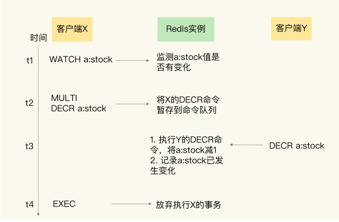
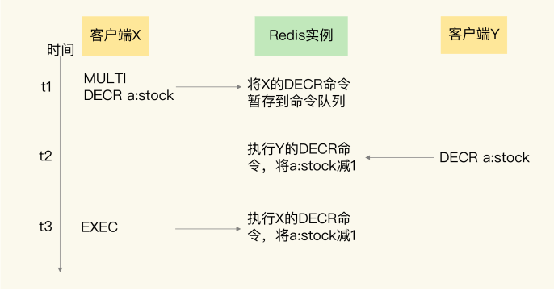
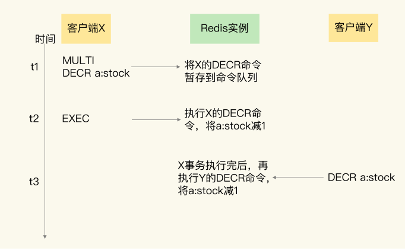

### 31 | 事务机制：Redis能实现ACID属性吗  

#### Redis 如何实现事务？  

事务的执行过程包含三个步骤，Redis 提供了 MULTI、EXEC 两个命令来完成这三个步骤。下面我们来分析下。

第一步，**客户端要使用一个命令显式地表示一个事务的开启**。在 Redis 中，**这个命令就是 MULTI** 。

第二步，**客户端把事务中本身要执行的具体操作（例如增删改数据）发送给服务器端**。这些操作就是 Redis 本身提供的数据读写命令，例如 GET、SET 等。不过，**这些命令虽然被客户端发送到了服务器端，但 Redis 实例只是把这些命令暂存到一个命令队列中，并不会立即执行**。

第三步，**客户端向服务器端发送提交事务的命令，让数据库实际执行第二步中发送的具体操作**。**Redis 提供的 EXEC 命令就是执行事务提交的**。**当服务器端收到 EXEC 命令后，才会实际执行命令队列中的所有命令**。

 下面的代码就显示了使用 MULTI 和 EXEC 执行一个事务的过程：

```java
#开启事务
127.0.0.1:6379> MULTI
OK
#将a:stock减1，
127.0.0.1:6379> DECR a:stock
QUEUED
#将b:stock减1
127.0.0.1:6379> DECR b:stock
QUEUED
#实际执行事务
127.0.0.1:6379> EXEC
1) (integer) 4
2) (integer) 9
```

我们假设 a:stock、b:stock 两个键的初始值是 5 和 10。在 MULTI 命令后执行的两个DECR 命令，是把 a:stock、b:stock 两个键的值分别减 1，它们执行后的返回结果都是QUEUED，这就表示，这些操作都被暂存到了命令队列，还没有实际执行。等到执行了EXEC 命令后，可以看到返回了 4、9，这就表明，两个 DECR 命令已经成功地执行了。

好了，通过使用 MULTI 和 EXEC 命令，我们可以实现多个操作的共同执行，但是这符合事务要求的 ACID 属性吗？接下来，我们就来具体分析下。  

#### Redis 的事务机制能保证哪些属性？ 

原子性是事务操作最重要的一个属性，所以，我们先来分析下 Redis 事务机制能否保证原子性。

##### 原子性

如果事务正常执行，没有发生任何错误，那么，MULTI 和 EXEC 配合使用，就可以保证多个操作都完成。但是，如果事务执行发生错误了，原子性还能保证吗？我们需要分三种情况来看。

第一种情况：**在执行 EXEC 命令前，客户端发送的操作命令本身就有错误**（比如语法错误，使用了不存在的命令），在命令入队时就被 Redis 实例判断出来了。  

对于这种情况，在命令入队时，Redis 就会报错并且记录下这个错误。此时，我们还能继续提交命令操作。**等到执行了 EXEC 命令之后，Redis 就会拒绝执行所有提交的命令操作，返回事务失败的结果**。这样一来，事务中的所有命令都不会再被执行了，保证了原子性。  

看一个因为事务操作入队时发生错误，而导致事务失败的小例子 ：

```java
#开启事务
127.0.0.1:6379> MULTI
OK
#发送事务中的第一个操作，但是Redis不支持该命令，返回报错信息
127.0.0.1:6379> PUT a:stock 5
(error) ERR unknown command `PUT`, with args beginning with: `a:stock`, `5`,
#发送事务中的第二个操作，这个操作是正确的命令，Redis把该命令入队
127.0.0.1:6379> DECR b:stock
QUEUED
#实际执行事务，但是之前命令有错误，所以Redis拒绝执行
127.0.0.1:6379> EXEC
(error) EXECABORT Transaction discarded because of previous errors.
```

在这个例子中，事务里包含了一个 Redis 本身就不支持的 PUT 命令，所以，在 PUT 命令入队时，Redis 就报错了。虽然，事务里还有一个正确的 DECR 命令，但是，在最后执行EXEC 命令后，整个事务被放弃执行了。  

第二种情况：**事务操作入队时，命令和操作的数据类型不匹配，但 Redis 实例没有检查出错误**。但是，在执行完 EXEC 命令以后，Redis 实际执行这些事务操作时，就会报错。

不过，需要注意的是，**虽然 Redis 会对错误命令报错，但还是会把正确的命令执行完**。在这种情况下，事务的原子性就无法得到保证了。 

举个小例子。事务中的 LPOP 命令对 String 类型数据进行操作，入队时没有报错，但是，在 EXEC 执行时报错了。LPOP 命令本身没有执行成功，但是事务中的 DECR 命令却成功执行了。

 ```java
#开启事务
127.0.0.1:6379> MULTI
OK
#发送事务中的第一个操作，LPOP命令操作的数据类型不匹配，此时并不报错
127.0.0.1:6379> LPOP a:stock
QUEUED
#发送事务中的第二个操作
127.0.0.1:6379> DECR b:stock
QUEUED
#实际执行事务，事务第一个操作执行报错
127.0.0.1:6379> EXEC
1) (error) WRONGTYPE Operation against a key holding the wrong kind of value
2) (integer) 8
 ```

看到这里，你可能有个疑问，传统数据库（例如 MySQL）在执行事务时，会提供回滚机制，当事务执行发生错误时，事务中的所有操作都会撤销，已经修改的数据也会被恢复到事务执行前的状态，那么，在刚才的例子中，如果命令实际执行时报错了，是不是可以用回滚机制恢复原来的数据呢？

其实，Redis 中并没有提供回滚机制。虽然 Redis 提供了 DISCARD 命令，但是，**这个命令只能用来主动放弃事务执行，把暂存的命令队列清空，起不到回滚的效果**。

 DISCARD 命令具体怎么用呢？我们来看下下面的代码  

```java
#读取a:stock的值4
127.0.0.1:6379> GET a:stock
"4"
#开启事务
127.0.0.1:6379> MULTI
OK
#发送事务的第一个操作，对a:stock减1
127.0.0.1:6379> DECR a:stock
QUEUED
#执行DISCARD命令，主动放弃事务
127.0.0.1:6379> DISCARD
OK
#再次读取a:stock的值，值没有被修改
127.0.0.1:6379> GET a:stock
"4"
```

这个例子中，a:stock 键的值一开始为 4，然后，我们执行一个事务，想对 a:stock 的值减1。但是，在事务的最后，我们执行的是 DISCARD 命令，所以事务就被放弃了。我们再次查看 a:stock 的值，会发现仍然为 4。

第三种情况：**在执行事务的 EXEC 命令时，Redis 实例发生了故障，导致事务执行失败**。  

在这种情况下，如果 Redis 开启了 AOF 日志，那么，只会有部分的事务操作被记录到AOF 日志中。我们需要使用 redis-check-aof 工具检查 AOF 日志文件，这个工具可以**把已完成的事务操作从 AOF 文件中去除**。这样一来，**我们使用 AOF 恢复实例后，事务操作不会再被执行，从而保证了原子性**。

当然，如果 AOF 日志并没有开启，那么实例重启后，数据也都没法恢复了，此时，也就谈不上原子性了

###### 小结

###### 命令入队时就报错，会放弃事务执行，保证原子性；

###### 命令入队时没报错，实际执行时报错，不保证原子性；

###### EXEC 命令执行时实例故障，如果开启了 AOF 日志，可以保证原子性。


##### 一致性

事务的一致性保证会受到错误命令、实例故障的影响。所以，我们按照命令出错和实例故障的发生时机，分成三种情况来看。

###### 情况一：命令入队时就报错  

在这种情况下，**事务本身就会被放弃执行，所以可以保证数据库的一致性**。  

###### 情况二：命令入队时没报错，实际执行时报错  

在这种情况下，**有错误的命令不会被执行，正确的命令可以正常执行，也不会改变数据库的一致性**。

###### 情况三：EXEC 命令执行时实例发生故障

在这种情况下，实例故障后会进行重启，这就和数据恢复的方式有关了，我们要根据实例是否开启了 RDB 或 AOF 来分情况讨论下。  

**如果我们没有开启 RDB 或 AOF，那么，实例故障重启后，数据都没有了，数据库是一致的**。  

**如果我们使用了 RDB 快照，因为 RDB 快照不会在事务执行时执行，所以，事务命令操作的结果不会被保存到 RDB 快照中，使用 RDB 快照进行恢复时，数据库里的数据也是一致的**。

**如果我们使用了 AOF 日志，而事务操作还没有被记录到 AOF 日志时，实例就发生了故障，那么，使用 AOF 日志恢复的数据库数据是一致的**。**如果只有部分操作被记录到了AOF 日志，我们可以使用 redis-check-aof 清除事务中已经完成的操作，数据库恢复后也是一致的**。

###### 小结

所以，总结来说，**在命令执行错误或 Redis 发生故障的情况下，Redis 事务机制对一致性属性是有保证的**。

##### 隔离性

事务的隔离性保证，会受到和事务一起执行的并发操作的影响。而事务执行又可以分成命令入队（EXEC 命令执行前）和命令实际执行（EXEC 命令执行后）两个阶段，所以，我们就针对这两个阶段，分成两种情况来分析:

1.  **并发操作在 EXEC 命令前执行，此时，隔离性的保证要使用 WATCH 机制来实现，否则隔离性无法保证**； 
2.  **并发操作在 EXEC 命令后执行，此时，隔离性可以保证**。

我们先来看第一种情况。**一个事务的 EXEC 命令还没有执行时，事务的命令操作是暂存在命令队列中的**。此时，如果有其它的并发操作，我们就需要看事务是否使用了 WATCH 机制。

###### WATCH 机制的作用

WATCH 机制的作用是，**在事务执行前，监控一个或多个键的值变化情况，当事务调用EXEC 命令执行时，WATCH 机制会先检查监控的键是否被其它客户端修改了**。**如果修改了，就放弃事务执行，避免事务的隔离性被破坏**。**然后，客户端可以再次执行事务，此时，如果没有并发修改事务数据的操作了，事务就能正常执行，隔离性也得到了保证**。 

WATCH 机制的具体实现是由 WATCH 命令实现的，我给你举个例子，你可以看下下面的图，进一步理解下 WATCH 命令的使用。  



在 t1 时，客户端 X 向实例发送了 WATCH 命令。实例收到 WATCH 命令后，开始监测 a:stock 的值的变化情况。

紧接着，在 t2 时，客户端 X 把 MULTI 命令和 DECR 命令发送给实例，实例把 DECR 命令暂存入命令队列。  

在 t3 时，客户端 Y 也给实例发送了一个 DECR 命令，要修改 a:stock 的值，实例收到命令后就直接执行了。

等到 t4 时，实例收到客户端 X 发送的 EXEC 命令，但是，实例的 WATCH 机制发现a:stock 已经被修改了，就会放弃事务执行。这样一来，事务的隔离性就可以得到保证了。  

当然，**如果没有使用 WATCH 机制，在 EXEC 命令前执行的并发操作是会对数据进行读写的**。而且，**在执行 EXEC 命令的时候，事务要操作的数据已经改变了，在这种情况下，Redis 并没有做到让事务对其它操作隔离，隔离性也就没有得到保障**。下面这张图显示了没有 WATCH 机制时的情况，你可以看下。

  

在 t2 时刻，客户端 X 发送的 EXEC 命令还没有执行，但是客户端 Y 的 DECR 命令就执行了，此时，a:stock 的值会被修改，这就无法保证 X 发起的事务的隔离性了。

刚刚说的是并发操作在 EXEC 命令前执行的情况，下面我再来说一说第二种情况：**并发操作在 EXEC 命令之后被服务器端接收并执行**。

因为 Redis 是用单线程执行命令，而且，EXEC 命令执行后，Redis 会保证先把命令队列中的所有命令执行完。所以，在这种情况下，并发操作不会破坏事务的隔离性，如下图所示：


  

##### 持久性

因为 Redis 是内存数据库，所以，**数据是否持久化保存完全取决于 Redis 的持久化配置模式**。

如果 Redis 没有使用 RDB 或 AOF，那么事务的持久化属性肯定得不到保证。

如果 Redis 使用了 RDB 模式，那么，**在一个事务执行后，而下一次的 RDB 快照还未执行前，如果发生了实例宕机，这种情况下，事务修改的数据也是不能保证持久化的**。

如果 Redis 采用了 AOF 模式，**因为 AOF 模式的三种配置选项 no、everysec 和 always 都会存在数据丢失的情况，所以，事务的持久性属性也还是得不到保证**。

所以，**不管 Redis 采用什么持久化模式，事务的持久性属性是得不到保证的**。 

#### 小结

Redis 通过 MULTI、EXEC、DISCARD 和 WATCH 四个命令来支持事务机制。

  

事务的 ACID 属性是我们使用事务进行正确操作的基本要求。通过这节课的分析，我们了解到了，**Redis 的事务机制可以保证一致性和隔离性，但是无法保证持久性**。不过，因为Redis 本身是内存数据库，持久性并不是一个必须的属性，我们更加关注的还是原子性、一致性和隔离性这三个属性。

**原子性的情况比较复杂，只有当事务中使用的命令语法有误时，原子性得不到保证，在其它情况下，事务都可以原子性执行**。

所以，我给你一个小建议：**严格按照 Redis 的命令规范进行程序开发，并且通过 code review 确保命令的正确性**。这样一来，Redis 的事务机制就能被应用在实践中，保证多操作的正确执行。  