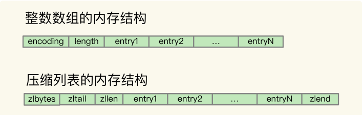
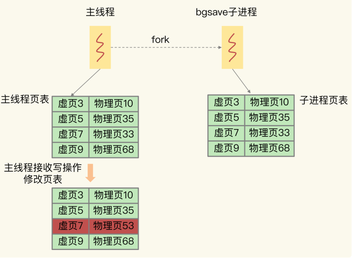

### 极客时间《Redis 核心技术与实战》课后思考与问题。

##### 1、 整数数组和压缩列表在查找时间复杂度方面并没有很大的优势，那为什么 Redis 还会把它们作为底层数据结构呢？

1、内存利用率，数组和压缩列表都是非常紧凑的数据结构，它比链表占用的内存要更少。Redis是内存数据库，大量数据存到内存中，此时需要做尽可能的优化，提高内存的利用率。

 2、数组对CPU高速缓存支持更友好，所以Redis在设计时，集合数据元素较少情况下，默认采用内存紧凑排列的方式存储，同时利用CPU高速缓存不会降低访问速度。当数据元素超过设定阈值后，避免查询时间复杂度太高，转为哈希和跳表数据结构存储，保证查询效率。

redis 之所以采用不同的数据结构，其实实在性能和内存使用效率之间进行的平衡。

##### 2、 为什么单线程的 Redis 能那么快？

我们通常说，Redis 是单线程，**主要是指 Redis 的网络 IO 和键值对读写是由一个线程来完成的，这也是 Redis 对外提供键值存储服务的主要流程**。但 **Redis 的其他功能，比如持久化、异步删除、集群数据同步等，其实是由额外的线程执行的**。

所以，严格来说，Redis 并不是单线程，但是我们一般把 Redis 称为单线程高性能，这样显得“酷”些。接下来，我也会把 Redis 称为单线程模式。

原因：一方面，**Redis 的大部分操作在内存上完成，再加上它采用了高效的数据结构**，例如哈希表和跳表，这是它实现高性能的一个重要原因。另一方面，**就是 Redis 采用了多路复用机制，使其在网络 IO 操作中能并发处理大量的客户端请求，实现高吞吐率**。

##### 3、 在“Redis 基本 IO 模型”图中，你觉得还有哪些潜在的性能瓶颈吗？  

在 Redis 基本 IO模型中，主要是**主线程在执行操作，任何耗时的操作**，例如 **bigkey、全量返回**等操作，都是**潜在的性能瓶颈**。  

##### 4、 AOF 日志重写的时候，是由 bgrewriteaof 子进程来完成的，不用主线程参与，我们今天说的非阻塞也是指子进程的执行不阻塞主线程。但是，你觉得，这个重写过程有没有其他潜在的阻塞风险呢？如果有的话，会在哪里阻塞？  

这里有两个风险：

1. Redis 主线程 **fork 创建 bgrewriteaof 子进程**时，内核需要创建用于管理子进程的相关数据结构，这些数据结构在操作系统中通常叫作**进程控制块**（Process ControlBlock，简称为 PCB）。内核要把主线程的 PCB 内容拷贝给子进程。**这个创建和拷贝过程由内核执行，是会阻塞主线程的**。而且，在拷贝过程中，子进程要拷贝父进程的页表，这个过程的耗时和 Redis 实例的内存大小有关。如果 Redis 实例内存大，页表就会大，fork执行时间就会长，这就会给主线程带来阻塞风险。  
2. bgrewriteaof 子进程会和主线程共享内存。当主线程收到新写或修改的操作时，主线程会申请新的内存空间，用来保存新写或修改的数据，如果操作的是 bigkey，也就是数据量大的集合类型数据，那么，主线程会因为申请大空间而面临阻塞风险。因为操作系统在分配内存空间时，有查找和锁的开销，这就会导致阻塞。

##### 5、 AOF 重写也有一个重写日志，为什么它不共享使用 AOF 本身的日志呢？  

**如果都用 AOF 日志的话，主线程要写，bgrewriteaof 子进程也要写**，这两者会**竞争文件系统的锁**，这就会对 Redis 主线程的性能造成影响。 

#####  6、 使用一个 2 核 CPU、4GB 内存、500GB 磁盘的云主机运行 Redis，Redis 数据库的数据量大小差不多是 2GB。当时 Redis 主要以修改操作为主，写读比例差不多在 8:2 左右，也就是说，如果有 100 个请求，80 个请求执行的是修改操作。在这个场景下，用RDB 做持久化有什么风险吗？  

**内存不足的风险**：Redis fork 一个 bgsave 子进程进行 RDB 写入，如果主线程再接收到写操作，就会采用写时复制。写时复制需要给写操作的数据分配新的内存空间。本问题中写的比例为 80%，那么，在持久化过程中，为了保存 80% 写操作涉及的数据，写时复制机制会在实例内存中，为这些数据再分配新内存空间，分配的内存量相当于整个实例数据量的 80%，大约是 1.6GB，这样一来，整个系统内存的使用量就接近饱和了。此时，如果实例还有大量的新 key 写入或 key 修改，云主机内存很快就会被吃光。如果云主机开启了Swap 机制，就会有一部分数据被换到磁盘上，当访问磁盘上的这部分数据时，性能会急剧下降。如果云主机没有开启 Swap，会直接触发 OOM，整个 Redis 实例会面临被系统kill 掉的风险。  

**主线程和子进程竞争使用 CPU 的风险**：生成 RDB 的子进程需要 CPU 核运行，主线程本身也需要 CPU 核运行，而且，如果 Redis 还启用了后台线程，此时，主线程、子进程和后台线程都会竞争 CPU 资源。由于云主机只有 2 核 CPU，这就会影响到主线程处理请求的速度。

#####  7、 为什么主从库间的复制不适用 AOF 

1. RDB 文件是二进制文件，无论是要把 RDB 写入磁盘，还是要通过网络传输 RDB，IO效率都比记录和传输 AOF  的高。
2. 在从库端进行恢复时，用 RDB 的恢复效率要高于用 AOF。

##### 8、在主从切换过程中，客户端能否正常地进行请求操作呢？  

主从集群一般是采用读写分离模式，当主库故障后，客户端仍然可以把读请求发送给从库，让从库服务。但是，对于写请求操作，客户端就无法执行了。

#####  9、如果想要应用程序不感知服务的中断，还需要哨兵或客户端再做些什么吗？   

一方面，客户端需要能缓存应用发送的写请求。只要不是同步写操作（Redis 应用场景一般也没有同步写），写请求通常不会在应用程序的关键路径上，所以，客户端缓存写请求后，给应用程序返回一个确认就行。

另一方面，主从切换完成后，客户端要能和新主库重新建立连接，哨兵需要提供订阅频道，让客户端能够订阅到新主库的信息。同时，客户端也需要能主动和哨兵通信，询问新主库的信息。  

##### 10、5 个哨兵实例的集群，quorum 值设为 2。在运行过程中，如果有 3 个哨兵实例都发生故障了，此时，Redis 主库如果有故障，还能正确地判断主库“客观下线”吗？如果可以的话，还能进行主从库自动切换吗？  

因为判定主库“客观下线”的依据是，认为主库“主观下线”的哨兵个数要大于等于quorum 值，现在还剩 2 个哨兵实例，个数正好等于 quorum 值，所以还能正常判断主库是否处于“客观下线”状态。如果一个哨兵想要执行主从切换，就要获到半数以上的哨兵投票赞成，也就是至少需要 3 个哨兵投票赞成。但是，现在只有 2 个哨兵了，所以就无法进行主从切换了。 

##### 11、哨兵实例是不是越多越好呢？如果同时调大 down-after-milliseconds 值，对减少误判是不是也有好处？  

哨兵实例越多，误判率会越低，但是在判定主库下线和选举 Leader 时，实例需要拿到的赞成票数也越多，等待所有哨兵投完票的时间可能也会相应增加，主从库切换的时间也会变长，客户端容易堆积较多的请求操作，可能会导致客户端请求溢出，从而造成请求丢失。如果业务层对 Redis 的操作有响应时间要求，就可能会因为新主库一直没有选定，新操作无法执行而发生超时报警。

调大 down-after-milliseconds 后，可能会导致这样的情况：**主库实际已经发生故障了，但是哨兵过了很长时间才判断出来，这就会影响到 Redis 对业务的可用性**。

##### 12、为什么 Redis 不直接用一个表，把键值对和实例的对应关系记录下来？  

如果使用表记录键值对和实例的对应关系，一旦键值对和实例的对应关系发生了变化（例如实例有增减或者数据重新分布），就要修改表。如果是单线程操作表，那么所有操作都要串行执行，性能慢；如果是多线程操作表，就涉及到加锁开销。此外，如果数据量非常大，使用表记录键值对和实例的对应关系，需要的额外存储空间也会增加。

基于哈希槽计算时，虽然也要记录哈希槽和实例的对应关系，但是哈希槽的个数要比键值对的个数少很多，无论是修改哈希槽和实例的对应关系，还是使用额外空间存储哈希槽和实例的对应关系，都比直接记录键值对和实例的关系的开销小得多。   

##### 13、rehash 的触发时机和渐进式执行机制  

###### 1 Redis 什么时候做 rehash

Redis 会使用装载因子（load factor）来判断是否需要做 rehash。装载因子的计算方式是，哈希表中所有 entry 的个数除以哈希表的哈希桶个数。Redis 会根据装载因子的两种情况，来触发 rehash 操作。

- 装载因子≥1，同时，哈希表被允许进行 rehash；  
- 装载因子≥5。  

在**第一种情况**下，如果装载因子等于 1，同时我们假设，所有键值对是平均分布在哈希表的各个桶中的，那么，此时，哈希表可以不用链式哈希，因为一个哈希桶正好保存了一个键值对。

但是，如果此时再有新的数据写入，哈希表就要使用链式哈希了，这会对查询性能产生影响。在进行 RDB 生成和 AOF 重写时，哈希表的 rehash 是被禁止的，这是为了避免对RDB 和 AOF 重写造成影响。如果此时，Redis 没有在生成 RDB 和重写 AOF，那么，就可以进行 rehash。否则的话，再有数据写入时，哈希表就要开始使用查询较慢的链式哈希了。

在**第二种情况**下，也就是装载因子大于等于 5 时，就表明当前保存的数据量已经远远大于哈希桶的个数，哈希桶里会有大量的链式哈希存在，性能会受到严重影响，此时，就立马开始做 rehash。

刚刚说的是触发 rehash 的情况，如果装载因子小于 1，或者装载因子大于 1 但是小于 5，同时哈希表暂时不被允许进行 rehash（例如，实例正在生成 RDB 或者重写 AOF），此时，哈希表是不会进行 rehash 操作的。

######  2 采用渐进式 hash 时，如果实例暂时没有收到新请求，是不是就不做 rehash 了？  

其实不是的。Redis 会执行定时任务，定时任务中就包含了 rehash 操作。所谓的定时任务，就是按照一定频率（例如每 100ms/ 次）执行的任务。

在 rehash 被触发后，即使没有收到新请求，Redis 也会定时执行一次 rehash 操作，而且，每次执行时长不会超过 1ms，以免对其他任务造成影响 。

#####  14、写时复制的底层实现机制  

对 Redis 来说，主线程 fork 出 bgsave 子进程后，bgsave 子进程实际是复制了主线程的页表。**这些页表中，就保存了在执行 bgsave 命令时，主线程的所有数据块在内存中的物理地址**。这样一来，bgsave 子进程生成 RDB 时，就可以根据页表读取这些数据，再写入磁盘中。如果此时，主线程接收到了新写或修改操作，那么，主线程会使用写时复制机制。具体来说，**写时复制就是指，主线程在有写操作时，才会把这个新写或修改后的数据写入到一个新的物理地址中，并修改自己的页表映射**。 

bgsave 子进程复制主线程的页表以后，假如主线程需要修改虚页 7 里的数据，那么，主线程就需要新分配一个物理页（假设是物理页 53），然后把修改后的虚页 7 里的数据写到物理页 53 上，而虚页 7 里原来的数据仍然保存在物理页 33 上。这个时候，虚页 7 到物理页 33 的映射关系，仍然保留在 bgsave 子进程中。所以，bgsave 子进程可以无误地把虚页 7 的原始数据写入 RDB 文件。  

##### 15、 replication buffer 和 repl_backlog_buffer 的区别  

在进行主从复制时，Redis 会使用 replication buffer 和 repl_backlog_buffer。

总的来说，**replication buffer 是主从库在进行全量复制时**，主库上用于和从库连接的客户端的 buffer，而 **repl_backlog_buffer 是为了支持从库增量复制**，主库上用于持续保存写操作的一块专用 buffer。

Redis 主从库在进行复制时，当主库要把全量复制期间的写操作命令发给从库时，主库会先创建一个客户端，用来连接从库，然后通过这个客户端，把写操作命令发给从库。在内存中，主库上的客户端就会对应一个 buffer，这个 buffer 就被称为 replication buffer。Redis 通过 client_buffer 配置项来控制这个 buffer 的大小。主库会给每个从库建立一个客户端，所以 replication buffer 不是共享的，而是每个从库都有一个对应的客户端。

repl_backlog_buffer 是一块专用 buffer，在 Redis 服务器启动后，开始一直接收写操作命令，这是所有从库共享的。主库和从库会各自记录自己的复制进度，所以，不同的从库在进行恢复时，会把自己的复制进度（slave_repl_offset）发给主库，主库就可以和它独立同步。

  

