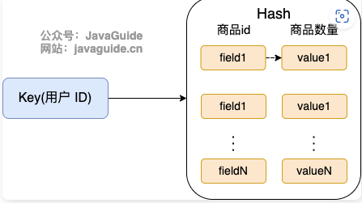

### Redis 除了做缓存，还能做什么？

- **分布式锁**：通过 Redis 来做分布式锁是一种比较常见的方式。通常情况下，我们都是基于 Redisson 来实现分布式锁。关于 Redis 实现分布式锁的详细介绍，可以看我写的这篇文章：[分布式锁详解](https://javaguide.cn/distributed-system/distributed-lock.html) 。
- **限流**：一般是通过 Redis + Lua 脚本的方式来实现限流。相关阅读：[《我司用了 6 年的 Redis 分布式限流器，可以说是非常厉害了！》](https://mp.weixin.qq.com/s/kyFAWH3mVNJvurQDt4vchA)。
- **消息队列**：Redis 自带的 list 数据结构可以作为一个简单的队列使用。Redis 5.0 中增加的 stream 类型的数据结构更加适合用来做消息队列。它比较类似于 Kafka，有主题和消费组的概念，支持消息持久化以及 ACK 机制。
- **延时队列**：Redisson 内置了延时队列（基于 sorted set 实现的）。
- **分布式 Session** ：利用 string 或者 hash 保存 Session 数据，所有的服务器都可以访问。
- **复杂业务场景**：通过 Redis 以及 Redis 扩展（比如 Redisson）提供的数据结构，我们可以很方便地完成很多复杂的业务场景比如通过 bitmap 统计活跃用户、通过 sorted set 维护排行榜。
- ......

### 如何基于 Redis 实现分布式锁？

关于 Redis 实现分布式锁的详细介绍，可以看我写的这篇文章：[分布式锁详解](https://javaguide.cn/distributed-system/distributed-lock.html) 。

------

著作权归Guide所有 原文链接：https://javaguide.cn/database/redis/redis-questions-01.html

### 购物车信息用 String 还是 Hash 存储更好呢?

由于购物车中的商品频繁修改和变动，购物车信息建议使用 Hash 存储：

- 用户 id 为 key
- 商品 id 为 field，商品数量为 value

那用户购物车信息的维护具体应该怎么操作呢？

- 用户添加商品就是往 Hash 里面增加新的 field 与 value；
- 查询购物车信息就是遍历对应的 Hash；
- 更改商品数量直接修改对应的 value 值（直接 set 或者做运算皆可）；
- 删除商品就是删除 Hash 中对应的 field；
- 清空购物车直接删除对应的 key 即可。

这里只是以业务比较简单的购物车场景举例，实际电商场景下，field 只保存一个商品 id 是没办法满足需求的。

------

著作权归Guide所有 原文链接：https://javaguide.cn/database/redis/redis-questions-01.html

