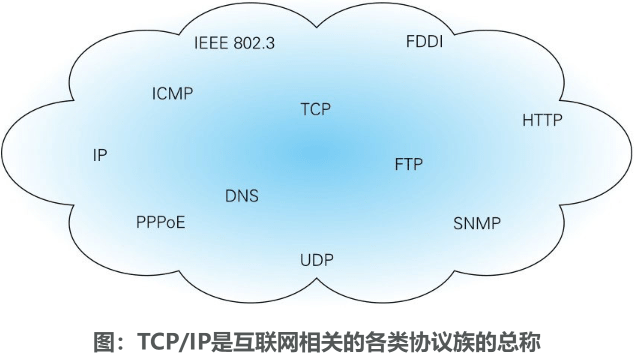
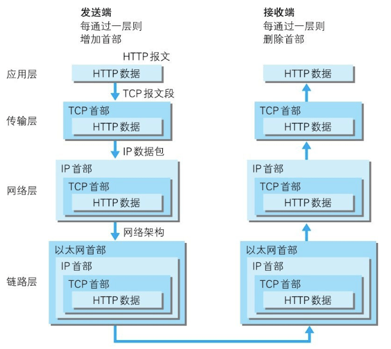
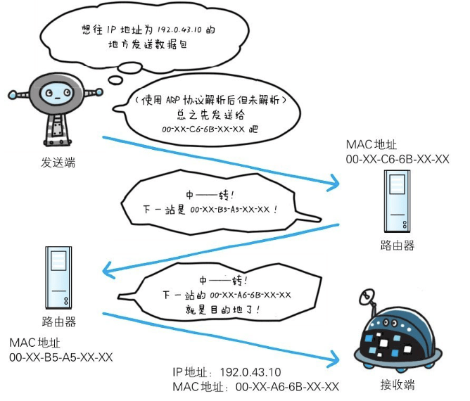
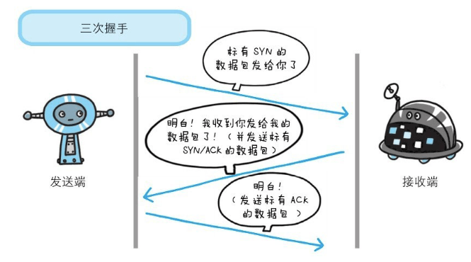
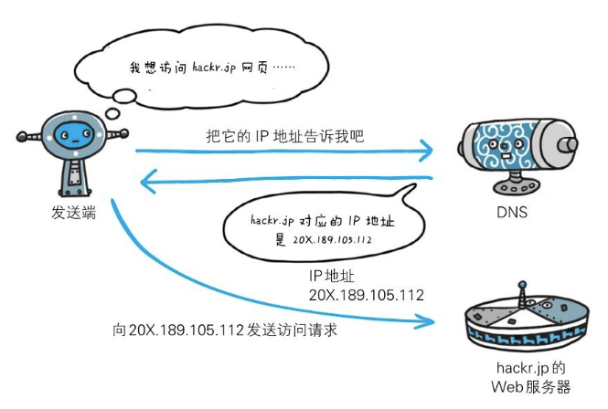
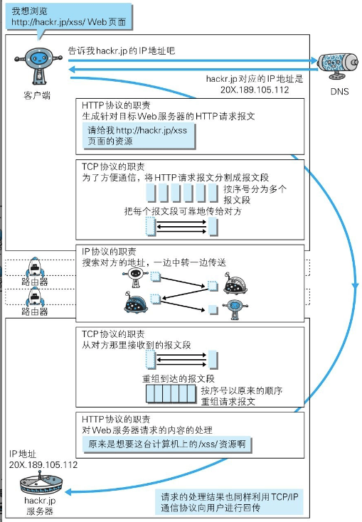

### 1 TCP/IP 协议族

计算机与网络设备要相互通信，双方就必须基于相同的方法。比如，如何探测到通信目标、由哪一边先发起通信、使用哪种语言进行通信、怎样结束通信等规则都需要事先确定。不同的硬件、操作系统之间的通信，所有的这一切都需要一种规则。而我们就把这种规则称为协议（protocol）。

### 2 TCP/IP 的分层管理

TCP/IP协议族里重要的一点就是分层。TCP/IP协议族按层次分别分为以下4层：**应用层、传输层、网络层和数据链路层**。

**把TCP/IP层次化是有好处的**。比如，如果互联网只由一个协议统筹，某个地方需要改变设计时，就必须把所有部分整体替换掉。而**分层之后只需把变动的层替换掉即可**。**把各层之间的接口部分规划好之后，每个层次内部的设计就能够自由改动了**。

值得一提的是，**层次化之后，设计也变得相对简单了**。**处于应用层上的应用可以只考虑分派给自己的任务，而不需要弄清对方在地球上哪个地方、对方的传输路线是怎样的、是否能确保传输送达等问题**。

#### 应用层

**应用层决定了向用户提供应用服务时通信的活动**。

TCP/IP协议族内预存了各类通用的应用服务。比如，FTP（File Transfer Protocol，文件传输协议）和DNS（Domain Name System，域名系统）服务就是其中两类。**HTTP协议也处于该层**。

#### 传输层

**传输层对上层应用层，提供处于网络连接中的两台计算机之间的数据传输**。

在传输层有两个性质不同的协议：**TCP（Transmission Control Protocol，传输控制协议）和UDP（User Data Protocol，用户数据报协议）**。

#### 网络层（又名网络互连层）

**网络层用来处理在网络上流动的数据包**。**数据包是网络传输的最小数据单位**。**该层规定了通过怎样的路径（所谓的传输路线）到达对方计算机，并把数据包传送给对方**。

与对方计算机之间通过多台计算机或网络设备进行传输时，网络层所起的作用就是在众多的选项内选择一条传输路线。

#### 链路层（又名数据链路层，网络接口层）

**用来处理连接网络的硬件部分**。**包括控制操作系统、硬件的设备驱动、NIC（Network Interface Card，网络适配器，即网卡），及光纤等物理可见部分（还包括连接器等一切传输媒介）**。**硬件上的范畴均在链路层的作用范围之内**。

### 3 TCP/IP通信传输流

**利用TCP/IP协议族进行网络通信时，会通过分层顺序与对方进行通信。发送端从应用层往下走，接收端则往应用层往上走**。

我们用HTTP举例来说明，首先作为发送端的客户端在**应用层**（HTTP协议）发出一个想看某个Web页面的HTTP请求。

接着，为了传输方便，在**传输层**（TCP协议）把从应用层处收到的数据（HTTP请求报文）进行分割，并在各个报文上打上标记序号及端口号后转发给网络层。

在**网络层**（IP协议），增加作为通信目的地的MAC地址后转发给**链路层**。这样一来，发往网络的通信请求就准备齐全了。

接收端的服务器在链路层接收到数据，按序往上层发送，一直到应用层。当传输到应用层，才能算真正接收到由客户端发送过来的HTTP请求。

**发送端在层与层之间传输数据时，每经过一层时必定会被打上一个该层所属的首部信息**。反之，**接收端在层与层传输数据时，每经过一层时会把对应的首部消去**。

这种把数据信息包装起来的做法称为**封装（encapsulate）**。

### 4 IP 协议

按层次分，**IP（Internet Protocol）网际协议位于网络层**。Internet Protocol这个名称可能听起来有点夸张，但事实正是如此，因为几乎所有使用网络的系统都会用到IP协议。

**IP协议的作用是把各种数据包传送给对方**。**而要保证确实传送到对方那里，则需要满足各类条件**。**其中两个重要的条件是IP地址和MAC地址（Media Access Control Address）**。

IP地址指明了节点被分配到的地址，MAC地址是指网卡所属的固定地址。IP地址可以和MAC地址进行配对。IP地址可变换，但MAC地址基本上不会更改。

##### 使用ARP协议凭借MAC地址进行通信

IP间的通信依赖MAC地址。在网络上，通信的双方在**同一局域网（LAN）**内的情况是很少的，通常是经过多台计算机和网络设备中转才能连接到对方。而在进行中转时，会利用下一站中转设备的MAC地址来搜索下一个中转目标。这时，会采用**ARP协议（Address Resolution Protocol）**。**ARP是一种用以解析地址的协议，根据通信方的IP地址就可以反查出对应的MAC地址**。

**没有人能够全面掌握互联网中的传输状况**

在到达通信目标前的中转过程中，那些计算机和路由器等网络设备只能获悉很粗略的传输路线。

这种机制称为**路由选择（routing**），有点像快递公司的送货过程。想要寄快递的人，只要将自己的货物送到集散中心，就可以知道快递公司是否肯收件发货，该快递公司的集散中心检查货物的送达地址，明确下站该送往哪个区域的集散中心。接着，那个区域的集散中心自会判断是否能送到对方的家中。

### 5 确保可靠性的 TCP 协议

按层次分，TCP位于传输层，提供可靠的字节流服务。

所谓的字节流服务（Byte Stream Service）是指，为了方便传输，将大块数据分割成以报文段（segment）为单位的数据包进行管理。而可靠的传输服务是指，能够把数据准确可靠地传给对方。一言以蔽之，TCP协议为了更容易传送大数据才把数据分割，而且TCP协议能够确认数据最终是否送达到对方。

#### 确保数据能到达目标

##### 三次握手

为了准确无误地将数据送达目标处，TCP协议采用了三次握手（three-way handshaking）策略。用TCP协议把数据包送出去后，TCP不会对传送后的情况置之不理，它一定会向对方确认是否成功送达。握手过程中使用了TCP的标志（flag）——SYN（synchronize）和ACK（acknowledgement）。

**发送端首先发送一个带SYN标志的数据包给对方**。**接收端收到后，回传一个带有SYN/ACK标志的数据包以示传达确认信息**。最后，**发送端再回传一个带ACK标志的数据包，代表“握手”结束**。

若在握手过程中某个阶段莫名中断，TCP协议会再次以相同的顺序发送相同的数据包。

### 6 DNS 域名解析

**DNS（Domain Name System）服务是和HTTP协议一样位于应用层的协议**。

它提供域名到IP地址之间的解析服务。计算机既可以被赋予IP地址，也可以被赋予主机名和域名。比如www.hackr.jp。

用户通常使用主机名或域名来访问对方的计算机，而不是直接通过IP地址访问。因为与IP地址的一组纯数字相比，用字母配合数字的表示形式来指定计算机名更符合人类的记忆习惯。

DNS协议提供通过域名查找IP地址，或逆向从IP地址反查域名的服务。

### 7 各种协议与HTTP协议的关系

