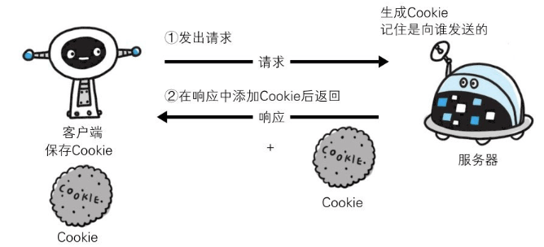
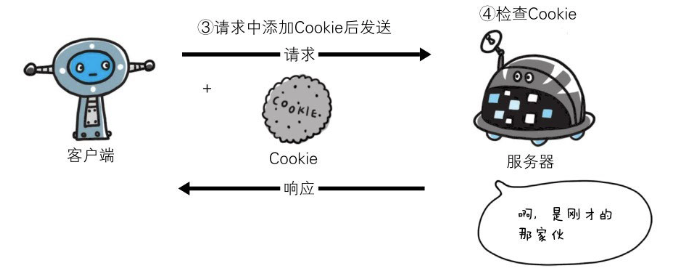

### 使用 Cookie 的状态管理

HTTP是无状态协议，它不对之前发生过的请求和响应的状态进行管理。也就是说，无法根据之前的状态进行本次的请求处理。

假设要求登录认证的Web页面本身无法进行状态的管理（不记录已登录的状态），那么每次跳转新页面就要再次登录，或者要在每次请求报文中附加参数来管理登录状态。

不可否认，无状态协议当然也有它的优点。由于不必保存状态，自然可减少服务器的CPU及内存资源的消耗。从另一侧面来说，也正是因为HTTP协议本身是非常简单的，所以才会被应用在各种场景里。


保留无状态协议这个特征的同时又要解决类似的矛盾问题，于是引入了Cookie技术。**Cookie技术通过在请求和响应报文中写入Cookie信息来控制客户端的状态**。

**Cookie会根据从服务器端发送的响应报文内的一个叫做Set-Cookie的首部字段信息，通知客户端保存Cookie**。**当下次客户端再往该服务器发送请求时，客户端会自动在请求报文中加入Cookie值后发送出去**。

服务器端发现客户端发送过来的Cookie后，会去检查究竟是从哪一个客户端发来的连接请求，然后对比服务器上的记录，最后得到之前的状态信息。

#### 没有 Cookie 信息状态下的请求



#### 第2次以后（存有Cookie信息状态）的请求



##### 请求报文（1）

```javascript
    GET /reader/ HTTP/1.1
    Host: hackr.jp
    // 首部字段内没有Cookie的相关信息
```

##### 响应报文（服务器端生成Cookie信息)（2）

```javascript
    HTTP/1.1200 OK
    Date: Thu, 12 Jul 2012 07:12:20 GMT
    Server: Apache
    ＜Set-Cookie: sid=1342077140226724; path=/; expires=Wed, =>
    10-Oct-12 07:12:20 GMT＞
    Content-Type: text/plain; charset=UTF-8
```

##### 请求报文（3）

```javascript
    GET /image/ HTTP/1.1
    Host: hackr.jp
    Cookie: sid=1342077140226724
```

