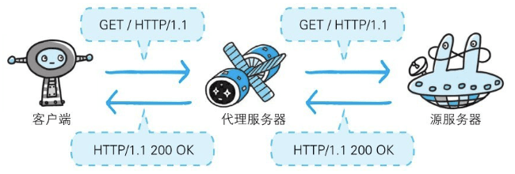
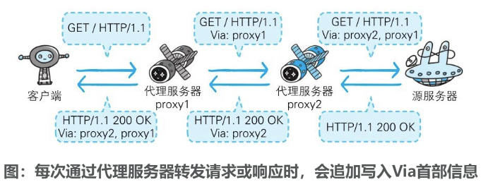

### 通信数据转发程序：代理、网关、隧道

HTTP通信时，除客户端和服务器以外，还有一些用于通信数据转发的应用程序，例如代理、网关和隧道。它们可以配合服务器工作。

这些应用程序和服务器可以将请求转发给通信线路上的下一站服务器，并且能接收从那台服务器发送的响应再转发给客户端。

#### 代理

代理是一种有转发功能的应用程序，它扮演了位于服务器和客户端“中间人”的角色，**接收由客户端发送的请求并转发给服务器，同时也接收服务器返回的响应并转发给客户端**。

**代理服务器的基本行为就是接收客户端发送的请求后转发给其他服务器**。代理不改变请求URI，会直接发送给前方持有资源的目标服务器。

持有资源实体的服务器被称为源服务器。从源服务器返回的响应经过代理服务器后再传给客户端。

#### 网关

**网关是转发其他服务器通信数据的服务器**，**接收从客户端发送来的请求时，它就像自己拥有资源的源服务器一样对请求进行处理**。有时客户端可能都不会察觉，自己的通信目标是一个网关。

#### 隧道

隧道是在相隔甚远的客户端和服务器两者之间进行中转，并保持双方通信连接的应用程序。

