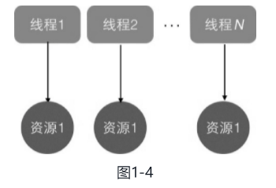
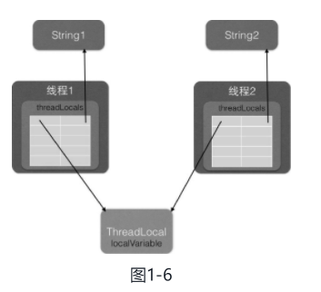

## 1 并发编程线程基础

#### 1.1 什么是线程

线程是进程中的一个实体，线程本身是不会独立存在的。**进程是代码在数据集合上的一次运行活动，是系统进行资源分配和调度的基本单位，线程则是进程执行的一个执行路径，一个进程中至少有一个线程，进程中的多个线程共享进程的资源**。  

操作系统在分配资源时是把资源分配给进程的，但是**CPU资源比较特殊，它是被分配到线程的**，因为真正要占用CPU运行的是线程，所以也说**线程是CPU分配的基本单位**。  

 在Java中，**当我们启动main函数时其实就启动了一个JVM的进程**，而**main函数所在的线程就是这个进程中的一个线程，也称主线程**。 

进程和线程的关系如图


由图1-1 可以看到，一个进程中有多个线程，多个线程共享进程的堆和方法区资源，但是每个线程有自己的程序计数器和栈区域。  

程序计数器是一块内存区域，用来记录线程当前要执行的指令地址。那么为何要将程序计数器设计为线程私有的呢？前面说了线程是占用CPU执行的基本单位，而CPU一般是使用时间片轮转方式让线程轮询占用的，所以当前线程CPU时间片用完后，要让出CPU，等下次轮到自己的时候再执行。那么如何知道之前程序执行到哪里了呢？其实**程序计数器就是为了记录该线程让出CPU时的执行地址的，待再次分配到时间片时线程就可以从自己私有的计数器指定地址继续执行**。另外需要注意的是，如果执行的是native方法，那么pc计数器记录的是undefined地址，只有执行的是Java代码时pc计数器记录的才是下一条指令的地址。  

另外每个线程都有自己的栈资源，用于存储该线程的局部变量，这些局部变量是该线程私有的，其他线程是访问不了的，除此之外栈还用来存放线程的调用栈帧。

**堆是一个进程中最大的一块内存，堆是被进程中的所有线程共享的，是进程创建时分配的，堆里面主要存放使用new操作创建的对象实例**。  

**方法区则用来存放JVM加载的类、常量及静态变量等信息，也是线程共享的**。

#### 线程状态转换


---

#### 1.2 线程的创建与运行

Java中有三种线程创建方式，分别为实现Runnable接口的run方法，继承Thread类并重写run的方法，使用`FutureTask`方式。 

**继承 Thread 类方式的实现**

```java
public class ThreadTest {
    public static class MyThread extends Thread {
        @Override
        public void run() {
            System.out.println("I am a child thread");
        }
    }

    public static void main(String[] args) {
        MyThread myThread = new MyThread();
        myThread.start();
    }
}
```

调用 start 方法后，线程并没有马上执行而是处于就绪状态，这个**就绪状态是指该线程已经获取了除CPU资源外的其他资源，等待获取CPU资源后才会真正处于运行状态**。一旦run方法执行完毕，该线程就处于**终止状态**。

使用继承方式的好处是，在run()方法内获取当前线程直接使用this就可以了，无须使用`Thread.currentThread()`方法；不好的地方是**Java不支持多继承，如果继承了Thread类，那么就不能再继承其他类**。另外**任务与代码没有分离**，当多个线程执行一样的任务时需要多份任务代码，而`Runable`则没有这个限制。 

**Runnable 接口的 run 方法方式**

```java
public class ThreadTest {
    public static class RunnableTask implements Runnable {
        @Override
        public void run() {
            System.out.println("I am a child thread");
        }
    }
    public static void main(String[] args) {
        RunnableTask runnableTask = new RunnableTask();
        new Thread(runnableTask).start();
        new Thread(runnableTask).start();
    }
}
```

如上面代码所示，两个线程共用一个task代码逻辑，如果需要，可以给`RunableTask`添加参数进行任务区分。另外，`RunableTask`可以继承其他类。但是上面介绍的两种方式都有一个缺点，就是**任务没有返回值**。

```java
public class ThreadTest {
    public static class CallerTask implements Callable<String> {

        @Override
        public String call() throws Exception {
            return "hello";
        }
    }
    public static void main(String[] args) throws InterruptedException {

        FutureTask<String> futureTask = new FutureTask<>(new CallerTask());
        new Thread(futureTask).start();
        try {
//            等待任务执行完毕，并返回结果
            String result = futureTask.get();
            System.out.println(result);
        } catch (ExecutionException e) {
            e.printStackTrace();
        }
    }
}
```

小结：使用继承方式的好处是方便传参，你可以在子类里面添加成员变量，通过set方法设置参数或者通过构造函数进行传递，而如果使用Runnable方式，则只能使用主线程里面被声明为final的变量。不好的地方是Java不支持多继承，如果继承了Thread类，那么子类不能再继承其他类，而`Runable`则没有这个限制。前两种方式都没办法拿到任务的返回结果，但是`Futuretask`方式可以。

#### 1.3 线程通知与等待

##### 1、wait() 函数 

当一个线程调用一个 **共享变量的 wait() 方法时**，**该调用线程会被阻塞挂起**，直到发生下面几件事情之一才返回：（1）**其他线程**调用了**该共享对象的notify()或者 notifyAll()方法**。

（2）**其他线程**调用了**该线程的interrupt()方法**，该线程抛出`InterruptedException`异常返回。

另外需要注意的是，如果调用wait()方法的线程没有事先获取该对象的监视器锁，则调用wait()时调用线程会抛出 `IllegalMonitorStateException`异常。

那么一个线程如何才能获取一个共享变量的监视器锁呢？

（1）执行synchronized同步代码块时，使用该共享变量作为参数。

```java
synchronized (共享变量) {
    // do  something
}
```

（2）调用该共享变量的方法，并且该方法使用了synchronized修饰。

```java
synchronized void add(int a, int b) {
    // do something
}
```

###### 虚假唤醒

另外需要注意的是，一个线程可以从挂起状态变为可以运行状态（也就是被唤醒），**即使该线程没有被其他线程调用notify()、notifyAll()方法进行通知，或者被中断，或者等待超时，这就是所谓的虚假唤醒**。虽然虚假唤醒在应用实践中很少发生，但要防患于未然，做法就是**不停地去测试该线程被唤醒的条件是否满足，不满足则继续等待，也就是说在一个循环中调用wait()方法进行防范**。 退出循环的条件是满足了唤醒该线程的条件。

```java
synchronized (obj) {
	while (条件不满足) {
        obj.wait();
    }
}
```

如上代码是经典的调用共享变量wait()方法的实例，首先通过同步块获取obj上面的监视器锁，然后在while循环内调用obj的wait()方法。

下面从一个简单的生产者和消费者例子来加深理解。如下面代码所示，其中queue为共享变量，生产者线程在调用queue的wait()方法前，使用`synchronized`关键字拿到了该共享变量queue的监视器锁，所以调用wait()方法才不会抛出`IllegalMonitorStateException`异常。如果当前队列没有空闲容量则会调用queue的wait()方法挂起当前线程，这里使用循环就是为了避免上面说的虚假唤醒问题。假如当前线程被虚假唤醒了，但是队列还是没有空余容量，那么当前线程还是会调用wait()方法把自己挂起。

```java
public class ProducerConsumer {
    private static final int CAPACITY = 5;
    private static int i = 0;

    public static void main(String[] args) {
        Queue<Integer> queue = new LinkedList<Integer>();

        Thread producer1 = new Producer("P-1", queue, CAPACITY);
        Thread producer2 = new Producer("P-2", queue, CAPACITY);

        Thread consumer1 = new Consumer("C1", queue, CAPACITY);
        Thread consumer2 = new Consumer("C2", queue, CAPACITY);
        Thread consumer3 = new Consumer("C3", queue, CAPACITY);

        producer1.start();
        producer2.start();

        consumer1.start();
        consumer2.start();
        consumer3.start();
    }

    /**
     * 生产者
     */
    public static class Producer extends Thread {
        private Queue<Integer> queue;
        String name;
        int maxSize;

        public Producer(String name, Queue<Integer> queue, int maxSize) {
            super(name);
            this.name = name;
            this.queue = queue;
            this.maxSize = maxSize;
        }

        @Override
        public void run() {
            while (true) {
                synchronized (queue) {
                    // 消费队列满，则等待队列空闲
                    while (queue.size() == maxSize) {
                        try {
                            // 挂起当前线程，并释放通过同步块获取的queue上的锁，让消费者线程可以获取该锁，然后获取队列里面的元素
                            System.out.println("Queue is full, Producer[" + name + "] thread waiting for " + "consumer to take something from queue.");
                            queue.wait();
                        } catch (Exception ex) {
                            ex.printStackTrace();
                        }
                    }
                    // 空闲则生成元素，并通知消费者线程
                    System.out.println("[" + name + "] Producing value : +" + i);
                    queue.offer(i++);
                    queue.notifyAll();
                }

                try {
                    Thread.sleep(new Random().nextInt(1000));
                } catch (InterruptedException e) {
                    e.printStackTrace();
                }
            }

        }
    }

    /**
     * 消费者
     */
    public static class Consumer extends Thread {
        private Queue<Integer> queue;
        String name;
        int maxSize;

        public Consumer(String name, Queue<Integer> queue, int maxSize) {
            super(name);
            this.name = name;
            this.queue = queue;
            this.maxSize = maxSize;
        }

        @Override
        public void run() {
            while (true) {
                synchronized (queue) {
                    // 消费队列为空
                    while (queue.isEmpty()) {
                        try {
                            // 挂起当前线程，并通过释放同步块获取的queue上的锁，让生产者线程可以获取该锁，将生产元素放入队列。
                            System.out.println("Queue is empty, Consumer[" + name + "] thread is waiting for Producer");
                            queue.wait();
                        } catch (Exception ex) {
                            ex.printStackTrace();
                        }
                    }
                    // 消费元素，并通知唤醒生产者线程
                    int x = queue.poll();
                    System.out.println("[" + name + "] Consuming value : " + x);
                    queue.notifyAll();
                }

                try {
                    Thread.sleep(new Random().nextInt(1000));
                } catch (InterruptedException e) {
                    e.printStackTrace();
                }
            }
        }
    }
}
```

在如上代码中**假如生产者线程A首先通过`synchronized`获取到了queue上的锁，那么后续所有企图生产元素的线程和消费线程将会在获取该监视器锁的地方被阻塞挂起**。线程A获取锁后发现当前队列已满会调用`queue.wait()`方法阻塞自己，然后释放获取的queue上的锁，这里考虑下为何要释放该锁？如果不释放，由于其他生产者线程和所有消费者线程都已经被阻塞挂起，而线程A也被挂起，这就处于了死锁状态。这里线程A挂起自己后释放共享变量上的锁，就是为了打破死锁必要条件之一的持有并等待原则。关于死锁后面的章节会讲。线程A释放锁后，其他生产者线程和所有消费者线程中会有一个线程获取queue上的锁进而进入同步块，这就打破了死锁状态。 

另外需要注意的是，**当前线程调用共享变量的wait()方法后只会释放当前共享变量上的锁**，**如果当前线程还持有其他共享变量的锁，则这些锁是不会被释放的**。  看下面一个例子：  

```java
package com.lanwq.bingfazhimei;

/**
 * @author Vin lan
 * @className ThreadTest2
 * @description 当前线程持有共享变量的锁和其他共享变量的锁
 * @createTime 2021-10-27  17:11
 **/
public class ThreadTest2 {
    /**
     * 创建资源
     */
    private static volatile Object resourceA = new Object();
    private static volatile Object resourceB = new Object();

    public static void main(String[] args) throws InterruptedException {
        Thread threadA = new Thread(() -> {
            try {
                // 获取 resourceA 共享资源的监视器锁
                synchronized (resourceA) {
                    System.out.println("threadA get resourceA lock");

                    // 获取 resourceB 共享资源的监视器锁
                    synchronized (resourceB) {
                        System.out.println("ThreadA get resourceB lock");
                        // 线程A 阻塞，并释放获取到的 resourceA 的锁
                        System.out.println("threadA release resourceA lock");
                        resourceA.wait();
                    }
                }
            } catch (InterruptedException e) {
                e.printStackTrace();
            }
        });

        Thread threadB = new Thread(() -> {
            try {
                // 休眠 1 秒
                Thread.sleep(1000);
                // 获取 resourceA 共享资源的监视器锁
                synchronized (resourceA) {
                    System.out.println("threadB get resourceA lock");
                    System.out.println("threadB try get resourceB lock...");
                    // 获取 resourceB 共享资源的监视器锁
                    synchronized (resourceB) {
                        System.out.println("ThreadB get resourceB lock");
                        // 线程 B 阻塞，并释放获取到的 resourceA 的锁
                        System.out.println("threadB release resourceA lock");
                        resourceA.wait();
                    }
                }
            } catch (InterruptedException e) {
                e.printStackTrace();
            }
        });

        // 启动线程
        threadA.start();
        threadB.start();
        // 等待2个线程结束
        threadA.join();
        threadB.join();
        System.out.println("main over");
    }
}
// 输出, 一直在运行
threadA get resourceA lock
ThreadA get resourceB lock
threadA release resourceA lock
threadB get resourceA lock
threadB try get resourceB lock...
```

如上代码中，在main函数里面启动了线程A和线程B，为了让线程A先获取到锁，这里让线程B先休眠了1s，线程A先后获取到共享变量resourceA和共享变量resourceB上的锁，然后调用了resourceA的wait()方法阻塞自己，阻塞自己后线程A释放掉获取的resourceA上的锁。

线程B休眠结束后会首先尝试获取resourceA上的锁，如果当时线程A还没有调用wait()方法释放该锁，那么线程B会被阻塞，当线程A释放了resourceA上的锁后，线程B就会获取到resourceA上的锁，然后尝试获取resourceB上的锁。由于线程A调用的是resourceA上的wait()方法，所以线程A挂起自己后并没有释放获取到的resourceB上的锁，所以线程B尝试获取resourceB上的锁时会被阻塞。  

**这就证明了当线程调用共享对象的wait()方法时，当前线程只会释放当前共享对象的锁，当前线程持有的其他共享对象的监视器锁并不会被释放。**

最后再举一个例子进行说明。当一个线程调用共享对象的wait()方法被阻塞挂起后，如果其他线程中断了该线程，则该线程会抛出InterruptedException异常并返回。 

```java
package com.lanwq.bingfazhimei;

/**
 * @author Vin lan
 * @className WaitNotifyInterupt
 * @description
 * @createTime 2021-10-27  17:24
 **/
public class WaitNotifyInterrupt {
    static Object obj = new Object();

    public static void main(String[] args) throws InterruptedException {
        Thread threadA = new Thread(() -> {
            try {
                System.out.println("---begin---");
                synchronized (obj) {
                    System.out.println("阻塞之前");
                    obj.wait();
                }
                // 阻塞之后，后面的代码不会执行了，调用 notify 才会运行
                System.out.println("---end---");
            } catch (InterruptedException e) {
                e.printStackTrace();
            }
        });
        threadA.start();
        Thread.sleep(1000);
        System.out.println("---------begin interrupt threadA --------");
        threadA.interrupt();
        System.out.println("---------end interrupt threadA----------");
        System.out.println("notify begin");
//        synchronized (obj) {
            obj.notify();
//        }
        System.out.println("notify end");
    }
}

```

##### 2、wait(long timeout) 函数  

该方法相比wait()方法多了一个超时参数，它的不同之处在于，如果一个线程调用共享对象的该方法挂起后，没有在指定的timeout ms时间内被其他线程调用该共享变量的notify()或者notifyAll()方法唤醒，那么该函数还是会因为超时而返回。如果将timeout设置为0则和wait方法效果一样，因为在wait方法内部就是调用了wait（0）。需要注意的是，如果在调用该函数时，传递了一个负的timeout则会抛出IllegalArgumentException异常。

##### 3、wait(long timeout, int nanos) 函数  

在其内部调用的是wait（long timeout）函数，如下代码只有在nanos>0时才使参数timeout递增1。

```java
public final void wait(long timeout, int nanos) throws InterruptedException {
        if (timeout < 0) {
            throw new IllegalArgumentException("timeout value is negative");
        }

        if (nanos < 0 || nanos > 999999) {
            throw new IllegalArgumentException(
                                "nanosecond timeout value out of range");
        }

        if (nanos > 0) {
            timeout++;
        }

        wait(timeout);
    }
```

##### 4、notify() 函数 

**一个线程调用共享对象的notify()方法后，会唤醒一个在该共享变量上调用wait系列方法后被挂起的线程**。**一个共享变量上可能会有多个线程在等待，具体唤醒哪个等待的线程是随机的**。  

此外，**被唤醒的线程不能马上从wait方法返回并继续执行**，**它必须在获取了共享对象的监视器锁后才可以返回**，也就是唤醒它的线程释放了共享变量上的监视器锁后，被唤醒的线程也不一定会获取到共享对象的监视器锁，这是因为该线程还需要和其他线程一起竞争该锁，只有该线程竞争到了共享变量的监视器锁后才可以继续执行。  .

类似wait系列方法，只有当前线程获取到了共享变量的监视器锁后，才可以调用共享变量的notify()方法，否则会抛出`IllegalMonitorStateException`异常。

##### 5、notifyAll() 函数  

不同于在共享变量上调用notify()函数会唤醒被阻塞到该共享变量上的一个线程，notifyAll()方法则会唤醒所有在该共享变量上由于调用wait系列方法而被挂起的线程。 

下面举一个例子来说明notify()和notifyAll()方法的具体含义及一些需要注意的地方，代码如下。

```java
package com.lanwq.bingfazhimei;

/**
 * @author Vin lan
 * @className NotifyAndNotifyAllDiff
 * @description notify() 和 notifyAll() 方法的区别，需要注意的地方
 * @createTime 2021-10-28  09:23
 **/
public class NotifyAndNotifyAllDiff {
    private static volatile Object resourceA = new Object();

    public static void main(String[] args) throws InterruptedException {
        Thread threadA = new Thread(() -> {
           // 获取 resourceA 共享资源的监视器锁
           synchronized (resourceA) {
               System.out.println("threadA get resourceA lock");
               try {
                   System.out.println("threadA begin wait");
                   resourceA.wait();
                   System.out.println("threadA end wait");
               } catch (InterruptedException e) {
                   e.printStackTrace();
               }
           }
        });

        Thread threadB = new Thread(() -> {
            // 获取 resourceA 共享资源的监视器锁
            synchronized (resourceA) {
                System.out.println("threadB get resourceA lock");
                try {
                    System.out.println("threadB begin wait");
                    resourceA.wait();
                    System.out.println("threadB end wait");
                } catch (InterruptedException e) {
                    e.printStackTrace();
                }
            }
        });

        Thread threadC = new Thread(() -> {
            // 获取 resourceA 共享资源的监视器锁
            synchronized (resourceA) {
                System.out.println("threadC begin notify");
                resourceA.notify();
            }
        });

        threadA.start();
        threadB.start();
        Thread.sleep(1000);
        threadC.start();
        // 等待线程结束
        threadA.join();
        threadB.join();
        threadC.join();
        System.out.println("main over");
    }
}
// 输出，主线程此时没有结束，还在运行中。线程 B 被挂起了，没有end
threadA get resourceA lock
threadA begin wait
threadB get resourceA lock
threadB begin wait
threadC begin notify
threadA end wait
```

如上代码开启了三个线程，其中线程A和线程B分别调用了共享资源resourceA的wait()方法，线程C则调用了notify()方法。这里启动线程C前首先调用sleep方法让主线程休眠1s，这样做的目的**是让线程A和线程B全部执行到调用wait方法后再调用线程C的notify方法**。这个例子试图在线程A和线程B都因调用共享资源resourceA的wait()方法而被阻塞后，让线程C再调用resourceA的notify()方法，从而唤醒线程A和线程B。但是从执行结果来看，只有一个线程A被唤醒，线程B没有被唤醒： 

从输出结果可知线程调度器这次先调度了线程A占用CPU来运行，线程A首先获取resourceA上面的锁，然后调用resourceA的wait()方法挂起当前线程并释放获取到的锁，然后线程B获取到resourceA上的锁并调用resourceA的wait()方法，此时线程B也被阻塞挂起并释放了resourceA上的锁，到这里线程A和线程B都被放到了resourceA的阻塞集合里面。线程C休眠结束后在共享资源resourceA上调用了notify()方法，这会激活resourceA的阻塞集合里面的一个线程，这里激活了线程A，所以线程A调用的wait()方法返回了，线程A执行完毕。而线程B还处于阻塞状态。如果把线程C调用的notify()方法改为调用notifyAll()方法，则执行结果如下。**线程运行结束了**

```java
threadA get resourceA lock
threadA begin wait
threadB get resourceA lock
threadB begin wait
threadC begin notify
threadB end wait
threadA end wait
main over
```

从输入结果可知线程A和线程B被挂起后，线程C调用notifyAll()方法会唤醒resourceA的等待集合里面的所有线程，这里线程A和线程B都会被唤醒，只是线程B先获取到resourceA上的锁，然后从wait()方法返回。线程B执行完毕后，线程A又获取了resourceA上的锁，然后从wait()方法返回。线程A执行完毕后，主线程返回，然后打印输出。

一个需要注意的地方是，在共享变量上调用notifyAll()方法只会唤醒调用这个方法前调用了wait系列函数而被放入共享变量等待集合里面的线程。**如果调用notifyAll()方法后一个线程调用了该共享变量的wait()方法而被放入阻塞集合，则该线程是不会被唤醒的**。尝试把主线程里面休眠1s的代码注释掉，再运行程序会有一定概率输出下面的结果。**线程还是在运行中的**。notifyAll() 只唤醒了 threadA。

```java
threadA get resourceA lock
threadA begin wait
threadC begin notify
threadB get resourceA lock
threadB begin wait
threadA end wait
```

也就是在线程B调用共享变量的wait()方法前线程C调用了共享变量的notifyAll()方法，这样，只有线程A被唤醒，而线程B并没有被唤醒，还是处于阻塞状态。

#### 1.4 等待线程执行终止的join方法  

在项目实践中经常会遇到一个场景，就是**需要等待某几件事情完成后才能继续往下执行**，**比如多个线程加载资源，需要等待多个线程全部加载完毕再汇总处理**。Thread类中有一个join方法就可以做这个事情，前面介绍的等待通知方法是Object类中的方法，而join方法则是Thread类直接提供的。join是无参且返回值为void的方法。

```java
package com.lanwq.bingfazhimei;

/**
 * @author Vin lan
 * @className JoinTest
 * @description join() 方法测试
 * @createTime 2021-10-28  09:57
 **/
public class JoinTest {
    public static void main(String[] args) throws InterruptedException {
        Thread threadOne = new Thread(() -> {
            try {
                Thread.sleep(1000);
            } catch (InterruptedException e) {
                e.printStackTrace();
            }
            System.out.println("child threadOne over");
        });

        Thread threadTwo = new Thread(() -> {
            try {
                Thread.sleep(1000);
            } catch (InterruptedException e) {
                e.printStackTrace();
            }
            System.out.println("child threadTwo over");
        });

        threadOne.start();
        threadTwo.start();
        System.out.println("wait all child thread over");
        threadOne.join();
        threadTwo.join();
    }
}

```

如上代码在主线程里面启动了两个子线程，然后分别调用了它们的join()方法，那么**主线程首先会在调用threadOne.join()方法后被阻塞**，**等待threadOne执行完毕后返回**。threadOne执行完毕后threadOne.join()就会返回，然后**主线程调用threadTwo.join()方法后再次被阻塞，等待threadTwo执行完毕后返回**。这里只是为了演示join方法的作用，在这种情况下使用后面会讲到的`CountDownLatch`是个不错的选择。

> **子线程在主线程调用join方法，那么主线程会阻塞，等待子线程执行完毕再返回**

另外，**线程A调用线程B的join方法后会被阻塞**，**当其他线程调用了线程A的interrupt()方法中断了线程A时**，线程A会抛出`InterruptedException`异常而返回。下面通过一个例子来加深理解。在这里 线程A = mainThread，线程B = threadOne。

```java
package com.lanwq.bingfazhimei;

/**
 * @author Vin lan
 * @className JoinTest
 * @description join() 方法测试
 * @createTime 2021-10-28  09:57
 **/
public class JoinTest {
    public static void main(String[] args) throws InterruptedException {
        Thread threadOne = new Thread(() -> {
            System.out.println("thread one begin run!");
            for (; ; ) {
            }
        });
        // 获取主线程
        final Thread mainThread = Thread.currentThread();

        Thread threadTwo = new Thread(() -> {
            try {
                Thread.sleep(1000);
            } catch (InterruptedException e) {
                e.printStackTrace();
            }
           // 中断主线程
            mainThread.interrupt();
        });
        // 启动子线程
        threadOne.start();
        // 延迟 1 s 启动线程
        threadTwo.start();
        try {
            threadOne.join(); // 等待线程one结束
        } catch (InterruptedException e) {
            e.printStackTrace();
            System.out.println("main thread :" + e);
        }
    }
}
// 输出
thread one begin run!
java.lang.InterruptedException
	at java.lang.Object.wait(Native Method)
	at java.lang.Thread.join(Thread.java:1249)
	at java.lang.Thread.join(Thread.java:1323)
	at com.lanwq.bingfazhimei.JoinTest.main(JoinTest.java:33)
main thread :java.lang.InterruptedException
```

如上代码在threadOne线程里面执行死循环，**主线程调用threadOne的join方法阻塞自己等待线程threadOne执行完毕**，待threadTwo休眠1s后会调用主线程的interrupt()方法设置主线程的中断标志，从结果看在主线程中的threadOne.join()处会抛出InterruptedException异常。这里需要注意的是，在threadTwo里面调用的是主线程的interrupt()方法，而不是线程threadOne的。

#### 1.5 让线程睡眠的 sleep 方法 

Thread类中有一个静态的sleep方法，**当一个执行中的线程调用了Thread的sleep方法后，调用线程会暂时让出指定时间的执行权，也就是在这期间不参与CPU的调度，但是该线程所拥有的监视器资源，比如锁还是持有不让出的**。**指定的睡眠时间到了**后该函数会正常返回，线程就处于就绪状态，**然后参与CPU的调度**，**获取到CPU资源后就可以继续运行了**。如果在睡眠期间其他线程调用了该线程的interrupt()方法中断了该线程，则该线程会在调用sleep方法的地方抛出InterruptedException异常而返回。

如下面例子，线程在睡眠时拥有的监视器资源不会被释放。 

```java
package com.lanwq.bingfazhimei;

import java.util.concurrent.locks.Lock;
import java.util.concurrent.locks.ReentrantLock;

/**
 * @author Vin lan
 * @className SleepTest
 * @description
 * @createTime 2021-10-28  10:23
 **/
public class SleepTest {
    // 创建一个独占锁
    private static final Lock lock = new ReentrantLock();

    public static void main(String[] args) throws InterruptedException {
        Thread threadOne = new Thread(() -> {
            // 获取独占锁
            lock.lock();
            try {
                System.out.println("child thread one is in sleep");
                Thread.sleep(10000);
                System.out.println("child thread one is in awake");
            } catch (InterruptedException e) {
                e.printStackTrace();
            } finally {
                // 释放锁
                lock.unlock();
            }
        });

        Thread threadTwo = new Thread(() -> {
            // 获取独占锁
            lock.lock();
            try {
                System.out.println("child thread two is in sleep");
                Thread.sleep(10000);
                System.out.println("child thread two is in awake");
            } catch (InterruptedException e) {
                e.printStackTrace();
            } finally {
                // 释放锁
                lock.unlock();
            }
        });

        // 启动线程
        threadOne.start();
        threadTwo.start();
    }
}
// 输出
child thread one is in sleep
child thread one is in awake
child thread two is in sleep
child thread two is in awake
```

如上代码首先创建了一个独占锁，然后创建了两个线程，每个线程在内部先获取锁，然后睡眠，睡眠结束后会释放锁。首先，无论执行多少遍上面的代码都是 thread one 先输出或者thread two 先输出，不会出现 thread one 和 thread two 交叉输出的情况。从执行结果来看，线程A先获取了锁，那么线程A会先输出一行，然后调用sleep方法让自己睡眠10s，在线程A睡眠的这10s内那个独占锁lock还是线程A自己持有，线程B会一直阻塞直到线程A醒来后执行unlock释放锁。

下面再来看一下，当一个线程处于睡眠状态时，如果另外一个线程中断了它，会不会在调用sleep方法处抛出异常。

```java
package com.lanwq.bingfazhimei;

import java.util.concurrent.locks.Lock;
import java.util.concurrent.locks.ReentrantLock;

/**
 * @author Vin lan
 * @className SleepTest
 * @description
 * @createTime 2021-10-28  10:23
 **/
public class SleepTest {
    // 创建一个独占锁
    private static final Lock lock = new ReentrantLock();

    public static void main(String[] args) throws InterruptedException {
        Thread threadOne = new Thread(() -> {
            // 获取独占锁
            lock.lock();
            try {
                System.out.println("child thread one is in sleep");
                Thread.sleep(10000);
                System.out.println("child thread one is in awake");
            } catch (InterruptedException e) {
                e.printStackTrace();
            } finally {
                // 释放锁
                lock.unlock();
            }
        });
        // 启动线程
        threadOne.start();
        // 主线程休眠 2s
        Thread.sleep(2000);
        // 主线程中断子线程
        threadOne.interrupt();
    }
}
// 输出
child thread one is in sleep
java.lang.InterruptedException: sleep interrupted
	at java.lang.Thread.sleep(Native Method)
	at com.lanwq.bingfazhimei.SleepTest.lambda$main$0(SleepTest.java:22)
	at java.lang.Thread.run(Thread.java:745)

```

子线程在睡眠期间，主线程中断了它，所以子线程在调用sleep方法处抛出了InterruptedException异常。另外需要注意的是，如果在调用Thread.sleep（long millis）时为millis参数传递了一个负数，则会抛出IllegalArgumentException异常。 

#### 1.6 让出 CPU 执行权的 yield 方法

Thread类中有一个静态的yield方法，当一个线程调用yield方法时，实际就是在**暗示线程调度器当前线程请求让出自己的CPU使用，但是线程调度器可以无条件忽略这个暗示**。

我们知道操作系统是为每个线程分配一个时间片来占有CPU的，正常情况下当一个线程把分配给自己的时间片使用完后，线程调度器才会进行下一轮的线程调度，而**当一个线程调用了Thread类的静态方法yield时，是在告诉线程调度器自己占有的时间片中还没有使用完的部分自己不想使用了，这暗示线程调度器现在就可以进行下一轮的线程调度**。  

当一个线程调用yield方法时，**当前线程会让出CPU使用权，然后处于就绪状态**，线程调度器会从线程就绪队列里面获取一个线程优先级最高的线程，当然也有可能会调度到刚刚让出CPU的那个线程来获取CPU执行权。

总结：**sleep与yield方法的区别**在于，**当线程调用sleep方法时调用线程会被阻塞挂起指定的时间，在这期间线程调度器不会去调度该线程**。而**调用yield方法时，线程只是让出自己剩余的时间片，并没有被阻塞挂起，而是处于就绪状态，线程调度器下一次调度时就有可能调度到当前线程执行**。

#### 1.7 线程中断   

Java中的线程中断是一种线程间的协作模式，通过设置线程的中断标志并不能直接终止该线程的执行，而是被中断的线程根据中断状态自行处理。  

- **void interrupt() 方法**：中断线程，例如，**当线程A运行时，线程B可以调用线程A的interrupt（）方法来设置线程A的中断标志为true并立即返回**。**设置标志仅仅是设置标志，线程A实际并没有被中断，它会继续往下执行**。如果线程A因为调用了wait系列函数、join方法或者sleep方法而被阻塞挂起，这时候若线程B调用线程A的interrupt（）方法，线程A会在调用这些方法的地方抛出InterruptedException异常而返回。
- **boolean isInterrupted() 方法**：**检测当前线程是否被中断，如果是返回true，否则返回false**。
- **boolean interrupted() 方法**：**检测当前线程是否被中断，如果是返回true，否则返回false**。与isInterrupted不同的是，该方法如果发现当前线程被中断，则会清除中断标志，并且该方法是static方法，可以通过Thread类直接调用。另外从下面的代码可以知道，在interrupted（）内部是获取当前调用线程的中断标志而不是调用interrupted（）方法的实例对象的中断标志。 

```java
    public static boolean interrupted() {
        return currentThread().isInterrupted(true);
    }
```

下面看一个根据中断标志判断线程是否终止的例子

```java
package com.lanwq.bingfazhimei;

/**
 * @author Vin lan
 * @className InterruptedTest
 * @description 线程中断
 * @createTime 2021-10-28  11:32
 **/
public class InterruptedTest {
    public static void main(String[] args) throws InterruptedException {
        Thread thread = new Thread(() -> {
            // 线程退出条件
            while (!Thread.currentThread().isInterrupted()) {
                // do more work
                System.out.println(Thread.currentThread() + " hello");
            }
        });
        thread.start();
        // 主线程休眠 1s，以便中断前让子线程输出
        Thread.sleep(500);
        System.out.println("main thread interrupt thread");
        thread.interrupt();
        // 等待子线程执行完毕
        thread.join();
        System.out.println("main is over");
    }
}
// 输出
Thread[Thread-0,5,main] hello
Thread[Thread-0,5,main] hello
Thread[Thread-0,5,main] hello
Thread[Thread-0,5,main] hello
Thread[Thread-0,5,main] hello
Thread[Thread-0,5,main] hello
main thread interrupt thread // 中断
Thread[Thread-0,5,main] hello
Thread[Thread-0,5,main] hello
Thread[Thread-0,5,main] hello
Thread[Thread-0,5,main] hello
Thread[Thread-0,5,main] hello
Thread[Thread-0,5,main] hello
main is over // 结束
```

在如上代码中，子线程thread通过检查当前线程中断标志来控制是否退出循环，主线程在休眠1s后调用thread的interrupt（）方法设置了中断标志，所以线程thread退出了循环。 

下面再来看一种情况。当线程为了等待一些特定条件的到来时，一般会调用sleep函数、wait系列函数或者join（）函数来阻塞挂起当前线程。比如一个线程调用了Thread. sleep（3000），那么调用线程会被阻塞，直到3s后才会从阻塞状态变为激活状态。但是有可能在3s内条件已被满足，如果一直等到3s后再返回有点浪费时间，这时候可以调用该线程的interrupt（）方法，强制sleep方法抛出InterruptedException异常而返回，线程恢复到激活状态。下面看一个例子。 

```java
package com.lanwq.bingfazhimei;

/**
 * @author Vin lan
 * @className InterruptedTest2
 * @description
 * @createTime 2021-10-28  11:54
 **/
public class InterruptedTest2 {
    public static void main(String[] args) throws InterruptedException {
        Thread threadOne = new Thread(() -> {
            try {
                System.out.println("thread one begin sleep for 2000 seconds");
                Thread.sleep(2000000);
                System.out.println("thread one awaking");
            } catch (InterruptedException e) {
                System.out.println("thread one is interrupted while sleeping");
                return;
            }
            System.out.println("thread one leaving normally");
        });

        threadOne.start();
        // 确保子线程进入休眠状态
        Thread.sleep(1000);
        // 打算子线程的休眠状态，让子线程从 sleep 函数返回
        threadOne.interrupt();
        // 等待子线程自行完毕
        threadOne.join();
        System.out.println("main thread is over");
    }
}
// 输出
thread one begin sleep for 2000 seconds
thread one is interrupted while sleeping
main thread is over

```

在如上代码中，threadOne线程休眠了2000s，在正常情况下该线程需要等到2000s后才会被唤醒，但是本例通过调用threadOne.interrupt（）方法打断了该线程的休眠，该线程会在调用sleep方法处抛出InterruptedException异常后返回。

```java
package com.lanwq.bingfazhimei;

/**
 * @author Vin lan
 * @className InterruptedTest2
 * @description interrupted() 和 isInterrupted() 方法的区别
 * @createTime 2021-10-28  11:54
 **/
public class InterruptedTest3 {
    public static void main(String[] args) throws InterruptedException {
        Thread threadOne = new Thread(() -> {
            for(;;){}
        });

        threadOne.start();
        // 设置中断标志
        threadOne.interrupt();
        // 获取中断标志
        System.out.println("获取中断标志 isInterrupted:" + threadOne.isInterrupted());
        // 获取中断标志并重置
        System.out.println("获取中断标志并重置 interrupted:" + Thread.interrupted());
        // 获取中断标志
        System.out.println("获取中断标志 isInterrupted:" + threadOne.isInterrupted());
        // 等待子线程自行完毕
        threadOne.join();
        System.out.println("main thread is over");
    }
}
// 输出
获取中断标志 isInterrupted:true
获取中断标志并重置 interrupted:false
获取中断标志 isInterrupted:true

```

第一行输出true这个大家应该都可以想到。上面我们介绍了在interrupted（）方法内部是获取当前线程的中断状态，这里获取的时主线程的中断标志，因为主线程是当前线程。

。。。

#### 1.8 理解上下文切换  

在多线程编程中，线程个数一般都大于CPU个数，而每个CPU同一时刻只能被一个线程使用，为了让用户感觉多个线程是在同时执行的，CPU资源的分配采用了时间片轮转的策略，也就是给每个线程分配一个时间片，线程在时间片内占用CPU执行任务。当前线程使用完时间片后，就会处于就绪状态并让出CPU让其他线程占用，这就是上下文切换，**从当前线程的上下文切换到了其他线程**。

那么就有一个问题，**让出CPU的线程等下次轮到自己占有CPU时如何知道自己之前运行到哪里了**？所以**在切换线程上下文时需要保存当前线程的执行现场，当再次执行时根据保存的执行现场信息恢复执行现场**。

线程上下文切换时机有：当前线程的CPU时间片使用完处于就绪状态时，当前线程被其他线程中断时。

#### 1.9 线程死锁 

##### 1、什么是线程死锁 

死锁是指两个或两个以上的线程在执行过程中，因争夺资源而造成的互相等待的现象，在无外力作用的情况下，这些线程会一直相互等待而无法继续运行下去，如图


在图1-2中，线程A已经持有了资源2，它同时还想申请资源1，线程B已经持有了资源1，它同时还想申请资源2，所以线程1和线程2就因为相互等待对方已经持有的资源，而进入了死锁状态。  

死锁的产生必须具备以下四个条件。

- **互斥条件**：指线程对已经获取到的资源进行排它性使用，即该资源同时只由一个线程占用。如果此时还有其他线程请求获取该资源，则请求者只能等待，直至占有资源的线程释放该资源。
-  **请求并持有条件**：指一个线程已经持有了至少一个资源，但又提出了新的资源请求，而新资源已被其他线程占有，所以当前线程会被阻塞，但阻塞的同时并不释放自己已经获取的资源。
- **不可剥夺条件**：指线程获取到的资源在自己使用完之前不能被其他线程抢占，只有在自己使用完毕后才由自己释放该资源。
- **环路等待条件**：指在发生死锁时，必然存在一个线程—资源的环形链，即线程集合{T0, T1, T2, …, Tn}中的T0正在等待一个T1占用的资源，T1正在等待T2占用的资源，……Tn正在等待已被T0占用的资源。

如下例子：

```java
package com.lanwq.bingfazhimei;

/**
 * @author Vin lan
 * @className DeadLock
 * @description 死锁
 * @createTime 2021-10-28  12:16
 **/
public class DeadLock {
    //    创建资源
    private static Object resourceA = new Object();
    private static Object resourceB = new Object();

    public static void main(String[] args) {
        //  创建线程
        Thread threadA = new Thread(() -> {
            synchronized (resourceA) {
                System.out.println(Thread.currentThread() + "get resourceA");
                try {
                    Thread.sleep(1000);
                } catch (InterruptedException e) {
                    e.printStackTrace();
                }
                System.out.println(Thread.currentThread() + " waiting get resourceB");
                synchronized (resourceB) {
                    System.out.println(Thread.currentThread() + "get resourceB");
                }
            }
        });

        Thread threadB = new Thread(() -> {
            synchronized (resourceB) {
                System.out.println(Thread.currentThread() + "get resourceB");
                try {
                    Thread.sleep(1000);
                } catch (InterruptedException e) {
                    e.printStackTrace();
                }
                System.out.println(Thread.currentThread() + " waiting get resourceA");
                synchronized (resourceA) {
                    System.out.println(Thread.currentThread() + "get resourceA");
                }
            }
        });

        threadA.start();
        threadB.start();
    }
}
// 输出，线程一直在运行，没有结束
Thread[Thread-0,5,main]get resourceA
Thread[Thread-1,5,main]get resourceB
Thread[Thread-0,5,main] waiting get resourceB
Thread[Thread-1,5,main] waiting get resourceA
```

下面分析代码和结果：Thread-0是线程A, Thread-1是线程B，代码首先创建了两个资源，并创建了两个线程。从输出结果可以知道，线程调度器先调度了线程A，也就是把CPU资源分配给了线程A，线程A使用synchronized（resourceA）方法获取到了resourceA的监视器锁，然后调用sleep函数休眠1s，休眠1s是为了保证线程A在获取resourceB对应的锁前让线程B抢占到CPU，获取到资源resourceB上的锁。线程A调用sleep方法后线程B会执行synchronized（resourceB）方法，这代表线程B获取到了resourceB对象的监视器锁资源，然后调用sleep函数休眠1s。好了，到了这里线程A获取到了resourceA资源，线程B获取到了resourceB资源。线程A休眠结束后会企图获取resourceB资源，而resourceB资源被线程B所持有，所以线程A会被阻塞而等待。而同时线程B休眠结束后会企图获取resourceA资源，而resourceA资源已经被线程A持有，所以线程A和线程B就陷入了相互等待的状态，也就产生了死锁。 下面谈谈本例是如何满足死锁的四个条件的。

首先，resourceA和resourceB都是互斥资源，当线程A调用synchronized（resourceA）方法获取到resourceA上的监视器锁并释放前，线程B再调用synchronized（resourceA）方法尝试获取该资源会被阻塞，只有线程A主动释放该锁，线程B才能获得，这满足了**资源互斥条件**。

线程A首先通过synchronized（resourceA）方法获取到resourceA上的监视器锁资源，然后通过synchronized（resourceB）方法等待获取resourceB上的监视器锁资源，这就构成了**请求并持有条件**。

线程A在获取resourceA上的监视器锁资源后，该资源不会被线程B掠夺走，只有线程A自己主动释放resourceA资源时，它才会放弃对该资源的持有权，这构成了**资源的不可剥夺条件**。

线程A持有objectA资源并等待获取objectB资源，而线程B持有objectB资源并等待objectA资源，这构成了**环路等待条件**。所以线程A和线程B就进入了死锁状态。

##### 2、如何避免线程死锁

要想避免死锁，只需要破坏掉至少一个构造死锁的必要条件即可，但是学过操作系统的读者应该都知道，目前只有**请求并持有和环路等待条件是可以被破坏的**。

造成死锁的原因其实和申请资源的顺序有很大关系，使用资源申请的有序性原则就可以避免死锁，那么什么是资源申请的有序性呢？对上面代码做修改：

```java
Thread threadB2 = new Thread(() -> {
            synchronized (resourceA) {// 修改为了 resourceA
                System.out.println(Thread.currentThread() + "get resourceB");
                try {
                    Thread.sleep(1000);
                } catch (InterruptedException e) {
                    e.printStackTrace();
                }
                System.out.println(Thread.currentThread() + " waiting get resourceB");
                synchronized (resourceB) { // 修改为了 resourceB
                    System.out.println(Thread.currentThread() + "get resourceB");
                }
            }
        });
// 输出
Thread[Thread-0,5,main]get resourceA
Thread[Thread-0,5,main] waiting get resourceB
Thread[Thread-0,5,main]get resourceB
Thread[Thread-2,5,main]get resourceB
Thread[Thread-2,5,main] waiting get resourceB
Thread[Thread-2,5,main]get resourceB
```

可以看到线程A 和线程B 都没有阻塞。如上代码让在线程B中获取资源的顺序和在线程A中获取资源的顺序保持一致，其实资源分配有序性就是指，假如线程A和线程B都需要资源1,2,3, ..., n时，对资源进行排序，线程A和线程B只有在获取了资源n-1时才能去获取资源n。

我们可以简单分析一下为何资源的有序分配会避免死锁，比如上面的代码，假如线程A和线程B同时执行到了synchronized（resourceA），只有一个线程可以获取到resourceA上的监视器锁，假如线程A获取到了，那么线程B就会被阻塞而不会再去获取资源B，线程A获取到resourceA的监视器锁后会去申请resourceB的监视器锁资源，这时候线程A是可以获取到的，线程A获取到resourceB资源并使用后会放弃对资源resourceB的持有，然后再释放对resourceA的持有，释放resourceA后线程B才会被从阻塞状态变为激活状态。所以资源的有序性破坏了资源的请求并持有条件和环路等待条件，因此避免了死锁。 

#### 1.10 守护线程与用户线程  

Java中的线程分为两类，分别为**daemon线程（守护线程）和user线程（用户线程）**。在JVM启动时会调用main函数，**main函数所在的线程就是一个用户线程**，**其实在JVM内部同时还启动了好多守护线程**，比如**垃圾回收线程**。

**区别：**

那么守护线程和用户线程有什么**区别**呢？区别之一是**当最后一个非守护线程结束时，JVM会正常退出，而不管当前是否有守护线程，也就是说守护线程是否结束并不影响JVM的退出**。言外之意，**只要有一个用户线程还没结束，正常情况下JVM就不会退出**。

如何创建一个守护线程，代码如下：

```java
public class DaemonThread {
    public static void main(String[] args) {
        Thread daemonThread = new Thread(() -> {

        });
        daemonThread.setDaemon(true);
        daemonThread.start();
    }
}
```

只需要设置线程的daemon参数为true即可。下面通过例子来理解用户线程与守护线程的区别。首先看下面的代码。

```java
public class DaemonThread {
    public static void main(String[] args) {
        Thread daemonThread = new Thread(() -> {

        });
        daemonThread.setDaemon(true);
        daemonThread.start();

        Thread userThread = new Thread(() -> {
            for (; ; ) {
            }
        });
        userThread.start();
        System.out.println("main thread is over");
    }
}
// 输出： main thread is over
// 代码一直在运行状态中
```

使用 jps 命令查看输出如下结果：


这个结果说明了当父线程结束后，子线程还是可以继续存在的，也就是子线程的生命周期并不受父线程的影响。这也说明了在用户线程还存在的情况下JVM进程并不会终止。那么我们把上面的thread线程设置为守护线程后，再来运行看看会有什么结果。 

>  输出：main is over 后就结束了

由于这里的守护线程执行的任务是一个死循环，这也说明了**如果当前进程中不存在用户线程，但是还存在正在执行任务的守护线程，则JVM不等守护线程运行完毕就会结束JVM进程**。  

main线程运行结束后，JVM会自动启动一个叫作`DestroyJavaVM`的线程，该线程会等待所有用户线程结束后终止JVM进程。

#### 1.11 ThreadLocal  

多线程访问同一个共享变量时特别容易出现并发问题，特别是在多个线程需要对一个共享变量进行写入时。为了保证线程安全，一般使用者在访问共享变量时需要进行适当的同步，如图1-3所示。

同步的措施一般是加锁，这就需要使用者对锁有一定的了解，这显然加重了使用者的负担。那么有没有一种方式可以做到，当创建一个变量后，每个线程对其进行访问的时候访问的是自己线程的变量呢？其实ThreadLocal就可以做这件事情，虽然ThreadLocal并不是为了解决这个问题而出现的。 


ThreadLocal是JDK包提供的，它提供了线程本地变量，也就是如果你创建了一个ThreadLocal变量，那么访问这个变量的每个线程都会有这个变量的一个本地副本。**当多个线程操作这个变量时，实际操作的是自己本地内存里面的变量，从而避免了线程安全问题**。**创建一个ThreadLocal变量后，每个线程都会复制一个变量到自己的本地内存**，如图1-4所示。



##### 1、ThreadLocal 使用示例  

本例开启了两个线程，在每个线程内部都设置了本地变量的值，然后调用 print 函数打印当前本地变量的值。如果打印后调用了本地变量的 remove 方法，则会删除本地内存中的该变量。代码如下：

```java
package com.lanwq.bingfazhimei;

/**
 * @author Vin lan
 * @className ThreadLocalTest
 * @description
 * @createTime 2021-10-28  16:42
 **/
public class ThreadLocalTest {
    /**
     * （1） print 函数
     */
    static void print(String str) {
        // 1.1 打印当前线程本地内存中 localVariable 变量的值
        System.out.println(str + " : " + localVariable.get());
        // 1.2 清楚当前线程本地内存中的 localVariable 变量
//        localVariable.remove();
    }

    /**
     * （2）创建 ThreadLocal 变量
     */
    static ThreadLocal<String> localVariable = new ThreadLocal<>();

    public static void main(String[] args) {
        /**
         * （3）创建线程
         */
        Thread threadOne = new Thread(() -> {
            localVariable.set("thread one local variable");
            print("thread one");
            System.out.println("thread one remove after " + " : " + localVariable.get());
        });

        Thread threadTwo = new Thread(() -> {
            localVariable.set("thread two local variable");
            print("thread two");
            System.out.println("thread two remove after " + " : " + localVariable.get());
        });

        threadOne.start();
        threadTwo.start();
        
        Thread threadThree = new Thread(() -> {
            // 每次都是用当前线程去判断是否当前线程有这个map，相同线程里面调用 set后面的之会覆盖前面的值
            threadLocal.set("hello world threadThree");
            threadLocal.set("hello world threadThree22222");
            System.out.println("thread three1 " + " : " + threadLocal.get());
            System.out.println("thread three2 " + " : " + threadLocal.get());
        });
        threadThree.start();
        threadThree.join();
    }
}
// 输出
thread one : thread one local variable
thread two : thread two local variable
thread one remove after  : thread one local variable
thread two remove after  : thread two local variable
```

线程One中的代码3.1通过set方法设置了localVariable的值，这其实设置的是线程One本地内存中的一个副本，这个副本线程Two是访问不了的。然后代码3.2调用了print函数，代码1.1通过get函数获取了当前线程（线程One）本地内存中localVariable的值。线程Two的执行类似于线程One。

打开代码1.2的注释后，再次运行，运行结果如下。

>thread one : thread one local variable
>thread two : thread two local variable
>thread one remove after  : null
>thread two remove after  : null
>
>thread three1  : hello world threadThree22222
>thread three2  : hello world threadThree22222

##### 2、ThreadLocal 的实现原理

首先看一下ThreadLocal相关类的类图结构，如图1-5所示。


由该图可知，Thread类中有一个threadLocals和一个inheritableThreadLocals，它们都是ThreadLocalMap类型的变量，而ThreadLocalMap是一个定制化的Hashmap。在默认情况下，每个线程中的这两个变量都为null，只有当前线程第一次调用ThreadLocal的set或者get方法时才会创建它们。其实每个线程的本地变量不是存放在ThreadLocal实例里面，而是存放在调用线程的threadLocals变量里面。也就是说，ThreadLocal类型的本地变量存放在具体的线程内存空间中。ThreadLocal就是一个工具壳，它通过set方法把value值放入调用线程的threadLocals里面并存放起来，当调用线程调用它的get方法时，再从当前线程的threadLocals变量里面将其拿出来使用。如果调用线程一直不终止，那么这个本地变量会一直存放在调用线程的threadLocals变量里面，所以当不需要使用本地变量时可以通过调用ThreadLocal变量的remove方法，从当前线程的threadLocals里面删除该本地变量。另外，Thread里面的threadLocals为何被设计为map结构？很明显是因为每个线程可以关联多个ThreadLocal变量。  

**set(T value) 方法**

```java
public void set(T value) {
        Thread t = Thread.currentThread();
        ThreadLocalMap map = getMap(t);
        if (map != null)
            map.set(this, value);
        else
            createMap(t, value);
    }

```

第一次调用会创建一个 `ThreadLocalMap`， t 这个线程是调用这个方法的线程。然后将创建出的 map 对象赋值给了 t 的成员变量 threadLocals。this 是设置值的那个 ThreadLocal 类的实例对象。

```java
    void createMap(Thread t, T firstValue) {
        t.threadLocals = new ThreadLocalMap(this, firstValue);
    }
```


查看 set 方法，每次不一样的 ThreadLocal 调用 set 方法的时候相当于创建一个新的 <key,value> 值，key 是由 当前这个 threadLocal 计算出来的。

```java
private void set(ThreadLocal<?> key, Object value) {

    // We don't use a fast path as with get() because it is at
    // least as common to use set() to create new entries as
    // it is to replace existing ones, in which case, a fast
    // path would fail more often than not.

    Entry[] tab = table;
    int len = tab.length;
    int i = key.threadLocalHashCode & (len-1);

    for (Entry e = tab[i];
         e != null;
         e = tab[i = nextIndex(i, len)]) {
        ThreadLocal<?> k = e.get();

        if (k == key) {
            e.value = value;
            return;
        }
// 说明 threadlocal 对象已经被回收了
        if (k == null) {
            replaceStaleEntry(key, value, i);
            return;
        }
    }

    tab[i] = new Entry(key, value);
    int sz = ++size;
    // 如果清理完无用条目(ThreadLocal被回收的条目)、并且数组中的数据大小 > 阈值的时候对当前的Table进行重新哈希
    if (!cleanSomeSlots(i, sz) && sz >= threshold)
        rehash();
}
```

总结：如图1-6所示，在每个线程内部都有一个名为threadLocals的成员变量，该变量的类型为HashMap，**其中key为我们定义的ThreadLocal变量的this引用，value则为我们使用set方法设置的值**。每个线程的本地变量存放在线程自己的内存变量threadLocals中，如果当前线程一直不消亡，那么这些本地变量会一直存在，所以可能会造成内存溢出，因此**使用完毕后要记得调用ThreadLocal的remove方法删除对应线程的threadLocals中的本地变量**。**！！！！**  




##### 3、ThreadLocal 不支持继承性  

```java
package com.lanwq.bingfazhimei;

/**
 * @author Vin lan
 * @className ThreadLocalTest
 * @description
 * @createTime 2021-10-28  16:42
 **/
public class ThreadLocalTest {

    /**
     * （2）创建 ThreadLocal 变量
     */
    static ThreadLocal<String> threadLocal = new ThreadLocal<>();

    public static void main(String[] args) {
        threadLocal.set("hello world");
        Thread threadThree = new Thread(() -> {

            System.out.println("thread three " + " : " + threadLocal.get());
        });
        threadThree.start();
        System.out.println("main: " + threadLocal.get());
    }
}
// 输出
main: hello world
thread three  : null
```

也就是说，同一个ThreadLocal变量在父线程中被设置值后，在子线程中是获取不到的。

根据上节的介绍，这应该是正常现象，因为在子线程thread里面调用get方法时当前线程为thread线程，而这里调用set方法设置线程变量的是main线程，两者是不同的线程，自然子线程访问时返回null。那么有没有办法让子线程能访问到父线程中的值？答案是有。 

##### 4、InheritableThreadLocal 类

InheritableThreadLocal继承自ThreadLocal，其提供了一个特性，就是让子线程可以访问在父线程中设置的本地变量。  

修改上面的代码：

> static ThreadLocal<String> threadLocal = new InheritableThreadLocal<>();
>
> 运行结果：
>
> main: hello world
> thread three  : hello world

那么在什么情况下需要子线程可以获取父线程的threadlocal变量呢？情况还是蛮多的，比如子线程需要使用存放在threadlocal变量中的用户登录信息，再比如一些中间件需要把统一的id追踪的整个调用链路记录下来。其实子线程使用父线程中的threadlocal方法有多种方式，比如创建线程时传入父线程中的变量，并将其复制到子线程中，或者在父线程中构造一个map作为参数传递给子线程，但是这些都改变了我们的使用习惯，所以在这些情况下InheritableThreadLocal就显得比较有用。

##### 5 ThreadLocalMap的Entry实现继承了WeakReference<ThreadLocal<?>>

```java
/**
 * The entries in this hash map extend WeakReference, using
 * its main ref field as the key (which is always a
 * ThreadLocal object).  Note that null keys (i.e. entry.get()
 * == null) mean that the key is no longer referenced, so the
 * entry can be expunged from table.  Such entries are referred to
 * as "stale entries" in the code that follows.
 */
static class Entry extends WeakReference<ThreadLocal<?>> {
    /** The value associated with this ThreadLocal. */
    Object value;

    Entry(ThreadLocal<?> k, Object v) {
        super(k);
        value = v;
    }
}
```

###### 内存泄漏案例

```java
import java.util.concurrent.LinkedBlockingQueue;
import java.util.concurrent.ThreadPoolExecutor;
import java.util.concurrent.TimeUnit;

public class ThreadLocalDemo {
    static class LocalVariable {
        private Long[] a = new Long[1024 * 1024];
    }

    // (1)
    final static ThreadPoolExecutor poolExecutor = new ThreadPoolExecutor(5, 5, 1, TimeUnit.MINUTES,
            new LinkedBlockingQueue<>());
    // (2)
    final static ThreadLocal<LocalVariable> localVariable = new ThreadLocal<LocalVariable>();

    public static void main(String[] args) throws InterruptedException {
        // (3)
        Thread.sleep(5000 * 4);
        for (int i = 0; i < 50; ++i) {
            poolExecutor.execute(new Runnable() {
                public void run() {
                    // (4)
                    localVariable.set(new LocalVariable());
                    // (5)
                    System.out.println("use local varaible" + localVariable.get());
                    localVariable.remove();
                }
            });
        }
        // (6)
        System.out.println("pool execute over");
    }
}
------
// 著作权归@pdai所有
// 原文链接：https://pdai.tech/md/java/thread/java-thread-x-threadlocal.html
```

如果用线程池来操作ThreadLocal 对象确实会造成内存泄露, 因为对于线程池里面不会销毁的线程, 里面总会存在着`<ThreadLocal, LocalVariable>`的强引用, 因为final static 修饰的 ThreadLocal 并不会释放, 而ThreadLocalMap 对于 Key 虽然是弱引用, 但是强引用不会释放, 弱引用当然也会一直有值, 同时创建的LocalVariable对象也不会释放, 就造成了内存泄露; 如果LocalVariable对象不是一个大对象的话, 其实泄露的并不严重, `泄露的内存 = 核心线程数 * LocalVariable`对象的大小。


---


## 2 其他的基础知识 

#### 2.1 什么是多线程并发编程 

首先要澄清并发和并行的概念，**并发是指同一个时间段内多个任务同时都在执行，并且都没有执行结束**，而**并行是说在单位时间内多个任务同时在执行**。**并发任务强调在一个时间段内同时执行**，而一个时间段由多个单位时间累积而成，所以说**并发的多个任务在单位时间内不一定同时在执行**。**在单CPU的时代多个任务都是并发执行的，这是因为单个CPU同时只能执行一个任务**。在单CPU时代多任务是共享一个CPU的，当一个任务占用CPU运行时，其他任务就会被挂起，当占用CPU的任务时间片用完后，会把CPU让给其他任务来使用，所以在单CPU时代多线程编程是没有太大意义的，并且线程间频繁的上下文切换还会带来额外开销。 

图 2-1所示为在单个 CPU 上运行两个线程，线程 A 和 线程 B 是轮流使用 CPU 进行任务处理的，也就是在某个时间内单个 CPU 只执行一个线程上面的任务。当线程 A 的时间片用完后会立即进行线程上下文切换，也就是保存当前线程 A 的执行上下文，然后切换到线程 B 来占用 CPU 运行任务。  


图2-2所示**为双CPU配置，线程A和线程B各自在自己的CPU上执行任务，实现了真正的并行运行**。


而在多线程编程实践中，线程的个数往往多于CPU的个数，所以一般都称多线程并发编程而不是多线程并行编程。

#### 2.2 为什么要进行多线程并发编程 

多核CPU时代的到来打破了单核CPU对多线程效能的限制。多个CPU意味着每个线程可以使用自己的CPU运行，这减少了线程上下文切换的开销，但随着对应用系统性能和吞吐量要求的提高，出现了处理海量数据和请求的要求，这些都对高并发编程有着迫切的需求。

#### 2.3 Java中的线程安全问题

谈到线程安全问题，我们先说说什么是共享资源。所谓**共享资源，就是说该资源被多个线程所持有或者说多个线程都可以去访问该资源**。只是读取资源是不会有线程安全问题的。

线程安全问题是指当多个线程同时读写一个共享资源并且没有任何同步措施时，导致出现脏数据或者其他不可预见的结果的问题，如图2-3所示。


在图2-3中，线程A和线程B可以同时操作主内存中的共享变量，那么线程安全问题和共享资源之间是什么关系呢？是不是说多个线程共享了资源，当它们都去访问这个共享资源时就会产生线程安全问题呢？答案是否定的，**如果多个线程都只是读取共享资源，而不去修改，那么就不会存在线程安全问题，只有当至少一个线程修改共享资源时才会存在线程安全问题**。

#### 2.4 Java中共享变量的内存可见性问题  

谈到内存可见性，我们首先来看看在多线程下处理共享变量时Java的内存模型，如图2-4所示：


Java内存模型规定，**将所有的变量都存放在主内存中，当线程使用变量时，会把主内存里面的变量复制到自己的工作空间或者叫作工作内存，线程读写变量时操作的是自己工作内存中的变量**。Java内存模型是一个抽象的概念，那么在实际实现中线程的工作内存是什么呢？


图中所示是一个双核CPU系统架构，每个核有自己的控制器和运算器，其中控制器包含一组寄存器和操作控制器，运算器执行算术逻辑运算。每个核都有自己的一级缓存，在有些架构里面还有一个所有CPU都共享的二级缓存。那么Java内存模型里面的工作内存，就对应这里的L1或者L2缓存或者CPU的寄存器。

**当一个线程操作共享变量时，它首先从主内存复制共享变量到自己的工作内存，然后对工作内存里的变量进行处理，处理完后将变量值更新到主内存。**

那么假如线程A和线程B同时处理一个共享变量 X，会出现什么情况？我们使用图2-5所示CPU架构，假设线程A和线程B使用不同CPU执行，并且当前两级Cache都为空，那么这时候由于Cache的存在，将会导致内存不可见问题，具体看下面的分析。 

- 线程A首先获取共享变量X的值，由于两级Cache都没有命中，所以加载主内存中X的值，假如为0。然后把X=0的值缓存到两级缓存，线程A修改X的值为1，然后将其写入两级Cache，并且刷新到主内存。线程A操作完毕后，线程A所在的CPU的两级Cache内和主内存里面的X的值都是1。
- 线程B获取X的值，首先一级缓存没有命中，然后看二级缓存，二级缓存命中了，所以返回X= 1；到这里一切都是正常的，因为这时候主内存中也是X=1。然后线程B修改X的值为2，并将其存放到线程2所在的一级Cache和共享二级Cache中，最后更新主内存中X的值为2；到这里一切都是好的。
- 线程A这次又需要修改X的值，获取时一级缓存命中，并且X=1，到这里问题就出现了，明明线程B已经把X的值修改为了2，为何线程A获取的还是1呢？这就是共享变量的内存不可见问题，也就是线程B写入的值对线程A不可见。

如何解决共享变量内存不可见的问题呢？使用Java中的 volatile 关键字就可以解决这个问题。

#### 2.5 Java中 synchronized 关键字  

##### 1、synchronized 关键字介绍  

synchronized块是Java提供的一种原子性内置锁，Java中的每个对象都可以把它当作一个同步锁来使用，这些**Java内置的使用者看不到的锁被称为内部锁，也叫作监视器锁**。线程的执行代码在进入synchronized代码块前会自动获取内部锁，这时候其他线程访问该同步代码块时会被阻塞挂起。**拿到内部锁的线程会在正常退出同步代码块或者抛出异常后或者在同步块内调用了该内置锁资源的wait系列方法时释放该内置锁**。

**内置锁是排它锁**，也就是当一个线程获取这个锁后，其他线程必须等待该线程释放锁后才能获取该锁。

另外，由于Java中的线程是与操作系统的原生线程一一对应的，所以当阻塞一个线程时，**需要从用户态切换到内核态执行阻塞操作**，这是很耗时的操作，而synchronized的使用就会导致上下文切换。

##### 2、synchronized 的内存语义 

- 解决共享变量内存可见性问题

**进入synchronized块的内存语义是把在synchronized块内使用到的变量从线程的工作内存中清除，这样在synchronized块内使用到该变量时就不会从线程的工作内存中获取，而是直接从主内存中获取**。

**退出synchronized块的内存语义是把在synchronized块内对共享变量的修改刷新到主内存**。

其实这也是**加锁和释放锁的语义**，**当获取锁后会清空锁块内本地内存中将会被用到的共享变量，在使用这些共享变量时从主内存进行加载**，**在释放锁时将本地内存中修改的共享变量刷新到主内存**。

- 实现原子性操作


#### 2.6 Java中的 volatile 关键字  

使用锁的方式可以解决共享变量内存可见性问题，但是使用锁太笨重，因为它会带来线程上下文的切换开销。对于解决内存可见性问题，Java还提供了一种弱形式的同步，也就是使用volatile关键字。该关键字可以确保对一个变量的更新对其他线程马上可见。**当一个变量被声明为volatile时，线程在写入变量时不会把值缓存在寄存器或者其他地方，而是会把值刷新回主内存。当其他线程读取该共享变量时，会从主内存重新获取最新值，而不是使用当前线程的工作内存中的值**。 

volatile的内存语义和synchronized有相似之处，具体来说就是，当线程写入了volatile变量值时就等价于线程退出synchronized同步块（把写入工作内存的变量值同步到主内存），读取volatile变量值时就相当于进入同步块（先清空本地内存变量值，再从主内存获取最新值）。

可以对比一下使用synchronized 和 volatile 关键字的使用案例：

```java
public class ThreadNotSafeInteger {
    private int value;

    public synchronized int getValue() {
        return value;
    }

    public synchronized void setValue(int value) {
        this.value = value;
    }
}
```

使用 volatile 同步

```java
public class ThreadNotSafeInteger {
    private volatile int value;

    public int getValue() {
        return value;
    }

    public void setValue(int value) {
        this.value = value;
    }
}
```

这里使用两者是等价的，都解决了共享变量 value 的内存可见性问题，但是前者是独占锁，同时只能有一个线程调用 get() 方法，其他调用线程会被阻塞，同时会存在线程上下文切换和线程重新调度的开销，这也是使用锁方式不好的地方。而后者是非阻塞算法，不会造成线程上下文切换的开销。

但并非在所有情况下使用它们都是等价的，**volatile虽然提供了可见性保证，但并不保证操作的原子性**。

**什么时候才使用 volatile 关键字呢？**

- **写入变量值不依赖变量的当前值时**。因为如果依赖当前值，将是获取—计算—写入三步操作，这三步操作不是原子性的，而volatile不保证原子性。
- **读写变量值时没有加锁**。因为加锁本身已经保证了内存可见性，这时候不需要把变量声明为volatile的。

#### 2.7 Java中的原子性操作

所谓原子性操作，是指执行一系列操作时，这些操作要么全部执行，要么全部不执行，不存在只执行其中一部分的情况。在设计计数器时一般都先读取当前值，然后+1，再更新。这个过程是读—改—写的过程，如果不能保证这个过程是原子性的，那么就会出现线程安全问题。 如下代码就是线程不安全的，因为不能保证 ++value 是原子性操作。  

```java
public class ThreadNotSafeInteger {
    private int value;

    public int getValue() {
        return value;
    }

    public void setValue(int value) {
        this.value = value;
    }
    
    public void inc(int value) {
        ++this.value;
    }
}
```

如何保证多个操作的原子性呢？最简单的方法就是使用 synchronized 关键字进行同步

```java
public class ThreadNotSafeInteger {
    private int value;

    public synchronized int getValue() {
        return value;
    }

    public synchronized void setValue(int value) {
        this.value = value;
    }
    
    public synchronized void inc(int value) {
        ++this.value;
    }
}
```

你也许会问，既然是只读操作，那为何不去掉getCount方法上的synchronized关键字呢？其实是不能去掉的，别忘了这里要靠synchronized来实现value的内存可见性。 

#### 2.8 Java中的CAS操作 

参考：[Java CAS(乐观锁)](https://www.jianshu.com/p/ae25eb3cfb5d) 

CAS即Compare and Swap，其是JDK提供的非阻塞原子性操作，它通过硬件保证了比较—更新操作的原子性。JDK里面的Unsafe类提供了一系列的*compareAndSwap*方法，下面以compareAndSwapLong方法为例进行简单介绍。

- **boolean compareAndSwapLong(Object obj, long valueOffset,long expect, long update)** 方法：其中compareAndSwap的意思是比较并交换。CAS有四个操作数，分别为：对象内存位置、对象中的变量的偏移量、变量预期值和新的值。其操作含义是，**如果对象obj中内存偏移量为valueOffset的变量值为expect，则使用新的值update替换旧的值expect**。这是处理器提供的一个原子性指令。

**CAS 操作经典的 ABA 问题**，具体如下：假如线程 I 使用 CAS 修改初始值为 A 的变量 X （X = A），那么线程 I 回首先取获取当前变量 X 的值（为 A），然后使用 CAS 操作尝试修改 X 的值为 B，如果使用 CAS 操作成功了，那么程序运行一定正确吗？其实未必，这是因为有可能在线程 I 获取变量 X 的值 A 后，在执行 CAS 前，线程 II 使用 CAS 修改了变量 X 的值为 B，然后又使用 CAS 修改了变量 X 的值为 A。所以虽然线程I执行CAS时X的值是A，但是这个A已经不是线程I获取时的A了。这就是ABA问题。  

ABA问题的产生是因为变量的状态值产生了环形转换，就是变量的值可以从A到B，然后再从B到A。如果变量的值只能朝着一个方向转换，比如A到B, B到C，不构成环形，就不会存在问题。**JDK中的AtomicStampedReference类给每个变量的状态值都配备了一个时间戳，从而避免了ABA问题的产生**。

#### 2.9 Unsafe 类

暂时不看《Java并发编程之美》

#### 2.10 Java指令重排序  

Java内存模型允许编译器和处理器对指令重排序以提高运行性能，并且只会对不存在数据依赖性的指令重排序。在单线程下重排序可以保证最终执行的结果与程序顺序执行的结果一致，但是在多线程下就会存在问题。

下面一个例子：

```java
int a = 1;(1)
int b = 2;(2)
int c = a + b;(3)
```

在如上代码中，变量c的值依赖a和b的值，所以重排序后能够保证（3）的操作在（2）（1）之后，但是（1）（2）谁先执行就不一定了，这在单线程下不会存在问题，因为并不影响最终结果。

如下面多线程的例子：

```java
package com.lanwq.bingfazhimei;

/**
 * @author Vin lan
 * @className ReorderProblem
 * @description 重排序问题
 * @createTime 2021-10-29  14:48
 **/
public class ReorderProblem {
    public static class ReadThread extends Thread {
        @Override
        public void run() {
            while (!Thread.currentThread().isInterrupted()) {
                if (ready) { // (1)
                    System.out.println(num + num); // (2)
                }
                System.out.println("read thread...");
            }
        }
    }

    public static class WriteThread extends Thread {
        @Override
        public void run() {
            num = 2; // (3)
            ready = true; // (4)
            System.out.println("write thread is over...");
        }
    }
    private static int num = 0;
    private static boolean ready = false;

    public static void main(String[] args) throws InterruptedException{
        ReadThread readThread = new ReadThread();
        readThread.start();
        WriteThread writeThread = new WriteThread();
        writeThread.start();
        Thread.sleep(10);
        readThread.interrupt();
        System.out.println("main exit");
    }
}
```

首先这段代码里面的变量没有被声明为volatile的，也没有使用任何同步措施，所以在多线程下存在共享变量内存可见性问题。这里先不谈内存可见性问题，因为通过把变量声明为volatile的本身就可以避免指令重排序问题。  

这里先看看指令重排序会造成什么影响，如上代码在不考虑内存可见性问题的情况下一定会输出4？答案是不一定，由于代码（1）（2）（3）（4）之间不存在依赖关系，所以写线程的代码（3）（4）可能被重排序为先执行（4）再执行（3），那么执行（4）后，读线程可能已经执行了（1）操作，并且在（3）执行前开始执行（2）操作，这时候输出结果为0而不是4。

重排序在多线程下会导致非预期的程序执行结果，而使用volatile修饰ready就可以避免重排序和内存可见性问题。

**写volatile变量时，可以确保volatile写之前的操作不会被编译器重排序到volatile写之后。读volatile变量时，可以确保volatile读之后的操作不会被编译器重排序到volatile读之前**。

#### 2.11 伪共享  

##### 1、什么是伪共享 

为了解决计算机系统中主内存与CPU之间运行速度差问题，会在CPU与主内存之间添加一级或者多级高速缓冲存储器（Cache）。这个Cache一般是被集成到CPU内部的，所以也叫CPU Cache，图2-6所示是两级Cache结构。


在Cache内部是按行存储的，其中每一行称为一个Cache行。Cache行（如图2-7所示）是Cache与主内存进行数据交换的单位，Cache行的大小一般为2的幂次数字节。

 

当CPU访问某个变量时，首先会去看CPU Cache内是否有该变量，如果有则直接从中获取，否则就去主内存里面获取该变量，然后把**该变量所在内存区域的一个Cache行大小的内存复制到Cache中**。**由于存放到Cache行的是内存块而不是单个变量，所以可能会把多个变量存放到一个Cache行中**。**当多个线程同时修改一个缓存行里面的多个变量时，由于同时只能有一个线程操作缓存行，所以相比将每个变量放到一个缓存行，性能会有所下降，这就是伪共享**。如图 2-8 所示。

> 复制了要使用变量所在的内存块，内存块存在其他的变量，所以一并复制到了 cache 行中了。


在该图中，变量x和y同时被放到了CPU的一级和二级缓存，当线程1使用CPU1对变量x进行更新时，首先会修改CPU1的一级缓存变量x所在的缓存行，这时候在缓存一致性协议下，CPU2中变量x对应的缓存行失效。那么线程2在写入变量x时就只能去二级缓存里查找，这就破坏了一级缓存。而一级缓存比二级缓存更快，这也说明了多个线程不可能同时去修改自己所使用的CPU中相同缓存行里面的变量。更坏的情况是，如果CPU只有一级缓存，则会导致频繁地访问主内存。

##### 2、 为何会出现伪共享  

伪共享的产生是因为多个变量被放入了一个缓存行中，并且多个线程同时去写入缓存行中不同的变量。那么为何多个变量会被放入一个缓存行呢？其实是因为缓存与内存交换数据的单位就是缓存行，当CPU要访问的变量没有在缓存中找到时，根据程序运行的局部性原理，会把该变量所在内存中大小为缓存行的内存放入缓存行。

```java
long a;
long b;
long c;
long d;
```

如上代码声明了四个long变量，假设缓存行的大小为32字节，那么当CPU访问变量a时，发现该变量没有在缓存中，就会去主内存把变量a以及内存地址附近的b、c、d放入缓存行。也就是地址连续的多个变量才有可能会被放到一个缓存行中。当创建数组时，数组里面的多个元素就会被放入同一个缓存行。

##### 3、如何避免伪共享 

在JDK 8之前一般都是通过字节填充的方式来避免该问题，也就是创建一个变量时使用填充字段填充该变量所在的缓存行，这样就避免了将多个变量存放在同一个缓存行中，例如如下代码。

```java
public final static class FilledLong {
    public volatile long value = 0L;
    public long p1, p2, p3, p4, p5, p6;
}
```

假如缓存行为64字节，那么我们在FilledLong类里面填充了6个long类型的变量，每个long类型变量占用8字节，加上value变量的8字节总共56字节。另外，这里FilledLong是一个类对象，而类对象的字节码的对象头占用8字节，所以一个FilledLong对象实际会占用64字节的内存，这正好可以放入一个缓存行。 

JDK 8提供了一个sun.misc.Contended注解，用来解决伪共享问题。将上面代码修改为如下。

```java
 @sun.misc.Contended
public final static class FilledLong {
    public volatile long value = 0L;
}
```

在这里注解用来修饰类，当然也可以修饰变量，比如在Thread类中。

```Java
/** The current seed for a ThreadLocalRandom */
@sun.misc.Contended("tlr")
long threadLocalRandomSeed;

/** Probe hash value; nonzero if threadLocalRandomSeed initialized */
@sun.misc.Contended("tlr")
int threadLocalRandomProbe;

/** Secondary seed isolated from public ThreadLocalRandom sequence */
@sun.misc.Contended("tlr")
int threadLocalRandomSecondarySeed;
```

需要注意的是，**在默认情况下，@Contended注解只用于Java核心类，比如rt包下的类**。如果**用户类路径下的类需要使用这个注解，则需要添加JVM参数：-XX:-RestrictContended**。填充的宽度默认为128，要自定义宽度则可以设置-XX:ContendedPaddingWidth参数。

内容为 `LongAdder`的实现奠定了基础。  

#### 2.12 锁的概述  

##### 1、乐观锁和悲观锁  

###### **悲观锁**

悲观锁指对数据被外界修改持保守态度，认为数据很容易就会被其他线程修改，所以在数据被处理前先对数据进行加锁，并在整个数据处理过程中，使数据处于锁定状态。**悲观锁的实现往往依靠数据库提供的锁机制，即在数据库中，在对数据记录操作前给记录加排它锁**。如果获取锁失败，则说明数据正在被其他线程修改，当前线程则等待或者抛出异常。如果获取锁成功，则对记录进行操作，然后提交事务后释放排它锁。  

**悲观锁是一种排它锁**。

```java
public int updateEntry(long id) {
    // (1)使用悲观锁获取指定记录
    EntryObject entry = query("select * from table1 where id= #{id} for update", id);
    // (2)修改记录内容，根据计算修改 entry 记录的属性
    String name = generatoryName(entry);
    entry.setName(name);
    ...
       
    // (3)update 操作
    int count = update("update table1 set name = #{name}, age = #{age} where id= #{id}", entry);
    return count;
}
```

对于如上代码，**假设updateEntry、query、update方法都使用了事务切面的方法，并且事务传播性被设置为required**（使用了事务注解）。执行updateEntry方法时如果上层调用方法里面没有开启事务，则会即时开启一个事务，然后执行代码（1）。代码（1）调用了query方法，其根据指定id从数据库里面查询出一个记录。由于事务传播性为requried，所以执行query时没有开启新的事务，而是加入了updateEntry开启的事务，也就是在updateEntry方法执行完毕提交事务时，query方法才会被提交，就是说记录的锁定会持续到updateEntry执行结束。

代码（2）则对获取的记录进行修改，代码（3）把修改的内容写回数据库，同样代码（3）的update方法也没有开启新的事务，而是加入了updateEntry的事务。也就是updateEntry、query、update方法共用同一个事务。

当多个线程同时调用updateEntry方法，并且传递的是同一个id时，只有一个线程执行代码（1）会成功，其他线程则会被阻塞，这是因为在同一时间只有一个线程可以获取对应记录的锁，在获取锁的线程释放锁前（updateEntry执行完毕，提交事务前），其他线程必须等待，也就是在同一时间只有一个线程可以对该记录进行修改。 

###### 乐观锁

**乐观锁是相对悲观锁来说的，它认为数据在一般情况下不会造成冲突，所以在访问记录前不会加排它锁，而是在进行数据提交更新时，才会正式对数据冲突与否进行检测**。具体来说，根据update返回的行数让用户决定如何去做。将上面的例子改为使用乐观锁的代码如下。

```java
public int updateEntry(long id) {
    // (1)使用悲观锁获取指定记录
    EntryObject entry = query("select * from table1 where id= #{id} for update", id);
    // (2)修改记录内容，根据计算修改 entry 记录的属性
    String name = generatoryName(entry);
    entry.setName(name);
    ...
       
    // (3)update 操作
    int count = update("update table1 set name = #{name}, age = #{age}, version = #{version}+1 where id= #{id} and version = #{version}", entry);
    return count;
}
```

> 相比于上面的代码（3）操作多了 version 的属性

当多个线程调用updateEntry方法并且传递相同的id时，多个线程可以同时执行代码（1）获取id对应的记录并把记录放入线程本地栈里面，然后可以同时执行代码（2）对自己栈上的记录进行修改，多个线程修改后各自的entry里面的属性应该都不一样了。然后多个线程可以同时执行代码（3），代码（3）中的update语句的where条件里面加入了version=#{version}条件，并且set语句中多了version=${version}+1表达式，**该表达式的意思是，如果数据库里面id =#{id} and version=#{version}的记录存在，则更新version的值为原来的值加1，这有点CAS操作的意思**。 

假设多个线程同时执行updateEntry并传递相同的id，那么它们执行代码（1）时获取的Entry是同一个，获取的Entry里面的version值都是相同的（这里假设version=0）。当多个线程执行代码（3）时，由于update语句本身是原子性的，假如线程A执行update成功了，那么这时候id对应的记录的version值由原始version值变为了1。其他线程执行代码（3）更新时发现数据库里面已经没有了version=0的语句，所以会返回影响行号0。在业务上根据返回值为0就可以知道当前更新没有成功，那么接下来有两个做法，如果业务发现更新失败了，下面可以什么都不做，也可以选择重试，如果选择重试，则updateEntry的代码可以修改为如下。

```java
public int updateEntry(long id) {
    boolean result = true;
    int retryNum = 5;
    while(retryNum > 0) {
        // (1)使用悲观锁获取指定记录
        EntryObject entry = query("select * from table1 where id= #{id} for update", id);
        // (2)修改记录内容，根据计算修改 entry 记录的属性
        String name = generatoryName(entry);
        entry.setName(name);
        ...

        // (3)update 操作
        int count = update("update table1 set name = #{name}, age = #{age}, version = #{version}+1 where id= #{id} and version = #{version}", entry);
        if(count == 1) {
            result = true;
            break;
        } 
        retryNum--;
    }
    return count;
}
```

如上代码使用retryNum设置更新失败后的重试次数，如果代码（3.1）执行后返回0，则说明代码（1.1）获取的记录已经被修改了，则循环一次，重新通过代码（1.1）获取最新的数据，然后再次执行代码（3.1）尝试更新。这类似CAS的自旋操作，只是这里没有使用死循环，而是指定了尝试次数。

> 乐观锁并不会使用数据库提供的锁机制，一般在表中添加version字段或者使用业务状态来实现。乐观锁直到提交时才锁定，所以不会产生任何死锁。

##### 2、公平锁与非公平锁  

**根据线程获取锁的抢占机制**，锁可以分为公平锁和非公平锁，

**公平锁表示线程获取锁的顺序是按照线程请求锁的时间早晚来决定的，也就是最早请求锁的线程将最早获取到锁**。也就是”老老实实排队“。

而**非公平锁则在运行时闯入，也就是先来不一定先得**。

ReentrantLock提供了公平和非公平锁的实现。

- 公平锁：ReentrantLock pairLock = new ReentrantLock(true)
- 非公平锁：ReentrantLock pairLock = new ReentrantLock(false)，如果构造函数不传递参数，则默认是非公平锁。

例如，假设线程A已经持有了锁，这时候线程B请求该锁其将会被挂起。当线程A释放锁后，假如当前有线程C也需要获取该锁，如果采用非公平锁方式，则根据线程调度策略，线程B和线程C两者之一可能获取锁，这时候不需要任何其他干涉，而如果使用公平锁则需要把C挂起，让B获取当前锁。

**在没有公平性需求的前提下尽量使用非公平锁，因为公平锁会带来性能开销**。

##### 3、独占锁与共享锁  

**根据锁只能被单个线程持有还是能被多个线程共同持有，锁可以分为独占锁和共享锁**。

**独占锁保证任何时候都只有一个线程能得到锁，ReentrantLock就是以独占方式实现的**。

**共享锁则可以同时由多个线程持有，例如ReadWriteLock读写锁**，它允许一个资源可以被多线程同时进行读操作。  

**独占锁是一种悲观锁**，由于每次访问资源都先加上互斥锁，这限制了并发性，因为读操作并不会影响数据的一致性，而独占锁只允许在同一时间由一个线程读取数据，其他线程必须等待当前线程释放锁才能进行读取。

**共享锁则是一种乐观锁**，它放宽了加锁的条件，**允许多个线程同时进行读操作**。

##### 4、什么是可重入锁  

当一个线程要获取一个被其他线程持有的独占锁时，该线程会被阻塞，那么**当一个线程再次获取它自己已经获取的锁时是否会被阻塞呢？如果不被阻塞，那么我们说该锁是可重入的**，也就是只要该线程获取了该锁，那么可以无限次数（在高级篇中我们将知道，严格来说是有限次数）地进入被该锁锁住的代码。  

看下面一个例子，看看在什么情况下会使用可重入锁。  

```java
public class Hello {
  
    public synchronized void helloA() {
        System.out.println("heello");
    }

    public synchronized void helloB() {
        System.out.println("heello B");
        helloA();
    }
}
```

在如上代码中，调用helloB方法前会先获取内置锁，然后打印输出。之后调用helloA方法，在调用前会先去获取内置锁，如果内置锁不是可重入的，那么调用线程将会一直被阻塞。 

实际上，**synchronized内部锁是可重入锁**。**可重入锁的原理是在锁内部维护一个线程标示，用来标示该锁目前被哪个线程占用，然后关联一个计数器。一开始计数器值为0，说明该锁没有被任何线程占用。当一个线程获取了该锁时，计数器的值会变成1，这时其他线程再来获取该锁时会发现锁的所有者不是自己而被阻塞挂起**。

**但是当获取了该锁的线程再次获取锁时发现锁拥有者是自己，就会把计数器值加+1，当释放锁后计数器值-1。当计数器值为0时，锁里面的线程标示被重置为null，这时候被阻塞的线程会被唤醒来竞争获取该锁**。

> 尚硅谷视频中讲解--加锁后反编译
>
> 
>
> 
>
> 因为异常的时候要保证彻底能够释放。

##### 5、自旋锁  

由于Java中的线程是与操作系统中的线程一一对应的，所以当一个线程在获取锁（比如独占锁）失败后，会被切换到内核状态而被挂起。当该线程获取到锁时又需要将其切换到内核状态而唤醒该线程。而从用户状态切换到内核状态的开销是比较大的，在一定程度上会影响并发性能。自旋锁则是，当前线程在获取锁时，如果发现锁已经被其他线程占有，它不马上阻塞自己，在不放弃CPU使用权的情况下，多次尝试获取（默认次数是10，可以使用-XX:PreBlockSpinsh参数设置该值），很有可能在后面几次尝试中其他线程已经释放了锁。如果尝试指定的次数后仍没有获取到锁则当前线程才会被阻塞挂起。由此看来自旋锁是使用CPU时间换取线程阻塞与调度的开销，但是很有可能这些CPU时间白白浪费了。

