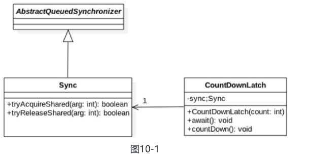

### CountDownLatch原理剖析 

#### 1 案例介绍 

在日常开发中经常会遇到需要在主线程中开启多个线程去并行执行任务，并且主线程需要等待所有子线程执行完毕后再进行汇总的场景。在CountDownLatch出现之前一般都使用线程的join（）方法来实现这一点，但是join方法不够灵活，不能够满足不同场景的需要，所以JDK开发组提供了CountDownLatch这个类，我们前面介绍的例子使用 CountDownLatch 会更优雅。

使用的 CountDownLatch 的代码如下：

```java
package com.lanwq.bingfazhimei.chapter2;

import java.util.concurrent.CountDownLatch;

/**
 * @author Vin lan
 * @className JoinCountDownLatch
 * @description CountDownLatch 代码使用
 * @createTime 2021-11-09  16:40
 **/
public class JoinCountDownLatch {

    /**
     * 创建一个 CountDownLatch 实例
     */
    private static volatile CountDownLatch countDownLatch = new CountDownLatch(2);

    public static void main(String[] args) throws InterruptedException{
        Thread threadOne = new Thread(() -> {
            try {
                Thread.sleep(1000);
            } catch (InterruptedException e) {
                e.printStackTrace();
            } finally {
                countDownLatch.countDown();
            }
            System.out.println("child threadOne over!");
        });

        Thread threadTwo = new Thread(() -> {
            try {
                Thread.sleep(1000);
            } catch (InterruptedException e) {
                e.printStackTrace();
            } finally {
                countDownLatch.countDown();
            }
            System.out.println("child threadTwo over!");
        });

        // 启动子线程
        threadOne.start();
        threadTwo.start();
        System.out.println("wait all child thread over!");
//        等待子线程执行完毕，返回
        countDownLatch.await();
        System.out.println("all child thread over!");
    }
}
```

输出：

> wait all child thread over!
> child threadOne over!
> child threadTwo over!
> all child thread over!

在如上代码中，创建了一个CountDownLatch实例，因为有两个子线程所以构造函数的传参为2。主线程调用 `countDownLatch.await();` 方法后会被阻塞。子线程执行完毕后调用 `countDownLatch.countDown();` 方法让countDownLatch内部的计数器减1，所有子线程执行完毕并调用countDown（）方法后计数器会变为0，这时候主线程的await（）方法才会返回。

其实上面的代码还不够优雅，在项目实践中一般都避免直接操作线程，而是使用ExecutorService线程池来管理。使用ExecutorService时传递的参数是Runable或者Callable对象，这时候你没有办法直接调用这些线程的join（）方法，这就需要选择使用CountDownLatch了。

```java
package com.lanwq.bingfazhimei.chapter2;

import java.util.concurrent.CountDownLatch;
import java.util.concurrent.ExecutorService;
import java.util.concurrent.Executors;

/**
 * @author Vin lan
 * @className JoinCountDownLatch
 * @description CountDownLatch 代码使用
 * @createTime 2021-11-09  16:40
 **/
public class JoinCountDownLatch {

    /**
     * 创建一个 CountDownLatch 实例
     */
    private static volatile CountDownLatch countDownLatch = new CountDownLatch(2);

    public static void main(String[] args) throws InterruptedException {
        ExecutorService executorService = Executors.newFixedThreadPool(2);
        executorService.execute(() -> {
            try {
                Thread.sleep(1000);
            } catch (InterruptedException e) {
                e.printStackTrace();
            } finally {
                countDownLatch.countDown();
            }
            System.out.println("child threadOne over!");
        });
        executorService.execute(() -> {
            try {
                Thread.sleep(1000);
            } catch (InterruptedException e) {
                e.printStackTrace();
            } finally {
                countDownLatch.countDown();
            }
            System.out.println("child threadOne over!");
        });

        System.out.println("wait all child thread over!");
//        等待子线程执行完毕，返回
        countDownLatch.await();
        System.out.println("all child thread over!");
        executorService.shutdownNow();
    }
}
```

输出

> wait all child thread over!
> child threadOne over!
> all child thread over!
> child threadOne over!

这里总结下**CountDownLatch与join方法的区别**。

一个区别是，**调用一个子线程的join（）方法后，该线程会一直被阻塞直到子线程运行完毕**，而**CountDownLatch则使用计数器来允许子线程运行完毕或者在运行中递减计数，也就是CountDownLatch可以在子线程运行的任何时候让await方法返回而不一定必须等到线程结束**。

另外，**使用线程池来管理线程时一般都是直接添加Runable到线程池，这时候就没有办法再调用线程的join方法了**，就是说countDownLatch相比join方法让我们对线程同步有更灵活的控制。

#### 2 实现原理探究  

从CountDownLatch的名字就可以猜测其内部应该有个**计数器，并且这个计数器是递减的**。下面就通过源码看看JDK开发组在何时初始化计数器，在何时递减计数器，当计数器变为0时做了什么操作，多个线程是如何通过计时器值实现同步的。CountDownLatch 类图如下。



从类图可以看出，CountDownLatch 类是使用 AQS 实现的。通过构造函数，实际上是把计数器的值赋给了 AQS 的状态变量 state，也就是这里使用 AQS 的状态值来表示计数器值。

```java
public CountDownLatch(int count) {
    if (count < 0) throw new IllegalArgumentException("count < 0");
    this.sync = new Sync(count);
}
```

通过理解CountDownLatch中的几个重要的方法，看它们是如何调用AQS来实现功能的。

##### 2.1 void await() 方法 

**当线程调用CountDownLatch对象的await方法后，当前线程会被阻塞**，直到下面的情况之一发生才会返回：

- **当所有线程都调用了CountDownLatch对象的countDown方法后，也就是计数器的值为0时**；
- **其他线程调用了当前线程的interrupt（）方法中断了当前线程，当前线程就会抛出InterruptedException异常，然后返回**。

看下 await() 方法内部是如何调用 AQS 方法的。

```java
public void await() throws InterruptedException {
    sync.acquireSharedInterruptibly(1);
}
// java.util.concurrent.locks.AbstractQueuedSynchronizer#acquireSharedInterruptibly  获取共享资源时可被中断的方法
public final void acquireSharedInterruptibly(int arg)
    throws InterruptedException {
    // 如果线程被中断则抛出异常
    if (Thread.interrupted())
        throw new InterruptedException();
    // 查看当前计数器是否为 0，为 0 则直接返回，否则进入 AQS 的队列等待
    if (tryAcquireShared(arg) < 0)
        doAcquireSharedInterruptibly(arg);
}
// java.util.concurrent.CountDownLatch.Sync#tryAcquireShared 调用AQS的doAcquireSharedInterruptibly 方法让当前线程阻塞
protected int tryAcquireShared(int acquires) {
    return (getState() == 0) ? 1 : -1;
}

```

可以看到，**这里tryAcquireShared传递的arg参数没有被用到**，调用tryAcquireShared的方法仅仅是为了检查当前状态值是不是为0，并没有调用CAS让当前状态值减1。

##### 2.2 boolean await(long timeout, TimeUnit unit)方法 

当线程调用了CountDownLatch对象的该方法后，当前线程会被阻塞，直到下面的情况之一发生才会返回：

- **当所有线程都调用了CountDownLatch对象的countDown方法后，也就是计数器值为0时，这时候会返回true**；
- **设置的timeout时间到了，因为超时而返回false**；
- **其他线程调用了当前线程的interrupt（）方法中断了当前线程，当前线程会抛出InterruptedException异常，然后返回**。

相比于上面的多了一个时间参数。

##### 2.3 void countDown() 方法 

线程调用该方法后，计数器的值递减，递减后如果计数器值为0则唤醒所有因调用await方法而被阻塞的线程，否则什么都不做。下面看下countDown（）方法是如何调用AQS的方法的。

```java
public void countDown() {
    sync.releaseShared(1);
}

public final boolean releaseShared(int arg) {
    if (tryReleaseShared(arg)) {
        doReleaseShared();
        return true;
    }
    return false;
}
// java.util.concurrent.CountDownLatch.Sync#tryReleaseShared
protected boolean tryReleaseShared(int releases) {
    // Decrement count; signal when transition to zero
    for (;;) {
        int c = getState(); // (1)
        if (c == 0)
            return false;
        int nextc = c-1; //(2)
        if (compareAndSetState(c, nextc))
            return nextc == 0;
    }
}
```

如上代码首先获取当前状态值（计数器值）。代码（1）判断如果当前状态值为0则直接返回false，从而countDown（）方法直接返回；否则执行代码（2）使用CAS将计数器值减1, CAS失败则循环重试，否则如果当前计数器值为0则返回 true，返回true说明是最后一个线程调用的countdown方法，那么该线程除了让计数器值减1外，还需要唤醒因调用CountDownLatch的await方法而被阻塞的线程，具体是调用AQS的doReleaseShared方法来激活阻塞的线程。这里代码（1）貌似是多余的，其实不然，之所以添加代码（1）是为了防止当计数器值为0后，其他线程又调用了countDown方法，如果没有代码（1），状态值就可能会变成负数。

##### 2.4 long getCount() 方法 

获取当前计数器的值，也就是AQS的state的值，一般在测试时使用该方法

```java
int getCount() {
    return getState();
}

protected final int getState() {
    return state;
}
```

在其内部还是调用了AQS的getState方法来获取state的值（计数器当前值）。

#### 3 小结 

CountDownLatch 相比于使用 join 方法来实现线程同步，前者更具有灵活性和方便性。

CountDownLatch 是使用 AQS 实现的，使用 AQS 的状态变量来存放计数器的值。首先在初始化的时候设置状态值（计数器值），当多个线程调用 countDown() 方法时实际上是原子性递减 AQS 的状态值。

当线程调用await方法后当前线程会被放入AQS的阻塞队列等待计数器为0再返回。其他线程调用countdown方法让计数器值递减1，当计数器值变为0时，当前线程还要调用AQS的doReleaseShared方法来激活由于调用await（）方法而被阻塞的线程。

**缺点：**

CountDownLatch 的计数器是一次性的，也就是等到计数器值变为 0 后，再调用 CountDownLatch  的 await 和 countDown 方法都会立刻返回，这就起不到线程同步的效果了。

#### 实际应用场景

在redisson的加锁等待里面有使用到这个并发工具。org.redisson.RedissonLock#tryLock(long, long, java.util.concurrent.TimeUnit)

```java
public boolean tryLock(long waitTime, long leaseTime, TimeUnit unit) throws InterruptedException {
        long time = unit.toMillis(waitTime);
        long current = System.currentTimeMillis();
        final long threadId = Thread.currentThread().getId();
        Long ttl = tryAcquire(leaseTime, unit, threadId);
        // lock acquired
        if (ttl == null) {
            return true;
        }
        
        time -= (System.currentTimeMillis() - current);
        if (time <= 0) {
            acquireFailed(threadId);
            return false;
        }
        
        current = System.currentTimeMillis();
        final RFuture<RedissonLockEntry> subscribeFuture = subscribe(threadId);
    // 在这个await里面有使用
        if (!await(subscribeFuture, time, TimeUnit.MILLISECONDS)) {
            if (!subscribeFuture.cancel(false)) {
                subscribeFuture.addListener(new FutureListener<RedissonLockEntry>() {
                    @Override
                    public void operationComplete(Future<RedissonLockEntry> future) throws Exception {
                        if (subscribeFuture.isSuccess()) {
                            unsubscribe(subscribeFuture, threadId);
                        }
                    }
                });
            }
            acquireFailed(threadId);
            return false;
        }

        try {
            time -= (System.currentTimeMillis() - current);
            if (time <= 0) {
                acquireFailed(threadId);
                return false;
            }
        
            while (true) {
                long currentTime = System.currentTimeMillis();
                ttl = tryAcquire(leaseTime, unit, threadId);
                // lock acquired
                if (ttl == null) {
                    return true;
                }

                time -= (System.currentTimeMillis() - currentTime);
                if (time <= 0) {
                    acquireFailed(threadId);
                    return false;
                }

                // waiting for message
                currentTime = System.currentTimeMillis();
                if (ttl >= 0 && ttl < time) {
                    getEntry(threadId).getLatch().tryAcquire(ttl, TimeUnit.MILLISECONDS);
                } else {
                    getEntry(threadId).getLatch().tryAcquire(time, TimeUnit.MILLISECONDS);
                }

                time -= (System.currentTimeMillis() - currentTime);
                if (time <= 0) {
                    acquireFailed(threadId);
                    return false;
                }
            }
        } finally {
            unsubscribe(subscribeFuture, threadId);
        }
//        return get(tryLockAsync(waitTime, leaseTime, unit));
    }
```

位置

```java
public boolean await(RFuture<?> future, long timeout, TimeUnit timeoutUnit) throws InterruptedException {
    final CountDownLatch l = new CountDownLatch(1);
    future.addListener(new FutureListener<Object>() {
        // 这里是订阅成功后，countDown
        @Override
        public void operationComplete(Future<Object> future) throws Exception {
            l.countDown();
        }
    });
    // 等待传递进来的一个时间，等递减为0后返回
    return l.await(timeout, timeoutUnit);
}
```