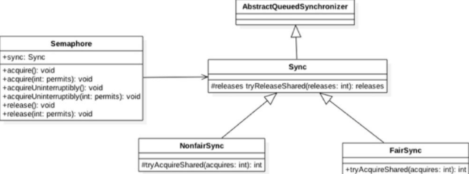

### 信号量Semaphore原理探究

Semaphore信号量也是Java中的一个同步器，与CountDownLatch和CycleBarrier不同的是，**它内部的计数器是递增的，并且在一开始初始化Semaphore时可以指定一个初始值，但是并不需要知道需要同步的线程个数，而是在需要同步的地方调用acquire方法时指定需要同步的线程个数**。

>  可以类似这样理解来自《Java并发编程的艺术》
> Semaphore（信号量）是用来控制同时访问特定资源的线程数量，它通过协调各个线程，以保证合理的使用公共资源。  
>
> 多年以来，我都觉得从字面上很难理解Semaphore所表达的含义，**只能把它比作是控制流量的红绿灯**。比如××马路要限制流量，只允许同时有一百辆车在这条路上行使，其他的都必须在路口等待，所以前一百辆车会看到绿灯，可以开进这条马路，后面的车会看到红灯，不能驶入××马路，但是如果前一百辆中有5辆车已经离开了××马路，那么后面就允许有5辆车驶入马路，这个例子里说的**车就是线程，驶入马路就表示线程在执行，离开马路就表示线程执行完成，看见红灯就表示线程被阻塞，不能执行**。  

#### 1 案例介绍 

同样下面的例子也是**在主线程中开启两个子线程让它们执行，等所有子线程执行完毕后主线程再继续向下运行**。

```java
package com.lanwq.bingfazhimei.chapter2;

import java.util.concurrent.BrokenBarrierException;
import java.util.concurrent.ExecutorService;
import java.util.concurrent.Executors;
import java.util.concurrent.Semaphore;

/**
 * @author Vin lan
 * @className SemaphoreTest1
 * @description
 * @createTime 2021-11-10  10:21
 **/
public class SemaphoreTest1 {
    /**
     * 创建一个 Semaphore 实例
     */
    private static Semaphore semaphore = new Semaphore(0);

    public static void main(String[] args) throws InterruptedException {
        ExecutorService executorService = Executors.newFixedThreadPool(2);
        executorService.submit(()->{
            System.out.println(Thread.currentThread() + " over");
            semaphore.release();
        });

        executorService.submit(()->{
            System.out.println(Thread.currentThread() + " over");
            semaphore.release();
        });
        semaphore.acquire(2);
        System.out.println("all child thread over");
        excutorService.shutdown();
    }
}
```

输出：

> Thread[pool-1-thread-1,5,main] over
> Thread[pool-1-thread-2,5,main] over
> all child thread over

如上代码首先创建了一个信号量实例，构造函数的入参为0，说明当前信号量计数器的值为0。然后main函数向线程池添加两个线程任务，在每个线程内部调用信号量的release方法，这相当于让计数器值递增1。**最后在main线程里面调用信号量的acquire方法，传参为2说明调用acquire方法的线程会一直阻塞，直到信号量的计数变为2才会返回**。看到这里也就明白了，如果构造Semaphore时传递的参数为N，并在M个线程中调用了该信号量的release方法，那么在调用acquire使M个线程同步时传递的参数应该是M+N。

模拟 CyclicBarrier 的复用功能，代码如下。

```java
package com.lanwq.bingfazhimei.chapter2;

import java.util.concurrent.ExecutorService;
import java.util.concurrent.Executors;
import java.util.concurrent.Semaphore;

/**
 * @author Vin lan
 * @className SemaphoreTest1
 * @description
 * @createTime 2021-11-10  10:21
 **/
public class SemaphoreTest2 {
    /**
     * 创建一个 Semaphore 实例
     */
    private static Semaphore semaphore = new Semaphore(0);

    public static void main(String[] args) throws InterruptedException {
        ExecutorService executorService = Executors.newFixedThreadPool(2);
        
        executorService.submit(()->{
            System.out.println(Thread.currentThread() + " A1 over");
            semaphore.release();
        });

        executorService.submit(()->{
            System.out.println(Thread.currentThread() + " A2 over");
            semaphore.release();
        });
        semaphore.acquire(2);

        executorService.submit(()->{
            System.out.println(Thread.currentThread() + " B1 over");
            semaphore.release();
        });

        executorService.submit(()->{
            System.out.println(Thread.currentThread() + " B2 over");
            semaphore.release();
        });
        semaphore.acquire(2);
        System.out.println("all child thread over");
        executorService.shutdown();
    }
}
```

输出：

> Thread[pool-1-thread-1,5,main] A1 over
> Thread[pool-1-thread-2,5,main] A2 over
> Thread[pool-1-thread-2,5,main] B1 over
> Thread[pool-1-thread-1,5,main] B2 over
> all child thread over

#### 2 实现原理探究

为了能够一览Semaphore的内部结构，首先看下Semaphore的类图。




由类图可知，Semaphore还是使用AQS实现的。Sync只是对AQS的一个修饰，并且Sync有两个实现类，用来指定获取信号量时是否采用公平策略。

```java
public Semaphore(int permits) {
    sync = new NonfairSync(permits);
}
// 使用公平锁还是非公平锁
public Semaphore(int permits, boolean fair) {
    sync = fair ? new FairSync(permits) : new NonfairSync(permits);
}

```

在如上代码中，**Semaphore默认采用非公平策略**，如果需要使用公平策略则可以使用带两个参数的构造函数来构造Semaphore对象。另外，如CountDownLatch构造函数传递的初始化信号量个数permits被赋给了AQS的state状态变量一样，这里**AQS的state值也表示当前持有的信号量个数**。

看看 Semaphore 实现的主要方法

##### 2.1 void acquire() 方法 

**当前线程调用该方法的目的是希望获取一个信号量资源**。

- **如果当前信号量个数大于0，则当前信号量的计数会减1，然后该方法直接返回**。
- **否则如果当前信号量个数等于0，则当前线程会被放入AQS的阻塞队列**。
- **当其他线程调用了当前线程的interrupt（）方法中断了当前线程时，则当前线程会抛出InterruptedException异常返回**。

```java
public void acquire() throws InterruptedException {
    // 传递参数为 1，说明要获取 1 个信号量
    sync.acquireSharedInterruptibly(1);
}

// java.util.concurrent.locks.AbstractQueuedSynchronizer#acquireSharedInterruptibly
public final void acquireSharedInterruptibly(int arg)
    throws InterruptedException {
    // (1)如果线程被中断，则抛出中断异常
    if (Thread.interrupted())
        throw new InterruptedException();
    // (2)否则调用 Sync 子类方法尝试获取，这里根据构造韩式确定使用公平策略
    if (tryAcquireShared(arg) < 0)
        // 如果获取失败则放入阻塞队列。然后再次尝试，如果失败则调用 park 方法挂起当前线程
        doAcquireSharedInterruptibly(arg);
}

```

tryAcquireShared(arg) 方法调用了如下方法：尝试获取信号量资源的AQS的方法tryAcquireShared是由Sync的子类实现的，所以这里分别从两方面来讨论。先讨论非公平策略NonfairSync类的tryAcquireShared方法，代码如下。

```java
static final class NonfairSync extends Sync {
    private static final long serialVersionUID = -2694183684443567898L;

    NonfairSync(int permits) {
        super(permits);
    }

    // 这个方法
    protected int tryAcquireShared(int acquires) {
        return nonfairTryAcquireShared(acquires);
    }
}

// java.util.concurrent.Semaphore.Sync#nonfairTryAcquireShared Semaphore 重写的 Sync 类的方法
final int nonfairTryAcquireShared(int acquires) {
    for (;;) {
        // 获取当前信号量值
        int available = getState();
        // 计算当前剩余值
        int remaining = available - acquires;
        // 如果当前剩余值小于0或者CAS 设置成功则返回
        if (remaining < 0 ||
            compareAndSetState(available, remaining))
            return remaining;
    }
}
```

如上代码先获取当前信号量值（available），然后减去需要获取的值（acquires），得到剩余的信号量个数（remaining），**如果剩余值小于0则说明当前信号量个数满足不了需求，那么直接返回负数，这时当前线程会被放入AQS的阻塞队列而被挂起**。**如果剩余值大于0，则使用CAS操作设置当前信号量值为剩余值，然后返回剩余值**。

另外，**由于NonFairSync是非公平获取的，也就是说先调用aquire方法获取信号量的线程不一定比后来者先获取到信号量**。考虑下面场景，如果线程A先调用了aquire（）方法获取信号量，但是当前信号量个数为0，那么线程A会被放入AQS的阻塞队列。过一段时间后线程C调用了release（）方法释放了一个信号量，如果当前没有其他线程获取信号量，那么线程A就会被激活，然后获取该信号量，但是假如线程C释放信号量后，线程C调用了aquire方法，那么线程C就会和线程A去竞争这个信号量资源。如果采用非公平策略，由nonfairTryAcquireShared的代码可知，线程C完全可以在线程A被激活前，或者激活后先于线程A获取到该信号量，也就是在这种模式下阻塞线程和当前请求的线程是竞争关系，而不遵循先来先得的策略。

下面看公平性的FairSync类是如何保证公平性的。

```java
protected int tryAcquireShared(int acquires) {
    for (;;) {
        if (hasQueuedPredecessors())
            return -1;
        int available = getState();
        int remaining = available - acquires;
        if (remaining < 0 ||
            compareAndSetState(available, remaining))
            return remaining;
    }
}
```

可见公平性还是靠hasQueuedPredecessors这个函数来保证的。前面章节讲过，**公平策略是看当前线程节点的前驱节点是否也在等待获取该资源，如果是则自己放弃获取的权限，然后当前线程会被放入AQS阻塞队列，否则就去获取**。

##### 2.2 void acquire(int permits) 方法 

该方法与acquire（）方法不同，后者（acquirr()）只需要获取一个信号量值，而前者（void acquire(int permits) ）则获取permits个。

```java
public void acquire(int permits) throws InterruptedException {
    if (permits < 0) throw new IllegalArgumentException();
    sync.acquireSharedInterruptibly(permits);
}
```

##### 2.3 void acquireUninterruptibly() 方法

该方法与acquire（）类似，**不同之处在于该方法对中断不响应**，也就是当当前线程调用了acquireUninterruptibly获取资源时（包含被阻塞后），其他线程调用了当前线程的interrupt（）方法设置了当前线程的中断标志，此时当前线程并不会抛出InterruptedException异常而返回。

##### 2.4 void acquireUninterruptibly(int permits) 方法

该方法与acquire（int permits）方法的不同之处在于，该方法对中断不响应。

##### 2.5 void release() 方法

该方法的作用是**把当前Semaphore对象的信号量值增加1，如果当前有线程因为调用aquire方法被阻塞而被放入了AQS的阻塞队列，则会根据公平策略选择一个信号量个数能被满足的线程进行激活，激活的线程会尝试获取刚增加的信号量**，下面看代码实现。

```java
public void release() {
    // (1) arg = 1
    sync.releaseShared(1);
}

public final boolean releaseShared(int arg) {
    // (2)尝试释放资源
    if (tryReleaseShared(arg)) {
        // (3)资源释放成功则调用 park 方法唤醒 AQS 队里里面最先挂起的线程
        doReleaseShared();
        return true;
    }
    return false;
}

protected final boolean tryReleaseShared(int releases) {
    for (;;) {
        // (4)获取当前信号量值
        int current = getState();
        // (5)将当前信号量值增加 releases，这里增加 1
        int next = current + releases;
        if (next < current) // overflow
            throw new Error("Maximum permit count exceeded");
        // (6)使用 CAS 保证更新信号量值的原子性
        if (compareAndSetState(current, next))
            return true;
    }
}
```

由代码release（）->sync.releaseShared（1）可知，release方法每次只会对信号量值增加1,tryReleaseShared方法是无限循环，使用CAS保证了release方法对信号量递增1的原子性操作。tryReleaseShared方法增加信号量值成功后会执行代码（3），即调用AQS的方法来激活因为调用aquire方法而被阻塞的线程。

##### 2.6 void release(int permits) 方法

该方法与不带参数的release方法的不同之处在于，前者每次调用会在信号量值原来的基础上增加permits，而后者每次增加1。

```java
public void release(int permits) {
    if (permits < 0) throw new IllegalArgumentException();
    sync.releaseShared(permits);
}
```

另外可以看到，这里的sync.releaseShared是共享方法，这说明**该信号量是线程共享的，信号量没有和固定线程绑定，多个线程可以同时使用CAS去更新信号量的值而不会被阻塞**。

#### 3 应用场景

来自《Java并发编程的艺术》

**Semaphore可以用于做流量控制，特别是公用资源有限的应用场景，比如数据库连接**。假如有一个需求，要读取几万个文件的数据，因为都是IO密集型任务，我们可以启动几十个线程并发地读取，但是如果读到内存后，还需要存储到数据库中，而数据库的连接数只有10个，这时我们必须控制只有10个线程同时获取数据库连接保存数据，否则会报错无法获取数据库连接。这个时候，就可以使用Semaphore来做流量控制，如代码所示。  

```java
public class SemaphoreTest {
    private static final int THREAD_COUNT = 30;
    private static ExecutorService threadPool =Executors.newFixedThreadPool(THREAD_COUNT);
    private static Semaphore s = new Semaphore(10);

    public static void main(String[] args) {
        for (inti = 0; i < THREAD_COUNT; i++) {
            threadPool.execute(new Runnable() {
                @Override
                public void run() {
                    try {
                        s.acquire();
                        System.out.println("save data");
                        s.release();
                    } catch (InterruptedException e) {
                    }
                }
            });
        }
        threadPool.shutdown();
    }
}
```

在代码中，虽然有30个线程在执行，但是只允许10个并发执行。Semaphore的构造方法
Semaphore（int permits）接受一个整型的数字，表示可用的许可证数量。

Semaphore（10）表示允许10个线程获取许可证，也就是最大并发数是10。Semaphore的用法也很简单，**首先线程使用Semaphore的acquire()方法获取一个许可证，使用完之后调用release()方法归还许可证**。还可以用tryAcquire()方法尝试获取许可证。  

#### 面试题

> 原文链接：https://pdai.tech/md/java/thread/java-thread-x-juc-tool-semaphore.html

##### 单独使用Semaphore是不会使用到AQS的条件队列的

不同于CyclicBarrier和ReentrantLock，单独使用Semaphore是不会使用到AQS的条件队列的，其实，只有进行await操作才会进入条件队列，其他的都是在同步队列中，只是当前线程会被park。

#####  场景问题

##### semaphore初始化有10个令牌，11个线程同时各调用1次acquire方法，会发生什么?

答案：拿不到令牌的线程阻塞，不会继续往下运行。

##### semaphore初始化有10个令牌，一个线程重复调用11次acquire方法，会发生什么?

答案：线程阻塞，不会继续往下运行。可能你会考虑类似于锁的重入的问题，很好，但是，令牌没有重入的概念。你只要调用一次acquire方法，就需要有一个令牌才能继续运行。

##### semaphore初始化有1个令牌，1个线程调用一次acquire方法，然后调用两次release方法，之后另外一个线程调用acquire(2)方法，此线程能够获取到足够的令牌并继续运行吗?

答案：能，原因是release方法会添加令牌，并不会以初始化的大小为准。

##### semaphore初始化有2个令牌，一个线程调用1次release方法，然后一次性获取3个令牌，会获取到吗?

答案：能，原因是release会添加令牌，并不会以初始化的大小为准。Semaphore中release方法的调用并没有限制要在acquire后调用。

具体示例如下，如果不相信的话，可以运行一下下面的demo，在做实验之前，笔者也认为应该是不允许的。

```java
public class TestSemaphore2 {
    public static void main(String[] args) {
        int permitsNum = 2;
        final Semaphore semaphore = new Semaphore(permitsNum);
        try {
            System.out.println("availablePermits:"+semaphore.availablePermits()+",semaphore.tryAcquire(3,1, TimeUnit.SECONDS):"+semaphore.tryAcquire(3,1, TimeUnit.SECONDS));
            semaphore.release();
            System.out.println("availablePermits:"+semaphore.availablePermits()+",semaphore.tryAcquire(3,1, TimeUnit.SECONDS):"+semaphore.tryAcquire(3,1, TimeUnit.SECONDS));
        }catch (Exception e) {

        }
    }
}
```

