### 3 ThreadLocalRandom 类解析  

#### 3.1 Random 类及其局限性 

在JDK 7 之前包括现在，java.util.Random都是使用比较广泛的随机数生成工具类，而且java.lang.Math中的随机数生成也使用的是java.util.Random的实例。

```java
public class RandomTest {
    public static void main(String[] args) {
        // （1）创建一个默认种子的随机数生成器
        Random random = new Random();
        // （2）输出 10 个在0-5（包含0，不包含5）之间的随机数
        for (int i = 0; i < 10; i++) {
            System.out.println(random.nextInt(5));
        }
    }
}
// 有了默认的种子后，如何生成随机数呢，查看 nextInt() 代码
public int nextInt(int bound) {
        if (bound <= 0) // （3）参数检查
            throw new IllegalArgumentException(BadBound);

        int r = next(31); // （4）根据老的种子生成新的种子
        int m = bound - 1;// （5）根据新的种子计算随机数
        if ((bound & m) == 0)  // i.e., bound is a power of 2
            r = (int)((bound * (long)r) >> 31);
        else {
            for (int u = r;
                 u - (r = u % bound) + m < 0;
                 u = next(31))
                ;
        }
        return r;
    }
```

由此可见，新的随机数的生成需要两个步骤：

- 首先根据老的种子生成新的种子。
- 然后根据新的种子来计算新的随机数。

其中步骤（4）我们可以抽象为seed=f（seed），其中f是一个固定的函数，；步骤（5）也可以抽象为g（seed,bound），其中g是一个固定的函数。**在单线程情况下每次调用nextInt都是根据老的种子计算出新的种子，这是可以保证随机数产生的随机性的**。但是**在多线程下多个线程可能都拿同一个老的种子去执行步骤（4）以计算新的种子，这会导致多个线程产生的新种子是一样的，由于步骤（5）的算法是固定的，所以会导致多个线程产生相同的随机值**，这并不是我们想要的。

所以步骤（4）要保证原子性，也就是说当多个线程根据同一个老种子计算新种子时，**第一个线程的新种子被计算出来后，第二个线程要丢弃自己老的种子，而使用第一个线程的新种子来计算自己的新种子**，依此类推，只有保证了这个，才能保证在多线程下产生的随机数是随机的。Random函数使用一个原子变量达到了这个效果，在创建Random对象时初始化的种子就被保存到了种子原子变量里面，下面看next（）的代码。

```java
protected int next(int bits) {
        long oldseed, nextseed;
        AtomicLong seed = this.seed;
        do {
            oldseed = seed.get();// (6) 获取当前原子变量种子的值
            nextseed = (oldseed * multiplier + addend) & mask; // (7) 根据当前种子值计算新的种子
        } while (!seed.compareAndSet(oldseed, nextseed)); // (8)使用 CAS 操作，使用新的种子去更新老的种子。
        return (int)(nextseed >>> (48 - bits)); // (9)
    }
```

在多线程下可能多个线程都同时执行到了代码（6），那么可能多个线程拿到的当前种子的值是同一个，然后执行步骤（7）计算的新种子也都是一样的，但是步骤（8）的CAS操作会保证只有一个线程可以更新老的种子为新的，失败的线程会通过循环重新获取更新后的种子作为当前种子去计算老的种子，这就解决了上面提到的问题，保证了随机数的随机性。代码（9）使用固定算法根据新的种子计算随机数。

**总结**：每个Random实例里面都有一个原子性的种子变量用来记录当前的种子值，当要生成新的随机数时需要根据当前种子计算新的种子并更新回原子变量。在多线程下使用单个Random实例生成随机数时，当多个线程同时计算随机数来计算新的种子时，多个线程会竞争同一个原子变量的更新操作，**由于原子变量的更新是CAS操作，同时只有一个线程会成功，所以会造成大量线程进行自旋重试，这会降低并发性能**，所以ThreadLocalRandom应运而生。 

#### 3.2、ThreadLocalRandom  

为了弥补多线程高并发情况下Random的缺陷，在JUC包下新增了ThreadLocalRandom类。使用：

```java
public class ThreadLocalRandomTest {
    public static void main(String[] args) {
        // （10）创建一个默认种子的随机数生成器
        ThreadLocalRandom random = ThreadLocalRandom.current();
        // （11）输出 10 个在0-5（包含0，不包含5）之间的随机数
        for (int i = 0; i < 10; i++) {
            System.out.println(random.nextInt(5));
        }
    }
}
```

其中，代码（10）调用ThreadLocalRandom.current（）来获取当前线程的随机数生成器。下面来分析下ThreadLocalRandom的实现原理。从名字上看它会让我们联想到在基础篇中讲解的ThreadLocal:ThreadLocal通过让每一个线程复制一份变量，使得在每个线程对变量进行操作时实际是操作自己本地内存里面的副本，从而避免了对共享变量进行同步。实际上ThreadLocalRandom的实现也是这个原理，Random的缺点是多个线程会使用同一个原子性种子变量，从而导致对原子变量更新的竞争，如图3-1所示


那么，如果**每个线程都维护一个种子变量，则每个线程生成随机数时都根据自己老的种子计算新的种子，并使用新种子更新老的种子，再根据新种子计算随机数，就不会存在竞争问题了**，这会大大提高并发性能。ThreadLocalRandom原理如图3-2所示.。 


#### 3.3、源码分析  

ThreadLocalRandom类继承了Random类并重写了nextInt方法，在ThreadLocalRandom类中并没有使用继承自Random类的原子性种子变量。在ThreadLocalRandom中并没有存放具体的种子，具体的种子存放在具体的调用线程的threadLocalRandomSeed变量里面。ThreadLocalRandom类似于ThreadLocal类，就是个工具类。当线程调用ThreadLocalRandom的current方法时，ThreadLocalRandom负责初始化调用线程的threadLocalRandomSeed变量，也就是初始化种子。  

当调用ThreadLocalRandom的nextInt方法时，实际上是获取当前线程的threadLocalRandomSeed变量作为当前种子来计算新的种子，然后更新新的种子到当前线程的threadLocalRandomSeed变量，而后再根据新种子并使用具体算法计算随机数。这里需要注意的是，threadLocalRandomSeed变量就是Thread类里面的一个普通long变量，它并不是原子性变量。其实道理很简单，因为这个变量是线程级别的，所以根本不需要使用原子性变量。

另外，变量instance是ThreadLocalRandom的一个实例，该变量是static的。当多线程通过ThreadLocalRandom的current方法获取ThreadLocalRandom的实例时，其实获取的是同一个实例。但是由于具体的种子是存放在线程里面的，所以在ThreadLocalRandom的实例里面只包含与线程无关的通用算法，所以它是线程安全的。

1. Unsafe机制

```java
// Unsafe mechanics
    private static final sun.misc.Unsafe UNSAFE;
    private static final long SEED;
    private static final long PROBE;
    private static final long SECONDARY;
    static {
        try {
            // 获取 unsafe 实例
            UNSAFE = sun.misc.Unsafe.getUnsafe();
            Class<?> tk = Thread.class;
            // 获取 Thread 类里面threadLocalRandomSeed变量在 Thread 实例里面的偏移量
            SEED = UNSAFE.objectFieldOffset
                (tk.getDeclaredField("threadLocalRandomSeed"));
             // 获取 Thread 类里面threadLocalRandomProbe变量在 Thread 实例里面的偏移量
            PROBE = UNSAFE.objectFieldOffset
                (tk.getDeclaredField("threadLocalRandomProbe"));
             // 获取 Thread 类里面threadLocalRandomSecondarySeed变量在 Thread 实例里面的偏移量
            SECONDARY = UNSAFE.objectFieldOffset
                (tk.getDeclaredField("threadLocalRandomSecondarySeed"));
        } catch (Exception e) {
            throw new Error(e);
        }
    }
```


3. int nextInt(int bound) 方法

计算当前线程下一个随机数

```java
public int nextInt(int bound) {
    if (bound <= 0)
        throw new IllegalArgumentException(BadBound);
    int r = mix32(nextSeed());
    int m = bound - 1;
    if ((bound & m) == 0) // power of two
        r &= m;
    else { // reject over-represented candidates
        for (int u = r >>> 1;
             u + m - (r = u % bound) < 0;
             u = mix32(nextSeed()) >>> 1)
            ;
    }
    return r;
}
// 计算新的种子
final long nextSeed() {
    Thread t; long r; // read and update per-thread seed
    UNSAFE.putLong(t = Thread.currentThread(), SEED,
                   r = UNSAFE.getLong(t, SEED) + GAMMA);
    return r;
}
在如上代码中，首先使用r = UNSAFE.getLong（t, SEED）获取当前线程中threadLocalRandomSeed变量的值，然后在种子的基础上累加GAMMA值作为新种子，而后使用UNSAFE的putLong方法把新种子放入当前线程的threadLocalRandomSeed变量中
```

### 4 Java并发包中原子操作类原理剖析 

可以参考：https://www.jianshu.com/p/ae25eb3cfb5d 

#### 4.1 原子变量操作类  

JUC并发包中包含有AtomicInteger、AtomicLong和AtomicBoolean等原子性操作类，它们的原理类似，本章讲解AtomicLong类。AtomicLong是原子性递增或者递减类，其内部使用Unsafe来实现，我们看下面的代码。  

```java
public class AtomicLong extends Number implements java.io.Serializable {
    private static final long serialVersionUID = 1927816293512124184L;

    // setup to use Unsafe.compareAndSwapLong for updates （1）获取 unsafe 实例
    private static final Unsafe unsafe = Unsafe.getUnsafe();
    private static final long valueOffset; // （2）存放变量 value 的偏移量

    /**
     * Records whether the underlying JVM supports lockless
     * compareAndSwap for longs. While the Unsafe.compareAndSwapLong
     * method works in either case, some constructions should be
     * handled at Java level to avoid locking user-visible locks.
     */
    // 判断 JVM 是否支持 Long 类型无锁 CAS
    static final boolean VM_SUPPORTS_LONG_CAS = VMSupportsCS8();

    /**
     * Returns whether underlying JVM supports lockless CompareAndSet
     * for longs. Called only once and cached in VM_SUPPORTS_LONG_CAS.
     */
    private static native boolean VMSupportsCS8();

    static {
        try {
            // （4）获取 value 在 AtomicLong 中的偏移量
            valueOffset = unsafe.objectFieldOffset
                (AtomicLong.class.getDeclaredField("value"));
        } catch (Exception ex) { throw new Error(ex); }
    }
    // （5）实际变量值，为了在多线程下保证内存可见性
    private volatile long value;

    /**
     * Creates a new AtomicLong with the given initial value.
     *
     * @param initialValue the initial value
     */
    public AtomicLong(long initialValue) {
        value = initialValue;
    }
    ...
        
}
```

##### **递增和递减操作代码**

```java
    /**
     * Atomically increments by one the current value.
     * （6）调用 unsafe 方法，原子性设置value 值为原始值 +1，返回值为递增后的值
     * @return the updated value
     */
    public final long incrementAndGet() {
        return unsafe.getAndAddLong(this, valueOffset, 1L) + 1L;
    }

    /**
     * Atomically decrements by one the current value.
     *（7）调用 unsafe 方法，原子性设置value 值为原始值 -1，返回值为递减后的值
     * @return the updated value
     */
    public final long decrementAndGet() {
        return unsafe.getAndAddLong(this, valueOffset, -1L) - 1L;
    }

    /**
     * Atomically increments by one the current value.
     *（8）调用 unsafe 方法，原子性设置value 值为原始值 +1，返回值为原始值
     * @return the previous value
     */
    public final long getAndIncrement() {
        return unsafe.getAndAddLong(this, valueOffset, 1L);
    }

    /**
     * Atomically decrements by one the current value.
     *（9）调用 unsafe 方法，原子性设置value 值为原始值 -1，返回值为原始值
     * @return the previous value
     */
    public final long getAndDecrement() {
        return unsafe.getAndAddLong(this, valueOffset, -1L);
    }

```

在如上代码内部都是通过调用Unsafe的getAndAddLong方法来实现操作，这个函数是个原子性操作，这里第一个参数是AtomicLong实例的引用，第二个参数是value变量在AtomicLong中的偏移值，第三个参数是要设置的第二个变量的值。 

其中，getAndIncrement方法在JDK 7中的实现逻辑为：

```java
public final long getAndIncrement() {
    while(true) {
        long current = get();
        long next = current + 1;
        if (compareAndSet(current, next)) {
            return current;
        }
    }
}
```

在如上代码中，每个线程是先拿到变量的当前值（由于value是volatile变量，所以这里拿到的是最新的值），然后在工作内存中对其进行增1操作，而后使用CAS修改变量的值。如果设置失败，则循环继续尝试，直到设置成功. 

而JDK8中的逻辑为：

```java
public final long getAndIncrement() {
    return unsafe.getAndAddLong(this, valueOffset, 1L);
}

public final long getAndAddLong(Object var1, long var2, long var4) {
    long var6;
    do {
        var6 = this.getLongVolatile(var1, var2);
    } while(!this.compareAndSwapLong(var1, var2, var6, var6 + var4));

    return var6;
}
```

##### boolean compareAndSet(long expect, long update)方法

```java
 /**
     * Atomically sets the value to the given updated value
     * if the current value {@code ==} the expected value.
     *
     * @param expect the expected value
     * @param update the new value
     * @return {@code true} if successful. False return indicates that
     * the actual value was not equal to the expected value.
     */
    public final boolean compareAndSet(long expect, long update) {
        return unsafe.compareAndSwapLong(this, valueOffset, expect, update);
    }
```

下面通过一个多线程使用AtomicLong统计0的个数的例子来加深对AtomicLong的理解。

```java
package com.lanwq.bingfazhimei.chapter2;

import java.util.concurrent.atomic.AtomicLong;

/**
 * @author Vin lan
 * @className AtomicTest
 * @description 统计 0 的个数
 * @createTime 2021-11-01  15:37
 **/
public class AtomicTest {
    /**
     * 创建 long 型原子计数器
     */
    private static AtomicLong atomicLong = new AtomicLong();
    /**
     * 创建数据源
     */
    private static Integer[] arrayOne = new Integer[]{0, 1, 2, 3, 0, 5, 6, 0, 56, 0};
    private static Integer[] arrayTwo = new Integer[]{10, 1, 2, 3, 0, 5, 6, 0, 56, 0};

    public static void main(String[] args) throws InterruptedException {
        // (12)线程 one 统计数组  arrayOne 中 0 的个数
        Thread threadOne = new Thread(() -> {
            int size = arrayOne.length;
            for (int i = 0; i < size; i++) {
                if (arrayOne[i] == 0) {
                    atomicLong.incrementAndGet();
                }
            }
        });
        // (12)线程 two 统计数组  arrayOne 中 0 的个数
        Thread threadTwo = new Thread(() -> {
            int size = arrayTwo.length;
            for (int i = 0; i < size; i++) {
                if (arrayTwo[i] == 0) {
                    atomicLong.incrementAndGet();
                }
            }
        });

        // 启动子线程
        threadOne.start();
        threadTwo.start();
        threadOne.join();
        threadTwo.join();
        System.out.println("count 0:" + atomicLong.get());
    }
}
// 输出： count 0:7
```

在没有原子类的情况下，实现计数器需要使用一定的同步措施，比如使用synchronized关键字等，但是这些都是阻塞算法，对性能有一定损耗，而本章介绍的这些原子操作类都使用CAS非阻塞算法，性能更好。但是在高并发情况下AtomicLong还会存在性能问题。JDK 8提供了一个在高并发下性能更好的LongAdder类，下面我们来讲解这个类。  

#### 4.2 JDK8新增的原子操作类 LongAdder

##### 1、LongAdder 简单介绍

前面讲过，AtomicLong通过CAS提供了非阻塞的原子性操作，相比使用阻塞算法的同步器来说它的性能已经很好了，但是JDK开发组并不满足于此。使用AtomicLong时，在高并发下大量线程会同时去竞争更新同一个原子变量，但是由于同时只有一个线程的CAS操作会成功，这就造成了大量线程竞争失败后，会通过无限循环不断进行自旋尝试CAS的操作，而这会白白浪费CPU资源

因此JDK 8新增了一个原子性递增或者递减类LongAdder用来克服在高并发下使用AtomicLong的缺点。既然AtomicLong的性能瓶颈是由于过多线程同时去竞争一个变量的更新而产生的，那么如果把一个变量分解为多个变量，让同样多的线程去竞争多个资源，是不是就解决了性能问题？是的，LongAdder就是这个思路。下面通过图来理解两者设计的不同之处，如图4-1所示，使用AtomicLong时，是多个线程同时竞争同一个原子变量。


如图4-2所示，**使用LongAdder时，则是在内部维护多个Cell变量，每个Cell里面有一个初始值为0的long型变量，这样，在同等并发量的情况下，争夺单个变量更新操作的线程量会减少，这变相地减少了争夺共享资源的并发量。另外，多个线程在争夺同一个Cell原子变量时如果失败了，它并不是在当前Cell变量上一直自旋CAS重试，而是尝试在其他Cell的变量上进行CAS尝试，这个改变增加了当前线程重试CAS成功的可能性。最后，在获取LongAdder当前值时，是把所有Cell变量的value值累加后再加上base返回的**。 

LongAdder维护了一个延迟初始化的原子性更新数组（默认情况下Cell数组是null）和一个基值变量base。由于Cells占用的内存是相对比较大的，所以一开始并不创建它，而是在需要时创建，也就是惰性加载。

当一开始判断Cell数组是null并且并发线程较少时，所有的累加操作都是对base变量进行的。保持Cell数组的大小为2的N次方，在初始化时Cell数组中的Cell元素个数为2，数组里面的变量实体是Cell类型。Cell类型是AtomicLong的一个改进，用来减少缓存的争用，也就是解决伪共享问题。 

 对于大多数孤立的多个原子操作进行字节填充是浪费的，因为原子性操作都是无规律地分散在内存中的（也就是说多个原子性变量的内存地址是不连续的），多个原子变量被放入同一个缓存行的可能性很小。但是原子性数组元素的内存地址是连续的，所以数组内的多个元素能经常共享缓存行，因此这里使用@sun.misc.Contended注解对Cell类进行字节填充，这防止了数组中多个元素共享一个缓存行，在性能上是一个提升。

>  以上这个小节，先记录，目前还没有用上，后续可完善。

---

### 5 Java并发包中并发List 源码剖析

#### 1、介绍

并发包中的并发List只有`CopyOnWriteArrayList`。**`CopyOnWriteArrayList`是一个线程安全的ArrayList，对其进行的修改操作都是在底层的一个复制的数组（快照）上进行的，也就是使用了写时复制策略**。 

每个CopyOnWriteArrayList对象里面有一个array数组对象用来存放具体元素，ReentrantLock独占锁对象用来保证同时只有一个线程对array进行修改。**ReentrantLock是独占锁，同时只有一个线程可以获取**。

如果让我们自己做一个写时复制的线程安全的list我们会怎么做，有哪些点需要考虑？

- 何时初始化 list，初始化 list 的元素个数为多少，list 有大小限制吗？
- 如何保证线程安全，比如多个线程进行读写时如何保证时线程安全的？
- 如何保证使用迭代器遍历 list 时的数据一致性？

#### 2、主要方法源码解析 

##### （1）初始化

```java

/** The lock protecting all mutators */
final transient ReentrantLock lock = new ReentrantLock();

/** The array, accessed only via getArray/setArray. */ 使用了 volatile 修饰，保证内存的可见性
private transient volatile Object[] array;

public CopyOnWriteArrayList() {
        setArray(new Object[0]);
}
final void setArray(Object[] a) {
    array = a;
}
/**
     * Creates a list containing the elements of the specified
     * collection, in the order they are returned by the collection's
     * iterator.
     *
     * @param c the collection of initially held elements
     * @throws NullPointerException if the specified collection is null
     */
public CopyOnWriteArrayList(Collection<? extends E> c) {
    Object[] elements;
    if (c.getClass() == CopyOnWriteArrayList.class)
        elements = ((CopyOnWriteArrayList<?>)c).getArray();
    else {
        elements = c.toArray();
        // c.toArray might (incorrectly) not return Object[] (see 6260652)
        if (elements.getClass() != Object[].class)
            elements = Arrays.copyOf(elements, elements.length, Object[].class);
    }
    setArray(elements);
}

/**
     * Creates a list holding a copy of the given array.
     *
     * @param toCopyIn the array (a copy of this array is used as the
     *        internal array)
     * @throws NullPointerException if the specified array is null
     */
public CopyOnWriteArrayList(E[] toCopyIn) {
    setArray(Arrays.copyOf(toCopyIn, toCopyIn.length, Object[].class));
}
```

##### （2）添加元素 

```java
public boolean add(E e) {
    // 获取独占锁
    final ReentrantLock lock = this.lock;
    lock.lock();
    try {
        // 获取数组
        Object[] elements = getArray();
        int len = elements.length;
        // 复制 array 到新数组，添加新元素到新数组
        Object[] newElements = Arrays.copyOf(elements, len + 1);
        newElements[len] = e;
        setArray(newElements);
        return true;
    } finally {
        // 释放独占锁
        lock.unlock();
    }
}
```

调用add方法的线程会首先执行代码（1）去获取独占锁，如果多个线程都调用add方法则只有一个线程会获取到该锁，其他线程会被阻塞挂起直到锁被释放。所以一个线程获取到锁后，就保证了在该线程添加元素的过程中其他线程不会对array进行修改。 

新数组的大小是原来数组大小增加1，所以CopyOnWriteArrayList是无界list。 

然后执行代码（4）使用新数组替换原数组，并在返回前释放锁。由于加了锁，所以整个add过程是个原子性操作。需要注意的是，在添加元素时，首先复制了一个快照，然后在快照上进行添加，而不是直接在原来数组上进行。 

##### （3）获取指定位置元素 

```java
// 步骤 B
private E get(Object[] a, int index) {
    return (E) a[index];
}

/**
 * {@inheritDoc}
 *
 * @throws IndexOutOfBoundsException {@inheritDoc}
 */
public E get(int index) {
    return get(getArray(), index);
}
// 步骤 A
final Object[] getArray() {
    return array;
}
```


get 方法并没有进行加锁同步。由于执行步骤A和步骤B没有加锁，这就可能导致在**线程x执行完步骤A后执行步骤B前**，另外一个线程y进行了remove操作，假设要删除元素1。remove操作首先会获取独占锁，然后进行写时复制操作，也就是复制一份当前array数组，然后在复制的数组里面删除 线程x 通过get方法要访问的元素1，之后让array指向复制的数组。而这时候array之前指向的数组的引用计数为1而不是0，因为线程x还在使用它，这时线程x开始执行步骤B，步骤B操作的数组是线程y删除元素之前的数组，如图5-3所示。


所以，虽然线程y已经删除了index处的元素，但是线程x的步骤B还是会返回index处的元素，这其实就是写时复制策略产生的弱一致性问题。


##### （4）弱一致性的迭代器

所谓弱一致性是**指返回迭代器后，其他线程对list的增删改对迭代器是不可见的**，下面看看这是如何做到的。

```java
public Iterator<E> iterator() {
    return new COWIterator<E>(getArray(), 0);
}
static final class COWIterator<E> implements ListIterator<E> {
    /** Snapshot of the array */
    private final Object[] snapshot;
    /** Index of element to be returned by subsequent call to next.  */
    private int cursor;

    private COWIterator(Object[] elements, int initialCursor) {
        cursor = initialCursor;
        snapshot = elements;
    }

    public boolean hasNext() {
        return cursor < snapshot.length;
    }

    public boolean hasPrevious() {
        return cursor > 0;
    }

    @SuppressWarnings("unchecked")
    public E next() {
        if (! hasNext())
            throw new NoSuchElementException();
        return (E) snapshot[cursor++];
    }
....
}
```

在如上代码中，当调用iterator（）方法获取迭代器时实际上会返回一个COWIterator对象，COWIterator对象的**snapshot变量保存了当前list的内容，cursor是遍历list时数据的下标**。

为什么说snapshot是list的快照呢？明明是指针传递的引用啊，而不是副本。如果在该线程使用返回的迭代器遍历元素的过程中，其他线程没有对list进行增删改，那么snapshot本身就是list的array，因为它们是引用关系。但是如果在遍历期间其他线程对该list进行了增删改，那么snapshot就是快照了，因为增删改后list里面的数组被新数组替换了，这时候老数组被snapshot引用。这也说明获取迭代器后，使用该迭代器元素时，其他线程对该list进行的增删改不可见，因为它们操作的是两个不同的数组，这就是弱一致性。 

```java
CopyOnWriteArrayList<Object> arrayList = new CopyOnWriteArrayList<>();
arrayList.add("hello");
arrayList.add("AAAA");
arrayList.add("BBBB");
arrayList.add("CCCC");
arrayList.add("DDDD");
Thread threadThree = new Thread(() -> {
    arrayList.set(1, "AAAA0000");
    arrayList.remove(2);
    arrayList.remove(3);
});
// 保证在修改线程启动前获取迭代器
Iterator<Object> iterator = arrayList.iterator();
threadThree.start();
threadOne.join();
while (iterator.hasNext()) {
    System.out.println(iterator.next());
}
```

在如上代码中，main函数首先初始化了arrayList，然后在启动线程前获取到了arrayList迭代器。子线程threadOne启动后首先修改了arrayList的第一个元素的值，然后删除了arrayList中下标为2和3的元素。主线程在子线程执行完毕后使用获取的迭代器遍历数组元素，从输出结果我们知道，在子线程里面进行的操作一个都没有生效，这就是迭代器弱一致性的体现。需要注意的是，获取迭代器的操作必须在子线程操作之前进行。  

### 6 Java并发包中锁原理解析  

#### 1 LockSupport 工具类 

JDK中的rt.jar包里面的LockSupport是个工具类，**它的主要作用是挂起和唤醒线程，该工具类是创建锁和其他同步类的基础**。

**LockSupport类与每个使用它的线程都会关联一个许可证**，在默认情况下**调用**LockSupport类的方法**的线程**是**不持有许可证的**。LockSupport是使用Unsafe类实现的，介绍几个主要函数。  

##### （1）void park()

**如果调用park方法的线程已经拿到了与LockSupport关联的许可证**，则调用LockSupport.park（）时**会马上返回**，**否则调用线程会被禁止参与线程的调度，也就是会被阻塞挂起**。

```java
public static void main(String[] args) {
    System.out.println("begin park1");
    LockSupport.park();
    System.out.println("end park!");
}
```

如上面代码直接在main函数里面调用park方法，最终只会输出begin park!，然后当前线程被挂起，这是因为在默认情况下调用线程是不持有许可证的。

**在其他线程调用unpark（Thread thread）方法并且将当前线程作为参数时，调用park方法而被阻塞的线程会返回**。另外，**如果其他线程调用了阻塞线程的interrupt（）方法，设置了中断标志或者线程被虚假唤醒，则阻塞线程也会返回**。**所以在调用park方法时最好也使用循环条件判断方式**。

需要注意的是，因调用park（）方法而被阻塞的线程被其他线程中断而返回时并不会抛出InterruptedException异常。 

##### （2）void unpark(Thread thread) 方法 

**当一个线程调用unpark时，如果参数thread线程没有持有thread与LockSupport类关联的许可证，则让thread线程持有**。如果thread之前因调用park（）而被挂起，则调用unpark后，该线程会被唤醒。如果thread之前没有调用park，则调用unpark方法后，再调用park方法，其会立刻返回。 

> 使线程持有，thread与LockSupport类关联的许可证

```java
public static void main(String[] args) {
    System.out.println("begin park!");
    // 使当前线程获取到许可证
    LockSupport.unpark(Thread.currentThread());
    // 再次调用 park 方法
    LockSupport.park();
    System.out.println("end park!");
}
输出
begin park1
end park!
```

再看一个例子

```java
public static void main(String[] args) throws InterruptedException {
    Thread thread = new Thread(() -> {
        System.out.println("child thread begin park!");
        // 子线程在默认情况下没有持有许可证，调用 park 会挂起自己。
        LockSupport.park();
        System.out.println("child thread unpark!");
    });
    // 启动子线程
    thread.start();
    // 主线程休眠 1s
    Thread.sleep(1000);
    System.out.println("main thread begin unpark!");
    // 调用 unpark 方法，让thread线程持有许可证，然后park方法返回
    LockSupport.unpark(thread);
}
输出
child thread begin park!
main thread begin unpark!
child thread unpark!
```

主线程休眠1s是为了让主线程调用unpark方法前让子线程输出child threadbegin park！并阻塞。

主线程然后执行unpark方法，参数为子线程，这样做的目的是让子线程持有许可证，然后子线程调用的park方法就返回了。

park方法返回时不会告诉你因何种原因返回，所以调用者需要根据之前调用park方法的原因，再次检查条件是否满足，如果不满足则还需要再次调用park方法。

```java
public static void main(String[] args) throws InterruptedException {
    Thread thread = new Thread(() -> {
        System.out.println("child thread begin park!");
        // 子线程在默认情况下没有持有许可证，调用 park 会挂起自己。
        while (!Thread.currentThread().isInterrupted()) {
                LockSupport.park();
            }
        System.out.println("child thread unpark!");
    });
    // 启动子线程
    thread.start();
    // 主线程休眠 1s
    Thread.sleep(1000);
    System.out.println("main thread begin unpark!");
    // 中断子线程
    thread.interrupt();
}
输出
child thread begin park!
main thread begin unpark!
child thread unpark!
```

在如上代码中，只有中断子线程，子线程才会运行结束，如果子线程不被中断，即使你调用unpark（thread）方法子线程也不会结束。

##### （3）void parkNanos(long nanos)方法

和park方法类似，如果调用park方法的线程已经拿到了与LockSupport关联的许可证，则调用LockSupport.parkNanos（long nanos）方法后会马上返回。**该方法的不同在于，如果没有拿到许可证，则调用线程会被挂起nanos时间后修改为自动返回**。

另外park方法还支持带有blocker参数的方法void park（Object blocker）方法，当线程在没有持有许可证的情况下调用park方法而被阻塞挂起时，这个blocker对象会被记录到该线程内部。

使用诊断工具可以观察线程被阻塞的原因，诊断工具是通过调用getBlocker（Thread）方法来获取blocker对象的，所以JDK推荐我们使用带有blocker参数的park方法，并且blocker被设置为this，这样当在打印线程堆栈排查问题时就能知道是哪个类被阻塞了。

可以使用 `jstack pid` 命令查看线程堆栈时，可以看到结果。  

##### （4）park(Object blocker) 方法 

```java
public static void park(Object blocker) {
    Thread t = Thread.currentThread();
    setBlocker(t, blocker);
    UNSAFE.park(false, 0L);
    setBlocker(t, null);
}
private static void setBlocker(Thread t, Object arg) {
    // Even though volatile, hotspot doesn't need a write barrier here.
    UNSAFE.putObject(t, parkBlockerOffset, arg);
}
```

Thread类里面有个变量**volatile Object parkBlocker**，用来存放park方法传递的blocker对象，也就是把blocker变量存放到了调用park方法的线程的成员变量里面。

##### （5）void parkNanos(Object blocker, long nanos)方法 

相比park（Object blocker）方法多了个超时时间。 和上面的 parkNanos（long nanos）方法类似。

##### （6）void parkUntil(Object blocker, long deadline)方法

```java
public static void parkUntil(Object blocker, long deadline) {
    Thread t = Thread.currentThread();
    setBlocker(t, blocker);
    UNSAFE.park(true, deadline);
    setBlocker(t, null);
}
```

其中参数deadline的时间单位为ms，该时间是从1970年到现在某一个时间点的毫秒值。这个方法和parkNanos（Object blocker, long nanos）方法的区别是，**后者是从当前算等待nanos秒时间**，**而前者是指定一个时间点**，比如需要等到2017.12.11日12:00:00，则把这个时间点转换为从1970年到这个时间点的总毫秒数。

#### 2 抽象同步队列AQS概述

##### （1）AQS-锁的底层支持 

**AbstractQueuedSynchronizer抽象同步队列简称AQS，它是实现同步器的基础组件，并发包中锁的底层就是使用AQS实现的**。这个类在`java.util.concurrent.locks`包下面。


继承的一些类：ReentrantLock、ReentrantReadWriteLock、Semaphore。


AQS是一个FIFO的双向队列，其内部通过节点head和tail记录队首和队尾元素，队列元素的类型为Node。

其中Node中的**thread**变量用来存放进入AQS队列里面的线程；Node节点内部的**SHARED**用来标记该线程是获取共享资源时被阻塞挂起后放入AQS队列的，**EXCLUSIVE**用来标记线程是获取独占资源时被挂起后放入AQS队列的；**waitStatus**记录当前线程等待状态，可以为**CANCELLED**（线程被取消了）、**SIGNAL**（线程需要被唤醒）、**CONDITION**（线程在条件队列里面等待）、**PROPAGATE**（释放共享资源时需要通知其他节点）; **prev**记录当前节点的前驱节点，**next**记录当前节点的后继节点。

**在AQS中维持了一个单一的状态信息state**，可以通过getState、setState、compareAndSetState函数修改其值。对于**ReentrantLock**的实现来说，**state可以用来表示当前线程获取锁的可重入次数**；对于**读写锁ReentrantReadWriteLock**来说，**state的高16位表示读状态，也就是获取该读锁的次数，低16位表示获取到写锁的线程的可重入次数**；对于**semaphore**来说，**state用来表示当前可用信号的个数**；对于**CountDownlatch**来说，**state用来表示计数器当前的值**。

**AQS有个内部类ConditionObject，用来结合锁实现线程同步**。ConditionObject可以直接访问AQS对象内部的变量，比如state状态值和AQS队列。**ConditionObject是条件变量，每个条件变量对应一个条件队列（单向链表队列），其用来存放调用条件变量的await方法后被阻塞的线程**，如类图所示，这个条件队列的头、尾元素分别为firstWaiter和lastWaiter。 

**对于AQS来说，线程同步的关键是对状态值state进行操作**。根据state是否属于一个线程，操作state的方式分为独占方式和共享方式。

- 在**独占方式**下获取和释放资源使用的方法为： void acquire（int arg）、void acquireInterruptibly（int arg、boolean release（int arg）。

- 在**共享方式**下获取和释放资源的方法为： void acquireShared（int arg）、void acquireSharedInterruptibly（int arg）、boolean releaseShared（intarg）。

**使用独占方式获取的资源是与具体线程绑定的，就是说如果一个线程获取到了资源，就会标记是这个线程获取到了，其他线程再尝试操作state获取资源时会发现当前该资源不是自己持有的，就会在获取失败后被阻塞**。比如**独占锁ReentrantLock**的实现，当一个线程获取了ReentrantLock的锁后，在AQS内部会首先使用CAS操作把state状态值从0变为1，然后设置当前锁的持有者为当前线程，当该线程再次获取锁时发现它就是锁的持有者，则会把状态值从1变为2，也就是设置可重入次数，而当另外一个线程获取锁时发现自己并不是该锁的持有者就会被放入AQS阻塞队列后挂起。

**对应共享方式的资源与具体线程是不相关的，当多个线程去请求资源时通过CAS方式竞争获取资源，当一个线程获取到了资源后，另外一个线程再次去获取时如果当前资源还能满足它的需要，则当前线程只需要使用CAS方式进行获取即可**。比如**Semaphore信号量**，当一个线程通过acquire（）方法获取信号量时，会首先看当前信号量个数是否满足需要，不满足则把当前线程放入阻塞队列，如果满足则通过自旋CAS获取信号量。

---

###### **独占方式下，获取与释放资源的流程**

- （1）当一个线程调用acquire（int arg）方法获取独占资源时，会首先使用tryAcquire方法尝试获取资源，具体是设置状态变量state的值，成功则直接返回，失败则将当前线程封装为类型为Node.EXCLUSIVE的Node节点后插入到AQS阻塞队列的尾部，并调用LockSupport.park（this）方法挂起自己。 

```java
public final void acquire(int arg) {
    if (!tryAcquire(arg) &&
        acquireQueued(addWaiter(Node.EXCLUSIVE), arg))
        selfInterrupt();
}
```

> **如果调用park方法的线程已经拿到了与LockSupport关联的许可证**，则调用LockSupport.park（）时**会马上返回**，**否则调用线程会被禁止参与线程的调度，也就是会被阻塞挂起**
>
> **当一个线程调用unpark时，如果参数thread线程没有持有thread与LockSupport类关联的许可证，则让thread线程持有**。如果thread之前因调用park（）而被挂起，则调用unpark后，该线程会被唤醒。如果thread之前没有调用park，则调用unpark方法后，再调用park方法，其会立刻返回

- （2）当一个线程调用release（int arg）方法时会尝试使用tryRelease操作释放资源，这里是设置状态变量state的值，然后调用LockSupport.unpark（thread）方法激活AQS队列里面被阻塞的一个线程（thread）。被激活的线程则使用tryAcquire尝试，看当前状态变量state的值是否能满足自己的需要，满足则该线程被激活，然后继续向下运行，否则还是会被放入AQS队列并被挂起。

```java
public final boolean release(int arg) {
    if (tryRelease(arg)) {
        Node h = head;
        if (h != null && h.waitStatus != 0)
            unparkSuccessor(h);
        return true;
    }
    return false;
}
```

需要注意的是，AQS类并没有提供可用的tryAcquire和tryRelease方法，正如AQS是锁阻塞和同步器的基础框架一样，**tryAcquire和tryRelease需要由具体的子类来实现**。子类在实现tryAcquire和tryRelease时要根据具体场景使用CAS算法尝试修改state状态值，成功则返回true，否则返回false。子类还需要定义，在调用acquire和release方法时state状态值的增减代表什么含义。 

比如继承自AQS实现的**独占锁ReentrantLock**，**定义当status为0时表示锁空闲，为1时表示锁已经被占用**。在重写tryAcquire时，在内部需要使用CAS算法查看当前state是否为0，如果为0则使用CAS设置为1，并设置当前锁的持有者为当前线程，而后返回true，如果CAS失败则返回false。

---

###### 共享模式下，获取与释放资源的流程 

- （1）当线程调用acquireShared（int arg）获取共享资源时，会首先使用tryAcquireShared尝试获取资源，具体是设置状态变量state的值，成功则直接返回，失败则将当前线程封装为类型为Node.SHARED的Node节点后插入到AQS阻塞队列的尾部，并使用LockSupport.park（this）方法挂起自己。

```java
public final void acquireShared(int arg) {
    if (tryAcquireShared(arg) < 0)
        doAcquireShared(arg);
}
```

- 当一个线程调用releaseShared（int arg）时会尝试使用tryReleaseShared操作释放资源，这里是设置状态变量state的值，然后使用LockSupport.unpark（thread）激活AQS队列里面被阻塞的一个线程（thread）。被激活的线程则使用tryReleaseShared查看当前状态变量state的值是否能满足自己的需要，满足则该线程被激活，然后继续向下运行，否则还是会被放入AQS队列并被挂起。

```java
public final boolean releaseShared(int arg) {
    if (tryReleaseShared(arg)) {
        doReleaseShared();
        return true;
    }
    return false;
}
```

和独占模式的类似，共享模式下 tryAcquireShared 和 tryReleaseShared 方法都需要具体的子类实现。

比如继承自AQS实现的读写锁**ReentrantReadWriteLock**里面的读锁在重写tryAcquireShared时，首先查看写锁是否被其他线程持有，如果是则直接返回false，否则使用CAS递增state的高16位（在ReentrantReadWriteLock中，state的高16位为获取读锁的次数）。在重写tryReleaseShared时，在内部需要使用CAS算法把当前state值的高16位减1，然后返回true，如果CAS失败则返回false。 

基于AQS实现的锁除了需要重写上面介绍的方法外，**还需要重写isHeldExclusively方法，来判断锁是被当前线程独占还是被共享**。  

---

独占方式下的 void acquire（int arg）和 voidacquireInterruptibly（int arg），与共享方式下的void acquireShared（int arg）和 void acquireSharedInterruptibly（int arg），这两套函数中都有一个带有Interruptibly关键字的函数，那么带这个关键字和不带有什么区别呢？

其实**不带Interruptibly关键字的方法的意思是不对中断进行响应**，也就是线程在调用不带Interruptibly关键字的方法获取资源时或者获取资源失败被挂起时，其他线程中断了该线程，那么该线程不会因为被中断而抛出异常，它还是继续获取资源或者被挂起，也就是说**不对中断进行响应，忽略中断**。

而**带Interruptibly关键字的方法要对中断进行响应**，也就是线程在调用带Interruptibly关键字的方法获取资源时或者获取资源失败被挂起时，其他线程中断了该线程，那么该线程会抛出InterruptedException异常而返回。 

###### 如何维护 AQS 提供的队列，主要看入队操作 

- 入队操作：当一个线程获取锁失败后该线程会被转换成 Node 节点，然后就会使用 enq(final Node node) 方法将该节点插入到 AQS 的阻塞队列。 尾插法

```java
private Node enq(final Node node) {
    for (;;) {
        Node t = tail;
        if (t == null) { // Must initialize
            if (compareAndSetHead(new Node()))
                tail = head;
        } else {
            node.prev = t;
            if (compareAndSetTail(t, node)) {
                t.next = node;
                return t;
            }
        }
    }
}
```

##### （2）AQS-条件变量的支持

正如notify和wait，是配合synchronized内置锁实现线程间同步的基础设施一样，**条件变量的signal和await方法也是用来配合锁（使用AQS实现的锁）实现线程间同步的基础设施**。

它们的不同在于，synchronized同时只能与一个共享变量的notify或wait方法实现同步，而**AQS的一个锁可以对应多个条件变量**。

**在调用条件变量的 signal 和 await 方法也必须先获取条件变量对应的锁**。  

那么，到底什么是条件变量呢？如何使用呢？看下面的例子

```java
package com.lanwq.bingfazhimei.chapter2;

import java.util.concurrent.locks.Condition;
import java.util.concurrent.locks.ReentrantLock;

public class AQSCondition {

    public static void main(String[] args) {
        // （1）创建一个独占锁，ReentrantLock 是基于 AQS 实现的锁
        ReentrantLock lock = new ReentrantLock();
        // （2）创建了一个 ConditionObject 变量，这个变量就是 lock 锁对应的一个条件变量，
        // 一个lock 对象可以创建多个条件变量
        Condition condition = lock.newCondition();
        // （3）获取独占锁
        lock.lock();
        try {
            System.out.println("begin wait");
            // （4）阻塞挂起当前线程。其他线程调用条件变量的 signal 方法时，被阻塞的线程才会从 await 处返回
//            需要注意的是，和调用Object的wait方法一样，如果在没有获取到锁前调用了条件变量的await方法则会抛出java.lang.IllegalMonitorStateException异常
            condition.await();
            System.out.println("end wait");
        } catch (Exception e) {
            e.printStackTrace();
        } finally {
            // （5）释放获取的锁
            lock.unlock();
        }

        // （6）
        lock.lock();
        try {
            System.out.println("begin signal");
            // （7）
            condition.signal();
            System.out.println("end signal");
        } catch (Exception e) {
            e.printStackTrace();
        } finally {
            // （8）
            lock.unlock();
        }
    }
}

```

在上面代码中，lock.newCondition（）的作用其实是new了一个在AQS内部声明的ConditionObject对象，ConditionObject是AQS的内部类，可以访问AQS内部的变量（例如状态变量state）和方法。**在每个条件变量内部都维护了一个条件队列，用来存放调用条件变量的await（）方法时被阻塞的线程。注意这个条件队列和AQS队列不是一回事**。

当线程调用条件变量的 await（）方法时（必须先调用锁的lock（）方法获取锁），在内部会构造一个类型为Node.CONDITION的node节点，然后将该节点插入条件队列末尾，之后当前线程会释放获取的锁（也就是会操作锁对应的state变量的值），并被阻塞挂起。这时候如果有其他线程调用lock.lock（）尝试获取锁，就会有一个线程获取到锁，如果获取到锁的线程调用了条件变量的await（）方法，则该线程也会被放入条件变量的阻塞队列，然后释放获取到的锁，在await（）方法处阻塞。 

```java
public final void await() throws InterruptedException {
    if (Thread.interrupted())
        throw new InterruptedException();
    Node node = addConditionWaiter();
    int savedState = fullyRelease(node);
    int interruptMode = 0;
    while (!isOnSyncQueue(node)) {
        LockSupport.park(this);
        if ((interruptMode = checkInterruptWhileWaiting(node)) != 0)
            break;
    }
    if (acquireQueued(node, savedState) && interruptMode != THROW_IE)
        interruptMode = REINTERRUPT;
    if (node.nextWaiter != null) // clean up if cancelled
        unlinkCancelledWaiters();
    if (interruptMode != 0)
        reportInterruptAfterWait(interruptMode);
}
```

当另外一个线程调用条件变量的signal方法时（必须先调用锁的lock（）方法获取锁），在内部会把条件队列里面队头的一个线程节点从条件队列里面移除并放入AQS的阻塞队列里面，然后激活这个线程。 

```java
public final void signal() {
    if (!isHeldExclusively())
        throw new IllegalMonitorStateException();
    Node first = firstWaiter;
    if (first != null)
        doSignal(first);
}
```

需要注意的是，AQS只提供了ConditionObject的实现，并没有提供newCondition函数，该函数用来new一个ConditionObject对象。需要由AQS的子类来提供newCondition函数。

注意：当多个线程同时调用lock.lock（）方法获取锁时，只有一个线程获取到了锁，其他线程会被转换为Node节点插入到lock锁对应的AQS阻塞队列里面，并做自旋CAS尝试获取锁。

总结如下：**一个锁对应一个AQS阻塞队列，对应多个条件变量，每个条件变量有自己的一个条件队列**。


##### （3）基于AQS实现自定义同步器

自定义AQS需要重写一系列函数，还需要定义原子变量state的含义。这里我们定义，state为0表示目前锁没有被线程持有，state为1表示锁已经被某一个线程持有，由于是不可重入锁，所以不需要记录持有锁的线程获取锁的次数。另外，我们自定义的锁支持条件变量。 

```java
package com.lanwq.bingfazhimei.chapter2;

import java.util.concurrent.TimeUnit;
import java.util.concurrent.locks.AbstractQueuedSynchronizer;
import java.util.concurrent.locks.Condition;
import java.util.concurrent.locks.Lock;

/**
 * @author Vin lan
 * @className NonReentrantLock
 * @description 基于AQS实现的不可重入的独占锁
 * @createTime 2021-11-02  15:55
 **/
public class NonReentrantLock implements Lock, java.io.Serializable {
    /**
     * 内部帮助类
     */
    private static class Sync extends AbstractQueuedSynchronizer {
        /**
         * 是否锁已经被持有
         */
        @Override
        protected boolean isHeldExclusively() {
            return getState() == 1;
        }

        /**
         * 如果 state 为 0，则尝试获取锁
         */
        @Override
        public boolean tryAcquire(int acquires) {
            assert acquires == 1;
            if (compareAndSetState(0, 1)) {
                setExclusiveOwnerThread(Thread.currentThread());
                return true;
            }
            return false;
        }

        /**
         * 尝试释放锁，设置 state 为 0
         */
        @Override
        protected boolean tryRelease(int arg) {
            assert arg == 1;
            if (getState() == 0) {
                throw new IllegalMonitorStateException();
            }

            setExclusiveOwnerThread(null);
            setState(0);
            return true;
        }

        /**
         * 提供条件变量接口
         */
        Condition newCondition() {
            return new ConditionObject();
        }
    }

    /**
     * 创建一个 Sync 来做具体的工作
     */
    private final Sync sync = new Sync();

    @Override
    public void lock() {
        sync.acquire(1);
    }

    @Override
    public boolean tryLock() {
        return sync.tryAcquire(1);
    }

    @Override
    public void unlock() {
        sync.release(1);
    }

    @Override
    public Condition newCondition() {
        return sync.newCondition();
    }

    public boolean isLocked() {
        return sync.isHeldExclusively();
    }

    @Override
    public void lockInterruptibly() throws InterruptedException {
        sync.acquireInterruptibly(1);
    }

    @Override
    public boolean tryLock(long time, TimeUnit unit) throws InterruptedException {
        return sync.tryAcquireNanos(1, unit.toNanos(time));
    }
}

package com.lanwq.bingfazhimei.chapter2;

import java.util.Queue;
import java.util.concurrent.LinkedBlockingDeque;
import java.util.concurrent.locks.Condition;

/**
 * @author Vin lan
 * @className NonReentrantLockTest
 * @description 生产者消费者，使用自定义的锁实现
 * @createTime 2021-11-02  16:08
 **/
public class NonReentrantLockTest {
    final static NonReentrantLock LOCK = new NonReentrantLock();
    final static Condition NOT_FULL = LOCK.newCondition();
    final static Condition NOT_EMPTY = LOCK.newCondition();
    final static Queue<String> QUEUE = new LinkedBlockingDeque<String>();
    final static int QUEUE_SIZE = 10;

    public static void main(String[] args) throws InterruptedException {
        Thread producer = new Thread(() -> {
            // 获取独占锁
            LOCK.lock();
            try {
//                （1）如果队列满了，则等待
                while (QUEUE.size() == QUEUE_SIZE) {
                    NOT_EMPTY.await();
                }
//                （2）添加元素到队列
                QUEUE.add("ele");
                System.out.println("添加元素了，队列大小为：" + QUEUE.size());
//                （3）唤醒消费线程
                NOT_FULL.signalAll();
            } catch (Exception e) {
                e.printStackTrace();
            } finally {
//                释放锁
                LOCK.unlock();
            }
        });

        Thread consumer = new Thread(() -> {
            // 获取独占锁
            LOCK.lock();
            try {
//                （1）如果队列空了，则等待
                while (QUEUE.size() == 0) {
                    System.out.println("queue 大小为 0");
                    NOT_FULL.await();
                }
                System.out.println("开始获取其中一个元素");
//                （2）消费一个元素
                String ele = QUEUE.poll();
                System.out.println("消费的元素：" + ele);
//                （3）唤醒生产线程
                NOT_EMPTY.signalAll();
            } catch (Exception e) {
                e.printStackTrace();
            } finally {
//                释放锁
                LOCK.unlock();
            }
        });

        producer.start();
        consumer.start();
    }
}

```

#### 3 独占锁 ReentrantLock 的原理

ReentrantLock是可重入的独占锁，同时只能有一个线程可以获取该锁，**其他获取该锁的线程会被阻塞而被放入该锁的AQS阻塞队列里面**。 保证共享数据的安全性。

ReentrantLock最终还是使用AQS来实现的，并且根据参数来决定其内部是一个公平还是非公平锁，默认是非公平锁。

```java
private final Sync sync;
abstract static class Sync extends AbstractQueuedSynchronizer {
    ....
}
public ReentrantLock() {
    sync = new NonfairSync();
}
public ReentrantLock(boolean fair) {
    sync = fair ? new FairSync() : new NonfairSync();
}
```

其中Sync类直接继承自AQS，它的子类NonfairSync和FairSync分别实现了获取锁的非公平与公平策略。

在这里，**AQS的state状态值表示线程获取该锁的可重入次数，在默认情况下，state的值为0表示当前锁没有被任何线程持有**。当一个线程第一次获取该锁时会尝试使用CAS设置state的值为1，如果CAS成功则当前线程获取了该锁，然后记录该锁的持有者为当前线程。在该线程没有释放锁的情况下第二次获取该锁后，状态值被设置为2，这就是可重入次数。**在该线程释放该锁时，会尝试使用CAS让状态值减1，如果减1后状态值为0，则当前线程释放该锁**。 

##### （1）获取锁

###### void lock() 方法

> 调用 lock 方法，锁的是当前调用 lock 方法的线程

**当一个线程调用该方法时，说明该线程希望获取该锁**。如果锁当前没有被其他线程占用并且当前线程之前没有获取过该锁，则当前线程会获取到该锁，然后设置当前锁的拥有者为当前线程，并设置AQS的状态值为1，然后直接返回。如果当前线程之前已经获取过该锁，则这次只是简单地把AQS的状态值加1后返回。如果该锁已经被其他线程持有，则调用该方法的线程会被放入AQS队列后阻塞挂起。

以 非公平锁为例

```java
static final class NonfairSync extends Sync {
    private static final long serialVersionUID = 7316153563782823691L;

    /**
     * Performs lock.  Try immediate barge, backing up to normal
     * acquire on failure.
     */
    final void lock() {
        /**
        * 因为默认AQS的状态值为0，所以第一个调用Lock的线程会通过CAS设置状态值为1, CAS成功则表示当前线程获取到了锁，然后setExclusiveOwnerThread设置该锁持有者是当前线程
        */
        if (compareAndSetState(0, 1))
            setExclusiveOwnerThread(Thread.currentThread());
        else
            acquire(1);
    }

    protected final boolean tryAcquire(int acquires) {
        return nonfairTryAcquire(acquires);
    }
}
```

如果这时候有其他线程调用lock方法企图获取该锁，CAS会失败，然后会调用AQS的acquire方法。

```java
// java.util.concurrent.locks.AbstractQueuedSynchronizer#acquire
public final void acquire(int arg) {
    // tryAcquire(arg) 返回false会将当前线程放入 AQS 阻塞队列。(3)
    if (!tryAcquire(arg) &&
        acquireQueued(addWaiter(Node.EXCLUSIVE), arg))
        selfInterrupt();
}
// tryAcquire(1)调用如下
// java.util.concurrent.locks.ReentrantLock.NonfairSync#tryAcquire
protected final boolean tryAcquire(int acquires) {
    return nonfairTryAcquire(acquires);
}
// java.util.concurrent.locks.ReentrantLock.Sync#nonfairTryAcquire
final boolean nonfairTryAcquire(int acquires) {
    final Thread current = Thread.currentThread();
    int c = getState();
    if (c == 0) { //(4) 当前 AQS 状态值为 0
        if (compareAndSetState(0, acquires)) {
            setExclusiveOwnerThread(current);
            return true;
        }
    }// (5)当前线程是该锁持有者
    else if (current == getExclusiveOwnerThread()) {
        int nextc = c + acquires;
        if (nextc < 0) // overflow
            throw new Error("Maximum lock count exceeded");
        setState(nextc);
        return true;
    }
    return false;
}
```

介绍完了非公平锁的实现代码，回过头来看看非公平在这里是怎么体现的。首先非公平是说先尝试获取锁的线程并不一定比后尝试获取锁的线程优先获取锁。

这里假设线程A调用lock（）方法时执行到nonfairTryAcquire的代码（4），发现当前状态值不为0，所以执行代码（5），发现当前线程不是线程持有者，则执行代码（6）返回false，然后当前线程被放入AQS阻塞队列。

这时候线程B也调用了lock（）方法执行到nonfairTryAcquire的代码（4），发现当前状态值为0了（假设占有该锁的其他线程释放了该锁），所以通过CAS设置获取到了该锁。明明是线程A先请求获取该锁呀，这就是非公平的体现。这里线程B在获取锁前并没有查看当前AQS队列里面是否有比自己更早请求该锁的线程，而是使用了抢夺策略。

---

公平锁

```java
protected final boolean tryAcquire(int acquires) {
    final Thread current = Thread.currentThread();
    int c = getState();
     //(7) 当前 AQS 状态值为 0
    if (c == 0) {
        //(8) 公平性策略
        if (!hasQueuedPredecessors() &&
            compareAndSetState(0, acquires)) {
            setExclusiveOwnerThread(current);
            return true;
        }
    }// (9) 当前线程是该锁持有者
    else if (current == getExclusiveOwnerThread()) {
        int nextc = c + acquires;
        if (nextc < 0)
            throw new Error("Maximum lock count exceeded");
        setState(nextc);
        return true;
    }
    return false;
}

public final boolean hasQueuedPredecessors() {
    // The correctness of this depends on head being initialized
    // before tail and on head.next being accurate if the current
    // thread is first in queue.
    Node t = tail; // Read fields in reverse initialization order
    Node h = head;
    Node s;
    return h != t &&
        ((s = h.next) == null || s.thread != Thread.currentThread());
}
```

在如上代码中，如果当前线程节点有前驱节点则返回true，否则如果当前AQS队列为空或者当前线程节点是AQS的第一个节点则返回false。其中如果h==t则说明当前队列为空，直接返回false；如果h! =t并且s==null则说明有一个元素将要作为AQS的第一个节点入队列（回顾前面的内容，enq函数的第一个元素入队列是两步操作：首先创建一个哨兵头节点，然后将第一个元素插入哨兵节点后面），那么返回true，如果h! =t并且s! =null和s.thread ! =Thread.currentThread（）则说明队列里面的第一个元素不是当前线程，那么返回true。

###### void lockInterruptibly() 方法

该方法与lock（）方法类似，它的不同在于，**它对中断进行响应，就是当前线程在调用该方法时，如果其他线程调用了当前线程的interrupt（）方法，则当前线程会抛出InterruptedException异常，然后返回**。

###### boolean tryLock() 方法 

尝试获取锁，如果当前该锁没有被其他线程持有，则当前线程获取该锁并返回true，否则返回false。注意，该方法不会引起当前线程阻塞。

###### boolean tryLock(long timeout, TimeUnit unit) 方法 

尝试获取锁，与tryLock（）的不同之处在于，它设置了超时时间，如果超时时间到没有获取到该锁则返回false。

##### （2）释放锁

尝试释放锁，如果当前线程持有该锁，则调用该方法会让该线程对该线程持有的AQS状态值减1，如果减去1后当前状态值为0，则当前线程会释放该锁，否则仅仅减1而已。如果当前线程没有持有该锁而调用了该方法则会抛出IllegalMonitorStateException异常。 

```java
public void unlock() {
    sync.release(1);
}
public final boolean release(int arg) {
    if (tryRelease(arg)) {
        Node h = head;
        if (h != null && h.waitStatus != 0)
            unparkSuccessor(h);
        return true;
    }
    return false;
}
protected final boolean tryRelease(int releases) {
    int c = getState() - releases;
    // 如果不是锁持有者调用unlock 则抛出异常
    if (Thread.currentThread() != getExclusiveOwnerThread())
        throw new IllegalMonitorStateException();
    boolean free = false;
    // 如果当前可重入次数为0，则清空持有线程
    if (c == 0) {
        free = true;
        setExclusiveOwnerThread(null);
    }
    // 设置可重入次数为原始值-1
    setState(c);
    return free;
}
```

##### （3） 案例介绍

使用ReentrantLock来实现一个简单的线程安全的list.

```java
package com.lanwq.bingfazhimei.chapter2;

import java.util.ArrayList;
import java.util.concurrent.locks.ReentrantLock;

/**
 * @author Vin lan
 * @className ReentrantLockList
 * @description
 * @createTime 2021-11-03  11:20
 **/
public class ReentrantLockList {
    /**
     * 线程不安全的 list
     */
    private ArrayList<String> array = new ArrayList<>();

    /**
     * 独占锁
     */
    private volatile ReentrantLock lock = new ReentrantLock();

    /**
     * 添加元素
     */
    public void add(String e) {
        lock.lock();
        try {
            array.add(e);
        } catch (Exception ex) {
            ex.printStackTrace();
        } finally {
            lock.unlock();
        }
    }

    /**
     * 删除
     */
    public void remove(String e) {
        lock.lock();
        try {
            array.remove(e);
        } catch (Exception ex) {
            ex.printStackTrace();
        } finally {
            lock.unlock();
        }
    }

    /**
     * 获取数据
     */
    public String add(int index) {
        lock.lock();
        try {
            return array.get(index);
        } catch (Exception ex) {
            ex.printStackTrace();
        } finally {
            lock.unlock();
        }
        return null;
    }
}

```

如上代码通过在操作array元素前进行加锁保证同一时间只有一个线程可以对array数组进行修改，但是也只能有一个线程对array元素进行访问。

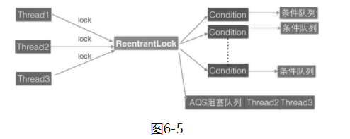

如图6-5所示，假如线程Thread1、Thread2和Thread3同时尝试获取独占锁ReentrantLock，假设Thread1获取到了，则Thread2和Thread3就会被转换为Node节点并被放入ReentrantLock对应的AQS阻塞队列，而后被阻塞挂起。

如图6-6所示，假设Thread1获取锁后调用了对应的锁创建的条件变量1，那么Thread1就会释放获取到的锁，然后当前线程就会被转换为Node节点插入条件变量1的条件队列。由于Thread1释放了锁，所以阻塞到AQS队列里面的Thread2和Thread3就有机会获取到该锁，假如使用的是公平策略，那么这时候Thread2会获取到该锁，从而从AQS队列里面移除Thread2对应的Node节点


​																图 6-6 

ReentrantLock的底层是使用AQS实现的**可重入独占锁**。在这里AQS状态值为0表示当前锁空闲，为大于等于1的值则说明该锁已经被占用。该锁内部有公平与非公平实现，默认情况下是非公平的实现。另外，由于该锁是独占锁，所以某时只有一个线程可以获取该锁。

#### 4 读写锁 ReentrantReadWriteLock 的原理  

具体的一些内容可以参考，如何计算高16位和低16位： https://blog.csdn.net/qq_26542493/article/details/104930610

解决线程安全问题使用ReentrantLock就可以，但是ReentrantLock是独占锁，某时只有一个线程可以获取该锁，而**实际中会有写少读多的场景**，显然ReentrantLock满足不了这个需求，所以ReentrantReadWriteLock应运而生。**ReentrantReadWriteLock采用读写分离的策略，允许多个线程可以同时获取读锁**。


```java
public class ReentrantReadWriteLock
        implements ReadWriteLock, java.io.Serializable {
    private static final long serialVersionUID = -6992448646407690164L;
    /** Inner class providing readlock */
    private final ReentrantReadWriteLock.ReadLock readerLock;
    /** Inner class providing writelock */
    private final ReentrantReadWriteLock.WriteLock writerLock;
    /** Performs all synchronization mechanics */
    final Sync sync;

    /**
     * Creates a new {@code ReentrantReadWriteLock} with
     * default (nonfair) ordering properties.
     */
    public ReentrantReadWriteLock() {
        this(false);
    }
    public ReentrantReadWriteLock(boolean fair) {
        sync = fair ? new FairSync() : new NonfairSync();
        readerLock = new ReadLock(this);
        writerLock = new WriteLock(this);
    }

    public ReentrantReadWriteLock.WriteLock writeLock() { return writerLock; }
    public ReentrantReadWriteLock.ReadLock  readLock()  { return readerLock; }
    ...
}
```

读写锁的内部维护了一个ReadLock和一个WriteLock，它们依赖Sync实现具体功能。而Sync继承自AQS，并且也提供了公平和非公平的实现。下面只介绍**非公平的读写锁实现**。我们知道AQS中只维护了一个state状态，而**ReentrantReadWriteLock则需要维护读状态和写状态，一个state怎么表示写和读两种状态呢？ReentrantReadWriteLock巧妙地使用state的高16位表示读状态，也就是获取到读锁的次数；使用低16位表示获取到写锁的线程的可重入次数**。

```java
static final int SHARED_SHIFT   = 16;
// 共享锁（读锁）状态单位值 65536
static final int SHARED_UNIT    = (1 << SHARED_SHIFT);
// 共享锁线程最大个数 65536
static final int MAX_COUNT      = (1 << SHARED_SHIFT) - 1;
// 排它锁（写锁）掩码，二进制，15个1
static final int EXCLUSIVE_MASK = (1 << SHARED_SHIFT) - 1;
/** Returns the number of shared holds represented in count  */
// 返回读线程数
static int sharedCount(int c)    { return c >>> SHARED_SHIFT; }
/** Returns the number of exclusive holds represented in count  */
// 返回写锁可重入数
static int exclusiveCount(int c) { return c & EXCLUSIVE_MASK; }

```

其中，**firstReader**用来记录第一个获取到读锁的线程，**firstReaderHoldCount**则记录第一个获取到读锁的线程获取读锁的可重入次数。**cachedHoldCounter**用来记录最后一个获取读锁的线程获取读锁的可重入次数。

```java
private transient Thread firstReader = null;
private transient int firstReaderHoldCount; 

private transient HoldCounter cachedHoldCounter;
static final class HoldCounter {
    int count = 0;
    // Use id, not reference, to avoid garbage retention
    final long tid = getThreadId(Thread.currentThread());
}
```

**readHolds**是**ThreadLocal**变量，用来存放除去第一个获取读锁线程外的其他线程获取读锁的可重入次数。ThreadLocalHoldCounter继承了ThreadLocal，因而initialValue方法返回一个HoldCounter对象。 

```java
private transient ThreadLocalHoldCounter readHolds;
static final class ThreadLocalHoldCounterextends ThreadLocal<HoldCounter> {
    public HoldCounter initialValue() {
        return new HoldCounter();
    }
}
```

##### （1）写锁的获取与释放---（非公平锁的解析）

在ReentrantReadWriteLock中写锁使用**WriteLock**来实现。

> 写锁的状态表示为AQS的**state变量的低16位**，**当state低16位为0，表示当前写锁没有被占有，反之表示写锁被某个写线程占有(state = 1)或重入(state > 1)**。

- **void lock()**

**写锁是个独占锁，某时只有一个线程可以获取该锁**。**如果当前没有线程获取到读锁和写锁，则当前线程可以获取到写锁然后返回**。**如果当前已经有线程获取到读锁和写锁，则当前请求写锁的线程会被阻塞挂起**。另外，**写锁是可重入锁，如果当前线程已经获取了该锁，再次获取只是简单地把可重入次数加1后直接返回**。

```java
public void lock() {
    sync.acquire(1);
}
public final void acquire(int arg) {
    // sync 重写的 tryAcquire 方法
    if (!tryAcquire(arg) &&
        acquireQueued(addWaiter(Node.EXCLUSIVE), arg))
        selfInterrupt();
}
```

调用 tryAcquire(arg) 方法，实际上是 ReentrantReadWriteLock 内部的 sync 类重写的。

```java
protected final boolean tryAcquire(int acquires) {
    /*
     * Walkthrough:
     * 1. If read count nonzero or write count nonzero
     *    and owner is a different thread, fail.
     * 2. If count would saturate, fail. (This can only
     *    happen if count is already nonzero.)
     * 3. Otherwise, this thread is eligible for lock if
     *    it is either a reentrant acquire or
     *    queue policy allows it. If so, update state
     *    and set owner.
     */
    Thread current = Thread.currentThread();
    int c = getState();
    int w = exclusiveCount(c);
    // （1） c != 0 说明读锁或写锁已经被某线程获取了
    if (c != 0) {
        // (Note: if c != 0 and w == 0 then shared count != 0)
        // （2）w = 0 说明已经有线程获取了读锁， w !=0 并且当前线程不是写锁拥有者。
        if (w == 0 || current != getExclusiveOwnerThread())
            return false;
        // （3）说明当前线程获取了写锁，判断可重入次数
        if (w + exclusiveCount(acquires) > MAX_COUNT)
            throw new Error("Maximum lock count exceeded");
        // Reentrant acquire （4）设置可重入次数
        setState(c + acquires);
        return true;
    }
    // （5）第一个写线程获取写锁
    if (writerShouldBlock() ||
        !compareAndSetState(c, c + acquires))
        return false;
    setExclusiveOwnerThread(current);
    return true;
}
```

在代码（1）中，如果当前AQS状态值不为0则说明当前已经有线程获取到了读锁或者写锁。在代码（2）中，如果w==0 说明状态值的低16位为0，而AQS状态值不为0，则说明高16位不为0，这暗示已经有线程获取了读锁，所以直接返回false。

而如果 w!=0 则说明当前已经有线程获取了该写锁，再看当前线程是不是该锁的持有者，如果不是则返回false。

执行到代码（3）说明当前线程之前已经获取到了该锁，所以判断该线程的可重入次数是不是超过了最大值，是则抛出异常，否则执行代码（4）增加当前线程的可重入次数，然后返回true。 

如果AQS的状态值等于0则说明目前没有线程获取到读锁和写锁，所以执行代码（5）。其中，对于writerShouldBlock方法，**非公平锁的实现为**

```java
final boolean writerShouldBlock() {
    return false; // writers can always barge
}
```

如果代码对于非公平锁来说总是返回false，则说明代码（5）抢占式执行CAS尝试获取写锁，获取成功则设置当前锁的持有者为当前线程并返回true，否则返回false。

公平锁的实现为。

```java
final boolean writerShouldBlock() {
    return hasQueuedPredecessors();
}
```

这里还是使用hasQueuedPredecessors来判断当前线程节点是否有前驱节点，如果有则当前线程放弃获取写锁的权限，直接返回false。 

- **void lockInterruptibly()** 

类似于lock（）方法，它的不同之处在于，它会对中断进行响应，也就是当其他线程调用了该线程的interrupt（）方法中断了当前线程时，当前线程会抛出异常InterruptedException异常。

- **boolean tryLock()**

尝试获取写锁，如果当前没有其他线程持有写锁或者读锁，则当前线程获取写锁会成功，然后返回true。如果当前已经有其他线程持有写锁或者读锁则该方法直接返回false，且当前线程并不会被阻塞。如果当前线程已经持有了该写锁则简单增加AQS的状态值后直接返回true。

- **boolean tryLock(long timeout, TimeUnit unit)**

与tryLock（）的不同之处在于，多了超时时间参数，如果尝试获取写锁失败则会把当前线程挂起指定时间，待超时时间到后当前线程被激活，如果还是没有获取到写锁则返回false。另外，该方法会对中断进行响应，也就是当其他线程调用了该线程的interrupt（）方法中断了当前线程时，当前线程会抛出InterruptedException异常。 

- **void unlock()**

尝试释放锁，如果当前线程持有该锁，调用该方法会让该线程对该线程持有的AQS状态值减1，如果减去1后当前状态值为0则当前线程会释放该锁，否则仅仅减1而已。如果当前线程没有持有该锁而调用了该方法则会抛出IllegalMonitorStateException异常，代码如下

```java
public void unlock() {
    sync.release(1);
}

public final boolean release(int arg) {
    if (tryRelease(arg)) {
        Node h = head;
        if (h != null && h.waitStatus != 0)
            unparkSuccessor(h);
        return true;
    }
    return false;
}

// java.util.concurrent.locks.ReentrantReadWriteLock.Sync#tryRelease
protected final boolean tryRelease(int releases) {
    if (!isHeldExclusively()) // （6）看是否是写锁拥有者调用的unlock
        throw new IllegalMonitorStateException();
    // （7）获取可重入值，这里没有考虑高 16 位，因为获取写锁时，读锁状态值肯定为 0
    int nextc = getState() - releases;
    boolean free = exclusiveCount(nextc) == 0;
    // （8）如果写锁可重入值为 0，则释放锁，否则只是简单地更新状态值
    if (free)
        setExclusiveOwnerThread(null);
    setState(nextc);
    return free;
}
```

tryRelease首先通过isHeldExclusively判断是否当前线程是该写锁的持有者，如果不是则抛出异常，否则执行代码（7），这说明当前线程持有写锁，持有写锁说明状态值的高16位为0，所以这里nextc值就是当前线程写锁的剩余可重入次数。代码（8）判断当前可重入次数是否为0，如果free为true则说明可重入次数为0，所以当前线程会释放写锁，将当前锁的持有者设置为null。如果free为false则简单地更新可重入次数。

##### （2）读锁的获取与释放

ReentrantReadWriteLock中的读锁是使用**ReadLock**来实现的。 **多个线程可以同时获取读锁**。

> 读锁，锁定的是AQS的**state变量的高16位**，**当state的高16位等于0，表示当前读锁未被占有**；**当state的高16位大于0，表示当前读锁可能被一个或多个线程占有，多于一个占有读锁的线程，允许重入**。

- **void lock()**

获取读锁，如果当前没有其他线程持有写锁，则当前线程可以获取读锁，AQS的状态值state的高16位的值会增加1，然后方法返回。否则如果其他一个线程持有写锁，则当前线程会被阻塞。

```java
public void lock() {
    sync.acquireShared(1);
}
// java.util.concurrent.locks.AbstractQueuedSynchronizer#acquireShared
public final void acquireShared(int arg) {
    if (tryAcquireShared(arg) < 0)
        doAcquireShared(arg);
}
// 调用 ReentrantReadWriteLock 中的sync重写的tryAcquireShared方法
protected final int tryAcquireShared(int unused) {
    // （1）获取当前状态值
    Thread current = Thread.currentThread();
    int c = getState();
    // （2）判断是否写锁被占用，这是因为，如果线程先获得了写锁，是可以重入再次获取读锁的，此为锁降级。
    // 否则不可重入
    if (exclusiveCount(c) != 0 &&
        getExclusiveOwnerThread() != current)
        return -1;
    // （3）获取读锁计数
    int r = sharedCount(c);
    // （4）尝试获取锁，多个读线程只有一个会成功，不成功的进入 fullTryAcquireShared 进行重试
    if (!readerShouldBlock() &&
        r < MAX_COUNT &&
        compareAndSetState(c, c + SHARED_UNIT)) {
        // （5）第一个线程获取读锁
        if (r == 0) {
            // 把但钱线程设置成第一个获取到读锁的线程
            firstReader = current;
            firstReaderHoldCount = 1;
            // （6）如果当前线程是第一个获取读锁的线程，则重入，计数 + 1
        } else if (firstReader == current) {
            firstReaderHoldCount++;
        } else {
            // (7)记录最后一个获取读锁的线程或记录其他线程读锁的可重入数
            // 如果计数器为空，或者计数器的 tid 不是当前线程 id，则说明有两种情况
            // 1 rh 还未被任何线程设置，此时只有 firstReader 一个线程获取到了读锁
     		// 2 rh 已经被设置了，并且不是当前线程，说明在当前线程之前除了firstReader还有其他线程获取到了读锁，那么当前线程就是第三个获取到读锁的（至少第三个）
            HoldCounter rh = cachedHoldCounter;
            if (rh == null || rh.tid != getThreadId(current))
                //不管哪种情况，都需要创建并初始化当前线程的计数器，并赋值给 cachedHoldCounter
                //因为，当前线程是此时最后一个获取到读锁的线程，需要缓存下来
                cachedHoldCounter = rh = readHolds.get();
            else if (rh.count == 0)
                //如果当前线程是最近一个获取到读锁的线程，并且计数为0，就把 rh 线程持有锁的次数信息，放入到本地线程 readHolds
                readHolds.set(rh);
            rh.count++;
        }
        return 1;
    }
    // （8）类似 tryAcquireShared，但是是自选获取
    return fullTryAcquireShared(current);
}
```

如上代码首先获取了当前AQS的状态值，然后代码（2）查看是否有其他线程获取到了写锁，如果是则直接返回-1，而后调用AQS的doAcquireShared方法把当前线程放入AQS阻塞队列。

如果当前要获取读锁的线程已经持有了写锁，则也可以获取读锁。但是需要注意，**当一个线程先获取了写锁，然后获取了读锁处理事情完毕后，要记得把读锁和写锁都释放掉，不能只释放写锁**。

否则执行代码（3），得到获取到的读锁的个数，到这里说明目前没有线程获取到写锁，但是可能有线程持有读锁，然后执行代码（4）。其中非公平锁的 readerShouldBlock 实现代码如下

```java
final boolean readerShouldBlock() {
    return apparentlyFirstQueuedIsExclusive();
}
final boolean apparentlyFirstQueuedIsExclusive() {
    Node h, s;
    return (h = head) != null &&
        (s = h.next)  != null &&
        !s.isShared()         &&
        s.thread != null;
}
```

如上代码的作用是，如果队列里面存在一个元素，则判断第一个元素是不是正在尝试获取写锁，如果不是，则当前线程判断当前获取读锁的线程是否达到了最大值。最后执行CAS操作将AQS状态值的高16位值增加1。  

代码（5）（6）记录第一个获取读锁的线程并统计该线程获取读锁的可重入数。代码（7）使用cachedHoldCounter记录最后一个获取到读锁的线程和该线程获取读锁的可重入数，readHolds记录了当前线程获取读锁的可重入数。

如果readerShouldBlock返回true则说明有线程正在获取写锁，所以执行代码（8）。fullTryAcquireShared的代码与tryAcquireShared类似，它们的不同之处在于，前者通过循环自旋获取。

- **void lockInterruptibly()** 

类似于lock（）方法，不同之处在于，该方法会对中断进行响应，也就是当其他线程调用了该线程的interrupt（）方法中断了当前线程时，当前线程会抛出InterruptedException异**常**

- **boolean tryLock()**

尝试获取读锁，如果当前没有其他线程持有写锁，则当前线程获取读锁会成功，然后返回true。如果当前已经有其他线程持有写锁则该方法直接返回false，但当前线程并不会被阻塞。如果当前线程已经持有了该读锁则简单增加AQS的状态值高16位后直接返回true。 

- **boolean tryLock(long timeout, TimeUnit unit)**

与tryLock（）的不同之处在于，多了超时时间参数，如果尝试获取读锁失败则会把当前线程挂起指定时间，待超时时间到后当前线程被激活，如果此时还没有获取到读锁则返回false。另外，该方法对中断响应，也就是当其他线程调用了该线程的interrupt（）方法中断了当前线程时，当前线程会抛出InterruptedException异常。

- **void unlock()**

```java
public void unlock() {
    sync.releaseShared(1);
}

// java.util.concurrent.locks.AbstractQueuedSynchronizer#releaseShared
public final boolean releaseShared(int arg) {
    if (tryReleaseShared(arg)) {
        doReleaseShared();
        return true;
    }
    return false;
}

// java.util.concurrent.locks.ReentrantReadWriteLock.Sync#tryReleaseShared
protected final boolean tryReleaseShared(int unused) {
    Thread current = Thread.currentThread();
    if (firstReader == current) {
        // assert firstReaderHoldCount > 0;
        if (firstReaderHoldCount == 1)
            firstReader = null;
        else
            firstReaderHoldCount--;
    } else {
        HoldCounter rh = cachedHoldCounter;
        if (rh == null || rh.tid != getThreadId(current))
            rh = readHolds.get();
        int count = rh.count;
        if (count <= 1) {
            readHolds.remove();
            if (count <= 0)
                throw unmatchedUnlockException();
        }
        --rh.count;
    }
    // 循环知道自己的都技术 -1  ，CAS 更新成功
    for (;;) {
        int c = getState();
        int nextc = c - SHARED_UNIT;
        if (compareAndSetState(c, nextc))
            // Releasing the read lock has no effect on readers,
            // but it may allow waiting writers to proceed if
            // both read and write locks are now free.
            return nextc == 0;
    }
}
```

如以上代码所示，在无限循环里面，首先获取当前AQS状态值并将其保存到变量c，然后变量c被减去一个读计数单位后使用CAS操作更新AQS状态值，如果更新成功则查看当前AQS状态值是否为0，为0则说明当前已经没有读线程占用读锁，则tryReleaseShared返回true。然后会调用doReleaseShared方法释放一个由于获取写锁而被阻塞的线程，如果当前AQS状态值不为0，则说明当前还有其他线程持有了读锁，所以tryReleaseShared返回false。如果tryReleaseShared中的CAS更新AQS状态值失败，则自旋重试直到成功。

```java
package com.lanwq.bingfazhimei.chapter2;

import java.util.ArrayList;
import java.util.concurrent.locks.Lock;
import java.util.concurrent.locks.ReentrantLock;
import java.util.concurrent.locks.ReentrantReadWriteLock;

/**
 * @author Vin lan
 * @className ReentrantLockList
 * @description
 * @createTime 2021-11-03  11:20
 **/
public class ReentrantLockList {
    /**
     * 线程不安全的 list
     */
    private ArrayList<String> array = new ArrayList<>();

    /**
     * 独占锁
     */
    private volatile ReentrantReadWriteLock lock2 = new ReentrantReadWriteLock();
    private final Lock readLock = lock2.readLock();
    private final Lock writeLock = lock2.writeLock();

    /**
     * 添加元素
     */
    public void add(String e) {
        writeLock.lock();
        try {
            array.add(e);
        } catch (Exception ex) {
            ex.printStackTrace();
        } finally {
		 writeLock.unlock();
        }
    }

    /**
     * 删除
     */
    public void remove(String e) {
        writeLock.lock();
        try {
            array.remove(e);
        } catch (Exception ex) {
            ex.printStackTrace();
        } finally {
           writeLock.unlock();
        }
    }

    /**
     * 获取数据
     */
    public String add(int index) {
        readLock.lock();
        try {
            return array.get(index);
        } catch (Exception ex) {
            ex.printStackTrace();
        } finally {
           readLock.unlock();
        }
        return null;
    }
}
```

以上代码调用get方法时使用的是读锁，这样运行多个读线程来同时访问list的元素，这在读多写少的情况下性能会更好。 

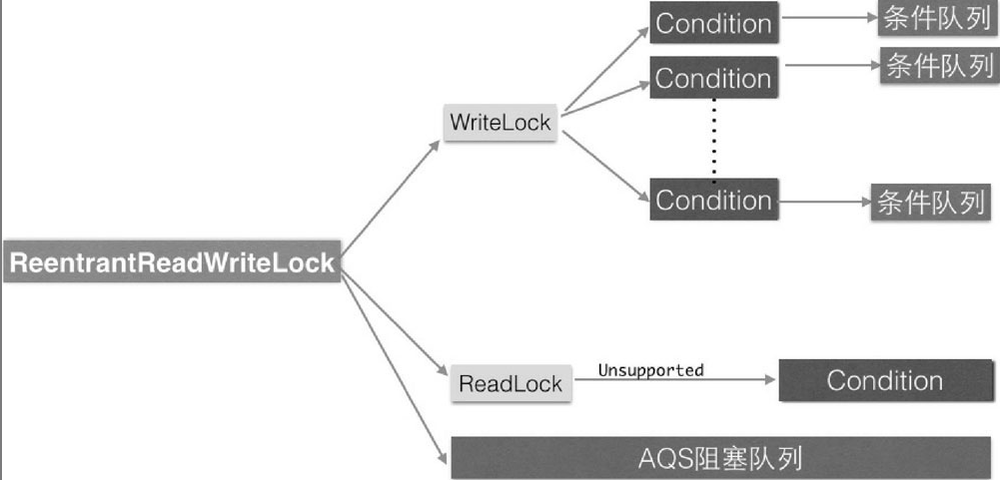

##### 5、小结 

读写锁ReentrantReadWriteLock，它的底层是使用AQS实现的。ReentrantReadWriteLock巧妙地使用**AQS的状态值的高16位表示获取到读锁的个数**，**低16位表示获取写锁的线程的可重入次数**，并通过CAS对其进行操作实现了读写分离，这在**读多写少**的场景下比较适用。

#### 5 StampedLock 锁探究


#### 第7章 Java并发包中并发队列原理剖析

按照实现的方式的不同，并发安全队列可分为**阻塞队列（使用锁实现）** 和 **非阻塞队列（使用 CAS 非阻塞算法实现）**。

##### 1 ConcurrentLinkedQueue 原理探究

ConcurrentLinkedQueue  是**线程安全的无界非阻塞队列**，底层数据结构使用 **单向链表** 实现，对于入队和出队操作使用 **CAS 来实现线程安全**。

###### 1.1 类图结构

**ConcurrentLinkedQueue**  内部的队列使用单向链表方式实现，其中有两个 volatile 类型的 Node 节点分别用来存放队列的首、尾节点。默认头、尾节点都是指向item为null的哨兵节点。新元素会被插入队列末尾，出队时从队列头部获取一个元素。

```java
public ConcurrentLinkedQueue() {
    head = tail = new Node<E>(null);
}

static final class Node<E> {
    volatile E item;
    volatile Node<E> next;

    Node(E item) {
            UNSAFE.putObject(this, itemOffset, item);
        }
    ...
}
```

在Node节点内部则维护一个使用volatile修饰的变量item，用来存放节点的值；next用来存放链表的下一个节点，从而链接为一个单向无界链表。其内部则使用UNSafe工具类提供的CAS算法来保证出入队时操作链表的原子性。

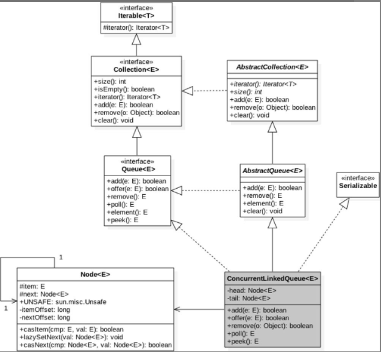


###### 1.2  ConcurrentLinkedQueue 原理介绍

######  （1）offer 操作

offer操作是在队列末尾添加一个元素，如果传递的参数是null则抛出NPE异常，否则由于ConcurrentLinkedQueue是无界队列，该方法一直会返回true。另外，由于使用CAS无阻塞算法，因此该方法不会阻塞挂起调用线程。

```java
/**
 * Inserts the specified element at the tail of this queue.
 * As the queue is unbounded, this method will never return {@code false}.
 *
 * @return {@code true} (as specified by {@link Queue#offer})
 * @throws NullPointerException if the specified element is null
 */
public boolean offer(E e) {
    // （1） e 为null则抛出空指针异常
    checkNotNull(e);
    // （2）构造 node 节点，在构造函数内部调用 UNSAFE.putObject(this, itemOffset, item);
    final Node<E> newNode = new Node<E>(e);
	// （3）从尾节点进行插入
    for (Node<E> t = tail, p = t;;) {
        Node<E> q = p.next;
        // （4）说明 p 是尾节点，则执行插入
        if (q == null) {
            // p is last node （5）使用 cas 设置 p 节点的 next 节点
            if (p.casNext(null, newNode)) {
                // Successful CAS is the linearization point
                // for e to become an element of this queue,
                // and for newNode to become "live". （6） CAS 成功
                if (p != t) // hop two nodes at a time
                    casTail(t, newNode);  // Failure is OK.
                return true;
            }
            // Lost CAS race to another thread; re-read next
        }
        else if (p == q)
            // We have fallen off list.  If tail is unchanged, it
            // will also be off-list, in which case we need to
            // jump to head, from which all live nodes are always
            // reachable.  Else the new tail is a better bet.
           // 我们已从名单上除名了。如果tail没有改变，它也将不在列表中，在这种情况下，我们需要跳转到head，从那里所有活动节点都是可到达的。否则新尾巴是更好的选择。
            // （7）多线程操作时，由于 poll 操作移除元素后，有可能会把 head 变成子引用，也就是head的next变成了 head，所以这里需要重新找新的 head
            p = (t != (t = tail)) ? t : head;
        else
            // Check for tail updates after two hops.（8）寻找尾节点
            p = (p != t && t != (t = tail)) ? t : q;
    }
}
```

1. 当一个线程调用 offer(item) 时的情况，会根据正常的流程插入一个node到队列中去，插入前

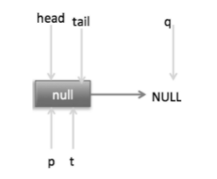

代码（4）发现q==null则执行代码（5），**通过CAS原子操作判断p节点的next节点是否为null，如果为null则使用节点newNode替换p的next节点，然后执行代码（6）**，**这里由于p==t所以没有设置尾部节点**，然后退出offer方法。插入后的效果。


2. **如果多个线程同时调用，就会存在多个线程同时执行到代码（5）的情况**。假设线程A调用offer（item1），线程B调用offer（item2），同时执行到代码（5）p.casNext（null,newNode）。由于CAS的比较设置操作是原子性的，所以这里假设线程A先执行了比较设置操作，发现当前p的next节点确实是null，则会原子性地更新next节点为item1，这时候线程B也会判断p的next节点是否为null，结果发现不是null（因为线程A已经设置了p的next节点为item1），则会跳到代码（3），然后执行到代码（4），这时候的队列分布如图7-4所示。

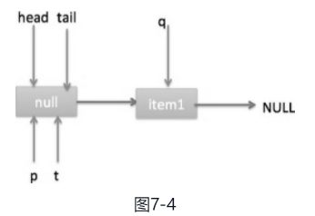

根据上面的状态图可知线程B接下来会执行代码（8），然后把q赋给了p，这时候队列状态如图7-5所示

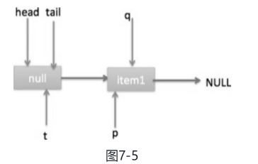

然后线程B再次跳转到代码（3）执行，当执行到代码（4）时队列状态如图7-6所示。

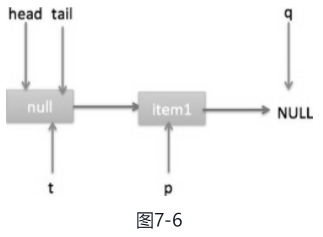

由于这时候q==null，所以线程B会执行代码（5），通过CAS操作判断当前p的next节点是否是null，不是则再次循环尝试，是则使用item2替换。假设CAS成功了，那么执行代码（6），由于p! =t，所以设置tail节点为item2，然后退出offer方法。这时候队列分布如图7-7所示。

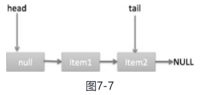

代码（7）这一步要在执行poll操作才会执行。这里先来看一下执行poll操作后可能会存在的一种情况，如图7-8所示。

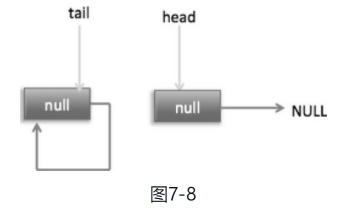

下面分析当队列处于这种状态时调用offer添加元素，执行到代码（4）时的状态图（见图7-9）

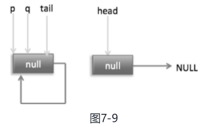

这里由于q节点不为空并且p==q所以执行代码（7），由于t==tail所以p被赋值为head，然后重新循环，循环后执行到代码（4），这时候队列状态如图7-10所示。

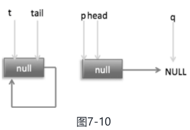

这时候由于q==null，所以执行代码（5）进行CAS操作，如果当前没有其他线程执行offer操作，则CAS操作会成功，p的next节点被设置为新增节点。然后执行代码（6），由于p! =t所以设置新节点为队列的尾部节点，现在队列状态如图7-11所示。

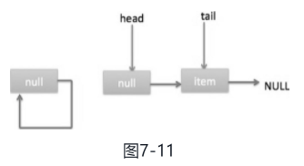

需要注意的是，这里自引用的节点会被垃圾回收掉。

可见，offer操作中的关键步骤是代码（5），**通过原子CAS操作来控制某时只有一个线程可以追加元素到队列末尾。进行CAS竞争失败的线程会通过循环一次次尝试进行CAS操作，直到CAS成功才会返回，也就是通过使用无限循环不断进行CAS尝试方式来替代阻塞算法挂起调用线程**。相比阻塞算法，这是使用CPU资源换取阻塞所带来的开销。

###### （2）add 操作

内部其实还是 offer 操作

```java
public boolean add(E e) {
    return offer(e);
}
```

###### （3）pool 操作

poll操作是在队列头部获取并移除一个元素，如果队列为空则返回null。

```java
public E poll() {
    // （1）goto 标记
    restartFromHead:
    // （2）无限循环
    for (;;) {
        for (Node<E> h = head, p = h, q;;) {
            E item = p.item;// （3）保存当前节点值
			// （4）当前节点有值，则 CAS 变为 null
            if (item != null && p.casItem(item, null)) {
                // Successful CAS is the linearization point
                // for item to be removed from this queue. （5）CAS 成功，则标记当前节点并从链表中移除
                if (p != h) // hop two nodes at a time
                    updateHead(h, ((q = p.next) != null) ? q : p);
                return item;
            }
            // （6）当前队列为空则返回 null
            else if ((q = p.next) == null) {
                updateHead(h, p);
                return null;
            }// （7）如果当前节点被自引用了，则重新寻找新的队列头节点
            else if (p == q)
                continue restartFromHead;
            else
                p = q;
        }
    }
}

final void updateHead(Node<E> h, Node<E> p) {
        if (h != p && casHead(h, p))
            h.lazySetNext(h);
    }
```

1. poll 操作是从队头获取元素，所以代码（2）内层循环是从head节点开始迭代，代码（3）获取当前队列头的节点，队列一开始为空时队列状态如图7-12所示。

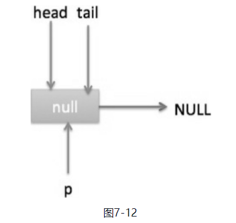

由于head节点指向的是item为null的哨兵节点，所以会执行到代码（6），假设这个过程中没有线程调用offer方法，则此时q等于null，这时候队列状态如图7-13所示。

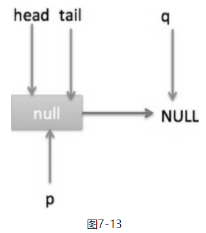

所以会执行updateHead方法，由于h等于p所以没有设置头节点，poll方法直接返回null。

2. 假设执行到代码（6）时已经有其他线程调用了offer方法并成功添加一个元素到队列，这时候q指向的是新增元素的节点，此时队列状态如图7-14所示。

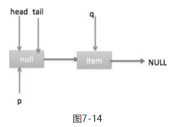

所以代码（6）判断的结果为false，然后会转向执行代码（7），而此时p不等于q，所以转向执行代码（8），执行的结果是p指向了节点q，此时队列状态如图7-15所示。


然后程序转向执行代码（3）, p现在指向的元素值不为null，则执行p.casItem（item, null）通过CAS操作尝试设置p的item值为null，如果此时没有其他线程进行poll操作，则CAS成功会执行代码（5），由于此时p! =h所以设置头节点为p，并设置h的next节点为h自己，poll然后返回被从队列移除的节点值item。此时队列状态如图7-16所示。 


这个状态就是在讲解offer操作时，offer代码的执行路径（7）的状态。

3. 假如现在一个线程调用了poll操作，则在执行代码（4）时队列状态如图7-17所示


​	这时候执行代码（6）返回null。

4. 现在poll的代码还有分支（7）没有执行过，那么什么时候会执行呢？下面来看看。假设线程A执行poll操作时当前队列状态如图7-18所示。（ 有点不好明白。。。）


那么执行p.casItem（item, null）通过CAS操作尝试设置p的item值为null，假设CAS设置成功则标记该节点并从队列中将其移除，此时队列状态如图7-19所示。


然后，由于p! =h，所以会执行updateHead方法，假如线程A执行updateHead前另外一个线程B开始poll操作，这时候线程B的p指向head节点，但是还没有执行到代码（6），这时候队列状态如图7-20所示。

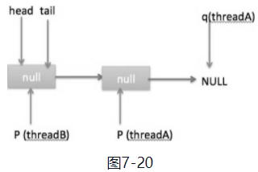

然后线程A执行updateHead操作，执行完毕后线程A退出，这时候队列状态如图7-21所示。

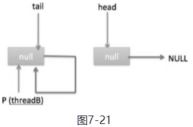

然后线程B继续执行代码（6）, q=p.next，由于该节点是自引用节点，所以p==q，所以会执行代码（7）跳到外层循环restartFromHead，获取当前队列头head，现在的状态如图7-22所示。


总结：**poll方法在移除一个元素时，只是简单地使用CAS操作把当前节点的item值设置为null，然后通过重新设置头节点将该元素从队列里面移除，被移除的节点就成了孤立节点，这个节点会在垃圾回收时被回收掉**。另外，如果在执行分支中发现头节点被修改了，要跳到外层循环重新获取新的头节点。

###### （4）peek 操作

peek操作是获取队列头部一个元素（只获取不移除），如果队列为空则返回null。

```java
public E peek() {
    restartFromHead:
    for (;;) {
        for (Node<E> h = head, p = h, q;;) {
            E item = p.item;
            if (item != null || (q = p.next) == null) {
                updateHead(h, p);
                return item;
            }
            else if (p == q)
                continue restartFromHead;
            else
                p = q;
        }
    }
}
```

与poll操作相比少了 castItem 操作，因为peek只是获取队列头元素值，并不清空其值。

###### （5）size 操作

计算当前队列元素个数，在并发环境下不是很有用，因为CAS没有加锁，所以**从调用size函数到返回结果期间有可能增删元素，导致统计的元素个数不精确**。

###### （6）remove操作 

如果队列里面存在该元素则删除该元素，如果存在多个则删除第一个，并返回true，否则返回false

###### （8）contains操作

判断队列里面是否含有指定对象，**由于是遍历整个队列，所以像size操作一样结果也不是那么精确**，有可能调用该方法时元素还在队列里面，但是遍历过程中其他线程才把该元素删除了，那么就会返回false。

##### 1.3  小结

ConcurrentLinkedQueue的底层使用单向链表数据结构来保存队列元素，每个元素被包装成一个Node节点。队列是靠头、尾节点来维护的，创建队列时头、尾节点指向一个item为null的哨兵节点。第一次执行peek或者first操作时会把head指向第一个真正的队列元素。由于使用非阻塞CAS算法，没有加锁，所以**在计算size时有可能进行了offer、poll或者remove操作，导致计算的元素个数不精确，所以在并发情况下size函数不是很有用**。

如图7-27所示，入队、出队都是操作使用volatile修饰的tail、head节点，要保证在多线程下出入队线程安全，只需要保证这两个Node操作的可见性和原子性即可。由于volatile本身可以保证可见性，所以只需要保证对两个变量操作的原子性即可。


offer操作是在tail后面添加元素，也就是调用tail.casNext方法，而这个方法使用的是CAS操作，只有一个线程会成功，然后失败的线程会循环，重新获取tail，再执行casNext方法。poll操作也通过类似CAS的算法保证出队时移除节点操作的原子性。


##### 2 LinkedBlockingQueue 原理探究  

LinkedBlockingQueue 是使用 **独占锁实现的阻塞队列**，底层是使用 **单向链表实现的**。

###### 1.1 类图介绍


如下面代码：

```java
/**
 * Linked list node class
 */
static class Node<E> {
    E item;

    /**
     * One of:
     * - the real successor Node
     * - this Node, meaning the successor is head.next
     * - null, meaning there is no successor (this is the last node)
     */
    Node<E> next;

    Node(E x) { item = x; }
}

/** The capacity bound, or Integer.MAX_VALUE if none */
private final int capacity;

/** Current number of elements */ 记录队列元素个数
private final AtomicInteger count = new AtomicInteger();

/**
 * Head of linked list.
 * Invariant: head.item == null
 */
transient Node<E> head;

/**
 * Tail of linked list.
 * Invariant: last.next == null
 */
private transient Node<E> last;

/** Lock held by take, poll, etc */ 执行 take、poll等操作时，需要获取该锁
private final ReentrantLock takeLock = new ReentrantLock();

/** Wait queue for waiting takes */当队列为空时，执行出队操作（take）的线程会被放入这个条件队列进行等待
private final Condition notEmpty = takeLock.newCondition();

/** Lock held by put, offer, etc */ 执行put、offer等操作时，需要获取该锁
private final ReentrantLock putLock = new ReentrantLock();

/** Wait queue for waiting puts */ 当队列满时，执行进队操作（put）的线程会被放入这个条件队列进行等待
private final Condition notFull = putLock.newCondition();
```

- 当调用线程在LinkedBlockingQueue实例上执行take、 poll等操作时需要获取到takeLock锁，从而保证同时只有一个线程可以操作链表头节点。notEmpty内部则维护着一个条件队列，当线程获取到takeLock锁后调用notEmpty的await方法时，调用线程会被阻塞，然后该线程会被放到notEmpty内部的条件队列进行等待，直到有线程调用了notEmpty的signal方法。
- 在LinkedBlockingQueue实例上执行put、offer等操作时需要获取到putLock锁，从而保证同时只有一个线程可以操作链表尾节点。notFull内部则维护着一个条件队列，当线程获取到putLock锁后调用notFull的await方法时，调用线程会被阻塞，然后该线程会被放到notFull内部的条件队列进行等待，直到有线程调用了notFull的signal方法。如下是LinkedBlockingQueue的无参构造函数的代码。

```java
public static final int   MAX_VALUE = 0x7fffffff
public LinkedBlockingQueue() {
    this(Integer.MAX_VALUE);
}
```

默认的队列容量是 0x7fffffff，可以自己指定容量大小：所以**从一定程度上可以说 LinkedBlockingQueue 是有界阻塞队列**。

```java
public LinkedBlockingQueue(int capacity) {
    if (capacity <= 0) throw new IllegalArgumentException();
    this.capacity = capacity;
    last = head = new Node<E>(null);
}
```

###### 1.2 LinkedBlockingQueue 原理介绍

###### （1）offer操作

**向队列尾部插入一个元素，如果队列中有空闲则插入成功后返回true，如果队列已满则丢弃当前元素然后返回false**。如果e元素为null则抛出NullPointerException异常。另外，**该方法是非阻塞的**。

```java
public boolean offer(E e) {
    // （1）为空，则抛出空指针异常
    if (e == null) throw new NullPointerException();
    final AtomicInteger count = this.count;
    // （2）如果当前队列满则丢弃将要放入的元素，然后返回 false
    if (count.get() == capacity)
        return false;
    int c = -1;
    Node<E> node = new Node<E>(e);
    // （3）获取 putLock 独占锁，构造新节点
    final ReentrantLock putLock = this.putLock;
    putLock.lock();
    try {
        // （4）如果队列不满，则进队列，并递增元素计数
        if (count.get() < capacity) {
            enqueue(node);
            c = count.getAndIncrement();
            // (5)
            if (c + 1 < capacity)
                notFull.signal();
        }
    } finally { 
        // (6) 释放锁，一定要在这里释放，如果try块异常了，finally 也会被执行到的，另外释放锁后其他因为调用put操作而被阻塞的线程将会有一个获取到该锁。
        putLock.unlock();
    }
    // (7)
    if (c == 0)
        signalNotEmpty();
    // (8)
    return c >= 0;
}
```

代码（3）获取到 putLock 锁，**当前线程获取到该锁后，则其他调用put和offer操作的线程将会被阻塞（阻塞的线程被放到putLock锁的AQS阻塞队列）**。

代码（4）这里重新判断当前队列是否满，这是**因为在执行代码（2）和获取到putLock锁期间可能其他线程通过put或者offer操作向队列里面添加了新元素**。重新判断队列确实不满则新元素入队，并递增计数器。

代码（5）判断如果新元素入队后队列还有空闲空间，则唤醒notFull的条件队列里面因为调用了notFull的await操作（比如执行put方法而队列满了的时候）而被阻塞的一个线程，因为队列现在有空闲所以这里可以提前唤醒一个入队线程。

代码（7）中的c==0说明在执行代码（6）释放锁时队列里面至少有一个元素（c 一开始是 -1），队列里面有元素则执行signalNotEmpty操作，signalNotEmpty的代码如下。

```java
private void signalNotEmpty() {
    final ReentrantLock takeLock = this.takeLock;
    takeLock.lock();
    try {
        notEmpty.signal();
    } finally {
        takeLock.unlock();
    }
}
```

该方法的作用就是**激活notEmpty的条件队列中因为调用notEmpty的await方法（比如调用take方法并且队列为空的时候）而被阻塞的一个线程**，这也说明了调用条件变量的方法前要获取对应的锁。

综上可知，offer方法通过使用putLock锁保证了在队尾新增元素操作的原子性。另外，调用条件变量的方法前一定要记得获取对应的锁，并且注意进队时只操作队列链表的尾节点。

###### （2）put 操作

向队列尾部插入一个元素，如果队列中有空闲则插入后直接返回，**如果队列已满则阻塞当前线程，直到队列有空闲插入成功后返回**。如果在阻塞时被其他线程设置了中断标志，则被阻塞线程会抛出InterruptedException异常而返回。另外，如果e元素为null则抛出NullPointerException异常。

```java
public void put(E e) throws InterruptedException {
    if (e == null) throw new NullPointerException();
    // Note: convention in all put/take/etc is to preset local var
    // holding count negative to indicate failure unless set.
    int c = -1;
    Node<E> node = new Node<E>(e);
    final ReentrantLock putLock = this.putLock;
    final AtomicInteger count = this.count;
    // 获取独占锁，可以被中断，如果其他线程设置了中断标志则当前线程回抛出 InterruptedException 异常，所以put操作在获取锁的过程中时可以被中断的
    putLock.lockInterruptibly();
    try {
        /*
         * Note that count is used in wait guard even though it is
         * not protected by lock. This works because count can
         * only decrease at this point (all other puts are shut
         * out by lock), and we (or some other waiting put) are
         * signalled if it ever changes from capacity. Similarly
         * for all other uses of count in other wait guards.
         */
        // 如果队列满则等待。把当前线程放入 notFull 的条件队列，当前线程被阻塞挂起后会释放获取到的 putLock锁。由于putLock 锁被释放了，所以现在其他线程有机会获取到 putLock 锁了
        while (count.get() == capacity) {
            notFull.await();
        }
        // (4)进队列，并递增计数
        enqueue(node);
        c = count.getAndIncrement();
        if (c + 1 < capacity)
            notFull.signal();
    } finally {
        putLock.unlock();
    }
    if (c == 0)
        signalNotEmpty();
}
```

使用 while (count.get() == capacity)  语句而不是if语句？这是考虑到当前线程被虚假唤醒的问题，也就是其他线程没有调用notFull的singal方法时notFull. await（）在某种情况下会自动返回。如果使用if语句那么虚假唤醒后会执行代码（4）的元素入队操作，并且递增计数器，而这时候队列已经满了，从而导致队列元素个数大于队列被设置的容量，进而导致程序出错。而使用while循环时，假如notFull.await（）被虚假唤醒了，那么再次循环检查当前队列是否已满，如果是则再次进行等待。

###### （3）poll 操作

**从队列头部获取并移除一个元素**，如果队列为空则返回null，该**方法是不阻塞的**。

```java
public E poll() {
    final AtomicInteger count = this.count;
    if (count.get() == 0)
        return null;
    E x = null;
    int c = -1;
    final ReentrantLock takeLock = this.takeLock; // (2) 获取独占锁
    takeLock.lock();
    try {
        if (count.get() > 0) { // 3.1
            x = dequeue();// 3.2
            c = count.getAndDecrement(); // 3.3
            if (c > 1)// (4)
                notEmpty.signal();
        }
    } finally {
        takeLock.unlock();
    }
    // (6)
    if (c == capacity)
        signalNotFull();
    return x;
}
```

代码（2）获取独占锁takeLock，**当前线程获取该锁后，其他线程在调用poll或者take方法时会被阻塞挂起**。

代码3.1-3.3，不是原子性操作，但它们是线程安全的。因为，我们这里只需要关系 count 的影响，而实际对count计数有递减影响的是poll、take或者remove操作，但是这三个方法都需要获取到takeLock锁才能进行操作，而当前线程已经获取了takeLock锁，所以其他线程没有机会在当前情况下递减count计数值。

代码（4）判断如果c>1则说明当前线程移除掉队列里面的一个元素后队列不为空（c是删除元素前队列元素个数），那么这时候就可以激活因为调用take方法而被阻塞到notEmpty的条件队列里面的一个线程。

代码（6）说明当前线程移除队头元素前当前队列是满的，移除队头元素后当前队列至少有一个空闲位置，那么这时候就可以**调用signalNotFull激活因为调用put方法而被阻塞到notFull的条件队列里的一个线程**，signalNotFull的代码如下。

```java
private void signalNotFull() {
    final ReentrantLock putLock = this.putLock;
    putLock.lock();
    try {
        notFull.signal();
    } finally {
        putLock.unlock();
    }
}
```

###### （4）peek 操作

**获取队列头部元素但是不从队列里面移除它**，如果队列为空则返回null。该方法是不阻塞的。

###### （5）take 操作

和put操作对应。

**获取当前队列头部元素并从队列里面移除它**。**如果队列为空则阻塞当前线程直到队列不为空然后返回元素，如果在阻塞时被其他线程设置了中断标志，则被阻塞线程会抛出InterruptedException异常而返回**。

###### （6）remove 操作

删除队列里面指定的元素，有则删除并返回true，没有则返回false。


总结：由于remove方法在删除指定元素前加了两把锁，所以在遍历队列查找指定元素的过程中是线程安全的，并且此时其他调用入队、出队操作的线程全部会被阻塞。另外，获取多个资源锁的顺序与释放的顺序是相反的。

（7）size 操作

获取当前队列元素个数。

由于进行出队、入队操作时的count是加了锁的，所以结果相比ConcurrentLinkedQueue的size方法比较准确。这里考虑为何在ConcurrentLinkedQueue中需要遍历链表来获取size而不使用一个原子变量呢？这是因为使用原子变量保存队列元素个数需要保证入队、出队操作和原子变量操作是原子性操作，而ConcurrentLinkedQueue使用的是CAS无锁算法，所以无法做到这样。

###### 1.3 总结

**LinkedBlockingQueue的内部是通过单向链表实现的**，使用头、尾节点来进行入队和出队操作，也就是入队操作都是对尾节点进行操作，出队操作都是对头节点进行操作。

如图7-29所示，对头、尾节点的操作分别使用了单独的独占锁从而保证了原子性，所以出队和入队操作是可以同时进行的。另外对头、尾节点的独占锁都配备了一个条件队列，用来存放被阻塞的线程，并结合入队、出队操作实现了一个生产消费模型。


### 3 ArrayBlockingQueue 原理探究  

ArrayBlockingQueue使用的 **有界数组方式实现的阻塞队列** 来实现同步的。

#### 1 类图介绍


从图中可以看出，ArrayBlockingQueue的内部有一个数组items，用来存放队列元素，putindex变量表示入队元素下标，takeIndex是出队下标，count统计队列元素个数。

从定义可知，这些变量并没有使用volatile修饰，这是因为访问这些变量都是在锁块内，而**加锁已经保证了锁块内变量的内存可见性了**。另外有个**独占锁lock用来保证出、入队操作的原子性，这保证了同时只有一个线程可以进行入队、出队操作**。另外，**notEmpty、notFull条件变量用来进行出、入队的同步**。

另外，因为 ArrayBlockingQueue 是有界队列，所以构造函数必须传入队列大小参数。

```java
public ArrayBlockingQueue(int capacity) {
    this(capacity, false);
}

public ArrayBlockingQueue(int capacity, boolean fair) {
    if (capacity <= 0)
        throw new IllegalArgumentException();
    this.items = new Object[capacity];
    lock = new ReentrantLock(fair); // 是否是公平锁，默认是非公平锁
    notEmpty = lock.newCondition();
    notFull =  lock.newCondition();
}
```

#### 2 原理介绍

##### 2.1 offer 操作

**向队列尾部插入一个元素，如果队列有空闲空间则插入成功后返回true，如果队列已满则丢弃当前元素然后返回false**。如果e元素为null则抛出NullPointerException异常。另外，该方法是不阻塞的。

```java
public boolean offer(E e) {
    // （1）e 为null，抛出异常
    checkNotNull(e);
    // （2）获取独占锁
    final ReentrantLock lock = this.lock;
    lock.lock();
    try {
        // （3）如果队列满则返回 false
        if (count == items.length)
            return false;
        else {
            // （4）否则插入元素
            enqueue(e);
            return true;
        }
    } finally {
        // 释放锁
        lock.unlock();
    }
}
```

插入元素的代码如下所示：

```java
private void enqueue(E x) {
    // assert lock.getHoldCount() == 1;
    // assert items[putIndex] == null;
    final Object[] items = this.items;
    items[putIndex] = x;
    if (++putIndex == items.length) // 如果队列满了，则从0开始
        putIndex = 0;
    count++; // 递增个数计数器 
    notEmpty.signal(); // 激活notEmpty 队列中因为调用 take 操作而被阻塞的一个线程。这是由于在操作共享变量 count 前加了锁，所以不存在内存不可见问题，加过锁之后获取的共享变量都是从主内存获取的，而不是从 CPU  缓存或者寄存器获取的。
}
```

释放锁，然后会把共享变量值（比如 count 的值）刷新会主内存中，这样其他线程通过枷锁再次读取到这些共享变量时，就可以看到最新的值。 

##### 2.2 put 操作  

**向队列尾部插入一个元素，如果队列有空闲则插入后直接返回true，如果队列已满则阻塞当前线程直到队列有空闲并插入成功后返回true**，**如果在阻塞时被其他线程设置了中断标志，则被阻塞线程会抛出InterruptedException异常而返回**。另外，如果e元素为null则抛出NullPointerException异常。代码如下：

```java
public void put(E e) throws InterruptedException {
    checkNotNull(e);
    final ReentrantLock lock = this.lock;
    // （2）获取锁，可以被中断
    lock.lockInterruptibly();
    try {
        // （3）如果队列满，则把当前线程放入到 notFull 管理的条件队列中
        while (count == items.length)
            notFull.await();
        // （4）插入元素
        enqueue(e);
    } finally {
        // （5）释放锁
        lock.unlock();
    }
}
```

代码（2）中，在获取锁的过程中当前线程被其他线程中断了，则当前线程会抛出InterruptedException异常而退出。

代码（3）判断如果当前队列已满，则把当前线程阻塞挂起后放入notFull的条件队列，注意这里也是使用了while循环而不是if语句。（防止虚假唤醒）

##### 2.3 poll 操作

从队列头部获取并移除一个元素，如果队列为空则返回null，该方法是不阻塞的。

```java
public E poll() {
    // （1）获取独占锁
    final ReentrantLock lock = this.lock;
    lock.lock();
    try {
        // （2）队列为空返回null，否则
        return (count == 0) ? null : dequeue();
    } finally {
        // （3）释放锁
        lock.unlock();
    }
}
```

dequeue 方法

```java
private E dequeue() {
    // assert lock.getHoldCount() == 1;
    // assert items[takeIndex] != null;
    final Object[] items = this.items;
    @SuppressWarnings("unchecked")
    E x = (E) items[takeIndex]; // （4）获取元素值
    items[takeIndex] = null; // （5）设置数组中的值为 null
    if (++takeIndex == items.length) // （6）队头指针计算，队列元素-1
        takeIndex = 0;
    count--;
    if (itrs != null)
        itrs.elementDequeued();
    notFull.signal();// （7）发送信号激活 notFull 条件队列里面的一个线程
    return x;
}
```

##### 2.4 take 操作  

获取当前队列头部元素并从队列里面移除它。**如果队列为空则阻塞当前线程直到队列不为空然后返回元素**，如果在阻塞时被其他线程设置了中断标志，则被阻塞线程会抛出InterruptedException异常而返回。

```java
public E take() throws InterruptedException {
    // （1）获取锁
    final ReentrantLock lock = this.lock;
    lock.lockInterruptibly();
    try {
        // （2）队列为空，等待，知道队列中有元素
        while (count == 0)
            notEmpty.await();
        return dequeue();// （3）获取队头元素
    } finally {
        lock.unlock(); // （4）释放锁
    }
}
```

在这里，**如果队列为空则把当前线程挂起后放入notEmpty的条件队列，等其他线程调用notEmpty.signal（）方法后再返回**。需要注意的是，这里也是使用while循环进行检测并等待而不是使用if语句。

##### 2.5 peek 操作 

**获取队列头部元素但是不从队列里面移除它，如果队列为空则返回null，该方法是不阻塞的**。

```java
public E peek() {
    final ReentrantLock lock = this.lock;
    lock.lock();
    try {
        return itemAt(takeIndex); // null when queue is empty
    } finally {
        lock.unlock();
    }
}

final E itemAt(int i) {
    return (E) items[i];
}
```

##### 2.6 size 操作 

计算 当前队列元素个数，**结果是精确的**。

```java
public int size() {
    final ReentrantLock lock = this.lock;
    lock.lock();
    try {
        return count;
    } finally {
        lock.unlock();
    }
}
```

这里又没有修改 count 的值，只是简单地获取，为何要加锁呢？

其实如果count被声明为volatile的这里就不需要加锁了，因为volatile类型的变量保证了内存的可见性，而ArrayBlockingQueue中的count并没有被声明为volatile的，这是因为count操作都是在获取锁后进行的，而**获取锁的语义之一是，获取锁后访问的变量都是从主内存获取的，这保证了变量的内存可见性**。

#### 3 小结

如下图所示，**ArrayBlockingQueue通过使用全局独占锁实现了同时只能有一个线程进行入队或者出队操作**，这个锁的粒度比较大，有点类似于在方法上添加synchronized的意思。其中offer和poll操作通过简单的加锁进行入队、出队操作，而put、take操作则使用条件变量实现了，如果队列满则等待，如果队列空则等待，然后分别在出队和入队操作中发送信号激活等待线程实现同步。另外，相比LinkedBlockingQueue, ArrayBlockingQueue的size操作的结果是精确的，因为计算前加了全局锁。


### 4 PriorityBlockingQueue 原理探究  


### 5 DelayQueue 原理探究  


## 第8章 线程池 ThreadPoolExecutor 原理探究

参考： [要是以前有人这么讲线程池，我早就该明白了！](https://mp.weixin.qq.com/s/Exy7pRGND9TCjRd9TZK4jg) 

##### 1 介绍  

线程池主要解决了两个问题：

- 一是**当执行大量异步任务时线程池能够提供较好的性能**。在不使用线程池时，每当需要执行异步任务时直接new一个线程来运行，而线程的创建和销毁是需要开销的。线程池里面的线程是可复用的，不需要每次执行异步任务时都重新创建和销毁线程。 
- 二是**线程池提供了一种资源限制和管理的手段**，比如可以限制线程的个数，动态新增线程等。每个ThreadPoolExecutor也保留了一些基本的统计数据，比如当前线程池完成的任务数目等。 


##### 2 类图介绍  

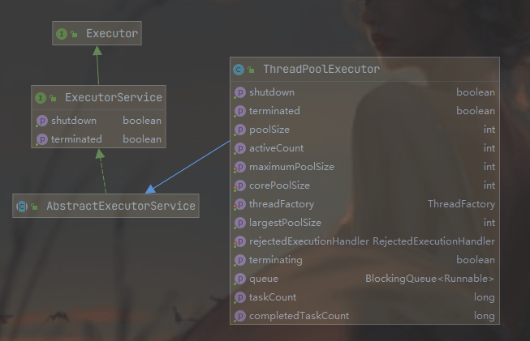


ThreadPoolExecutor 继承 AbstractExecutorService ，**ctl 是一个 Integer 的原子变量，用来记录线程池状态和线程池中线程个数**，类似于 ReentrantReadWriteLock 使用一个变量来保存两种信息。

这里假设Integer类型是32位二进制表示，则其中高3位用来表示线程池状态，后面29位用来记录线程池线程个数。

```java
private final AtomicInteger ctl = new AtomicInteger(ctlOf(RUNNING, 0));
private static final int COUNT_BITS = Integer.SIZE - 3; // 这里就是 32 - 3 = 29
private static final int CAPACITY   = (1 << COUNT_BITS) - 1;

// runState is stored in the high-order bits
// （高3位）1110 0000 0000 0000 0000 0000 0000 0000 
private static final int RUNNING    = -1 << COUNT_BITS;
// （高3位）0000 0000 0000 0000 0000 0000 0000 0000 
private static final int SHUTDOWN   =  0 << COUNT_BITS;
// （高3位）0010 0000 0000 0000 0000 0000 0000 0000 
private static final int STOP       =  1 << COUNT_BITS;
// （高3位）0100 0000 0000 0000 0000 0000 0000 0000 
private static final int TIDYING    =  2 << COUNT_BITS;
// （高3位）0110 0000 0000 0000 0000 0000 0000 0000 
private static final int TERMINATED =  3 << COUNT_BITS;

// Packing and unpacking ctl
private static int runStateOf(int c)     { return c & ~CAPACITY; }
private static int workerCountOf(int c)  { return c & CAPACITY; }
private static int ctlOf(int rs, int wc) { return rs | wc; }
```

其中mainLock是独占锁，用来控制新增Worker线程操作的原子性。termination是该锁对应的条件队列，在线程调用awaitTermination时用来存放阻塞的线程。

```java
private final ReentrantLock mainLock = new ReentrantLock();

/**
 * Set containing all worker threads in pool. Accessed only when
 * holding mainLock.
 */
private final HashSet<Worker> workers = new HashSet<Worker>();

/**
 * Wait condition to support awaitTermination
 */
private final Condition termination = mainLock.newCondition();
```


###### 线程池状态含义：

- **RUNNING**：接受新任务并且处理阻塞队列里的任务。
- **SHUTDOWN**：拒绝新任务但是处理阻塞队列里的任务。
- **STOP**：拒绝新任务并且抛弃阻塞队列里的任务，同时会中断正在处理的任务。
- **TIDYING**：所有任务都执行完（包含阻塞队列里面的任务）后当前线程池活动线程数为0，将要调用terminated方法。
- **TERMINATED**：终止状态。terminated方法调用完成以后的状态。

线程池状态转换：

-  **RUNNING -> SHUTDOWN** ：显式调用shutdown（）方法，或者隐式调用了finalize（）方法里面的shutdown（）方法。
- **RUNNING或SHUTDOWN -> STOP** ：显式调用shutdownNow（）方法时。
- **SHUTDOWN -> TIDYING** ：当线程池和任务队列都为空时。
- **STOP -> TIDYING** ：当线程池为空时。
- **TIDYING -> TERMINATED**：当terminated（）hook方法执行完成时。


线程池的创建，最终都会到这个函数中来：

```java
public ThreadPoolExecutor(int corePoolSize,
                          int maximumPoolSize,
                          long keepAliveTime,
                          TimeUnit unit,
                          BlockingQueue<Runnable> workQueue,
                          ThreadFactory threadFactory,
                          RejectedExecutionHandler handler) {
    if (corePoolSize < 0 ||
        maximumPoolSize <= 0 ||
        maximumPoolSize < corePoolSize ||
        keepAliveTime < 0)
        throw new IllegalArgumentException();
    if (workQueue == null || threadFactory == null || handler == null)
        throw new NullPointerException();
    this.corePoolSize = corePoolSize; // 线程池核心线程个数
    this.maximumPoolSize = maximumPoolSize; // 线程池最大线程数量
    this.workQueue = workQueue; // 用于保存等待执行的任务的阻塞队列
    this.keepAliveTime = unit.toNanos(keepAliveTime); // 存活时间
    this.threadFactory = threadFactory; // 创建线程的工厂
    this.handler = handler; // 拒绝策略
}
```

###### 线程池参数：

- **corePoolSize**：线程池核心线程个数。

- **maximunPoolSize**：线程池最大线程数量（核心线程数+非核心线程数）。

-  **workQueue**：

  用于保存等待执行的任务的阻塞队列，比如基于数组的有界ArrayBlockingQueue、基于链表的无界LinkedBlockingQueue、最多只有一个元素的同步队列SynchronousQueue及优先级队列PriorityBlockingQueue等。

- **keeyAliveTime**：

  存活时间。如果当前线程池中的线程数量比核心线程数量多，并且是闲置状态，则这些闲置的线程能存活的最大时间。

- **ThreadFactory**：创建线程的工厂

- **RejectedExecutionHandler**：

  饱和策略，当队列满并且线程个数达到maximunPoolSize后采取的策略，比如AbortPolicy（抛出异常，默认策略）、CallerRunsPolicy（使用调用者所在线程来运行任务）、DiscardOldestPolicy（调用poll丢弃一个任务，执行当前任务）及DiscardPolicy（默默丢弃，不抛出异常）。

-  **TimeUnit**：存活时间的时间单位。

###### 线程池工作流程 

以`execute()`方法提交任务为例，我们来看线程池的工作流程：

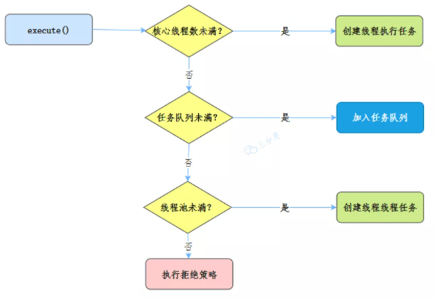

向线程池提交任务的时候：

1. 如果当前运行的线程少于**核心线程数 corePoolSize**，则创建新线程来执行任务。
2. 如果运行的线程等于或者多余**核心线程数 corePoolSize**，则将任务加入 **任务队列workQueue**。
3. 如果**任务队列workQueue**已满，创建新的线程来处理任务 。
4. 如果创建新线程使当前总线程数超过**最大线程数maximumPoolSize**，任务将被拒绝，**线程池拒绝策略handler**执行。

###### **线程池类型**

- **newFixedThreadPool** ：创建一个核心线程个数和最大线程个数都为nThreads的线程池，并且阻塞队列长度为Integer.MAX_VALUE。keeyAliveTime=0说明只要线程个数比核心线程个数多并且当前空闲则回收。
- **newSingleThreadExecutor**：创建一个核心线程个数和最大线程个数都为1的线程池，并且阻塞队列长度为Integer.MAX_VALUE。keeyAliveTime=0说明只要线程个数比核心线程个数多并且当前空闲则回收。
- **newCachedThreadPool** ：创建一个按需创建线程的线程池，初始线程个数为0，最多线程个数为Integer.MAX_VALUE，并且阻塞队列为同步队列。keeyAliveTime=60说明只要当前线程在60s内空闲则回收。这个类型的特殊之处在于，加入同步队列的任务会被马上执行，同步队列里面最多只有一个任务。


##### 3 源码分析  

###### 3.1 execute(Runnable command) 提交线程

execute方法的作用是提交任务command到线程池进行执行。用户线程提交任务到线程池的模型图如图8-2所示。


从该图可以看出，**ThreadPoolExecutor的实现实际是一个生产消费模型，当用户添加任务到线程池时相当于生产者生产元素，workers线程工作集中的线程直接执行任务或者从任务队列里面获取任务时则相当于消费者消费元素**。

```java
public void execute(Runnable command) {
    // (1)如果任务为 null，抛出 NPE 异常
    if (command == null)
        throw new NullPointerException();
    /*
     * Proceed in 3 steps:
     *
     * 1. If fewer than corePoolSize threads are running, try to
     * start a new thread with the given command as its first
     * task.  The call to addWorker atomically checks runState and
     * workerCount, and so prevents false alarms that would add
     * threads when it shouldn't, by returning false.
     *
     * 2. If a task can be successfully queued, then we still need
     * to double-check whether we should have added a thread
     * (because existing ones died since last checking) or that
     * the pool shut down since entry into this method. So we
     * recheck state and if necessary roll back the enqueuing if
     * stopped, or start a new thread if there are none.
     *
     * 3. If we cannot queue task, then we try to add a new
     * thread.  If it fails, we know we are shut down or saturated
     * and so reject the task.
     */
    // （2）获取当前线程池的状态 + 线程个数变量的组合值
    int c = ctl.get();
    // （3）当前线程池中个数是否小于 corePoolSize，小于则开启新线程运行
    if (workerCountOf(c) < corePoolSize) {
        if (addWorker(command, true))
            return;
        c = ctl.get();
    }
    // （4）如果线程池处于 RUNNING 状态，则添加任务到阻塞队列
    if (isRunning(c) && workQueue.offer(command)) {
        // （4.1）二次检查
        int recheck = ctl.get();
        // （4.2）如果当前线程池状态不是 RUNNING，则从队列中删除任务，并执行拒绝策略
        if (! isRunning(recheck) && remove(command))
            reject(command);
        // （4.3）否则如果当前线程池为空，添加一个新线程
        else if (workerCountOf(recheck) == 0)
            addWorker(null, false);
    }
    // （5）如果队列满，则增加新线程，新增失败则执行拒绝策略
    else if (!addWorker(command, false))
        reject(command);
}
```

execute 流程图。[参考](https://mp.weixin.qq.com/s/Exy7pRGND9TCjRd9TZK4jg) 

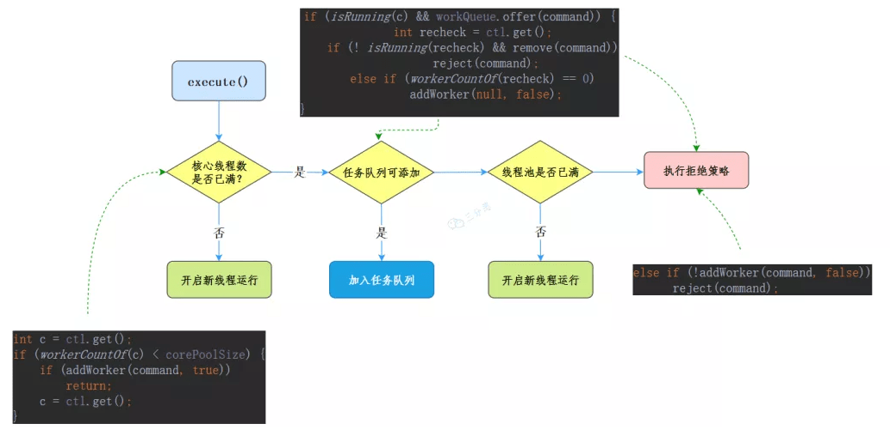


代码（3）判断**如果当前线程池中线程个数小于corePoolSize，会向workers里面新增一个核心线程（core线程）执行该任务**。------------ 1

**如果当前线程池中线程个数大于等于corePoolSize**则执行代码（4）。**如果当前线程池处于RUNNING状态则添加当前任务到任务队列**。这里需要判断线程池状态是因为有可能线程池已经处于非RUNNING状态，而在非RUNNING状态下是要抛弃新任务的。------------ 2

如果向任务队列添加任务成功，则代码（4.2）对线程池状态进行二次校验，这是**因为添加任务到任务队列后**，执行代码（4.2）**前有可能线程池的状态已经变化了**。这里进行二次校验，**如果当前线程池状态不是RUNNING了则把任务从任务队列移除，移除后执行拒绝策略**；如果二次校验通过，则执行代码（4.3）重新**判断当前线程池里面是否还有线程，如果没有则新增一个线程**。 

如果代码（4）添加任务失败，则说明**任务队列已满，那么执行代码（5）尝试新开启线程（如图8-1中的thread3和thread4）来执行该任务**，**如果当前线程池中线程个数>maximumPoolSize则执行拒绝策略**。---------- 3

###### 3.2 新增线程 addWorker 方法

```java
private boolean addWorker(Runnable firstTask, boolean core) {
    retry:
    for (;;) {
        int c = ctl.get();
        int rs = runStateOf(c);

        // （6）检查队列是否只在必要时为空  Check if queue empty only if necessary.
        if (rs >= SHUTDOWN &&
            ! (rs == SHUTDOWN &&
               firstTask == null &&
               ! workQueue.isEmpty()))
            return false;
// （7）循环 CAS 增加线程个数
        for (;;) {
            int wc = workerCountOf(c);
            // （7.1）如果线程个数超限则返回 false
            if (wc >= CAPACITY ||
                wc >= (core ? corePoolSize : maximumPoolSize))
                return false;
            // （7.2）CAS 增加线程个数，同时i只有一个线程成功
            if (compareAndIncrementWorkerCount(c))
                break retry;
            // （7.3）CAS 失败了，则看线程池状态是否变化了，变化则跳出外层循环重新尝试获取线程池状态，否则内层循环重新 CAS 
            c = ctl.get();  // Re-read ctl
            if (runStateOf(c) != rs)
                continue retry;
            // else CAS failed due to workerCount change; retry inner loop
        }
    }
// （8）到这里说明 CAS 成功了
    boolean workerStarted = false;
    boolean workerAdded = false;
    Worker w = null;
    try {
        // （8.1）创建 Worker
        w = new Worker(firstTask);
        final Thread t = w.thread;
        if (t != null) {
            // （8.2）加独占锁，为了实现 workers 同步，因为可能多个线程调用了线程池的 execute 方法
            final ReentrantLock mainLock = this.mainLock;
            mainLock.lock();
            try {
                // Recheck while holding lock.
                // Back out on ThreadFactory failure or if
                // shut down before lock acquired.
                // （8.3）重新检查线程池状态，以避免在换取锁前调用了 shutdown 接口
                int rs = runStateOf(ctl.get());

                if (rs < SHUTDOWN ||
                    (rs == SHUTDOWN && firstTask == null)) {
                    if (t.isAlive()) // precheck that t is startable
                        throw new IllegalThreadStateException();
                    // （8.4）添加任务
                    workers.add(w);
                    int s = workers.size();
                    if (s > largestPoolSize)
                        largestPoolSize = s;
                    workerAdded = true;
                }
            } finally {
                mainLock.unlock();
            }
            // （8.5）添加成功后则启动任务
            if (workerAdded) {
                t.start();
                workerStarted = true;
            }
        }
    } finally {
        if (! workerStarted)
            addWorkerFailed(w);
    }
    return workerStarted;
}
```

代码主要分两个部分：

第一部分双重循环的目的是通过CAS操作增加线程数；第二部分主要是把并发安全的任务添加到workers里面，并且启动任务执行。

**第一部分**

```java
if (rs >= SHUTDOWN &&
            ! (rs == SHUTDOWN &&
               firstTask == null &&
               ! workQueue.isEmpty()))
等价于
if (rs >= SHUTDOWN &&
            (rs != SHUTDOWN &&
               firstTask != null &&
               workQueue.isEmpty()))
```

代码（6）在下面几种情况下会返回 false：

- 当前线程池状态为STOP、TIDYING或TERMINATED 。
- 当前线程池状态为SHUTDOWN并且已经有了第一个任务。
- 当前线程池状态为SHUTDOWN并且任务队列为空。

内层循环的作用是使用CAS操作增加线程数，代码（7.1）判断如果线程个数超限则返回false，否则执行代码（7.2）CAS操作设置线程个数，CAS成功则退出双循环，CAS失败则执行代码（7.3）看当前线程池的状态是否变化了，如果变了，则再次进入外层循环重新获取线程池状态，否则进入内层循环继续进行CAS尝试。

###### 3.3 工作线程 Worker 的执行

首先看下 Worker 的构造函数：继承了 AQS，实现了 Runnable 接口

```java
private final class Worker
    extends AbstractQueuedSynchronizer
    implements Runnable
{
        /**
         * This class will never be serialized, but we provide a
         * serialVersionUID to suppress a javac warning.
         */
        private static final long serialVersionUID = 6138294804551838833L;

        /** Thread this worker is running in.  Null if factory fails. */
        final Thread thread;
        /** Initial task to run.  Possibly null. */
        Runnable firstTask;
        /** Per-thread task counter */
        volatile long completedTasks;

        /**
         * Creates with given first task and thread from ThreadFactory.
         * @param firstTask the first task (null if none)
         */
        Worker(Runnable firstTask) {
            setState(-1); // inhibit interrupts until runWorker
            this.firstTask = firstTask;
            this.thread = getThreadFactory().newThread(this);
        }
      ...
}
```

- state=0表示锁未被获取状态，state=1表示锁已经被获取的状态，state=-1是创建Worker时默认的状态。

  在构造函数内首先设置Worker的状态为 -1，这是为了**避免当前Worker在调用runWorker方法前被中断**（当其他线程调用了线程池的shutdownNow时，如果Worker状态>=0则会中断该线程）。这里设置了线程的状态为-1，所以该线程就不会被中断了。在如下runWorker代码中，运行**代码（9）**时会调用unlock方法，该方法把status设置为了0，所以这时候调用shutdownNow会中断Worker线程。

- firstTask记录该工作线程的第一个任务

- thread是具体执行任务的线程

run 方法直接调用的是 runWorker，真正执行的线程就在 runWorker 方法里：

```java
final void runWorker(Worker w) {
    Thread wt = Thread.currentThread();
    Runnable task = w.firstTask;
    w.firstTask = null;
    w.unlock(); // allow interrupts  （9）
    boolean completedAbruptly = true;
    try {
        // （10）执行当前传入的 firstTask 或者通过 getTask() 获取到的任务
        while (task != null || (task = getTask()) != null) {
            // （10.1）是为了避免在任务运行期间，其他线程调用了shutdown后正在执行的任务被中断（shutdown只会中断当前被阻塞挂起的线程）
            w.lock();
            // If pool is stopping, ensure thread is interrupted;
            // if not, ensure thread is not interrupted.  This
            // requires a recheck in second case to deal with
            // shutdownNow race while clearing interrupt
            if ((runStateAtLeast(ctl.get(), STOP) ||
                 (Thread.interrupted() &&
                  runStateAtLeast(ctl.get(), STOP))) &&
                !wt.isInterrupted())
                wt.interrupt();
            try {
                // （10.2）执行任务前干的一些事情
                beforeExecute(wt, task);
                Throwable thrown = null;
                try {
                    task.run();// （10.3）执行任务
                } catch (RuntimeException x) {
                    thrown = x; throw x;
                } catch (Error x) {
                    thrown = x; throw x;
                } catch (Throwable x) {
                    thrown = x; throw new Error(x);
                } finally {
                    // （10.4）执行任务完毕后干的一些事情
                    afterExecute(task, thrown);
                }
            } finally {
                task = null;
                // （10.5）统计当前 Worker 完成了多少个任务
                w.completedTasks++;
                w.unlock();
            }
        }
        completedAbruptly = false;
    } finally {
        // （11）执行清理工作
        processWorkerExit(w, completedAbruptly);
    }
}
```

###### 3.4 shutdown 操作 

调用shutdown方法后，**线程池就不会再接受新的任务了，但是工作队列里面的任务还是要执行的**。该方法会立刻返回，并不等待队列任务完成再返回。

```java
public void shutdown() {
    final ReentrantLock mainLock = this.mainLock;
    mainLock.lock();
    try {
        checkShutdownAccess(); // 权限检查
        advanceRunState(SHUTDOWN); // 设置线程池状态为 SHUTDOWN
        interruptIdleWorkers();// 设置中断标志
        onShutdown(); // hook for ScheduledThreadPoolExecutor 
    } finally {
        mainLock.unlock();
    }
    tryTerminate();
}
```

###### 3.5 shutdownNow 操作 

调用shutdownNow方法后，**线程池就不会再接受新的任务了，并且会丢弃工作队列里面的任务，正在执行的任务会被中断，该方法会立刻返回，并不等待激活的任务执行完成**。**返回值为这时候队列里面被丢弃的任务列表**。

```java
public List<Runnable> shutdownNow() {
    List<Runnable> tasks;
    final ReentrantLock mainLock = this.mainLock;
    mainLock.lock();
    try {
        checkShutdownAccess(); // 权限检查
        advanceRunState(STOP); // 设置线程池状态为 STOP
        interruptWorkers(); // 中断所有线程
        tasks = drainQueue(); // 将队列任务移动到 task 中
    } finally {
        mainLock.unlock();
    }
    tryTerminate();
    return tasks;
}
```


