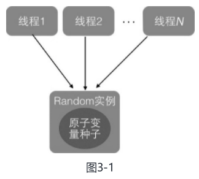
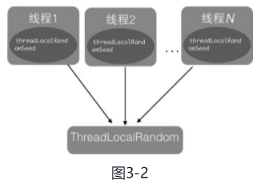

### 3 ThreadLocalRandom 类解析  

#### 3.1 Random 类及其局限性 

在JDK 7 之前包括现在，java.util.Random都是使用比较广泛的随机数生成工具类，而且java.lang.Math中的随机数生成也使用的是javFa.util.Random的实例。

```java
public class RandomTest {
    public static void main(String[] args) {
        // （1）创建一个默认种子的随机数生成器
        Random random = new Random();
        // （2）输出 10 个在0-5（包含0，不包含5）之间的随机数
        for (int i = 0; i < 10; i++) {
            System.out.println(random.nextInt(5));
        }
    }
}
// 有了默认的种子后，如何生成随机数呢，查看 nextInt() 代码
public int nextInt(int bound) {
        if (bound <= 0) // （3）参数检查
            throw new IllegalArgumentException(BadBound);

        int r = next(31); // （4）根据老的种子生成新的种子
        int m = bound - 1;// （5）根据新的种子计算随机数
        if ((bound & m) == 0)  // i.e., bound is a power of 2
            r = (int)((bound * (long)r) >> 31);
        else {
            for (int u = r;
                 u - (r = u % bound) + m < 0;
                 u = next(31))
                ;
        }
        return r;
    }
```

由此可见，新的随机数的生成需要两个步骤：

- 首先根据老的种子生成新的种子。
- 然后根据新的种子来计算新的随机数。

其中步骤（4）我们可以抽象为seed=f（seed），其中f是一个固定的函数，；步骤（5）也可以抽象为g（seed,bound），其中g是一个固定的函数。**在单线程情况下每次调用nextInt都是根据老的种子计算出新的种子，这是可以保证随机数产生的随机性的**。但是**在多线程下多个线程可能都拿同一个老的种子去执行步骤（4）以计算新的种子，这会导致多个线程产生的新种子是一样的，由于步骤（5）的算法是固定的，所以会导致多个线程产生相同的随机值**，这并不是我们想要的。

所以步骤（4）要保证原子性，也就是说当多个线程根据同一个老种子计算新种子时，**第一个线程的新种子被计算出来后，第二个线程要丢弃自己老的种子，而使用第一个线程的新种子来计算自己的新种子**，依此类推，只有保证了这个，才能保证在多线程下产生的随机数是随机的。Random函数使用一个原子变量达到了这个效果，在创建Random对象时初始化的种子就被保存到了种子原子变量里面，下面看next（）的代码。

```java
protected int next(int bits) {
        long oldseed, nextseed;
        AtomicLong seed = this.seed;
        do {
            oldseed = seed.get();// (6) 获取当前原子变量种子的值
            nextseed = (oldseed * multiplier + addend) & mask; // (7) 根据当前种子值计算新的种子
        } while (!seed.compareAndSet(oldseed, nextseed)); // (8)使用 CAS 操作，使用新的种子去更新老的种子。
        return (int)(nextseed >>> (48 - bits)); // (9)
    }
```

在多线程下可能多个线程都同时执行到了代码（6），那么可能多个线程拿到的当前种子的值是同一个，然后执行步骤（7）计算的新种子也都是一样的，但是步骤（8）的CAS操作会保证只有一个线程可以更新老的种子为新的，失败的线程会通过循环重新获取更新后的种子作为当前种子去计算老的种子，这就解决了上面提到的问题，保证了随机数的随机性。代码（9）使用固定算法根据新的种子计算随机数。

**总结**：每个Random实例里面都有一个原子性的种子变量用来记录当前的种子值，当要生成新的随机数时需要根据当前种子计算新的种子并更新回原子变量。在多线程下使用单个Random实例生成随机数时，当多个线程同时计算随机数来计算新的种子时，多个线程会竞争同一个原子变量的更新操作，**由于原子变量的更新是CAS操作，同时只有一个线程会成功，所以会造成大量线程进行自旋重试，这会降低并发性能**，所以ThreadLocalRandom应运而生。 

#### 3.2、ThreadLocalRandom  

为了弥补多线程高并发情况下Random的缺陷，在JUC包下新增了ThreadLocalRandom类。使用：

```java
public class ThreadLocalRandomTest {
    public static void main(String[] args) {
        // （10）创建一个默认种子的随机数生成器
        ThreadLocalRandom random = ThreadLocalRandom.current();
        // （11）输出 10 个在0-5（包含0，不包含5）之间的随机数
        for (int i = 0; i < 10; i++) {
            System.out.println(random.nextInt(5));
        }
    }
}
```

其中，代码（10）调用ThreadLocalRandom.current（）来获取当前线程的随机数生成器。下面来分析下ThreadLocalRandom的实现原理。从名字上看它会让我们联想到在基础篇中讲解的ThreadLocal:ThreadLocal通过让每一个线程复制一份变量，使得在每个线程对变量进行操作时实际是操作自己本地内存里面的副本，从而避免了对共享变量进行同步。实际上ThreadLocalRandom的实现也是这个原理，Random的缺点是多个线程会使用同一个原子性种子变量，从而导致对原子变量更新的竞争，如图3-1所示



那么，如果**每个线程都维护一个种子变量，则每个线程生成随机数时都根据自己老的种子计算新的种子，并使用新种子更新老的种子，再根据新种子计算随机数，就不会存在竞争问题了**，这会大大提高并发性能。ThreadLocalRandom原理如图3-2所示.。 



#### 3.3、源码分析  

ThreadLocalRandom类继承了Random类并重写了nextInt方法，在ThreadLocalRandom类中并没有使用继承自Random类的原子性种子变量。在ThreadLocalRandom中并没有存放具体的种子，具体的种子存放在具体的调用线程的threadLocalRandomSeed变量里面。ThreadLocalRandom类似于ThreadLocal类，就是个工具类。当线程调用ThreadLocalRandom的current方法时，ThreadLocalRandom负责初始化调用线程的threadLocalRandomSeed变量，也就是初始化种子。  

当调用ThreadLocalRandom的nextInt方法时，实际上是获取当前线程的threadLocalRandomSeed变量作为当前种子来计算新的种子，然后更新新的种子到当前线程的threadLocalRandomSeed变量，而后再根据新种子并使用具体算法计算随机数。这里需要注意的是，threadLocalRandomSeed变量就是Thread类里面的一个普通long变量，它并不是原子性变量。其实道理很简单，因为这个变量是线程级别的，所以根本不需要使用原子性变量。

另外，变量instance是ThreadLocalRandom的一个实例，该变量是static的。当多线程通过ThreadLocalRandom的current方法获取ThreadLocalRandom的实例时，其实获取的是同一个实例。但是由于具体的种子是存放在线程里面的，所以在ThreadLocalRandom的实例里面只包含与线程无关的通用算法，所以它是线程安全的。

1. Unsafe机制

```java
// Unsafe mechanics
    private static final sun.misc.Unsafe UNSAFE;
    private static final long SEED;
    private static final long PROBE;
    private static final long SECONDARY;
    static {
        try {
            // 获取 unsafe 实例
            UNSAFE = sun.misc.Unsafe.getUnsafe();
            Class<?> tk = Thread.class;
            // 获取 Thread 类里面threadLocalRandomSeed变量在 Thread 实例里面的偏移量
            SEED = UNSAFE.objectFieldOffset
                (tk.getDeclaredField("threadLocalRandomSeed"));
             // 获取 Thread 类里面threadLocalRandomProbe变量在 Thread 实例里面的偏移量
            PROBE = UNSAFE.objectFieldOffset
                (tk.getDeclaredField("threadLocalRandomProbe"));
             // 获取 Thread 类里面threadLocalRandomSecondarySeed变量在 Thread 实例里面的偏移量
            SECONDARY = UNSAFE.objectFieldOffset
                (tk.getDeclaredField("threadLocalRandomSecondarySeed"));
        } catch (Exception e) {
            throw new Error(e);
        }
    }
```