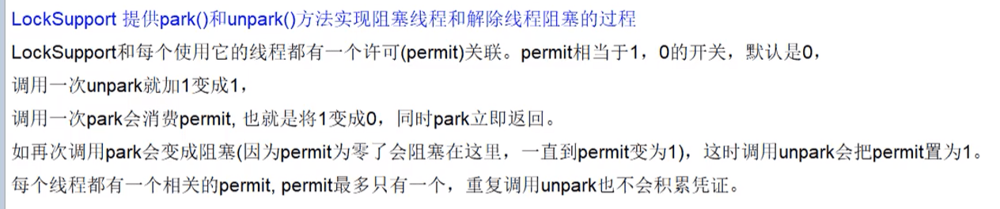
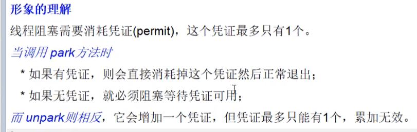

#### 1、LockSupport 工具类 

JDK中的rt.jar包里面的LockSupport是个工具类，**它的主要作用是挂起和唤醒线程，该工具类是创建锁和其他同步类的基础**。

**用于创建锁和其他同步类的基本线程阻塞原语**

**LockSupport类与每个使用它的线程都会关联一个许可证**，在默认情况下**调用**LockSupport类的方法**的线程**是**不持有许可证的**。LockSupport是使用Unsafe类实现的，介绍几个主要函数。  

##### wait 和 notify的缺陷

Object 类中的wait、notify、notifyAll用于线程等待和唤醒的方法需要在synchronized内部执行，没有获取到锁的话，会报异常。还要先wait先调用，notify后调用，否则wait会一直阻塞。

##### Condition中await和signal的缺陷

必须要和lock.lock()、lock.unlock()结合使用，否则直接使用也会报异常。先调用signal，再调用await，也会出现后面await后面的代码无法运行的情况。

**LockSupport优点：不需要使用synchronized和lock**。





##### （1）void park()

**如果调用park方法的线程已经拿到了与LockSupport关联的许可证**，则调用LockSupport.park（）时**会马上返回**，**否则调用线程会被禁止参与线程的调度，也就是会被阻塞挂起**。

```java
public static void main(String[] args) {
    System.out.println("begin park1");
    LockSupport.park();
    System.out.println("end park!");
}
```

如上面代码直接在main函数里面调用park方法，最终只会输出begin park!，然后当前线程被挂起，这是因为在默认情况下调用线程是不持有许可证的。

**在其他线程调用unpark（Thread thread）方法并且将当前线程作为参数时，调用park方法而被阻塞的线程会返回**。另外，**如果其他线程调用了阻塞线程的interrupt()方法，设置了中断标志或者线程被虚假唤醒，则阻塞线程也会返回**。**所以在调用park方法时最好也使用循环条件判断方式**。

需要注意的是，因调用park()方法而被阻塞的线程被其他线程中断而返回时并不会抛出InterruptedException异常。 

park函数，**阻塞线程，并且在该线程在下列情况发生之前都会被阻塞**：

1. 调用 unpark 函数，释放线程的许可。
2. 该线程被中断。
3. 设置的时间到了，并且time为绝对时间时，isAbsolute为true，否则，isAbsolute为false。当time为0时，表示无限等待，直到unpark发生。

##### （2）void unpark(Thread thread) 方法 

**当一个线程调用unpark时，如果参数thread线程没有持有thread与LockSupport类关联的许可证，则让thread线程持有**。如果thread之前因调用park（）而被挂起，则调用unpark后，该线程会被唤醒。如果thread之前没有调用park，则调用unpark方法后，再调用park方法，其会立刻返回。 

> 使线程持有，thread与LockSupport类关联的许可证

```java
public static void main(String[] args) {
    System.out.println("begin park!");
    // 使当前线程获取到许可证
    LockSupport.unpark(Thread.currentThread());
    // 再次调用 park 方法，这里是类似于没有执行一样，形同虚设，不用这一行也是一样的
    LockSupport.park();
    System.out.println("end park!");
}
输出
begin park1
end park!
```

再看一个例子

```java
public static void main(String[] args) throws InterruptedException {
    Thread thread = new Thread(() -> {
        System.out.println("child thread begin park!");
        // 子线程在默认情况下没有持有许可证，调用 park 会挂起自己。
        LockSupport.park();
        System.out.println("child thread unpark!");
    });
    // 启动子线程
    thread.start();
    // 主线程休眠 1s
    Thread.sleep(1000);
    System.out.println("main thread begin unpark!");
    // 调用 unpark 方法，让thread线程持有许可证，然后park方法返回
    LockSupport.unpark(thread);
}
输出
child thread begin park!
main thread begin unpark!
child thread unpark!
```

主线程休眠1s是为了让主线程调用unpark方法前让子线程输出child threadbegin park！并阻塞。

主线程然后执行unpark方法，参数为子线程，这样做的目的是让子线程持有许可证，然后子线程调用的park方法就返回了。

park方法返回时不会告诉你因何种原因返回，所以调用者需要根据之前调用park方法的原因，再次检查条件是否满足，如果不满足则还需要再次调用park方法。

```java
public static void main(String[] args) throws InterruptedException {
    Thread thread = new Thread(() -> {
        System.out.println("child thread begin park!");
        // 子线程在默认情况下没有持有许可证，调用 park 会挂起自己。
        while (!Thread.currentThread().isInterrupted()) {
                LockSupport.park();
            }
        System.out.println("child thread unpark!");
    });
    // 启动子线程
    thread.start();
    // 主线程休眠 1s
    Thread.sleep(1000);
    System.out.println("main thread begin unpark!");
    // 中断子线程
    thread.interrupt();
}
输出
child thread begin park!
main thread begin unpark!
child thread unpark!
```

在如上代码中，只有中断子线程，子线程才会运行结束，如果子线程不被中断，即使你调用unpark（thread）方法子线程也不会结束。

##### （3）void parkNanos(long nanos)方法

和park方法类似，如果调用park方法的线程已经拿到了与LockSupport关联的许可证，则调用LockSupport.parkNanos（long nanos）方法后会马上返回。**该方法的不同在于，如果没有拿到许可证，则调用线程会被挂起nanos时间后修改为自动返回**。

另外park方法还支持带有blocker参数的方法void park（Object blocker）方法，当线程在没有持有许可证的情况下调用park方法而被阻塞挂起时，这个blocker对象会被记录到该线程内部。

使用诊断工具可以观察线程被阻塞的原因，诊断工具是通过调用getBlocker（Thread）方法来获取blocker对象的，所以JDK推荐我们使用带有blocker参数的park方法，并且blocker被设置为this，这样当在打印线程堆栈排查问题时就能知道是哪个类被阻塞了。

可以使用 `jstack pid` 命令查看线程堆栈时，可以看到结果。  

##### （4）park(Object blocker) 方法 

```java
public static void park(Object blocker) {
    Thread t = Thread.currentThread();
    setBlocker(t, blocker);
    UNSAFE.park(false, 0L);
    setBlocker(t, null);
}
private static void setBlocker(Thread t, Object arg) {
    // Even though volatile, hotspot doesn't need a write barrier here.
    UNSAFE.putObject(t, parkBlockerOffset, arg);
}
// 说明：此方法用于设置线程t的parkBlocker字段的值为arg。
```

Thread类里面有个变量**volatile Object parkBlocker**，用来存放park方法传递的blocker对象，也就是把blocker变量存放到了调用park方法的线程的成员变量里面。

调用park函数时，首先获取当前线程，然后设置当前线程的parkBlocker字段，即调用setBlocker函数，之后调用Unsafe类的park函数，之后再调用setBlocker函数。**那么问题来了，为什么要在此park函数中要调用两次setBlocker函数呢**？

原因其实很简单，调用park函数时，当前线程首先设置好parkBlocker字段，然后再调用Unsafe的park函数，此后，当前线程就已经阻塞了，等待该线程的unpark函数被调用，所以后面的一个setBlocker函数无法运行，unpark函数被调用，该线程获得许可后，就可以继续运行了，也就运行第二个setBlocker，把该线程的parkBlocker字段设置为null，这样就完成了整个park函数的逻辑。如果没有第二个setBlocker，那么之后没有调用park(Object blocker)，而直接调用getBlocker函数，得到的还是前一个park(Object blocker)设置的blocker，显然是不符合逻辑的。总之，必须要保证在park(Object blocker)整个函数执行完后，该线程的parkBlocker字段又恢复为null。所以，park(Object)型函数里必须要调用setBlocker函数两次。

##### （5）void parkNanos(Object blocker, long nanos)方法 

相比park（Object blocker）方法多了个超时时间。 和上面的 parkNanos（long nanos）方法类似。

##### （6）void parkUntil(Object blocker, long deadline)方法

```java
public static void parkUntil(Object blocker, long deadline) {
    Thread t = Thread.currentThread();
    setBlocker(t, blocker);
    UNSAFE.park(true, deadline);
    setBlocker(t, null);
}
```

其中参数deadline的时间单位为ms，该时间是从1970年到现在某一个时间点的毫秒值。这个方法和parkNanos（Object blocker, long nanos）方法的区别是，**后者是从当前算等待nanos秒时间**，**而前者是指定一个时间点**，比如需要等到2017.12.11日12:00:00，则把这个时间点转换为从1970年到这个时间点的总毫秒数。

#### 示例说明

##### 实现两线程同步

###### 使用 wait/notify 实现

```java
package com.hust.grid.leesf.locksupport;

class MyThread extends Thread {
    
    public void run() {
        // 这里的 this 和 下面的 synchronized(myThread)是相同的
        synchronized (this) {
            System.out.println("before notify");            
            notify();
            System.out.println("after notify");    
        }
    }
}

public class WaitAndNotifyDemo {
    public static void main(String[] args) throws InterruptedException {
        MyThread myThread = new MyThread();            
        synchronized (myThread) {
            try {        
                myThread.start();
                // 主线程睡眠3s
                Thread.sleep(3000);
                System.out.println("before wait");
                // 阻塞主线程
                myThread.wait();
                System.out.println("after wait");
            } catch (InterruptedException e) {
                e.printStackTrace();
            }            
        }        
    }
}
```

输出：

```java
before wait
before notify
after notify
after wait
```

###### 使用park和unpark实现

```java
package com.hust.grid.leesf.entry;

import java.util.concurrent.locks.LockSupport;

class MyThread extends Thread {
    private Object object;

    public MyThread(Object object) {
        this.object = object;
    }

    public void run() {
        System.out.println("before unpark");
        try {
            Thread.sleep(1000);
        } catch (InterruptedException e) {
            e.printStackTrace();
        }
        // 获取blocker
        System.out.println("Blocker info " + LockSupport.getBlocker((Thread) object));
        // 释放许可
        LockSupport.unpark((Thread) object);
        // 休眠500ms，保证先执行park中的setBlocker(t, null);
        try {
            Thread.sleep(500);
        } catch (InterruptedException e) {
            e.printStackTrace();
        }
        // 再次获取blocker
        System.out.println("Blocker info " + LockSupport.getBlocker((Thread) object));

        System.out.println("after unpark");
    }
}

public class test {
    public static void main(String[] args) {
        MyThread myThread = new MyThread(Thread.currentThread());
        myThread.start();
        System.out.println("before park");
        // 获取许可
        LockSupport.park("ParkAndUnparkDemo");
        System.out.println("after park");
    }
}
```

输出：

```java
before park
before unpark
Blocker info ParkAndUnparkDemo
after park
Blocker info null
after unpark
```

说明：说明：本程序先执行park，然后在执行unpark，进行同步，并且在unpark的前后都调用了getBlocker，可以看到两次的结果不一样，并且第二次调用的结果为null，这是因为在调用unpark之后，执行了Lock.park(Object blocker)函数中的setBlocker(t, null)函数，所以第二次调用getBlocker时为null。

上例是先调用park，然后调用unpark，现在修改程序，先调用unpark，然后调用park，看能不能正确同步。具体代码如下:

```java
public class ParkAndUnParkDemo2 {
    static class MyThread extends Thread {
        private Object object;

        public MyThread(Object object) {
            this.object = object;
        }

        public void run() {
            System.out.println("before unpark");
            // 释放许可
            LockSupport.unpark((Thread) object);
            System.out.println("after unpark");
        }
    }

    public static void main(String[] args) {
        MyThread myThread = new MyThread(Thread.currentThread());
        myThread.start();
        try {
            // 主线程睡眠3s
            Thread.sleep(3000);
        } catch (InterruptedException e) {
            e.printStackTrace();
        }
        System.out.println("before park");
        // 获取许可
        LockSupport.park("ParkAndUnparkDemo");
        System.out.println("after park");
    }
}
```

输出：

```java
before unpark
after unpark
before park
after park
```

上面方法：void unpark(Thread thread) 有解释运行结果。