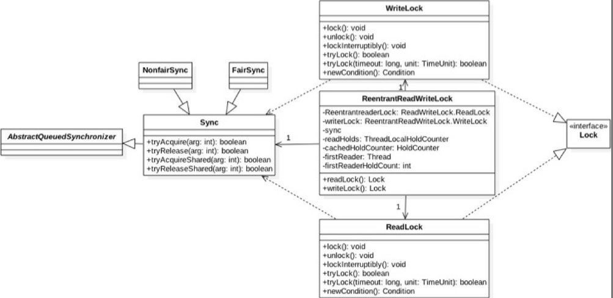
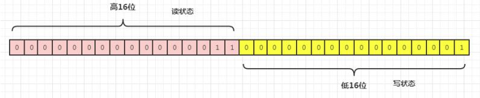
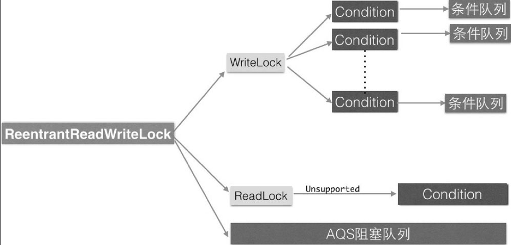

### 4、读写锁 ReentrantReadWriteLock 的原理  

具体的一些内容可以参考，如何计算高16位和低16位： https://blog.csdn.net/qq_26542493/article/details/104930610

解决线程安全问题使用ReentrantLock就可以，但是ReentrantLock是独占锁，某时只有一个线程可以获取该锁，而**实际中会有写少读多的场景**，显然ReentrantLock满足不了这个需求，所以ReentrantReadWriteLock应运而生。**ReentrantReadWriteLock采用读写分离的策略，允许多个线程可以同时获取读锁**。



```java
public class ReentrantReadWriteLock
        implements ReadWriteLock, java.io.Serializable {
    private static final long serialVersionUID = -6992448646407690164L;
    /** Inner class providing readlock */
    private final ReentrantReadWriteLock.ReadLock readerLock;
    /** Inner class providing writelock */
    private final ReentrantReadWriteLock.WriteLock writerLock;
    /** Performs all synchronization mechanics */
    final Sync sync;

    /**
     * Creates a new {@code ReentrantReadWriteLock} with
     * default (nonfair) ordering properties.
     */
    public ReentrantReadWriteLock() {
        this(false);
    }
    public ReentrantReadWriteLock(boolean fair) {
        sync = fair ? new FairSync() : new NonfairSync();
        readerLock = new ReadLock(this);
        writerLock = new WriteLock(this);
    }

    public ReentrantReadWriteLock.WriteLock writeLock() { return writerLock; }
    public ReentrantReadWriteLock.ReadLock  readLock()  { return readerLock; }
    ...
}
```

读写锁的内部维护了一个ReadLock和一个WriteLock，它们依赖Sync实现具体功能。而Sync继承自AQS，并且也提供了公平和非公平的实现。下面只介绍**非公平的读写锁实现**。我们知道AQS中只维护了一个state状态，而**ReentrantReadWriteLock则需要维护读状态和写状态，一个state怎么表示写和读两种状态呢？ReentrantReadWriteLock巧妙地使用state的高16位表示读状态，也就是获取到读锁的次数；使用低16位表示获取到写锁的线程的可重入次数**。

```java
static final int SHARED_SHIFT   = 16;
// 共享锁（读锁）状态单位值 65536
static final int SHARED_UNIT    = (1 << SHARED_SHIFT);
// 共享锁线程最大个数 65536
static final int MAX_COUNT      = (1 << SHARED_SHIFT) - 1;
// 排它锁（写锁）掩码，二进制，15个1
static final int EXCLUSIVE_MASK = (1 << SHARED_SHIFT) - 1;
/** Returns the number of shared holds represented in count  */
// 返回读线程数，右移16位
static int sharedCount(int c)    { return c >>> SHARED_SHIFT; }
/** Returns the number of exclusive holds represented in count  */
// 返回写锁可重入数
static int exclusiveCount(int c) { return c & EXCLUSIVE_MASK; }

```



读锁的个数计算：**直接无符号位右移16位**，上图是3个。写锁的个数（独占锁）计算：(1<<16)-1

```java
// 1的二进制
0000 0000 0000 0000 0000 0000 0000 0001      
// 1左移 16位
0000 0000 0000 0001 0000 0000 0000 0000
//再减 1
0000 0000 0000 0000 1111 1111 1111 1111
//任何一个 32位二进制数 c，和以上值做 “与” 运算都为它本身 c 的低 16 位值
//这个不用解释了吧，这个不会的话，需要好好补充一下基础知识了。。。
```

其中，**firstReader**用来记录第一个获取到读锁的线程，**firstReaderHoldCount**则记录第一个获取到读锁的线程获取读锁的可重入次数。**cachedHoldCounter**用来记录最后一个获取读锁的线程获取读锁的可重入次数。

```java
private transient Thread firstReader = null;
private transient int firstReaderHoldCount; 

private transient HoldCounter cachedHoldCounter;
static final class HoldCounter {
    int count = 0;
    // Use id, not reference, to avoid garbage retention
    final long tid = getThreadId(Thread.currentThread());
}
```

**readHolds**是**ThreadLocal**变量，用来存放除去第一个获取读锁线程外的其他线程获取读锁的可重入次数。ThreadLocalHoldCounter继承了ThreadLocal，因而initialValue方法返回一个HoldCounter对象。 

```java
private transient ThreadLocalHoldCounter readHolds;
static final class ThreadLocalHoldCounterextends ThreadLocal<HoldCounter> {
    public HoldCounter initialValue() {
        return new HoldCounter();
    }
}
```

#### （1）写锁的获取与释放---（非公平锁的解析）

在ReentrantReadWriteLock中写锁使用**WriteLock**来实现。

> 写锁的状态表示为AQS的**state变量的低16位**，**当state低16位为0，表示当前写锁没有被占有，反之表示写锁被某个写线程占有(state = 1)或重入(state > 1)**。

- **void lock()**

**写锁是个独占锁，某时只有一个线程可以获取该锁**。**如果当前没有线程获取到读锁和写锁，则当前线程可以获取到写锁然后返回**。**如果当前已经有线程获取到读锁和写锁，则当前请求写锁的线程会被阻塞挂起**。另外，**写锁是可重入锁，如果当前线程已经获取了该锁，再次获取只是简单地把可重入次数加1后直接返回**。

```java
public void lock() {
    sync.acquire(1);
}
public final void acquire(int arg) {
    // sync 重写的 tryAcquire 方法
    if (!tryAcquire(arg) &&
        acquireQueued(addWaiter(Node.EXCLUSIVE), arg))
        selfInterrupt();
}
```

调用 tryAcquire(arg) 方法，实际上是 ReentrantReadWriteLock 内部的 sync 类重写的。

```java
protected final boolean tryAcquire(int acquires) {
    /*
     * Walkthrough:
     * 1. If read count nonzero or write count nonzero
     *    and owner is a different thread, fail.
     * 2. If count would saturate, fail. (This can only
     *    happen if count is already nonzero.)
     * 3. Otherwise, this thread is eligible for lock if
     *    it is either a reentrant acquire or
     *    queue policy allows it. If so, update state
     *    and set owner.
     */
    Thread current = Thread.currentThread();
    int c = getState();
    int w = exclusiveCount(c);
    // （1） c != 0 说明读锁或写锁已经被某线程获取了
    if (c != 0) {
        // (Note: if c != 0 and w == 0 then shared count != 0)
        // （2）w = 0 说明已经有线程获取了读锁， w !=0 并且当前线程不是写锁拥有者。
        if (w == 0 || current != getExclusiveOwnerThread())
            return false;
        // （3）说明当前线程获取了写锁，判断可重入次数
        if (w + exclusiveCount(acquires) > MAX_COUNT)
            throw new Error("Maximum lock count exceeded");
        // Reentrant acquire （4）设置可重入次数
        setState(c + acquires);
        return true;
    }
    // （5）第一个写线程获取写锁
    if (writerShouldBlock() ||
        !compareAndSetState(c, c + acquires))
        return false;
    setExclusiveOwnerThread(current);
    return true;
}
```

在代码（1）中，如果当前AQS状态值不为0则说明当前已经有线程获取到了读锁或者写锁。在代码（2）中，如果w==0 说明状态值的低16位为0，而AQS状态值不为0，则说明高16位不为0，这暗示已经有线程获取了读锁，所以直接返回false。

而如果 w!=0 则说明当前已经有线程获取了该写锁，再看当前线程是不是该锁的持有者，如果不是则返回false。

执行到代码（3）说明当前线程之前已经获取到了该锁，所以判断该线程的可重入次数是不是超过了最大值，是则抛出异常，否则执行代码（4）增加当前线程的可重入次数，然后返回true。 

如果AQS的状态值等于0则说明目前没有线程获取到读锁和写锁，所以执行代码（5）。其中，对于writerShouldBlock方法，**非公平锁的实现为**

```java
final boolean writerShouldBlock() {
    return false; // writers can always barge
}
```

如果代码对于非公平锁来说总是返回false，则说明代码（5）抢占式执行CAS尝试获取写锁，获取成功则设置当前锁的持有者为当前线程并返回true，否则返回false。

公平锁的实现为。

```java
final boolean writerShouldBlock() {
    return hasQueuedPredecessors();
}
```

这里还是使用hasQueuedPredecessors来判断当前线程节点是否有前驱节点，如果有则当前线程放弃获取写锁的权限，直接返回false。 

- **void lockInterruptibly()** 

类似于lock（）方法，它的不同之处在于，它会对中断进行响应，也就是当其他线程调用了该线程的interrupt（）方法中断了当前线程时，当前线程会抛出异常InterruptedException异常。

- **boolean tryLock()**

尝试获取写锁，如果当前没有其他线程持有写锁或者读锁，则当前线程获取写锁会成功，然后返回true。如果当前已经有其他线程持有写锁或者读锁则该方法直接返回false，且当前线程并不会被阻塞。如果当前线程已经持有了该写锁则简单增加AQS的状态值后直接返回true。

- **boolean tryLock(long timeout, TimeUnit unit)**

与tryLock（）的不同之处在于，多了超时时间参数，如果尝试获取写锁失败则会把当前线程挂起指定时间，待超时时间到后当前线程被激活，如果还是没有获取到写锁则返回false。另外，该方法会对中断进行响应，也就是当其他线程调用了该线程的interrupt（）方法中断了当前线程时，当前线程会抛出InterruptedException异常。 

- **void unlock()**

尝试释放锁，如果当前线程持有该锁，调用该方法会让该线程对该线程持有的AQS状态值减1，如果减去1后当前状态值为0则当前线程会释放该锁，否则仅仅减1而已。如果当前线程没有持有该锁而调用了该方法则会抛出IllegalMonitorStateException异常，代码如下

```java
public void unlock() {
    sync.release(1);
}

public final boolean release(int arg) {
    if (tryRelease(arg)) {
        Node h = head;
        if (h != null && h.waitStatus != 0)
            unparkSuccessor(h);
        return true;
    }
    return false;
}

// java.util.concurrent.locks.ReentrantReadWriteLock.Sync#tryRelease
protected final boolean tryRelease(int releases) {
    if (!isHeldExclusively()) // （6）看是否是写锁拥有者调用的unlock
        throw new IllegalMonitorStateException();
    // （7）获取可重入值，这里没有考虑高 16 位，因为获取写锁时，读锁状态值肯定为 0
    int nextc = getState() - releases;
    boolean free = exclusiveCount(nextc) == 0;
    // （8）如果写锁可重入值为 0，则释放锁，否则只是简单地更新状态值
    if (free)
        setExclusiveOwnerThread(null);
    setState(nextc);
    return free;
}
```

tryRelease首先通过isHeldExclusively判断是否当前线程是该写锁的持有者，如果不是则抛出异常，否则执行代码（7），这说明当前线程持有写锁，持有写锁说明状态值的高16位为0，所以这里nextc值就是当前线程写锁的剩余可重入次数。代码（8）判断当前可重入次数是否为0，如果free为true则说明可重入次数为0，所以当前线程会释放写锁，将当前锁的持有者设置为null。如果free为false则简单地更新可重入次数。

#### （2）读锁的获取与释放

ReentrantReadWriteLock中的读锁是使用**ReadLock**来实现的。 **多个线程可以同时获取读锁**。

> 读锁，锁定的是AQS的**state变量的高16位**，**当state的高16位等于0，表示当前读锁未被占有**；**当state的高16位大于0，表示当前读锁可能被一个或多个线程占有，多于一个占有读锁的线程，允许重入**。

- **void lock()**

获取读锁，如果当前没有其他线程持有写锁，则当前线程可以获取读锁，AQS的状态值state的高16位的值会增加1，然后方法返回。否则如果其他一个线程持有写锁，则当前线程会被阻塞。

```java
public void lock() {
    sync.acquireShared(1);
}
// java.util.concurrent.locks.AbstractQueuedSynchronizer#acquireShared
public final void acquireShared(int arg) {
    if (tryAcquireShared(arg) < 0)
        doAcquireShared(arg);
}
// 调用 ReentrantReadWriteLock 中的sync重写的tryAcquireShared方法
protected final int tryAcquireShared(int unused) {
    // （1）获取当前状态值
    Thread current = Thread.currentThread();
    int c = getState();
    // （2）判断是否写锁被占用，这是因为，如果线程先获得了写锁，是可以重入再次获取读锁的，此为锁降级。
    // 否则不可重入
    if (exclusiveCount(c) != 0 &&
        getExclusiveOwnerThread() != current)
        return -1;
    // （3）获取读锁计数
    int r = sharedCount(c);
    // （4）尝试获取锁，多个读线程只有一个会成功，不成功的进入 fullTryAcquireShared 进行重试
    if (!readerShouldBlock() &&
        r < MAX_COUNT &&
        compareAndSetState(c, c + SHARED_UNIT)) {
        // （5）第一个线程获取读锁
        if (r == 0) {
            // 把但钱线程设置成第一个获取到读锁的线程
            firstReader = current;
            firstReaderHoldCount = 1;
            // （6）如果当前线程是第一个获取读锁的线程，则重入，计数 + 1
        } else if (firstReader == current) {
            firstReaderHoldCount++;
        } else {
            // (7)记录最后一个获取读锁的线程或记录其他线程读锁的可重入数
            // 如果计数器为空，或者计数器的 tid 不是当前线程 id，则说明有两种情况
            // 1 rh 还未被任何线程设置，此时只有 firstReader 一个线程获取到了读锁
     		// 2 rh 已经被设置了，并且不是当前线程，说明在当前线程之前除了firstReader还有其他线程获取到了读锁，那么当前线程就是第三个获取到读锁的（至少第三个）
            HoldCounter rh = cachedHoldCounter;
            if (rh == null || rh.tid != getThreadId(current))
                //不管哪种情况，都需要创建并初始化当前线程的计数器，并赋值给 cachedHoldCounter
                //因为，当前线程是此时最后一个获取到读锁的线程，需要缓存下来
                cachedHoldCounter = rh = readHolds.get();
            else if (rh.count == 0)
                //如果当前线程是最近一个获取到读锁的线程，并且计数为0，就把 rh 线程持有锁的次数信息，放入到本地线程 readHolds
                readHolds.set(rh);
            rh.count++;
        }
        return 1;
    }
    // （8）类似 tryAcquireShared，但是是自选获取
    return fullTryAcquireShared(current);
}
```

如上代码首先获取了当前AQS的状态值，然后代码（2）查看是否有其他线程获取到了写锁，如果是则直接返回-1，而后调用AQS的doAcquireShared方法把当前线程放入AQS阻塞队列。

如果当前要获取读锁的线程已经持有了写锁，则也可以获取读锁。但是需要注意，**当一个线程先获取了写锁，然后获取了读锁处理事情完毕后，要记得把读锁和写锁都释放掉，不能只释放写锁**。

否则执行代码（3），得到获取到的读锁的个数，到这里说明目前没有线程获取到写锁，但是可能有线程持有读锁，然后执行代码（4）。其中非公平锁的 readerShouldBlock 实现代码如下

```java
final boolean readerShouldBlock() {
    return apparentlyFirstQueuedIsExclusive();
}
final boolean apparentlyFirstQueuedIsExclusive() {
    Node h, s;
    return (h = head) != null &&
        (s = h.next)  != null &&
        !s.isShared()         &&
        s.thread != null;
}
```

如上代码的作用是，如果队列里面存在一个元素，则判断第一个元素是不是正在尝试获取写锁，如果不是，则当前线程判断当前获取读锁的线程是否达到了最大值。最后执行CAS操作将AQS状态值的高16位值增加1。  

代码（5）（6）记录第一个获取读锁的线程并统计该线程获取读锁的可重入数。代码（7）使用cachedHoldCounter记录最后一个获取到读锁的线程和该线程获取读锁的可重入数，readHolds记录了当前线程获取读锁的可重入数。

如果readerShouldBlock返回true则说明有线程正在获取写锁，所以执行代码（8）。fullTryAcquireShared的代码与tryAcquireShared类似，它们的不同之处在于，前者通过循环自旋获取。

- **void lockInterruptibly()** 

类似于lock（）方法，不同之处在于，该方法会对中断进行响应，也就是当其他线程调用了该线程的interrupt（）方法中断了当前线程时，当前线程会抛出InterruptedException异**常**

- **boolean tryLock()**

尝试获取读锁，如果当前没有其他线程持有写锁，则当前线程获取读锁会成功，然后返回true。如果当前已经有其他线程持有写锁则该方法直接返回false，但当前线程并不会被阻塞。如果当前线程已经持有了该读锁则简单增加AQS的状态值高16位后直接返回true。 

- **boolean tryLock(long timeout, TimeUnit unit)**

与tryLock（）的不同之处在于，多了超时时间参数，如果尝试获取读锁失败则会把当前线程挂起指定时间，待超时时间到后当前线程被激活，如果此时还没有获取到读锁则返回false。另外，该方法对中断响应，也就是当其他线程调用了该线程的interrupt（）方法中断了当前线程时，当前线程会抛出InterruptedException异常。

- **void unlock()**

```java
public void unlock() {
    sync.releaseShared(1);
}

// java.util.concurrent.locks.AbstractQueuedSynchronizer#releaseShared
public final boolean releaseShared(int arg) {
    if (tryReleaseShared(arg)) {
        doReleaseShared();
        return true;
    }
    return false;
}

// java.util.concurrent.locks.ReentrantReadWriteLock.Sync#tryReleaseShared
protected final boolean tryReleaseShared(int unused) {
    Thread current = Thread.currentThread();
    if (firstReader == current) {
        // assert firstReaderHoldCount > 0;
        if (firstReaderHoldCount == 1)
            firstReader = null;
        else
            firstReaderHoldCount--;
    } else {
        HoldCounter rh = cachedHoldCounter;
        if (rh == null || rh.tid != getThreadId(current))
            rh = readHolds.get();
        int count = rh.count;
        if (count <= 1) {
            readHolds.remove();
            if (count <= 0)
                throw unmatchedUnlockException();
        }
        --rh.count;
    }
    // 循环知道自己的都技术 -1  ，CAS 更新成功
    for (;;) {
        int c = getState();
        int nextc = c - SHARED_UNIT;
        if (compareAndSetState(c, nextc))
            // Releasing the read lock has no effect on readers,
            // but it may allow waiting writers to proceed if
            // both read and write locks are now free.
            return nextc == 0;
    }
}
```

如以上代码所示，在无限循环里面，首先获取当前AQS状态值并将其保存到变量c，然后变量c被减去一个读计数单位后使用CAS操作更新AQS状态值，如果更新成功则查看当前AQS状态值是否为0，为0则说明当前已经没有读线程占用读锁，则tryReleaseShared返回true。然后会调用doReleaseShared方法释放一个由于获取写锁而被阻塞的线程，如果当前AQS状态值不为0，则说明当前还有其他线程持有了读锁，所以tryReleaseShared返回false。如果tryReleaseShared中的CAS更新AQS状态值失败，则自旋重试直到成功。

```java
package com.lanwq.bingfazhimei.chapter2;

import java.util.ArrayList;
import java.util.concurrent.locks.Lock;
import java.util.concurrent.locks.ReentrantLock;
import java.util.concurrent.locks.ReentrantReadWriteLock;

/**
 * @author Vin lan
 * @className ReentrantLockList
 * @description
 * @createTime 2021-11-03  11:20
 **/
public class ReentrantLockList {
    /**
     * 线程不安全的 list
     */
    private ArrayList<String> array = new ArrayList<>();

    /**
     * 独占锁
     */
    private volatile ReentrantReadWriteLock lock2 = new ReentrantReadWriteLock();
    private final Lock readLock = lock2.readLock();
    private final Lock writeLock = lock2.writeLock();

    /**
     * 添加元素
     */
    public void add(String e) {
        writeLock.lock();
        try {
            array.add(e);
        } catch (Exception ex) {
            ex.printStackTrace();
        } finally {
		 writeLock.unlock();
        }
    }

    /**
     * 删除
     */
    public void remove(String e) {
        writeLock.lock();
        try {
            array.remove(e);
        } catch (Exception ex) {
            ex.printStackTrace();
        } finally {
           writeLock.unlock();
        }
    }

    /**
     * 获取数据
     */
    public String add(int index) {
        readLock.lock();
        try {
            return array.get(index);
        } catch (Exception ex) {
            ex.printStackTrace();
        } finally {
           readLock.unlock();
        }
        return null;
    }
}
```

以上代码调用get方法时使用的是读锁，这样运行多个读线程来同时访问list的元素，这在读多写少的情况下性能会更好。 



#### （3）小结 

读写锁ReentrantReadWriteLock，它的底层是使用AQS实现的。ReentrantReadWriteLock巧妙地使用**AQS的状态值的高16位表示获取到读锁的个数**，**低16位表示获取写锁的线程的可重入次数**，并通过CAS对其进行操作实现了读写分离，这在**读多写少**的场景下比较适用。