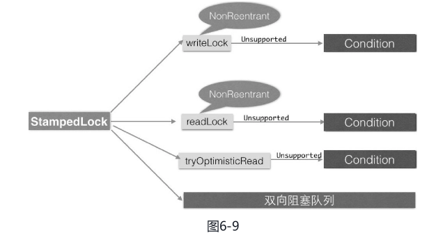

#### 概述

StampedLock是并发包里面JDK8版本新增的一个锁，该锁提供了三种模式的读写控制，当调用获取锁的系列函数时，会返回一个long型的变量，我们称之为戳记（stamp），这个戳记代表了锁的状态。其中try系列获取锁的函数，当获取锁失败后会返回为0的stamp值。当调用释放锁和转换锁的方法时需要传入获取锁时返回的stamp值。

StampedLock提供的三种读写模式的锁分别如下。

##### 写锁

**写锁writeLock**：**是一个排它锁或者独占锁，某时只有一个线程可以获取该锁，当一个线程获取该锁后，其他请求读锁和写锁的线程必须等待，这类似于ReentrantReadWriteLock的写锁（不同的是这里的写锁是不可重入锁）**；当目前没有线程持有读锁或者写锁时才可以获取到该锁。请求该锁成功后会返回一个stamp变量用来表示该锁的版本，当释放该锁时需要调用unlockWrite方法并传递获取锁时的stamp参数。并且它提供了非阻塞的tryWriteLock方法。

##### 悲观读锁

**悲观读锁readLock**：**是一个共享锁，在没有线程获取独占写锁的情况下，多个线程可以同时获取该锁**。**如果已经有线程持有写锁，则其他线程请求获取该读锁会被阻塞，这类似于ReentrantReadWriteLock的读锁（不同的是这里的读锁是不可重入锁**）。这里说的悲观是指在具体操作数据前其会悲观地认为其他线程可能要对自己操作的数据进行修改，所以需要先对数据加锁，这是在读少写多的情况下的一种考虑。请求该锁成功后会返回一个stamp变量用来表示该锁的版本，当释放该锁时需要调用unlockRead方法并传递stamp参数。并且它提供了非阻塞的tryReadLock方法。

##### 乐观读锁

**乐观读锁tryOptimisticRead：它是相对于悲观锁来说的，在操作数据前并没有通过CAS设置锁的状态，仅仅通过位运算测试**。如果当前没有线程持有写锁，则简单地返回一个非0的stamp版本信息。获取该stamp后在具体操作数据前还需要调用validate方法验证该stamp是否已经不可用，也就是看当调用tryOptimisticRead返回stamp后到当前时间期间是否有其他线程持有了写锁，如果是则validate会返回0，否则就可以使用该stamp版本的锁对数据进行操作。由于tryOptimisticRead并没有使用CAS设置锁状态，所以不需要显式地释放该锁。该锁的一个特点是适用于读多写少的场景，因为获取读锁只是使用位操作进行检验，不涉及CAS操作，所以效率会高很多，但是同时由于没有使用真正的锁，在保证数据一致性上需要复制一份要操作的变量到方法栈，并且在操作数据时可能其他写线程已经修改了数据，而我们操作的是方法栈里面的数据，也就是一个快照，所以最多返回的不是最新的数据，但是一致性还是得到保障的。

StampedLock还支持这三种锁在一定条件下进行相互转换。例如long tryConvertToWriteLock（long stamp）期望把stamp标示的锁升级为写锁，这个函数会在下面几种情况下返回一个有效的stamp（也就是晋升写锁成功）：

- 当前锁已经是写锁模式了。
- 当前锁处于读锁模式，并且没有其他线程是读锁模式。
- 当前处于乐观读模式，并且当前写锁可用。

另外，**StampedLock的读写锁都是不可重入锁，所以在获取锁后释放锁前不应该再调用会获取锁的操作，以避免造成调用线程被阻塞**。当多个线程同时尝试获取读锁和写锁时，谁先获取锁没有一定的规则，完全都是尽力而为，是随机的。并且该锁不是直接实现Lock或ReadWriteLock接口，而是其在内部自己维护了一个双向阻塞队列。

```java
static class Point {
    // 成员变量
    private double x, y;
    // 锁实例
    private final StampedLock sl = new StampedLock();

    // 排它锁——写锁（writeLock）
    void move(double deltaX, double deltaY) {
        long stamp = sl.writeLock();
        try {
            x += deltaX;
            y += deltaY;
        } finally {
            sl.unlockWrite(stamp);
        }
    }

    // 乐观读锁（tryOptimisticRead）
    double distanceFromOrigin() {
        //（1）尝试获取乐观读锁
        long stamp = sl.tryOptimisticRead();
        //（2）将全部变量复制到方法体栈内
        double currentX = x, currentY = y;
        //（3）检查在（1）处获取了读锁戳记后，锁有没被其他写线程排它性抢占
        if (!sl.validate(stamp)) {
            //（4）如果被抢占则获取一个共享读锁（悲观获取）
            stamp = sl.readLock();
            try {
                //（5）将全部变量复制到方法体栈内
                currentX = x;
                currentY = y;
            } finally {
                //（6）释放共享读锁
                sl.unlockRead(stamp);
            }
        }
        //（7）返回计算结果
        return Math.sqrt(currentX * currentX + currentY * currentY);
    }

    // 使用悲观锁获取读锁，并尝试转换为写锁
    void moveIfAtOrigin(double newX, double newY) {
        //（1）这里可以使用乐观读锁替换
        long stamp = sl.readLock();
        try {
            //（2）如果当前点在原点则移动
            while (x == 0.0 && y == 0.0) {
                //（3）尝试将获取的读锁升级为写锁
                long ws = sl.tryConvertToWriteLock(stamp);
                //（4）升级成功，则更新戳记，并设置坐标值，然后退出循环
                if (ws != 0L) {
                    stamp = ws;
                    x = newX;
                    y = newY;
                    break;
                } else{
                    //（5）读锁升级写锁失败则释放读锁，显式获取独占写锁，然后循环重试
                    sl.unlockRead(stamp);
                    stamp = sl.writeLock();
                }
            }
        } finally {
            //（6）释放锁
            sl.unlock(stamp);
        }
    }
}
```

在如上代码中，Point类里面有两个成员变量（x, y）用来表示一个点的二维坐标，和三个操作坐标变量的方法。另外实例化了一个StampedLock对象用来保证操作的原子性。

首先分析下**move**方法，该方法的作用是使用参数的增量值，改变当前point坐标的位置。代码先获取到了写锁，然后对point坐标进行修改，而后释放锁。该锁是排它锁，这保证了其他线程调用move函数时会被阻塞，也保证了其他线程不能获取读锁，来读取坐标的值，直到当前线程显式释放了写锁，保证了对变量x, y操作的原子性和数据一致性。

然后看**distanceFromOrigin**方法，该方法的作用是计算当前位置到原点（坐标为0,0）的距离，代码（1）首先尝试获取乐观读锁，如果当前没有其他线程获取到了写锁，那么代码（1）会返回一个非0的stamp用来表示版本信息，代码（2）复制坐标变量到本地方法栈里面。

代码（3）检查在代码（1）中获取到的stamp值是否还有效，之所以还要在此校验是因为代码（1）获取读锁时并没有通过CAS操作修改锁的状态，而是简单地通过与或操作返回了一个版本信息，**在这里校验是看在获取版本信息后到现在的时间段里面是否有其他线程持有了写锁，如果有则之前获取的版本信息就无效了**。

如果校验成功则执行代码（7）使用本地方法栈里面的值进行计算然后返回。需要注意的是，在代码（3）中校验成功后，在代码（7）计算期间，其他线程可能获取到了写锁并且修改了x, y的值，而当前线程执行代码（7）进行计算时采用的还是修改前的值的副本，也就是操作的值是之前值的一个副本，一个快照，并不是最新的值。

另外还有个问题，代码（2）和代码（3）能否互换？答案是不能。假设位置换了，那么首先执行validate，假如validate通过了，要复制x, y值到本地方法栈，而在复制的过程中很有可能其他线程已经修改了x, y中的一个值，这就造成了数据的不一致。那么你可能会问，即使不交换代码（2）和代码（3），在复制x, y值到本地方法栈时，也会存在其他线程修改了x, y中的一个值的情况，这不也会存在问题吗？这个确实会存在，但是，别忘了复制后还有validate这一关呢，如果这时候有线程修改了x, y中的某一值，那么肯定是有线程在调用validate前，调用sl.tryOptimisticRead后获取了写锁，这样进行validate时就会失败。

现在你应该明白了，这也是乐观读设计的精妙之处，而且也是在使用时容易出问题的地方。下面继续分析，validate失败后会执行代码（4）获取悲观读锁，如果这时候其他线程持有写锁，则代码（4）会使当前线程阻塞直到其他线程释放了写锁。如果这时候没有其他线程获取到写锁，那么当前线程就可以获取到读锁，然后执行代码（5）重新复制新的坐标值到本地方法栈，再然后就是代码（6）释放了锁。复制时由于加了读锁，所以在复制期间如果有其他线程获取写锁会被阻塞，这保证了数据的一致性。另外，这里的x, y没有被声明为volatie的，会不会存在内存不可见性问题呢？答案是不会，因为加锁的语义保证了内存的可见性。

最后代码（7）使用方法栈里面的数据计算并返回，同理，这里在计算时使用的数据也可能不是最新的，其他写线程可能已经修改过原来的x, y值了。

最后一个方法**moveIfAtOrigin**的作用是，如果当前坐标为原点则移动到指定的位置。代码（1）获取悲观读锁，保证其他线程不能获取写锁来修改x, y值。然后代码（2）判断，如果当前点在原点则更新坐标，代码（3）尝试升级读锁为写锁。这里升级不一定成功，因为多个线程都可以同时获取悲观读锁，当多个线程都执行到代码（3）时只有一个可以升级成功，升级成功则返回非0的stamp，否则返回0。这里假设当前线程升级成功，然后执行代码（4）更新stamp值和坐标值，之后退出循环。如果升级失败则执行代码（5）首先释放读锁，然后申请写锁，获取到写锁后再循环重新设置坐标值。最后代码（6）释放锁。

使用乐观读锁还是很容易犯错误的，必须要小心，且必须要保证如下的使用顺序。

```java
long stamp = lock.tryOptimisticRead(); //非阻塞获取版本信息
copyVaraibale2ThreadMemory(); //复制变量到线程本地堆栈
if(! lock.validate(stamp)){ // 校验
    long stamp = lock.readLock(); //获取读锁
    try {
        copyVaraibale2ThreadMemory(); //复制变量到线程本地堆栈
    } finally {
      lock.unlock(stamp); //释放悲观锁
    }
}
useThreadMemoryVarables(); //使用线程本地堆栈里面的数据进行操作
```




#### 小结

StampedLock提供的读写锁与ReentrantReadWriteLock类似，只是前者提供的是不可重入锁。但是前者通过提供乐观读锁在多线程多读的情况下提供了更好的性能，这是因为获取乐观读锁时不需要进行CAS操作设置锁的状态，而只是简单地测试状态。