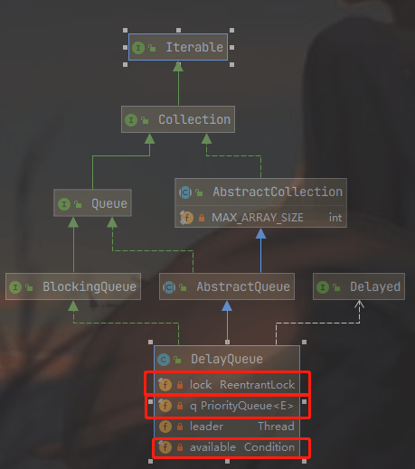

###  DelayQueue原理探究

**DelayQueue并发队列是一个无界阻塞延迟队列**，**队列中的每个元素都有个过期时间，当从队列获取元素时，只有过期元素才会出队列**。**队列头元素是最快要过期的元素**。

#### 1 类图结构 

由该图可知，DelayQueue内部使用PriorityQueue存放数据，使用**ReentrantLock**实现线程同步。另外，**队列里面的元素要实现Delayed接口，由于每个元素都有一个过期时间，所以要实现获知当前元素还剩下多少时间就过期了的接口，由于内部使用优先级队列来实现，所以要实现元素之间相互比较的接口**。



条件变量 available 与 lock 锁对应的，其目的是为了实现线程间同步。

```mysql
    /**
     * Condition signalled when a newer element becomes available
     * at the head of the queue or a new thread may need to
     * become leader.
     */
    private final Condition available = lock.newCondition();
```


#### 2 主要函数原理讲解 

##### 1 offer 操作

插入元素到队列，如果插入元素为 null 则抛 ull Pointe Exception 异常 则由于是无界队列 所以 直返回 true 。**插入元素要实现 Delayed 接口**。

```java
public boolean offer(E e) {
    final ReentrantLock lock = this.lock;
    lock.lock();
    try {
        q.offer(e);
        if (q.peek() == e) { // 2
            leader = null;
            available.signal();
        }
        return true;
    } finally {
        lock.unlock();
    }
}
```

上述代码先获取独占锁，然后添加元素到优先级队列，由于 q 是优先级队列，所以添加元素后，调用peek()方法返回的并不一定是当前添加的元素。如果代码2判断结果为 true，说名当前元素 e 是最先将过期的，那么重置 leader 线程 为 null，这时候激活 available 变量条件队列里面的一个线程，告诉它队列里面有元素了。

##### 2 take 操作 

获取并移除队列里面延迟时间过期的元素 ，如果队列里面没有过期元素则等待。

```java
public E take() throws InterruptedException {
    final ReentrantLock lock = this.lock;
    lock.lockInterruptibly();
    try {
        for (;;) {
            // 获取但是不移除队首元素 (1)
            E first = q.peek(); 
            // 如果获取的队首元素为空，则条件队列的线程等待
            if (first == null)
                available.await(); // (2) 把当前线程放入 available 的条 件队列里阻塞等待
            else {
                long delay = first.getDelay(NANOSECONDS);
                if (delay <= 0) // (3)
                    return q.poll();
                first = null; // don't retain ref while waiting
                if (leader != null) // (4)
                    available.await();
                else {
                    Thread thisThread = Thread.currentThread();
                    leader = thisThread; // (5)
                    try {
                        available.awaitNanos(delay); // (6)
                    } finally {
                        if (leader == thisThread)
                            leader = null;
                    }
                }
            }
        }
    } finally {
        if (leader == null && q.peek() != null) // (7)
            available.signal(); 
        lock.unlock(); // (8)
    }
}
```

如上代码首先获取独占锁 lock, 假设线程 A 一次调用队列的 take （）方法时队列为空，则执行代码（1）后 first==null，所以会执行代码（2）把当前线程放入 available 的条 件队列里阻塞等待。

当有另外一个线程B执行 offer(item) 方法并且添加元素到队列时，假设此时没有其他线程执行入队操作，则线程B添加的元素是队首元素，那么执行 q.peek() 方法。

这时候就会重置 leader 线程为 null（在offer方法里），并且激活条件队列里面的一个线程。此时线程A就会被激活。

线程A被激活并循环后重新获取队首元素，这时候 first 就是线程 B 新增的元素，可知这时候 first 不为 null ， 则调用 first. getDelay(TimeUnit.NANOSECONDS） 方法查看该元素还剩余多少时间就要过期，如果 delay<=O 则说明己经过期，那么直接出队返回。否则查 看 leader 是否为 null，不为 null 则说明其他线程也在执行 take，则把该线程放入条件队列。 如果这时候 leader 为 null，则选取当前线程 A 为 leader 线程， 然后执行代码（5 ） 等待 delay 时间（这期间该线程会释放锁，所以其他线程可以 offer 添加元素，也可以 take 阻塞自己），剩余过期时间到后，线程 A 会重新竞争得到锁，然后重置 leader 线程为 null ， 重新进入循环，这时候就会发现队头的元素己经过期了，则会直接返回队头元素。

在返回前会执行 finally 块里面的代码（7 ），代码 (7）执行结果为 true 则说明当前线 程从队列移除过期元素后，又有其他线程执行了入队操作，那么这时候调用条件变量的 singal 方法，激活条件队列里面的等待线程。

##### 3 pool 操作 

获取并移除队头过期元素，如果没有过期元素则返回 null 。

```java
public E poll() {
    final ReentrantLock lock = this.lock;
    lock.lock();
    try {
        E first = q.peek();
        // 如果队列为空，或者不为空但是队头元素没有过期则返回null
        if (first == null || first.getDelay(NANOSECONDS) > 0)
            return null;
        else
            return q.poll();
    } finally {
        lock.unlock();
    }
}
```

这段代码比较简单，首先获取独占锁，然后获取队头元素，如果队头元素为 null 或者
还没过期则返回 null，否则返回队头元素。

##### 4 size 操作 

```java
public int size() {
    final ReentrantLock lock = this.lock;
    lock.lock();
    try {
        return q.size();
    } finally {
        lock.unlock();
    }
}
```

包含过期与没过期的元素。

##### 5 小结 

本节讲解了 DelayQueue 队列，其内部使用 PriorityQueue 存放数据，使用 ReentrantLock 实现线程同步。另外队列里面的元素要实现 Delayed 接口，其中一个是 获取当前元素到过期时间剩余时间的接口，在出队时判断元素是否过期了，一个是元素之 间比较的接口，因为这是一个有优先级的队列 。

---

延迟队列案例：[博客](https://blog.csdn.net/qq_39940205/article/details/101671865) 

##### 具体使用

##### 可以用来做什么？

1. 淘宝订单业务:下单之后如果三十分钟之内没有付款就自动取消订单。 
2. 饿了吗订餐通知:下单成功后60s之后给用户发送短信通知。
3. 关闭空闲连接。服务器中，有很多客户端的连接，空闲一段时间之后需要关闭之。
4. 缓存。缓存中的对象，超过了空闲时间，需要从缓存中移出。
5. 任务超时处理。在网络协议滑动窗口请求应答式交互时，处理超时未响应的请求等。

元素进入队列后，先进行排序，然后，只有getDelay也就是剩余时间为0的时候，该元素才有资格被消费者从队列中取出来，所以构造函数一般都有一个时间传入。

##### 实例

- 首先我们需要定义一个实现 Delayed 接口的类。

这是因为我们需要实现一个时间的排序，并且在到期之后可以自动取出。

```java
public class OrderDelayed implements Delayed {
    private final static long DELAY = 30 * 60 * 100L;
    private long defaultDelayTime;
    private String orderId;
    private long startTime;
    private long expireTime;
    private Date now;

    public OrderDelayed() {
        this.now = new Date();
    }

    public OrderDelayed(String orderId, long startTime, long defaultDelayTime) {
        this.orderId = orderId;
        this.defaultDelayTime = defaultDelayTime;
        this.expireTime = startTime + this.defaultDelayTime * 60 * 1000L;
        this.now = new Date();
        this.startTime = startTime;
    }

    // getter
    // setter
// 延迟时间函数，当小于等于0的时候说明到期了
    @Override
    public long getDelay(TimeUnit unit) {
        return unit.convert(this.expireTime - System.currentTimeMillis(), TimeUnit.MILLISECONDS);
    }
// 排序，和 getDelay 函数一致，用来实现排序
    @Override
    public int compareTo(Delayed o) {
        return (int) (this.getDelay(TimeUnit.MILLISECONDS) - o.getDelay(TimeUnit.MILLISECONDS));
    }

    @Override
    public String toString() {
        return "OrderDelayed{" +
                "orderId='" + orderId + '\'' +
                ", startTime=" + startTime +
                ", expireTime=" + expireTime +
                ", now=" + now +
                '}';
    }
}
```

具体需要考虑的逻辑

1. 需要项目启动的时候检查是否有未支付的订单

这种情况下的检查是因为，万一系统出现故障，内存中保存的订单信息突然丢失了，那么这些未支付的订单也就会丢失了。这时就需要重新检查一下系统中是否存在这种下了订单但是还么有支付的。

可以实现 InitializingBean接口、使用注解 @PostConstruct、Init-method 等来实现启动时候获取未支付订单。

```java
... 
// 延迟队列
private DelayQueue<OrderDelayed> DELAY_QUEUE = new DelayQueue<>();
// 线程池
private ThreadPoolExecutor poolExecutor = new ThreadPoolExecutor(1, 10, 10, TimeUnit.SECONDS, new LinkedBlockingQueue<Runnable>());
// 默认过期时间
private long defaultDelayTime;

private void checkUnpaidOrder() {
	    log.info("application start:scan for unexpired orders...");
        List<SalesOrder> unpaidOrders = getUnpaidSalesOrderWithinExactlyTime();
        for (SalesOrder order : unpaidOrders) {
            OrderDelayed orderDelayed = new OrderDelayed(order.getOrderId(), order.getStartPayTime().getTime(), this.getDefaultDelayTime());
            this.addOrderToDelayQueue(orderDelayed);
        }
        log.info("scan for unexpired orders {} numbers,add to delay queue for due to checking", DELAY_QUEUE.size());
// 开启一个线程来轮询执行到期的元素
        poolExecutor.execute(() -> {
            log.info("start a thread to handling it");
            OrderDelayed orderDelayed;
            while (true) {
                try {
                    if(!DELAY_QUEUE.isEmpty()) {
                        orderDelayed = DELAY_QUEUE.take();
                        log.info("get order: {} from queue", orderDelayed.toString());
                        updateUnpaidOrderToCancelStatus(orderDelayed.getOrderId(), Scheduler.getSystemId());
                        log.info("cancel order success!order id is : {}", orderDelayed.getOrderId());
                    }
                } catch (Exception e) {
                    log.error("The delay queue for executing the timed order : " + e);
                }
            }
        });
    }
// 添加到队列中
private boolean addOrderToDelayQueue(OrderDelayed order) {
	    log.info("order : {} is added to queue", order.getOrderId());
        return DELAY_QUEUE.add(order);
    }
// 从队列中移除
private void removeOrderFromDelayQueue(String orderId) {
    for (OrderDelayed order : DELAY_QUEUE) {
        if (order.getOrderId().equals(orderId)) {
            log.info("order: {} has paid,remove from queue", order.getOrderId());
            DELAY_QUEUE.remove(order);
        }
    }
}
```

2. 下单后将订单直接放入未支付的延时队列中。

```java
// this.getDefaultDelayTime() 是可以配置的到期时间，30分钟或者其他时间
OrderDelayed orderDelayed = new OrderDelayed(salesOrderKey.getOrderId(), salesOrderRec.getStartPayTime().getTime(), this.getDefaultDelayTime());
// 添加一个新的元素到队列中
addOrderToDelayQueue(orderDelayed);
```

3. 如果超时未支付,则从队列中取出,进行修改为取消状态的订单。

4. 如果支付了，则不添加到队列中。

5. 如果订单修改了，则需要修改对应的过期时间。

   ```java
   // 先从队列中移除，再添加
   this.removeOrderFromDelayQueue(salesOrderKey.getOrderId());
   OrderDelayed orderDelayed = new OrderDelayed(salesOrderKey.getOrderId(), salesOrderRec.getStartPayTime().getTime(), this.getDefaultDelayTime());
   this.addOrderToDelayQueue(orderDelayed);
   ```

6. 订单取消之后，需要将这个订单从队列中移除。

