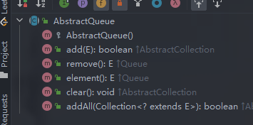

http://thinkinjava.cn/2018/04/12/2018/2018-04-12-%E5%B9%B6%E5%8F%91%E7%BC%96%E7%A8%8B%E4%B9%8B-SynchronousQueue-%E6%A0%B8%E5%BF%83%E6%BA%90%E7%A0%81%E5%88%86%E6%9E%90/

《Java 编程的逻辑》17.4章

SynchronousQueue与一般的队列不同，它不算一种真正的队列，没有存储元素的空间，连存储一个元素的空间都没有。它的入队操作要等待另一个线程的出队操作，反之亦然。如果没有其他线程在等待从队列中接收元素，put操作就会等待。take操作需要等待其他线程往队列中放元素，如果没有，也会等待。SynchronousQueue适用于两个线程之间直接传递信息、事件或任务。

### 源码实现

#### 类的结构

类继承了`AbstractQueue`，说明它有队列的基本方法，同时还实现了 `BlockingQueue`，这说明拥有阻塞队列的相关方法，同时还是先了序列化方法，可以进行序列化与反序列化。

```java
public class SynchronousQueue<E> extends AbstractQueue<E>
    implements BlockingQueue<E>, java.io.Serializable {
    ...
}
```




#### 类的属性

##### 内部类

Transferer

如果 e 不是 null(说明是生产者调用) ，将 item 交给消费者，并返回 e；反之，如果是 null（说明是消费者调用），将生产者提供的 item 返回给消费者。

```java
abstract static class Transferer<E> {
    /**
     * Performs a put or take.
     *
     * @param e if non-null, the item to be handed to a consumer;
     *          if null, requests that transfer return an item
     *          offered by producer.
     * @param timed if this operation should timeout
     * @param nanos the timeout, in nanoseconds
     * @return if non-null, the item provided or received; if null,
     *         the operation failed due to timeout or interrupt --
     *         the caller can distinguish which of these occurred
     *         by checking Thread.interrupted.
     */
    abstract E transfer(E e, boolean timed, long nanos);
}
```

该类有两个继承的类：

###### TransferQueue

这扩展了Scherer-Scott双队列算法，不同之处在于，它在节点内使用模式而不是标记指针。该算法比堆栈的算法简单一点，因为执行者不需要显式节点，匹配是由CAS QNode完成的。条目字段从非空变为空(对于put)，反之亦然(对于take)。

```java
static final class TransferQueue<E> extends Transferer<E> {
    
}
```

###### TransferStack

这扩展了Scherer-Scott双堆栈算法，与其他方法不同的是，它使用“覆盖”节点而不是位标记指针:完成操作在标记节点上推送(将完成位设置为模式)，以保留一个位置来匹配等待节点。

```java
static final class TransferStack<E> extends Transferer<E> {
    
}
```

#### 构造方法

```java
public SynchronousQueue() {
    this(false);
}
public SynchronousQueue(boolean fair) {
    transferer = fair ? new TransferQueue<E>() : new TransferStack<E>();
}
```

SynchronousQueue内部分为公平队列和非公平栈，使用的是两个不同的容器来实现的，都在内部类定义。默认是非公平的，也就是非公平栈（FIFO）的性能会高一点。

#### 核心方法

##### offer(E e, long timeout, TimeUnit unit)方法

插入一个指定的元素到队列中，如果有必要的话，等待指定的时间，等待另一个线程接收这个元素。

```java
public boolean offer(E e, long timeout, TimeUnit unit)
    throws InterruptedException {
    if (e == null) throw new NullPointerException();
    if (transferer.transfer(e, true, unit.toNanos(timeout)) != null)
        return true;
    if (!Thread.interrupted())
        return false;
    throw new InterruptedException();
}
```

可以看到上面的核心方法就是 `transferer.transfer` 方法，如果返回true，表示插入成功，失败返回 false。

```java
public boolean offer(E e) {
    if (e == null) throw new NullPointerException();
    return transferer.transfer(e, true, 0) != null;
}
```

和有时间的方法相比，只是时间变成了 0。

##### poll(long timeout, TimeUnit unit)方法

```java
public E poll(long timeout, TimeUnit unit) throws InterruptedException {
    E e = transferer.transfer(null, true, unit.toNanos(timeout));
    if (e != null || !Thread.interrupted())
        return e;
    throw new InterruptedException();
}
```

核心方法也是 `transferer.transfer`。和offer的调用区别之处在于，这里的第一个参数是 null，offer 的是具体的元素。

```java
public E poll() {
    return transferer.transfer(null, true, 0);
}
```

和有时间的方法相比，只是时间变成了 0。

#### TransferStack 源码实现


#### TransferQueue 源码实现