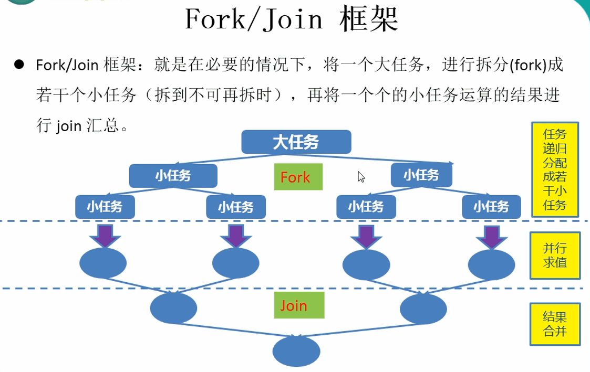
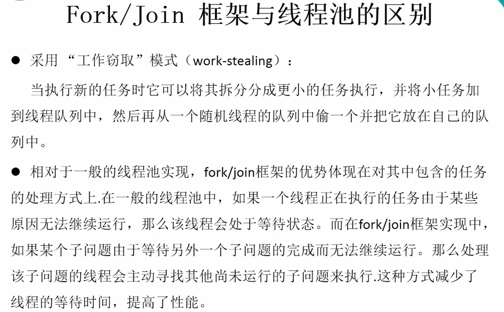

[ForkJoin简介](https://juejin.cn/post/6983661263473606687)

[ForkJoin实际中应用](https://juejin.cn/post/6983953239049764871)

### 简介



#### 与线程池的区别



案例代码：计算两个范围很大的数的和

```java
package com.lanwq.thread.bingfa;

import java.time.Duration;
import java.time.Instant;
import java.util.concurrent.ForkJoinPool;
import java.util.concurrent.ForkJoinTask;
import java.util.concurrent.RecursiveTask;
import java.util.stream.LongStream;

/**
 * @author Lan
 * @createTime 2023-11-29  21:25
 **/
public class TestForkJoinPool {
    public static void main(String[] args) {
        // 拆分任务需要和串行执行对比后再决定是否采取
        test1();
        Instant start = Instant.now();
        ForkJoinPool pool = new ForkJoinPool();
        ForkJoinTask<Long> joinSumCalculate = new ForkJoinSumCalculate(0, 1000000000L);
        Long sum = pool.invoke(joinSumCalculate);
        System.out.println(sum);
        pool.shutDo
        Instant end = Instant.now();
        // 217
        System.out.println("耗费时间2：" + Duration.between(start, end).toMillis());
        test2();
    }

    private static void test1 () {
        Instant start = Instant.now();
        long sum = 0;
        for (long i = 0; i <= 1000000000; i++) {
            sum += i;
        }
        System.out.println(sum);
        Instant end = Instant.now();
        // 27
        System.out.println("耗费时间1：" + Duration.between(start, end).toMillis());
    }

    /**
     * 使用 Java8 新特性
     */
    private static void test2 () {
        Instant start = Instant.now();
        long sum = LongStream.rangeClosed(0L, 1000000000)
                .parallel().reduce(0L, Long::sum);
        System.out.println(sum);
        Instant end = Instant.now();
        // 27
        System.out.println("耗费时间3：" + Duration.between(start, end).toMillis());
    }
}

class ForkJoinSumCalculate extends RecursiveTask<Long> {

    private long start;
    private long end;

    /**
     * 临界值
     */
    private static final long THRESHOLD = 1000L;

    public ForkJoinSumCalculate() {
    }

    public ForkJoinSumCalculate(long start, long end) {
        this.start = start;
        this.end = end;
    }

    @Override
    protected Long compute() {
        long length = end - start;
        if (length <= THRESHOLD) {
            long sum = 0L;
            for (long i = start; i <= end; i++) {
                sum += i;
            }
            return sum;
        } else {
            long middle = (start + end) / 2;
            ForkJoinSumCalculate left = new ForkJoinSumCalculate(start, middle);
            left.fork(); // 拆分

            ForkJoinSumCalculate right = new ForkJoinSumCalculate(middle + 1, end);
            right.fork(); // 拆分

            return left.join() + right.join();
        }
    }
}
```