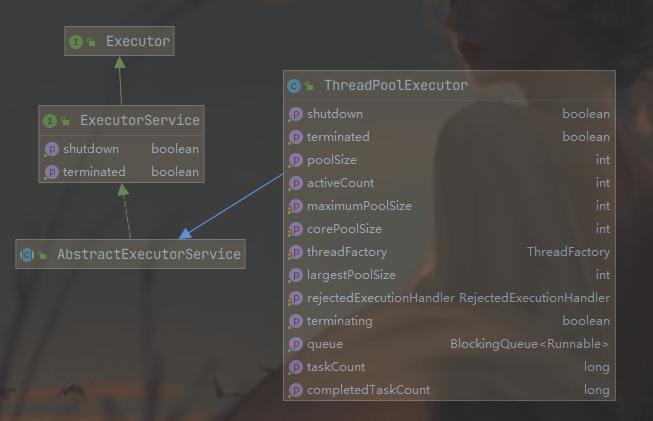
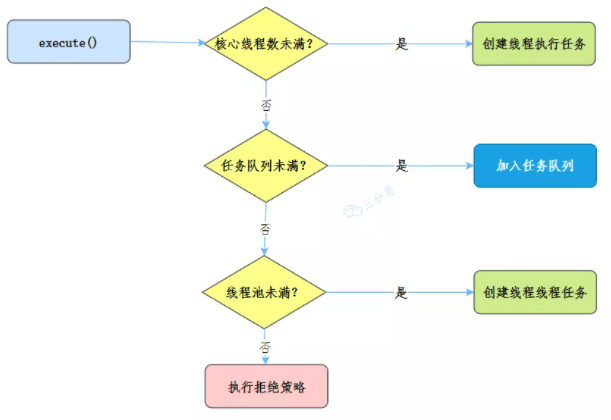
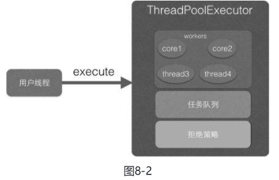
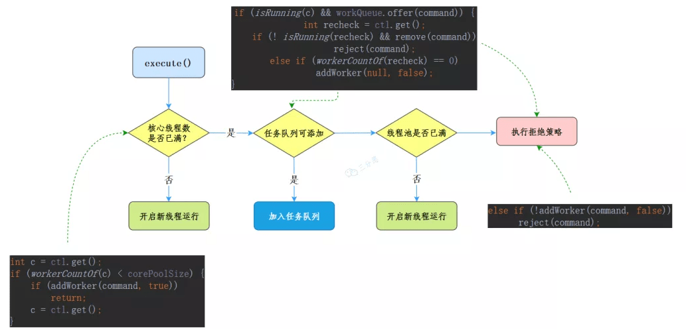

参考： [要是以前有人这么讲线程池，我早就该明白了！](https://mp.weixin.qq.com/s/Exy7pRGND9TCjRd9TZK4jg) 

##### 1 介绍  

线程池主要解决了两个问题：

- 一是**当执行大量异步任务时线程池能够提供较好的性能**。在不使用线程池时，每当需要执行异步任务时直接new一个线程来运行，而线程的创建和销毁是需要开销的。线程池里面的线程是可复用的，不需要每次执行异步任务时都重新创建和销毁线程。 
- 二是**线程池提供了一种资源限制和管理的手段**，比如可以限制线程的个数，动态新增线程等。每个ThreadPoolExecutor也保留了一些基本的统计数据，比如当前线程池完成的任务数目等。 


##### 2 类图介绍  




ThreadPoolExecutor 继承 AbstractExecutorService ，**ctl 是一个 Integer 的原子变量，用来记录线程池状态和线程池中线程个数**，类似于 ReentrantReadWriteLock 使用一个变量来保存两种信息。

这里假设Integer类型是32位二进制表示，则其中高3位用来表示线程池状态，后面29位用来记录线程池线程个数。

```java
private final AtomicInteger ctl = new AtomicInteger(ctlOf(RUNNING, 0));
private static final int COUNT_BITS = Integer.SIZE - 3; // 这里就是 32 - 3 = 29
private static final int CAPACITY   = (1 << COUNT_BITS) - 1;

// runState is stored in the high-order bits
// （高3位）1110 0000 0000 0000 0000 0000 0000 0000 
private static final int RUNNING    = -1 << COUNT_BITS;
// （高3位）0000 0000 0000 0000 0000 0000 0000 0000 
private static final int SHUTDOWN   =  0 << COUNT_BITS;
// （高3位）0010 0000 0000 0000 0000 0000 0000 0000 
private static final int STOP       =  1 << COUNT_BITS;
// （高3位）0100 0000 0000 0000 0000 0000 0000 0000 
private static final int TIDYING    =  2 << COUNT_BITS;
// （高3位）0110 0000 0000 0000 0000 0000 0000 0000 
private static final int TERMINATED =  3 << COUNT_BITS;

// Packing and unpacking ctl
private static int runStateOf(int c)     { return c & ~CAPACITY; }
private static int workerCountOf(int c)  { return c & CAPACITY; }
private static int ctlOf(int rs, int wc) { return rs | wc; }
```

其中mainLock是独占锁，用来控制新增Worker线程操作的原子性。termination是该锁对应的条件队列，在线程调用awaitTermination时用来存放阻塞的线程。

```java
private final ReentrantLock mainLock = new ReentrantLock();

/**
 * Set containing all worker threads in pool. Accessed only when
 * holding mainLock.
 */
private final HashSet<Worker> workers = new HashSet<Worker>();

/**
 * Wait condition to support awaitTermination
 */
private final Condition termination = mainLock.newCondition();
```


###### 线程池状态含义：

- **RUNNING**：接受新任务并且处理阻塞队列里的任务。
- **SHUTDOWN**：拒绝新任务但是处理阻塞队列里的任务。
- **STOP**：拒绝新任务并且抛弃阻塞队列里的任务，同时会中断正在处理的任务。
- **TIDYING**：所有任务都执行完（包含阻塞队列里面的任务）后当前线程池活动线程数为0，将要调用terminated方法。
- **TERMINATED**：终止状态。terminated方法调用完成以后的状态。

线程池状态转换：

-  **RUNNING -> SHUTDOWN** ：显式调用shutdown（）方法，或者隐式调用了finalize（）方法里面的shutdown（）方法。
-  **RUNNING或SHUTDOWN -> STOP** ：显式调用shutdownNow（）方法时。
-  **SHUTDOWN -> TIDYING** ：当线程池和任务队列都为空时。
-  **STOP -> TIDYING** ：当线程池为空时。
-  **TIDYING -> TERMINATED**：当terminated（）hook方法执行完成时。


线程池的创建，最终都会到这个函数中来：

```java
public ThreadPoolExecutor(int corePoolSize,
                          int maximumPoolSize,
                          long keepAliveTime,
                          TimeUnit unit,
                          BlockingQueue<Runnable> workQueue,
                          ThreadFactory threadFactory,
                          RejectedExecutionHandler handler) {
    if (corePoolSize < 0 ||
        maximumPoolSize <= 0 ||
        maximumPoolSize < corePoolSize ||
        keepAliveTime < 0)
        throw new IllegalArgumentException();
    if (workQueue == null || threadFactory == null || handler == null)
        throw new NullPointerException();
    this.corePoolSize = corePoolSize; // 线程池核心线程个数
    this.maximumPoolSize = maximumPoolSize; // 线程池最大线程数量
    this.workQueue = workQueue; // 用于保存等待执行的任务的阻塞队列
    this.keepAliveTime = unit.toNanos(keepAliveTime); // 存活时间
    this.threadFactory = threadFactory; // 创建线程的工厂
    this.handler = handler; // 拒绝策略
}
```

###### 线程池参数：

- **corePoolSize**：线程池核心线程个数。

- **maximunPoolSize**：线程池最大线程数量（核心线程数+非核心线程数）。

- **workQueue**：

  用于保存等待执行的任务的阻塞队列，比如基于数组的有界ArrayBlockingQueue、基于链表的无界LinkedBlockingQueue、最多只有一个元素的同步队列SynchronousQueue及优先级队列PriorityBlockingQueue等。

- **keeyAliveTime**：

  存活时间。如果当前线程池中的线程数量比核心线程数量多，并且是闲置状态，则这些闲置的线程能存活的最大时间。

- **ThreadFactory**：创建线程的工厂

- **RejectedExecutionHandler**：

  饱和策略，当队列满并且线程个数达到maximunPoolSize后采取的策略，比如AbortPolicy（抛出异常，默认策略）、CallerRunsPolicy（使用调用者所在线程来运行任务）、DiscardOldestPolicy（调用poll丢弃一个任务，执行当前任务）及DiscardPolicy（默默丢弃，不抛出异常）。

- **TimeUnit**：存活时间的时间单位。

###### 线程池工作流程 

以`execute()`方法提交任务为例，我们来看线程池的工作流程：



向线程池提交任务的时候：

1. 如果当前运行的线程少于**核心线程数 corePoolSize**，则创建新线程来执行任务。
2. 如果运行的线程等于或者多余**核心线程数 corePoolSize**，则将任务加入 **任务队列workQueue**。
3. 如果**任务队列workQueue**已满，创建新的线程来处理任务 。
4. 如果创建新线程使当前总线程数超过**最大线程数maximumPoolSize**，任务将被拒绝，**线程池拒绝策略handler**执行。

###### **线程池类型**

- **newFixedThreadPool** ：创建一个核心线程个数和最大线程个数都为nThreads的线程池，并且阻塞队列长度为Integer.MAX_VALUE。keeyAliveTime=0说明只要线程个数比核心线程个数多并且当前空闲则回收。
- **newSingleThreadExecutor**：创建一个核心线程个数和最大线程个数都为1的线程池，并且阻塞队列长度为Integer.MAX_VALUE。keeyAliveTime=0说明只要线程个数比核心线程个数多并且当前空闲则回收。
- **newCachedThreadPool** ：创建一个按需创建线程的线程池，初始线程个数为0，最多线程个数为Integer.MAX_VALUE，并且阻塞队列为同步队列。keeyAliveTime=60说明只要当前线程在60s内空闲则回收。这个类型的特殊之处在于，加入同步队列的任务会被马上执行，同步队列里面最多只有一个任务。


##### 3 源码分析  

###### 3.1 execute(Runnable command) 提交线程

execute方法的作用是提交任务command到线程池进行执行。用户线程提交任务到线程池的模型图如图8-2所示。



从该图可以看出，**ThreadPoolExecutor的实现实际是一个生产消费模型，当用户添加任务到线程池时相当于生产者生产元素，workers线程工作集中的线程直接执行任务或者从任务队列里面获取任务时则相当于消费者消费元素**。

```java
public void execute(Runnable command) {
    // (1)如果任务为 null，抛出 NPE 异常
    if (command == null)
        throw new NullPointerException();
    /*
     * Proceed in 3 steps:
     *
     * 1. If fewer than corePoolSize threads are running, try to
     * start a new thread with the given command as its first
     * task.  The call to addWorker atomically checks runState and
     * workerCount, and so prevents false alarms that would add
     * threads when it shouldn't, by returning false.
     *
     * 2. If a task can be successfully queued, then we still need
     * to double-check whether we should have added a thread
     * (because existing ones died since last checking) or that
     * the pool shut down since entry into this method. So we
     * recheck state and if necessary roll back the enqueuing if
     * stopped, or start a new thread if there are none.
     *
     * 3. If we cannot queue task, then we try to add a new
     * thread.  If it fails, we know we are shut down or saturated
     * and so reject the task.
     */
    // （2）获取当前线程池的状态 + 线程个数变量的组合值
    int c = ctl.get();
    // （3）当前线程池中个数是否小于 corePoolSize，小于则开启新线程运行
    if (workerCountOf(c) < corePoolSize) {
        if (addWorker(command, true))
            return;
        c = ctl.get();
    }
    // （4）如果线程池处于 RUNNING 状态，则添加任务到阻塞队列
    if (isRunning(c) && workQueue.offer(command)) {
        // （4.1）二次检查
        int recheck = ctl.get();
        // （4.2）如果当前线程池状态不是 RUNNING，则从队列中删除任务，并执行拒绝策略
        if (! isRunning(recheck) && remove(command))
            reject(command);
        // （4.3）否则如果当前线程池为空，添加一个新线程
        else if (workerCountOf(recheck) == 0)
            addWorker(null, false);
    }
    // （5）如果队列满，则增加新线程，新增失败则执行拒绝策略
    else if (!addWorker(command, false))
        reject(command);
}
```

execute 流程图。[参考](https://mp.weixin.qq.com/s/Exy7pRGND9TCjRd9TZK4jg) 




代码（3）判断**如果当前线程池中线程个数小于corePoolSize，会向workers里面新增一个核心线程（core线程）执行该任务**。------------ 1

**如果当前线程池中线程个数大于等于corePoolSize**则执行代码（4）。**如果当前线程池处于RUNNING状态则添加当前任务到任务队列**。这里需要判断线程池状态是因为有可能线程池已经处于非RUNNING状态，而在非RUNNING状态下是要抛弃新任务的。------------ 2

如果向任务队列添加任务成功，则代码（4.2）对线程池状态进行二次校验，这是**因为添加任务到任务队列后**，执行代码（4.2）**前有可能线程池的状态已经变化了**。这里进行二次校验，**如果当前线程池状态不是RUNNING了则把任务从任务队列移除，移除后执行拒绝策略**；如果二次校验通过，则执行代码（4.3）重新**判断当前线程池里面是否还有线程，如果没有则新增一个线程**。 

如果代码（4）添加任务失败，则说明**任务队列已满，那么执行代码（5）尝试新开启线程（如图8-1中的thread3和thread4）来执行该任务**，**如果当前线程池中线程个数>maximumPoolSize则执行拒绝策略**。---------- 3

###### 3.2 新增线程 addWorker 方法

```java
private boolean addWorker(Runnable firstTask, boolean core) {
    retry:
    for (;;) {
        int c = ctl.get();
        int rs = runStateOf(c);

        // （6）检查队列是否只在必要时为空  Check if queue empty only if necessary.
        if (rs >= SHUTDOWN &&
            ! (rs == SHUTDOWN &&
               firstTask == null &&
               ! workQueue.isEmpty()))
            return false;
// （7）循环 CAS 增加线程个数
        for (;;) {
            int wc = workerCountOf(c);
            // （7.1）如果线程个数超限则返回 false
            if (wc >= CAPACITY ||
                wc >= (core ? corePoolSize : maximumPoolSize))
                return false;
            // （7.2）CAS 增加线程个数，同时i只有一个线程成功
            if (compareAndIncrementWorkerCount(c))
                break retry;
            // （7.3）CAS 失败了，则看线程池状态是否变化了，变化则跳出外层循环重新尝试获取线程池状态，否则内层循环重新 CAS 
            c = ctl.get();  // Re-read ctl
            if (runStateOf(c) != rs)
                continue retry;
            // else CAS failed due to workerCount change; retry inner loop
        }
    }
// （8）到这里说明 CAS 成功了
    boolean workerStarted = false;
    boolean workerAdded = false;
    Worker w = null;
    try {
        // （8.1）创建 Worker
        w = new Worker(firstTask);
        final Thread t = w.thread;
        if (t != null) {
            // （8.2）加独占锁，为了实现 workers 同步，因为可能多个线程调用了线程池的 execute 方法
            final ReentrantLock mainLock = this.mainLock;
            mainLock.lock();
            try {
                // Recheck while holding lock.
                // Back out on ThreadFactory failure or if
                // shut down before lock acquired.
                // （8.3）重新检查线程池状态，以避免在换取锁前调用了 shutdown 接口
                int rs = runStateOf(ctl.get());

                if (rs < SHUTDOWN ||
                    (rs == SHUTDOWN && firstTask == null)) {
                    if (t.isAlive()) // precheck that t is startable
                        throw new IllegalThreadStateException();
                    // （8.4）添加任务
                    workers.add(w);
                    int s = workers.size();
                    if (s > largestPoolSize)
                        largestPoolSize = s;
                    workerAdded = true;
                }
            } finally {
                mainLock.unlock();
            }
            // （8.5）添加成功后则启动任务
            if (workerAdded) {
                t.start();
                workerStarted = true;
            }
        }
    } finally {
        if (! workerStarted)
            addWorkerFailed(w);
    }
    return workerStarted;
}
```

代码主要分两个部分：

第一部分双重循环的目的是通过CAS操作增加线程数；第二部分主要是把并发安全的任务添加到workers里面，并且启动任务执行。

**第一部分**

```java
if (rs >= SHUTDOWN &&
            ! (rs == SHUTDOWN &&
               firstTask == null &&
               ! workQueue.isEmpty()))
等价于
if (rs >= SHUTDOWN &&
            (rs != SHUTDOWN &&
               firstTask != null &&
               workQueue.isEmpty()))
```

代码（6）在下面几种情况下会返回 false：

- 当前线程池状态为STOP、TIDYING或TERMINATED 。
- 当前线程池状态为SHUTDOWN并且已经有了第一个任务。
- 当前线程池状态为SHUTDOWN并且任务队列为空。

内层循环的作用是使用CAS操作增加线程数，代码（7.1）判断如果线程个数超限则返回false，否则执行代码（7.2）CAS操作设置线程个数，CAS成功则退出双循环，CAS失败则执行代码（7.3）看当前线程池的状态是否变化了，如果变了，则再次进入外层循环重新获取线程池状态，否则进入内层循环继续进行CAS尝试。

###### 3.3 工作线程 Worker 的执行

首先看下 Worker 的构造函数：继承了 AQS，实现了 Runnable 接口

```java
private final class Worker
    extends AbstractQueuedSynchronizer
    implements Runnable
{
        /**
         * This class will never be serialized, but we provide a
         * serialVersionUID to suppress a javac warning.
         */
        private static final long serialVersionUID = 6138294804551838833L;

        /** Thread this worker is running in.  Null if factory fails. */
        final Thread thread;
        /** Initial task to run.  Possibly null. */
        Runnable firstTask;
        /** Per-thread task counter */
        volatile long completedTasks;

        /**
         * Creates with given first task and thread from ThreadFactory.
         * @param firstTask the first task (null if none)
         */
        Worker(Runnable firstTask) {
            setState(-1); // inhibit interrupts until runWorker
            this.firstTask = firstTask;
            this.thread = getThreadFactory().newThread(this);
        }
      ...
}
```

- state=0表示锁未被获取状态，state=1表示锁已经被获取的状态，state=-1是创建Worker时默认的状态。

  在构造函数内首先设置Worker的状态为 -1，这是为了**避免当前Worker在调用runWorker方法前被中断**（当其他线程调用了线程池的shutdownNow时，如果Worker状态>=0则会中断该线程）。这里设置了线程的状态为-1，所以该线程就不会被中断了。在如下runWorker代码中，运行**代码（9）**时会调用unlock方法，该方法把status设置为了0，所以这时候调用shutdownNow会中断Worker线程。

- firstTask记录该工作线程的第一个任务

- thread是具体执行任务的线程

run 方法直接调用的是 runWorker，真正执行的线程就在 runWorker 方法里：

```java
final void runWorker(Worker w) {
    Thread wt = Thread.currentThread();
    Runnable task = w.firstTask;
    w.firstTask = null;
    w.unlock(); // allow interrupts  （9）
    boolean completedAbruptly = true;
    try {
        // （10）执行当前传入的 firstTask 或者通过 getTask() 获取到的任务
        while (task != null || (task = getTask()) != null) {
            // （10.1）是为了避免在任务运行期间，其他线程调用了shutdown后正在执行的任务被中断（shutdown只会中断当前被阻塞挂起的线程）
            w.lock();
            // If pool is stopping, ensure thread is interrupted;
            // if not, ensure thread is not interrupted.  This
            // requires a recheck in second case to deal with
            // shutdownNow race while clearing interrupt
            if ((runStateAtLeast(ctl.get(), STOP) ||
                 (Thread.interrupted() &&
                  runStateAtLeast(ctl.get(), STOP))) &&
                !wt.isInterrupted())
                wt.interrupt();
            try {
                // （10.2）执行任务前干的一些事情
                beforeExecute(wt, task);
                Throwable thrown = null;
                try {
                    task.run();// （10.3）执行任务
                } catch (RuntimeException x) {
                    thrown = x; throw x;
                } catch (Error x) {
                    thrown = x; throw x;
                } catch (Throwable x) {
                    thrown = x; throw new Error(x);
                } finally {
                    // （10.4）执行任务完毕后干的一些事情
                    afterExecute(task, thrown);
                }
            } finally {
                task = null;
                // （10.5）统计当前 Worker 完成了多少个任务
                w.completedTasks++;
                w.unlock();
            }
        }
        completedAbruptly = false;
    } finally {
        // （11）执行清理工作
        processWorkerExit(w, completedAbruptly);
    }
}
```

###### 3.4 shutdown 操作 

调用shutdown方法后，**线程池就不会再接受新的任务了，但是工作队列里面的任务还是要执行的**。该方法会立刻返回，并不等待队列任务完成再返回。

```java
public void shutdown() {
    final ReentrantLock mainLock = this.mainLock;
    mainLock.lock();
    try {
        checkShutdownAccess(); // 权限检查
        advanceRunState(SHUTDOWN); // 设置线程池状态为 SHUTDOWN
        interruptIdleWorkers();// 设置中断标志
        onShutdown(); // hook for ScheduledThreadPoolExecutor 
    } finally {
        mainLock.unlock();
    }
    tryTerminate();
}
```

###### 3.5 shutdownNow 操作 

调用shutdownNow方法后，**线程池就不会再接受新的任务了，并且会丢弃工作队列里面的任务，正在执行的任务会被中断，该方法会立刻返回，并不等待激活的任务执行完成**。**返回值为这时候队列里面被丢弃的任务列表**。

```java
public List<Runnable> shutdownNow() {
    List<Runnable> tasks;
    final ReentrantLock mainLock = this.mainLock;
    mainLock.lock();
    try {
        checkShutdownAccess(); // 权限检查
        advanceRunState(STOP); // 设置线程池状态为 STOP
        interruptWorkers(); // 中断所有线程
        tasks = drainQueue(); // 将队列任务移动到 task 中
    } finally {
        mainLock.unlock();
    }
    tryTerminate();
    return tasks;
}
```

##### 线程池大小确定

**线程池数量的确定一直是困扰着程序员的一个难题，大部分程序员在设定线程池大小的时候就是随心而定。**

很多人甚至可能都会觉得把线程池配置过大一点比较好！我觉得这明显是有问题的。就拿我们生活中非常常见的一例子来说：**并不是人多就能把事情做好，增加了沟通交流成本。你本来一件事情只需要 3 个人做，你硬是拉来了 6 个人，会提升做事效率嘛？我想并不会。** 线程数量过多的影响也是和我们分配多少人做事情一样，对于多线程这个场景来说主要是增加了**上下文切换**成本。不清楚什么是上下文切换的话，可以看我下面的介绍。

> 上下文切换：
>
> 多线程编程中一般线程的个数都大于 CPU 核心的个数，而一个 CPU 核心在任意时刻只能被一个线程使用，为了让这些线程都能得到有效执行，CPU 采取的策略是为每个线程分配时间片并轮转的形式。当一个线程的时间片用完的时候就会重新处于就绪状态让给其他线程使用，这个过程就属于一次上下文切换。概括来说就是：当前任务在执行完 CPU 时间片切换到另一个任务之前会先保存自己的状态，以便下次再切换回这个任务时，可以再加载这个任务的状态。**任务从保存到再加载的过程就是一次上下文切换**。
>
> 上下文切换通常是计算密集型的。也就是说，它需要相当可观的处理器时间，在每秒几十上百次的切换中，每次切换都需要纳秒量级的时间。所以，上下文切换对系统来说意味着消耗大量的 CPU 时间，事实上，可能是操作系统中时间消耗最大的操作。
>
> Linux 相比与其他操作系统（包括其他类 Unix 系统）有很多的优点，其中有一项就是，其上下文切换和模式切换的时间消耗非常少。

**类比于实现世界中的人类通过合作做某件事情，我们可以肯定的一点是线程池大小设置过大或者过小都会有问题，合适的才是最好。**

**如果我们设置的线程池数量太小的话，如果同一时间有大量任务/请求需要处理，可能会导致大量的请求/任务在任务队列中排队等待执行，甚至会出现任务队列满了之后任务/请求无法处理的情况，或者大量任务堆积在任务队列导致 OOM。这样很明显是有问题的！ CPU 根本没有得到充分利用。**

**但是，如果我们设置线程数量太大，大量线程可能会同时在争取 CPU 资源，这样会导致大量的上下文切换，从而增加线程的执行时间，影响了整体执行效率。**

有一个简单并且适用面比较广的公式：

- **CPU 密集型任务(N+1)：** 这种任务消耗的主要是 CPU 资源，可以将线程数设置为 N（CPU 核心数）+1，比 CPU 核心数多出来的一个线程是为了防止线程偶发的缺页中断，或者其它原因导致的任务暂停而带来的影响。一旦任务暂停，CPU 就会处于空闲状态，而在这种情况下多出来的一个线程就可以充分利用 CPU 的空闲时间。
- **I/O 密集型任务(2N)：** 这种任务应用起来，系统会用大部分的时间来处理 I/O 交互，而线程在处理 I/O 的时间段内不会占用 CPU 来处理，这时就可以将 CPU 交出给其它线程使用。因此在 I/O 密集型任务的应用中，我们可以多配置一些线程，具体的计算方法是 2N。

**如何判断是 CPU 密集任务还是 IO 密集任务？**

CPU 密集型简单理解就是利用 CPU 计算能力的任务比如你在内存中对大量数据进行排序。但凡涉及到网络读取，文件读取这类都是 IO 密集型，这类任务的特点是 CPU 计算耗费时间相比于等待 IO 操作完成的时间来说很少，大部分时间都花在了等待 IO 操作完成上。

----- 著作权归Guide哥所有。 链接: [Java 线程池详解 | JavaGuide](https://javaguide.cn/java/concurrent/java-thread-pool-summary/#七-线程池大小确定)


注意点：

##### 案例1

**不要将线程池作为局部变量使用**

```java
public void request(List<Id> ids) {
  for (int i = 0; i < ids.size(); i++) {
     ExecutorService threadPool = Executors.newSingleThreadExecutor();
  }
}
```

在for循环中创建线程池，那么每次执行该方法时，入参的list长度有多大就会创建多少个线程池，并且方法执行完后也没有及时调用shutdown()方法将线程池销毁

这样的话，随着不断有请求进来，线程池占用的内存会越来越多，就会导致频繁fullGC甚至OOM。每次方法调用都创建线程池是很不合理的，因为这和自己频繁创建、销毁线程没有区别，不仅没有利用线程池的优势，反而还会耗费线程池所需的更多资源.

##### 案例2

**谨慎使用默认的线程池静态方法**

```java
Executors.newFixedThreadPool(int);     //创建固定容量大小的线程池
Executors.newSingleThreadExecutor();   //创建容量为1的线程池
Executors.newCachedThreadPool();       //创建一个线程池，线程池容量大小为Integer.MAX_VALUE
```

上述三个默认线程池的风险点：
newSingleThreadExecutor将corePoolSize和maximumPoolSize都设置为1，也使用的LinkedBlockingQueue

LinkedBlockingQueue默认容量为`Integer.MAX_VALUE=2147483647`，对于真正的机器来说，可以被认为是无界队列

- newFixedThreadPool和newSingleThreadExecutor在运行的线程数超过corePoolSize时，后来的请求会都被放到阻塞队列中等待，因为阻塞队列设置的过大，后来请求不能快速失败而长时间阻塞，就可能造成请求端的线程池被打满，拖垮整个服务。

newCachedThreadPool将corePoolSize设置为0，将maximumPoolSize设置为`Integer.MAX_VALUE`，阻塞队列使用的SynchronousQueue，SynchronousQueue不会保存等待执行的任务

- 所以newCachedThreadPool是来了任务就创建线程运行，而maximumPoolSize相当于无限的设置，使得创建的线程数可能会将机器内存占满。

**所以需要根据自身业务和硬件配置创建自定义线程池**

