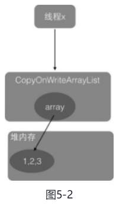
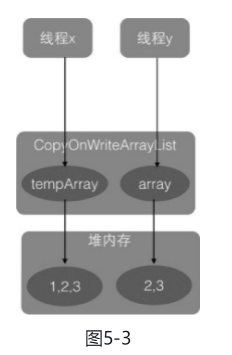

### 5 Java并发包中并发List 源码剖析

#### 1、介绍

并发包中的并发List只有`CopyOnWriteArrayList`。**`CopyOnWriteArrayList`是一个线程安全的ArrayList，对其进行的修改操作都是在底层的一个复制的数组（快照）上进行的，也就是使用了写时复制策略**。 

每个CopyOnWriteArrayList对象里面有一个array数组对象用来存放具体元素，ReentrantLock独占锁对象用来保证同时只有一个线程对array进行修改。**ReentrantLock是独占锁，同时只有一个线程可以获取**。

如果让我们自己做一个写时复制的线程安全的list我们会怎么做，有哪些点需要考虑？

- 何时初始化 list，初始化 list 的元素个数为多少，list 有大小限制吗？
- 如何保证线程安全，比如多个线程进行读写时如何保证时线程安全的？
- 如何保证使用迭代器遍历 list 时的数据一致性？

#### 2、主要方法源码解析 

##### （1）初始化

```java

/** The lock protecting all mutators */
final transient ReentrantLock lock = new ReentrantLock();

/** The array, accessed only via getArray/setArray. */ 使用了 volatile 修饰，保证内存的可见性
private transient volatile Object[] array;

public CopyOnWriteArrayList() {
        setArray(new Object[0]);
}
final void setArray(Object[] a) {
    array = a;
}
/**
     * Creates a list containing the elements of the specified
     * collection, in the order they are returned by the collection's
     * iterator.
     *
     * @param c the collection of initially held elements
     * @throws NullPointerException if the specified collection is null
     */
public CopyOnWriteArrayList(Collection<? extends E> c) {
    Object[] elements;
    if (c.getClass() == CopyOnWriteArrayList.class)
        elements = ((CopyOnWriteArrayList<?>)c).getArray();
    else {
        elements = c.toArray();
        // c.toArray might (incorrectly) not return Object[] (see 6260652)
        if (elements.getClass() != Object[].class)
            elements = Arrays.copyOf(elements, elements.length, Object[].class);
    }
    setArray(elements);
}

/**
     * Creates a list holding a copy of the given array.
     *
     * @param toCopyIn the array (a copy of this array is used as the
     *        internal array)
     * @throws NullPointerException if the specified array is null
     */
public CopyOnWriteArrayList(E[] toCopyIn) {
    setArray(Arrays.copyOf(toCopyIn, toCopyIn.length, Object[].class));
}
```

##### （2）添加元素 

```java
public boolean add(E e) {
    // 获取独占锁
    final ReentrantLock lock = this.lock;
    lock.lock();
    try {
        // 获取数组
        Object[] elements = getArray();
        int len = elements.length;
        // 复制 array 到新数组，添加新元素到新数组
        Object[] newElements = Arrays.copyOf(elements, len + 1);
        newElements[len] = e;
        setArray(newElements);
        return true;
    } finally {
        // 释放独占锁
        lock.unlock();
    }
}
```

调用add方法的线程会首先执行代码（1）去获取独占锁，如果多个线程都调用add方法则只有一个线程会获取到该锁，其他线程会被阻塞挂起直到锁被释放。所以一个线程获取到锁后，就保证了在该线程添加元素的过程中其他线程不会对array进行修改。 

新数组的大小是原来数组大小增加1，所以CopyOnWriteArrayList是无界list。 

然后执行代码（4）使用新数组替换原数组，并在返回前释放锁。由于加了锁，所以整个add过程是个原子性操作。需要注意的是，在添加元素时，首先复制了一个快照，然后在快照上进行添加，而不是直接在原来数组上进行。 

##### （3）获取指定位置元素 

```java
// 步骤 B
private E get(Object[] a, int index) {
    return (E) a[index];
}

/**
 * {@inheritDoc}
 *
 * @throws IndexOutOfBoundsException {@inheritDoc}
 */
public E get(int index) {
    return get(getArray(), index);
}
// 步骤 A
final Object[] getArray() {
    return array;
}
```


get 方法并没有进行加锁同步。由于执行步骤A和步骤B没有加锁，这就可能导致在**线程x执行完步骤A后执行步骤B前**，另外一个线程y进行了remove操作，假设要删除元素1。remove操作首先会获取独占锁，然后进行写时复制操作，也就是复制一份当前array数组，然后在复制的数组里面删除 线程x 通过get方法要访问的元素1，之后让array指向复制的数组。而这时候array之前指向的数组的引用计数为1而不是0，因为线程x还在使用它，这时线程x开始执行步骤B，步骤B操作的数组是线程y删除元素之前的数组，如图5-3所示。



所以，虽然线程y已经删除了index处的元素，但是线程x的步骤B还是会返回index处的元素，这其实就是写时复制策略产生的弱一致性问题。



##### （4）弱一致性的迭代器

所谓弱一致性是**指返回迭代器后，其他线程对list的增删改对迭代器是不可见的**，下面看看这是如何做到的。

```java
public Iterator<E> iterator() {
    return new COWIterator<E>(getArray(), 0);
}
static final class COWIterator<E> implements ListIterator<E> {
    /** Snapshot of the array */
    private final Object[] snapshot;
    /** Index of element to be returned by subsequent call to next.  */
    private int cursor;

    private COWIterator(Object[] elements, int initialCursor) {
        cursor = initialCursor;
        snapshot = elements;
    }

    public boolean hasNext() {
        return cursor < snapshot.length;
    }

    public boolean hasPrevious() {
        return cursor > 0;
    }

    @SuppressWarnings("unchecked")
    public E next() {
        if (! hasNext())
            throw new NoSuchElementException();
        return (E) snapshot[cursor++];
    }
....
}
```

在如上代码中，当调用iterator（）方法获取迭代器时实际上会返回一个COWIterator对象，COWIterator对象的**snapshot变量保存了当前list的内容，cursor是遍历list时数据的下标**。

为什么说snapshot是list的快照呢？明明是指针传递的引用啊，而不是副本。如果在该线程使用返回的迭代器遍历元素的过程中，其他线程没有对list进行增删改，那么snapshot本身就是list的array，因为它们是引用关系。但是如果在遍历期间其他线程对该list进行了增删改，那么snapshot就是快照了，因为增删改后list里面的数组被新数组替换了，这时候老数组被snapshot引用。这也说明获取迭代器后，使用该迭代器元素时，其他线程对该list进行的增删改不可见，因为它们操作的是两个不同的数组，这就是弱一致性。 

```java
CopyOnWriteArrayList<Object> arrayList = new CopyOnWriteArrayList<>();
arrayList.add("hello");
arrayList.add("AAAA");
arrayList.add("BBBB");
arrayList.add("CCCC");
arrayList.add("DDDD");
Thread threadThree = new Thread(() -> {
    arrayList.set(1, "AAAA0000");
    arrayList.remove(2);
    arrayList.remove(3);
});
// 保证在修改线程启动前获取迭代器
Iterator<Object> iterator = arrayList.iterator();
threadThree.start();
threadOne.join();
while (iterator.hasNext()) {
    System.out.println(iterator.next());
}
```

在如上代码中，main函数首先初始化了arrayList，然后在启动线程前获取到了arrayList迭代器。子线程threadOne启动后首先修改了arrayList的第一个元素的值，然后删除了arrayList中下标为2和3的元素。主线程在子线程执行完毕后使用获取的迭代器遍历数组元素，从输出结果我们知道，在子线程里面进行的操作一个都没有生效，这就是迭代器弱一致性的体现。需要注意的是，获取迭代器的操作必须在子线程操作之前进行。  