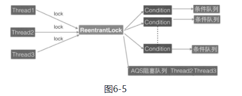
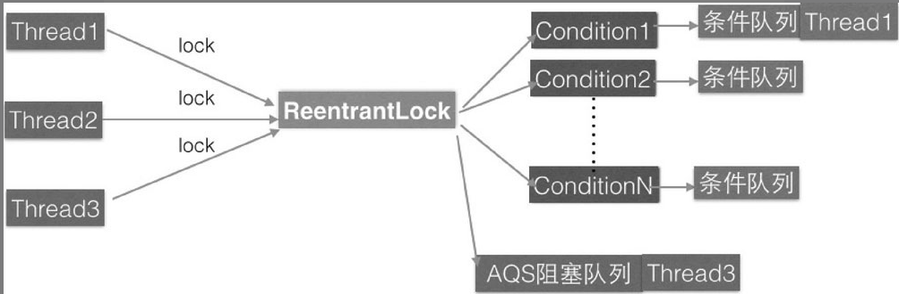

### 3、独占锁 ReentrantLock 的原理

ReentrantLock是可重入的独占锁，同时只能有一个线程可以获取该锁，**其他获取该锁的线程会被阻塞而被放入该锁的AQS阻塞队列里面**。 保证共享数据的安全性。

ReentrantLock最终还是使用AQS来实现的，并且根据参数来决定其内部是一个公平还是非公平锁，默认是非公平锁。

```java
private final Sync sync;
abstract static class Sync extends AbstractQueuedSynchronizer {
    ....
}
public ReentrantLock() {
    sync = new NonfairSync();
}
public ReentrantLock(boolean fair) {
    sync = fair ? new FairSync() : new NonfairSync();
}
```

其中Sync类直接继承自AQS，它的子类NonfairSync和FairSync分别实现了获取锁的非公平与公平策略。

在这里，**AQS的state状态值表示线程获取该锁的可重入次数，在默认情况下，state的值为0表示当前锁没有被任何线程持有**。当一个线程第一次获取该锁时会尝试使用CAS设置state的值为1，如果CAS成功则当前线程获取了该锁，然后记录该锁的持有者为当前线程。在该线程没有释放锁的情况下第二次获取该锁后，状态值被设置为2，这就是可重入次数。**在该线程释放该锁时，会尝试使用CAS让状态值减1，如果减1后状态值为0，则当前线程释放该锁**。 

#### （1）获取锁

##### void lock() 方法

> 调用 lock 方法，锁的是当前调用 lock 方法的线程

**当一个线程调用该方法时，说明该线程希望获取该锁**。如果锁当前没有被其他线程占用并且当前线程之前没有获取过该锁，则当前线程会获取到该锁，然后设置当前锁的拥有者为当前线程，并设置AQS的状态值为1，然后直接返回。如果当前线程之前已经获取过该锁，则这次只是简单地把AQS的状态值加1后返回。如果该锁已经被其他线程持有，则调用该方法的线程会被放入AQS队列后阻塞挂起。

以 非公平锁为例

```java
static final class NonfairSync extends Sync {
    private static final long serialVersionUID = 7316153563782823691L;

    /**
     * Performs lock.  Try immediate barge, backing up to normal
     * acquire on failure.
     */
    final void lock() {
        /**
        * 因为默认AQS的状态值为0，所以第一个调用Lock的线程会通过CAS设置状态值为1, CAS成功则表示当前线程获取到了锁，然后setExclusiveOwnerThread设置该锁持有者是当前线程
        */
        if (compareAndSetState(0, 1))
            setExclusiveOwnerThread(Thread.currentThread());
        else
            acquire(1);
    }

    protected final boolean tryAcquire(int acquires) {
        return nonfairTryAcquire(acquires);
    }
}
```

如果这时候有其他线程调用lock方法企图获取该锁，CAS会失败，然后会调用AQS的acquire方法。

```java
// java.util.concurrent.locks.AbstractQueuedSynchronizer#acquire
public final void acquire(int arg) {
    // tryAcquire(arg) 返回false会将当前线程放入 AQS 阻塞队列。(3)
    if (!tryAcquire(arg) &&
        acquireQueued(addWaiter(Node.EXCLUSIVE), arg))
        selfInterrupt();
}
// tryAcquire(1)调用如下
// java.util.concurrent.locks.ReentrantLock.NonfairSync#tryAcquire
protected final boolean tryAcquire(int acquires) {
    return nonfairTryAcquire(acquires);
}
// java.util.concurrent.locks.ReentrantLock.Sync#nonfairTryAcquire
final boolean nonfairTryAcquire(int acquires) {
    final Thread current = Thread.currentThread();
    int c = getState();
    if (c == 0) { //(4) 当前 AQS 状态值为 0
        if (compareAndSetState(0, acquires)) {
            setExclusiveOwnerThread(current);
            return true;
        }
    }// (5)当前线程是该锁持有者
    else if (current == getExclusiveOwnerThread()) {
        int nextc = c + acquires;
        if (nextc < 0) // overflow
            throw new Error("Maximum lock count exceeded");
        setState(nextc);
        return true;
    }
    return false;
}
```

介绍完了非公平锁的实现代码，回过头来看看非公平在这里是怎么体现的。首先非公平是说先尝试获取锁的线程并不一定比后尝试获取锁的线程优先获取锁。

这里假设线程A调用lock（）方法时执行到nonfairTryAcquire的代码（4），发现当前状态值不为0，所以执行代码（5），发现当前线程不是线程持有者，则执行代码（6）返回false，然后当前线程被放入AQS阻塞队列。

这时候线程B也调用了lock（）方法执行到nonfairTryAcquire的代码（4），发现当前状态值为0了（假设占有该锁的其他线程释放了该锁），所以通过CAS设置获取到了该锁。明明是线程A先请求获取该锁呀，这就是非公平的体现。这里线程B在获取锁前并没有查看当前AQS队列里面是否有比自己更早请求该锁的线程，而是使用了抢夺策略。

---

公平锁

```java
protected final boolean tryAcquire(int acquires) {
    final Thread current = Thread.currentThread();
    int c = getState();
     //(7) 当前 AQS 状态值为 0
    if (c == 0) {
        //(8) 公平性策略
        if (!hasQueuedPredecessors() &&
            compareAndSetState(0, acquires)) {
            setExclusiveOwnerThread(current);
            return true;
        }
    }// (9) 当前线程是该锁持有者
    else if (current == getExclusiveOwnerThread()) {
        int nextc = c + acquires;
        if (nextc < 0)
            throw new Error("Maximum lock count exceeded");
        setState(nextc);
        return true;
    }
    return false;
}

public final boolean hasQueuedPredecessors() {
    // The correctness of this depends on head being initialized
    // before tail and on head.next being accurate if the current
    // thread is first in queue.
    Node t = tail; // Read fields in reverse initialization order
    Node h = head;
    Node s;
    return h != t &&
        ((s = h.next) == null || s.thread != Thread.currentThread());
}
```

在如上代码中，如果当前线程节点有前驱节点则返回true，否则如果当前AQS队列为空或者当前线程节点是AQS的第一个节点则返回false。其中如果h==t则说明当前队列为空，直接返回false；如果h! =t并且s==null则说明有一个元素将要作为AQS的第一个节点入队列（回顾前面的内容，enq函数的第一个元素入队列是两步操作：首先创建一个哨兵头节点，然后将第一个元素插入哨兵节点后面），那么返回true，如果h! =t并且s! =null和s.thread ! =Thread.currentThread（）则说明队列里面的第一个元素不是当前线程，那么返回true。

##### void lockInterruptibly() 方法

该方法与lock（）方法类似，它的不同在于，**它对中断进行响应，就是当前线程在调用该方法时，如果其他线程调用了当前线程的interrupt（）方法，则当前线程会抛出InterruptedException异常，然后返回**。

##### boolean tryLock() 方法 

尝试获取锁，如果当前该锁没有被其他线程持有，则当前线程获取该锁并返回true，否则返回false。注意，该方法不会引起当前线程阻塞。

##### boolean tryLock(long timeout, TimeUnit unit) 方法 

尝试获取锁，与tryLock（）的不同之处在于，它设置了超时时间，如果超时时间到没有获取到该锁则返回false。

#### （2）释放锁

尝试释放锁，如果当前线程持有该锁，则调用该方法会让该线程对该线程持有的AQS状态值减1，如果减去1后当前状态值为0，则当前线程会释放该锁，否则仅仅减1而已。如果当前线程没有持有该锁而调用了该方法则会抛出IllegalMonitorStateException异常。 

```java
public void unlock() {
    sync.release(1);
}
public final boolean release(int arg) {
    if (tryRelease(arg)) {
        Node h = head;
        if (h != null && h.waitStatus != 0)
            unparkSuccessor(h);
        return true;
    }
    return false;
}
protected final boolean tryRelease(int releases) {
    int c = getState() - releases;
    // 如果不是锁持有者调用unlock 则抛出异常
    if (Thread.currentThread() != getExclusiveOwnerThread())
        throw new IllegalMonitorStateException();
    boolean free = false;
    // 如果当前可重入次数为0，则清空持有线程
    if (c == 0) {
        free = true;
        setExclusiveOwnerThread(null);
    }
    // 设置可重入次数为原始值-1
    setState(c);
    return free;
}
```

#### 3 案例介绍

使用ReentrantLock来实现一个简单的线程安全的list.

```java
package com.lanwq.bingfazhimei.chapter2;

import java.util.ArrayList;
import java.util.concurrent.locks.ReentrantLock;

/**
 * @author Vin lan
 * @className ReentrantLockList
 * @description
 * @createTime 2021-11-03  11:20
 **/
public class ReentrantLockList {
    /**
     * 线程不安全的 list
     */
    private ArrayList<String> array = new ArrayList<>();

    /**
     * 独占锁
     */
    private volatile ReentrantLock lock = new ReentrantLock();

    /**
     * 添加元素
     */
    public void add(String e) {
        lock.lock();
        try {
            array.add(e);
        } catch (Exception ex) {
            ex.printStackTrace();
        } finally {
            lock.unlock();
        }
    }

    /**
     * 删除
     */
    public void remove(String e) {
        lock.lock();
        try {
            array.remove(e);
        } catch (Exception ex) {
            ex.printStackTrace();
        } finally {
            lock.unlock();
        }
    }

    /**
     * 获取数据
     */
    public String add(int index) {
        lock.lock();
        try {
            return array.get(index);
        } catch (Exception ex) {
            ex.printStackTrace();
        } finally {
            lock.unlock();
        }
        return null;
    }
}

```

如上代码通过在操作array元素前进行加锁保证同一时间只有一个线程可以对array数组进行修改，但是也只能有一个线程对array元素进行访问。



如图6-5所示，假如线程Thread1、Thread2和Thread3同时尝试获取独占锁ReentrantLock，假设Thread1获取到了，则Thread2和Thread3就会被转换为Node节点并被放入ReentrantLock对应的AQS阻塞队列，而后被阻塞挂起。

如图6-6所示，假设Thread1获取锁后调用了对应的锁创建的条件变量1，那么Thread1就会释放获取到的锁，然后当前线程就会被转换为Node节点插入条件变量1的条件队列。由于Thread1释放了锁，所以阻塞到AQS队列里面的Thread2和Thread3就有机会获取到该锁，假如使用的是公平策略，那么这时候Thread2会获取到该锁，从而从AQS队列里面移除Thread2对应的Node节点



​																图 6-6 

ReentrantLock的底层是使用AQS实现的**可重入独占锁**。在这里AQS状态值为0表示当前锁空闲，为大于等于1的值则说明该锁已经被占用。该锁内部有公平与非公平实现，默认情况下是非公平的实现。另外，由于该锁是独占锁，所以某时只有一个线程可以获取该锁。