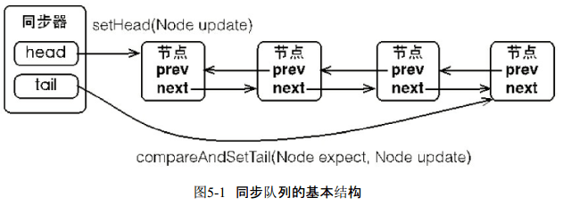
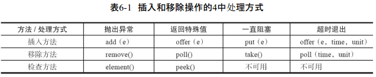

##### 5-8 章节

### 第五章|Java中的锁

#### 5.1 Lock接口

使用synchronized关键字将会隐式地获取锁，但是它将锁的获取和释放固化了，也就是先获取再释放。当然，这种方式简化了同步的管理，可是扩展性没有显示的锁获取和释放来的好。  

```java
Lock lock = new ReentrantLock();
lock.lock();
try {
    
} finally {
	lock.unlock();
}
```

不要将获取锁的过程写在try块中，因为如果在获取锁（自定义锁的实现）时发生了异常，
异常抛出的同时，也会导致锁无故释放。

在finally块中释放锁，目的是保证在获取到锁之后，最终能够被释放。   

​			**表5-1 Lock接口提供的synchronized关键字不具备的主要特性**  


Lock是一个接口，它定义了锁获取和释放的基本操作，Lock的API如表5-2所示。  

​														**表5-2 Lock的API**  


#### 5.2 队列同步器

**队列同步器 AbstractQueuedSynchronizer，是用来构建锁或者其他同步组件的基础框架，它使用了一个int成员变量表示同步状态，通过内置的FIFO队列来完成资源获取线程的排队工作**。

同步器的主要使用方式是继承，子类通过继承同步器并实现它的抽象方法来管理同步状态，在抽象方法的实现过程中免不了要对同步状态进行更改，这时就需要使用同步器提供的3个方法（getState()、setState(int newState)和compareAndSetState(int expect,int update)）来进行操作，因为它们能够保证状态的改变是安全的。

**锁是面向使用者的，它定义了使用者与锁交互的接口（比如可以允许两个线程并行访问），隐藏了实现细节**；**同步器面向的是锁的实现者，它简化了锁的实现方式，屏蔽了同步状态管理、线程的排队、等待与唤醒等底层操作**。  

##### 5.2.1队列同步器的接口与示例

**同步器的设计是基于模板方法模式的**，也就是说，使用者需要继承同步器并重写指定的方法，随后将同步器组合在自定义同步组件的实现中，并调用同步器提供的模板方法，而这些模板方法将会调用使用者重写的方法。重写同步器指定的方法时，需要使用同步器提供的如下3个方法来访问或修改同步状态。

- getState()：获取当前同步状态。
- setState(int newState)：设置当前同步状态。
- compareAndSetState(int expect,int update)：使用CAS设置当前状态，该方法能够保证状态
  设置的原子性。

同步器可重写的方法与描述如表5-3所示。

​													**表5-3 同步器可重写的方法**  


实现自定义同步组件时，将会调用同步器提供的模板方法，这些（部分）模板方法与描述如表5-4所示。

  															**表5-4 同步器提供的模板方法**  


通过独占锁的示例来深入了解同步器的工作原理。

顾名思义，独占锁就是在同一时刻只能有一个线程获取到锁，而其他获取锁的线程只能处于同步队列中等待，只有获取锁的线程释放了锁，后继的线程才能够获取锁，如代码清单5-2所示。  

```java
public class Mutex implements Lock {
    /**
     * 静态内部类，自定义同步器
     */
    private static class Sync extends AbstractQueuedSynchronizer {
        // 是否处于占用状态
        @Override
        protected boolean isHeldExclusively() {
            return getState() == 1;
        }

        // 当状态为0的时候获取锁
        @Override
        public boolean tryAcquire(int acquires) {
            if (compareAndSetState(0, 1)) {
                setExclusiveOwnerThread(Thread.currentThread());
                return true;
            }
            return false;
        }

        // 释放锁，将状态设置为0
        @Override
        protected boolean tryRelease(int releases) {
            if (getState() == 0) {
                throw new IllegalMonitorStateException();
            }
            setExclusiveOwnerThread(null);
            setState(0);
            return true;
        }

        // 返回一个Condition，每个condition都包含了一个condition队列
        Condition newCondition() {
            return new ConditionObject();
        }
    }

    /** 
     * 仅需要将操作代理到Sync上即可
     */
    private final Sync sync = new Sync();

    @Override
    public void lock() {
        sync.acquire(1);
    }

    @Override
    public boolean tryLock() {
        return sync.tryAcquire(1);
    }

    @Override
    public void unlock() {
        sync.release(1);
    }

    @Override
    public Condition newCondition() {
        return sync.newCondition();
    }

    public boolean isLocked() {
        return sync.isHeldExclusively();
    }

    public boolean hasQueuedThreads() {
        return sync.hasQueuedThreads();
    }

    @Override
    public void lockInterruptibly() throws InterruptedException {
        sync.acquireInterruptibly(1);
    }

    @Override
    public boolean tryLock(long timeout, TimeUnit unit) throws InterruptedException {
        return sync.tryAcquireNanos(1, unit.toNanos(timeout));
    }
}
```

##### 5.2.2 队列同步器的实现分析

###### 1 同步队列

同步器依赖内部的同步队列（**一个FIFO双向队列**）来完成同步状态的管理，当前线程获取同步状态失败时，同步器会将当前线程以及等待状态等信息构造成为一个节点（Node）并将其加入同步队列，同时会阻塞当前线程，当同步状态释放时，会把首节点中的线程唤醒，使其再次尝试获取同步状态。

​										**表5-5 节点的属性类型与名称以及描述**  


节点是构成同步队列（等待队列，在5.6节中将会介绍）的基础，同步器拥有首节点（head）
和尾节点（tail），没有成功获取同步状态的线程将会成为节点加入该队列的尾部，同步队列的
基本结构如图5-1所示。



在图5-1中，同步器包含了两个节点类型的引用，一个指向头节点，而另一个指向尾节点。试想一下，当一个线程成功地获取了同步状态（或者锁），其他线程将无法获取到同步状态，转而被构造成为节点并加入到同步队列中，而这个加入队列的过程必须要保证线程安全，因此同步器提供了一个基于CAS的设置尾节点的方法：compareAndSetTail(Node expect,Node update)，它需要传递当前线程“认为”的尾节点和当前节点，只有设置成功后，当前节点才正式与之前的尾节点建立关联。

同步器将节点加入到同步队列的过程如图5-2所示。


同步队列遵循FIFO，首节点是获取同步状态成功的节点，首节点的线程在释放同步状态时，将会唤醒后继节点，而后继节点将会在获取同步状态成功时将自己设置为首节点，该过程如图5-3所示

  

在图5-3中，设置首节点是通过获取同步状态成功的线程来完成的，由于只有一个线程能够成功获取到同步状态，因此设置头节点的方法并不需要使用CAS来保证，它只需要将首节点设置成为原首节点的后继节点并断开原首节点的next引用即可。

###### 2 独占锁同步状态获取与释放

通过调用同步器的acquire(int arg)方法可以获取同步状态，该方法对中断不敏感，也就是由于线程获取同步状态失败后进入同步队列中，后续对线程进行中断操作时，线程不会从同步队列中移出，该方法代码如代码清单5-3所示。

```java
public final void acquire(int arg) {
    if (!tryAcquire(arg) &&
        acquireQueued(addWaiter(Node.EXCLUSIVE), arg))
        selfInterrupt();
}
```

主要逻辑是：首先调用自定义同步器实现的tryAcquire(int arg)方法，该方法保证线程安全的获取同步状态，如果同步状态获取失败，则构造同步节点（独占式Node.EXCLUSIVE，同一时刻只能有一个线程成功获取同步状态）并**通过addWaiter(Node node)方法将该节点加入到同步队列的尾部，最后调用acquireQueued(Node node,int arg)方法，使得该节点以“死循环”的方式获取同步状态**。如果获取不到则阻塞节点中的线程，而被阻塞线程的唤醒主要依靠前驱节点的出队或阻塞线程被中断来实现。

```java
private Node addWaiter(Node mode) {
    Node node = new Node(Thread.currentThread(), mode);
    // Try the fast path of enq; backup to full enq on failure
    Node pred = tail;
    if (pred != null) {
        node.prev = pred;
        if (compareAndSetTail(pred, node)) {
            pred.next = node;
            return node;
        }
    }
    enq(node);
    return node;
}
private Node enq(final Node node) {
    for (;;) {
        Node t = tail;
        if (t == null) { // Must initialize
            if (compareAndSetHead(new Node()))
                tail = head;
        } else {
            node.prev = t;
            if (compareAndSetTail(t, node)) {
                t.next = node;
                return t;
            }
        }
    }
}
```

**节点进入同步队列之后，就进入了一个自旋的过程，每个节点（或者说每个线程）都在自省地观察，当条件满足，获取到了同步状态，就可以从这个自旋过程中退出，否则依旧留在这个自旋过程中（并会阻塞节点的线程）**。

```java
final boolean acquireQueued(final Node node, int arg) {
    boolean failed = true;
    try {
        boolean interrupted = false;
        for (;;) {
            final Node p = node.predecessor();
            if (p == head && tryAcquire(arg)) {
                setHead(node);
                p.next = null; // help GC
                failed = false;
                return interrupted;
            }
            if (shouldParkAfterFailedAcquire(p, node) &&
                parkAndCheckInterrupt())
                interrupted = true;
        }
    } finally {
        if (failed)
            cancelAcquire(node);
    }
}
```

在acquireQueued(final Node node,int arg)方法中，当前线程在“死循环”中尝试获取同步状
态，而**只有前驱节点是头节点才能够尝试获取同步状态，这是为什么**？原因有两个，如下：

第一：  头节点是成功获取到同步状态的节点，而头节点的线程释放了同步状态之后，将会唤醒其后继节点，后继节点的线程被唤醒后需要检查自己的前驱节点是否是头节点。  

第二，维护同步队列的FIFO原则。该方法中，节点自旋获取同步状态的行为如图5-4所示。


在图5-4中，**由于非首节点线程前驱节点出队或者被中断而从等待状态返回，随后检查自己的前驱是否是头节点，如果是则尝试获取同步状态**。可以看到节点和节点之间在循环检查的过程中基本不相互通信，而是简单地判断自己的前驱是否为头节点，这样就使得节点的释放规则符合FIFO，并且也便于对过早通知的处理（过早通知是指前驱节点不是头节点的线程由于中断而被唤醒）。

独占式同步状态获取流程，也就是acquire(int arg)方法调用流程，如图5-5所示  


当前线程获取同步状态并执行了相应逻辑之后，就需要释放同步状态，使得后续节点能够继续获取同步状态。通过调用同步器的release(int arg)方法可以释放同步状态，该方法在释放了同步状态之后，会唤醒其后继节点（进而使后继节点重新尝试获取同步状态）。  

```java
public final boolean release(int arg) {
    if (tryRelease(arg)) {
        Node h = head;
        if (h != null && h.waitStatus != 0)
            unparkSuccessor(h);
        return true;
    }
    return false;
}
```

该方法执行时，会唤醒头节点的后继节点线程。

###### 3 共享式同步状态获取与释放

共享式获取与独占式获取最主要的区别在于同一时刻能否有多个线程同时获取到同步状态。以文件的读写为例，如果一个程序在对文件进行读操作，那么这一时刻对于该文件的写操作均被阻塞，而读操作能够同时进行。**写操作要求对资源的独占式访问，而读操作可以是共享式访问，两种不同的访问模式在同一时刻对文件或资源的访问情况**，如图5-6所示。


左半部分，共享式访问资源时，其他共享式的访问均被允许，而独占式访问被阻塞，右半部分是独占式访问资源时，同一时刻其他访问均被阻塞。

```java
public final void acquireShared(int arg) {
    if (tryAcquireShared(arg) < 0)
        doAcquireShared(arg);
}
private void doAcquireShared(int arg) {
    final Node node = addWaiter(Node.SHARED);
    boolean failed = true;
    try {
        boolean interrupted = false;
        for (;;) {
            final Node p = node.predecessor();
            if (p == head) {
                int r = tryAcquireShared(arg);
                if (r >= 0) {
                    setHeadAndPropagate(node, r);
                    p.next = null; // help GC
                    if (interrupted)
                        selfInterrupt();
                    failed = false;
                    return;
                }
            }
            if (shouldParkAfterFailedAcquire(p, node) &&
                parkAndCheckInterrupt())
                interrupted = true;
        }
    } finally {
        if (failed)
            cancelAcquire(node);
    }
}
```

在acquireShared(int arg)方法中，同步器调用tryAcquireShared(int arg)方法尝试获取同步状
态，tryAcquireShared(int arg)方法返回值为int类型，当返回值大于等于0时，表示能够获取到同
步状态。因此，在共享式获取的自旋过程中，成功获取到同步状态并退出自旋的条件就是
tryAcquireShared(int arg)方法返回值大于等于0。可以看到，在doAcquireShared(int arg)方法的自旋过程中，如果当前节点的前驱为头节点时，尝试获取同步状态，如果返回值大于等于0，表示该次获取同步状态成功并从自旋过程中退出。    

```java
public final boolean releaseShared(int arg) {
    if (tryReleaseShared(arg)) {
        doReleaseShared();
        return true;
    }
    return false;
}
```

该方法在释放同步状态之后，将会唤醒后续处于等待状态的节点。对于能够支持多个线程同时访问的并发组件（比如Semaphore），它和独占式主要区别在于tryReleaseShared(int arg)方法必须确保同步状态（或者资源数）线程安全释放，一般是通过循环和CAS来保证的，因为释放同步状态的操作会同时来自多个线程。

#### 5.3 重入锁

##### 1 实现重进入

重进入是指任意线程在获取到锁之后能够再次获取该锁而不会被锁所阻塞，该特性的实
现需要解决以下两个问题。

（1）**线程再次获取锁**。锁需要去识别获取锁的线程是否为当前占据锁的线程，如果是，则再次成功获取。

（2）锁的最终释放。线程重复n次获取了锁，随后在第n次释放该锁后，其他线程能够获取到该锁。锁的最终释放要求锁对于获取进行计数自增，计数表示当前锁被重复获取的次数，而锁被释放时，计数自减，当计数等于0时表示锁已经成功释放。

如下代码：

```java
final boolean nonfairTryAcquire(int acquires) {
    final Thread current = Thread.currentThread();
    int c = getState();
    if (c == 0) {
        if (compareAndSetState(0, acquires)) {
            setExclusiveOwnerThread(current);
            return true;
        }
    }
    else if (current == getExclusiveOwnerThread()) {
        int nextc = c + acquires;
        if (nextc < 0) // overflow
            throw new Error("Maximum lock count exceeded");
        setState(nextc);
        return true;
    }
    return false;
}
```

成功获取锁的线程再次获取锁，只是增加了同步状态值，这也就要求ReentrantLock在释放同步状态时减少同步状态值。

```java
protected final boolean tryRelease(int releases) {
    int c = getState() - releases;
    if (Thread.currentThread() != getExclusiveOwnerThread())
        throw new IllegalMonitorStateException();
    boolean free = false;
    if (c == 0) {
        free = true;
        setExclusiveOwnerThread(null);
    }
    setState(c);
    return free;
}
```

如果该锁被获取了n次，那么前(n-1)次tryRelease(int releases)方法必须返回false，而只有同步状态完全释放了，才能返回true。可以看到，该方法将同步状态是否为0作为最终释放的条件，当同步状态为0时，将占有线程设置为null，并返回true，表示释放成功。  

##### 2 公平锁和非公平锁的区别

公平性与否是针对获取锁而言的，**如果一个锁是公平的，那么锁的获取顺序就应该符合请求的绝对时间顺序，也就是FIFO**。

```java
protected final boolean tryAcquire(int acquires) {
    final Thread current = Thread.currentThread();
    int c = getState();
    if (c == 0) {
        if (!hasQueuedPredecessors() &&
            compareAndSetState(0, acquires)) {
            setExclusiveOwnerThread(current);
            return true;
        }
    }
    else if (current == getExclusiveOwnerThread()) {
        int nextc = c + acquires;
        if (nextc < 0)
            throw new Error("Maximum lock count exceeded");
        setState(nextc);
        return true;
    }
    return false;
}
```

该方法与nonfairTryAcquire(int acquires)比较，唯一不同的位置为判断条件多了hasQueuedPredecessors()方法，即加入了**同步队列中当前节点是否有前驱节点的判断，如果该方法返回true，则表示有线程比当前线程更早地请求获取锁，因此需要等待前驱线程获取并释放锁之后才能继续获取锁**。

#### 5.4 读写锁

读写锁维护了一对锁，一个读锁和一个写锁，通过分离读锁和写锁，使得并发性相比一般的排他锁有了很大提升。

一般情况下，读写锁的性能都会比排它锁好，因为大多数场景读是多于写的。在读多于写的情况下，读写锁能够提供比排它锁更好的并发性和吞吐量。Java并发包提供读写锁的实现是
**ReentrantReadWriteLock**。特性：


##### 读写锁的实现分析

###### 1 读写状态的设计

读写锁同样依赖自定义同步器来实现同步功能，而读写状态就是其同步器的同步状态。读写锁的自定义同步器需要**在同步状态（一个整型变量）上维护多个读线程和一个写线程的状态**，使得该状态的设计成为读写锁实现的关键。

如果在一个整型变量上维护多种状态，就一定需要“按位切割使用”这个变量，读写锁将变量切分成了两个部分，**高16位表示读，低16位表示写**，划分方式如图5-8所示。  


当前同步状态表示一个线程已经获取了写锁，且重进入了两次，同时也连续获取了两次读锁。**读写锁是如何迅速确定读和写各自的状态呢**？答案是**通过位运算**。 

假设**当前同步状态值为S**，写状态等于S&0x0000FFFF（**将高16位全部抹去**），读状态等于S>>>16（**无符号补0右移16位**）。当写状态增加1时，等于S+1，当读状态增加1时，等于S+(1<<16)，也就是S+0x00010000。    

根据状态的划分能得出一个推论：S不等于0时，当写状态（S&0x0000FFFF）等于0时，则读状态（S>>>16）大于0，即读锁已被获取。  

###### 2 写锁的获取与释放

**写锁是一个支持重进入的排它锁**。**如果当前线程已经获取了写锁，则增加写状态**。**如果当前线程在获取写锁时，读锁已经被获取（读状态不为0）或者该线程不是已经获取写锁的线程，则当前线程进入等待状态**，获取写锁的代码如代码清单5-17所示。

```Java
protected final boolean tryAcquire(int acquires) {
    Thread current = Thread.currentThread();
    int c = getState();
    int w = exclusiveCount(c);
    if (c != 0) {
         // 存在读锁或者当前获取线程不是已经获取写锁的线程
        // (Note: if c != 0 and w == 0 then shared count != 0)
        if (w == 0 || current != getExclusiveOwnerThread())
            return false;
        if (w + exclusiveCount(acquires) > MAX_COUNT)
            throw new Error("Maximum lock count exceeded");
        // Reentrant acquire
        setState(c + acquires);
        return true;
    }
    if (writerShouldBlock() ||
        !compareAndSetState(c, c + acquires))
        return false;
    setExclusiveOwnerThread(current);
    return true;
}
```

**如果存在读锁，则写锁不能被获取**，原因在于：**读写锁要确保写锁的操作对读锁可见，如果允许读锁在已被获取的情况下对写锁的获取，那么正在运行的其他读线程就无法感知到当前写线程的操作**。因此，只有等待其他读线程都释放了读锁，写锁才能被当前线程获取，而写锁一旦被获取，则其他读写线程的后续访问均被阻塞。 

######  3 读锁的获取与释放

**读锁是一个支持重进入的共享锁，它能够被多个线程同时获取，在没有其他写线程访问（或者写状态为0）时，读锁总会被成功地获取，而所做的也只是（线程安全的）增加读状态**。如果当前线程已经获取了读锁，则增加读状态。如果当前线程在获取读锁时，写锁已被其他线程获取，则进入等待状态。 

获取读锁的实现从Java 5到Java 6变得复杂许多，主要原因是新增了一些功能，例如getReadHoldCount()方法，作用是返回当前线程获取读锁的次数。读状态是所有线程获取读锁次数的总和，而每个线程各自获取读锁的次数只能选择保存在ThreadLocal中，由线程自身维护，这使获取读锁的实现变得复杂。   

###### 4 锁降级

不是很理解，先记录。

**锁降级指的是写锁降级成为读锁**。如果当前线程拥有写锁，然后将其释放，最后再获取读锁，这种分段完成的过程不能称之为锁降级。**锁降级是指把持住（当前拥有的）写锁，再获取到读锁，随后释放（先前拥有的）写锁的过程**。  

接下来看一个锁降级的示例。因为数据不常变化，所以多个线程可以并发地进行数据处理，当数据变更后，如果当前线程感知到数据变化，则进行数据的准备工作，同时其他处理线程被阻塞，直到当前线程完成数据的准备工作，如代码清单5-19所示。  

```java
public void processData() {
	readLock.lock();
    if (!update) {
        // 必须先释放读锁
        readLock.unlock();
        // 锁降级从写锁获取到开始
        writeLock.lock();
        try {
            if (!update) {
                // 准备数据的流程（略）
                update = true;
        	}
            readLock.lock();
        } finally {
            writeLock.unlock();
        }
       // 锁降级完成，写锁降级为读锁
    }
    try {// 使用数据的流程（略）
    } finally {
        readLock.unlock();
    }
}
```

上述示例中，当数据发生变更后，update变量（布尔类型且volatile修饰）被设置为false，此时所有访问processData()方法的线程都能够感知到变化，但只有一个线程能够获取到写锁，其他线程会被阻塞在读锁和写锁的lock()方法上。当前线程获取写锁完成数据准备之后，再获取读锁，随后释放写锁，完成锁降级。  

锁降级中读锁的获取是否必要呢？答案是必要的。**主要是为了保证数据的可见性，如果当前线程不获取读锁而是直接释放写锁，假设此刻另一个线程（记作线程T）获取了写锁并修改了数据，那么当前线程无法感知线程T的数据更新**。**如果当前线程获取读锁，即遵循锁降级的步骤，则线程T将会被阻塞，直到当前线程使用数据并释放读锁之后，线程T才能获取写锁进行数据更新**。

RentrantReadWriteLock不支持锁升级（把持读锁、获取写锁，最后释放读锁的过程）。目的也是保证数据可见性，如果读锁已被多个线程获取，其中任意线程成功获取了写锁并更新了数据，则其更新对其他获取到读锁的线程是不可见的。 

#### 5.5 LockSupport工具

#### 5.6 Condition 接口


##### 接口与示例

使用方式如下：

```java
Lock lock = new ReentrantLock();
Condition condition = lock.newCondition();
public void conditionWait() throws InterruptedException {
    lock.lock();
    try {
    	condition.await();
    } finally {
    	lock.unlock();
    }
}
public void conditionSignal() throws InterruptedException {
    lock.lock();
    try {
    	condition.signal();
    } finally {
    	lock.unlock();
    }
}
```

如示例所示，一般都会将Condition对象作为成员变量。当调用await()方法后，当前线程会释放锁并在此等待，而其他线程调用Condition对象的signal()方法，通知当前线程后，当前线程才从await()方法返回，并且在返回前已经获取了锁。  

有界队列是一种特殊的队列，当队列为空时，队列的获取操作将会阻塞获取线程，直到队列中有新增元素，当队列已满时，队列的插入操作将会阻塞插入线程，直到队列出现“空位“。

##### condition的实现与分析

ConditionObject是同步器AbstractQueuedSynchronizer的内部类，因为Condition的操作需要获取相关联的锁，所以作为同步器的内部类也较为合理。每个Condition对象都包含着一个队列（以下称为等待队列），该队列是Condition对象实现等待/通知功能的关键。

###### 1 等待队列

**等待队列是一个FIFO的队列，在队列中的每个节点都包含了一个线程引用，该线程就是在Condition对象上等待的线程**，**如果一个线程调用了Condition.await()方法，那么该线程将会释放锁、构造成节点加入等待队列并进入等待状态**。事实上，节点的定义复用了同步器中节点的定义，也就是说，同步队列和等待队列中节点类型都是同步器的静态内部类AbstractQueuedSynchronizer.Node。

一个Condition包含一个等待队列，Condition拥有首节点（firstWaiter）和尾节点（lastWaiter）。当前线程调用Condition.await()方法，将会以当前线程构造节点，并将节点从尾部加入等待队列，等待队列的基本结构如图5-9所示。  


如图所示，Condition拥有首尾节点的引用，而新增节点只需要将原有的尾节点nextWaiter指向它，并且更新尾节点即可。上述节点引用更新的过程并没有使用CAS保证，原因**在于调用await()方法的线程必定是获取了锁的线程，也就是说该过程是由锁来保证线程安全的**。  

在Object的监视器模型上，一个对象拥有一个同步队列和等待队列，而**并发包中的Lock（更确切地说是同步器）拥有一个同步队列和多个等待队列**。  


###### 2 等待

调用Condition的await()方法（或者以await开头的方法），会使当前线程进入等待队列并释放锁，同时线程状态变为等待状态。当从await()方法返回时，当前线程一定获取了Condition相关联的锁。

```java
public final void await() throws InterruptedException {
    if (Thread.interrupted())
        throw new InterruptedException();
    // 当前线程加入等待队列
    Node node = addConditionWaiter();
    // 释放同步状态，也就是释放锁
    int savedState = fullyRelease(node);
    int interruptMode = 0;
    while (!isOnSyncQueue(node)) {
        LockSupport.park(this);
        if ((interruptMode = checkInterruptWhileWaiting(node)) != 0)
            break;
    }
    if (acquireQueued(node, savedState) && interruptMode != THROW_IE)
        interruptMode = REINTERRUPT;
    if (node.nextWaiter != null) // clean up if cancelled
        unlinkCancelledWaiters();
    if (interruptMode != 0)
        reportInterruptAfterWait(interruptMode);
}
```

调用该方法的线程成功获取了锁的线程，也就是同步队列中的首节点，该方法会将当前线程构造成节点并加入等待队列中，然后释放同步状态，唤醒同步队列中的后继节点，然后当前线程会进入等待状态。  

当等待队列中的节点被唤醒，则唤醒节点的线程开始尝试获取同步状态。如果不是通过其他线程调用Condition.signal()方法唤醒，而是对等待线程进行中断，则会抛出InterruptedException。

如果从队列的角度去看，当前线程加入Condition的等待队列，该过程如图5-11示。如图所示，同步队列的首节点并不会直接加入等待队列，而是通过addConditionWaiter()方法把当前线程构造成一个新的节点并将其加入等待队列中。  

###### 3 通知

调用Condition的signal()方法，将会唤醒在等待队列中等待时间最长的节点（首节点），在唤醒节点之前，会将节点移到同步队列中。  


```java
public final void signal() {
    if (!isHeldExclusively())
        throw new IllegalMonitorStateException();
    Node first = firstWaiter;
    if (first != null)
        doSignal(first);
}
```

调用该方法的前置条件是当前线程必须获取了锁，可以看到signal()方法进行了
isHeldExclusively()检查，也就是当前线程必须是获取了锁的线程。接着获取等待队列的首节点，将其移动到同步队列并使用LockSupport唤醒节点中的线程。  


通过调用同步器的enq(Node node)方法，等待队列中的头节点线程安全地移动到同步队列。当节点移动到同步队列后，当前线程再使用LockSupport唤醒该节点的线程。  

被唤醒后的线程，将从await()方法中的while循环中退出（isOnSyncQueue(Node node)方法返回true，节点已经在同步队列中），进而调用同步器的acquireQueued()方法加入到获取同步状态的竞争中。

成功获取同步状态（或者说锁）之后，被唤醒的线程将从先前调用的await()方法返回，此时该线程已经成功地获取了锁。

Condition的signalAll()方法，相当于对等待队列中的每个节点均执行一次signal()方法，效果就是将等待队列中所有节点全部移动到同步队列中，并唤醒每个节点的线程。  

### 6 并发容器和框架

#### 6.1 ConcurrentHashMap的实现原理与使用  

##### 6.1.1 为什么要使用ConcurrentHashMap  

（1）线程不安全的HashMap  

HashMap在并发执行put操作时会引起死循环，是因为多线程会导致HashMap的Entry链表形成环形数据结构，一旦形成环形数据结构，Entry的next节点永远不为空，就会产生死循环获取Entry。  

（2）效率低下的HashTable  

HashTable容器使用synchronized来保证线程安全，但在线程竞争激烈的情况下HashTable的效率非常低下。因为当一个线程访问HashTable的同步方法，其他线程也访问HashTable的同步方法时，会进入阻塞或轮询状态。如线程1使用put进行元素添加，线程2不但不能使用put方法添加元素，也不能使用get方法来获取元素，所以竞争越激烈效率越低。

（3）ConcurrentHashMap的锁分段技术可有效提升并发访问率  

##### 6.1.2 ConcurrentHashMap的结构 

ConcurrentHashMap是由Segment数组结构和HashEntry数组结构组成。**Segment是一种可重入锁（ReentrantLock），在ConcurrentHashMap里扮演锁的角色**；**HashEntry则用于存储键值对数据**。

**一个ConcurrentHashMap里包含一个Segment数组**。**Segment的结构和HashMap类似，是一种数组和链表结构**。**一个Segment里包含一个HashEntry数组，每个HashEntry是一个链表结构的元素，每个Segment守护着一个HashEntry数组里的元素，当对HashEntry数组的数据进行修改时，必须首先获得与它对应的Segment锁**。

 

#### 6.3 java中的阻塞队列

##### 6.3.1 什么是阻塞队列

阻塞队列（BlockingQueue）是一个支持两个附加操作的队列。这两个附加的操作支持阻塞的插入和移除方法。

）支持阻塞的插入方法：意思是当队列满时，队列会阻塞插入元素的线程，直到队列不满。

2）支持阻塞的移除方法：意思是在队列为空时，获取元素的线程会等待队列变为非空。  

阻塞队列常用于生产者和消费者的场景，生产者是向队列里添加元素的线程，消费者是从队列里取元素的线程。阻塞队列就是生产者用来存放元素、消费者用来获取元素的容器。  

在阻塞队列不可用时，这两个附加操作提供了4种处理方式，如表6-1所示。



- 抛出异常：当队列满时，如果再往队列里插入元素，会抛出IllegalStateException（"Queuefull"）异常。当队列空时，从队列里获取元素会抛出NoSuchElementException异常。
- 返回特殊值：当往队列插入元素时，会返回元素是否插入成功，成功返回true。如果是移
  除方法，则是从队列里取出一个元素，如果没有则返回null。
- 一直阻塞：当阻塞队列满时，如果生产者线程往队列里put元素，队列会一直阻塞生产者
  线程，直到队列可用或者响应中断退出。当队列空时，如果消费者线程从队列里take元素，队列会阻塞住消费者线程，直到队列不为空。
- 超时退出：当阻塞队列满时，如果生产者线程往队列里插入元素，队列会阻塞生产者线程
  一段时间，如果超过了指定的时间，生产者线程就会退出。  

> 如果是无界阻塞队列，队列不可能会出现满的情况，所以使用put或offer方法永远不会被阻塞，而且使用offer方法时，该方法永远返回true。  

##### 6.3.2 Java里的阻塞队列

- ArrayBlockingQueue：一个由数组结构组成的有界阻塞队列。

- LinkedBlockingQueue：一个由链表结构组成的有界阻塞队列。
- PriorityBlockingQueue：一个支持优先级排序的无界阻塞队列。
- DelayQueue：一个使用优先级队列实现的无界阻塞队列。
- SynchronousQueue：一个不存储元素的阻塞队列。
- LinkedTransferQueue：一个由链表结构组成的无界阻塞队列。
- LinkedBlockingDeque：一个由链表结构组成的双向阻塞队列。  

###### ArrayBlockingQueue

ArrayBlockingQueue是一个**用数组实现的有界阻塞队列**。此队列按照先进先出（FIFO）的原则对元素进行排序。

**默认情况下不保证线程公平的访问队列**，所谓公平访问队列是指阻塞的线程，可以按照阻塞的先后顺序访问队列，即先阻塞线程先访问队列。非公平性是对先等待的线程是非公平的，当队列可用时，阻塞的线程都可以争夺访问队列的资格，有可能先阻塞的线程最后才访问队列。

###### LinkedBlockingQueue

LinkedBlockingQueue是一个用**链表实现的有界阻塞队列**。此队列的默认和最大长度为Integer.MAX_VALUE。**此队列按照先进先出的原则对元素进行排序**。

###### PriorityBlockingQueue

PriorityBlockingQueue是一个**支持优先级的无界阻塞队列**。**默认情况下元素采取自然顺序升序排列**。

也可以自定义类实现compareTo()方法来指定元素排序规则，或者初始化PriorityBlockingQueue时，指定构造参数Comparator来对元素进行排序。**需要注意的是不能保证同优先级元素的顺序**。  

###### DelayQueue

DelayQueue是一个**支持延时获取元素的无界阻塞队列**。**队列使用PriorityQueue来实现**。队列中的元素必须实现Delayed接口，在创建元素时可以指定多久才能从队列中获取当前元素。

只有在延迟期满时才能从队列中提取元素。

应用场景

- 缓存系统的设计。可以用DelayQueue保存缓存元素的有效期，使用一个线程循环查询
  DelayQueue，一旦能从DelayQueue中获取元素时，表示缓存有效期到了。  
- 定时任务调度。使用DelayQueue保存当天将会执行的任务和执行时间，一旦从
  DelayQueue中获取到任务就开始执行，比如TimerQueue就是使用DelayQueue实现的。

###### SynchronousQueue  

SynchronousQueue是**一个不存储元素的阻塞队列**。每一个put操作必须等待一个take操作，否则不能继续添加元素。

它支持公平访问队列。**默认情况下线程采用非公平性策略访问队列**。使用以下构造方法可以创建公平性访问的SynchronousQueue，如果设置为true，则等待的线程会采用先进先出的顺序访问队列。  

```java
public SynchronousQueue() {
    this(false);
}
public SynchronousQueue(boolean fair) {
    transferer = fair ? new TransferQueue<E>() : new TransferStack<E>();
}
```

SynchronousQueue可以看成是一个传球手，负责把生产者线程处理的数据直接传递给消费者线程。队列本身并不存储任何元素，非常适合传递性场景。SynchronousQueue的吞吐量高于LinkedBlockingQueue和ArrayBlockingQueue。

###### LinkedTransferQueue

LinkedTransferQueue是**一个由链表结构组成的无界阻塞TransferQueue队列**。相对于其他阻塞队列，LinkedTransferQueue多了tryTransfer和transfer方法。  

（1）transfer方法

**如果当前有消费者正在等待接收元素（消费者使用take()方法或带时间限制的poll()方法时）**，**transfer方法可以把生产者传入的元素立刻transfer（传输）给消费者**。**如果没有消费者在等待接收元素，transfer方法会将元素存放在队列的tail节点，并等到该元素被消费者消费了才返回**。transfer方法的关键代码如下。  

（2）tryTransfer方法  

**tryTransfer方法是用来试探生产者传入的元素是否能直接传给消费者**。**如果没有消费者等待接收元素，则返回false**。和transfer方法的区别是**tryTransfer方法无论消费者是否接收，方法立即返回，而transfer方法是必须等到消费者消费了才返回**。

对于带有时间限制的tryTransfer（E e，long timeout，TimeUnit unit）方法，试图把生产者传入的元素直接传给消费者，但是如果没有消费者消费该元素则等待指定的时间再返回，如果超时还没消费元素，则返回false，如果在超时时间内消费了元素，则返回true。  

###### LinkedBlockingDeque

LinkedBlockingDeque是**一个由链表结构组成的双向阻塞队列**。所谓双向队列指的是可以从队列的两端插入和移出元素。双向队列因为多了一个操作队列的入口，在多线程同时入队时，也就减少了一半的竞争。  

另外，插入方法add等同于addLast，移除方法remove等效于removeFirst。但是take方法却等同于takeFirst，不知道是不是JDK的bug，**使用时还是用带有First和Last后缀的方法更清楚**。  

**在初始化LinkedBlockingDeque时可以设置容量防止其过度膨胀**。另外，双向阻塞队列可以运用在“工作窃取”模式中。 

##### 6.3.3 阻塞队列实现的原理

**使用通知模式实现**。

所谓通知模式，就是当生产者往满的队列里添加元素时会阻塞住生产者，当消费者消费了一个队列中的元素后，会通知生产者当前队列可用。通过查看JDK源码发现ArrayBlockingQueue使用了Condition来实现，代码如下。

```java
/** Main lock guarding all access */
final ReentrantLock lock;

/** Condition for waiting takes */
private final Condition notEmpty;

/** Condition for waiting puts */
private final Condition notFull;

public ArrayBlockingQueue(int capacity, boolean fair) {
    if (capacity <= 0)
        throw new IllegalArgumentException();
    this.items = new Object[capacity];
    lock = new ReentrantLock(fair);
    notEmpty = lock.newCondition();
    notFull =  lock.newCondition();
}

public void put(E e) throws InterruptedException {
    checkNotNull(e);
    final ReentrantLock lock = this.lock;
    lock.lockInterruptibly();
    try {
        while (count == items.length)
            notFull.await();
        enqueue(e);
    } finally {
        lock.unlock();
    }
}

public E take() throws InterruptedException {
    final ReentrantLock lock = this.lock;
    lock.lockInterruptibly();
    try {
        while (count == 0)
            notEmpty.await();
        return dequeue();
    } finally {
        lock.unlock();
    }
}
```

当往队列里插入一个元素时，如果队列不可用，那么阻塞生产者主要通过LockSupport.park（this）来实现。  

```java
public final void await() throws InterruptedException {
    if (Thread.interrupted())
        throw new InterruptedException();
    Node node = addConditionWaiter();
    int savedState = fullyRelease(node);
    int interruptMode = 0;
    while (!isOnSyncQueue(node)) {
        // 这个位置
        LockSupport.park(this);
        if ((interruptMode = checkInterruptWhileWaiting(node)) != 0)
            break;
    }
    if (acquireQueued(node, savedState) && interruptMode != THROW_IE)
        interruptMode = REINTERRUPT;
    if (node.nextWaiter != null) // clean up if cancelled
        unlinkCancelledWaiters();
    if (interruptMode != 0)
        reportInterruptAfterWait(interruptMode);
}

    public static void park(Object blocker) {
        Thread t = Thread.currentThread();
        setBlocker(t, blocker);
        UNSAFE.park(false, 0L);
        setBlocker(t, null);
    }
```

继续进入源码，**发现调用setBlocker先保存一下将要阻塞的线程，然后调用unsafe.park阻塞当前线程**。

unsafe.park是个native方法，park这个方法会阻塞当前线程，只有以下4种情况中的一种发生时，该方法才会返回。

- 与park对应的unpark执行或已经执行时。“已经执行”是指unpark先执行，然后再执行park的情况。  
- 线程被中断时。
- 等待完time参数指定的毫秒数时。
- 异常现象发生时，这个异常现象没有任何原因。


### 7 Java中的13个原子操作类

#### 7.1 原子更新基本类型类

- AtomicBoolean：原子更新布尔类型。
- AtomicInteger：原子更新整型。
- AtomicLong：原子更新长整型。  

AtomicInteger 的常用方法如下：

- int addAndGet（int delta）：以原子方式将输入的数值与实例中的值（AtomicInteger里的value）相加，并返回结果。  
- int getAndIncrement()：以原子方式将当前值加1，注意，**这里返回的是自增前的值**。  
- boolean compareAndSet（int expect，int update）：如果输入的数值等于预期值，则以原子方式将该值设置为输入的值。
- void lazySet（int newValue）：最终会设置成newValue，使用lazySet设置值后，可能导致其他线程在之后的一小段时间内还是可以读到旧的值。可参考：[《AtomicLong.lazySet是如何工作的？》  ](http://ifeve.com/howdoes-atomiclong-lazyset-work/  ) 

- int getAndSet（int newValue）：以原子方式设置为newValue的值，并返回旧值  

getAndIncrement  的是如何实现原子操作的呢？

```java
/**
 * Atomically increments by one the current value.
 *
 * @return the previous value
 */
public final int getAndIncrement() {
    return unsafe.getAndAddInt(this, valueOffset, 1);
}

public final int getAndAddInt(Object var1, long var2, int var4) {
    int var5;
    do {
        var5 = this.getIntVolatile(var1, var2);
    } while(!this.compareAndSwapInt(var1, var2, var5, var5 + var4));
    return var5;
}
```

获取对象在这个偏移量的值，如果没有做更改则说明没有修改，设置并交换值，交换失败继续获取，重复这个操作。其他的原子更新也是类似这种原理。

```java
public final native boolean compareAndSwapObject(Object var1, long var2, Object var4, Object var5);

public final native boolean compareAndSwapInt(Object var1, long var2, int var4, int var5);

public final native boolean compareAndSwapLong(Object var1, long var2, long var4, long var6);
```

通过代码，我们发现Unsafe只提供了3种CAS方法：compareAndSwapObject、compareAndSwapInt和compareAndSwapLong，再看AtomicBoolean源码，发现它是先把Boolean转换成整型，再使用compareAndSwapInt进行CAS，所以原子更新char、float和double变量也可以用类似的思路来实现。  

#### 7.1 原子更新数组

- AtomicIntegerArray：原子更新整型数组里的元素。
- AtomicLongArray：原子更新长整型数组里的元素。
- AtomicReferenceArray：原子更新引用类型数组里的元素  

#### 7.3 原子更新引用类型

原子更新基本类型的AtomicInteger，只能更新一个变量，**如果要原子更新多个变量，就需要使用这个原子更新引用类型提供的类**。Atomic包提供了以下3个类。

- AtomicReference：原子更新引用类型。
- AtomicReferenceFieldUpdater：原子更新引用类型里的字段。
- AtomicMarkableReference：原子更新带有标记位的引用类型。可以原子更新一个布尔类型的标记位和引用类型。构造方法是AtomicMarkableReference（V initialRef，boolean initialMark）。  

#### 7.4 原子更新字段类 

**如果需原子地更新某个类里的某个字段时，就需要使用原子更新字段类**，Atomic包提供了以下3个类进行原子字段更新。

- AtomicIntegerFieldUpdater：原子更新整型的字段的更新器。
- AtomicLongFieldUpdater：原子更新长整型字段的更新器。
- AtomicStampedReference：原子更新带有版本号的引用类型。**该类将整数值与引用关联起来，可用于原子的更新数据和数据的版本号，可以解决使用CAS进行原子更新时可能出现的ABA问题**。  

### 10 Executor 框架

#### 10.1 Executor框架简介

##### 10.1.1 Executor框架的两级调度模型

在HotSpot VM的线程模型中，**Java线程（java.lang.Thread）被一对一映射为本地操作系统线程**。**Java线程启动时会创建一个本地操作系统线程；当该Java线程终止时，这个操作系统线程也会被回收**。操作系统会调度所有线程并将它们分配给可用的CPU。  

在上层，Java多线程程序通常把应用分解为若干个任务，然后使用用户级的调度器（Executor框架）将这些任务映射为固定数量的线程；在底层，操作系统内核将这些线程映射到硬件处理器上。这种两级调度模型的示意图如图10-1所示。

应用程序通过Executor框架控制上层的调度；而下层的调度由操作系统内核控制，下层的调度不受应用程序的控制。

  

##### 10.1.2 Executor框架的结构与成员 

###### 1 Executor框架的结构

Executor框架主要由3大部分组成如下：

- **任务**。包括被执行任务需要实现的接口：Runnable接口或Callable接口。
- **任务的执行**。包括任务执行机制的核心接口Executor，以及继承自Executor的
  **ExecutorService**接口。Executor框架有两个关键类实现了ExecutorService接口
  （**ThreadPoolExecutor和ScheduledThreadPoolExecutor**）。  
- **异步计算的结果**。包括接口Future和实现Future接口的FutureTask类。

Executor框架的类与接口，类图如下：


Executor框架的使用示意图如图：


###### 2 Executor框架的成员  

（1）ThreadPoolExecutor


Executors可以创建3种类型的ThreadPoolExecutor：

SingleThreadExecutor、FixedThreadPool和CachedThreadPool。  

##### 10.2 ThreadPoolExecutor详解  

###### FixedThreadPool详解

**`FixedThreadPool`** ： 该方法返回一个固定线程数量的线程池。该线程池中的线程数量始终不变。当有一个新的任务提交时，线程池中若有空闲线程，则立即执行。若没有，则新的任务会被暂存在一个任务队列中，待有线程空闲时，便处理在任务队列中的任务。

```java
public static ExecutorService newFixedThreadPool(int nThreads) {
    return new ThreadPoolExecutor(nThreads, nThreads,
                                  0L, TimeUnit.MILLISECONDS,
                                  new LinkedBlockingQueue<Runnable>());
}
```

> FixedThreadPool的corePoolSize和maximumPoolSize都被设置为创建FixedThreadPool时指定的参数nThreads。  
>
> 当线程池中的线程数大于corePoolSize时，keepAliveTime为多余的空闲线程等待新任务的最长时间，超过这个时间后多余的线程将被终止。这里把keepAliveTime设置为0L，意味着多余的空闲线程会被立即终止。  

执行步骤：


1）如果当前运行的线程数少于corePoolSize，则创建新线程来执行任务。

2）在线程池完成预热之后（当前运行的线程数等于corePoolSize），将任务加入
LinkedBlockingQueue。

3）线程执行完1中的任务后，会在循环中反复从LinkedBlockingQueue获取任务来执行。

FixedThreadPool使用无界队列LinkedBlockingQueue作为线程池的工作队列（队列的容量为
Integer.MAX_VALUE）。使用无界队列的影响。

1. **当线程池中的线程数达到corePoolSize后，新任务将在无界队列中等待，因此线程池中的线程数不会超过corePoolSize**。
2. 由于1，使用无界队列时maximumPoolSize将是一个无效参数。
3. 由于1和2，使用无界队列时keepAliveTime将是一个无效参数。
4. 由于使用无界队列，运行中的FixedThreadPool（未执行方法shutdown()或shutdownNow()）不会拒绝任务（不会调用RejectedExecutionHandler.rejectedExecution方法）。

###### SingleThreadExecutor详解

**`SingleThreadExecutor`：** 该方法返回一个只有一个线程的线程池。若多余一个任务被提交到该线程池，任务会被保存在一个任务队列中，待线程空闲，按先入先出的顺序执行队列中的任务。

```java
public static ExecutorService newSingleThreadExecutor() {
    return new FinalizableDelegatedExecutorService
        (new ThreadPoolExecutor(1, 1,
                                0L, TimeUnit.MILLISECONDS,
                                new LinkedBlockingQueue<Runnable>()));
}
```

SingleThreadExecutor的corePoolSize和maximumPoolSize被设置为1。其他参数与
FixedThreadPool相同。

**SingleThreadExecutor使用无界队列LinkedBlockingQueue作为线程池的工作队列**（队列的容量为Integer.MAX_VALUE）。SingleThreadExecutor使用无界队列作为工作队列对线程池带来的影响与FixedThreadPool相同。

执行步骤：

SingleThreadExecutor的execute()的运行示意图


1）如果当前运行的线程数少于corePoolSize（即线程池中无运行的线程），则创建一个新线
程来执行任务。

2）在线程池完成预热之后（当前线程池中有一个运行的线程），将任务加入LinkedBlockingQueue。

3）线程执行完1中的任务后，会在一个无限循环中反复从LinkedBlockingQueue获取任务来
执行。  

###### CachedThreadPool详解

```java
public static ExecutorService newCachedThreadPool() {
    return new ThreadPoolExecutor(0, Integer.MAX_VALUE,
                                  60L, TimeUnit.SECONDS,
                                  new SynchronousQueue<Runnable>());
}
```

**`CachedThreadPool`：** 该方法返回一个可根据实际情况调整线程数量的线程池。**线程池的线程数量不确定，但若有空闲线程可以复用，则会优先使用可复用的线程**。**若所有线程均在工作，又有新的任务提交，则会创建新的线程处理任务**。所有线程在当前任务执行完毕后，将返回线程池进行复用。

keepAliveTime设置为60L，意味着**CachedThreadPool中的空闲线程等待新任务的最长时间为60秒，空闲线程超过60秒后将会被终止**。 

CachedThreadPool使用没有容量的SynchronousQueue作为线程池的工作队列，但
CachedThreadPool的maximumPool是无界的。这意味着，**如果主线程提交任务的速度高于**
**maximumPool中线程处理任务的速度时，CachedThreadPool会不断创建新线程**。**极端情况下，CachedThreadPool会因为创建过多线程而耗尽CPU和内存资源**。  


对图10-6的说明如下。

1. 首先执行SynchronousQueue.offer（Runnable task）。如果当前maximumPool中有空闲线程正在执行 SynchronousQueue.poll（keepAliveTime, TimeUnit.NANOSECONDS），那么主线程执行offer操作与空闲线程执行的poll操作配对成功，主线程把任务交给空闲线程执行，execute()方法执行完成；否则执行下面的步骤2）。  
2. 当初始maximumPool为空，或者maximumPool中当前没有空闲线程时，将没有线程执行 SynchronousQueue.poll（keepAliveTime，TimeUnit.NANOSECONDS）。这种情况下，步骤 1 将失败。此时CachedThreadPool会创建一个新线程执行任务，execute()方法执行完成。
3.   在步骤2）中新创建的线程将任务执行完后，会执行SynchronousQueue.poll（keepAliveTime，TimeUnit.NANOSECONDS）。这个poll操作会让空闲线程最多在SynchronousQueue中等待60秒钟。如果60秒钟内主线程提交了一个新任务（主线程执行步骤1），那么这个空闲线程将执行主线程提交的新任务；否则，这个空闲线程将终止。由于空闲60秒的空闲线程会被终止，因此长时间保持空闲的CachedThreadPool不会使用任何资源。 

**SynchronousQueue是一个没有容量的阻塞队列**。**每个插入操作必须等待另一个线程的对应移除操作，反之亦然**。CachedThreadPool使用SynchronousQueue，把主线程提交的任务传递给空闲线程执行。CachedThreadPool中任务传递的示意图如图10-7所示：

 

###### ScheduledThreadPool详解

**`ScheduledThreadPool`** ：该方法返回一个用来在给定的延迟后运行任务或者定期执行任务的线程池。

