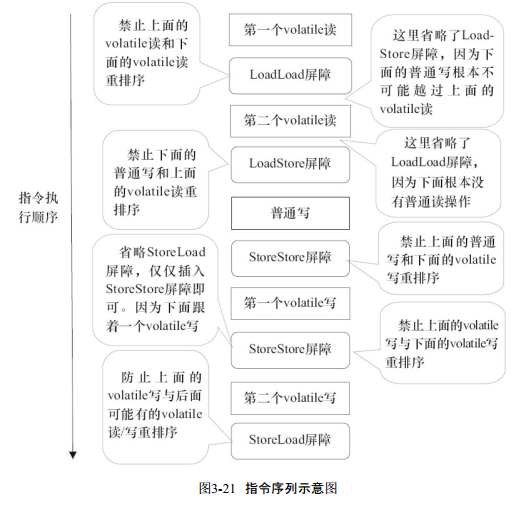

### 第一章|并发编程的挑战

#### 1.2 死锁

##### 避免死锁的几个常见方法

- 避免一个线程同时获取多个锁。
- 避免一个线程在锁内同时占用多个资源，尽量保证每个锁只占用一个资源。  
- 尝试使用定时锁，使用lock.tryLock（timeout）来替代使用内部锁机制。
- 对于数据库锁，加锁和解锁必须在一个数据库连接里，否则会出现解锁失败的情况。


### 第二章|并发机制的底层实现原理

#### 2.1 volatile

##### 2.1.1 volatile 的定义与实现原理

Java语言规范第3版中对volatile的定义如下：**Java编程语言允许线程访问共享变量，为了确保共享变量能被准确和一致地更新，线程应该确保通过排他锁单独获得这个变量**。Java语言提供了volatile，在某些情况下比锁要更加方便。**如果一个字段被声明成volatile，Java线程内存模型确保所有线程看到这个变量的值是一致的**。  

###### CPU 的术语定义


###### volatile 保证可见性原理

让我们在X86处理器下通过工具获取JIT编译器生成的汇编指令来查看对volatile进行写操作时，CPU会做什么事情 。


有volatile变量修饰的共享变量进行写操作的时候会多出第二行汇编代码，通过查IA-32架构软件开发者手册可知，**Lock**前缀的指令在多核处理器下会引发了两件事情。

1. **将当前处理器缓存行的数据写回到系统内存**。
2. **这个写回内存的操作会使在其他CPU里缓存了该内存地址的数据无效**。

为了提高处理速度，处理器不直接和内存进行通信，而是先将系统内存的数据读到内部缓存（L1，L2或其他）后再进行操作，但操作完不知道何时会写到内存。如果对声明了volatile的变量进行写操作，JVM就会向处理器发送一条Lock前缀的指令，将这个变量所在缓存行的数据写回到系统内存。但是，就算写回到内存，如果其他处理器缓存的值还是旧的，再执行计算操作就会有问题。

所以，在多处理器下，为了保证各个处理器的缓存是一致的，就会实现缓存一致性协议，每个处理器通过嗅探在总线上传播的数据来检查自己缓存的值是不是过期了，当处理器发现自己缓存行对应的内存地址被修改，就会将当前处理器的缓存行设置成无效状态，当处理器对这个数据进行修改操作的时候，会重新从系统内存中把数据读到处理器缓存里。

 **Lock前缀指令会引起处理器缓存回写到内存**。

Lock前缀指令导致在执行指令期间，声言处理器的LOCK#信号。在多处理器环境中，LOCK#信号确保在声言该信号期间，处理器可以独占任何共享内存[2]。但是，在最近的处理器里，LOCK＃信号一般不锁总线，而是锁缓存，毕竟锁总线开销的比较大。在8.1.4节有详细说明锁定操作对处理器缓存的影响，对于Intel486和Pentium处理器，在锁操作时，总是在总线上声言LOCK#信号。但在P6和目前的处理器中，如果访问的内存区域已经缓存在处理器内部，则不会声言LOCK#信号。相反，它会锁定这块内存区域的缓存并回写到内存，并使用缓存一致性机制来确保修改的原子性，此操作被称为“缓存锁定”，缓存一致性机制会阻止同时修改由两个以上处理器缓存的内存区域数据。（可先了解。）  

 **一个处理器的缓存回写到内存会导致其他处理器的缓存无效**。  

IA-32处理器和Intel 64处理器使用MESI（修改、独占、共享、无效）控制协议去维护内部缓存和其他处理器缓存的一致性。在多核处理器系统中进行操作的时候，IA-32和Intel 64处理器能嗅探其他处理器访问系统内存和它们的内部缓存。处理器使用嗅探技术保证它的内部缓存、系统内存和其他处理器的缓存的数据在总线上保持一致。例如，在Pentium和P6 family处理器中，如果通过嗅探一个处理器来检测其他处理器打算写内存地址，而这个地址当前处于共享状态，那么正在嗅探的处理器将使它的缓存行无效，在下次访问相同内存地址时，强制执行缓存行填充。

###### 为什么使用 volatile 

volatile是轻量级的同步机制，对性能的影响比synchronized小。

> 典型的用法：检查某个状态标记以判断是否退出循环。

比如线程试图通过类似于数绵羊的传统方法进入休眠状态，为了使这个示例能正确执行，asleep必须为volatile变量。否则，当asleep被另一个线程修改时，执行判断的线程却发现不了。

**那为什么我们不直接用synchorized，lock锁？它们既可以保证可见性，又可以保证原子性为何不用呢？**

因为synchorized和lock是排他锁（悲观锁），如果有多个线程需要访问这个变量，将会发生竞争，只有一个线程可以访问这个变量，其他线程被阻塞了，会影响程序的性能。

> 注意：当且仅当满足以下所有条件时，才应该用volatile变量
>
> - 对变量的写入操作不依赖变量的当前值，或者你能确保只有单个线程更新变量的值。
> - 该变量不会与其他的状态一起纳入不变性条件中。
> - 在访问变量时不需要加锁。


#### 2.2 synchronized的实现原理与应用

**synchronized实现同步的基础：Java中的每一个对象都可以作为锁**。具体表现为以下3种形式：

- 对于普通方法，锁是当前实例对象。
- 对于静态同步方法，锁是当前类的Class对象。
- 对于同步方法块，锁是Synchonized括号里配置的对象。

**当一个线程试图访问同步代码块时，它首先必须得到锁，退出或抛出异常时必须释放锁**。那么锁到底存在哪里呢？锁里面会存储什么信息呢？

JVM实现synchronized的原理，JVM基于进入和退出Monitor对象来实现方法同步和代码块同步，但两者的实现细节不一样。代码块同步是使用monitorenter和monitorexit指令实现的，而方法同步是使用另外一种方式实现的，细节在JVM规范里并没有详细说明。但是，方法的同步同样可以使用这两个指令来实现。

Monitor指令是在编译后插入到同步代码块的开始位置，而monitorexit是插入到方法结束处和异常处，JVM要保证每个monitorenter必须有对应的monitorexit与之配对。**任何对象都有一个monitor与之关联，当且一个monitor被持有后，它将处于锁定状态**。**线程执行到monitorenter指令时，将会尝试获取对象所对应的monitor的所有权，即尝试获得对象的锁**。

##### 2.2.1 Java对象头

synchronized用的锁是存在Java对象头里的。如果对象是数组类型，则虚拟机用3个字宽（Word）存储对象头，如果对象是非数组类型，则用2字宽存储对象头。在32位虚拟机中，1字宽等于4字节，即32bit，如表2-2所示。


Java对象头里的Mark Word里默认存储对象的HashCode、分代年龄和锁标记位。32位JVM的Mark Word的默认存储结构如表2-3所示。


在运行期间，Mark Word里存储的数据会随着锁标志位的变化而变化。Mark Word可能变化为存储以下4种数据，如表2-4所示。


在64位虚拟机下，Mark Word是64bit大小的，其存储结构如表2-5所示。  


##### 2.2.2 锁的升级与对比 

Java SE 1.6为了**减少获得锁和释放锁带来的性能消耗，引入了“偏向锁”和“轻量级锁”**，在Java SE 1.6中，**锁一共有4种状态**，**级别从低到高依次是：无锁状态、偏向锁状态、轻量级锁状态和重量级锁状态**，这几个状态会随着竞争情况逐渐升级。**锁可以升级但不能降级，意味着偏向锁升级成轻量级锁后不能降级成偏向锁**。**这种锁升级却不能降级的策略，目的是为了提高获得锁和释放锁的效率**。

**[锁升级过程](https://blog.csdn.net/wdxld/article/details/114218742)**

###### 1 偏向锁

HotSpot[1]的作者经过研究发现，大多数情况下，锁不仅不存在多线程竞争，而且总是由同一线程多次获得，为了让线程获得锁的代价更低而引入了偏向锁。

**当一个线程访问同步块并获取锁时，会在对象头和栈帧中的锁记录里存储锁偏向的线程ID**，以后该线程在进入和退出同步块时不需要进行CAS操作来加锁和解锁，只需简单地测试一下对象头的Mark Word里是否存储着指向当前线程的偏向锁。如果测试成功，表示线程已经获得了锁。如果测试失败，则需要再测试一下Mark Word中偏向锁的标识是否设置成1（表示当前是偏向锁）：如果没有设置，则使用CAS竞争锁；如果设置了，则尝试使用CAS将对象头的偏向锁指向当前线程。

###### （1）偏向锁的撤销

**偏向锁使用了一种等到竞争出现才释放锁的机制，所以当其他线程尝试竞争偏向锁时，持有偏向锁的线程才会释放锁**。偏向锁的撤销，需要等待全局安全点（在这个时间点上没有正在执行的字节码）。它会首先暂停拥有偏向锁的线程，然后检查持有偏向锁的线程是否活着，如果线程不处于活动状态，则将对象头设置成无锁状态；如果线程仍然活着，拥有偏向锁的栈会被执行，遍历偏向对象的锁记录，栈中的锁记录和对象头的Mark Word要么重新偏向于其他线程，要么恢复到无锁或者标记对象不适合作为偏向锁，最后唤醒暂停的线程。图2-1中的线程1演示了偏向锁初始化的流程，线程2演示了偏向锁撤销的流程。


######   （2）关闭偏向锁

偏向锁在Java 6和Java 7里是默认启用的，但是它在应用程序启动几秒钟之后才激活，如有必要可以使用JVM参数来关闭延迟：-XX:BiasedLockingStartupDelay=0。如果你确定应用程序里所有的锁通常情况下处于竞争状态，可以通过JVM参数关闭偏向锁：**-XX:-UseBiasedLocking=false**，那么程序默认会进入轻量级锁状态。

###### 2 轻量级锁

###### （1）轻量级加锁

**线程在执行同步块之前，JVM会先在当前线程的栈桢中创建用于存储锁记录的空间，并将对象头中的Mark Word复制到锁记录中，官方称为Displaced Mark Word**。然后**线程尝试使用CAS将对象头中的Mark Word替换为指向锁记录的指针**。**如果成功，当前线程获得锁，如果失败，表示其他线程竞争锁，当前线程便尝试使用自旋来获取锁**。  

###### （2）轻量级解锁

**轻量级解锁时，会使用原子的CAS操作将Displaced Mark Word替换回到对象头，如果成功，则表示没有竞争发生**。**如果失败，表示当前锁存在竞争，锁就会膨胀成重量级锁**。图2-2是两个线程同时争夺锁，导致锁膨胀的流程图 。


因为自旋会消耗CPU，为了避免无用的自旋（比如获得锁的线程被阻塞住了），一旦锁升级成重量级锁，就不会再恢复到轻量级锁状态。当锁处于这个状态下，其他线程试图获取锁时，都会被阻塞住，当持有锁的线程释放锁之后会唤醒这些线程，被唤醒的线程就会进行新一轮的夺锁之争。

###### 3 锁的优缺点对比


本节一些内容参考了HotSpot源码、对象头源码markOop.hpp、偏向锁源码 biasedLocking.cpp，以及其他源码ObjectMonitor.cpp和BasicLock.cpp。源码位置。

#### 2.3 原子操作的实现原理

原子（atomic）本意是不能被进一步分割的最小粒子”，而**原子操作（atomic operation）意为“不可被中断的一个或一系列操作”**。在多处理器上实现原子操作就变得有点复杂。

##### 2.3.1 术语


##### 2.3.2 处理器如何实现原子操作

32位IA-32处理器使用基于对缓存加锁或总线加锁的方式来实现多处理器之间的原子操作。首先处理器会自动保证基本的内存操作的原子性。处理器保证从系统内存中读取或者写入一个字节是原子的，意思是当一个处理器读取一个字节时，其他处理器不能访问这个字节的内存地址。Pentium 6和最新的处理器能自动保证单处理器对同一个缓存行里进行16/32/64位的操作是原子的，但是复杂的内存操作处理器是不能自动保证其原子性的，比如跨总线宽度、跨多个缓存行和跨页表的访问。但是，处理器提供总线锁定和缓存锁定两个机制来保证复杂内存操作的原子性。  

###### （1）使用总线锁保证原子性

**第一个机制是通过总线锁保证原子性**。如果多个处理器同时对共享变量进行读改写操作（i++就是经典的读改写操作），那么共享变量就会被多个处理器同时进行操作，这样读改写操作就不是原子的，操作完之后共享变量的值会和期望的不一致。举个例子，如果i=1，我们进行两次i++操作，我们期望的结果是3，但是有可能结果是2，如图2-3所示。

  

**原因可能是多个处理器同时从各自的缓存中读取变量i，分别进行加1操作，然后分别写入系统内存中**。那么，想要保证读改写共享变量的操作是原子的，就必须保证CPU1读改写共享变量的时候，CPU2不能操作缓存了该共享变量内存地址的缓存。

处理器使用总线锁就是来解决这个问题的。**所谓总线锁就是使用处理器提供的一个LOCK＃信号，当一个处理器在总线上输出此信号时，其他处理器的请求将被阻塞住，那么该处理器可以独占共享内存**。  

###### （2）使用缓存锁保证原子性

**第二个机制是通过缓存锁定来保证原子性**。**在同一时刻，我们只需保证对某个内存地址的操作是原子性即可，但总线锁定把CPU和内存之间的通信锁住了，这使得锁定期间，其他处理器不能操作其他内存地址的数据，所以总线锁定的开销比较大**，目前处理器在某些场合下使用缓存锁定代替总线锁定来进行优化。

频繁使用的内存会缓存在处理器的L1、L2和L3高速缓存里，那么原子操作就可以直接在处理器内部缓存中进行，并不需要声明总线锁，在Pentium 6和目前的处理器中可以使用“缓存锁定”的方式来实现复杂的原子性。所谓“缓存锁定”是指内存区域如果被缓存在处理器的缓存行中，并且在Lock操作期间被锁定，那么当它执行锁操作回写到内存时，处理器不在总线上声言LOCK＃信号，而是修改内部的内存地址，并允许它的缓存一致性机制来保证操作的原子性，因为缓存一致性机制会阻止同时修改由两个以上处理器缓存的内存区域数据，当其他处理器回写已被锁定的缓存行的数据时，会使缓存行无效，在如图2-3所示的例子中，当CPU1修改缓存行中的i时使用了缓存锁定，那么CPU2就不能同时缓存i的缓存行。

**但是有两种情况下处理器不会使用缓存锁定**。

- 当操作的数据不能被缓存在处理器内部，或操作的数据跨多个缓存行（cache line）时，则处理器会调用总线锁定。
- 有些处理器不支持缓存锁定。对于Intel 486和Pentium处理器，就算锁定的内存区域在处理器的缓存行中也会调用总线锁定。

针对以上两个机制，我们通过Intel处理器提供了很多Lock前缀的指令来实现。例如，位测试和修改指令：BTS、BTR、BTC；交换指令XADD、CMPXCHG，以及其他一些操作数和逻辑指令（如ADD、OR）等，被这些指令操作的内存区域就会加锁，导致其他处理器不能同时访问它。

#####  2.3.3 Java如何实现原子操作

###### （1）使用循环CAS实现原子操作  

**JVM中的CAS操作正是利用了处理器提供的CMPXCHG指令实现的**。自旋CAS实现的基本思路就是循环进行CAS操作直到成功为止。

从Java 1.5开始，JDK的并发包里提供了一些类来支持原子操作，如AtomicBoolean（用原子方式更新的boolean值）、AtomicInteger（用原子方式更新的int值）和AtomicLong（用原子方式更新的long值）。这些原子包装类还提供了有用的工具方法，比如以原子的方式将当前值自增1和自减1 。

###### （2）CAS实现原子操作的三大问题  

######  **1 ABA 问题**

因为CAS需要在操作值的时候，检查值有没有发生变化，如果没有发生变化则更新，但是如果一个值原来是A，变成了B，又变成了A，那么使用CAS进行检查时会发现它的值没有发生变化，但是实际上却变化了。

**ABA问题的解决思路就是使用版本号**。在变量前面追加上版本号，每次变量更新的时候把版本号加1，那么A→B→A就会变成1A→2B→3A。

从Java 1.5开始，**JDK的Atomic包里提供了一个类AtomicStampedReference来解决ABA问题**。这个类的compareAndSet方法的作用是首先检查当前引用是否等于预期引用，并且检查当前标志是否等于预期标志，如果全部相等，则以原子方式将该引用和该标志的值设置为给定的更新值。

###### 2 循环时间长开销大

**自旋CAS如果长时间不成功，会给CPU带来非常大的执行开销**。如果JVM能支持处理器提供的pause指令，那么效率会有一定的提升。pause指令有两个作用：第一，它可以延迟流水线执行指令（de-pipeline），使CPU不会消耗过多的执行资源，延迟的时间取决于具体实现的版本，在一些处理器上延迟时间是零；第二，它可以避免在退出循环的时候因内存顺序冲突（Memory Order Violation）而引起CPU流水线被清空（CPU Pipeline Flush），从而提高CPU的执行效率。  

###### 3 只能保证一个共享变量的原子操作

当对一个共享变量执行操作时，我们可以使用循环CAS的方式来保证原子操作，但是对多个共享变量操作时，循环CAS就无法保证操作的原子性，这个时候就可以用锁。还有一个取巧的办法，就是把多个共享变量合并成一个共享变量来操作。比如，有两个共享变量i＝2，j=a，合并一下ij=2a，然后用CAS来操作ij。从Java 1.5开始，**JDK提供了AtomicReference类来保证引用对象之间的原子性，就可以把多个变量放在一个对象里来进行CAS操作**。  

###### （3）使用锁机制实现原子操作

**锁机制保证了只有获得锁的线程才能够操作锁定的内存区域**。JVM内部实现了很多种锁机制，有偏向锁、轻量级锁和互斥锁。有意思的是除了偏向锁，JVM实现锁的方式都用了循环CAS，即当一个线程想进入同步块的时候使用循环CAS的方式来获取锁，当它退出同步块的时候使用循环CAS释放锁。  

### 第三章|内存模型

#### 3.1 内存模型基础

##### 3.1.2 内存模型抽象结构

Java线程之间的通信由Java内存模型（本文简称为JMM）控制，JMM决定一个线程对共享变量的写入何时对另一个线程可见。

从抽象的角度来看，JMM定义了线程和主内存之间的抽象关系：线程之间的共享变量存储在主内存（Main Memory）中，每个线程都有一个私有的本地内存（Local Memory），本地内存中存储了该线程以读/写共享变量的副本。本地内存是JMM的一个抽象概念，并不真实存在。它涵盖了缓存、写缓冲区、寄存器以及其他的硬件和编译器优化。Java内存模型的抽象示意如图3-1所示。


从图3-1来看，如果线程A与线程B之间要通信的话，必须要经历下面2个步骤。

1）线程A把本地内存A中更新过的共享变量刷新到主内存中去。

2）线程B到主内存中去读取线程A之前已更新过的共享变量。

##### 3.1.3 从源代码到指令序列的重排序

在执行程序时，为了提高性能，编译器和处理器常常会对指令做重排序。重排序分3种类型。

- **编译器优化的重排序**。编译器在不改变单线程程序语义的前提下，可以重新安排语句的执行顺序。
- **指令级并行的重排序**。现代处理器采用了指令级并行技术（Instruction-Level Parallelism，ILP）来将多条指令重叠执行。如果不存在数据依赖性，处理器可以改变语句对应机器指令的执行顺序。
- **内存系统的重排序**。由于处理器使用缓存和读/写缓冲区，这使得加载和存储操作看上去可能是在乱序执行。

从Java源代码到最终实际执行的指令序列，会分别经历下面3种重排序， 如图3-3所示。  

 

上述的1属于编译器重排序，2和3属于处理器重排序。**这些重排序可能会导致多线程程序出现内存可见性问题**。

对于编译器，JMM的编译器重排序规则会禁止特定类型的编译器重排序（不是所有的编译器重排序都要禁止）。

对于处理器重排序，**JMM的处理器重排序规则会要求Java编译器在生成指令序列时，插入特定类型的内存屏障**（Memory Barriers，Intel称之为Memory Fence）指令，**通过内存屏障指令来禁止特定类型的处理器重排序**。  

JMM属于语言级的内存模型，它确保在不同的编译器和不同的处理器平台之上，通过禁止特定类型的编译器重排序和处理器重排序，为程序员提供一致的内存可见性保证。

##### 3.1.4 并发编程模型的分类


##### 3.1.5 happens-before简介

从JDK 5开始，Java使用新的JSR-133内存模型（除非特别说明，本文针对的都是JSR-133内存模型）。JSR-133**使用happens-before的概念来阐述操作之间的内存可性**。**在JMM中，如果一个操作执行的结果需要对另一个操作可见，那么这两个操作之必须要存在happens-before关系**。这里提到的两个操作**既可以是在一个线程之内，也可以是在不同线程之间**。

与程序员密切相关的happens-before规则如下 。

- **程序顺序规则**：一个线程中的每个操作，happens-before于该线程中的任意后续操作。
- **监视器锁规则**：对一个锁的解锁，happens-before于随后对这个锁的加锁。
- **volatile变量规则**：对一个volatile域的写，happens-before于任意后续对这个volatile域的读。
- **传递性**：如果A happens-before B，且B happens-before C，那么A happens-before C。

**注意**：两个操作之间具有happens-before关系，并不意味着前一个操作必须要在后一个操作之前执行！**happens-before仅仅要求前一个操作（执行的结果）对后一个操作可见，且前一个操作按顺序排在第二个操作之前**（the first is visible to and ordered before the second）。

#### 3.2 重排序

重排序是指编译器和处理器为了优化程序性能而对指令序列进行重新排序的一种手段。

#####   3.2.1 数据依赖性

如果两个操作访问同一个变量，且这两个操作中有一个为写操作，此时这两个操作之间就存在数据依赖性。数据依赖分为下列3种类型，如表3-4所示。


**编译器和处理器在重排序时，会遵守数据依赖性，编译器和处理器不会改变存在数据依赖关系的两个操作的执行顺序**。

**这里所说的数据依赖性仅针对单个处理器中执行的指令序列和单个线程中执行的操作，不同处理器之间和不同线程之间的数据依赖性不被编译器和处理器考虑**。

##### 3.2.2 as-if-serial语义

**as-if-serial语义的意思是：不管怎么重排序（编译器和处理器为了提高并行度），（单线程）程序的执行结果不能被改变**。编译器、runtime和处理器都必须遵守as-if-serial语义。

**为了遵守as-if-serial语义，编译器和处理器不会对存在数据依赖关系的操作做重排序，因为这种重排序会改变执行结果**。但是，如果操作之间不存在数据依赖关系，这些操作就可能被编译器和处理器重排序。  如下面的例子：

```java
double pi = 3.14; // A
double r = 1.0; // B
double area = pi * r * r; // C
```

A和C之间存在数据依赖关系，同时B和C之间也存在数据依赖关系。因此在最终执行的指令序列中，C不能被重排序到A和B的前面（C排到A和B的前面，程序的结果将会被改变）。但A和B之间没有数据依赖关系，编译器和处理器可以重排序A和B之间的执行顺序。

A->B->C 或 B->A->C，程序的结果都是 3.14。

**as-if-serial语义把单线程程序保护了起来，遵守as-if-serial语义的编译器、runtime和处理器共同为编写单线程程序的程序员创建了一个幻觉：单线程程序是按程序的顺序来执行的**。asif-serial语义使单线程程序员无需担心重序会干扰他们，也无需担心内存可见性问题。

##### 3.2.3 程序顺序规则

根据happens-before的程序顺序规则，上面计算圆的面积的示例代码存在3个happensbefore关系 ：

1. A happens-before B
2. B happens-before C
3. B happens-before C

这里的第3个happens-before关系，是根据happens-before的传递性推导出来的。

这里A happens-before B，但实际执行时B却可以排在A之前执行（看上面的重排序后的执行顺序）。如果A happens-before B，JMM并不要求A一定要在B之前执行。JMM仅仅要求前一个操作（执行的结果）对后一个操作可见，且前一个操作按顺序排在第二个操作之前。这里操作A的执行结果不需要对操作B可见；而且重排序操作A和操作B后的执行结果，与操作A和操作B按happens-before顺序执行的结果一致。在这种情况下，JMM会认为这种重排序并不非法（not illegal），JMM允许这种重排序。

##### 3.2.4 重排序对多线程的影响

```java
class ReorderExample {
	int a = 0;
	boolean flag = false;
	public void writer() {
		a = 1; 			// 1
		flag = true; 	// 2
	} 
    Public void reader() {
        if (flag) { 		// 3
            int i = a * a; // 4
            ……
        }
    }
}
```

flag变量是个标记，用来标识变量a是否已被写入。这里假设有两个线程A和B，**A首先执行writer()方法，随后B线程接着执行reader()方法**。线程B在执行操作4时，能否看到线程A在操作1对共享变量a的写入呢？

答案是：**不一定能看到**。  

由于操作1和操作2没有数据依赖关系，编译器和处理器可以对这两个操作重排序；同样，操作3和操作4没有数据依赖关系，编译器和处理器也可以对这两个操作重排序。让我们先来看看，**当操作1和操作2重排序时，可能会产生什么效果**？如下图所示：

 

​	图3-8 程序执行时序图  

如图3-8所示，操作1和操作2做了重排序。程序执行时，线程A首先写标记变量flag，随后线程B读这个变量。由于条件判断为真，线程B将读取变量a。此时，变量a还没有被线程A写入，在这里多线程程序的语义被重排序破坏了！  

当操作3和操作4重排序时会产生什么效果（借助这个重排序，可以顺便说明控制依赖性）。如图3-9所示：

  

在程序中，操作3和操作4存在控制依赖关系。当代码中存在控制依赖性时，会影响指令序列执行的并行度。为此，编译器和处理器会采用猜测（Speculation）执行来克服控制相关性对并行度的影响。以处理器的猜测执行为例，执行线程B的处理器可以提前读取并计算a*a，然后把计算结果临时保存到一个名为重排序缓冲（Reorder Buffer，ROB）的硬件缓存中。当操作3的条件判断为真时，就把该计算结果写入变量i中。

从图3-9中我们可以看出，猜测执行实质上对操作3和4做了重排序。重排序在这里破坏了多线程程序的语义！

在单线程程序中，对存在控制依赖的操作重排序，不会改变执行结果（这也是as-if-serial语义允许对存在控制依赖的操作做重排序的原因）；但在多线程程序中，对存在控制依赖的操作重排序，可能会改变程序的执行结果。

####  3.3 顺序一致性

顺序一致性内存模型是一个理论参考模型，在设计的时候，处理器的内存模型和编程语言的内存模型都会以顺序一致性内存模型作为参照。

#### 3.4 volatile 的内存语义

###### 特性

- **可见性**：**对一个volatile变量的读，总是能看到（任意线程）对这个volatile变量最后的写入**。
- **原子性**：**对任意单个volatile变量的读/写具有原子性，但类似于volatile++这种复合操作不具有原子性**。  

###### volatile写-读的内存语义  

volatile写的内存语义如下：

**当写一个volatile变量时，JMM会把该线程对应的本地内存中的共享变量值刷新到主内存**。

volatile读的内存语义如下：

**当读一个volatile变量时，JMM会把该线程对应的本地内存置为无效**。**线程接下来将从主内存中读取共享变量**。  

###### volatile 内存语义的实现（内存屏障）

**为了实现volatile内存语义，JMM会分别限制这两种类型的重排序类型**。表3-5是JMM针对编译器制定的volatile重排序规则表。

  

举例来说，第三行最后一个单元格的意思是：在程序中，当第一个操作为普通变量的读或写时，如果第二个操作为volatile写，则编译器不能重排序这两个操作。

从表中可以看出：

- **当第二个操作是volatile写时，不管第一个操作是什么，都不能重排序**。这个规则确保**volatile写之前的操作不会被编译器重排序到volatile写之后**。
- **当第一个操作是volatile读时，不管第二个操作是什么，都不能重排序**。这个规则确保**volatile读之后的操作不会被编译器重排序到volatile读之前**。  
- **当第一个操作是volatile写，第二个操作是volatile读时，不能重排序**。  

**为了实现volatile的内存语义，编译器在生成字节码时，会在指令序列中插入内存屏障来禁止特定类型的处理器重排序**。对于编译器来说，发现一个最优布置来最小化插入屏障的总数几乎不可能。为此，JMM采取保守策略。下面是基于保守策略的JMM内存屏障插入策略。

- 在每个volatile**写操作的前面**插入一个**StoreStore（写-写）**屏障。  
- 在每个volatile**写操作的后面**插入一个**StoreLoad（写-读）**屏障。
- 在每个volatile**读操作的后面**插入一个**LoadLoad（读-读）**屏障。  
- 在每个volatile**读操作的后面**插入一个**LoadStore（读-写）**屏障。  

上述内存屏障插入策略非常保守，但它可以保证在任意处理器平台，任意的程序中都能得到正确的volatile内存语义。

下面是保守策略下，**volatile写插入内存屏障**后生成的指令序列示意图，如图3-19所示。


图3-19中的StoreStore屏障可以保证在volatile写之前，**其前面的所有普通写操作已经对任意处理器可见了**。这是因为StoreStore屏障将保障上面所有的普通写在volatile写之前刷新到主内存。

这里比较有意思的是，volatile写后面的StoreLoad屏障。此屏障的作用是**避免volatile写与后面可能有的volatile读/写操作重排序**。**因为编译器常常无法准确判断在一个volatile写的后面是否需要插入一个StoreLoad屏障**（比如，一个volatile写之后方法立即return）。为了保证能正确实现volatile的内存语义，JMM在采取了保守策略：在每个volatile写的后面，或者在每个volatile读的前面插入一个StoreLoad屏障。从整体执行效率的角度考虑，**JMM最终选择了在每个volatile写的后面插入一个StoreLoad屏障**。因为volatile写-读内存语义的常见使用模式是：**一个写线程写volatile变量，多个读线程读同一个volatile变量**。当读线程的数量大大超过写线程时，选择在volatile写之后插入StoreLoad屏障将带来可观的执行效率的提升。从这里可以看到JMM在实现上的一个特点：**首先确保正确性，然后再去追求执行效率**。

下面是在保守策略下，**volatile读插入内存屏障后**生成的指令序列示意图，如图3-20所示。


图3-20中的LoadLoad屏障用来禁止处理器把上面的volatile读与下面的普通读重排序。LoadStore屏障用来禁止处理器把上面的volatile读与下面的普通写重排序。 

上述volatile写和volatile读的内存屏障插入策略非常保守。在实际执行时，只要不改变volatile写-读的内存语义，编译器可以根据具体情况省略不必要的屏障。下面通过具体的示例代码进行说明。

```java
class VolatileBarrierExample {
    int a;
    volatile int v1 = 1;
    volatile int v2 = 2;
    void readAndWrite() {
        int i = v1; // 第一个volatile读
        int j = v2; // 第二个volatile读
        a = i + j; // 普通写
        v1 = i + 1; // 第一个volatile写
        v2 = j * 2; // 第二个 volatile写
	} …
// 其他方法
}
```

针对readAndWrite()方法，编译器在生成字节码时可以做如下的优化。  



注意，最后的StoreLoad屏障不能省略。因为第二个volatile写之后，方法立即return。此时编译器可能无法准确断定后面是否会有volatile读或写，为了安全起见，编译器通常会在这里插入一个StoreLoad屏障。

上面的优化针对任意处理器平台，由于不同的处理器有不同“松紧度”的处理器内存模型，内存屏障的插入还可以根据具体的处理器内存模型继续优化。以X86处理器为例，图3-21中除最后的StoreLoad屏障外，其他的屏障都会被省略。  

前文提到过，X86处理器仅会对写-读操作做重排序。X86不会对读-读、读-写和写-写操作做重排序，因此在X86处理器中会省略掉这3种操作类型对应的内存屏障。在X86中，JMM仅需在volatile写后面插入一个StoreLoad屏障即可正确实现volatile写-读的内存语义。这意味着在X86处理器中，volatile写的开销比volatile读的开销会大很多（因为执行StoreLoad屏障开销会比较大）。

  

##### 总结


##### volatile 的应用

```java
package com.jackson0714.passjava.threads;
/**
 演示volatile 单例模式应用（双边检测）
 * @author: 悟空聊架构
 * @create: 2020-08-17
 */

class VolatileSingleton {
    private static VolatileSingleton instance = null;
    private VolatileSingleton() {
        System.out.println(Thread.currentThread().getName() + "\t 我是构造方法SingletonDemo");
    }
    public static VolatileSingleton getInstance() {
        // 第一重检测
        if(instance == null) {
            // 锁定代码块
            synchronized (VolatileSingleton.class) {
                // 第二重检测
                if(instance == null) {
                    // 实例化对象
                    instance = new VolatileSingleton();
                }
            }
        }
        return instance;
    }
}
```

代码看起来没有问题，但是 `instance = new VolatileSingleton();`其实可以看作三条伪代码：

```java
memory = allocate(); // 1、分配对象内存空间
instance(memory); // 2、初始化对象
instance = memory; // 3、设置instance指向刚刚分配的内存地址，此时instance != null
```

步骤2 和 步骤3之间不存在 数据依赖关系，而且无论重排前 还是重排后，程序的执行结果在单线程中并没有改变，因此这种重排优化是允许的。

```java
memory = allocate(); // 1、分配对象内存空间
instance = memory; // 3、设置instance指向刚刚分配的内存地址，此时instance != null，但是对象还没有初始化完成
instance(memory); // 2、初始化对象
```

如果另外一个线程执行：`if(instance == null) `时，则返回刚刚分配的内存地址，但是对象还没有初始化完成，拿到的instance是个假的。

> [01.反制面试官-14张原理图-再也不怕被问volatile! (passjava.cn)](http://www.passjava.cn/#/07.并发多线程/01.反制面试官-14张原理图-再也不怕被问volatile!?id=十、volatile常见应用)

解决方案：定义instance为volatile变量。

```java
private static volatile VolatileSingleton instance = null;
```

#### 3.5 锁的内存语义

###### 锁的释放和获取的内存语义

**当线程释放锁时，JMM会把该线程对应的本地内存中的共享变量刷新到主内存中**。

**当线程获取锁时，JMM会把该线程对应的本地内存置为无效**。**从而使得被监视器保护的临界区代码必须从主内存中读取共享变量**。  

**锁释放与volatile写有相同的内存语义；锁获取与volatile读有相同的内存语义**。

小总结：

- **线程A释放一个锁，实质上是线程A向接下来将要获取这个锁的某个线程发出了（线程A对共享变量所做修改的）消息**。
- **线程B获取一个锁，实质上是线程B接收了之前某个线程发出的（在释放这个锁之前对共享变量所做修改的）消息**。
- **线程A释放锁，随后线程B获取这个锁，这个过程实质上是线程A通过主内存向线程B发送消息**。  


### 第四章|Java并发编程基础

#### 4.1 线程简介

##### 线程状态


线程状态转换图。


由图4-1中可以看到，线程创建之后，调用start()方法开始运行。当线程执行wait()方法之后，线程进入等待状态。进入等待状态的线程需要依靠其他线程的通知才能够返回到运行状态，而超时等待状态相当于在等待状态的基础上增加了超时限制，也就是超时时间到达时将会返回到运行状态。当线程调用同步方法时，在没有获取到锁的情况下，线程将会进入到阻塞状态。线程在执行Runnable的run()方法之后将会进入到终止状态 。

**注意**： 

> Java将操作系统中的运行和就绪两个状态合并称为运行状态。阻塞状态是线程阻塞在进入synchronized关键字修饰的方法或代码块（获取锁）时的状态，但是阻塞在java.concurrent包中Lock接口的线程状态却是等待状态，因为java.concurrent包中Lock接口对于阻塞的实现均使用了LockSupport类中的相关方法。  

##### Daemon线程  

Daemon线程是一种支持型线程，因为它主要被用作程序中后台调度以及支持性工作。这意味着，**当一个Java虚拟机中不存在非Daemon线程的时候，Java虚拟机将会退出**。可以通过调用Thread.setDaemon(true)将线程设置为Daemon线程。

 **Daemon属性需要在启动线程之前设置，不能在启动线程之后设置**  。

Daemon线程被用作完成支持性工作，但是在Java虚拟机退出时Daemon线程中的finally块并不一定会执行。

```java
public class Daemon {
    public static void main(String[] args) {
        Thread thread = new Thread(new DaemonRunner(), "DaemonRunner");
        thread.setDaemon(true);
        thread.start();
    }

    static class DaemonRunner implements Runnable {
        @Override
        public void run() {
            try {
                SleepUtils.second(10);
            } finally {
                System.out.println("DaemonThread finally run.");
            }
        }
    }
}
```

运行Daemon程序，可以看到在终端或者命令提示符上没有任何输出。main线程（非Daemon线程）在启动了线程DaemonRunner之后随着main方法执行完毕而终止，而此时Java虚拟机中已经没有非Daemon线程，虚拟机需要退出。Java虚拟机中的所有Daemon线程都需要立即终止，因此DaemonRunner立即终止，但DaemonRunner中的finally块并没有执行。

**在构建Daemon线程时，不能依靠finally块中的内容来确保执行关闭或清理资源的逻辑**。

#### 4.2 启动和终止线程

##### 构造线程

在运行线程之前首先要构造一个线程对象，线程对象在构造的时候需要提供线程所需要的属性，如线程所属的线程组、线程优先级、是否是Daemon线程等信息。

```java
private void init(ThreadGroup g, Runnable target, String name,
                  long stackSize, AccessControlContext acc) {
    if (name == null) {
        throw new NullPointerException("name cannot be null");
    }

    this.name = name;
// 当前线程就是该线程的父线程
    Thread parent = currentThread();
    SecurityManager security = System.getSecurityManager();
    if (g == null) {
        /* Determine if it's an applet or not */

        /* If there is a security manager, ask the security manager
           what to do. */
        if (security != null) {
            g = security.getThreadGroup();
        }

        /* If the security doesn't have a strong opinion of the matter
           use the parent thread group. */
        if (g == null) {
            g = parent.getThreadGroup();
        }
    }

    /* checkAccess regardless of whether or not threadgroup is
       explicitly passed in. */
    g.checkAccess();

    /*
     * Do we have the required permissions?
     */
    if (security != null) {
        if (isCCLOverridden(getClass())) {
            security.checkPermission(SUBCLASS_IMPLEMENTATION_PERMISSION);
        }
    }

    g.addUnstarted();

    this.group = g;
    // 将daemon、priority属性设置为父线程的对应属性
    this.daemon = parent.isDaemon();
    this.priority = parent.getPriority();
    if (security == null || isCCLOverridden(parent.getClass()))
        this.contextClassLoader = parent.getContextClassLoader();
    else
        this.contextClassLoader = parent.contextClassLoader;
    this.inheritedAccessControlContext =
            acc != null ? acc : AccessController.getContext();
    this.target = target;
    setPriority(priority);
    // 将父线程的InheritableThreadLocal复制过来
    if (parent.inheritableThreadLocals != null)
        this.inheritableThreadLocals =
            ThreadLocal.createInheritedMap(parent.inheritableThreadLocals);
    /* Stash the specified stack size in case the VM cares */
    this.stackSize = stackSize;

    /* Set thread ID */
    tid = nextThreadID();
}
```

至此，一个能够运行的线程对象就初始化好了，在堆内存中等待着运行。

##### 4.2.2 启动线程

线程对象在初始化完成之后，调用start()方法就可以启动这个线程。线程start()方法的含义是：**当前线程（即parent线程）同步告知Java虚拟机，只要线程规划器空闲，应立即启动调用start()方法的线程**。

> 启动一个线程前，最好为这个线程设置线程名称，因为这样在使用jstack分析程序或者进行问题排查时，就会给开发人员提供一些提示，自定义的线程最好能够起个名字。  

##### 4.2.3 理解中断

中断可以理解为线程的一个标识位属性，它表示一个运行中的线程是否被其他线程进行了中断操作。

中断好比其他线程对该线程打了个招呼，**其他线程通过调用该线程的interrupt()方法对其进行中断操作**。   

**线程通过检查自身是否被中断来进行响应，线程通过方法isInterrupted()来进行判断是否被中断，也可以调用静态方法Thread.interrupted()对当前线程的中断标识位进行复位**。**如果该线程已经处于终结状态，即使该线程被中断过，在调用该线程对象的isInterrupted()时依旧会返回false**。

##### 4.2.4 过期的suspend()、resume()和stop()  

对音乐播放做出的暂停、恢复和停止操作对应在线程Thread的API就是suspend()、resume()和stop()。

但是这些API是过期的，也就是不建议使用的。

不建议使用的原因主要有：**以suspend()方法为例，在调用后，线程不会释放已经占有的资源（比如锁），而是占有着资源进入睡眠状态，这样容易引发死锁问题**。同样，**stop()方法在终结一个线程时不会保证线程的资源正常释放，通常是没有给予线程完成资源释放工作的机会，因此会导致程序可能工作在不确定状态下**。

##### 4.2.5 安全的终止线程

在4.2.3节中提到的中断状态是线程的一个标识位，而中断操作是一种简便的线程间交互方式，而这种交互方式最适合用来取消或停止任务。除了中断以外，还可以利用一个boolean变量来控制是否需要停止任务并终止该线程。

如下例子：创建了一个线程CountThread，它不断地进行变量累加，而主线程尝试对其进行中断操作和停止操作。

```java
public class Shutdown {
    public static void main(String[] args) throws Exception {
        Runner one = new Runner();
        Thread countThread = new Thread(one, "CountThread");
        countThread.start();
// 睡眠1秒，main线程对CountThread进行中断，使CountThread能够感知中断而结束
        TimeUnit.SECONDS.sleep(1);
        countThread.interrupt();
        Runner two = new Runner();
        countThread = new Thread(two, "CountThread");
        countThread.start();
// 睡眠1秒，main线程对Runner two进行取消，使CountThread能够感知on为false而结束
        TimeUnit.SECONDS.sleep(1);
        two.cancel();
    }

    private static class Runner implements Runnable {
        private long i;
        private volatile boolean on = true;

        @Override
        public void run() {
            while (on && !Thread.currentThread().isInterrupted()) {
                i++;
            }
            System.out.println("Count i = " + i);
        }

        public void cancel() {
            on = false;
        }
    }
}
```

> Count i = 743422433
> Count i = 815709262

输出内容可能不同。示例在执行过程中，main线程通过中断操作和cancel()方法均可使CountThread得以终止。这种通过标识位或者中断操作的方式能够使线程在终止时有机会去清理资源，而不是武断地将线程停止，因此这种终止线程的做法显得更加安全和优雅。  

#### 4.3 线程间通信

##### 4.3.1 volatile和synchronized关键字  

关键字**volatile**可以用来修饰字段（成员变量），就是**告知程序任何对该变量的访问均需要从共享内存中获取，而对它的改变必须同步刷新回共享内存，它能保证所有线程对变量访问的可见性**。

**关键字synchronized可以修饰方法或者以同步块的形式来进行使用，它主要确保多个线程在同一个时刻，只能有一个线程处于方法或者同步块中，它保证了线程对变量访问的可见性和排他性**。  

任意一个对象都拥有自己的监视器，当这个对象由同步块或者这个对象的同步方法调用时，执行方法的线程必须先获取到该对象的监视器才能进入同步块或者同步方法，而没有获取到监视器（执行该方法）的线程将会被阻塞在同步块和同步方法的入口处，进入BLOCKED状态。

图4-2描述了对象、对象的监视器、同步队列和执行线程之间的关系。  


从图4-2中可以看到，**任意线程对Object（Object由synchronized保护）的访问，首先要获得Object的监视器。如果获取失败，线程进入同步队列，线程状态变为BLOCKED**。当访问Object的前驱（获得了锁的线程）释放了锁，则该释放操作唤醒阻塞在同步队列中的线程，使其重新尝试对监视器的获取。  

##### 4.3.2 等待/通知机制

一个线程修改了一个对象的值，而另一个线程感知到了变化，然后进行相应的操作，整个过程开始于一个线程，而最终执行又是另一个线程。前者是生产者，后者就是消费者，这种模式隔离了“做什么”（what）和“怎么做”（How），在功能层面上实现了解耦，体系结构上具备了良好的伸缩性，但是在Java语言中如何实现类似的功能呢？  


**等待/通知机制，是指一个线程A调用了对象O的wait()方法进入等待状态，而另一个线程B调用了对象O的notify()或者notifyAll()方法，线程A收到通知后从对象O的wait()方法返回，进而执行后续操作**。上述**两个线程通过对象O来完成交互，而对象上的wait()和notify/notifyAll()的关系就如同开关信号一样，用来完成等待方和通知方之间的交互工作**。  

在代码清单4-11所示的例子中，创建了两个线程——WaitThread和NotifyThread，前者检查flag值是否为false，如果符合要求，进行后续操作，否则在lock上等待，后者在睡眠了一段时间后对lock进行通知，示例如下所示。

```java
public class WaitNotify {
    static boolean flag = true;
    static Object lock = new Object();

    public static void main(String[] args) throws Exception {
        Thread waitThread = new Thread(new Wait(), "WaitThread");
        waitThread.start();
        TimeUnit.SECONDS.sleep(1);
        Thread notifyThread = new Thread(new Notify(), "NotifyThread");
        notifyThread.start();
    }

    static class Wait implements Runnable {
        @Override
        public void run() {
            // 加锁，拥有lock的Monitor
            synchronized (lock) {
                // 当条件不满足时，继续wait，同时释放了lock的锁
                while (flag) {
                    try {
                        System.out.println(Thread.currentThread() + " flag is true. waiting @ " + new SimpleDateFormat("HH:mm:ss").format(new Date()));
                        lock.wait();
                    } catch (InterruptedException e) {
                    }
                }
                // 条件满足时，完成工作
                System.out.println(Thread.currentThread() + " flag is false. running @ " + new SimpleDateFormat("HH:mm:ss").format(new Date()));
            }
        }
    }

    static class Notify implements Runnable {
        @Override
        public void run() {
            // 加锁，拥有lock的Monitor
            synchronized (lock) {
                // 获取lock的锁，然后进行通知，通知时不会释放lock的锁，
                // 直到当前线程释放了lock后，WaitThread才能从wait方法中返回
                System.out.println(Thread.currentThread() + " hold lock. notify @ " +
                        new SimpleDateFormat("HH:mm:ss").format(new Date()));
                lock.notifyAll();
                flag = false;
                SleepUtils.second(5);
            }
            // 再次加锁
            synchronized (lock) {
                System.out.println(Thread.currentThread() + " hold lock again. sleep @ " + new SimpleDateFormat("HH:mm:ss").format(new Date()));
                SleepUtils.second(5);
            }
        }
    }
}
```

 输出：

```java
Thread[WaitThread,5,main] flag is true. waiting @ 17:33:02
Thread[NotifyThread,5,main] hold lock. notify @ 17:33:03
Thread[NotifyThread,5,main] hold lock again. sleep @ 17:33:08
Thread[WaitThread,5,main] flag is false. running @ 17:33:13
```

上述第3行和第4行输出的顺序可能会互换，而上述例子主要说明了调用wait()、notify()以及notifyAll()时需要注意的细节。

1. 使用wait()、notify()和notifyAll()时需要先对调用对象加锁。  
2. 调用wait()方法后，线程状态由RUNNING变为WAITING，并将当前线程放置到对象的等待队列。
3. notify()或notifyAll()方法调用后，等待线程依旧不会从wait()返回，需要调用notify()或notifAll()的线程释放锁之后，等待线程才有机会从wait()返回。  
4. notify()方法将等待队列中的一个等待线程从等待队列中移到同步队列中，而notifyAll()方法则是将等待队列中所有的线程全部移到同步队列，被移动的线程状态由WAITING变为BLOCKED。  
5. 从wait()方法返回的前提是获得了调用对象的锁。  

图4-3描述了上述示例的过程。  


##### 4.3.3 等待/通知的经典范式  

**等待方**遵循如下原则：

1. 获取对象的锁。
2. 如果条件不满足，那么调用对象的wait()方法，被通知后仍要检查条件。
3. 条件满足则执行对应的逻辑 。

```java
synchronized(对象) {
    while(条件不满足) {
    	对象.wait();
    } 
    对应的处理逻辑
}
```

**通知方**遵循如下原则。

1. 获得对象的锁。
2. 改变条件。  
3. 通知所有等待在对象上的线程。

```java
synchronized(对象) {
    改变条件
    对象.notifyAll();
}
```

##### 4.3.5 Thread.join()的使用

**如果一个线程A执行了thread.join()语句，其含义是：当前线程A等待thread线程终止之后才从thread.join()返回**。线程Thread除了提供join()方法之外，还提供了join(long millis)和join(longmillis,int nanos)两个具备超时特性的方法。这两个超时方法表示，如果线程thread在给定的超时时间里没有终止，那么将会从该超时方法中返回。

##### 4.3.6 ThreadLocal 的使用

ThreadLocal，即线程变量，**是一个以ThreadLocal对象为键、任意对象为值的存储结构**。这个结构被附带在线程上，也就是说**一个线程可以根据一个ThreadLocal对象查询到绑定在这个线程上的一个值**。可参考这个案例理解

```java
public class ThreadLocalTest {
    /**
     * （1） print 函数
     */
    static void print(String str) {
        // 1.1 打印当前线程本地内存中 localVariable 变量的值
        System.out.println(str + " : " + localVariable.get());
        // 1.2 清楚当前线程本地内存中的 localVariable 变量
        localVariable.remove();
    }

    /**
     * （2）创建 ThreadLocal 变量
     */
    static ThreadLocal<String> localVariable = new ThreadLocal<>();
    static ThreadLocal<String> localVariable2 = new ThreadLocal<>();
    static ThreadLocal<String> threadLocal = new ThreadLocal<>();

    public static void main(String[] args) throws InterruptedException {
        /**
         * （3）创建线程
         */
        Thread threadOne = new Thread(() -> {
            localVariable.set("thread one local variable");
//            localVariable2.set("thread one local variable22222222");
            print("thread one");
            System.out.println("thread one remove after " + " : " + localVariable.get());
        }, "thread One");

        Thread threadTwo = new Thread(() -> {
            localVariable.set("thread two local variable");
            print("thread two");
            System.out.println("thread two remove after " + " : " + localVariable.get());
        }, "thread Two");

        threadOne.start();
        threadTwo.start();
        threadLocal.set("hello world");
        threadLocal.set("hello world2222");
        Thread threadThree = new Thread(() -> {
            // 每次都是用当前线程去判断是否当前线程有这个map，相同线程里面调用 set后面的之会覆盖前面的值
            threadLocal.set("hello world threadThree");
            threadLocal.set("hello world threadThree22222");
            System.out.println("thread three1 " + " : " + threadLocal.get());
            System.out.println("thread three2 " + " : " + threadLocal.get());
        });
        threadThree.start();
        threadThree.join();
        System.out.println("main: " + threadLocal.get());
    }
}
```