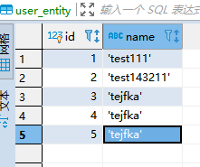
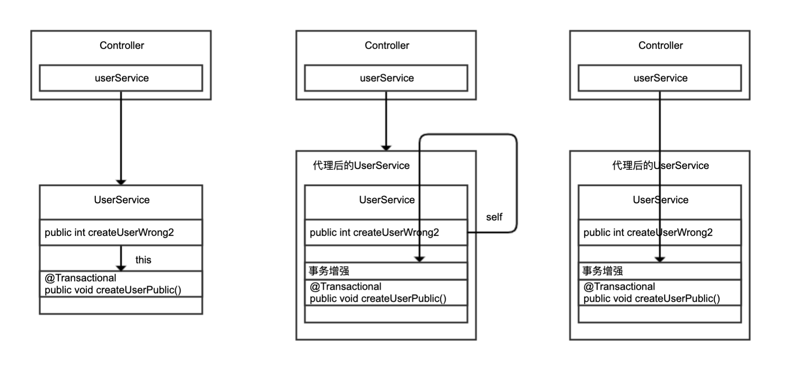

事务没有被正确处理，一般来说不会过于影响正常流程，也不容易在测试阶段被发现。但当系统越来越复杂、压力越来越大之后，就会带来大量的数据不一致问题，随后就是大量的人工介入查看和修复数据。

#### 小心 Spring 的事务可能没有生效

在使用 @Transactional 注解开启声明式事务时， 第一个最容易忽略的问题是，很可能事务并没有生效。

相关源代码：

```java
@Entity
@Data
public class UserEntity {
    @Id
    @GeneratedValue(strategy = AUTO)
    private Long id;
    private String name;

    public UserEntity() {
    }

    public UserEntity(String name) {
        this.name = name;
    }
}

@Repository
public interface UserRepository extends JpaRepository<UserEntity, Long> {
    List<UserEntity> findByName(String name);
}
```

定义一个 UserService 类，负责业务逻辑处理。如果不清楚 @Transactional 的实现方式，只考虑代码逻辑的话，这段代码看起来没有问题。

定义一个入口方法 createUserWrong1 来**调用另一个私有方法 createUserPrivate，私有方法上标记了 @Transactional 注解**。当传入的用户名包含 test 关键字时判断为用户名不合法，抛出异常，让用户创建操作失败，期望事务可以回滚：

```java
//私有方法
public int createUserWrong1(String name) {
    try {
        this.createUserPrivate(new UserEntity(name));
    } catch (Exception ex) {
        log.error("create user failed because {}", ex.getMessage());
    }
    return userRepository.findByName(name).size();
}

// 这里是 private 修饰符
@Transactional
private void createUserPrivate(UserEntity entity) {
    userRepository.save(entity);
    if (entity.getName().contains("test"))
        throw new RuntimeException("invalid username!");
}
//根据用户名查询用户数
public int getUserCount(String name) {
    return userRepository.findByName(name).size();
}
```

下面是 Controller 的实现，只是调用一下刚才定义的 UserService 中的入口方法 createUserWrong1。

```java
@RestController
@RequestMapping("transactionproxyfailed")
@Slf4j
public class TransactionProxyFailedController {

    @Autowired
    private UserService userService;

    @GetMapping("wrong1")
    public int wrong1(@RequestParam("name") String name) {
        return userService.createUserWrong1(name);
    }
}
```

**调用接口后发现，即便用户名不合法，用户也能创建成功**。刷新浏览器，多次发现有十几个的非法用户注册。



这里给出 **@Transactional 生效原则 1，除非特殊配置（比如使用 AspectJ 静态织入实现 AOP），否则只有定义在 public 方法上的 @Transactional 才能生效**。原因是，Spring 默认通过动态代理的方式实现 AOP，对目标方法进行增强，private 方法无法代理到，Spring 自然也无法动态增强事务处理逻辑。

你可能会说，修复方式很简单，把标记了事务注解的 createUserPrivate 方法改为 public 即可。在 UserService 中再建一个入口方法 createUserWrong2，来调用这个 public 方法再次尝试：

```java
public int createUserWrong2(String name) {
    try {
        this.createUserPublic(new UserEntity(name));
    } catch (Exception ex) {
        log.error("create user failed because {}", ex.getMessage());
    }
    return userRepository.findByName(name).size();
}
  //可以传播出异常
@Transactional
public void createUserPublic(UserEntity entity) {
    userRepository.save(entity);
    if (entity.getName().contains("test"))
        throw new RuntimeException("invalid username!");
}
```

测试发现，调用新的 createUserWrong2 方法事务同样不生效。调用后插入成功。

```http
GET http://localhost:45678/transactionproxyfailed/wrong2?name=teklkl
```

这里，我给出 **@Transactional 生效原则 2，必须通过代理过的类从外部调用目标方法才能生效**。

**Spring 通过 AOP 技术对方法进行增强，要调用增强过的方法必然是调用代理后的对象**。我们尝试修改下 UserService 的代码，注入一个 self，然后再通过 self 实例调用标记有 @Transactional 注解的 createUserPublic 方法。设置断点可以看到，self 是由 Spring 通过 CGLIB 方式增强过的类：

- CGLIB 通过继承方式实现代理类，private 方法在子类不可见，自然也就无法进行事务增强；
- this 指针代表对象自己，Spring 不可能注入 this，所以通过 this 访问方法必然不是代理。

```java
@Autowired
private UserService self;

//重新注入自己
public int createUserRight(String name) {
    try {
        self.createUserPublic(new UserEntity(name));
    } catch (Exception ex) {
        log.error("create user failed because {}", ex.getMessage());
    }
    return userRepository.findByName(name).size();
}
```


**把 this 改为 self 后测试发现，在 Controller 中调用 createUserRight 方法可以验证事务是生效的，非法的用户注册操作可以回滚**。

虽然在 UserService 内部注入自己调用自己的 createUserPublic 可以正确实现事务，但更合理的实现方式是，让 Controller 直接调用之前定义的 UserService 的 createUserPublic 方法，因为注入自己调用自己很奇怪，也不符合分层实现的规范：

```java
@GetMapping("right2")
public int right2(@RequestParam("name") String name) {
    try {
        userService.createUserPublic(new UserEntity(name));
    } catch (Exception ex) {
        log.error("create user failed because {}", ex.getMessage());
    }
    return userService.getUserCount(name);
}
```

我们再通过一张图来回顾下 this 自调用、通过 self 调用，以及在 Controller 中调用 UserService 三种实现的区别：



强烈建议你在开发时打开相关的 Debug 日志，以方便了解 Spring 事务实现的细节，并及时判断事务的执行情况。

我们的 Demo 代码使用 JPA 进行数据库访问，可以这么开启 Debug 日志：

```properties
logging.level.org.springframework.orm.jpa=DEBUG
```

#### 事务即便生效也不一定能回滚

通过 AOP 实现事务处理可以理解为，**使用 try…catch…来包裹标记了 @Transactional 注解的方法，当方法出现了异常并且满足一定条件的时候，在 catch 里面我们可以设置事务回滚，没有异常则直接提交事务**。

这里的“一定条件”，主要包括两点：

- 第一，**只有异常传播出了标记了 @Transactional 注解的方法，事务才能回滚**。在 Spring 的 TransactionAspectSupport 里有个 invokeWithinTransaction 方法，里面就是处理事务的逻辑。可以看到，只有捕获到异常才能进行后续事务处理：

  

  ```java
  try {
      // This is an around advice: Invoke the next interceptor in the chain.
      // This will normally result in a target object being invoked.
      retVal = invocation.proceedWithInvocation();
  }
  catch (Throwable ex) {
      // target invocation exception
      completeTransactionAfterThrowing(txInfo, ex);
      throw ex;
  }
  finally {
      cleanupTransactionInfo(txInfo);
  }
  
  if (retVal != null && vavrPresent && VavrDelegate.isVavrTry(retVal)) {
      // Set rollback-only in case of Vavr failure matching our rollback rules...
      TransactionStatus status = txInfo.getTransactionStatus();
      if (status != null && txAttr != null) {
          retVal = VavrDelegate.evaluateTryFailure(retVal, txAttr, status);
      }
  }
  
  commitTransactionAfterReturning(txInfo);
  return retVal;
  ```

- **第二，默认情况下，出现 RuntimeException（非受检异常）或 Error 的时候，Spring 才会回滚事务**。

  打开 Spring 的 DefaultTransactionAttribute 类能看到如下代码块，可以发现相关证据，通过注释也能看到 Spring 这么做的原因，大概的意思是受检异常一般是业务异常，或者说是类似另一种方法的返回值，出现这样的异常可能业务还能完成，所以不会主动回滚；而 Error 或 RuntimeException 代表了非预期的结果，应该回滚：

  ```java
  public boolean rollbackOn(Throwable ex) {
     return (ex instanceof RuntimeException || ex instanceof Error);
  }
  ```

在 createUserWrong1 方法中会抛出一个 RuntimeException，但由于方法内 catch 了所有异常，异常无法从方法传播出去，事务自然无法回滚。

在 createUserWrong2 方法中，注册用户的同时会有一次 otherTask 文件读取操作，如果文件读取失败，我们希望用户注册的数据库操作回滚。虽然这里没有捕获异常，**但因为 otherTask 方法抛出的是受检异常，createUserWrong2 传播出去的也是受检异常，事务同样不会回滚**。

```java
@Service
@Slf4j
public class UserService {
    @Autowired
    private UserRepository userRepository;
    
    //异常无法传播出方法，导致事务无法回滚
    @Transactional
    public void createUserWrong1(String name) {
        try {
            userRepository.save(new UserEntity(name));
            throw new RuntimeException("error");
        } catch (Exception ex) {
            log.error("create user failed", ex);
        }
    }

    //即使出了受检异常也无法让事务回滚
    @Transactional
    public void createUserWrong2(String name) throws IOException {
        userRepository.save(new UserEntity(name));
        otherTask();
    }

    //因为文件不存在，一定会抛出一个IOException
    private void otherTask() throws IOException {
        Files.readAllLines(Paths.get("file-that-not-exist"));
    }
}
/*
调用wrong1：http://localhost:45678/transactionrollbackfailed/wrong1?name=abacd
[17:33:39.502] [http-nio-45678-exec-2] [ERROR] [o.g.t.c.t.t.UserService:25  ] - create user failed
java.lang.RuntimeException: error
	at org.geekbang.time.commonmistakes.transaction.transactionrollbackfailed.UserService.createUserWrong
	但是数据库插入了，事务回滚失败
*/
```

Controller 中的实现，仅仅是调用 UserService 的 createUserWrong1 和 createUserWrong2 方法，这里就贴出实现了。**这 2 个方法的实现和调用，虽然完全避开了事务不生效的坑，但因为异常处理不当，导致程序没有如我们期望的文件操作出现异常时回滚事务**。

```java
@RestController
@RequestMapping("transactionrollbackfailed")
@Slf4j
public class TransactionRollbackFailedController {

    @Autowired
    private UserService userService;

    @GetMapping("wrong1")
    public int wrong1(@RequestParam("name") String name) {
        userService.createUserWrong1(name);
        return userService.getUserCount(name);
    }

    @GetMapping("wrong2")
    public int wrong2(@RequestParam("name") String name) {
        try {
            userService.createUserWrong2(name);
        } catch (Exception e) {
            log.error("create user failed", e);
        }
        return userService.getUserCount(name);
    }
}
/**
http://localhost:45678/transactionrollbackfailed/wrong2?name=kkajfak
[17:35:18.476] [http-nio-45678-exec-4] [ERROR] [o.g.t.c.t.t.TransactionRollbackFailedController:30  ] - create user failed
java.nio.file.NoSuchFileException: file-that-not-exist
	at sun.nio.fs.WindowsException.translateToIOException(WindowsException.java:79)
	但是数据插入了数据
*/
```

**第一，如果你希望自己捕获异常进行处理的话，也没关系，可以手动设置让当前事务处于回滚状态**：

```java
@Transactional
public void createUserRight1(String name) {
    try {
        userRepository.save(new UserEntity(name));
        throw new RuntimeException("error");
    } catch (Exception ex) {
        log.error("create user failed", ex);
        TransactionAspectSupport.currentTransactionStatus().setRollbackOnly();
    }
    log.info("result {} ", userRepository.findByName(name).size());//为什么这里是1你能想明白吗？
}
```

运行后可以在日志中看到 Rolling back 字样，确认事务回滚了。同时，我们还注意到“Transactional code has requested rollback”的提示，表明手动请求回滚：test111233，是数据库中不存在的值。

http://localhost:45678/transactionrollbackfailed/right1?name=test111233

调用返回0，但是日志打印了 result 1。

```java
[09:50:12.093] [http-nio-45678-exec-1] [ERROR] [o.g.t.c.t.t.UserService:50  ] - create user failed
java.lang.RuntimeException: error at org.geekbang.time.commonmistakes.transaction.transactionrollbackfailed.UserService.createUserRight1(UserService.java:48)
    
[09:59:38.399] [http-nio-45678-exec-3] [INFO ] [o.g.t.c.t.t.UserService:53  ] - result 1 
[09:59:38.399] [http-nio-45678-exec-3] [DEBUG] [o.s.orm.jpa.JpaTransactionManager:698 ] - Transactional code has requested rollback
[09:59:38.400] [http-nio-45678-exec-3] [DEBUG] [o.s.orm.jpa.JpaTransactionManager:834 ] - Initiating transaction rollback
[09:59:38.400] [http-nio-45678-exec-3] [DEBUG] [o.s.orm.jpa.JpaTransactionManager:555 ] - Rolling back JPA transaction on EntityManager [SessionImpl(1210819057<open>)]
```

原因：**//为什么这里是1你能想明白吗？**

```mysql
BEGIN;
INSERT INTO user_entity VALUES (15, 'lan');
SELECT * FROM user_entity ue WHERE name = 'lan';
ROLLBACK ;
-- 这条查询查询不到记录
SELECT * FROM user_entity ue WHERE name = 'lan';
COMMIT;
```

实际上面的方法执行类似于这样，隔离级别是可重复读，对于自己的事务，自己插入的是能看到的。

**第二，在注解中声明，期望遇到所有的 Exception 都回滚事务（来突破默认不回滚受检异常的限制）**：

```java
 //DefaultTransactionAttribute
@Transactional(rollbackFor = Exception.class)
public void createUserRight2(String name) throws IOException {
    userRepository.save(new UserEntity(name));
    otherTask();
}
```

运行后，同样可以在日志中看到回滚的提示：

```java
9:58:55.507] [http-nio-45678-exec-2] [DEBUG] [o.s.orm.jpa.JpaTransactionManager:834 ] - Initiating transaction rollback
[09:58:55.508] [http-nio-45678-exec-2] [DEBUG] [o.s.orm.jpa.JpaTransactionManager:555 ] - Rolling back JPA transaction on EntityManager [SessionImpl(167342045<open>)]
[09:58:55.508] [http-nio-45678-exec-2] [DEBUG] [o.s.orm.jpa.JpaTransactionManager:620 ] - Closing JPA EntityManager [SessionImpl(167342045<open>)] after transaction
[09:58:55.508] [http-nio-45678-exec-2] [ERROR] [o.g.t.c.t.t.TransactionRollbackFailedController:50  ] - create user failed
java.nio.file.NoSuchFileException: file-that-not-exist
```

在这个例子中，我们展现的是一个复杂的业务逻辑，其中有数据库操作、IO 操作，在 IO 操作出现问题时希望让数据库事务也回滚，以确保逻辑的一致性。**在有些业务逻辑中，可能会包含多次数据库操作，我们不一定希望将两次操作作为一个事务来处理，这时候就需要仔细考虑事务传播的配置了，否则也可能踩坑**。

#### 请确认事务传播配置是否符合自己的业务逻辑

有这么一个场景：一个用户注册的操作，会插入一个主用户到用户表，还会注册一个关联的子用户。**我们希望将子用户注册的数据库操作作为一个独立事务来处理，即使失败也不会影响主流程，即不影响主用户的注册**。

UserService

```java
@Autowired
private UserRepository userRepository;

@Autowired
private SubUserService subUserService;

@Transactional
public void createUserWrong(UserEntity entity) {
    createMainUser(entity);
    subUserService.createSubUserWithExceptionWrong(entity);
}

public int getUserCount(String name) {
    return userRepository.findByName(name).size();
}

private void createMainUser(UserEntity entity) {
    userRepository.save(entity);
    log.info("createMainUser finish");
}
```

SubUserService 的 createSubUserWithExceptionWrong 实现正如其名，因为最后我们抛出了一个运行时异常，错误原因是用户状态无效，所以子用户的注册肯定是失败的。我们期望子用户的注册作为一个事务单独回滚，不影响主用户的注册，这样的逻辑可以实现吗？

```java
@Service
@Slf4j
public class SubUserService {

    @Autowired
    private UserRepository userRepository;

    @Transactional
    public void createSubUserWithExceptionWrong(UserEntity entity) {
        log.info("createSubUserWithExceptionWrong start");
        userRepository.save(entity);
        throw new RuntimeException("invalid status");
    }
}
```

测试代码：

```java
@RestController
@RequestMapping("transactionpropagation")
@Slf4j
public class TransactionPropagationController {

    @Autowired
    private UserService userService;

    @GetMapping("wrong")
    public int wrong(@RequestParam("name") String name) {
        try {
            userService.createUserWrong(new UserEntity(name));
        } catch (Exception ex) {
            log.error("createUserWrong failed, reason:{}", ex.getMessage());
        }
        return userService.getUserCount(name);
    }
}
```

http://localhost:45678/transactionpropagation/wrong?name=lan

查看日志事务回滚了，看数据库这个值也没保存。

```java
[10:42:41.795] [http-nio-45678-exec-1] [DEBUG] [o.s.orm.jpa.JpaTransactionManager:834 ] - Initiating transaction rollback
[10:42:41.795] [http-nio-45678-exec-1] [DEBUG] [o.s.orm.jpa.JpaTransactionManager:555 ] - Rolling back JPA transaction on EntityManager [SessionImpl(1918226945<open>)]
[10:42:41.796] [http-nio-45678-exec-1] [DEBUG] [o.s.orm.jpa.JpaTransactionManager:620 ] - Closing JPA EntityManager [SessionImpl(1918226945<open>)] after transaction
[10:42:41.797] [http-nio-45678-exec-1] [ERROR] [o.g.t.c.t.t.TransactionPropagationController:23  ] - createUserWrong failed, reason:invalid status
[10:42:41.798] [http-nio-45678-exec-1] [DEBUG] [o.s.o.j.SharedEntityManagerCreator$SharedEntityManagerInvocationHandler:305 ] - Creating new EntityManager for shared EntityManager invocation
```

你马上就会意识到，不对呀，因为运行时异常逃出了 @Transactional 注解标记的 createUserWrong 方法，Spring 当然会回滚事务了。如果我们希望主方法不回滚，应该把子方法抛出的异常捕获了。

也就是这么改，把 subUserService.createSubUserWithExceptionWrong 包裹上 catch，这样外层主方法就不会出现异常了：

```java
@GetMapping("wrong2")
public int wrong2(@RequestParam("name") String name) {
    try {
        userService.createUserWrong2(new UserEntity(name));
    } catch (Exception ex) {
        log.error("createUserWrong2 failed, reason:{}", ex.getMessage(), ex);
    }
    return userService.getUserCount(name);
}

// userservice
@Transactional
public void createUserWrong2(UserEntity entity) {
    createMainUser(entity);
    try {
        subUserService.createSubUserWithExceptionWrong(entity);
    } catch (Exception ex) {
        // 虽然捕获了异常，但是因为没有开启新事务，而当前事务因为异常已经被标记为rollback了，所以最终还是会回滚。
        log.error("create sub user error:{}", ex.getMessage());
    }
}
```

输出日志：

```java
// 1 [10:45:26.406] [http-nio-45678-exec-2] [DEBUG] [o.s.orm.jpa.JpaTransactionManager:471 ] - Participating in existing transaction
// 2 [10:45:26.407] [http-nio-45678-exec-2] [INFO ] [o.g.t.c.t.t.SubUserService:19  ] - createSubUserWithExceptionWrong start
// 3 [10:45:26.407] [http-nio-45678-exec-2] [DEBUG] [o.s.orm.jpa.JpaTransactionManager:356 ] - Found thread-bound EntityManager [SessionImpl(1440115649<open>)] for JPA transaction
// 4 [10:45:26.407] [http-nio-45678-exec-2] [DEBUG] [o.s.orm.jpa.JpaTransactionManager:471 ] - Participating in existing transaction
// 5 [10:45:26.408] [http-nio-45678-exec-2] [DEBUG] [o.s.orm.jpa.JpaTransactionManager:843 ] - Participating transaction failed - marking existing transaction as rollback-only
// 6 [10:45:26.408] [http-nio-45678-exec-2] [DEBUG] [o.s.orm.jpa.JpaTransactionManager:580 ] - Setting JPA transaction on EntityManager [SessionImpl(1440115649<open>)] rollback-only
// 7 [10:45:26.408] [http-nio-45678-exec-2] [ERROR] [o.g.t.c.t.t.UserService:37  ] - create sub user error:invalid status
// 8 [10:45:26.408] [http-nio-45678-exec-2] [DEBUG] [o.s.orm.jpa.JpaTransactionManager:741 ] - Initiating transaction commit
// 9 [10:45:26.409] [http-nio-45678-exec-2] [DEBUG] [o.s.orm.jpa.JpaTransactionManager:529 ] - Committing JPA transaction on EntityManager [SessionImpl(1440115649<open>)]
// 10 [10:45:26.410] [http-nio-45678-exec-2] [DEBUG] [o.s.orm.jpa.JpaTransactionManager:620 ] - Closing JPA EntityManager [SessionImpl(1440115649<open>)] after transaction
// 11 [10:45:26.410] [http-nio-45678-exec-2] [ERROR] [o.g.t.c.t.t.TransactionPropagationController:33  ] - createUserWrong2 failed, reason:Transaction silently rolled back because it has been marked as rollback-only
/*org.springframework.transaction.UnexpectedRollbackException: Transaction silently rolled back because it has been marked as rollback-only
	at org.springframework.transaction.support.AbstractPlatformTransactionManager.processCommit(AbstractPlatformTransactionManager.java:753)
	at org.springframework.transaction.support.AbstractPlatformTransactionManager.commit(AbstractPlatformTransactionManager.java:712)
	at org.springframework.transaction.interceptor.TransactionAspectSupport.commitTransactionAfterReturning(TransactionAspectSupport.java:631)
	at org.springframework.transaction.interceptor.TransactionAspectSupport.invokeWithinTransaction(TransactionAspectSupport.java:385)
    ...
    */
```

如第 1 行所示，对 createUserWrong2 方法开启了异常处理；

如第 5 行所示，子方法因为出现了运行时异常，标记当前事务为回滚；

如第 7 行所示，主方法的确捕获了异常打印出了 create sub user error 字样；

如第 9 行所示，主方法提交了事务；

奇怪的是，如第 11 行和 12 行所示，Controller 里出现了一个 **UnexpectedRollbackException**，**异常描述提示最终这个事务回滚了，而且是静默回滚的**。之所以说是静默，是因为 createUserWrong2 方法本身并没有出异常，只不过提交后发现子方法已经把当前事务设置为了回滚，无法完成提交。

这挺反直觉的。**我们之前说，出了异常事务不一定回滚，这里说的却是不出异常，事务也不一定可以提交。原因是，主方法注册主用户的逻辑和子方法注册子用户的逻辑是同一个事务，子逻辑标记了事务需要回滚，主逻辑自然也不能提交了**。

看到这里，修复方式就很明确了，想办法让子逻辑在独立事务中运行，也就是改一下 SubUserService 注册子用户的方法，为注解加上 propagation = Propagation.REQUIRES_NEW 来设置 REQUIRES_NEW 方式的事务传播策略，**也就是执行到这个方法时需要开启新的事务，并挂起当前事务**：

```java
@Transactional(propagation = Propagation.REQUIRES_NEW)
public void createSubUserWithExceptionRight(UserEntity entity) {
    log.info("createSubUserWithExceptionRight start");
    userRepository.save(entity);
    throw new RuntimeException("invalid status");
}
```

主方法没什么变化，**同样需要捕获异常，防止异常漏出去导致主事务回滚**，重新命名为 createUserRight：

```java
@Transactional
public void createUserRight(UserEntity entity) {
    createMainUser(entity);
    try {
        subUserService.createSubUserWithExceptionRight(entity);
    } catch (Exception ex) {
        // 捕获异常，防止主方法回滚
        log.error("create sub user error:{}", ex.getMessage());
    }
}
```

改造后，重新运行程序可以看到如下的关键日志：

第 1 行日志提示我们针对 createUserRight 方法开启了主方法的事务；

第 2 行日志提示创建主用户完成；

第 3 行日志可以看到主事务挂起了，开启了一个新的事务，针对 createSubUserWithExceptionRight 方案，也就是我们的创建子用户的逻辑；

第 4 行日志提示子方法事务回滚；

第 5 行日志提示子方法事务完成，继续主方法之前挂起的事务；

第 6 行日志提示主方法捕获到了子方法的异常；

第 8 行日志提示主方法的事务提交了，随后我们在 Controller 里没看到静默回滚的异常。

```java
[10:58:23.605] [http-nio-45678-exec-5] [DEBUG] [o.s.orm.jpa.JpaTransactionManager:370 ] - Creating new transaction with name [org.geekbang.time.commonmistakes.transaction.transactionpropagation.UserService.createUserRight]: PROPAGATION_REQUIRED,ISOLATION_DEFAULT

[10:58:23.679] [http-nio-45678-exec-5] [INFO ] [o.g.t.c.t.t.UserService:55  ] - createMainUser finish
    
[10:58:23.680] [http-nio-45678-exec-5] [DEBUG] [o.s.orm.jpa.JpaTransactionManager:420 ] - Suspending current transaction, creating new transaction with name [org.geekbang.time.commonmistakes.transaction.transactionpropagation.SubUserService.createSubUserWithExceptionRight]
    
[o.s.orm.jpa.JpaTransactionManager:834 ] - Initiating transaction rollback
[10:58:23.795] [http-nio-45678-exec-5] [DEBUG] [o.s.orm.jpa.JpaTransactionManager:555 ] - Rolling back JPA transaction on EntityManager [SessionImpl(2103988110<open>)]

[10:58:23.796] [http-nio-45678-exec-5] [DEBUG] [o.s.orm.jpa.JpaTransactionManager:1009] - Resuming suspended transaction after completion of inner transaction
[10:58:23.796] [http-nio-45678-exec-5] [ERROR] [o.g.t.c.t.t.UserService:49  ] - create sub user error:invalid status
[10:58:23.796] [http-nio-45678-exec-5] [DEBUG] [o.s.orm.jpa.JpaTransactionManager:741 ] - Initiating transaction commit
[10:58:23.796] [http-nio-45678-exec-5] [DEBUG] [o.s.orm.jpa.JpaTransactionManager:529 ] - Committing JPA transaction on EntityManager [SessionImpl(1061462666<open>)]
```

运行测试程序看到如下结果，getUserCount 得到的用户数量为 1，代表只有一个用户也就是主用户注册完成了，符合预期。

