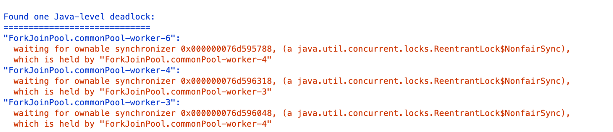
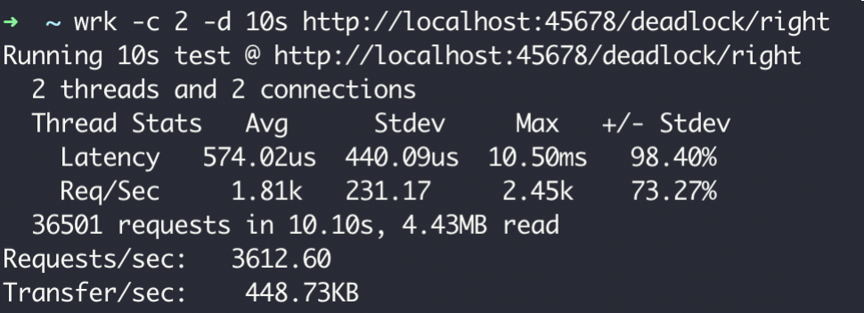
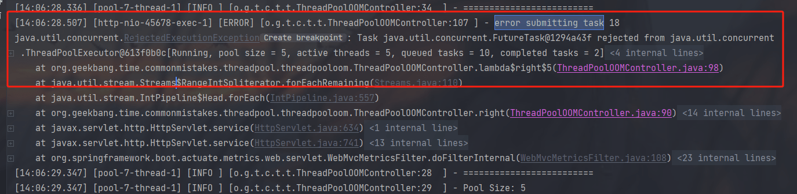
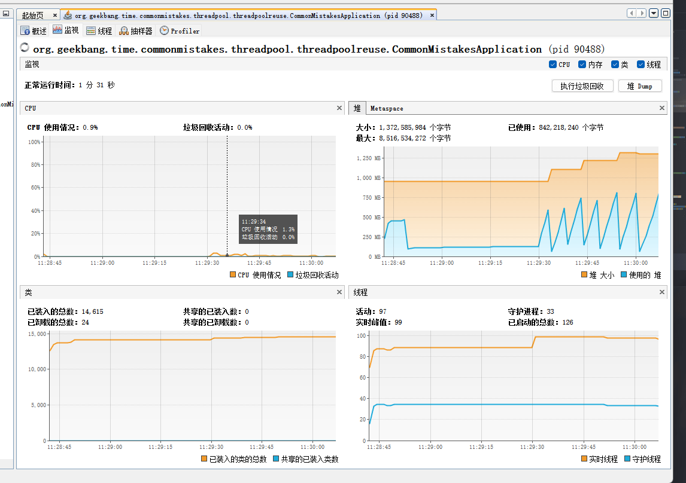

## 使用了并发工具类库，线程安全就高枕无忧了吗？

### 线程重用导致用户信息错乱的 Bug

我们知道，ThreadLocal 适用于变量在线程间隔离，而在方法或类间共享的场景。如果用户信息的获取比较昂贵（比如从数据库查询用户信息），那么在 ThreadLocal 中缓存数据是比较合适的做法。但，这么做为什么会出现用户信息错乱的 Bug 呢？

使用 Spring Boot 创建一个 Web 应用程序，使用 ThreadLocal 存放一个 Integer 的值，来暂且代表需要在线程中保存的用户信息，这个值初始是 null。在业务逻辑中，我先从 ThreadLocal 获取一次值，然后把外部传入的参数设置到 ThreadLocal 中，来模拟从当前上下文获取到用户信息的逻辑，随后再获取一次值，最后输出两次获得的值和线程名称。

```java
private ThreadLocal<Integer> currentUser = ThreadLocal.withInitial(() -> null)

@GetMapping("wrong")
public Map wrong(@RequestParam("userId") Integer userId) {
    //设置用户信息之前先查询一次ThreadLocal中的用户信息
    String before  = Thread.currentThread().getName() + ":" + currentUser.get();
    //设置用户信息到ThreadLocal
    currentUser.set(userId);
    //设置用户信息之后再查询一次ThreadLocal中的用户信息
    String after  = Thread.currentThread().getName() + ":" + currentUser.get();
    //汇总输出两次查询结果
    Map result = new HashMap();
    result.put("before", before);
    result.put("after", after);
    return result;
}
```

按理说，在设置用户信息之前第一次获取的值始终应该是 null，但我们要意识到，程序运行在 Tomcat 中，执行程序的线程是 Tomcat 的工作线程，而 Tomcat 的工作线程是基于线程池的。

顾名思义，**线程池会重用固定的几个线程，一旦线程重用，那么很可能首次从 ThreadLocal 获取的值是之前其他用户的请求遗留的值。这时，ThreadLocal 中的用户信息就是其他用户的信息**。

为了更快地重现这个问题，我在配置文件中设置一下 Tomcat 的参数，把工作线程池最大线程数设置为 1，这样始终是同一个线程在处理请求：`server.tomcat.max-threads=1`；

运行程序后先让用户 1 来请求接口，可以看到第一和第二次获取到用户 ID 分别是 null 和 1，符合预期


随后用户 2 来请求接口，这次就出现了 Bug，第一和第二次获取到用户 ID 分别是 1 和 2，显然第一次获取到了用户 1 的信息，原因就是 Tomcat 的线程池重用了线程。从图中可以看到，两次请求的线程都是同一个线程：http-nio-8080-exec-1。


在 Tomcat 这种 Web 服务器下跑的业务代码，本来就运行在一个多线程环境（否则接口也不可能支持这么高的并发），**并不能认为没有显式开启多线程就不会有线程安全问题**。
因为线程的创建比较昂贵，所以 Web 服务器往往会使用线程池来处理请求，这就意味着线程会被重用。这时，**使用类似 ThreadLocal 工具来存放一些数据时，需要特别注意在代码运行完后，显式地去清空设置的数据**。如果在代码中使用了自定义的线程池，也同样会遇到这个问题。

理解了这个知识点后，我们修正这段代码的方案是，在代码的 finally 代码块中，显式清除 ThreadLocal 中的数据。这样一来，新的请求过来即使使用了之前的线程也不会获取到错误的用户信息了。修正后的代码如下：

```java
@GetMapping("right")
public Map right(@RequestParam("userId") Integer userId) {
    String before  = Thread.currentThread().getName() + ":" + currentUser.get()
    currentUser.set(userId);
    try {
        String after = Thread.currentThread().getName() + ":" + currentUser.get
        Map result = new HashMap();
        result.put("before", before);
        result.put("after", after);
        return result;
    } finally {
        //在finally代码块中删除ThreadLocal中的数据，确保数据不串
        currentUser.remove();
    }
}
```

### 使用了线程安全的并发工具，并不代表解决了所有线程安全问题

JDK 1.5 后推出的 ConcurrentHashMap，是一个高性能的线程安全的哈希表容器。“线程安全”这四个字特别容易让人误解，因为 **ConcurrentHashMap 只能保证提供的原子性读写操作是线程安全的**。

我在相当多的业务代码中看到过这个误区，比如下面这个场景。有一个含 900 个元素的 Map，现在再补充 100 个元素进去，这个补充操作由 10 个线程并发进行。开发人员误以为使用了 ConcurrentHashMap 就不会有线程安全问题，于是不加思索地写出了下面的代码：在每一个线程的代码逻辑中先通过 size 方法拿到当前元素数量，计算 ConcurrentHashMap 目前还需要补充多少元素，并在日志中输出了这个值，然后通过 putAll 方法把缺少的元素添加进去。

```java
//线程个数
private static int THREAD_COUNT = 10;
//总元素数量
private static int ITEM_COUNT = 1000;

//帮助方法，用来获得一个指定元素数量模拟数据的ConcurrentHashMap
private ConcurrentHashMap<String, Long> getData(int count) {
    return LongStream.rangeClosed(1, count)
        .boxed()
        .collect(Collectors.toConcurrentMap(i -> UUID.randomUUID().toString(),
                                            i -> i, (o1, o2) -> o1, ConcurrentHashMap::new));
}

public String wrong() throws InterruptedException {
    ConcurrentHashMap<String, Long> concurrentHashMap = getData(ITEM_COUNT - 100);
    //初始900个元素
    System.out.println("init size:" + concurrentHashMap.size());

    ForkJoinPool forkJoinPool = new ForkJoinPool(THREAD_COUNT);
    //使用线程池并发处理逻辑
    forkJoinPool.execute(() -> IntStream.rangeClosed(1, 10).parallel().forEach(r -> {
        System.out.println("r:" + r);
        //查询还需要补充多少个元素
        int gap = ITEM_COUNT - concurrentHashMap.size();
        System.out.println("gap size:" + gap);
        //补充元素
        concurrentHashMap.putAll(getData(gap));
    }
                                                                              ));
    //等待所有任务完成
    forkJoinPool.shutdown();
    forkJoinPool.awaitTermination(1, TimeUnit.HOURS);
    //最后元素个数会是1000吗？
    System.out.println("finish size:" + concurrentHashMap.size());
    return "OK";
}
```

输出效果：

```java
main, init size:900
ForkJoinPool-1-worker-9, gap size:100
ForkJoinPool-1-worker-13, gap size:100
ForkJoinPool-1-worker-6, gap size:100
ForkJoinPool-1-worker-4, gap size:100
ForkJoinPool-1-worker-2, gap size:100
ForkJoinPool-1-worker-11, gap size:100
ForkJoinPool-1-worker-15, gap size:100
ForkJoinPool-1-worker-1, gap size:100
ForkJoinPool-1-worker-8, gap size:100
ForkJoinPool-1-worker-10, gap size:100
main, finish size:1900

Process finished with exit code 0
```

最后的数量是1900，显然不如和预期。

针对这个场景，我们可以举一个形象的例子。ConcurrentHashMap 就像是一个大篮子，现在这个篮子里有 900 个桔子，我们期望把这个篮子装满 1000 个桔子，也就是再装 100 个桔子。有 10 个工人来干这件事儿，大家先后到岗后会计算还需要补多少个桔子进去，最后把桔子装入篮子。

ConcurrentHashMap 这个篮子本身，可以确保多个工人在装东西进去时，不会相互影响干扰，但无法确保工人 A 看到还需要装 100 个桔子但是还未装的时候，工人 B 就看不到篮子中的桔子数量。更值得注意的是，你往这个篮子装 100 个桔子的操作不是原子性的，在别人看来可能会有一个瞬间篮子里有 964 个桔子，还需要补 36 个桔子。

我们需要注意 **ConcurrentHashMap 对外提供的方法或能力的限制**：

- 使用了 ConcurrentHashMap，不代表对它的多个操作之间的状态是一致的，是没有其他线程在操作它的，如果需要确保需要手动加锁。
- 诸如 size、isEmpty 和 containsValue 等聚合方法，在并发情况下可能会反映 ConcurrentHashMap 的中间状态。因此在并发情况下，这些方法的返回值只能用作参考，而不能用于流程控制。显然，利用 size 方法计算差异值，是一个流程控制。
- 诸如 putAll 这样的聚合方法也不能确保原子性，在 putAll 的过程中去获取数据可能会获取到部分数据

代码的修改方案很简单，整段逻辑加锁即可：

```java
forkJoinPool.execute(() -> IntStream.rangeClosed(1, 10).parallel()
                .forEach(r -> {
//                    System.out.println("r:" + r);
                            synchronized (concurrentHashMap) {
                                //查询还需要补充多少个元素
                                int gap = ITEM_COUNT - concurrentHashMap.size();
                                System.out.println(Thread.currentThread().getName() + ", gap size:" + gap);
                                //补充元素
                                concurrentHashMap.putAll(getData(gap));
                            }
                        }
                ));
```

### 没有充分了解并发工具的特性，从而无法发挥其威力

在一个案例：我们来看一个使用 Map 来统计 Key 出现次数的场景吧，这个逻辑在业务代码中非常常
见。

- 使用 ConcurrentHashMap 来统计，Key 的范围是 10。
- 使用最多 10 个并发，循环操作 1000 万次，每次操作累加随机的 Key。
- 如果 Key 不存在的话，首次设置值为 1。

```java
private Map<String, Long> normaluse() throws InterruptedException {
    ConcurrentHashMap<String, Long> freqs = new ConcurrentHashMap<>(1000);
    ForkJoinPool forkJoinPool = new ForkJoinPool(10);
    forkJoinPool.execute(() -> IntStream.rangeClosed(1, 10000000).parallel()
            .forEach(r -> {
                        //获得一个随机的Key
                        String key = "item" + ThreadLocalRandom.current().nextInt(ITEM_COUNT);
                        synchronized (freqs) {
                            if (freqs.containsKey(key)) {
                                //Key存在则+1
                                freqs.put(key, freqs.get(key) + 1);
                            } else {
                                //Key不存在则初始化为1
                                freqs.put(key, 1L);
                            }
                        }
                    }
            ));
    forkJoinPool.shutdown();
    forkJoinPool.awaitTermination(1, TimeUnit.HOURS);
    return freqs;
}
```

我们吸取之前的教训，直接通过锁的方式锁住 Map，然后做判断、读取现在的累计值、加 1、保存累加后值的逻辑。这段代码在功能上没有问题，但无法充分发挥 ConcurrentHashMap 的威力，改进后的代码如下：

```java
private Map<String, Long> gooduse() throws InterruptedException {
    ConcurrentHashMap<String, LongAdder> freqs = new ConcurrentHashMap<>(1000);
    ForkJoinPool forkJoinPool = new ForkJoinPool(10);
    forkJoinPool.execute(() -> IntStream.rangeClosed(1, 10000000).parallel()
            .forEach(r -> {
                        //获得一个随机的Key
                        String key = "item" + ThreadLocalRandom.current().nextInt(ITEM_COUNT);
                        //利用computeIfAbsent()方法来实例化LongAdder，然后利用LongAdder来进行
                        freqs.computeIfAbsent(key, k -> new LongAdder()).increment();
                    }
            ));
    forkJoinPool.shutdown();
    forkJoinPool.awaitTermination(1, TimeUnit.HOURS);

    //因为我们的Value是LongAdder而不是Long，所以需要做一次转换才能返回
    return freqs.entrySet().stream()
            .collect(Collectors.toMap(
                    e -> e.getKey(),
                    e -> e.getValue().longValue())
            );
}
```

改进后的代码钟，我们巧妙利用了下面两点：

- 使用 ConcurrentHashMap 的原子性方法 computeIfAbsent 来做复合逻辑操作，判断 Key 是否存在 Value，如果不存在则把 Lambda 表达式运行后的结果放入 Map 作为 Value，也就是新创建一个 LongAdder 对象，最后返回 Value。
- 由于 computeIfAbsent 方法返回的 Value 是 LongAdder，是一个线程安全的累加器，因此可以直接调用其 increment 方法进行累加。

**这样在确保线程安全的情况下达到极致性能，把之前 7 行代码替换为了 1 行**。

```java
@Test
public void good() throws InterruptedException {
    StopWatch stopWatch = new StopWatch();
    stopWatch.start("normaluse");
    Map<String, Long> normaluse = normaluse();
    stopWatch.stop();
    //校验元素数量
    Assert.isTrue(normaluse.size() == ITEM_COUNT, "normaluse size error");
    //校验累计总数
    Assert.isTrue(normaluse.entrySet().stream()
                    .mapToLong(item -> item.getValue())
            .reduce(0, Long::sum) == LOOP_COUNT, "normaluse count error");
    stopWatch.start("gooduse");
    Map<String, Long> gooduse = gooduse();
    stopWatch.stop();
    Assert.isTrue(gooduse.size() == ITEM_COUNT, "gooduse size error");
    Assert.isTrue(gooduse.entrySet().stream()
                    .mapToLong(item -> item.getValue())
                    .reduce(0, Long::sum) == LOOP_COUNT, "gooduse count error");
    System.out.println(stopWatch.prettyPrint());
}
```

测试

```java
StopWatch '': running time = 2210231700 ns
---------------------------------------------
ns         %     Task name
---------------------------------------------
2027880500  092%  normaluse
182351200  008%  gooduse
```

**优化后的代码，相比使用锁来操作 ConcurrentHashMap 的方式，性能提升了 10 倍**。

computeIfAbsent 为什么如此高效呢？答案就在源码最核心的部分，也就是 Java 自带的 Unsafe 实现的 CAS。它在虚拟机层面确保了写入数据的原子性，比加锁的效率高得多。

### 没有认清并发工具的使用场景，因而导致性能问题

之前在排查一个生产性能问题时，我们发现一段简单的非数据库操作的业务逻辑，消耗了超出预期的时间，在修改数据时操作本地缓存比回写数据库慢许多。查看代码发现，开发同学使用了 CopyOnWriteArrayList 来缓存大量的数据，而数据变化又比较频繁。

CopyOnWrite 是一个时髦的技术，不管是 Linux 还是 Redis 都会用到。**在 Java 中CopyOnWriteArrayList 虽然是一个线程安全的 ArrayList，但因为其实现方式是，每次修改数据时都会复制一份数据出来，所以有明显的适用场景，即读多写少或者说希望无锁读的场景**。

如果我们要使用 CopyOnWriteArrayList，那一定是因为场景需要而不是因为足够酷炫。如果读写比例均衡或者有大量写操作的话，使用 CopyOnWriteArrayList 的性能会非常糟糕。

## 代码加锁：不要让“锁”事成为烦心事

### 加锁要考虑锁的粒度和场景问题

**即使我们确实有一些共享资源需要保护，也要尽可能降低锁的粒度，仅对必要的代码块甚至是需要保护的资源本身加锁**。

比如，在业务代码中，有一个 ArrayList 因为会被多个线程操作而需要保护，又有一段比较耗时的操作（代码中的 slow 方法）不涉及线程安全问题，应该如何加锁呢？

错误的做法是，给整段业务逻辑加锁，把 slow 方法和操作 ArrayList 的代码同时纳入 synchronized 代码块；更合适的做法是，把加锁的粒度降到最低，只在操作 ArrayList 的时候给这个 ArrayList 加锁。

```java
private List<Integer> data = new ArrayList<>();

//不涉及共享资源的慢方法
private void slow() {
    try {
        TimeUnit.MILLISECONDS.sleep(10);
    } catch (InterruptedException e) {
    }
}

//错误的加锁方法
@GetMapping("wrong")
public int wrong() {
    long begin = System.currentTimeMillis();
    IntStream.rangeClosed(1, 1000).parallel().forEach(i -> {
        //加锁粒度太粗了
        synchronized (this) {
            slow();
            data.add(i);
        }
    });
    log.info("took:{}", System.currentTimeMillis() - begin);
    return data.size();
}
//正确的加锁方法
@GetMapping("right")
public int right() {
    long begin = System.currentTimeMillis();
    IntStream.rangeClosed(1, 1000).parallel().forEach(i -> {
        slow();
        //只对List加锁
        synchronized (data) {
            data.add(i);
        }
    });
    log.info("took:{}", System.currentTimeMillis() - begin);
    return data.size();
}
```

执行这段代码，同样是 1000 次业务操作，正确加锁的版本耗时 1.4 秒，而对整个业务逻辑加锁的话耗时 11 秒。

**如果精细化考虑了锁应用范围后，性能还无法满足需求的话，我们就要考虑另一个维度的粒度问题了，即：区分读写场景以及资源的访问冲突，考虑使用悲观方式的锁还是乐观方式的锁**。

一般业务代码中，很少需要进一步考虑这两种更细粒度的锁，所以我只和你分享几个大概的结论，你可以根据自己的需求来考虑是否有必要进一步优化：

- 对于读写比例差异明显的场景，考虑使用 ReentrantReadWriteLock 细化区分读写锁，来提高性能。
- 如果你的 JDK 版本高于 1.8、共享资源的冲突概率也没那么大的话，考虑使用 StampedLock 的乐观读的特性，进一步提高性能。
- JDK 里 ReentrantLock 和 ReentrantReadWriteLock 都提供了公平锁的版本，在没有明确需求的情况下不要轻易开启公平锁特性，在任务很轻的情况下开启公平锁可能会让性能下降上百倍。

### 多把锁要小心死锁问题

之前我遇到过这样一个案例：下单操作需要锁定订单中多个商品的库存，拿到所有商品的锁之后进行下单扣减库存操作，全部操作完成之后释放所有的锁。代码上线后发现，下单失败概率很高，失败后需要用户重新下单，极大影响了用户体验，还影响到了销量。

**经排查发现是死锁引起的问题，背后原因是扣减库存的顺序不同，导致并发的情况下多个线程可能相互持有部分商品的锁，又等待其他线程释放另一部分商品的锁，于是出现了死锁问题**。

接下来，我们剖析一下核心的业务代码。

首先，定义一个商品类型，包含商品名、库存剩余和商品的库存锁三个属性，每一种商品默认库存 1000 个；然后，**初始化 10 个这样的商品对象来模拟商品清单**：

```java
@Data
@RequiredArgsConstructor
static class Item {
    final String name; //商品名
    int remaining = 1000; //库存剩余
    @ToString.Exclude //ToString不包含这个字段 
    ReentrantLock lock = new ReentrantLock();
}
private ConcurrentHashMap<String, Item> items = new ConcurrentHashMap<>();

public DeadLockController() {
    IntStream.range(0, 10).forEach(i -> items.put("item" + i, new Item("item" + i)));
}
```

随后，**写一个方法模拟在购物车进行商品选购，每次从商品清单（items 字段）中随机选购三个商品**（为了逻辑简单，我们不考虑每次选购多个同类商品的逻辑，购物车中不体现商品数量）：

```java
private List<Item> createCart() {
    return IntStream.rangeClosed(1, 3)
            .mapToObj(i -> "item" + ThreadLocalRandom.current().nextInt(items.size()))
            .map(name -> items.get(name)).collect(Collectors.toList());
}
```

下单代码如下：先声明一个 List 来保存所有获得的锁，然后遍历购物车中的商品依次尝试获得商品的锁，最长等待 10 秒，获得全部锁之后再扣减库存；如果有无法获得锁的情况则解锁之前获得的所有锁，返回 false 下单失败。

```java
private boolean createOrder(List<Item> order) {
    List<ReentrantLock> locks = new ArrayList<>();

    for (Item item : order) {
        try {
            //获得锁10秒超时
            if (item.lock.tryLock(10, TimeUnit.SECONDS)) {
                locks.add(item.lock);
            } else {
                locks.forEach(ReentrantLock::unlock);
                return false;
            }
        } catch (InterruptedException e) {
        }
    }
    //锁全部拿到之后执行扣减库存业务逻辑
    try {
        order.forEach(item -> item.remaining--);
    } finally {
        locks.forEach(ReentrantLock::unlock);
    }
    return true;
}
```

我们写一段代码测试这个下单操作。模拟在多线程情况下进行 100 次创建购物车和下单操作，最后通过日志输出成功的下单次数、总剩余的商品个数、100 次下单耗时，以及下单完成后的商品库存明细：

```java
@GetMapping("wrong")
public long wrong() {
    long begin = System.currentTimeMillis();
    //并发进行100次下单操作，统计成功次数
    long success = IntStream.rangeClosed(1, 100).parallel()
            .mapToObj(i -> {
                List<Item> cart = createCart();
                return createOrder(cart);
            })
            .filter(result -> result)
            .count();
    log.info("success:{} totalRemaining:{} took:{}ms items:{}",
            success,
            items.entrySet().stream().map(item -> item.getValue().remaining).reduce(0, Integer::sum),
            System.currentTimeMillis() - begin, items);
    return success;
}
```

运行程序，输出如下日志：

```java
[16:20:02.396] [http-nio-45678-exec-6] [INFO ] [o.g.t.c.lock.deadlock.DeadLockController:71  ] - success:71 totalRemaining:9385 took:30026ms items:{item0=DeadLockController.Item(name=item0, remaining=940), item2=DeadLockController.Item(name=item2, remaining=946), item1=DeadLockController.Item(name=item1, remaining=941), item8=DeadLockController.Item(name=item8, remaining=938), item7=DeadLockController.Item(name=item7, remaining=951), item9=DeadLockController.Item(name=item9, remaining=931), item4=DeadLockController.Item(name=item4, remaining=937), item3=DeadLockController.Item(name=item3, remaining=935), item6=DeadLockController.Item(name=item6, remaining=938), item5=DeadLockController.Item(name=item5, remaining=928)}
```

100次成功了71次，71*3=213


查看抓取出的线程栈，在页面中部可以看到如下日志：



显然，是出现了死锁，线程 4 在等待的一个锁被线程 3 持有，线程 3 在等待的另一把锁被线程 4 持有。

那为什么会有死锁问题呢？

我们仔细回忆一下购物车添加商品的逻辑，随机添加了三种商品，假设一个购物车中的商品是 item1 和 item2，另一个购物车中的商品是 item2 和 item1，一个线程先获取到了 item1 的锁，同时另一个线程获取到了 item2 的锁，然后两个线程接下来要分别获取 item2 和 item1 的锁，这个时候锁已经被对方获取了，只能相互等待一直到 10 秒超时。

其实，避免死锁的方案很简单，为购物车中的商品排一下序，让所有的线程一定是先获取 item1 的锁然后获取 item2 的锁，就不会有问题了。所以，我只需要修改一行代码，对 createCart 获得的购物车按照商品名进行排序即可：

```java
@GetMapping("right")
public long right() {
    long begin = System.currentTimeMillis();
    long success = IntStream.rangeClosed(1, 100).parallel()
            .mapToObj(i -> {
                List<Item> cart = createCart().stream()
                        .sorted(Comparator.comparing(Item::getName))
                        .collect(Collectors.toList());
                return createOrder(cart);
            })
            .filter(result -> result)
            .count();
    log.info("success:{} totalRemaining:{} took:{}ms items:{}",
            success,
            items.entrySet().stream().map(item -> item.getValue().remaining).reduce(0, Integer::sum),
            System.currentTimeMillis() - begin, items);
    return success;
}
```

测试一下 right 方法，不管执行多少次都是 100 次成功下单，而且性能相当高，达到了 3000 以上的 TPS：



#### wrk 性能测试工具

这个案例中，虽然产生了死锁问题，但因为尝试获取锁的操作并不是无限阻塞的，所以没有造成永久死锁，之后的改进就是避免循环等待，通过对购物车的商品进行排序来实现有顺序的加锁，避免循环等待。

### 重点回顾

**如果业务逻辑中锁的实现比较复杂的话，要仔细看看加锁和释放是否配对，是否有遗漏释放或重复释放的可能性；并且要考虑锁自动超时释放了，而业务逻辑却还在进行的情况下，如果别的线线程或进程拿到了相同的锁，可能会导致重复执行**。

**如果你的业务代码涉及复杂的锁操作，强烈建议 Mock 相关外部接口或数据库操作后对应用代码进行压测，通过压测排除锁误用带来的性能问题和死锁问题**。

一是加锁和释放没有配对的问题，二是锁自动释放导致的重复逻辑执行的问题。你有什么方法来发现和解决这两种问题吗？

- 加群解锁没有配对可以用一些代码质量工具协助排插，如Sonar，集成到ide和代码仓库，在编码阶段发现，加上超时自动释放，避免长期占有锁。

- 避免超时，单独开一个线程给锁延长有效期。比如设置锁有效期30s，有个线程每隔10s重新设置下锁的有效期。 2. 避免重复，业务上增加一个标记是否被处理的字段。或者开一张新表，保存已经处理过的流水号。

## 线程池

### 线程池的声明需要手动进行

**我同样不建议使用 Executors 提供的两种快捷的线程池**，原因如下：

- 我们需要根据自己的场景、并发情况来评估线程池的几个核心参数，包括核心线程数、最大线程数、线程回收策略、工作队列的类型，以及拒绝策略，确保线程池的工作行为符合需求，一般都需要设置有界的工作队列和可控的线程数。
- 任何时候，都应该为自定义线程池指定有意义的名称，以方便排查问题。当出现线程数量暴增、线程死锁、线程占用大量 CPU、线程执行出现异常等问题时，我们往往会抓取线程栈。此时，有意义的线程名称，就可以方便我们定位问题。

除了建议手动声明线程池以外，我还建议**用一些监控手段来观察线程池的状态**。线程池这个组件往往会表现得任劳任怨、默默无闻，除非是出现了拒绝策略，否则压力再大都不会抛出一个异常。如果我们能提前观察到线程池队列的积压，或者线程数量的快速膨胀，往往可以提早发现并解决问题。

### 线程池线程管理策略详解

在之前的 Demo 中，我们用一个 printStats 方法实现了最简陋的监控，每秒输出一次线程池的基本内部信息，包括线程数、活跃线程数、完成了多少任务，以及队列中还有多少积压任务等信息：

```java
private void printStats(ThreadPoolExecutor threadPool) {
    Executors.newSingleThreadScheduledExecutor().scheduleAtFixedRate(() -> {
        log.info("=========================");
        log.info("Pool Size: {}", threadPool.getPoolSize());
        log.info("Active Threads: {}", threadPool.getActiveCount());
        log.info("Number of Tasks Completed: {}", threadPool.getCompletedTaskCount());
        log.info("Number of Tasks in Queue: {}", threadPool.getQueue().size());

        log.info("=========================");
    }, 0, 1, TimeUnit.SECONDS);
}
```

首先，自定义一个线程池。这个线程池具有 2 个核心线程、5 个最大线程、使用容量为 10 的 ArrayBlockingQueue 阻塞队列作为工作队列，使用默认的 AbortPolicy 拒绝策略，也就是任务添加到线程池失败会抛出 RejectedExecutionException。此外，我们借助了 Jodd 类库的 ThreadFactoryBuilder 方法来构造一个线程工厂，实现线程池线程的自定义命名。

```java
@GetMapping("right")
public int right() throws InterruptedException {
    AtomicInteger atomicInteger = new AtomicInteger();
    // 2个核心线程，5个最大线程，容量为10的ArrayBlockingQueue阻塞队列
    ThreadPoolExecutor threadPool = new ThreadPoolExecutor(
            2, 5,
            5, TimeUnit.SECONDS,
            new ArrayBlockingQueue<>(10),
            new ThreadFactoryBuilder().setNameFormat("demo-threadpool-%d").get(),
            new ThreadPoolExecutor.AbortPolicy());
    //threadPool.allowCoreThreadTimeOut(true);
    printStats(threadPool);
    // 每隔一秒提交一次，一共提交20次任务
    IntStream.rangeClosed(1, 20).forEach(i -> {
        try {
            TimeUnit.SECONDS.sleep(1);
        } catch (InterruptedException e) {
            e.printStackTrace();
        }
        int id = atomicInteger.incrementAndGet();
        try {
            threadPool.submit(() -> {
                log.info("{} started", id);
                try {
                    // 每个任务耗时10s
                    TimeUnit.SECONDS.sleep(10);
                } catch (InterruptedException e) {
                }
                log.info("{} finished", id);
            });
        } catch (Exception ex) {
            //提交出现异常的话，打印出错信息并为计数器减一
            log.error("error submitting task {}", id, ex);
            atomicInteger.decrementAndGet();
        }
    });

    TimeUnit.SECONDS.sleep(60);
    return atomicInteger.intValue();
}
```

在页面请求结束后，输出了17，浏览器上的请求时间是1.3min，有3次提交失败了：



我们也可以通过一些手段来改变这些默认工作行为，比如：

- 声明线程池后立即调用 prestartAllCoreThreads 方法，来启动所有核心线程；
- 传入 true 给 allowCoreThreadTimeOut 方法，来让线程池在空闲的时候同样回收核心线程。

Java 线程池是先用工作队列来存放来不及处理的任务，满了之后再扩容线程池。当我们的工作队列设置得很大时，最大线程数这个参数显得没有意义，因为队列很难满，或者到满的时候再去扩容线程池已经于事无补了。

那么，我们有没有办法让线程池更激进一点，优先开启更多的线程，而把队列当成一个后备方案呢？比如我们这个例子，任务执行得很慢，需要 10 秒，如果线程池可以优先扩容到 5 个最大线程，那么这些任务最终都可以完成，而不会因为线程池扩容过晚导致慢任务来不及处理。

限于篇幅，这里我只给你一个大致思路：

1. 由于线程池在工作队列满了无法入队的情况下会扩容线程池，那么我们是否可以重写队列的 offer 方法，造成这个队列已满的假象呢？
2. 由于我们 Hack 了队列，在达到了最大线程后势必会触发拒绝策略，那么能否实现一个自定义的拒绝策略处理程序，这个时候再把任务真正插入队列呢？

接下来，就请你动手试试看如何实现这样一个“弹性”线程池吧。Tomcat 线程池也实现了类似的效果，可供你借鉴。

```java
@GetMapping("better")
public int better() throws InterruptedException {
    //这里开始是激进线程池的实现
    BlockingQueue<Runnable> queue = new LinkedBlockingQueue<Runnable>(10) {
        @Override
        public boolean offer(Runnable e) {
            //先返回false，造成队列满的假象，让线程池优先扩容
            return false;
        }
    };

    ThreadPoolExecutor threadPool = new ThreadPoolExecutor(
            2, 5,
            5, TimeUnit.SECONDS,
            queue, new ThreadFactoryBuilder().setNameFormat("demo-threadpool-%d").get(), (r, executor) -> {
        try {
            //等出现拒绝后再加入队列
            //如果希望队列满了阻塞线程而不是抛出异常，那么可以注释掉下面三行代码，修改为executor.getQueue().put(r);
            if (!executor.getQueue().offer(r, 0, TimeUnit.SECONDS)) {
                throw new RejectedExecutionException("ThreadPool queue full, failed to offer " + r.toString());
            }
        } catch (InterruptedException e) {
            Thread.currentThread().interrupt();
        }
    });
    //激进线程池实现结束

    printStats(threadPool);
    //每秒提交一个任务，每个任务耗时10秒执行完成，一共提交20个任务

    //任务编号计数器
    AtomicInteger atomicInteger = new AtomicInteger();

    IntStream.rangeClosed(1, 20).forEach(i -> {
        try {
            TimeUnit.SECONDS.sleep(1);
        } catch (InterruptedException e) {
            e.printStackTrace();
        }
        int id = atomicInteger.incrementAndGet();
        try {
            threadPool.submit(() -> {
                log.info("{} started", id);
                try {
                    TimeUnit.SECONDS.sleep(10);
                } catch (InterruptedException e) {
                }
                log.info("{} finished", id);
            });
        } catch (Exception ex) {
            log.error("error submitting task {}", id, ex);
            atomicInteger.decrementAndGet();
        }
    });

    TimeUnit.SECONDS.sleep(60);
    return atomicInteger.intValue();
}
```

### 务必确认清楚线程池本身是不是复用的

不久之前我遇到了这样一个事故：某项目生产环境时不时有报警提示线程数过多，超过 2000 个，收到报警后查看监控发现，瞬时线程数比较多但过一会儿又会降下来，线程数抖动很厉害，而应用的访问量变化不大。

为了定位问题，我们在线程数比较高的时候进行线程栈抓取，抓取后发现内存中有 1000 多个自定义线程池。一般而言，线程池肯定是复用的，有 5 个以内的线程池都可以认为正常，而 1000 多个线程池肯定不正常。

在项目代码里，我们没有搜到声明线程池的地方，搜索 execute 关键字后定位到，原来是业务代码调用了一个类库来获得线程池，类似如下的业务代码：调用 ThreadPoolHelper 的 getThreadPool 方法来获得线程池，然后提交数个任务到线程池处理，看不出什么异常。

```java
@GetMapping("wrong")
public String wrong() throws InterruptedException {
    ThreadPoolExecutor threadPool = ThreadPoolHelper.getThreadPool();
    // 这里代码是每次调用都会提交10个任务
    IntStream.rangeClosed(1, 10).forEach(i -> {
        threadPool.execute(() -> {
            String payload = IntStream.rangeClosed(1, 1000000)
                    .mapToObj(__ -> "a")
                    .collect(Collectors.joining("")) + UUID.randomUUID().toString();
            try {
                TimeUnit.SECONDS.sleep(1);
            } catch (InterruptedException e) {
            }
            log.debug(payload);
        });
    });
    return "OK";
}

static class ThreadPoolHelper {
    private static ThreadPoolExecutor threadPoolExecutor = new ThreadPoolExecutor(
            10, 50,
            2, TimeUnit.SECONDS,
            new ArrayBlockingQueue<>(1000),
            new ThreadFactoryBuilder().setNameFormat("demo-threadpool-%d").get());

    public static ThreadPoolExecutor getThreadPool() {
        return (ThreadPoolExecutor) Executors.newCachedThreadPool();
    }

    // 正确做法
    static ThreadPoolExecutor getRightThreadPool() {
        return threadPoolExecutor;
    }
}
```

**getThreadPool 方法居然是每次都使用 Executors.newCachedThreadPool 来创建一个线程池**。

newCachedThreadPool 会在需要时创建必要多的线程，业务代码的一次业务操作会向线程池提交多个慢任务，这样执行一次业务操作就会开启多个线程。如果业务操作并发量较大的话，的确有可能一下子开启几千个线程。那，为什么我们能在监控中看到线程数量会下降，而不会撑爆内存呢？

回到 newCachedThreadPool 的定义就会发现，它的核心线程数是 0，而 keepAliveTime 是 60 秒，也就是在 60 秒之后所有的线程都是可以回收的。好吧，就因为这个特性，我们的业务程序死得没太难看。

****

**测试**：**但是在我我在开启了2000个线程在10s内访问，出现内存溢出错误**，在此之前通过Java visum的监控看到线程是在飙升的。代码逻辑是每次调用一次方法会提交10个任务，所以最终是会有20000个任务的，而对于newCachedThreadPool则是每来一个任务就创建一个线程去执行。


在飙升后，平滑了一段时间，但是此时只进行到了1974个请求，然后就卡住了，过了2、3分钟的样子，然后控制台报错。能看到最大是8g


查看jmeter，发现任务并没有执行完成。


报错信息：

```java
java.lang.OutOfMemoryError: Java heap space
java.lang.OutOfMemoryError: Java heap space
java.lang.OutOfMemoryError: Java heap space
java.lang.OutOfMemoryError: Java heap space
java.lang.OutOfMemoryError: Java heap space
java.lang.OutOfMemoryError: Java heap space
Exception in thread "pool-851-thread-1" Exception in thread "pool-1156-thread-8" java.lang.OutOfMemoryError: Java heap space
java.lang.OutOfMemoryError: Java heap space
Exception in thread "pool-852-thread-4" java.lang.OutOfMemoryError: Java heap space
Exception in thread "pool-852-thread-9" java.lang.OutOfMemoryError: Java heap space
Exception in thread "pool-1139-thread-10" java.lang.OutOfMemoryError: Java heap space
Exception in thread "pool-848-thread-3" java.lang.OutOfMemoryError: Java heap space
Exception in thread "pool-1145-thread-9" java.lang.OutOfMemoryError: Java heap space
Exception in thread "pool-845-thread-10" java.lang.OutOfMemoryError: Java heap space
Exception in thread "pool-1325-thread-7" java.lang.OutOfMemoryError: Java heap space
Exception in thread "pool-843-thread-9" java.lang.OutOfMemoryError: Java heap space
Exception in thread "pool-849-thread-7" java.lang.OutOfMemoryError: Java heap space
Exception in thread "pool-857-thread-2" java.lang.OutOfMemoryError: Java heap space
Exception in thread "pool-1298-thread-10" java.lang.OutOfMemoryError: Java heap space
Exception in thread "pool-1145-thread-1" java.lang.OutOfMemoryError: Java heap space
Exception in thread "pool-1140-thread-2" java.lang.OutOfMemoryError: Java heap space
Exception in thread "pool-1150-thread-1" java.lang.OutOfMemoryError: Java heap space
Exception in thread "pool-848-thread-7" java.lang.OutOfMemoryError: Java heap space
Exception in thread "pool-1315-thread-7" java.lang.OutOfMemoryError: Java heap space
Exception in thread "pool-857-thread-3" java.lang.OutOfMemoryError: Java heap space
Exception in thread "pool-857-thread-10" java.lang.OutOfMemoryError: Java heap space
Exception in thread "pool-845-thread-8" java.lang.OutOfMemoryError: Java heap space
Exception in thread "pool-1329-thread-6" java.lang.OutOfMemoryError: Java heap space
Exception in thread "pool-852-thread-2" java.lang.OutOfMemoryError: Java heap space
Exception in thread "pool-857-thread-7" java.lang.OutOfMemoryError: Java heap space
Exception in thread "pool-1155-thread-7" java.lang.OutOfMemoryError: Java heap space
Exception in thread "pool-854-thread-6" java.lang.OutOfMemoryError: Java heap space
Exception in thread "pool-1150-thread-9" java.lang.OutOfMemoryError: Java heap space
Exception in thread "pool-1144-thread-1" java.lang.OutOfMemoryError: Java heap space
Exception in thread "pool-852-thread-10" java.lang.OutOfMemoryError: Java heap space
Exception in thread "pool-848-thread-1" Exception in thread "pool-1132-thread-1" java.lang.OutOfMemoryError: Java heap space
java.lang.OutOfMemoryError: Java heap space
Exception in thread "pool-1132-thread-3" java.lang.OutOfMemoryError: Java heap space
Exception in thread "pool-846-thread-7" java.lang.OutOfMemoryError: Java heap space
Exception in thread "pool-853-thread-9" java.lang.OutOfMemoryError: Java heap space
Exception in thread "pool-853-thread-1" java.lang.OutOfMemoryError: Java heap space
Exception in thread "pool-1138-thread-6" java.lang.OutOfMemoryError: Java heap space
Exception in thread "pool-1126-thread-7" Exception in thread "pool-871-thread-7" Exception in thread "pool-851-thread-6" Exception in thread "pool-1156-thread-3" Exception in thread "pool-844-thread-4" Exception in thread "pool-845-thread-6" Exception in thread "pool-873-thread-2" Exception in thread "pool-873-thread-3" Exception in thread "pool-1040-thread-1" Exception in thread "pool-1118-thread-7" Exception in thread "pool-1258-thread-4" Exception in thread "pool-1129-thread-7" Exception in thread "pool-1110-thread-10" Exception in thread "pool-1152-thread-4" Exception in thread "pool-1134-thread-10" Exception in thread "pool-855-thread-8" Exception in thread "pool-865-thread-9" java.lang.OutOfMemoryError: Java heap space
Exception in thread "pool-1133-thread-10" Exception in thread "pool-859-thread-4" Exception in thread "pool-1103-thread-6" Exception in thread "pool-1030-thread-5" Exception in thread "pool-695-thread-9" Exception in thread "pool-867-thread-2" Exception in thread "pool-868-thread-4" Exception in thread "pool-1123-thread-4" Exception in thread "pool-1112-thread-5" Exception in thread "pool-1138-thread-3" Exception in thread "pool-1138-thread-2" Exception in thread "pool-1112-thread-8" Exception in thread "pool-1123-thread-3" Exception in thread "pool-1042-thread-3" Exception in thread "pool-856-thread-1" Exception in thread "pool-680-thread-6" Exception in thread "pool-1111-thread-7" java.lang.OutOfMemoryError: Java heap space
Exception in thread "pool-1042-thread-6" java.lang.OutOfMemoryError: Java heap space
Exception in thread "pool-1112-thread-9" Exception in thread "pool-1028-thread-9" Exception in thread "pool-845-thread-4" Exception in thread "pool-845-thread-1" Exception in thread "pool-859-thread-10" Exception in thread "pool-1129-thread-10" Exception in thread "pool-852-thread-1" Exception in thread "pool-857-thread-6" Exception in thread "pool-1132-thread-10" Exception in thread "pool-844-thread-5" Exception in thread "pool-1123-thread-8" java.lang.OutOfMemoryError: Java heap space
Exception in thread "pool-847-thread-2" Exception in thread "pool-1133-thread-2" Exception in thread "pool-1135-thread-4" Exception in thread "pool-1538-thread-4" Exception in thread "pool-1021-thread-5" Exception in thread "pool-860-thread-4" java.lang.OutOfMemoryError: Java heap space
Exception in thread "pool-1138-thread-1" Exception in thread "pool-872-thread-2" Exception in thread "pool-870-thread-6" Exception in thread "pool-1153-thread-7" Exception in thread "pool-865-thread-6" java.lang.OutOfMemoryError: Java heap space
Exception in thread "pool-854-thread-4" Exception in thread "pool-1137-thread-9" Exception in thread "pool-864-thread-7" Exception in thread "pool-855-thread-2" Exception in thread "pool-856-thread-9" Exception in thread "pool-1152-thread-8" Exception in thread "pool-1160-thread-10" Exception in thread "pool-1128-thread-9" Exception in thread "pool-1124-thread-4" Exception in thread "pool-1118-thread-2" Exception in thread "pool-871-thread-4" Exception in thread "pool-865-thread-8" Exception in thread "pool-1128-thread-6" Exception in thread "pool-855-thread-5" Exception in thread "pool-864-thread-5" Exception in thread "pool-1158-thread-10" Exception in thread "pool-1118-thread-9" Exception in thread "pool-869-thread-8" java.lang.OutOfMemoryError: Java heap space
Exception in thread "pool-1126-thread-10" java.lang.OutOfMemoryError: Java heap space
Exception in thread "pool-858-thread-2" Exception in thread "pool-1128-thread-8" Exception in thread "pool-858-thread-6" java.lang.OutOfMemoryError: Java heap space
Exception in thread "pool-1126-thread-6" java.lang.OutOfMemoryError: Java heap space
java.lang.OutOfMemoryError: Java heap space
Exception in thread "pool-1128-thread-3" java.lang.OutOfMemoryError: Java heap space
java.lang.OutOfMemoryError: Java heap space
Exception in thread "pool-1159-thread-2" java.lang.OutOfMemoryError: Java heap space
Exception in thread "pool-1149-thread-2" Exception in thread "pool-865-thread-4" java.lang.OutOfMemoryError: Java heap space
Exception in thread "pool-853-thread-10" Exception in thread "pool-859-thread-2" java.lang.OutOfMemoryError: Java heap space
java.lang.OutOfMemoryError: Java heap space
Exception in thread "pool-1108-thread-5" java.lang.OutOfMemoryError: Java heap space
Exception in thread "pool-1158-thread-7" java.lang.OutOfMemoryError: Java heap space
Exception in thread "pool-869-thread-10" Exception in thread "pool-849-thread-9" java.lang.OutOfMemoryError: Java heap space
Exception in thread "pool-1142-thread-2" java.lang.OutOfMemoryError: Java heap space
Exception in thread "pool-855-thread-7" Exception in thread "pool-1149-thread-1" java.lang.OutOfMemoryError: Java heap space
Exception in thread "pool-864-thread-10" java.lang.OutOfMemoryError: Java heap space
java.lang.OutOfMemoryError: Java heap space
java.lang.OutOfMemoryError: Java heap space
java.lang.OutOfMemoryError: Java heap space
Exception in thread "pool-1120-thread-6" java.lang.OutOfMemoryError: Java heap space
java.lang.OutOfMemoryError: Java heap space
java.lang.OutOfMemoryError: Java heap space
java.lang.OutOfMemoryError: Java heap space
java.lang.OutOfMemoryError: Java heap space
java.lang.OutOfMemoryError: Java heap space
java.lang.OutOfMemoryError: Java heap space
java.lang.OutOfMemoryError: Java heap space
java.lang.OutOfMemoryError: Java heap space
java.lang.OutOfMemoryError: Java heap space
java.lang.OutOfMemoryError: Java heap space
java.lang.OutOfMemoryError: Java heap space
Exception in thread "pool-1125-thread-9" java.lang.OutOfMemoryError: Java heap space
Exception in thread "pool-850-thread-5" java.lang.OutOfMemoryError: Java heap space
java.lang.OutOfMemoryError: Java heap space
java.lang.OutOfMemoryError: Java heap space
java.lang.OutOfMemoryError: Java heap space
	at java.util.Arrays.copyOf(Arrays.java:3332)
	at java.lang.AbstractStringBuilder.ensureCapacityInternal(AbstractStringBuilder.java:124)
	at java.lang.AbstractStringBuilder.append(AbstractStringBuilder.java:448)
	at java.lang.StringBuilder.append(StringBuilder.java:136)
	at java.lang.StringBuilder.append(StringBuilder.java:76)
	at java.lang.AbstractStringBuilder.append(AbstractStringBuilder.java:484)
	at java.lang.StringBuilder.append(StringBuilder.java:166)
	at java.util.StringJoiner.add(StringJoiner.java:185)
	at java.util.stream.Collectors$$Lambda$767/621709074.accept(Unknown Source)
	at java.util.stream.ReduceOps$3ReducingSink.accept(ReduceOps.java:169)
	at java.util.stream.IntPipeline$4$1.accept(IntPipeline.java:250)
	at java.util.stream.Streams$RangeIntSpliterator.forEachRemaining(Streams.java:110)
	at java.util.Spliterator$OfInt.forEachRemaining(Spliterator.java:693)
	at java.util.stream.AbstractPipeline.copyInto(AbstractPipeline.java:481)
	at java.util.stream.AbstractPipeline.wrapAndCopyInto(AbstractPipeline.java:471)
	at java.util.stream.ReduceOps$ReduceOp.evaluateSequential(ReduceOps.java:708)
	at java.util.stream.AbstractPipeline.evaluate(AbstractPipeline.java:234)
	at java.util.stream.ReferencePipeline.collect(ReferencePipeline.java:499)
	at org.geekbang.time.commonmistakes.threadpool.threadpoolreuse.ThreadPoolReuseController.lambda$null$1(ThreadPoolReuseController.java:38)
	at org.geekbang.time.commonmistakes.threadpool.threadpoolreuse.ThreadPoolReuseController$$Lambda$1133/1247863080.run(Unknown Source)
	at java.util.concurrent.ThreadPoolExecutor.runWorker(ThreadPoolExecutor.java:1142)
	at java.util.concurrent.ThreadPoolExecutor$Worker.run(ThreadPoolExecutor.java:617)
	at java.lang.Thread.run(Thread.java:745)
Exception in thread "pool-1109-thread-2" java.lang.OutOfMemoryError: Java heap space
java.lang.OutOfMemoryError: Java heap space
Exception in thread "pool-867-thread-3" java.lang.OutOfMemoryError: Java heap space
Exception in thread "pool-860-thread-1" java.lang.OutOfMemoryError: Java heap space
java.lang.OutOfMemoryError: Java heap space
Exception in thread "pool-1157-thread-4" java.lang.OutOfMemoryError: Java heap space
Exception in thread "pool-692-thread-5" java.lang.OutOfMemoryError: Java heap space
Exception in thread "pool-845-thread-7" java.lang.OutOfMemoryError: Java heap space
java.lang.OutOfMemoryError: Java heap space
Exception in thread "pool-1127-thread-2" java.lang.OutOfMemoryError: Java heap space
Exception in thread "pool-1156-thread-9" java.lang.OutOfMemoryError: Java heap space
Exception in thread "pool-1109-thread-3" java.lang.OutOfMemoryError: Java heap space
java.lang.OutOfMemoryError: Java heap space
	at java.util.Arrays.copyOf(Arrays.java:3332)
	at java.lang.AbstractStringBuilder.ensureCapacityInternal(AbstractStringBuilder.java:124)
	at java.lang.AbstractStringBuilder.append(AbstractStringBuilder.java:448)
	at java.lang.StringBuilder.append(StringBuilder.java:136)
	at java.lang.StringBuilder.append(StringBuilder.java:76)
	at java.lang.AbstractStringBuilder.append(AbstractStringBuilder.java:484)
	at java.lang.StringBuilder.append(StringBuilder.java:166)
	at java.util.StringJoiner.add(StringJoiner.java:185)
	at java.util.stream.Collectors$$Lambda$767/621709074.accept(Unknown Source)
	at java.util.stream.ReduceOps$3ReducingSink.accept(ReduceOps.java:169)
	at java.util.stream.IntPipeline$4$1.accept(IntPipeline.java:250)
	at java.util.stream.Streams$RangeIntSpliterator.forEachRemaining(Streams.java:110)
	at java.util.Spliterator$OfInt.forEachRemaining(Spliterator.java:693)
	at java.util.stream.AbstractPipeline.copyInto(AbstractPipeline.java:481)
	at java.util.stream.AbstractPipeline.wrapAndCopyInto(AbstractPipeline.java:471)
	at java.util.stream.ReduceOps$ReduceOp.evaluateSequential(ReduceOps.java:708)
	at java.util.stream.AbstractPipeline.evaluate(AbstractPipeline.java:234)
	at java.util.stream.ReferencePipeline.collect(ReferencePipeline.java:499)
	at org.geekbang.time.commonmistakes.threadpool.threadpoolreuse.ThreadPoolReuseController.lambda$null$1(ThreadPoolReuseController.java:38)
	at org.geekbang.time.commonmistakes.threadpool.threadpoolreuse.ThreadPoolReuseController$$Lambda$1133/1247863080.run(Unknown Source)
	at java.util.concurrent.ThreadPoolExecutor.runWorker(ThreadPoolExecutor.java:1142)
	at java.util.concurrent.ThreadPoolExecutor$Worker.run(ThreadPoolExecutor.java:617)
	at java.lang.Thread.run(Thread.java:745)
Exception in thread "pool-863-thread-9" Exception in thread "pool-1153-thread-10" java.lang.OutOfMemoryError: Java heap space
java.lang.OutOfMemoryError: Java heap space
Exception in thread "pool-1327-thread-6" java.lang.OutOfMemoryError: Java heap space
Exception in thread "pool-867-thread-4" java.lang.OutOfMemoryError: Java heap space
java.lang.OutOfMemoryError: Java heap space
Exception in thread "pool-1137-thread-10" java.lang.OutOfMemoryError: Java heap space
Exception in thread "pool-1295-thread-1" java.lang.OutOfMemoryError: Java heap space
Exception in thread "pool-866-thread-6" java.lang.OutOfMemoryError: Java heap space
java.lang.OutOfMemoryError: Java heap space
Exception in thread "pool-856-thread-2" java.lang.OutOfMemoryError: Java heap space
Exception in thread "pool-1108-thread-6" java.lang.OutOfMemoryError: Java heap space
Exception in thread "pool-1152-thread-10" java.lang.OutOfMemoryError: Java heap space
java.lang.OutOfMemoryError: Java heap space
Exception in thread "pool-870-thread-7" java.lang.OutOfMemoryError: Java heap space
java.lang.OutOfMemoryError: Java heap space
java.lang.OutOfMemoryError: Java heap space
Exception in thread "pool-1108-thread-4" java.lang.OutOfMemoryError: Java heap space
Exception in thread "pool-1144-thread-4" Exception in thread "pool-855-thread-4" java.lang.OutOfMemoryError: Java heap space
java.lang.OutOfMemoryError: Java heap space
Exception in thread "pool-869-thread-4" java.lang.OutOfMemoryError: Java heap space
java.lang.OutOfMemoryError: Java heap space
Exception in thread "pool-1118-thread-4" java.lang.OutOfMemoryError: Java heap space
Exception in thread "pool-1108-thread-9" java.lang.OutOfMemoryError: Java heap space
java.lang.OutOfMemoryError: Java heap space
Exception in thread "pool-1138-thread-9" java.lang.OutOfMemoryError: Java heap space
java.lang.OutOfMemoryError: Java heap space
Exception in thread "pool-690-thread-10" java.lang.OutOfMemoryError: Java heap space
Exception in thread "pool-1129-thread-9" java.lang.OutOfMemoryError: Java heap space
Exception in thread "pool-1119-thread-8" Exception in thread "pool-673-thread-7" java.lang.OutOfMemoryError: Java heap space
java.lang.OutOfMemoryError: Java heap space
java.lang.OutOfMemoryError: Java heap space
Exception in thread "pool-681-thread-2" java.lang.OutOfMemoryError: Java heap space
java.lang.OutOfMemoryError: Java heap space
java.lang.OutOfMemoryError: Java heap space
Exception in thread "pool-1114-thread-1" java.lang.OutOfMemoryError: Java heap space
java.lang.OutOfMemoryError: Java heap space
Exception in thread "pool-1125-thread-8" java.lang.OutOfMemoryError: Java heap space
Exception in thread "pool-1131-thread-10" java.lang.OutOfMemoryError: Java heap space
Exception in thread "pool-859-thread-9" java.lang.OutOfMemoryError: Java heap space
Exception in thread "pool-858-thread-3" java.lang.OutOfMemoryError: Java heap space
Exception in thread "pool-1131-thread-8" java.lang.OutOfMemoryError: Java heap space
Exception in thread "pool-1125-thread-10" java.lang.OutOfMemoryError: Java heap space
java.lang.OutOfMemoryError: Java heap space
Exception in thread "pool-861-thread-6" java.lang.OutOfMemoryError: Java heap space
Exception in thread "pool-861-thread-4" java.lang.OutOfMemoryError: Java heap space
java.lang.OutOfMemoryError: Java heap space
Exception in thread "pool-1131-thread-7" java.lang.OutOfMemoryError: Java heap space
java.lang.OutOfMemoryError: Java heap space
Exception in thread "pool-857-thread-8" java.lang.OutOfMemoryError: Java heap space
java.lang.OutOfMemoryError: Java heap space
Exception in thread "pool-864-thread-1" java.lang.OutOfMemoryError: Java heap space
java.lang.OutOfMemoryError: Java heap space
java.lang.OutOfMemoryError: Java heap space
Exception in thread "pool-1130-thread-10" java.lang.OutOfMemoryError: Java heap space
Exception in thread "pool-862-thread-7" java.lang.OutOfMemoryError: Java heap space
Exception in thread "pool-1123-thread-9" java.lang.OutOfMemoryError: Java heap space
Exception in thread "pool-695-thread-10" java.lang.OutOfMemoryError: Java heap space
java.lang.OutOfMemoryError: Java heap space
java.lang.OutOfMemoryError: Java heap space
Exception in thread "pool-1120-thread-10" java.lang.OutOfMemoryError: Java heap space
Exception in thread "pool-862-thread-5" java.lang.OutOfMemoryError: Java heap space
Exception in thread "pool-1118-thread-6" java.lang.OutOfMemoryError: Java heap space
java.lang.OutOfMemoryError: Java heap space
Exception in thread "pool-698-thread-3" java.lang.OutOfMemoryError: Java heap space
java.lang.OutOfMemoryError: Java heap space
Exception in thread "pool-691-thread-2" java.lang.OutOfMemoryError: Java heap space
Exception in thread "pool-1112-thread-3" java.lang.OutOfMemoryError: Java heap space
Exception in thread "pool-862-thread-2" java.lang.OutOfMemoryError: Java heap space
Exception in thread "pool-1022-thread-5" java.lang.OutOfMemoryError: Java heap space
Exception in thread "pool-868-thread-7" java.lang.OutOfMemoryError: Java heap space
Exception in thread "pool-865-thread-2" java.lang.OutOfMemoryError: Java heap space
java.lang.OutOfMemoryError: Java heap space
Exception in thread "pool-854-thread-8" java.lang.OutOfMemoryError: Java heap space
Exception in thread "pool-861-thread-2" java.lang.OutOfMemoryError: Java heap space
java.lang.OutOfMemoryError: Java heap space
java.lang.OutOfMemoryError: Java heap space
java.lang.OutOfMemoryError: Java heap space
Exception in thread "pool-867-thread-10" Exception in thread "pool-1115-thread-7" java.lang.OutOfMemoryError: Java heap space
java.lang.OutOfMemoryError: Java heap space
java.lang.OutOfMemoryError: Java heap space
Exception in thread "pool-854-thread-1" java.lang.OutOfMemoryError: Java heap space
java.lang.OutOfMemoryError: Java heap space
Exception in thread "pool-866-thread-7" java.lang.OutOfMemoryError: Java heap space
Exception in thread "pool-866-thread-3" java.lang.OutOfMemoryError: Java heap space
java.lang.OutOfMemoryError: Java heap space
Exception in thread "pool-1135-thread-7" java.lang.OutOfMemoryError: Java heap space
java.lang.OutOfMemoryError: Java heap space
Exception in thread "pool-1155-thread-4" java.lang.OutOfMemoryError: Java heap space
	at java.util.Arrays.copyOf(Arrays.java:3332)
	at java.lang.AbstractStringBuilder.ensureCapacityInternal(AbstractStringBuilder.java:124)
	at java.lang.AbstractStringBuilder.append(AbstractStringBuilder.java:448)
	at java.lang.StringBuilder.append(StringBuilder.java:136)
	at java.lang.StringBuilder.append(StringBuilder.java:76)
	at java.lang.AbstractStringBuilder.append(AbstractStringBuilder.java:484)
	at java.lang.StringBuilder.append(StringBuilder.java:166)
	at java.util.StringJoiner.add(StringJoiner.java:185)
	at java.util.stream.Collectors$$Lambda$767/621709074.accept(Unknown Source)
	at java.util.stream.ReduceOps$3ReducingSink.accept(ReduceOps.java:169)
	at java.util.stream.IntPipeline$4$1.accept(IntPipeline.java:250)
	at java.util.stream.Streams$RangeIntSpliterator.forEachRemaining(Streams.java:110)
	at java.util.Spliterator$OfInt.forEachRemaining(Spliterator.java:693)
	at java.util.stream.AbstractPipeline.copyInto(AbstractPipeline.java:481)
	at java.util.stream.AbstractPipeline.wrapAndCopyInto(AbstractPipeline.java:471)
	at java.util.stream.ReduceOps$ReduceOp.evaluateSequential(ReduceOps.java:708)
	at java.util.stream.AbstractPipeline.evaluate(AbstractPipeline.java:234)
	at java.util.stream.ReferencePipeline.collect(ReferencePipeline.java:499)
	at org.geekbang.time.commonmistakes.threadpool.threadpoolreuse.ThreadPoolReuseController.lambda$null$1(ThreadPoolReuseController.java:38)
	at org.geekbang.time.commonmistakes.threadpool.threadpoolreuse.ThreadPoolReuseController$$Lambda$1133/1247863080.run(Unknown Source)
	at java.util.concurrent.ThreadPoolExecutor.runWorker(ThreadPoolExecutor.java:1142)
	at java.util.concurrent.ThreadPoolExecutor$Worker.run(ThreadPoolExecutor.java:617)
	at java.lang.Thread.run(Thread.java:745)
java.lang.OutOfMemoryError: Java heap space
java.lang.OutOfMemoryError: Java heap space
java.lang.OutOfMemoryError: Java heap space
Exception in thread "pool-866-thread-9" java.lang.OutOfMemoryError: Java heap space
[09:28:51.912] [HikariPool-1 housekeeper] [WARN ] [com.zaxxer.hikari.pool.HikariPool:787 ] - HikariPool-1 - Thread starvation or clock leap detected (housekeeper delta=48s212ms838µs800ns).
Exception in thread "pool-1105-thread-6" java.lang.OutOfMemoryError: Java heap space
java.lang.OutOfMemoryError: Java heap space
Exception in thread "pool-868-thread-1" java.lang.OutOfMemoryError: Java heap space
java.lang.OutOfMemoryError: Java heap space
Exception in thread "pool-849-thread-8" java.lang.OutOfMemoryError: Java heap space
Exception in thread "pool-862-thread-1" 
```

要修复这个 Bug 也很简单，使用一个静态字段来存放线程池的引用，返回线程池的代码直接返回这个静态字段即可。

修复之后再继续进行相同配置的测试，查看运行情况：

初始的线程情况


因为我们是2000个线程，每次调用会有10个任务，共20000个任务，线程池的队列数量太小了，直接抛出了拒绝异常：


修改队列数量为100000，再次测试：

看到正常执完成了：




运行一段时间后


运行一段时间后，因为我20000个任务，每个任务1s，要200000s，得好久。


但是从这个观察来看，**线程一直都是平稳的，都是核心线程在做任务**。需要修改队列的数量，才能用上最大线程数，这个不做测试。

### 需要仔细斟酌线程池的混用策略

线程池的意义在于复用，那这是不是意味着程序应该始终使用一个线程池呢？

当然不是。通过第一小节的学习我们知道，要根据任务的“轻重缓急”来指定线程池的核心参数，包括线程数、回收策略和任务队列：

- **对于执行比较慢、数量不大的 IO 任务，或许要考虑更多的线程数，而不需要太大的队列**。
- **而对于吞吐量较大的计算型任务，线程数量不宜过多，可以是 CPU 核数或核数 *2**（理由是，线程一定调度到某个 CPU 进行执行，如果任务本身是 CPU 绑定的任务，那么过多的线程只会增加线程切换的开销，并不能提升吞吐量），但可能需要较长的队列来做缓冲。

之前我也遇到过这么一个问题，业务代码使用了线程池异步处理一些内存中的数据，但通过监控发现处理得非常慢，**整个处理过程都是内存中的计算不涉及 IO 操作，也需要数秒的处理时间，应用程序 CPU 占用也不是特别高**，有点不可思议。

经排查发现，业务代码使用的线程池，还被一个后台的文件批处理任务用到了。

或许是够用就好的原则，这个线程池只有 2 个核心线程，最大线程也是 2，使用了容量为 100 的 ArrayBlockingQueue 作为工作队列，使用了 CallerRunsPolicy 拒绝策略：

```java
private static ThreadPoolExecutor threadPool = new ThreadPoolExecutor(
        2, 2,
        1, TimeUnit.HOURS,
        new ArrayBlockingQueue<>(100),
        new ThreadFactoryBuilder().setNameFormat("batchfileprocess-threadpool-%d").get(),
        new ThreadPoolExecutor.CallerRunsPolicy());
```

这里，我们模拟一下文件批处理的代码，在程序启动后通过一个线程开启死循环逻辑，不断向线程池提交任务，任务的逻辑是向一个文件中写入大量的数据：

```java
@PostConstruct
public void init() {
    printStats(threadPool);

    new Thread(() -> {
        String payload = IntStream.rangeClosed(1, 1_000_000)
                .mapToObj(__ -> "a")
                .collect(Collectors.joining(""));
        while (true) {
            threadPool.execute(() -> {
                try {
                    Files.write(Paths.get("demo.txt"), Collections.singletonList(LocalTime.now().toString() + ":" + payload), UTF_8, CREATE, TRUNCATE_EXISTING);
                } catch (IOException e) {
                    e.printStackTrace();
                }
                log.info("batch file processing done");
            });
        }
    }).start();
}
```

可以想象到，这个线程池中的 2 个线程任务是相当重的。通过 printStats 方法打印出的日志，我们观察下线程池的负担：

```java
[14:39:24.624] [Thread-12] [INFO ] [o.g.t.c.t.t.ThreadPoolMixuseController:91  ] - batch file processing done
[14:39:24.628] [Thread-12] [INFO ] [o.g.t.c.t.t.ThreadPoolMixuseController:91  ] - batch file processing done
[14:39:24.628] [batchfileprocess-threadpool-0] [INFO ] [o.g.t.c.t.t.ThreadPoolMixuseController:91  ] - batch file processing done
[14:39:24.628] [batchfileprocess-threadpool-1] [INFO ] [o.g.t.c.t.t.ThreadPoolMixuseController:91  ] - batch file processing done
[14:39:24.630] [pool-6-thread-1] [INFO ] [o.g.t.c.t.t.ThreadPoolMixuseController:49  ] - =========================
[14:39:24.630] [pool-6-thread-1] [INFO ] [o.g.t.c.t.t.ThreadPoolMixuseController:50  ] - Pool Size: 2
[14:39:24.630] [pool-6-thread-1] [INFO ] [o.g.t.c.t.t.ThreadPoolMixuseController:51  ] - Active Threads: 2
[14:39:24.630] [pool-6-thread-1] [INFO ] [o.g.t.c.t.t.ThreadPoolMixuseController:52  ] - Number of Tasks Completed: 4030
[14:39:24.630] [pool-6-thread-1] [INFO ] [o.g.t.c.t.t.ThreadPoolMixuseController:53  ] - Number of Tasks in Queue: 98
[14:39:24.630] [pool-6-thread-1] [INFO ] [o.g.t.c.t.t.ThreadPoolMixuseController:55  ] - =========================
```

可以看到，**线程池的 2 个线程始终处于活跃状态，队列也基本处于打满状态**。因为开启了 CallerRunsPolicy 拒绝处理策略，所以当线程满载队列也满的情况下，任务会在提交任务的线程，或者说调用 execute 方法的线程执行，也就是说不能认为提交到线程池的任务就一定是异步处理的。如果使用了 CallerRunsPolicy 策略，那么有可能异步任务变为同步执行。从日志的第1、2行也可以看到这点，线程不是线程池中的线程。这也是这个拒绝策略比较特别的原因。

```java
private Callable<Integer> calcTask() {
    return () -> {
        TimeUnit.MILLISECONDS.sleep(10);
        return 1;
    };
}

@GetMapping("wrong")
public int wrong() throws ExecutionException, InterruptedException {
    return threadPool.submit(calcTask()).get();
}
```

我们使用 wrk 工具对这个接口进行一个简单的压测，可以看到 TPS 为 75，性能的确非常差。


细想一下，问题其实没有这么简单。因为原来执行 IO 任务的线程池使用的是 CallerRunsPolicy 策略，所以直接使用这个线程池进行异步计算的话，**当线程池饱和的时候，计算任务会在执行 Web 请求的 Tomcat 线程执行，这时就会进一步影响到其他同步处理的线程，甚至造成整个应用程序崩溃**。

解决方案很简单，使用独立的线程池来做这样的“计算任务”即可。计算任务打了双引号，是因为我们的模拟代码执行的是休眠操作，并不属于 CPU 绑定的操作，更类似 IO 绑定的操作，如果线程池线程数设置太小会限制吞吐能力：

```java
@GetMapping("right")
public int right() throws ExecutionException, InterruptedException {
    return asyncCalcThreadPool.submit(calcTask()).get();
}

private static ThreadPoolExecutor asyncCalcThreadPool = new ThreadPoolExecutor(
    200, 200,
    1, TimeUnit.HOURS,
    new ArrayBlockingQueue<>(1000),
    new ThreadFactoryBuilder().setNameFormat("asynccalc-threadpool-%d").get());
```

使用单独的线程池改造代码后再来测试一下性能，TPS 提高到了 1727：


可以看到，盲目复用线程池混用线程的问题在于，别人定义的线程池属性不一定适合你的任务，而且混用会相互干扰。这就好比，我们往往会用虚拟化技术来实现资源的隔离，而不是让所有应用程序都直接使用物理机。

就线程池混用问题，我想再和你补充一个坑：**Java 8 的 parallel stream 功能，可以让我们很方便地并行处理集合中的元素，其背后是共享同一个 ForkJoinPool，默认并行度是 CPU 核数 -1。对于 CPU 绑定的任务来说，使用这样的配置比较合适，但如果集合操作涉及同步 IO 操作的话（比如数据库操作、外部服务调用等），建议自定义一个 ForkJoinPool（或普通线程池）**。

## 连接池：别让连接池帮了倒忙

连接池一般对外提供获得连接、归还连接的接口给客户端使用，并暴露最小空闲连接数、最大连接数等可配置参数，在内部则实现连接建立、连接心跳保持、连接管理、空闲连接回收、连接可用性检测等功能。连接池的结构示意图，如下所示：


业务项目中经常会用到的连接池，主要是数据库连接池、Redis 连接池和 HTTP 连接池。

### 注意鉴别客户端 SDK 是否基于连接池

在使用三方客户端进行网络通信时，我们首先要确定客户端 SDK 是否是基于连接池技术实现的。我们知道，TCP 是面向连接的基于字节流的协议：

> 面向连接，意味着连接需要先创建再使用，创建连接的三次握手有一定开销；基于字节流，意味着字节是发送数据的最小单元，TCP 协议本身无法区分哪几个字节是完整的消息体，也无法感知是否有多个客户端在使用同一个 TCP 连接，TCP 只是一个读写数据的管道。

如果客户端 SDK 没有使用连接池，而直接是 TCP 连接，那么就需要考虑每次建立 TCP 连接的开销，并且因为 TCP 基于字节流，在多线程的情况下对同一连接进行复用，可能会产生线程安全问题。

我们先看一下涉及 TCP 连接的客户端 SDK，对外提供 API 的三种方式。在面对各种三方客户端的时候，只有先识别出其属于哪一种，才能理清楚使用方式。

- **连接池和连接分离的 API**：有一个 XXXPool 类负责连接池实现，先从其获得连接 XXXConnection，然后用获得的连接进行服务端请求，完成后使用者需要归还连接。通常，XXXPool 是线程安全的，可以并发获取和归还连接，而 XXXConnection 是非线程安全的。对应到连接池的结构示意图中，XXXPool 就是右边连接池那个框，左边的客户端是我们自己的代码。
- **内部带有连接池的 API**：对外提供一个 XXXClient 类，通过这个类可以直接进行服务端请求；这个类内部维护了连接池，SDK 使用者无需考虑连接的获取和归还问题。一般而言，XXXClient 是线程安全的。对应到连接池的结构示意图中，整个 API 就是蓝色框包裹的部分。
- **非连接池的 API**：一般命名为 XXXConnection，以区分其是基于连接池还是单连接的，而不建议命名为 XXXClient 或直接是 XXX。直接连接方式的 API 基于单一连接，每次使用都需要创建和断开连接，性能一般，且通常不是线程安全的。对应到连接池的结构示意图中，这种形式相当于没有右边连接池那个框，客户端直接连接服务端创建连接。

明确了 SDK 连接池的实现方式后，我们就大概知道了使用 SDK 的最佳实践：

- 如果是分离方式，那么连接池本身一般是线程安全的，可以复用。每次使用需要从连接池获取连接，使用后归还，归还的工作由使用者负责。
- 如果是内置连接池，SDK 会负责连接的获取和归还，使用的时候直接复用客户端。
- 如果 SDK 没有实现连接池（大多数中间件、数据库的客户端 SDK 都会支持连接池），那通常不是线程安全的，而且短连接的方式性能不会很高，使用的时候需要考虑是否自己封装一个连接池。

我就以 Java 中用于操作 Redis 最常见的库 Jedis 为例，从源码角度分析下 Jedis 类到底属于哪种类型的 API，直接在多线程环境下复用一个连接会产生什么问题，以及如何用最佳实践来修复这个问题。

首先，向 Redis 初始化 2 组数据，Key=a、Value=1，Key=b、Value=2：

```java
@PostConstruct
public void init() {
    try (Jedis jedis = new Jedis("127.0.0.1", 6379)) {
        Assert.isTrue("OK".equals(jedis.set("a", "1")), "set a = 1 return OK");
        Assert.isTrue("OK".equals(jedis.set("b", "2")), "set b = 2 return OK");
    }
    Runtime.getRuntime().addShutdownHook(new Thread(() -> {
        jedisPool.close();
    }));
}
```

> 6379测试 connected!
> get a
> 1
> get b
> 2

然后，启动两个线程，共享操作同一个 Jedis 实例，每一个线程循环 1000 次，分别读取 Key 为 a 和 b 的 Value，判断是否分别为 1 和 2：

```java
@GetMapping("/wrong")
public void wrong() throws InterruptedException {
    Jedis jedis = new Jedis("127.0.0.1", 6379);
    new Thread(() -> {
        for (int i = 0; i < 1000; i++) {
            String result = jedis.get("a");
            if (!"1".equals(result)) {
                log.warn("Expect a to be 1 but found {}", result);
                return;
            }
        }
    }).start();
    new Thread(() -> {
        for (int i = 0; i < 1000; i++) {
            String result = jedis.get("b");
            if (!"2".equals(result)) {
                log.warn("Expect b to be 2 but found {}", result);
                return;
            }
        }
    }).start();
    TimeUnit.SECONDS.sleep(5);
}
```

执行程序多次，可以看到日志中出现了各种奇怪的异常信息，有的是读取 Key 为 b 的 Value 读取到了 1，有的是流非正常结束，还有的是连接关闭异常：

```java
// 错误2
[14:23:04.944] [Thread-28] [WARN ] [o.g.t.c.c.jedis.JedisMisreuseController:51  ] - Expect b to be 2 but found 1
1
// 错误1
[14:23:12.639] [Thread-29] [WARN ] [o.g.t.c.c.jedis.JedisMisreuseController:42  ] - Expect a to be 1 but found 2
[14:23:12.639] [Thread-30] [WARN ] [o.g.t.c.c.jedis.JedisMisreuseController:51  ] - Expect b to be 2 but found 1
1
[14:23:17.645] [Thread-31] [WARN ] [o.g.t.c.c.jedis.JedisMisreuseController:42  ] - Expect a to be 1 but found 2
Exception in thread "Thread-32" redis.clients.jedis.exceptions.JedisDataException: ERR Protocol error: invalid multibulk length
	at redis.clients.jedis.Protocol.processError(Protocol.java:132)
	at redis.clients.jedis.Protocol.process(Protocol.java:166)
	at redis.clients.jedis.Protocol.read(Protocol.java:220)
	at redis.clients.jedis.Connection.readProtocolWithCheckingBroken(Connection.java:318)
	at redis.clients.jedis.Connection.getBinaryBulkReply(Connection.java:255)
	at redis.clients.jedis.Connection.getBulkReply(Connection.java:245)
	at redis.clients.jedis.Jedis.get(Jedis.java:181)
	at org.geekbang.time.commonmistakes.connectionpool.jedis.JedisMisreuseController.lambda$wrong$2(JedisMisreuseController.java:49)
```

让我们看下jedis源码，看下原因：

```java
public class Jedis extends BinaryJedis implements JedisCommands, MultiKeyCommands, AdvancedJedisCommands, ScriptingCommands, BasicCommands, ClusterCommands, SentinelCommands, ModuleCommands {}

public class BinaryJedis implements BasicCommands, BinaryJedisCommands, MultiKeyBinaryCommands, AdvancedBinaryJedisCommands, BinaryScriptingCommands, Closeable {
    protected Client client;
    ...
}
public class Client extends BinaryClient implements Commands {}
public class BinaryClient extends Connection {}
public class Connection implements Closeable {
    private static final byte[][] EMPTY_ARGS = new byte[0][];
    private String host = "localhost";
    private int port = 6379;
    private Socket socket;
    private RedisOutputStream outputStream;
    private RedisInputStream inputStream;
    private int connectionTimeout = 2000;
    private int soTimeout = 2000;
    private boolean broken = false;
    private boolean ssl;
    private SSLSocketFactory sslSocketFactory;
    private SSLParameters sslParameters;
    private HostnameVerifier hostnameVerifier;
}
```

可以看到，Jedis 继承了 BinaryJedis，BinaryJedis 中保存了单个 Client 的实例，Client 最终继承了 Connection，Connection 中保存了单个 Socket 的实例，和 Socket 对应的两个读写流。因此，**一个 Jedis 对应一个 Socket 连接**。

BinaryClient 封装了各种 Redis 命令，其最终会调用基类 Connection 的方法，使用 Protocol 类发送命令。看一下 Protocol 类的 sendCommand 方法的源码，可以发现其发送命令时是直接操作 RedisOutputStream 写入字节。

```java
private static void sendCommand(final RedisOutputStream os, final byte[] command,
      final byte[]... args) {
    try {
      os.write(ASTERISK_BYTE);
      os.writeIntCrLf(args.length + 1);
      os.write(DOLLAR_BYTE);
      os.writeIntCrLf(command.length);
      os.write(command);
      os.writeCrLf();

      for (final byte[] arg : args) {
        os.write(DOLLAR_BYTE);
        os.writeIntCrLf(arg.length);
        os.write(arg);
        os.writeCrLf();
      }
    } catch (IOException e) {
      throw new JedisConnectionException(e);
    }
  }
```

我们在多线程环境下复用 Jedis 对象，其实就是在复用 RedisOutputStream。如果多个线程在执行操作，那么既无法确保整条命令以一个原子操作写入 Socket，也无法确保写入后、读取前没有其他数据写到远端。

比如，写操作互相干扰，多条命令相互穿插的话，必然不是合法的 Redis 命令，那么 Redis 会关闭客户端连接，导致连接断开；又比如，线程 1 和 2 先后写入了 get a 和 get b 操作的请求，Redis 也返回了值 1 和 2，但是线程 2 先读取了数据 1 就会出现数据错乱的问题。

修复方式是，使用 Jedis 提供的另一个线程安全的类 JedisPool 来获得 Jedis 的实例。JedisPool 可以声明为 static 在多个线程之间共享，扮演连接池的角色。使用时，按需使用 try-with-resources 模式从 JedisPool 获得和归还 Jedis 实例。

```java
private static JedisPool jedisPool = new JedisPool("127.0.0.1", 6379);

@GetMapping("/right")
public void right() throws InterruptedException {

    new Thread(() -> {
        try (Jedis jedis = jedisPool.getResource()) {
            for (int i = 0; i < 1000; i++) {
                String result = jedis.get("a");
                if (!"1".equals(result)) {
                    log.warn("Expect a to be 1 but found {}", result);
                    return;
                }
            }
        }
    }).start();
    new Thread(() -> {
        try (Jedis jedis = jedisPool.getResource()) {
            for (int i = 0; i < 1000; i++) {
                String result = jedis.get("b");
                if (!"2".equals(result)) {
                    log.warn("Expect b to be 2 but found {}", result);
                    return;
                }
            }
        }
    }).start();
    TimeUnit.SECONDS.sleep(5);
}
```

这样修复后，代码不再有线程安全问题了。此外，我们最好通过 shutdownhook，在程序退出之前关闭 JedisPool：

```java
@PostConstruct
public void init() {
    try (Jedis jedis = new Jedis("127.0.0.1", 6379)) {
        Assert.isTrue("OK".equals(jedis.set("a", "1")), "set a = 1 return OK");
        Assert.isTrue("OK".equals(jedis.set("b", "2")), "set b = 2 return OK");
    }
    Runtime.getRuntime().addShutdownHook(new Thread(() -> {
        jedisPool.close();
    }));
}
```

可以看到，Jedis 可以独立使用，也可以配合连接池使用，这个连接池就是 JedisPool。我们再看看 JedisPool 的实现。

```java
public class JedisPool extends JedisPoolAbstract {
    public Jedis getResource() {
      Jedis jedis = super.getResource();
      jedis.setDataSource(this);
      return jedis;
    }

    @Override
    protected void returnBrokenResource(final Jedis resource) {
      if (resource != null) {
        returnBrokenResourceObject(resource);
      }
    }

    @Override
    protected void returnResource(final Jedis resource) {
      if (resource != null) {
        try {
          resource.resetState();
          returnResourceObject(resource);
        } catch (Exception e) {
          returnBrokenResource(resource);
          throw new JedisException("Resource is returned to the pool as broken", e);
        }
      }
    }
}
public class JedisPoolAbstract extends Pool<Jedis> {
}

public abstract class Pool<T> implements Closeable {
  protected GenericObjectPool<T> internalPool;
}
```

JedisPool 的 getResource 方法在拿到 Jedis 对象后，将自己设置为了连接池。连接池 JedisPool，继承了 JedisPoolAbstract，而后者继承了抽象类 Pool，Pool 内部维护了 Apache Common 的通用池 GenericObjectPool。JedisPool 的连接池就是基于 GenericObjectPool 的。

看到这里我们了解了，Jedis 的 API 实现是我们说的三种类型中的第一种，也就是连接池和连接分离的 API，JedisPool 是线程安全的连接池，Jedis 是非线程安全的单一连接。

### 使用连接池务必确保复用

**池一定是用来复用的，否则其使用代价会比每次创建单一对象更大**。对连接池来说更是如此，原因如下：

- 创建连接池的时候很可能一次性创建了多个连接，大多数连接池考虑到性能，会在初始化的时候维护一定数量的最小连接（毕竟初始化连接池的过程一般是一次性的），可以直接使用。如果每次使用连接池都按需创建连接池，那么很可能你只用到一个连接，但是创建了 N 个连接。
- 连接池一般会有一些管理模块，也就是连接池的结构示意图中的绿色部分。举个例子，大多数的连接池都有闲置超时的概念。连接池会检测连接的闲置时间，定期回收闲置的连接，把活跃连接数降到最低（闲置）连接的配置值，减轻服务端的压力。一般情况下，闲置连接由独立线程管理，启动了空闲检测的连接池相当于还会启动一个线程。此外，有些连接池还需要独立线程负责连接保活等功能。因此，启动一个连接池相当于启动了 N 个线程。

**除了使用代价，连接池不释放，还可能会引起线程泄露**。接下来，我就以 Apache HttpClient 为例，和你说说连接池不复用的问题。

首先，创建一个 CloseableHttpClient，设置使用 PoolingHttpClientConnectionManager 连接池并启用空闲连接驱逐策略，最大空闲时间为 60 秒，然后使用这个连接来请求一个会返回 OK 字符串的服务端接口：

```java
@GetMapping("wrong1")
public String wrong1() {
    CloseableHttpClient client = HttpClients.custom()
            .setConnectionManager(new PoolingHttpClientConnectionManager())
            .evictIdleConnections(60, TimeUnit.SECONDS).build();
    try (CloseableHttpResponse response = client.execute(new HttpGet("http://127.0.0.1:45678/httpclientnotreuse/test"))) {
        return EntityUtils.toString(response.getEntity());
    } catch (Exception ex) {
        ex.printStackTrace();
    }
    return null;
}
@GetMapping("/test")
public String test() {
    return "OK";
}
```

访问这个接口几次后查看应用线程情况，可以看到有大量叫作 Connection evictor 的线程，且这些线程不会销毁：


window下查看：`jstack 91133 | findstr evictor`，访问5、6次后效果：


对这个接口进行几秒的压测（压测使用 wrk，1 个并发 1 个连接）可以看到，已经建立了三千多个 TCP 连接到 45678 端口（其中有 1 个是压测客户端到 Tomcat 的连接，大部分都是 HttpClient 到 Tomcat 的连接）：


好在有了空闲连接回收的策略，60 秒之后连接处于 CLOSE_WAIT 状态，最终彻底关闭。


这 2 点证明，CloseableHttpClient 属于第二种模式，即内部带有连接池的 API，其背后是连接池，最佳实践一定是复用。

修改：把 CloseableHttpClient 声明为 static，只创建一次，并且在 JVM 关闭之前通过 addShutdownHook 钩子关闭连接池，在使用的时候直接使用 CloseableHttpClient 即可，无需每次都创建。

```java
private static CloseableHttpClient httpClient = null;

static {
    httpClient = HttpClients.custom().setMaxConnPerRoute(1).setMaxConnTotal(1).evictIdleConnections(60, TimeUnit.SECONDS).build();

    Runtime.getRuntime().addShutdownHook(new Thread(() -> {
        try {
            httpClient.close();
        } catch (IOException ignored) {
        }
    }));
}

@GetMapping("right")
public String right() {
    try (CloseableHttpResponse response = httpClient.execute(new HttpGet("http://127.0.0.1:45678/httpclientnotreuse/test"))) {
        return EntityUtils.toString(response.getEntity());
    } catch (Exception ex) {
        ex.printStackTrace();
    }
    return null;
}
```

然后，重新定义一个 wrong2 接口，修复之前按需创建 CloseableHttpClient 的代码，每次用完之后确保连接池可以关闭：

```java
@GetMapping("wrong2")
public String wrong2() {
    // 注意：这里写在了try里面，会自动关闭
    try (CloseableHttpClient client = HttpClients.custom()
            .setConnectionManager(new PoolingHttpClientConnectionManager())
            .evictIdleConnections(60, TimeUnit.SECONDS).build();
         CloseableHttpResponse response = client.execute(new HttpGet("http://127.0.0.1:45678/httpclientnotreuse/test"))) {
        return EntityUtils.toString(response.getEntity());
    } catch (Exception ex) {
        ex.printStackTrace();
    }
    return null;
}
```

使用 wrk 对 wrong2 和 right 两个接口分别压测 60 秒，可以看到两种使用方式性能上的差异，每次创建连接池的 QPS 是 337，而复用连接池的 QPS 是 2022：


如此大的性能差异显然是因为 TCP 连接的复用。你可能注意到了，刚才定义连接池时，我将最大连接数设置为 1。所以，复用连接池方式复用的始终应该是同一个连接，而新建连接池方式应该是每次都会创建新的 TCP 连接。

接下来，我们通过网络抓包工具 Wireshark 来证实这一点。

如果调用 wrong2 接口每次创建新的连接池来发起 HTTP 请求，从 Wireshark 可以看到，每次请求服务端 45678 的客户端端口都是新的。这里我发起了三次请求，程序通过HttpClient 访问服务端 45678 的客户端端口号，分别是 51677、51679 和 51681：


也就是说，每次都是新的 TCP 连接，放开 HTTP 这个过滤条件也可以看到完整的 TCP 握手、挥手的过程：


而复用连接池方式的接口 right 的表现就完全不同了。可以看到，第二次 HTTP 请求 #41 的客户端端口 61468 和第一次连接 #23 的端口是一样的，Wireshark 也提示了整个 TCP 会话中，当前 #41 请求是第二次请求，前一次是 #23，后面一次是 #75：


只有 TCP 连接闲置超过 60 秒后才会断开，连接池会新建连接。你可以尝试通过 Wireshark 观察这一过程。

### 连接池的配置不是一成不变的

为方便根据容量规划设置连接处的属性，连接池提供了许多参数，包括最小（闲置）连接、最大连接、闲置连接生存时间、连接生存时间等。其中，最重要的参数是最大连接数，它决定了连接池能使用的连接数量上限，达到上限后，新来的请求需要等待其他请求释放连接。

但，**最大连接数不是设置得越大越好**。如果设置得太大，不仅仅是客户端需要耗费过多的资源维护连接，更重要的是由于服务端对应的是多个客户端，每一个客户端都保持大量的连接，会给服务端带来更大的压力。这个压力又不仅仅是内存压力，可以想一下如果服务端的网络模型是一个 TCP 连接一个线程，那么几千个连接意味着几千个线程，如此多的线程会造成大量的线程切换开销。

当然，**连接池最大连接数设置得太小，很可能会因为获取连接的等待时间太长，导致吞吐量低下，甚至超时无法获取连接**。

接下来，我们就模拟下压力增大导致数据库连接池打满的情况，来实践下如何确认连接池的使用情况，以及有针对性地进行参数优化。

首先，定义一个用户注册方法，通过 @Transactional 注解为方法开启事务。其中包含了 500 毫秒的休眠，一个数据库事务对应一个 TCP 连接，所以 500 多毫秒的时间都会占用数据库连接：

```java
@Service
public class UserService {
    @Autowired
    private UserRepository userRepository;

    @Transactional
    public User register() {
        User user = new User();
        user.setName("new-user-" + System.currentTimeMillis());
        userRepository.save(user);
        try {
            TimeUnit.MILLISECONDS.sleep(500);
        } catch (InterruptedException e) {
            e.printStackTrace();
        }
        return user;
    }

}

@Autowired
private UserService userService;

@GetMapping("test")
public Object test() {
    return userService.register();
}
```

随后，修改配置文件启用 register-mbeans，使 Hikari 连接池能通过 JMX MBean 注册连接池相关统计信息，方便观察连接池：

```properties
spring.datasource.hikari.register-mbeans=true
```

启动程序并通过 JConsole 连接进程后，可以看到默认情况下最大连接数为 10：


使用 wrk 对应用进行压测，可以看到连接数一下子从 0 到了 10，有 20 个线程在等待获取连接：


不久就出现了无法获取数据库连接的异常，如下所示：


从异常信息中可以看到，数据库连接池是 HikariPool，解决方式很简单，修改一下配置文件，调整数据库连接池最大连接参数到 50 即可。

```properties
spring.datasource.hikari.maximum-pool-size=50
spring.datasource.hikari.register-mbeans=true
```

然后，再观察一下这个参数是否适合当前压力，满足需求的同时也不占用过多资源。从监控来看这个调整是合理的，有一半的富余资源，再也没有线程需要等待连接了：


在这个 Demo 里，我知道压测大概能对应使用 25 左右的并发连接，所以直接把连接池最大连接设置为了 50。在真实情况下，只要数据库可以承受，你可以选择在遇到连接超限的时候先设置一个足够大的连接数，然后观察最终应用的并发，再按照实际并发数留出一半的余量来设置最终的最大连接。

其实，看到错误日志后再调整已经有点儿晚了。更合适的做法是，**对类似数据库连接池的重要资源进行持续检测，并设置一半的使用量作为报警阈值，出现预警后及时扩容**。

**这里要强调的是，修改配置参数务必验证是否生效，并且在监控系统中确认参数是否生效、是否合理。之所以要“强调”，是因为这里有坑**。

我之前就遇到过这样一个事故。应用准备针对大促活动进行扩容，把数据库配置文件中 Druid 连接池最大连接数 maxActive 从 50 提高到了 100，修改后并没有通过监控验证，结果大促当天应用因为连接池连接数不够爆了。

经排查发现，当时修改的连接数并没有生效。原因是，应用虽然一开始使用的是 Druid 连接池，但后来框架升级了，把连接池替换为了 Hikari 实现，原来的那些配置其实都是无效的，修改后的参数配置当然也不会生效。

```properties
spring.datasource.url=jdbc:mysql://localhost:6657/common_mistakes?connectTimeout=5000&characterEncoding=UTF-8&useSSL=false&rewriteBatchedStatements=true
# Hikari连接池配置
spring.datasource.hikari.connection-timeout=30000
spring.datasource.hikari.maximum-pool-size=10
spring.datasource.hikari.minimum-idle=5
spring.datasource.hikari.idle-timeout=600000
spring.datasource.hikari.pool-name=myHikariPool
spring.datasource.hikari.register-mbeans=true
```

具体的类是HikariDataSource、HikariPool，pom.xml

```xml
<dependency>
    <groupId>org.springframework.boot</groupId>
    <artifactId>spring-boot-starter-data-jpa</artifactId>
</dependency>
<!--上面依赖里有这个依赖，具体还要到 spring-boot-starter-jdbc-2.2.1.RELEASE.pom 这个里面依赖了-->
<dependency>
    <groupId>com.zaxxer</groupId>
    <artifactId>HikariCP</artifactId>
    <version>3.4.1</version>
    <scope>compile</scope>
</dependency>
```


