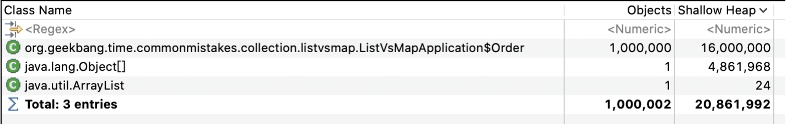
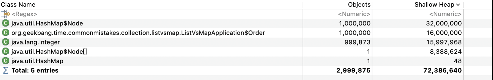

### 数值类

#### 数值计算，精度、舍入、溢出问题

**使用 BigDecimal 表示和计算浮点数，且务必使用字符串的构造方法来初始化BigDecimal**：

```java
private static void right() {
    /*
    使用 BigDecimal 表示和计算浮点数，且务必使用字符串的构造方法来初始化 BigDecimal 对象。
     */
    System.out.println(new BigDecimal("0.1").add(new BigDecimal("0.2")));
    System.out.println(new BigDecimal("1.0").subtract(new BigDecimal("0.8")));
    System.out.println(new BigDecimal("4.015").multiply(new BigDecimal("100")));
    System.out.println(new BigDecimal("123.3").divide(new BigDecimal("100")));
}
```

如果一定要用 Double 来初始化 BigDecimal 的话，可以使用 BigDecimal.valueOf 方法，以确保其表现和字符串形式的构造方法一致，这也是官方文档更推荐的方式：

```java
System.out.println(new BigDecimal("4.015").multiply(BigDecimal.valueOf(100)));
```

#### 考虑浮点数舍入和格式化的方式

**浮点数的字符串格式化也要通过 BigDecimal 进行**。

```java
private static void right() {
    BigDecimal num1 = new BigDecimal("3.35");
    BigDecimal num2 = num1.setScale(1, BigDecimal.ROUND_DOWN);
    System.out.println(num2);
    BigDecimal num3 = num1.setScale(1, BigDecimal.ROUND_HALF_UP);
    System.out.println(num3);
}
```

##### **如果我们希望只比较 BigDecimal 的 value，可以使用 compareTo 方法**

你可能会意识到 BigDecimal 的 equals 和 hashCode 方法会同时考虑 value 和 scale，如果结合 HashSet 或 HashMap 使用的话就可能会出现麻烦。比如，我们把值为 1.0 的 BigDecimal 加入 HashSet，然后判断其是否存在值为 1 的 BigDecimal，得到的结果是 false：

```java
private static void set() {
    Set<BigDecimal> hashSet1 = new HashSet<>();
    hashSet1.add(new BigDecimal("1.0"));
    System.out.println(hashSet1.contains(new BigDecimal("1")));//返回false

    Set<BigDecimal> hashSet2 = new HashSet<>();
    hashSet2.add(new BigDecimal("1.0").stripTrailingZeros());
    System.out.println(hashSet2.contains(new BigDecimal("1.000").stripTrailingZeros()));//返回true

    Set<BigDecimal> treeSet = new TreeSet<>();
    treeSet.add(new BigDecimal("1.0"));
    System.out.println(treeSet.contains(new BigDecimal("1")));//返回true
}
```

#### 小心数值溢出问题

```java
private static void wrong() {
    long l = Long.MAX_VALUE;
    System.out.println(l + 1); // -9223372036854775808
    System.out.println(l + 1 == Long.MIN_VALUE); // true
}

private static void right2() {
    try {
        long l = Long.MAX_VALUE;
        System.out.println(Math.addExact(l, 1));
    } catch (Exception ex) {
        ex.printStackTrace();
    }
}

private static void right1() {

    BigInteger i = new BigInteger(String.valueOf(Long.MAX_VALUE));
    System.out.println(i.add(BigInteger.ONE).toString()); // 9223372036854775808

    try {
        long l = i.add(BigInteger.ONE).longValueExact();
    } catch (Exception ex) {
        ex.printStackTrace();
    }
}
```

在数据库中，浮点数和整型数字的定义与具体的数据库系统有关。通常情况下，可以使用以下规则定义它们：

1. 整型数字（Integer）：用于表示没有小数部分的数字。在MySQL中，可以使用`INT`、`TINYINT`、`SMALLINT`、`MEDIUMINT`、`BIGINT`等类型来定义整型数字，具体选择取决于数据的范围和精度要求。
2. 浮点数（Floating-Point Number）：用于表示带有小数部分的数字。在MySQL中，可以使用`FLOAT`、`DOUBLE`、`DECIMAL`等类型来定义浮点数，具体选择取决于精度和范围的要求。一般来说，`FLOAT`和`DOUBLE`用于近似的浮点数计算，而`DECIMAL`用于精确的十进制计算。

**要实现浮点数的准确计算，特别是在涉及货币和金融领域等对精度要求高的场景中**，可以采用以下方法：

1. **使用DECIMAL类型**：DECIMAL类型在数据库中用于存储精确的十进制数值，可以指定精度和范围。在进行货币计算等场景中，建议使用DECIMAL类型来确保计算的精确性。
2. 避免浮点数比较：由于浮点数在计算机中是以近似值表示的，可能存在精度丢失的情况。在比较浮点数时，应该避免直接使用相等性判断，而是考虑使用范围或误差来进行比较。
3. 使用BigDecimal进行计算：在Java等编程语言中，可以使用BigDecimal类来进行高精度的数值计算。BigDecimal类可以表示任意精度的十进制数值，避免了浮点数计算时的精度丢失问题。

### 集合类

https://blog.csdn.net/qq_37284798/article/details/130357285

#### 使用 Arrays.asList 把数据转换为 List 的三个坑

```java
private static void wrong1() {
    int[] arr = {1, 2, 3};
    List list = Arrays.asList(arr);
    log.info("list:{} size:{} class:{}", list, list.size(), list.get(0).getClass());
}
```

但，这样初始化的 List 并不是我们期望的包含 3 个数字的 List。通过日志可以发现，这个 List 包含的其实是一个 int 数组，整个 List 的元素个数是 1，元素类型是整数数组。

```java
15:57:24.484 [main] INFO org.geekbang.time.commonmistakes.collection.aslist.AsListApplication - list:[[I@17c68925] size:1 class:class [I
```

其原因是，只能是把 int 装箱为 Integer，不可能把 int 数组装箱为 Integer 数组。我们知道，Arrays.asList 方法传入的是一个泛型 T 类型可变参数，最终 int 数组整体作为了一个对象成为了泛型类型 T：

```java
public static <T> List<T> asList(T... a) {
    return new ArrayList<>(a);
}
```

直接遍历这样的 List 必然会出现 Bug，修复方式有两种，如果使用 Java8 以上版本可以使用 Arrays.stream 方法来转换，否则可以把 int 数组声明为包装类型 Integer 数组：

```java
private static void right1() {
    int[] arr1 = {1, 2, 3};
    List list1 = Arrays.stream(arr1).boxed().collect(Collectors.toList());
    log.info("list:{} size:{} class:{}", list1, list1.size(), list1.get(0).getClass());

    Integer[] arr2 = {1, 2, 3};
    List list2 = Arrays.asList(arr2);
    log.info("list:{} size:{} class:{}", list2, list2.size(), list2.get(0).getClass());
}
```

输出：

```java
15:59:53.057 [main] INFO org.geekbang.time.commonmistakes.collection.aslist.AsListApplication - list:[1, 2, 3] size:3 class:class java.lang.Integer
15:59:53.057 [main] INFO org.geekbang.time.commonmistakes.collection.aslist.AsListApplication - list:[1, 2, 3] size:3 class:class java.lang.Integer
```

可以看到**第一个坑是，不能直接使用 Arrays.asList 来转换基本类型数组**。那么，我们获得了正确的 List，是不是就可以像普通的 List 那样使用了呢？我们继续往下看。

```java
private static void wrong2() {
    String[] arr = {"1", "2", "3"};
    List list = Arrays.asList(arr);
    arr[1] = "4";
    try {
        list.add("5");
    } catch (Exception ex) {
        ex.printStackTrace();
    }
    log.info("arr:{} list:{}", Arrays.toString(arr), list);
}
```

输出：日志里有一个 UnsupportedOperationException，为 List 新增字符串 5 的操作失败了，而且把原始数组的第二个元素从 2 修改为 4 后，asList 获得的 List 中的第二个元素也被修改为 4 了：

```java
java.lang.UnsupportedOperationException
	at java.util.AbstractList.add(AbstractList.java:148)
	at java.util.AbstractList.add(AbstractList.java:108)
	at org.geekbang.time.commonmistakes.collection.aslist.AsListApplication.wrong2(AsListApplication.java:51)
	at org.geekbang.time.commonmistakes.collection.aslist.AsListApplication.main(AsListApplication.java:15)
16:02:42.285 [main] INFO org.geekbang.time.commonmistakes.collection.aslist.AsListApplication - arr:[1, 4, 3] list:[1, 4, 3]
```

第二个坑，**Arrays.asList 返回的 List 不支持增删操作**。Arrays.asList 返回的 List 并不是我们期望的 java.util.ArrayList，而是 Arrays 的内部类 ArrayList。ArrayList 内部类继承自 AbstractList 类，并没有覆写父类的 add 方法，而父类中 add 方法的实现，就是抛出 UnsupportedOperationException。

**第三个坑，对原始数组的修改会影响到我们获得的那个 List**。看一下 ArrayList 的实现，可以发现 ArrayList 其实是直接使用了原始的数组。所以，我们要特别小心，把通过 Arrays.asList 获得的 List 交给其他方法处理，很容易因为共享了数组，相互修改产生 Bug。

修复方式比较简单，重新 new 一个 ArrayList 初始化 Arrays.asList 返回的 List 即可：

```java
private static void right2() {
    String[] arr = {"1", "2", "3"};
    // 包裹一下
    List list = new ArrayList(Arrays.asList(arr));
    arr[1] = "4";
    try {
        list.add("5");
    } catch (Exception ex) {
        ex.printStackTrace();
    }
    log.info("arr:{} list:{}", Arrays.toString(arr), list);
}
```

#### 使用 List.subList 进行切片操作居然会导致 OOM？

业务开发时常常要对 List 做切片处理，即取出其中部分元素构成一个新的 List，我们通常会想到使用 List.subList 方法。但，和 Arrays.asList 的问题类似，**List.subList 返回的子List 不是一个普通的 ArrayList。这个子 List 可以认为是原始 List 的视图，会和原始 List 相互影响**。如果不注意，很可能会因此产生 OOM 问题。 


```java
private static List<List<Integer>> data = new ArrayList<>();
private static void oom() {
    for (int i = 0; i < 100000; i++) {
        List<Integer> rawList = IntStream.rangeClosed(1, 100000).boxed().collect(Collectors.toList());
        data.add(rawList.subList(0, 1));
    }
}
```

你可能会觉得，这个 data 变量里面最终保存的只是 100000个具有 1 个元素的 List，不会占用很大空间，但程序运行不久就出现了 OOM：（我这里没有出现可能要改大这个数量）

```java
Exception in thread "main" java.lang.OutOfMemoryError: GC overhead limit exceeded
	at java.lang.Integer.valueOf(Integer.java:832)
	at java.util.stream.IntPipeline$$Lambda$1/729864207.apply(Unknown Source)
	at java.util.stream.IntPipeline$4$1.accept(IntPipeline.java:250)
	at java.util.stream.Streams$RangeIntSpliterator.forEachRemaining(Streams.java:110)
	at java.util.Spliterator$OfInt.forEachRemaining(Spliterator.java:693)
	at java.util.stream.AbstractPipeline.copyInto(AbstractPipeline.java:481)
	at java.util.stream.AbstractPipeline.wrapAndCopyInto(AbstractPipeline.java:471)
	at java.util.stream.ReduceOps$ReduceOp.evaluateSequential(ReduceOps.java:708)
	at java.util.stream.AbstractPipeline.evaluate(AbstractPipeline.java:234)
	at java.util.stream.ReferencePipeline.collect(ReferencePipeline.java:499)
	at org.geekbang.time.commonmistakes.collection.sublist.SubListApplication.oom(SubListApplication.java:38)
```

我这里等待时间比较久

**出现 OOM 的原因是，循环中的 1000 个具有 10 万个元素的 List 始终得不到回收，因为它始终被 subList 方法返回的 List 强引用**。那么，返回的子 List 为什么会强引用原始的 List，它们又有什么关系呢？我们再继续做实验观察一下这个子 List 的特性。

首先初始化一个包含数字 1 到 10 的 ArrayList，然后通过调用 subList 方法取出 2、3、4；随后删除这个 SubList 中的元素数字 3，并打印原始的 ArrayList；最后为原始的 ArrayList 增加一个元素数字 0，遍历 SubList 输出所有元素：

```java
private static void right1() {
    List<Integer> list = IntStream.rangeClosed(1, 10).boxed().collect(Collectors.toList());
    List<Integer> subList = new ArrayList<>(list.subList(1, 4));
    System.out.println(subList);
    subList.remove(1);
    System.out.println(list);
    list.add(0);
    subList.forEach(System.out::println);
}
```

代码运行后得到如下输出：

```java
[2, 3, 4]
[1, 2, 4, 5, 6, 7, 8, 9, 10]
java.util.ConcurrentModificationException
  at java.util.ArrayList$SubList.checkForComodification(ArrayList.java:1239)
  at java.util.ArrayList$SubList.listIterator(ArrayList.java:1099)
  at java.util.AbstractList.listIterator(AbstractList.java:299)
  at java.util.ArrayList$SubList.iterator(ArrayList.java:1095)
  at java.lang.Iterable.forEach(Iterable.java:74)
```

可以看到两个现象：

- 原始 List 中数字 3 被删除了，说明删除子 List 中的元素影响到了原始 List；
- 尝试为原始 List 增加数字 0 之后再遍历子 List，会出现 ConcurrentModificationException。

```java
public class ArrayList<E> extends AbstractList<E>
        implements List<E>, RandomAccess, Cloneable, java.io.Serializable
{
  protected transient int modCount = 0;
  private void ensureExplicitCapacity(int minCapacity) {
        modCount++;
        // overflow-conscious code
        if (minCapacity - elementData.length > 0)
            grow(minCapacity);
    }
    
    public void add(int index, E element) {
    rangeCheckForAdd(index);

    ensureCapacityInternal(size + 1);  // Increments modCount!!
    System.arraycopy(elementData, index, elementData, index + 1,
                     size - index);
    elementData[index] = element;
    size++;
  }

  public List<E> subList(int fromIndex, int toIndex) {
    subListRangeCheck(fromIndex, toIndex, size);
    return new SubList(this, offset, fromIndex, toIndex);
  }

  private class SubList extends AbstractList<E> implements RandomAccess {
    private final AbstractList<E> parent;
    private final int parentOffset;
    private final int offset;
    int size;

    SubList(AbstractList<E> parent,
          int offset, int fromIndex, int toIndex) {
        this.parent = parent;
        this.parentOffset = fromIndex;
        this.offset = offset + fromIndex;
        this.size = toIndex - fromIndex;
        this.modCount = ArrayList.this.modCount;
    }

      public E set(int index, E element) {
          rangeCheck(index);
          checkForComodification();
          return l.set(index+offset, element);
      }

    public ListIterator<E> listIterator(final int index) {
                checkForComodification();
                ...
    }

    private void checkForComodification() {
        if (ArrayList.this.modCount != this.modCount)
            throw new ConcurrentModificationException();
    }
    ...
  }
}
```

第一，ArrayList 维护了一个叫作 modCount 的字段，表示集合结构性修改的次数。所谓结构性修改，指的是影响 List 大小的修改，所以 add 操作必然会改变 modCount 的值。

第二，分析第 21 到 24 行的 subList 方法可以看到，获得的 List 其实是内部类 SubList，并不是普通的 ArrayList，在初始化的时候传入了 this。

第三，分析第 26 到 39 行代码可以发现，这个 SubList 中的 parent 字段就是原始的 List。SubList 初始化的时候，并没有把原始 List 中的元素复制到独立的变量中保存。我们可以认为 SubList 是原始 List 的视图，并不是独立的 List。双方对元素的修改会相互影响，而且 SubList 强引用了原始的 List，所以大量保存这样的 SubList 会导致 OOM。

第四，分析第 47 到 55 行代码可以发现，遍历 SubList 的时候会先获得迭代器，比较原始 ArrayList modCount 的值和 SubList 当前 modCount 的值。获得了 SubList 后，我们为原始 List 新增了一个元素修改了其 modCount，所以判等失败抛出 ConcurrentModificationException 异常。

既然 SubList 相当于原始 List 的视图，那么避免相互影响的修复方式有两种：

修复后代码输出如下：

- 一种是，不直接使用 subList 方法返回的 SubList，而是重新使用 new ArrayList，在构造方法传入 SubList，来构建一个独立的 ArrayList；
- 另一种是，对于 Java 8 使用 Stream 的 skip 和 limit API 来跳过流中的元素，以及限制流中元素的个数，同样可以达到 SubList 切片的目的。

```java
private static void right1() {
    List<Integer> list = IntStream.rangeClosed(1, 10).boxed().collect(Collectors.toList());
    List<Integer> subList = new ArrayList<>(list.subList(1, 4));
    System.out.println(subList);
    subList.remove(1);
    System.out.println(list);
    list.add(0);
    subList.forEach(System.out::println);
}

private static void right2() {
    List<Integer> list = IntStream.rangeClosed(1, 10).boxed().collect(Collectors.toList());
    List<Integer> subList = list.stream().skip(1).limit(3).collect(Collectors.toList());
    System.out.println(subList);
    subList.remove(1);
    System.out.println(list);
    list.add(0);
    subList.forEach(System.out::println);
}
```

#### 一定要让合适的数据结构做合适的事情

##### 第一个误区是，使用数据结构不考虑平衡时间和空间。

```java
@Data
@NoArgsConstructor
@AllArgsConstructor
static class Order {
    private int orderId;
}
```

然后，定义一个包含 elementCount 和 loopCount 两个参数的 listSearch 方法，初始化一个具有 elementCount 个订单对象的 ArrayList，循环 loopCount 次搜索这个 ArrayList，每次随机搜索一个订单号：

```java
private static Object listSearch(int elementCount, int loopCount) {
    List<Order> list = IntStream.rangeClosed(1, elementCount).mapToObj(i -> new Order(i)).collect(Collectors.toList());
    IntStream.rangeClosed(1, loopCount).forEach(i -> {
        int search = ThreadLocalRandom.current().nextInt(elementCount);
        Order result = list.stream().filter(order -> order.getOrderId() == search).findFirst().orElse(null);
        Assert.assertTrue(result != null && result.getOrderId() == search);
    });
    return list;
}
```

随后，定义另一个 mapSearch 方法，从一个具有 elementCount 个元素的 Map 中循环 loopCount 次查找随机订单号。Map 的 Key 是订单号，Value 是订单对象：

```java
private static Object mapSearch(int elementCount, int loopCount) {
    Map<Integer, Order> map = IntStream.rangeClosed(1, elementCount).boxed().collect(Collectors.toMap(Function.identity(), i -> new Order(i)));
    IntStream.rangeClosed(1, loopCount).forEach(i -> {
        int search = ThreadLocalRandom.current().nextInt(elementCount);
        Order result = map.get(search);
        Assert.assertTrue(result != null && result.getOrderId() == search);
    });
    return map;
}
```

我们知道，搜索 ArrayList 的时间复杂度是 O(n)，而 HashMap 的 get 操作的时间复杂度是 O(1)。所以，要对大 List 进行单值搜索的话，可以考虑使用 HashMap，其中 Key 是要搜索的值，Value 是原始对象，会比使用 ArrayList 有非常明显的性能优势。

如下代码所示，对 100 万个元素的 ArrayList 和 HashMap，分别调用 listSearch 和 mapSearch 方法进行 1000 次搜索：

```java
int elementCount = 1000000;
int loopCount = 1000;
StopWatch stopWatch = new StopWatch();
stopWatch.start("listSearch");
Object list = listSearch(elementCount, loopCount);
System.out.println(ObjectSizeCalculator.getObjectSize(list));
stopWatch.stop();
stopWatch.start("mapSearch");
Object map = mapSearch(elementCount, loopCount);
stopWatch.stop();
System.out.println(ObjectSizeCalculator.getObjectSize(map));
System.out.println(stopWatch.prettyPrint());
TimeUnit.HOURS.sleep(1);
```

输出：可以看到，仅仅是 1000 次搜索，listSearch 方法耗时 1.64 秒，而 mapSearch 耗时仅仅 62 毫秒。

```java
20861992 // 对象大小1
72388672 // 对象大小2
StopWatch '': running time = 1705976000 ns
---------------------------------------------
ns         %     Task name
---------------------------------------------
1643153100  096%  listSearch
062822900  004%  mapSearch
```

即使我们要搜索的不是单值而是条件区间，也可以尝试使用 HashMap 来进行“搜索性能优化”。**如果你的条件区间是固定的话，可以提前把 HashMap 按照条件区间进行分组，Key 就是不同的区间**。

的确，如果业务代码中有频繁的大 ArrayList 搜索，使用 HashMap 性能会好很多。类似，**如果要对大 ArrayList 进行去重操作，也不建议使用 contains 方法，而是可以考虑使用 HashSet 进行去重**。说到这里，还有一个问题，使用 HashMap 是否会牺牲空间呢？

为此，我们使用 ObjectSizeCalculator 工具打印 ArrayList 和 HashMap 的内存占用，可以看到 ArrayList 占用内存 21M，而 HashMap 占用的内存达到了 72M，是 List 的三倍多。进一步使用 MAT 工具分析堆可以再次证明，ArrayList 在内存占用上性价比很高，77% 是实际的数据（如第 1 个图所示，16000000/20861992），**而 HashMap 的“含金量”只有 22%**（如第 2 个图所示，16000000/72386640）。





所以，在应用内存吃紧的情况下，我们需要考虑是否值得使用更多的内存消耗来换取更高的性能。这里我们看到的是平衡的艺术，空间换时间，还是时间换空间，只考虑任何一个方面都是不对的。

##### 第二个误区是，过于迷信教科书的大 O 时间复杂度。

```java
public static void main(String[] args) {
    int elementCount = 100000;
    int loopCount = 100000;
    StopWatch stopWatch = new StopWatch();
    stopWatch.start("linkedListGet");
    linkedListGet(elementCount, loopCount);
    stopWatch.stop();
    stopWatch.start("arrayListGet");
    arrayListGet(elementCount, loopCount);
    stopWatch.stop();
    System.out.println(stopWatch.prettyPrint());

    StopWatch stopWatch2 = new StopWatch();
    stopWatch2.start("linkedListAdd");
    linkedListAdd(elementCount, loopCount);
    stopWatch2.stop();
    stopWatch2.start("arrayListAdd");
    arrayListAdd(elementCount, loopCount);
    stopWatch2.stop();
    System.out.println(stopWatch2.prettyPrint());
}

private static void linkedListGet(int elementCount, int loopCount) {
    List<Integer> list = IntStream.rangeClosed(1, elementCount).boxed().collect(Collectors.toCollection(LinkedList::new));
    IntStream.rangeClosed(1, loopCount).forEach(i -> list.get(ThreadLocalRandom.current().nextInt(elementCount)));
}

private static void arrayListGet(int elementCount, int loopCount) {
    List<Integer> list = IntStream.rangeClosed(1, elementCount).boxed().collect(Collectors.toCollection(ArrayList::new));
    IntStream.rangeClosed(1, loopCount).forEach(i -> list.get(ThreadLocalRandom.current().nextInt(elementCount)));
}

private static void linkedListAdd(int elementCount, int loopCount) {
    List<Integer> list = IntStream.rangeClosed(1, elementCount).boxed().collect(Collectors.toCollection(LinkedList::new));
    IntStream.rangeClosed(1, loopCount).forEach(i -> list.add(ThreadLocalRandom.current().nextInt(elementCount), 1));
}

private static void arrayListAdd(int elementCount, int loopCount) {
    List<Integer> list = IntStream.rangeClosed(1, elementCount).boxed().collect(Collectors.toCollection(ArrayList::new));
    IntStream.rangeClosed(1, loopCount).forEach(i -> list.add(ThreadLocalRandom.current().nextInt(elementCount), 1));
}
```

运行结果可能会让你大跌眼镜。在随机访问方面，我们看到了 ArrayList 的绝对优势，耗时只有 6 毫秒，而 LinkedList 耗时 3.69 秒，这符合上面我们所说的时间复杂度；但，随机插入操作居然也是 LinkedList 落败，耗时 21 秒，ArrayList 只要 875 毫秒：

```java
StopWatch '': running time = 3705535200 ns
---------------------------------------------
ns         %     Task name
---------------------------------------------
3698977300  100%  linkedListGet
006557900  000%  arrayListGet

StopWatch '': running time = 22563684700 ns
---------------------------------------------
ns         %     Task name
---------------------------------------------
21688435900  096%  linkedListAdd
875248800  004%  arrayListAdd
```

翻看 LinkedList 源码发现，**插入操作的时间复杂度是 O(1) 的前提是，你已经有了那个要插入节点的指针。但，在实现的时候，我们需要先通过循环获取到那个节点的 Node，然后再执行插入操作**。前者也是有开销的，不可能只考虑插入操作本身的代价。

所以，对于插入操作，LinkedList 的时间复杂度其实也是 O(n)。继续做更多实验的话你会发现，在各种常用场景下，LinkedList 几乎都不能在性能上胜出 ArrayList。

讽刺的是，LinkedList 的作者约书亚 · 布洛克（Josh Bloch），在其推特上回复别人时说，虽然 LinkedList 是我写的但我从来不用，有谁会真的用吗？

