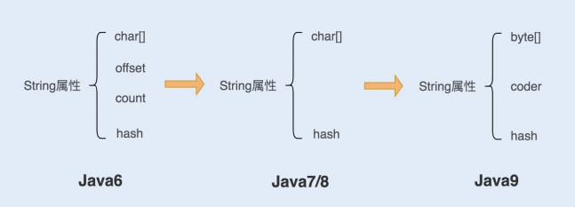

### 字符串调优

```java
1 String str1= "abc";
2 String str2= new String("abc");
3 String str3= str2.intern(); // 是从常量池取出来的，str3是intern返回的引用
4 assertSame(str1==str2); // false
5 assertSame(str2==str3); // false
6 assertSame(str1==str3) // true
```

输出什么呢？

#### String 的实现



**1. 在 Java6 以及之前的版本中**，String 对象是对 char 数组进行了封装实现的对象，主要有四个成员变量：char 数组、偏移量 offset、字符数量 count、哈希值 hash。String 对象是通过 offset 和 count 两个属性来定位 char[] 数组，获取字符串。这么做可以高效、快速地共享数组对象，同时节省内存空间，但这种方式很有可能会导致内存泄漏。

**2. 从 Java7 版本开始到 Java8 版本**，Java 对 String 类做了一些改变。String 类中不再有offset 和 count 两个变量了。这样的好处是 String 对象占用的内存稍微少了些，同时，String.substring 方法也不再共享 char[]，从而解决了使用该方法可能导致的内存泄漏问题。

**3. 从 Java9 版本开始，**工程师将 char[] 字段改为了 byte[] 字段，又维护了一个新的属性coder，它是一个编码格式的标识。

工程师为什么这样修改呢？

我们知道一个 char 字符占 16 位，2 个字节。这个情况下，存储单字节编码内的字符（占一个字节的字符）就显得非常浪费。JDK1.9 的 String 类为了节约内存空间，于是使用了占8 位，1 个字节的 byte 数组来存放字符串。

而新属性 coder 的作用是，在计算字符串长度或者使用 indexOf（）函数时，我们需要根据这个字段，判断如何计算字符串长度。coder 属性默认有 0 和 1 两个值，0 代表 Latin-1（单字节编码），1 代表 UTF-16。如果 String 判断字符串只包含了 Latin-1，则 coder属性值为 0，反之则为 1。

#### String 对象不可变性

第一，保证 String 对象的安全性。假设 String 对象是可变的，那么 String 对象将可能被恶意修改。

第二，保证 hash 属性值不会频繁变更，确保了唯一性，使得类似 HashMap 容器才能实现相应的 key-value 缓存功能。

第三，**可以实现字符串常量池**。在 Java 中，通常有两种创建字符串对象的方式，一种是通过字符串常量的方式创建，如 String str=“abc”；另一种是字符串变量通过 new 形式的创建，如 String str = new String(“abc”)。

> 当代码中使用第一种方式创建字符串对象时，JVM 首先会检查该对象是否在字符串常量池中，如果在，就返回该对象引用，否则新的字符串将在常量池中被创建。这种方式可以减少同一个值的字符串对象的重复创建，节约内存。
>
> String str = new String(“abc”) 这种方式，首先在编译类文件时，"abc"常量字符串将会放入到常量结构中，在类加载时，“abc"将会在常量池中创建；其次，在调用 new 时，JVM 命令将会调用 String 的构造函数，同时引用常量池中的"abc” 字符串，在堆内存中创建一个 String 对象；最后，str 将引用 String 对象。

#### **String** **对象的优化**

##### **1.** **如何构建超大字符串？**

`String str= "ab" + "cd" + "ef";`

首先会生成 ab 对象，再生成 abcd 对象，最后生成 abcdef 对象，从理论上来说，这段代码是低效的。但实际运行中，我们发现只有一个对象生成，这是为什么呢？难道我们的理论判断错了？我们再来看编译后的代码，你会发现编译器自动优化了这行代码，如下：`String str= "abcdef";`

```java
String str = "abcdef";
for(int i=0; i<1000; i++) {
 str = str + i;
}
```

上面的代码编译后，你可以看到编译器同样对这段代码进行了优化。不难发现，Java 在进行字符串的拼接时，偏向使用 StringBuilder，这样可以提高程序的效率。

```java
String str = "abcdef";
for(int i=0; i<1000; i++) {
 str = (new StringBuilder(String.valueOf(str))).append(i).toString();
}
```

即使使用 + 号作为字符串的拼接，也一样可以被编译器优化成 StringBuilder的方式。但再细致些，**你会发现在编译器优化的代码中，每次循环都会生成一个新的StringBuilder 实例，同样也会降低系统的性能**。

所以**平时做字符串拼接的时候，我建议你还是要显示地使用 String Builder 来提升系统性能**。

如果在多线程编程中，String 对象的拼接涉及到线程安全，你可以使用 StringBuffer。但是要注意，由于 StringBuffer 是线程安全的，涉及到锁竞争，所以从性能上来说，要比StringBuilder 差一些。

##### 2.如何使用intern减少内存

```java
String a =new String("abc").intern();
String b = new String("abc").intern();
if(a==b) {
 System.out.print("a==b");
}
// a==b
```

**在字符串常量中，默认会将对象放入常量池；在字符串变量中，对象是会创建在堆内存中，同时也会在常量池中创建一个字符串对象，复制到堆内存对象中，并返回堆内存对象引用**。

如果调用 intern 方法，会去查看字符串常量池中是否有等于该对象的字符串，如果没有，就在常量池中新增该对象，并返回该对象引用；如果有，就返回常量池中的字符串引用。堆内存中原有的对象由于没有引用指向它，将会通过垃圾回收器回收。

在一开始创建 a 变量时，会在堆内存中创建一个对象，同时会在加载类时，在常量池中创建一个字符串对象，在调用 intern 方法之后，会去常量池中查找是否有等于该字符串的对象，有就返回引用。

在创建 b 字符串变量时，也会在堆中创建一个对象，此时常量池中有该字符串对象，就不再创建。调用 intern 方法则会去常量池中判断是否有等于该字符串的对象，发现有等于"abc"字符串的对象，就直接返回引用。而在堆内存中的对象，由于没有引用指向它，将会被垃圾回收。所以 a 和 b 引用的是同一个对象。


##### **3.** **如何使用字符串的分割方法？**

最后我想跟你聊聊字符串的分割，这种方法在编码中也很最常见。Split() 方法使用了正则表达式实现了其强大的分割功能，而正则表达式的性能是非常不稳定的，使用不恰当会引起回溯问题，很可能导致 CPU 居高不下。

所以我们应该慎重使用 Split() 方法，我们可以用 String.indexOf() 方法代替 Split() 方法完成字符串的分割。如果实在无法满足需求，你就在使用 Split() 方法时，对回溯问题加以重视就可以了。

### **慎重使用正则表达式**

### **ArrayList还是LinkedList？使用不当性能差千倍**

“**ArrayList 和 LinkedList 在新增、删除元素时，LinkedList 的效率要高于 ArrayList，而在遍历的时候，ArrayList 的效率要高于 LinkedList**。”这个回答是否准确呢？今天这一讲就带你验证。这个需要加上数据量，是那种新增方法，哪种删除方法。

#### ArrayList如何实现的？

**问题 1：**我们在查看 ArrayList 的实现类源码时，你会发现对象数组 elementData 使用了transient 修饰，我们知道 transient 关键字修饰该属性，则表示该属性不会被序列化，然而我们并没有看到文档中说明 ArrayList 不能被序列化，这是为什么？

> 这还得从“ArrayList 是基于数组实现“开始说起，由于 ArrayList 的数组是基于动态扩增的，所以并不是所有被分配的内存空间都存储了数据。
>
> 如果采用外部序列化法实现数组的序列化，会序列化整个数组。ArrayList 为了避免这些没有存储数据的内存空间被序列化，内部提供了两个私有方法 writeObject 以及 readObject来自我完成序列化与反序列化，从而在序列化与反序列化数组时节省了空间和时间。
>
> **因此使用 transient 修饰数组，是防止对象数组被其他外部方法序列化**。

**问题 2：**我们在使用 ArrayList 进行新增、删除时，经常被提醒“使用 ArrayList 做新增删除操作会影响效率”。那是不是 ArrayList 在大量新增元素的场景下效率就一定会变慢呢？

**问题 3：**如果让你使用 for 循环以及迭代循环遍历一个 ArrayList，你会使用哪种方式呢？原因是什么？

##### **ArrayList** **构造函数**

当 ArrayList 新增元素时，如果所存储的元素已经超过其已有大小，它会计算元素大小后再进行动态扩容，数组的扩容会导致整个数组进行一次内存复制。因此，**我们在初始化ArrayList 时，可以通过第一个构造函数合理指定数组初始大小，这样有助于减少数组的扩容次数，从而提高系统性能**。

##### **ArrayList** **新增元素**

一种是直接将元素加到数组的末尾，另外一种是添加元素到任意位置。

**添加元素到任意位置，会导致在该位置后的所有元素都需要重新排列**，而**将元素添加到数组的末尾，在没有发生扩容的前提下，是不会有元素复制排序过程的**。

##### **ArrayList** **删除元素**

ArrayList 的删除方法和添加任意位置元素的方法是有些相同的。ArrayList 在每一次有效的删除元素操作之后，都要进行数组的重组，并且**删除的元素位置越靠前，数组重组的开销就越大**。

##### **ArrayList** **遍历元素**

由于 ArrayList 是基于数组实现的，所以在获取元素的时候是非常快捷的。

```java
public E get(int index) {
    rangeCheck(index);

    return elementData(index);
}
E elementData(int index) {
    return (E) elementData[index];
}
```

#### LinkedList如何实现的？

LinkedList 是基于双向链表数据结构实现的，LinkedList 定义了一个 Node 结构，Node结构中包含了 3 个部分：元素内容 item、前指针 prev 以及后指针 next，代码如下：

```java
private static class Node<E> {
    E item;
    Node<E> next;
    Node<E> prev;

    Node(Node<E> prev, E element, Node<E> next) {
        this.item = element;
        this.next = next;
        this.prev = prev;
    }
}
```

总结一下，LinkedList 就是由 Node 结构对象连接而成的一个双向链表。在 JDK1.7 之前，LinkedList 中只包含了一个 Entry 结构的 header 属性，并在初始化的时候默认创建一个空的 Entry，用来做 header，前后指针指向自己，形成一个循环双向链表。

在 JDK1.7 之后，LinkedList 做了很大的改动，对链表进行了优化。链表的 Entry 结构换成了 Node，内部组成基本没有改变，但 LinkedList 里面的 header 属性去掉了，新增了一个 Node 结构的 first 属性和一个 Node 结构的 last 属性。这样做有以下几点好处：

- first/last 属性能更清晰地表达链表的链头和链尾概念；
- first/last 方式可以在初始化 LinkedList 的时候节省 new 一个 Entry；
- first/last 方式最重要的性能优化是链头和链尾的插入删除操作更加快捷了。

LinkedList 的两个重要属性 first/last 属性，其实还有一个 size 属性。我们可以看到这三个属性都被 transient 修饰了，原因很简单，我们在序列化的时候不会只对头尾进行序列化，所以 LinkedList 也是自行实现 readObject 和 writeObject 进行序列化与反序列化。

##### **LinkedList** **新增元素**

LinkedList 添加元素的实现很简洁，但添加的方式却有很多种。默认的 add (Ee) 方法是将添加的元素加到队尾，首先是将 last 元素置换到临时变量中，生成一个新的 Node 节点对象，然后将 last 引用指向新节点对象，之前的 last 对象的前指针指向新节点对象。

**LinkedList 也有添加元素到任意位置的方法**，如果我们是将元素添加到任意两个元素的中间位置，添加元素操作只会改变前后元素的前后指针，指针将会指向添加的新元素，**所以相比 ArrayList 的添加操作来说，LinkedList 的性能优势明显**。

##### **LinkedList** **删除元素**

在 LinkedList 删除元素的操作中，我们首先要通过循环找到要删除的元素，如果要删除的位置处于 List 的前半段，就从前往后找；若其位置处于后半段，就从后往前找。

这样做的话，**无论要删除较为靠前或较为靠后的元素都是非常高效的，但如果 List 拥有大量元素，移除的元素又在 List 的中间段，那效率相对来说会很低**。


#### **ArrayList 和 LinkedList 遍历元素操作测试**

相关代码测试：[GitHub - nickliuchao/collection](https://github.com/nickliuchao/collection)

for(;;) 循环（不是for each）

迭代器迭代循环

结果（花费时间）

ArrayList<LinkedList

ArrayList≈LinkedList

我们可以看到，LinkedList 的 for 循环性能是最差的，而 ArrayList 的 for 循环性能是最好的。

这是因为 LinkedList 基于链表实现的，在使用 for 循环的时候，每一次 for 循环都会去遍历半个 List，所以严重影响了遍历的效率；**ArrayList 则是基于数组实现的，并且实现了RandomAccess 接口标志，意味着 ArrayList 可以实现快速随机访问，所以 for 循环效率非常高**。

**LinkedList 的迭代循环遍历和 ArrayList 的迭代循环遍历性能相当，也不会太差，所以在遍历 LinkedList 时，我们要切忌使用 for 循环遍历**。

##### for循环遍历删除ArrayList数组例子

```java
public void test6() {
    ArrayList<String> list = new ArrayList<String>();
    list.add("a");
    list.add("a");
    list.add("b");
    list.add("b");
    list.add("c");
    list.add("c");
    // 注意这里是有相同的加入进去了

    //        remove(list, "b");
    remove2(list, "b");

    for (int i = 0; i < list.size(); i++) {
        System.out.println("element: " + list.get(i));
    }
}

private void remove(ArrayList<String> list, String b) {
    Iterator<String> iterator = list.iterator();
    while(iterator.hasNext()) {
        String str = iterator.next();
        if (str.equals(b)) {
            iterator.remove();
        }
    }
}

private void remove2(ArrayList<String> list, String b) {
    for (String s : list) {
        if (s.equals(b)) {
            list.remove(s);
        }
    }
}
```

remove2 会报错：

```java
java.util.ConcurrentModificationException
	at java.util.ArrayList$Itr.checkForComodification(ArrayList.java:901)
	at java.util.ArrayList$Itr.next(ArrayList.java:851)
	at temptest.Testttt.remove2(Testttt.java:148)
	at temptest.Testttt.test6(Testttt.java:130)
```

能看到在经过编译之后for each循环会被编译成下面这个代码

```java
private void remove2(ArrayList<String> list, String b) {
    Iterator var3 = list.iterator();

    while(var3.hasNext()) {
        String s = (String)var3.next();
        if (s.equals(b)) {
            list.remove(s);
        }
    }

}
```

这里会被解释为迭代器，在使用迭代器遍历时，ArrayList内部创建了一个内部迭代器iterator，在使用next()方法来取下一个元素时，会使用ArrayList里保存的一个用来记录List修改次数的变量modCount，与iterator保存了一个expectedModCount来表示期望的修改次数进行比较，如果不相等则会抛出异常；

```java
public E next() {
    checkForComodification();
    int i = cursor;
    if (i >= size)
        throw new NoSuchElementException();
    Object[] elementData = ArrayList.this.elementData;
    if (i >= elementData.length)
        throw new ConcurrentModificationException();
    cursor = i + 1;
    return (E) elementData[lastRet = i];
}
```

而在在foreach循环中调用list中的remove()方法，会走到fastRemove()方法，该方法不是iterator中的方法，而是ArrayList中的方法，在该方法只做了modCount++，而没有同步到expectedModCount。这里在删除了一次之后modCount=7了，而expectedModCount还是6。

当再次遍历时，会先调用内部类iteator中的hasNext(),再调用next(),在调用next()方法时，会对modCount和expectedModCount进行比较，此时两者不一致，就抛出了ConcurrentModificationException异常。

所以关键是用ArrayList的remove还是iterator中的remove。

### Java8 stream 提高集合遍历效率

中间操作又可以分为无状态（Stateless）与有状态（Stateful）操作，**前者是指元素的处理不受之前元素的影响，后者是指该操作只有拿到所有元素之后才能继续下去**。

终结操作又可以分为短路（Short-circuiting）与非短路（Unshort-circuiting）操作，**前者是指遇到某些符合条件的元素就可以得到最终结果，后者是指必须处理完所有元素才能得到最终结果**。


**我们通常还会将中间操作称为懒操作，也正是由这种懒操作结合终结操作、数据源构成的处理管道（Pipeline），实现了 Stream 的高效**。

#### Stream 源码实现


BaseStream 和 Stream 为最顶端的接口类。BaseStream 主要定义了流的基本接口方法，例如，spliterator、isParallel 等；Stream 则定义了一些流的常用操作方法，例如，map、filter 等。

ReferencePipeline 是一个结构类，他通过定义内部类组装了各种操作流。他定义了Head、StatelessOp、StatefulOp 三个内部类，实现了 BaseStream 与 Stream 的接口方法。

Sink 接口是定义每个 Stream 操作之间关系的协议，他包含 begin()、end()、cancellationRequested()、accpt() 四个方法。ReferencePipeline 最终会将整个 Stream流操作组装成一个调用链，而这条调用链上的各个 Stream 操作的上下关系就是通过 Sink接口协议来定义实现的。

#### Stream 操作叠加

我们知道，一个 Stream 的各个操作是由处理管道组装，并统一完成数据处理的。在 JDK中每次的中断操作会以使用阶段（Stage）命名。

管道结构通常是由 ReferencePipeline 类实现的，前面讲解 Stream 包结构时，我提到过ReferencePipeline 包含了 Head、StatelessOp、StatefulOp 三种内部类。

Head 类主要用来定义数据源操作，在我们初次调用 names.stream() 方法时，会初次加载Head 对象，此时为加载数据源操作；接着加载的是中间操作，分别为无状态中间操作StatelessOp 对象和有状态操作 StatefulOp 对象，此时的 Stage 并没有执行，而是通过AbstractPipeline 生成了一个中间操作 Stage 链表；当我们调用终结操作时，会生成一个最终的 Stage，通过这个 Stage 触发之前的中间操作，从最后一个 Stage 开始，递归产生一个 Sink 链。如下图所示：


##### 实例分析

```java
List<String> names = Arrays.asList(" 张三 ", " 李四 ", " 王老五 ", " 李三 ", " 刘老四 ");
String maxLenStartWithZ = names.stream()
        .filter(name -> name.startsWith(" 张 "))
        .mapToInt(String::length)
        .max()
        .toString();
```

##### 串行处理

这个例子的需求是查找出一个长度最长，并且以张为姓氏的名字。从代码角度来看，你可能会认为是这样的操作流程：首先遍历一次集合，得到以“张”开头的所有名字；然后遍历一次 filter 得到的集合，将名字转换成数字长度；最后再从长度集合中找到最长的那个名字并且返回。**错误！！！**

首先 ，因为 names 是 ArrayList 集合，所以 names.stream() 方法将会调用集合类基础接口 Collection 的 Stream 方法：

```java
default Stream<E> stream() {
    return StreamSupport.stream(spliterator(), false);
}
```

然后，Stream 方法就会调用 StreamSupport 类的 Stream 方法，方法中初始化了一个ReferencePipeline 的 Head 内部类对象：

```java
public static <T> Stream<T> stream(Spliterator<T> spliterator, boolean parallel) {
    Objects.requireNonNull(spliterator);
    return new ReferencePipeline.Head<>(spliterator,
                                        StreamOpFlag.fromCharacteristics(spliterator),
                                        parallel);
}
```

再调用 filter 和 map 方法，这两个方法都是无状态的中间操作，所以执行 filter 和 map操作时，并没有进行任何的操作，而是分别创建了一个 Stage 来标识用户的每一次操作。

而通常情况下 Stream 的操作又需要一个回调函数，所以一个完整的 Stage 是由数据来源、操作、回调函数组成的三元组来表示。如下图所示，分别是 ReferencePipeline 的filter 方法和 map 方法：

```java
public final Stream<P_OUT> filter(Predicate<? super P_OUT> predicate) {
    Objects.requireNonNull(predicate);
    return new StatelessOp<P_OUT, P_OUT>(this, StreamShape.REFERENCE,
                                 StreamOpFlag.NOT_SIZED) {
        @Override
        Sink<P_OUT> opWrapSink(int flags, Sink<P_OUT> sink) {
            return new Sink.ChainedReference<P_OUT, P_OUT>(sink) {
                @Override
                public void begin(long size) {
                    downstream.begin(-1);
                }

                @Override
                public void accept(P_OUT u) {
                    if (predicate.test(u))
                        downstream.accept(u);
                }
            };
        }
    };
}

@Override
@SuppressWarnings("unchecked")
public final <R> Stream<R> map(Function<? super P_OUT, ? extends R> mapper) {
    Objects.requireNonNull(mapper);
    return new StatelessOp<P_OUT, R>(this, StreamShape.REFERENCE,
                                 StreamOpFlag.NOT_SORTED | StreamOpFlag.NOT_DISTINCT) {
        @Override
        Sink<P_OUT> opWrapSink(int flags, Sink<R> sink) {
            return new Sink.ChainedReference<P_OUT, R>(sink) {
                @Override
                public void accept(P_OUT u) {
                    downstream.accept(mapper.apply(u));
                }
            };
        }
    };
}
```

new StatelessOp 将会调用父类 AbstractPipeline 的构造函数，这个构造函数将前后的Stage 联系起来，生成一个 Stage 链表：

```java
AbstractPipeline(AbstractPipeline<?, E_IN, ?> previousStage, int opFlags) {
    if (previousStage.linkedOrConsumed)
        throw new IllegalStateException(MSG_STREAM_LINKED);
    previousStage.linkedOrConsumed = true;
    previousStage.nextStage = this; // 将当前的 stage 的 next 指针指向之前的 stage

    this.previousStage = previousStage; // 赋值当前 stage 当全局变量 previousStage
    this.sourceOrOpFlags = opFlags & StreamOpFlag.OP_MASK;
    this.combinedFlags = StreamOpFlag.combineOpFlags(opFlags, previousStage.combinedFlags);
    this.sourceStage = previousStage.sourceStage;
    if (opIsStateful())
        sourceStage.sourceAnyStateful = true;
    this.depth = previousStage.depth + 1;
}
```

因为在创建每一个 Stage 时，都会包含一个 opWrapSink() 方法，该方法会把一个操作的具体实现封装在 Sink 类中，Sink 采用（处理 -> 转发）的模式来叠加操作。

当执行 max 方法时，会调用 ReferencePipeline 的 max 方法，此时由于 max 方法是终结操作，所以会创建一个 TerminalOp 操作，同时创建一个 ReducingSink，并且将操作封装在 Sink 类中。

```java
public final Optional<P_OUT> max(Comparator<? super P_OUT> comparator) {
    return reduce(BinaryOperator.maxBy(comparator));
}
```

最后，调用 AbstractPipeline 的 wrapSink 方法，该方法会调用 opWrapSink 生成一个Sink 链表，Sink 链表中的每一个 Sink 都封装了一个操作的具体实现。

```java
final <P_IN> Sink<P_IN> wrapSink(Sink<E_OUT> sink) {
    Objects.requireNonNull(sink);

    for ( @SuppressWarnings("rawtypes") AbstractPipeline p=AbstractPipeline.this; p.depth > 0; p=p.previousStage) {
        sink = p.opWrapSink(p.previousStage.combinedFlags, sink);
    }
    return (Sink<P_IN>) sink;
}
```

当 Sink 链表生成完成后，Stream 开始执行，通过 spliterator 迭代集合，执行 Sink 链表中的具体操作。

```java
final <P_IN> void copyInto(Sink<P_IN> wrappedSink, Spliterator<P_IN> spliterator) {
    Objects.requireNonNull(wrappedSink);

    if (!StreamOpFlag.SHORT_CIRCUIT.isKnown(getStreamAndOpFlags())) {
        wrappedSink.begin(spliterator.getExactSizeIfKnown());
        spliterator.forEachRemaining(wrappedSink);
        wrappedSink.end();
    }
    else {
        copyIntoWithCancel(wrappedSink, spliterator);
    }
}
```

Java8 中的 Spliterator 的 forEachRemaining 会迭代集合，每迭代一次，都会执行一次filter 操作，如果 filter 操作通过，就会触发 map 操作，然后将结果放入到临时数组object 中，再进行下一次的迭代。完成中间操作后，就会触发终结操作 max。

##### 并行处理

Stream 的并行处理在执行终结操作之前，跟串行处理的实现是一样的。而在调用终结方法之后，实现的方式就有点不太一样，会调用 TerminalOp 的 evaluateParallel 方法进行并行处理。

这里的并行处理指的是，Stream 结合了 ForkJoin 框架，对 Stream 处理进行了分片，Splititerator 中的 estimateSize 方法会估算出分片的数据量。

通过预估的数据量获取最小处理单元的阀值，如果当前分片大小大于最小处理单元的阀值，就继续切分集合。每个分片将会生成一个 Sink 链表，当所有的分片操作完成后，ForkJoin框架将会合并分片任何结果集。

#### 合理使用Stream

我们将对常规的迭代、Stream 串行迭代以及 Stream 并行迭代进行性能测试对比，迭代循环中，我们将对数据进行过滤、分组等操作。分别进行以下几组测试：

1. 多核 CPU 服务器配置环境下，对比长度 100 的 int 数组的性能；

2. 多核 CPU 服务器配置环境下，对比长度 1.00E+8 的 int 数组的性能；

3. 多核 CPU 服务器配置环境下，对比长度 1.00E+8 对象数组过滤分组的性能；

4. 单核 CPU 服务器配置环境下，对比长度 1.00E+8 对象数组过滤分组的性能。

具体代码：[GitHub - nickliuchao/stream](https://github.com/nickliuchao/stream)，统计的测试结果（迭代使用时间）：

1. 常规的迭代 <Stream 并行迭代 <Stream 串行迭代

2. Stream 并行迭代 < 常规的迭代 <Stream 串行迭代

3. Stream 并行迭代 < 常规的迭代 <Stream 串行迭代

4. 常规的迭代 <Stream 串行迭代 <Stream 并行迭代

通过以上测试结果，我们可以看到：**在循环迭代次数较少的情况下，常规的迭代方式性能反而更好；在单核 CPU 服务器配置环境中，也是常规迭代方式更有优势；而在大数据循环迭代中，如果服务器是多核 CPU 的情况下，Stream 的并行迭代优势明显**。

**所以我们在平时处理大数据的集合时，应该尽量考虑将应用部署在多核 CPU 环境下，并且使用 Stream 的并行迭代方式进行处理**。

用事实说话，我们看到其实使用 Stream 未必可以使系统性能更佳，还是要结合应用场景进行选择，也就是合理地使用 Stream。

```java
// 使用一个容器装载 100 个数字，通过 Stream 并行处理的方式将容器中为单数的数字转移到容器 parallelList
List<Integer> integerList = new ArrayList<>();
for (int i = 0; i < 100; i++) {
    integerList.add(i);
}

List<Integer> parallelList = new ArrayList<>();
integerList.stream()
        .parallel()
        .filter(i -> i % 2 == 1)
        .forEach(parallelList::add);
// 这段代码在并行处理流的过程中可能存在线程安全问题。多个线程同时向 parallelList 中添加元素可能导致并发修改异常（ConcurrentModificationException）或者丢失数据。
```

### HashMap 设计和优化

从 HashMap 的源码中，我们可以发现，HashMap 是由一个 Node 数组构成，每个Node 包含了一个 key-value 键值对。

```java
transient Node<K,V>[] table;
static class Node<K,V> implements Map.Entry<K,V> {
    final int hash;
    final K key;
    V value;
    Node<K,V> next;

    Node(int hash, K key, V value, Node<K,V> next) {
        this.hash = hash;
        this.key = key;
        this.value = value;
        this.next = next;
    }

    public final K getKey()        { return key; }
    public final V getValue()      { return value; }
    public final String toString() { return key + "=" + value; }

    public final int hashCode() {
        return Objects.hashCode(key) ^ Objects.hashCode(value);
    }

    public final V setValue(V newValue) {
        V oldValue = value;
        value = newValue;
        return oldValue;
    }

    public final boolean equals(Object o) {
        if (o == this)
            return true;
        if (o instanceof Map.Entry) {
            Map.Entry<?,?> e = (Map.Entry<?,?>)o;
            if (Objects.equals(key, e.getKey()) &&
                Objects.equals(value, e.getValue()))
                return true;
        }
        return false;
    }
}
```

Node 类作为 HashMap 中的一个内部类，除了 key、value 两个属性外，还定义了一个next 指针。当有哈希冲突时，HashMap 会用之前数组当中相同哈希值对应存储的 Node对象，通过指针指向新增的相同哈希值的 Node 对象的引用。

我们在使用 HashMap 时，可以结合自己的场景来设置初始容量和加载因子两个参数。当查询操作较为频繁时，我们可以适当地减少加载因子；如果对内存利用率要求比较高，我可以适当的增加加载因子。

**我们还可以在预知存储数据量的情况下，提前设置初始容量（初始容量 = 预知数据量 / 加载因子）**。这样做的好处是可以减少 resize() 操作，提高 HashMap 的效率。

### 网络通信优化之I/O模型：如何解决高并发下I/O瓶颈？

我们都知道，I/O 的速度要比内存速度慢，尤其是在现在这个大数据时代背景下，I/O 的性能问题更是尤为突出，I/O 读写已经成为很多应用场景下的系统性能瓶颈，不容我们忽视。

#### 什么是I/O

I/O 是机器获取和交换信息的主要渠道，而流是完成 I/O 操作的主要方式。

在计算机中，流是一种信息的转换。流是有序的，因此相对于某一机器或者应用程序而言，**我们通常把机器或者应用程序接收外界的信息称为输入流（InputStream），从机器或者应用程序向外输出的信息称为输出流（OutputStream），合称为输入 / 输出流（I/O Streams）**。

机器间或程序间在进行信息交换或者数据交换时，总是先将对象或数据转换为某种形式的流，再通过流的传输，到达指定机器或程序后，再将流转换为对象数据。因此，流就可以被看作是一种数据的载体，通过它可以实现数据交换和传输。


**不管是文件读写还是网络发送接收，信息的最小存储单元都是字节，那为什么 I/O 流操作要分为字节流操作和字符流操作呢**？

我们知道字符到字节必须经过转码，这个过程非常耗时，如果我们不知道编码类型就很容易出现乱码问题。所以 I/O 流提供了一个直接操作字符的接口，方便我们平时对字符进行流操作。


#### 传统 I/O 的性能问题

我们知道，I/O 操作分为磁盘 I/O 操作和网络 I/O 操作。前者是从磁盘中读取数据源输入到内存中，之后将读取的信息持久化输出在物理磁盘上；后者是从网络中读取信息输入到内存，最终将信息输出到网络中。

##### 1 多次内存复制

在传统 I/O 中，我们可以通过 InputStream 从源数据中读取数据流输入到缓冲区里，通过OutputStream 将数据输出到外部设备（包括磁盘、网络）。你可以先看下输入操作在操作系统中的具体流程，如下图所示：


1. JVM 会发出 read() 系统调用，并通过 read 系统调用向内核发起读请求；

2. 内核向硬件发送读指令，并等待读就绪；

3. 内核把将要读取的数据复制到指向的内核缓存中；

4. 操作系统内核将数据复制到用户空间缓冲区，然后 read 系统调用返回。

在这个过程中，数据先从外部设备复制到内核空间，再从内核空间复制到用户空间，这就发生了两次内存复制操作。这种操作会导致不必要的数据拷贝和上下文切换，从而降低 I/O的性能。

##### **2 阻塞**

在传统 I/O 中，InputStream 的 read() 是一个 while 循环操作，它会一直等待数据读取，直到数据就绪才会返回。**这就意味着如果没有数据就绪，这个读取操作将会一直被挂起，用户线程将会处于阻塞状态。**

在少量连接请求的情况下，使用这种方式没有问题，响应速度也很高。但在发生大量连接请求时，就需要创建大量监听线程，这时如果线程没有数据就绪就会被挂起，然后进入阻塞状态。一旦发生线程阻塞，这些线程将会不断地抢夺 CPU 资源，从而导致大量的 CPU 上下文切换，增加系统的性能开销。

#### 如何优化I/O操作

JDK1.4 发布了 java.nio 包（new I/O 的缩写），NIO 的发布优化了内存复制以及阻塞导致的严重性能问题。JDK1.7 又发布了 NIO2，提出了从操作系统层面实现的异步 I/O。

##### 1 使用缓冲区优化读写流操作

在传统 I/O 中，提供了基于流的 I/O 实现，即 InputStream 和 OutputStream，这种基于流的实现以字节为单位处理数据。

NIO 与传统 I/O 不同，它是基于块（Block）的，它以块为基本单位处理数据。在 NIO中，最为重要的两个组件是缓冲区（Buffer）和通道（Channel）。Buffer 是一块连续的内存块，是 NIO 读写数据的中转地。Channel 表示缓冲数据的源头或者目的地，它用于读取缓冲或者写入数据，是访问缓冲的接口。

传统 I/O 和 NIO 的最大区别就是传统 I/O 是面向流，NIO 是面向 Buffer。Buffer 可以将文件一次性读入内存再做后续处理，而传统的方式是边读文件边处理数据。虽然传统 I/O后面也使用了缓冲块，例如 BufferedInputStream，但仍然不能和 NIO 相媲美。**使用NIO 替代传统 I/O 操作，可以提升系统的整体性能，效果立竿见影**。

[ownJavaDemo/democode/src/test/java/nio/TestChannel.java at master · QuanWenLan/ownJavaDemo · GitHub](https://github.com/QuanWenLan/ownJavaDemo/blob/master/democode/src/test/java/nio/TestChannel.java)  利用NIO的读写的例子：

```java
public void test1() {
        FileInputStream fileInputStream = null;
        FileOutputStream fileOutputStream = null;
        FileChannel inChannel = null;
        FileChannel outChannel = null;
        try {
//            fileInputStream = new FileInputStream("E:\\project\\IdeaProjects\\javaDemo\\src\\test\\java\\1.png");
            String c = this.getClass().getResource("/").getPath();
            fileInputStream = new FileInputStream(c + "/1.png");
//            fileOutputStream = new FileOutputStream("E:\\project\\IdeaProjects\\javaDemo\\src\\test\\java\\2.png");
            fileOutputStream = new FileOutputStream(c + "/2.png");

            // 1：获取通道。channel只是通道，操作数据是要用缓冲区来操作
            inChannel = fileInputStream.getChannel();
            outChannel = fileOutputStream.getChannel();

            // 2：将通道中的数据存入缓冲区中
            ByteBuffer dst = ByteBuffer.allocate(1024);
            while (inChannel.read(dst) != -1) {
                // 3：将缓冲区切换成数据为读数据的模式
                dst.flip();
                outChannel.write(dst);
                dst.clear();// 这次读取完数据之后，清空dst，所有的数据limit，position，回归到默认
            }
        } catch (Exception e) {
            e.printStackTrace();
        } finally {
            if (outChannel != null) {
                try {
                    fileInputStream.close();
                } catch (IOException e) {
                    e.printStackTrace();
                }
            }
            if (inChannel != null) {
                try {
                    fileInputStream.close();
                } catch (IOException e) {
                    e.printStackTrace();
                }
            }
            if (fileOutputStream != null) {
                try {
                    fileInputStream.close();
                } catch (IOException e) {
                    e.printStackTrace();
                }
            }
            if (fileInputStream != null) {
                try {
                    fileInputStream.close();
                } catch (IOException e) {
                    e.printStackTrace();
                }
            }
        }
    }
```

##### 2 **使用** **DirectBuffer** **减少内存复制**

NIO 的 Buffer 除了做了缓冲块优化之外，还提供了一个可以直接访问物理内存的类DirectBuffer。普通的 Buffer 分配的是 JVM 堆内存，而 DirectBuffer 是直接分配物理内存。

我们知道数据要输出到外部设备，必须先从用户空间复制到内核空间，再复制到输出设备，而 DirectBuffer 则是直接将步骤简化为从内核空间复制到外部设备，减少了数据拷贝。

这里拓展一点，**由于 DirectBuffer 申请的是非 JVM 的物理内存，所以创建和销毁的代价很高**。**DirectBuffer 申请的内存并不是直接由 JVM 负责垃圾回收，但在 DirectBuffer 包装类被回收时，会通过 Java Reference 机制来释放该内存块**。

##### 3 避免阻塞，优化I/O操作

NIO 发布后，通道和多路复用器这两个基本组件实现了 NIO 的非阻塞。

###### 通道（channel）

###### 多路复用器（Selector）

具体的这部分内容可以看我的NIO的笔记。NIO.md ：\docs\java\IO\NIO.md

### 网络通信优化之序列化：避免使用Java序列化

当前大部分后端服务都是基于微服务架构实现的。服务按照业务划分被拆分，实现了服务的解偶，但同时也带来了新的问题，不同业务之间通信需要通过接口实现调用。两个服务之间要共享一个数据对象，就需要从对象转换成二进制流，通过网络传输，传送到对方服务，再转换回对象，供服务方法调用。**这个编码和解码过程我们称之为序列化与反序列化。**

在大量并发请求的情况下，如果序列化的速度慢，会导致请求响应时间增加；而序列化后的传输数据体积大，会导致网络吞吐量下降。所以一个优秀的序列化框架可以提高系统的整体性能。

Java 提供了 RMI 框架可以实现服务与服务之间的接口暴露和调用，RMI 中对数据对象的序列化采用的是 Java 序列化。**而目前主流的微服务框架却几乎没有用到 Java序列化，SpringCloud 用的是 Json 序列化，Dubbo 虽然兼容了 Java 序列化，但默认使用的是 Hessian 序列化。这是为什么呢**？

#### Java序列化

JDK 提供的两个输入、输出流对象 ObjectInputStream 和 ObjectOutputStream，它们只能对实现了 Serializable 接口的类的对象进行反序列化和序列化。

ObjectOutputStream 的默认序列化方式，仅对对象的非 transient 的实例变量进行序列化，而不会序列化对象的 transient 的实例变量，也不会序列化静态变量。

在实现了 Serializable 接口的类的对象中，会生成一个 serialVersionUID 的版本号，这个版本号有什么用呢？它会在反序列化过程中来验证序列化对象是否加载了反序列化的类，如果是具有相同类名的不同版本号的类，在反序列化中是无法获取对象的。

具体实现序列化的是 writeObject 和 readObject，通常这两个方法是默认的，当然我们也可以在实现 Serializable 接口的类中对其进行重写，定制一套属于自己的序列化与反序列化机制。

##### Java 序列化的缺陷

###### 1 无法跨语言

如果是两个基于不同语言编写的应用程序相互通信，则无法实现两个应用服务之间传输对象的序列化与反序列化。

###### 2 易被攻击

Java 官网安全编码指导方针中说明：“对不信任数据的反序列化，从本质上来说是危险的，应该予以避免”。可见 Java 序列化是不安全的。

我们知道对象是通过在 ObjectInputStream 上调用 readObject() 方法进行反序列化的，这个方法其实是一个神奇的构造器，它可以将类路径上几乎所有实现了 Serializable 接口的对象都实例化。

这也就意味着，在反序列化字节流的过程中，该方法可以执行任意类型的代码，这是非常危险的。

对于需要长时间进行反序列化的对象，不需要执行任何代码，也可以发起一次攻击。攻击者可以创建循环对象链，然后将序列化后的对象传输到程序中反序列化，这种情况会导致hashCode 方法被调用次数呈次方爆发式增长, 从而引发栈溢出异常。例如下面这个案例就可以很好地说明。

```java
Set root = new HashSet(); 
Set s1 = root; 
Set s2 = new HashSet(); 
for (int i = 0; i < 100; i++) { 
    Set t1 = new HashSet(); 
    Set t2 = new HashSet(); 
    t1.add("foo"); // 使 t2 不等于 t1 
    s1.add(t1); 
    s1.add(t2); 
    s2.add(t1); 
    s2.add(t2); 
    s1 = t1; 
    s2 = t2; 
}
```

**那么后来是如何解决这个漏洞的呢？**

很多序列化协议都制定了一套数据结构来保存和获取对象。例如，JSON 序列化、ProtocolBuf 等，它们只支持一些基本类型和数组数据类型，这样可以避免反序列化创建一些不确定的实例。虽然它们的设计简单，但足以满足当前大部分系统的数据传输需求。

我们也可以通过反序列化对象白名单来控制反序列化对象，可以重写 resolveClass 方法，并在该方法中校验对象名字。代码如下所示：

```java
@Override
protected Class resolveClass(ObjectStreamClass desc) throws IOException,ClassNotFoundExc
if (!desc.getName().equals(Bicycle.class.getName())) {
throw new InvalidClassException(
"Unauthorized deserialization attempt", desc.getName());
}
return super.resolveClass(desc);
}
```

###### 3 序列化后的流太大

序列化后的二进制流大小能体现序列化的性能。序列化后的二进制数组越大，占用的存储空间就越多，存储硬件的成本就越高。如果我们是进行网络传输，则占用的带宽就更多，这时就会影响到系统的吞吐量。

```java
public class SerializableSizeTest {
    static class User implements Serializable {
        private String userName;
        private String password;

        public String getUserName() {
            return userName;
        }

        public void setUserName(String userName) {
            this.userName = userName;
        }

        public String getPassword() {
            return password;
        }

        public void setPassword(String password) {
            this.password = password;
        }
    }

    public static void main(String[] args) throws IOException {
        User user = new User();
        user.setUserName("test");
        user.setPassword("test");

        ByteArrayOutputStream os = new ByteArrayOutputStream();
        ObjectOutputStream out = new ObjectOutputStream(os);
        out.writeObject(user);
        byte[] testByte = os.toByteArray();
        System.out.print("ObjectOutputStream 字节编码长度：" + testByte.length + "\n");

        ByteBuffer byteBuffer = ByteBuffer.allocate( 2048);
        byte[] userName = user.getUserName().getBytes();
        byte[] password = user.getPassword().getBytes();
        byteBuffer.putInt(userName.length);
        byteBuffer.put(userName);
        byteBuffer.putInt(password.length);
        byteBuffer.put(password);
        byteBuffer.flip();
        byte[] bytes = new byte[byteBuffer.remaining()];
        System.out.print("ByteBuffer 字节编码长度：" + bytes.length+ "\n");
    }
}
// 输出结果
ObjectOutputStream 字节编码长度：171
ByteBuffer 字节编码长度：16
```

这里我们可以清楚地看到：Java 序列化实现的二进制编码完成的二进制数组大小，比ByteBuffer 实现的二进制编码完成的二进制数组大小要大上几倍。因此，Java 序列后的流会变大，最终会影响到系统的吞吐量。

###### 4 序列化性能太差

```java
public static void test2() throws IOException {
    User user = new User();
    user.setUserName("test");
    user.setPassword("test");
    long startTime = System.currentTimeMillis();

    for (int i = 0; i < 1000; i++) {
        ByteArrayOutputStream os = new ByteArrayOutputStream();
        ObjectOutputStream out = new ObjectOutputStream(os);
        out.writeObject(user);
        out.flush();
        out.close();
        byte[] testByte = os.toByteArray();
        os.close();
    }
    long endTime = System.currentTimeMillis();
    System.out.print("ObjectOutputStream 序列化时间：" + (endTime - startTime) + "\n");

    long startTime1 = System.currentTimeMillis();
    for(int i=0; i<1000; i++) {
        ByteBuffer byteBuffer = ByteBuffer.allocate( 2048);
        byte[] userName = user.getUserName().getBytes();
        byte[] password = user.getPassword().getBytes();
        byteBuffer.putInt(userName.length);
        byteBuffer.put(userName);
        byteBuffer.putInt(password.length);
        byteBuffer.put(password);

        byteBuffer.flip();
        byte[] bytes = new byte[byteBuffer.remaining()];
    }
    long endTime1 = System.currentTimeMillis();
    System.out.print("ByteBuffer 序列化时间：" + (endTime1 - startTime1)+ "\n");
}
// 输出
ObjectOutputStream 序列化时间：11
ByteBuffer 序列化时间：4
```

通过以上案例，我们可以清楚地看到：Java 序列化中的编码耗时要比 ByteBuffer 长很多。

#### 使用 Protobuf 序列化替换 Java 序列化

目前业内优秀的序列化框架有很多，而且大部分都避免了 Java 默认序列化的一些缺陷。例如，最近几年比较流行的 FastJson、Kryo、Protobuf、Hessian 等。**我们完全可以找一种替换掉 Java 序列化，这里我推荐使用 Protobuf 序列化框架**。

Protobuf 是由 Google 推出且支持多语言的序列化框架，目前在主流网站上的序列化框架性能对比测试报告中，Protobuf 无论是编解码耗时，还是二进制流压缩大小，都名列前茅。

Protobuf 以一个 .proto 后缀的文件为基础，这个文件描述了字段以及字段类型，通过工具可以生成不同语言的数据结构文件。**在序列化该数据对象的时候，Protobuf 通过.proto文件描述来生成 Protocol Buffers 格式的编码**。原理就不看了。

如果我们将该类实现 Java 的 Serializable 接口，它还是单例吗？如果要你来写一个实现了 Java 的 Serializable 接口的单例，你会怎么写呢？

```java
public class Singleton implements Serializable{
 private final static Singleton singleInstance = new Singleton();
 private Singleton(){}
 public static Singleton getInstance(){
 	return singleInstance; 
 }
}
```

如果将该类实现了 Serializable 接口，那么在进行反序列化时，每次都会创建一个新的对象，而不是返回单例对象。这是因为反序列化会绕过构造方法，直接通过 ObjectInputStream 来创建对象。

```java
import java.io.Serializable;

public class Singleton implements Serializable {
    private static final long serialVersionUID = 1L;

    private static final Singleton INSTANCE = new Singleton();

    private Singleton() {}

    public static Singleton getInstance() {
        return INSTANCE;
    }

    // 重写 readResolve() 方法，确保反序列化时返回的是单例对象
    protected Object readResolve() {
        return INSTANCE;
    }
}
```

### 网络通信优化之通信协议：如何优化RPC网络通信

就我个人理解，**我认为微服务的核心是远程通信和服务治理**。**远程通信提供了服务之间通信的桥梁，服务治理则提供了服务的后勤保障**。所以，我们在做技术选型时，更多要考虑的是这两个核心的需求。

目前，很多微服务框架中的服务通信是基于 RPC 通信实现的，在没有进行组件扩展的前提下，SpringCloud 是基于 Feign 组件实现的 RPC 通信（基于 Http+Json 序列化实现），Dubbo 是基于 SPI 扩展了很多 RPC 通信框架，包括 RMI、Dubbo、Hessian 等 RPC 通信框架（默认是 Dubbo+Hessian 序列化）。不同的业务场景下，RPC 通信的选择和优化标准也不同。

例如，开头我提到的我们部门在选择微服务框架时，选择了 Dubbo。当时的选择标准就是RPC 通信可以支持抢购类的高并发，在这个业务场景中，请求的特点是瞬时高峰、请求量大和传入、传出参数数据包较小。而 Dubbo 中的 Dubbo 协议就很好地支持了这个请求。

这里有个测试

**无论从响应时间还是吞吐量上来看，单一 TCP 长连接+Protobuf 序列化实现的 RPC 通信框架都有着非常明显的优势**。

#### RMI：JDK 自带的 RPC 通信框架

RMI（Remote Method Invocation）是 JDK 中最先实现了 RPC 通信的框架之一，RMI的实现对建立分布式 Java 应用程序至关重要，是 Java 体系非常重要的底层技术，很多开源的 RPC 通信框架也是基于 RMI 实现原理设计出来的，包括 Dubbo 框架中也接入了RMI 框架。

目前 RMI 已经很成熟地应用在了 EJB 以及 Spring 框架中，是纯 Java 网络分布式应用系统的核心解决方案。RMI 实现了一台虚拟机应用对远程方法的调用可以同对本地方法的调用一样，RMI 帮我们封装好了其中关于远程通信的内容。

实现原理，暂不去了解了。

#### RMI 在高并发场景下的性能瓶颈

**Java 默认序列化**

RMI 的序列化采用的是 Java 默认的序列化方式，我在 09 讲中详细地介绍过 Java 序列化，我们深知它的性能并不是很好，而且其它语言框架也暂时不支持 Java 序列化。

**TCP 短连接**

由于 RMI 是基于 TCP 短连接实现，在高并发情况下，大量请求会带来大量连接的创建和销毁，这对于系统来说无疑是非常消耗性能的。

**阻塞式网络 I/O**

在 08 讲中，我提到了网络通信存在 I/O 瓶颈，如果在 Socket 编程中使用传统的 I/O 模型，在高并发场景下基于短连接实现的网络通信就很容易产生 I/O 阻塞，性能将会大打折扣。

#### 一个高并发场景下的 RPC 通信优化路径

SpringCloud 的 RPC 通信和 RMI 通信的性能瓶颈就非常相似。SpringCloud 是基于 Http通信协议（短连接）和 Json 序列化实现的，在高并发场景下并没有优势。 那么，在瞬时高并发的场景下，我们又该如何去优化一个 RPC 通信呢？

RPC 通信包括了**建立通信、实现报文、传输协议以及传输数据编解码**等操作，接下来我们就从每一层的优化出发，逐步实现整体的性能优化。

##### 1 选择合适的通信协议

**为了保证数据传输的可靠性，通常情况下我们会采用TCP 协议**。如果在局域网且对数据传输的可靠性没有要求的情况下，我们也可以考虑使用UDP 协议，毕竟这种协议的效率要比 TCP 协议高。

##### 2 使用单一长连接

如果是基于 TCP 协议实现 Socket 通信，我们还能做哪些优化呢？

服务之间的通信不同于客户端与服务端之间的通信。客户端与服务端由于客户端数量多，基于短连接实现请求可以避免长时间地占用连接，导致系统资源浪费。

但服务之间的通信，连接的消费端不会像客户端那么多，但消费端向服务端请求的数量却一样多，我们基于长连接实现，就可以省去大量的 TCP 建立和关闭连接的操作，从而减少系统的性能消耗，节省时间。

##### 3 优化 Socket 通信

建立两台机器的网络通信，我们一般使用 Java 的 Socket 编程实现一个 TCP 连接。传统的Socket 通信主要存在 I/O 阻塞、线程模型缺陷以及内存拷贝等问题。我们可以使用比较成熟的通信框架，比如 Netty。

**我们还可以针对套接字编程提供的一些 TCP 参数配置项，提高网络吞吐量，Netty 可以基于 ChannelOption 来设置这些参数**。

TCP_NODELAY：TCP_NODELAY 选项是用来控制是否开启 Nagle 算法。Nagle 算法通过缓存的方式将小的数据包组成一个大的数据包，从而避免大量的小数据包发送阻塞网络，提高网络传输的效率。我们可以关闭该算法，优化对于时延敏感的应用场景。

SO_RCVBUF 和 SO_SNDBUF：可以根据场景调整套接字发送缓冲区和接收缓冲区的大小。

SO_BACKLOG：backlog 参数指定了客户端连接请求缓冲队列的大小。服务端处理客户端连接请求是按顺序处理的，所以同一时间只能处理一个客户端连接，当有多个客户端进来的时候，服务端就会将不能处理的客户端连接请求放在队列中等待处理。

SO_KEEPALIVE：当设置该选项以后，连接会检查长时间没有发送数据的客户端的连接状态，检测到客户端断开连接后，服务端将回收该连接。我们可以将该时间设置得短一些，来提高回收连接的效率。

##### 4  量身定做报文格式

接下来就是实现报文，我们需要设计一套报文，用于描述具体的校验、操作、传输数据等内容。为了提高传输的效率，我们可以根据自己的业务和架构来考虑设计，尽量实现报体小、满足功能、易解析等特性。我们可以参考下面的数据格式：


##### 5 **编码、解码**

我们分析过序列化编码和解码的过程，对于实现一个好的网络通信协议来说，兼容优秀的序列化框架是非常重要的。如果只是单纯的数据对象传输，我们可以选择性能相对较好的 Protobuf 序列化，有利于提高网络通信的性能。

##### 6 调整 Linux 的 TCP 参数设置

如果 RPC 是基于 TCP 短连接实现的，我们可以通过修改 Linux TCP 配置项来优化网络通信。

我们可以通过 sysctl -a | grep net.xxx 命令运行查看 Linux 系统默认的的 TCP 参数设置，如果需要修改某项配置，可以通过编辑 vim/etc/sysctl.conf，加入需要修改的配置项， 并通过 sysctl -p 命令运行生效修改后的配置项设置。通常我们会通过修改以下几个配置项来提高网络吞吐量和降低延时。


除了最后的 Linux 系统中 TCP 的配置项设置调优，其它的调优更多是从代码编程优化的角度出发，最终实现了一套 RPC 通信框架的优化路径。

在一些并发场景比较多的系统中，我更偏向使用 Dubbo 实现的这一套 RPC 通信协议。Dubbo 协议是建立的单一长连接通信，网络 I/O 为 NIO 非阻塞读写操作，更兼容了Kryo、FST、Protobuf 等性能出众的序列化框架，在高并发、小对象传输的业务场景中非常实用。

在企业级系统中，业务往往要比普通的互联网产品复杂，服务与服务之间可能不仅仅是数据传输，还有图片以及文件的传输，所以 RPC 的通信协议设计考虑更多是功能性需求，在性能方面不追求极致。其它通信框架在功能性、生态以及易用、易入门等方面更具有优势。

