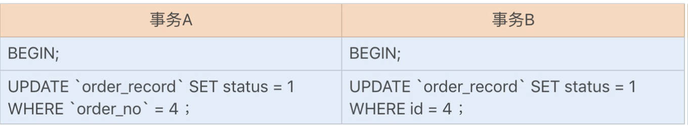
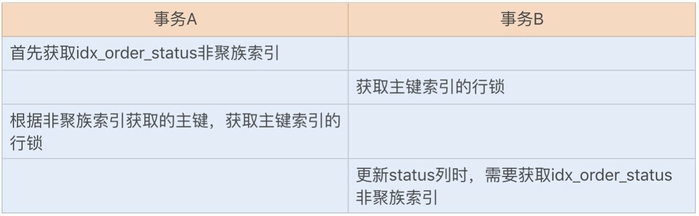
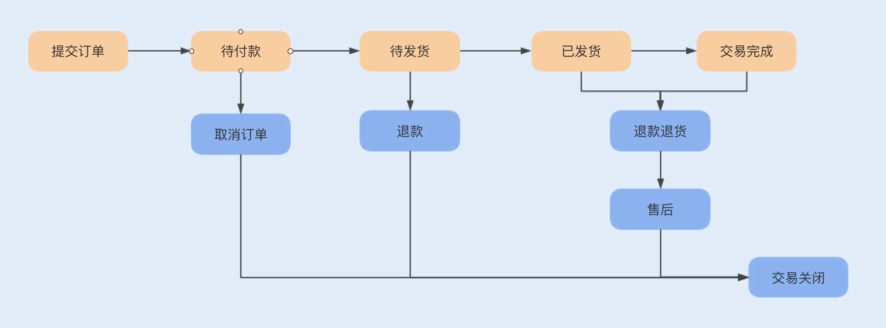
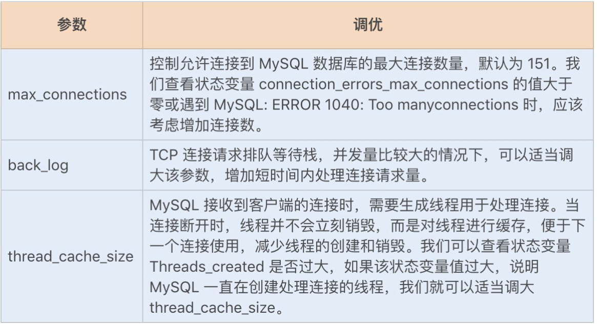
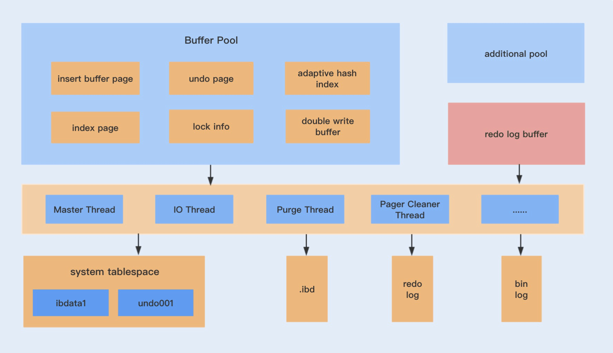

### 如何写出高性能SQL语句？

#### 慢 SQL 语句的几种常见诱因

##### 1 无索引、索引失效导致慢查询

##### 2 锁等待

可以看《MySQL 45讲中》中的  **为什么我只查一行的语句，也执行这么慢？**

##### 3 **不恰当的** **SQL** **语句**

使用不恰当的 SQL 语句也是慢 SQL 最常见的诱因之一。例如，习惯使用 <SELECT *>，<SELECT COUNT(*)> SQL 语句，在大数据表中使用 <LIMIT M,N> 分页查询，以及对非索引字段进行排序等等。

#### 优化SQL语句的步骤

参考sql的相关笔记：D:\projects\StudyNote\docs\面试\面试题-数据库.md  SQL优化、MySQL的explain解读

#### 常用 SQL 优化

##### 1 优化分页查询

通常我们是使用 <LIMIT M,N> + 合适的 order by 来实现分页查询，这种实现方式在没有任何索引条件支持的情况下，需要做大量的文件排序操作（file sort），性能将会非常得糟糕。如果有对应的索引，通常刚开始的分页查询效率会比较理想，但越往后，分页查询的性能就越差。

这是因为我们在使用 LIMIT 的时候，偏移量 M 在分页越靠后的时候，值就越大，数据库检索的数据也就越多。例如 LIMIT 10000,10 这样的查询，数据库需要查询 10010 条记录，最后返回 10 条记录。也就是说将会有 10000 条记录被查询出来没有被使用到。

##### 2 优化 count(*)

如果对一张大表经常做 SELECT COUNT(*) 操作，这肯定是不明智的。那么我们该如何对大表的 COUNT() 进行优化呢？

**使用近似值**

-- 使用SHOW TABLE STATUS命令来获取表的近似行数
SHOW TABLE STATUS LIKE 'table_name';

**增加汇总统计**

如果需要一个精确的 COUNT 值，我们可以额外新增一个汇总统计表或者缓存字段来统计需要的 COUNT 值，这种方式在新增和删除时有一定的成本，但却可以大大提升 COUNT()的性能。

[MySQL中使用count和information_schema.tables计算行数的区别](https://www.modb.pro/db/1772507314015277056)

##### 3 优化 select *

#### 开启慢查询

```mysql
Show variables like 'slow_query%';
Show variables like 'long_query_time';
```

如果没有开启，我们可以通过以下设置来开启：

```mysql
set global slow_query_log='ON'; // 开启慢 SQL 日志
set global slow_query_log_file='/var/lib/mysql/test-slow.log';// 记录日志地址
set global long_query_time=1;// 最大执行时间
```

假设有一张订单表 order，主要包含了主键订单编码 order_no、订单状态 status、提交时间 create_time 等列，并且创建了 status 列索引和 create_time 列索引。此时通过创建时间降序获取状态为 1 的订单编码，以下是具体实现代码：

`select order_no from order where status =1 order by create_time desc`

你知道其中的问题所在吗？我们又该如何优化？

为了避免文件排序的发生。因为查询时我们只能用到status索引，如果要对create_time 进行排序，则需要使用文件排序filesort。建立一个联合索引，包含 `status` 和 `create_time` 列，这样 MySQL 就可以利用这个索引完成排序操作，而不必再对 `create_time` 列进行排序。


### 索引的失效与优化

#### 1. 覆盖索引优化查询

假设我们只需要查询商品的名称、价格信息，我们有什么方式来避免回表呢？我们可以建立一个组合索引，即商品编码、名称、价格作为一个组合索引。如果索引中存在这些数据，查询将不会再次检索主键索引，从而避免回表。

#### 2. 自增字段作主键优化查询

如果我们使用自增主键，那么每次插入的新数据就会按顺序添加到当前索引节点的位置，不需要移动已有的数据，当页面写满，就会自动开辟一个新页面。因为不需要重新移动数据，因此这种插入数据的方法效率非常高。

如果我们使用非自增主键，由于每次插入主键的索引值都是随机的，因此每次插入新的数据时，就可能会插入到现有数据页中间的某个位置，这将不得不移动其它数据来满足新数据的插入，甚至需要从一个页面复制数据到另外一个页面，我们通常将这种情况称为页分裂。页分裂还有可能会造成大量的内存碎片，导致索引结构不紧凑，从而影响查询效率。

#### 3. 前缀索引优化

前缀索引顾名思义就是使用某个字段中字符串的前几个字符建立索引，那我们为什么需要使用前缀来建立索引呢？

我们知道，索引文件是存储在磁盘中的，而磁盘中最小分配单元是页，通常一个页的默认大小为 16KB，假设我们建立的索引的每个索引值大小为 2KB，则在一个页中，我们能记录 8个索引值，假设我们有 8000 行记录，则需要 1000 个页来存储索引。如果我们使用该索引查询数据，可能需要遍历大量页，这显然会降低查询效率。

减小索引字段大小，可以增加一个页中存储的索引项，有效提高索引的查询速度。在一些大字符串的字段作为索引时，使用前缀索引可以帮助我们减小索引项的大小。

**不过，前缀索引是有一定的局限性的，例如 order by 就无法使用前缀索引，无法把前缀索引用作覆盖索引**。

#### 4. 防止索引失效

有时候我们看似使用到了索引，但实际上并没有被优化器选择使用。

对于 Hash 索引实现的列，如果使用到范围查询，那么该索引将无法被优化器使用到。也就是说 Memory 引擎实现的 Hash 索引只有在“=”的查询条件下，索引才会生效。

### 死锁

```mysql
CREATE TABLE `order_record`  (
  `id` int(11) NOT NULL AUTO_INCREMENT,
  `order_no` int(11) DEFAULT NULL,
  `status` int(4) DEFAULT NULL,
  `create_date` datetime(0) DEFAULT NULL,
  PRIMARY KEY (`id`) USING BTREE,
  INDEX `idx_order_status`(`order_no`,`status`) USING BTREE
) ENGINE = InnoDB
```

#### 避免死锁的措施

避免死锁最直观的方法就是在两个事务相互等待时，当一个事务的等待时间超过设置的某一阈值，就对这个事务进行回滚，另一个事务就可以继续执行了。这种方法简单有效，在InnoDB 中，参数 innodb_lock_wait_timeout 是用来设置超时时间的。

另外，我们还可以将 order_no 列设置为唯一索引列。虽然不能防止幻读，但我们可以利用它的唯一性来保证订单记录不重复创建，这种方式唯一的缺点就是当遇到重复创建订单时会抛出异常。

我们还可以使用其它的方式来代替数据库实现幂等性校验。例如，使用 Redis 以及ZooKeeper 来实现，运行效率比数据库更佳。

#### 其它常见的 SQL 死锁问题

死锁的四个必要条件：**互斥、占有且等待、不可强占用、循环等待**。只要系统发生死锁，这些条件必然成立。

InnoDB 存储引擎的主键索引为聚簇索引，其它索引为辅助索引。如果使用辅助索引来更新数据库，就需要使用聚簇索引来更新数据库字段。如果两个更新事务使用了不同的辅助索引，或一个使用了辅助索引，一个使用了聚簇索引，就都有可能导致锁资源的循环等待。由于本身两个事务是互斥，也就构成了以上死锁的四个必要条件了。

我们还是以上面的这个订单记录表来重现下聚簇索引和辅助索引更新时，循环等待锁资源导致的死锁问题：



出现死锁的步骤：



综上可知，在更新操作时，我们应该尽量使用主键来更新表字段，这样可以有效避免一些不必要的死锁发生。

#### 小结

**解决死锁的最佳方式当然就是预防死锁的发生了，我们平时编程中，可以通过以下一些常规手段来预防死锁的发生：**

1. 在编程中尽量按照固定的顺序来处理数据库记录，假设有两个更新操作，分别更新两条相同的记录，但更新顺序不一样，有可能导致死锁；
2. 在允许幻读和不可重复读的情况下，尽量使用 RC 事务隔离级别，可以避免 gap lock 导致的死锁问题；
3. 更新表时，尽量使用主键更新；
4. 避免长事务，尽量将长事务拆解，可以降低与其它事务发生冲突的概率；
5. 设置锁等待超时参数，我们可以通过 innodb_lock_wait_timeout 设置合理的等待超时阈值，特别是在一些高并发的业务中，我们可以尽量将该值设置得小一些，避免大量事务等待，占用系统资源，造成严重的性能开销。

### 什么时候需要分库分表

**当我们面对一张海量数据的表时，通常有分区、NoSQL 存储、分表分库等优化方案**。

分区的底层虽然也是基于分表的原理实现的，即有多个底层表实现，但分区依然是在单库下进行的，在一些需要提高并发的场景中的优化空间非常有限，且一个表最多只能支持 1024个分区。面对日益增长的海量数据，优化存储能力有限。**不过在一些非海量数据的大表中，我们可以考虑使用分区来优化表性能**。

> 分区表是由多个相关的底层表实现的，这些底层表也是由句柄对象表示，所以我们也可以直接访问各个分区，存储引擎管理分区的各个底层表和管理普通表一样（所有的底层表都必须使用相同的存储引擎），分区表的索引只是在各个底层表上各自加上一个相同的索引，从存储引擎的角度来看，底层表和一个普通表没有任何不同，存储引擎也无须知道这是一个普通表，还是一个分区表的一部分。

而 NoSQL 存储是基于键值对存储，虽然查询性能非常高，但在一些方面仍然存在短板。例如，不是关系型数据库，不支持事务以及稳定性方面相对 RDBMS 差一些。虽然有些NoSQL 数据库也实现了事务，宣传具有可靠的稳定性，但**目前 NoSQL 还是主要用作辅助存储**。

#### 什么时候要分表分库？

**在我看来，能不分表分库就不要分表分库**。在单表的情况下，当业务正常时，我们使用单表即可，而**当业务出现了性能瓶颈时，我们首先考虑用分区的方式来优化，如果分区优化之后仍然存在后遗症，此时我们再来考虑分表分库**。

我们知道，如果在单表单库的情况下，当数据库表的数据量逐渐累积到一定的数量时（5000W 行或 100G 以上），操作数据库的性能会出现明显下降，即使我们使用索引优化或读写库分离，性能依然存在瓶颈。此时，如果每日数据增长量非常大，我们就应该考虑分表，避免单表数据量过大，造成数据库操作性能下降。

**面对海量数据，除了单表的性能比较差以外，我们在单表单库的情况下，数据库连接数、磁盘 I/O 以及网络吞吐等资源都是有限的，并发能力也是有限的**。所以，在一些大数据量且高并发的业务场景中，我们就需要考虑分表分库来提升数据库的并发处理能力，从而提升应用的整体性能。

#### 如何分表分库？

##### 垂直切分

**垂直分库是指根据业务来分库，不同的业务使用不同的数据库**。例如，订单和消费券在抢购业务中都存在着高并发，如果同时使用一个库，会占用一定的连接数，所以我们可以将数据库分为订单库和促销活动库。

**垂直分表则是指根据一张表中的字段，将一张表划分为两张表，其规则就是将一些不经常使用的字段拆分到另一张表中**。例如，一张订单详情表有一百多个字段，显然这张表的字段太多了，一方面不方便我们开发维护，另一方面还可能引起跨页问题。这时我们就可以拆分该表字段，解决上述两个问题。

##### 水平切分

**水平分表**则是将表中的某一列作为切分的条件，**按照某种规则（Range 或 Hash 取模）来切分为更小的表**。

水平分表只是在一个库中，如果存在连接数、I/O 读写以及网络吞吐等瓶颈，我们就需要考虑将水平切换的表分布到不同机器的库中，这就是水平分库分表了。

我们一般可以将数据库分为：**单库单表 - 单库多表 - 多库多表**。**在平时的业务开发中，我们应该优先考虑单库单表；如果数据量比较大，且热点数据比较集中、历史数据很少访问，我们可以考虑表分区；如果访问热点数据分散，基本上所有的数据都会访问到，我们可以考虑单库多表**；如果并发量比较高、海量数据以及每日新增数据量巨大，我们可以考虑多库多表。

一旦分表，我们可能会涉及到多表的分页查询、多表的 JOIN 查询，从而增加业务的复杂度。而一旦分库了，除了跨库分页查询、跨库 JOIN 查询，还会存在跨库事务的问题。这些问题无疑会增加我们系统开发的复杂度。

#### 分表分库之后面临的问题

我们将对一个订单表进行分库分表，通过详细的业务来分析这些问题。

假设我们有一张订单表以及一张订单详情表，每天的数据增长量在 60W 单，平时还会有一些促销类活动，订单增长量在千万单。为了提高系统的并发能力，我们考虑将订单表和订单详情表做分库分表。除了分表，因为用户一般查询的是最近的订单信息，所以热点数据比较集中，我们还可以考虑用表分区来优化单表查询。

通常订单的分库分表要么基于订单号 Hash 取模实现，要么根据用户 ID Hash 取模实现。订单号 Hash 取模的好处是数据能均匀分布到各个表中，而缺陷则是一个用户查询所有订单时，需要去多个表中查询。

**由于订单表用户查询比较多，此时我们应该考虑使用用户 ID 字段做 Hash 取模，对订单表进行水平分表**。如果需要考虑高并发时的订单处理能力，我们可以考虑基于用户 ID 字段Hash 取模实现分库分表。这也是大部分公司对订单表分库分表的处理方式。

##### 1 分布式事务问题

在提交订单时，除了创建订单之外，我们还需要扣除相应的库存。而订单表和库存表由于垂直分库，位于不同的库中，这时我们需要通过分布式事务来保证提交订单时的事务完整性。

通常，我们解决分布式事务有两种通用的方式：两阶事务提交（2PC）以及补偿事务提交（TCC）。通常有一些中间件已经帮我们封装好了这两种方式的实现，例如 Spring 实现的 JTA，目前阿里开源的分布式事务中间件 Fescar，就很好地实现了与 Dubbo 的兼容。

##### 2  跨节点 JOIN 查询问题

用户在查询订单时，我们往往需要通过表连接获取到商品信息，而商品信息表可能在另外一个库中，这就涉及到了跨库 JOIN 查询。

**通常，我们会冗余表或冗余字段来优化跨库 JOIN 查询**。对于一些基础表，例如商品信息表，我们可以在每一个订单分库中复制一张基础表，避免跨库 JOIN 查询。而对于一两个字段的查询，我们也可以将少量字段冗余在表中，从而避免 JOIN 查询，也就避免了跨库JOIN 查询。

##### 3 跨节点分页查询问题

我们知道，当用户在订单列表中查询所有订单时，可以通过用户 ID 的 Hash 值来快速查询到订单信息，而运营人员在后台对订单表进行查询时，则是通过订单付款时间来进行查询的，这些数据都分布在不同的库以及表中，此时就存在一个跨节点分页查询的问题了。

通常一些中间件是通过在每个表中先查询出一定的数据，然后在缓存中排序后，获取到对应的分页数据。这种方式在越往后面的查询，就越消耗性能。

通常我们建议使用两套数据来解决跨节点分页查询问题，一套是基于分库分表的用户单条或多条查询数据，一套则是基于 Elasticsearch、Solr 存储的订单数据，主要用于运营人员根据其它字段进行分页查询。为了不影响提交订单的业务性能，我们一般使用异步消息来实现Elasticsearch、Solr 订单数据的新增和修改。

##### 4 全局主键 ID 问题

使用 UUID 实现全局 ID 是最方便快捷的方式，即随机生成一个 32 位 16 进制数字，这种方式可以保证一个 UUID 的唯一性，水平扩展能力以及性能都比较高。但使用 UUID 最大的缺陷就是，它是一个比较长的字符串，连续性差，如果作为主键使用，性能相对来说会比较差。

我们也可以基于 Redis 分布式锁实现一个递增的主键 ID，这种方式可以保证主键是一个整数且有一定的连续性，但分布式锁存在一定的性能消耗。

我们还可以基于 Twitter 开源的分布式 ID 生产算法——snowflake 解决全局主键 ID 问题，snowflake 是通过分别截取时间、机器标识、顺序计数的位数组成一个 long 类型的主键 ID。这种算法可以满足每秒上万个全局 ID 生成，不仅性能好，而且低延时。

##### 5 扩容问题

随着用户的订单量增加，根据用户 ID Hash 取模的分表中，数据量也在逐渐累积。此时，我们需要考虑动态增加表，一旦动态增加表了，就会涉及到数据迁移问题。

我们在最开始设计表数据量时，尽量使用 2 的倍数来设置表数量。当我们需要扩容时，也同样按照 2 的倍数来扩容，这种方式可以减少数据的迁移量。

### 电商系统表设计优化案例分析

#### 核心业务

一般电商系统分为平台型和自营型电商系统。平台型电商系统是指有第三方商家入驻的电商平台，第三方商家自己开设店铺来维护商品信息、库存信息、促销活动、客服售后等，典型的代表有淘宝、天猫等。而自营型电商系统则是指没有第三方商家入驻，而是公司自己运营的电商平台，常见的有京东自营、苹果商城等。

两种类型的电商系统比较明显的区别是卖家是 C 端还是 B 端，很显然，平台型电商系统的复杂度要远远高于自营型电商系统。为了更容易理解商城的业务，**我们将基于自营型电商系统来讨论表结构设计优化，这里以苹果商城为例**。

一个电商系统的核心业务肯定就是销售商品了，围绕销售商品，我们可以将核心业务分为以下几个主要模块：

##### 1 商品模块

商品模块主要包括商品分类以及商品信息管理，商品分类则是我们常见的大分类了，有人喜欢将分类细化为多个层级，例如，第一个大类是手机、电视、配件等，配件的第二个大类又分为耳机、充电宝等。为了降低用户学习系统操作的成本，我们应该尽量将层级减少。

当我们通过了分类查询之后，就到了商品页面，一个商品 Item 包含了若干商品 SKU。商品 Item 是指一种商品，例如 IPhone9，就是一个 Item，商品 SKU 则是指具体属性的商品，例如金色 128G 内存的 IPhone9。

##### 2 购物车模块

购物车主要是用于用户临时存放欲购买的商品，并可以在购物车中统一下单结算。购物车一般分为离线购物车和在线购物车。离线购物车则是用户选择放入到购物车的商品只保存在本地缓存中，在线购物车则是会同步这些商品信息到服务端。

目前大部分商城都是支持两种状态的购物车，当用户没有登录商城时，主要是离线购物车在记录用户的商品信息，当用户登录商城之后，用户放入到购物车中的商品都会同步到服务端，以后在手机和电脑等不同平台以及不同时间都能查看到自己放入购物车的商品。

##### 3 订单模块

订单是盘活整个商城的核心功能模块，如果没有订单的产出，平台将难以维持下去。订单模块管理着用户在平台的交易记录，是用户和商家交流购买商品状态的渠道，用户可以随时更改一个订单的状态，商家则必须按照业务流程及时订单的更新状态，告知用户已购买商品的具体状态。

通常一个订单分为以下几个状态：待付款、待发货、待收货、待评价、交易完成、用户取消、仅退款、退货退款状态。一个订单的流程见下图：



##### 4 库存模块

这里主要记录的是商品 SKU 的具体库存信息，主要功能包括库存交易、库存管理。库存交易是指用户购买商品时实时消费库存，库存管理主要包括运营人员对商品的生产或采购入库、调拨。

一般库存信息分为商品 SKU、仓区、实时库存、锁定库存、待退货库存、活动库存。

现在大部分电商都实现了华南华北的库存分区，所以可能存在同一个商品 SKU 在华北没有库存，而在华南存在库存的情况，所以我们需要有仓区这个字段，用来区分不同地区仓库的同一个商品 SKU。

实时库存则是指商品的实时库存，锁定库存则表示用户已经提交订单到实际扣除库存或订单失效的这段时间里锁定的库存，待退货库存、活动库存则分别表表示订单退款时的库存数量以及每次活动时的库存数量。

除了这些库存信息，我们还可以为商品设置库存状态，例如虚拟库存状态、实物库存状态。如果一个商品不需要设定库存，可以任由用户购买，我们则不需要在每次用户购买商品时都去查询库存、扣除库存，只需要设定商品的库存状态为虚拟库存即可。

##### 5 促销活动模块

促销活动模块是指消费券、红包以及满减等促销功能，这里主要包括了活动管理和交易管理。前者主要负责管理每次发放的消费券及红包有效期、金额、满足条件、数量等信息，后者则主要负责管理用户领取红包、消费券等信息。

#### 业务难点

##### 1 不同商品类别存在差异，如何设计商品表结构？

我们知道，一个手机商品的详细信息跟一件衣服的详细信息差别很大，手机的 SKU 包括了颜色、运行内存、存储内存等，而一件衣服则包含了尺码、颜色。

如果我们需要将这些商品都存放在一张表中，要么就使用相同字段来存储不同的信息，要么就新增字段来维护各自的信息。前者会导致程序设计复杂化、表宽度大，从而减少磁盘单页存储行数，影响查询性能，且维护成本高；后者则会导致一张表中字段过多，如果有新的商品类型出现，又需要动态添加字段。

比较好的方式是通过一个公共表字段来存储一些具有共性的字段，创建单独的商品类型表，例如手机商品一个表、服饰商品一个表。但这种方式也有缺点，那就是可能会导致表非常多，查询商品信息的时候不够灵活，不好实现全文搜索。

这时候，我们可以基于一个公共表来存储商品的公共信息，同时结合搜索引擎，将商品详细信息存储到键值对数据库，例如 ElasticSearch、Solr 中。

##### 2 双十一购物车商品数量大增，购物车系统出现性能瓶颈怎么办？

在用户没有登录系统的情况下，我们是通过 cookie 来保存购物车的商品信息，而在用户登录系统之后，购物车的信息会保存到数据库中。

在双十一期间，大部分用户都会提前将商品加入到购物车中，在加入商品到购物车的这段操作中，由于时间比较长，操作会比较分散，所以对数据库的写入并不会造成太大的压力。但在购买时，由于多数属于抢购商品，用户对购物车的访问则会比较集中了，如果都去数据库中读取，那么数据库的压力就可想而知了。

此时我们应该考虑冷热数据方案来存储购物车的商品信息，用户一般都会首选最近放入购物车的商品，这些商品信息则是热数据，而较久之前放入购物车中的商品信息则是冷数据，我们需要提前将热数据存放在 Redis 缓存中，以便提高系统在活动期间的并发性能。例如，可以将购物车中近一个月的商品信息都存放到 Redis 中，且至少为一个分页的信息。

当在缓存中没有查找到购物车信息时，再去数据库中查询，这样就可以大大降低数据库的压力。

##### 3 订单表海量数据，如何设计订单表结构？

通常我们的订单表是系统数据累计最快的一张表，无论订单是否真正付款，只要订单提交了就会在订单表中创建订单。如果公司的业务发展非常迅速，那么订单表的分表分库就只是迟早的事儿了。

在没有分表之前，订单的主键 ID 都是自增的，并且关联了一些其它业务表。一旦要进行分表分库，就会存在主键 ID 与业务耦合的情况，而且分表后新自增 ID 与之前的 ID 也可能会发生冲突，后期做表升级的时候我们将会面临巨大的工作量。如果我们确定后期做表升级，建议提前使用 snowflake 来生成主键 ID。

如果订单表要实现水平分表，那我们基于哪个字段来实现分表呢？

通常我们是通过计算用户 ID 字段的 Hash 值来实现订单的分表，这种方式可以优化用户购买端对订单的操作性能。如果我们需要对订单表进行水平分库，那就还是基于用户 ID 字段来实现。

在分表分库之后，对于我们的后台订单管理系统来说，查询订单就是一个挑战了。通常后台都是根据订单状态、创建订单时间进行查询的，且需要支持分页查询以及部分字段的 JOIN查询，如果需要在分表分库的情况下进行这些操作，无疑是一个巨大的挑战了。

对于 JOIN 查询，我们一般可以通过冗余一些不常修改的配置表来实现。例如，商品的基础信息，我们录入之后很少修改，可以在每个分库中冗余该表，如果字段信息比较少，我们可以直接在订单表中冗余这些字段。

而对于分页查询，通常我们建议冗余订单信息到大数据中。后台管理系统通过大数据来查询订单信息，用户在提交订单并且付款之后，后台将会同步这条订单到大数据。用户在 C 端修改或运营人员在后台修改订单时，会通过异步方式通知大数据更新该订单数据，这种方式可以解决分表分库后带来的分页查询问题。

##### 4. 抢购业务，如何解决库存表的性能瓶颈？

在平时购买商品时，我们一般是直接去数据库检查、锁定库存，但如果是在促销活动期间抢购商品，我们还是直接去数据库检查、更新库存的话，面对高并发，系统无疑会产生性能瓶颈。

**一般我们会将促销活动的库存更新到缓存中，通过缓存来查询商品的实时库存，并且通过分布式锁来实现库存扣减、锁定库存**。

##### 5. 促销活动也存在抢购场景，如何设计表？

在一些大型促销活动之前，我们一般都会定时发放各种商品的优惠券和红包，用户需要点击领取才能使用。所以在一定数量的优惠券和红包放出的同时，也会存在同一时间抢购这些优惠券和红包的情况，特别是一些热销商品。

我们可以参考库存的优化设计方式，使用缓存和分布式锁来查询、更新优惠券和红包的数量，通过缓存获取数量成功以后，再通过异步方式更新数据库中优惠券和红包的数量。

### 数据库参数设置调优

#### MyISAM 存储引擎参数设置调优

MyISAM 存储引擎使用 key buffer 缓存索引块，MyISAM 表的数据块则没有缓存，它是直接存储在磁盘文件中的。

我们可以通过 key_buffer_size 设置 key buffer 缓存的大小，而它的大小并不是越大越好。正如我前面所讲的，key buffer 缓存设置过大，实际应用却不大的话，就容易造成内存浪费，而且系统也容易发生 SWAP 页交换，一般我是建议将服务器内存中可用内存的1/4 分配给 key buffer。

如果要更准确地评估 key buffer 的设置是否合理，我们还可以通过缓存使用率公式来计算：

> 1-((key_blocks_unused*key_cache_block_size)/key_buffer_size)
>
> key_blocks_unused 表示未使用的缓存簇（blocks）数 
> key_cache_block_size 表示 key_buffer_size 被分割的区域大小
> key_blocks_unused*key_cache_block_size 则表示剩余的可用缓存空间（一般来说，缓存使用率在 80% 作用比较合适）。

#### InnoDB 存储引擎参数设置调优

InnoDB Buffer Pool（简称 IBP）是 InnoDB 存储引擎的一个缓冲池，与 MyISAM 存储引擎使用 key buffer 缓存不同，它不仅存储了表索引块，还存储了表数据。查询数据时，IBP允许快速返回频繁访问的数据，而无需访问磁盘文件。InnoDB 表空间缓存越多，MySQL访问物理磁盘的频率就越低，这表示查询响应时间更快，系统的整体性能也有所提高。

我们一般可以通过多个设置参数来调整 IBP，优化 InnoDB 表性能。

**innodb_buffer_pool_size**

IBP 默认的内存大小是 128M，我们可以通过参数 innodb_buffer_pool_size 来设置 IBP的大小，IBP 设置得越大，InnoDB 表性能就越好。但是，将 IBP 大小设置得过大也不好，可能会导致系统发生 SWAP 页交换。所以我们需要在 IBP 大小和其它系统服务所需内存大小之间取得平衡。MySQL 推荐配置 IBP 的大小为服务器物理内存的 80%。

我们也可以通过计算 InnoDB 缓冲池的命中率来调整 IBP 大小：

`(1-innodb_buffer_pool_reads/innodb_buffer_pool_read_request)*100`

但如果我们将 IBP 的大小设置为物理内存的 80% 以后，发现命中率还是很低，此时我们就应该考虑扩充内存来增加 IBP 的大小。

**innodb_buffer_pool_instances**

InnoDB 中的 IBP 缓冲池被划分为了多个实例，对于具有数千兆字节的缓冲池的系统来说，将缓冲池划分为单独的实例可以减少不同线程读取和写入缓存页面时的争用，从而提高系统的并发性。该参数项仅在将 innodb_buffer_pool_size 设置为 1GB 或更大时才会生效。

在 windows 32 位操作系统中，如果 innodb_buffer_pool_size 的大小超过 1.3GB，
innodb_buffer_pool_instances 默认大小就为 innodb_buffer_pool_size/128MB；否则，默认为 1。

为了获取最佳效率，建议指定 innodb_buffer_pool_instances 的大小，并保证每个缓冲池实例至少有 1GB 内存。通常，建议 innodb_buffer_pool_instances 的大小不超过innodb_read_io_threads + innodb_write_io_threads 之和，建议实例和线程数量比例为1:1。

**innodb_read_io_threads / innodb_write_io_threads**

在默认情况下，MySQL 后台线程包括了主线程、IO 线程、锁线程以及监控线程等，其中读写线程属于 IO 线程，主要负责数据库的读取和写入操作，这些线程分别读取和写入innodb_buffer_pool_instances 创建的各个内存页面。MySQL 支持配置多个读写线程，即通过 innodb_read_io_threads 和 innodb_write_io_threads 设置读写线程数量。

读写线程数量值默认为 4，也就是总共有 8 个线程同时在后台运行。innodb_read_io_threads 和 innodb_write_io_threads 设置的读写线程数量，与innodb_buffer_pool_instances 的大小有关，两者的协同优化是提高系统性能的一个关键因素。

在一些内存以及 CPU 内核超大型的数据库服务器上，我们可以在保证足够大的 IBP 内存的前提下，通过以下公式，协同增加缓存实例数量以及读写线程。

( innodb_read_io_threads + innodb_write_io_threads ) =innodb_buffe_pool_instances

如果我们仅仅是将读写线程根据缓存实例数量对半来分，即读线程和写线程各为实例大小的一半，肯定是不合理的。例如我们的应用服务读取数据库的数据多于写入数据库的数据，那么增加写入线程反而没有优化效果。我们一般可以通过 MySQL 服务器保存的全局统计信息，来确定系统的读取和写入比率。

如果读大于写，我们应该考虑将读线程的数量设置得大一些，写线程数量小一些；否则，反之。

**innodb_log_file_size**

除了以上 InnoDB 缓存等因素之外，InnoDB 的日志缓存大小、日志文件大小以及日志文件持久化到磁盘的策略都影响着 InnnoDB 的性能。 InnoDB 中有一个 redo log 文件，InnoDB 用它来存储服务器处理的每个写请求的重做活动。执行的每个写入查询都会在日志文件中获得重做条目，以便在发生崩溃时可以恢复更改。

当日志文件大小已经超过我们参数设置的日志文件大小时，InnoDB 会自动切换到另外一个日志文件，由于重做日志是一个循环使用的环，在切换时，就需要将新的日志文件脏页的缓存数据刷新到磁盘中（触发检查点）。

理论上来说，innodb_log_file_size 设置得越大，缓冲池中需要的检查点刷新活动就越少，从而节省磁盘 I/O。那是不是将这个日志文件设置得越大越好呢？如果日志文件设置得太大，恢复时间就会变长，这样不便于 DBA 管理。在大多数情况下，我们将日志文件大小设置为 1GB 就足够了。

**innodb_log_buffer_size**

这个参数决定了 InnoDB 重做日志缓冲池的大小，默认值为 8MB。如果高并发中存在大量的事务，该值设置得太小，就会增加写入磁盘的 I/O 操作。我们可以通过增大该参数来减少写入磁盘操作，从而提高并发时的事务性能。

**innodb_flush_log_at_trx_commit**

这个参数可以控制重做日志从缓存写入文件刷新到磁盘中的策略，默认值为 1。

当设置该参数为 0 时，InnoDB 每秒种就会触发一次缓存日志写入到文件中并刷新到磁盘的操作，这有可能在数据库崩溃后，丢失 1s 的数据。

当设置该参数为 1 时，则表示每次事务的 redo log 都会直接持久化到磁盘中，这样可以保证 MySQL 异常重启之后数据不会丢失。

当设置该参数为 2 时，每次事务的 redo log 都会直接写入到文件中，再将文件刷新到磁盘。

在一些对数据安全性要求比较高的场景中，显然该值需要设置为 1；而在一些可以容忍数据库崩溃时丢失 1s 数据的场景中，我们可以将该值设置为 0 或 2，这样可以明显地减少日志同步到磁盘的 I/O 操作。



### InnoDB 体系架构

InnoDB 主要包括了内存池、后台线程以及存储文件。内存池又是由多个内存块组成的，主要包括缓存磁盘数据、redo log 缓冲等；后台线程则包括了 Master Thread、IO Thread以及 Purge Thread 等；由 InnoDB 存储引擎实现的表的存储结构文件一般包括表结构文件（.frm）、共享表空间文件（ibdata1）、独占表空间文件（ibd）以及日志文件（redo文件等）等。



#### 内存池

我们知道，如果客户端从数据库中读取数据是直接从磁盘读取的话，无疑会带来一定的性能瓶颈，缓冲池的作用就是提高整个数据库的读写性能。

客户端读取数据时，如果数据存在于缓冲池中，客户端就会直接读取缓冲池中的数据，否则再去磁盘中读取；对于数据库中的修改数据，首先是修改在缓冲池中的数据，然后再通过Master Thread 线程刷新到磁盘上。

理论上来说，缓冲池的内存越大越好。

缓冲池中不仅缓存索引页和数据页，还包括了 undo 页，插入缓存、自适应哈希索引以及InnoDB 的锁信息等等。

InnoDB 允许多个缓冲池实例，从而减少数据库内部资源的竞争，增强数据库的并发处理能力，第 38 讲还讲到了缓冲池实例的配置以及调优。

InnoDB 存储引擎会先将重做日志信息放入到缓冲区中，然后再刷新到重做日志文件中。

#### 后台线程

Master Thread 主要负责将缓冲池中的数据异步刷新到磁盘中，除此之外还包括插入缓存、undo 页的回收等，IO Thread 是负责读写 IO 的线程，而 Purge Thread 主要用于回收事务已经提交了的 undo log，Pager Cleaner Thread 是新引入的一个用于协助 MasterThread 刷新脏页到磁盘的线程，它可以减轻 Master Thread 的工作压力，减少阻塞。

#### 存储文件

在 MySQL 中建立一张表都会生成一个.frm 文件，该文件是用来保存每个表的元数据信息的，主要包含表结构定义。

在 InnoDB 中，存储数据都是按表空间进行存放的，默认为共享表空间，存储的文件即为共享表空间文件（ibdata1）。若设置了参数 innodb_file_per_table 为 1，则会将存储的数据、索引等信息单独存储在一个独占表空间，因此也会产生一个独占表空间文件（ibd）。如果你对共享表空间和独占表空间的理解还不够透彻，接下来我会详解。

而日志文件则主要是重做日志文件，主要记录事务产生的重做日志，保证事务的一致性。

其他的 **InnoDB逻辑存储结构** 内容，笔记可以看《readingNotes\MySQL 怎样运行的？-从跟上理解MySQL》

