### 深入了解Synchronized同步锁的优化方法

```java
// 关键字在实例方法上，锁为当前实例
public synchronized void method1() {
 // code
}
// 关键字在代码块上，锁为括号里面的对象
public void method2() {
 Object o = new Object();
 synchronized (o) {
 // code
 }
}
```

反编译查看具体字节码实现：

```java
javac -encoding UTF-8 SyncTest.java // 先运行编译 class 文件命令
javap -v SyncTest.class // 再通过 javap 打印出字节文件
```

当 Synchronized 修饰同步方法时，并没有发现 monitorenter 和 monitorexit 指令，而是出现了一个 ACC_SYNCHRONIZED 标志。

**修饰方法**

```java
public synchronized void method1();
descriptor: ()V
flags: ACC_PUBLIC, ACC_SYNCHRONIZED // ACC_SYNCHRONIZED 标志
Code:
stack=0, locals=1, args_size=1
0: return
LineNumberTable:
line 8: 0
```

这是因为 JVM 使用了 ACC_SYNCHRONIZED 访问标志来区分一个方法是否是同步方法。当方法调用时，调用指令将会检查该方法是否被设置 ACC_SYNCHRONIZED 访问标志。如果设置了该标志，执行线程将先持有 Monitor 对象，然后再执行方法。在该方法运行期间，其它线程将无法获取到该 Mointor 对象，当方法执行完成后，再释放该 Monitor 对象。

**修饰代码块**

Synchronized 在修饰同步代码块时，是由 monitorenter和 monitorexit 指令来实现同步的。进入 monitorenter 指令后，线程将持有 Monitor 对象，退出 monitorenter 指令后，线程将释放该 Monitor 对象。

```java
public void method2();
descriptor: ()V
flags: ACC_PUBLIC
Code:
stack=2, locals=4, args_size=1
0: new #2 
3: dup
4: invokespecial #1 
7: astore_1
8: aload_1
9: dup
10: astore_2
11: monitorenter //monitorenter 指令
12: aload_2
13: monitorexit //monitorexit 指令
14: goto 22
17: astore_3
18 18: aload_2
19: monitorexit
...
```

JVM 中的同步是基于进入和退出管程（Monitor）对象实现的。每个对象实例都会有一个Monitor，Monitor 可以和对象一起创建、销毁。Monitor 是由 ObjectMonitor 实现，而ObjectMonitor 是由 C++ 的 ObjectMonitor.hpp 文件实现，如下所示：

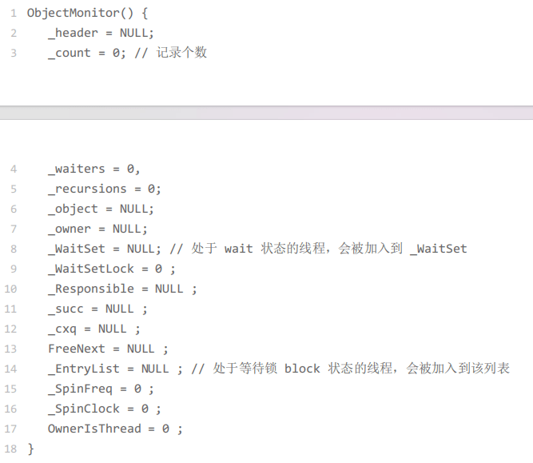

当多个线程同时访问一段同步代码时，多个线程会先被存放在 EntryList 集合中，处于block 状态的线程，都会被加入到该列表。接下来当线程获取到对象的 Monitor 时，Monitor 是依靠底层操作系统的 Mutex Lock 来实现互斥的，线程申请 Mutex 成功，则持有该 Mutex，其它线程将无法获取到该 Mutex。

如果线程调用 wait() 方法，就会释放当前持有的 Mutex，并且该线程会进入 WaitSet 集合中，等待下一次被唤醒。如果当前线程顺利执行完方法，也将释放 Mutex。

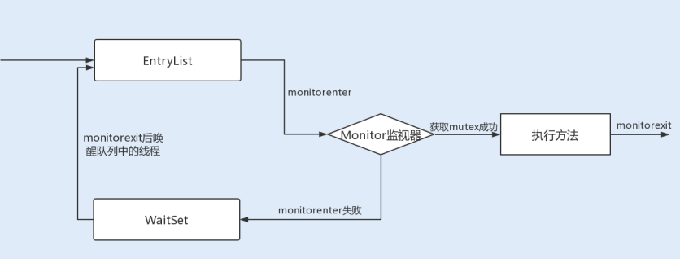

总结来说就是，同步锁在这种实现方式中，**因 Monitor 是依赖于底层的操作系统实现，存在用户态与内核态之间的切换，所以增加了性能开销**。

#### 锁升级优化

为了提升性能，JDK1.6 引入了偏向锁、轻量级锁、重量级锁概念，来减少锁竞争带来的上下文切换，而正是新增的 Java 对象头实现了锁升级功能。

当 Java 对象被 Synchronized 关键字修饰成为同步锁后，围绕这个锁的一系列升级操作都将和 Java 对象头有关。

##### Java对象头

在 JDK1.6 JVM 中，对象实例在堆内存中被分为了三个部分：**对象头、实例数据和对齐填充**。其中 Java 对象头由 Mark Word、指向类的指针以及数组长度三部分组成。

Mark Word 记录了对象和锁有关的信息。Mark Word 在 64 位 JVM 中的长度是 64bit，我们可以一起看下 64 位 JVM 的存储结构是怎么样的。如下图所示：

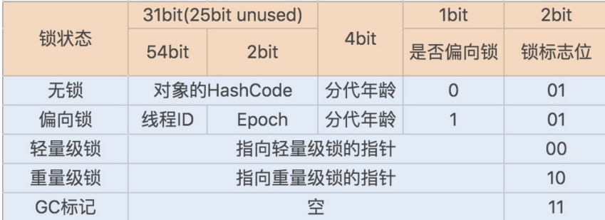

**锁升级功能主要依赖于 Mark Word 中的锁标志位和释放偏向锁标志位，Synchronized 同步锁就是从偏向锁开始的，随着竞争越来越激烈，偏向锁升级到轻量级锁，最终升级到重量级锁**。

具体的升级可以看《并发编程的艺术》中的笔记

##### 锁消除、锁粗化

看jvm里面的线程相关笔记

##### 减小锁粒度

当我们的锁对象是一个数组或队列时，集中竞争一个对象的话会非常激烈，锁也会升级为重量级锁。**我们可以考虑将一个数组和队列对象拆成多个小对象，来降低锁竞争，提升并行度**。

最经典的减小锁粒度的案例就是 JDK1.8 之前实现的 ConcurrentHashMap 版本。我们知道，HashTable 是基于一个数组 + 链表实现的，所以在并发读写操作集合时，存在激烈的锁资源竞争，也因此性能会存在瓶颈。而 ConcurrentHashMap 就很很巧妙地使用了分段锁 Segment 来降低锁资源竞争，如下图所示：

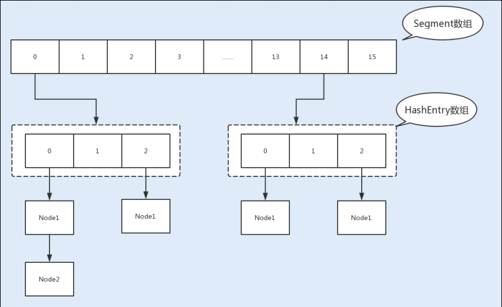

#### 总结

JVM 在 JDK1.6 中引入了分级锁机制来优化 Synchronized，当一个线程获取锁时，首先对象锁将成为一个偏向锁，这样做是为了优化同一线程重复获取导致的用户态与内核态的切换问题；其次如果有多个线程竞争锁资源，锁将会升级为轻量级锁，它适用于在短时间内持有锁，且分锁有交替切换的场景；偏向锁还使用了自旋锁来避免线程用户态与内核态的频繁切换，大大地提高了系统性能；但如果锁竞争太激烈了，那么同步锁将会升级为重量级锁。

**减少锁竞争，是优化 Synchronized 同步锁的关键**。我们应该尽量使 Synchronized 同步锁处于轻量级锁或偏向锁，这样才能提高 Synchronized 同步锁的性能；通过减小锁粒度来降低锁竞争也是一种最常用的优化方法；另外我们还可以通过减少锁的持有时间来提高Synchronized 同步锁在自旋时获取锁资源的成功率，避免 Synchronized 同步锁升级为重量级锁。

### 深入了解Lock同步锁的优化方法

**Lock锁的基本操作是通过乐观锁来实现的，但由于 Lock 锁也会在阻塞时被挂起，因此它依然属于悲观锁**。

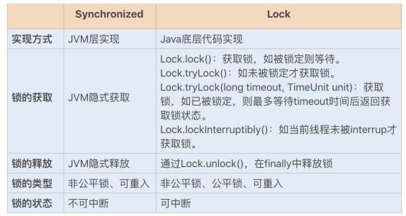

从性能方面上来说，在并发量不高、竞争不激烈的情况下，Synchronized 同步锁由于具有分级锁的优势，性能上与Lock 锁差不多；**但在高负载、高并发的情况下，Synchronized 同步锁由于竞争激烈会升级到重量级锁，性能则没有 Lock 锁稳定**。

#### Lock 锁的实现原理

可以看《并发编程之美》里面的AQS的分析笔记和ReentrantLock的源码解析。

#### 锁分离优化 Lock 同步锁

在大部分业务场景中，读业务操作要远远大于写业务操作。而在多线程编程中，读操作并不会修改共享资源的数据，如果多个线程仅仅是读取共享资源，那么这种情况下其实没有必要对资源进行加锁。如果使用互斥锁，反倒会影响业务的并发性能，那么在这种场景下，有没有什么办法可以优化下锁的实现方式呢？

##### 1 读写锁 ReentrantReadWriteLock

针对这种读多写少的场景，Java 提供了另外一个实现 Lock接口的读写锁 RRW。我们已知 ReentrantLock 是一个独占锁，同一时间只允许一个线程访问，而 RRW 允许多个读线程同时访问，但不允许写线程和读线程、写线程和写线程同时访问。读写锁内部维护了两个锁，一个是用于读操作的ReadLock，一个是用于写操作的 WriteLock。

RRW 很好地使用了高低位，来实现一个整型控制两种状态的功能，读写锁将变量切分成了两个部分，高 16 位表示读，低 16位表示写。

###### 获取写锁

**一个线程尝试获取写锁时**，会先判断同步状态 state 是否为0。如果 state 等于 0，说明暂时没有其它线程获取锁；如果 state 不等于 0，则说明有其它线程获取了锁。此时再判断同步状态 state 的低 16 位（w）是否为 0，如果 w 为 0，则说明其它线程获取了读锁，此时进入 CLH 队列进行阻塞等待；如果 w 不为 0，则说明其它线程获取了写锁，此时要判断获取了写锁的是不是当前线程，若不是就进入 CLH 队列进行阻塞等待；若是，就应该判断当前线程获取写锁是否超过了最大次数，若超过，抛异常，反之更新同步状态。

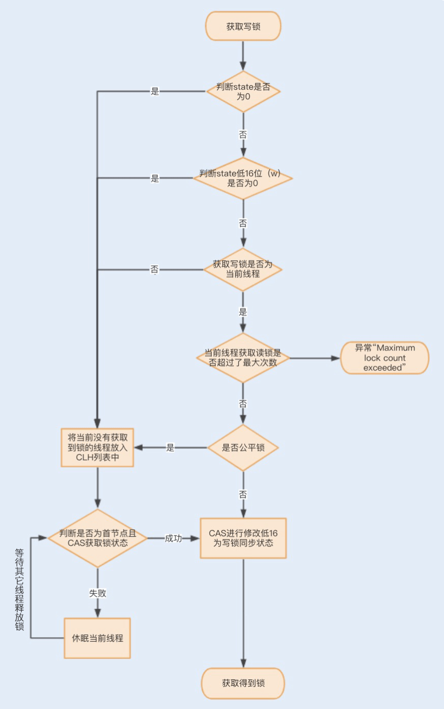


一个线程尝试获取读锁时，同样会先判断同步状态 state 是否为 0。如果 state 等于 0，说明暂时没有其它线程获取锁，此时判断是否需要阻塞，如果需要阻塞，则进入 CLH队列进行阻塞等待；如果不需要阻塞，则 CAS 更新同步状态为读状态。

如果 state 不等于 0，会判断同步状态低 16 位，如果存在写锁，则获取读锁失败，进入 CLH 阻塞队列；反之，判断当前线程是否应该被阻塞，如果不应该阻塞则尝试 CAS 同步状态，获取成功更新同步锁为读状态。

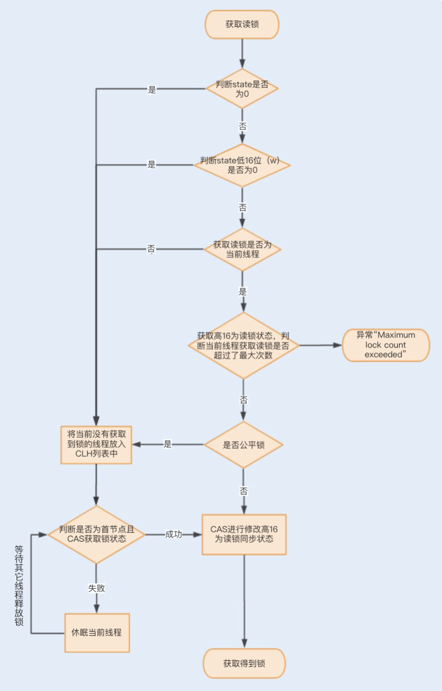

##### 2 读写锁再优化之 StampedLock

RRW 被很好地应用在了读大于写的并发场景中，然而 RRW在性能上还有可提升的空间。在读取很多、写入很少的情况下，**RRW 会使写入线程遭遇饥饿（Starvation）问题，也就是说写入线程会因迟迟无法竞争到锁而一直处于等待状态**。

在 JDK1.8 中，Java 提供了 StampedLock 类解决了这个问题。StampedLock 不是基于 AQS 实现的，但实现的原理和 AQS 是一样的，都是基于队列和锁状态实现的。与RRW 不一样的是，**StampedLock 控制锁有三种模式: 写、悲观读以及乐观读，并且 StampedLock 在获取锁时会返回一个票据 stamp，获取的 stamp 除了在释放锁时需要校验，在乐观读模式下，stamp 还会作为读取共享资源后的二次校验**，后面我会讲解 stamp 的工作原理。

具体的可以看《并发编程之美》中的笔记

#### 总结

不管使用 Synchronized 同步锁还是 Lock 同步锁，只要存在锁竞争就会产生线程阻塞，从而导致线程之间的频繁切换，最终增加性能消耗。因此，**如何降低锁竞争，就成为了优化锁的关键**。

在 Synchronized 同步锁中，我们了解了可以通过减小锁粒度、减少锁占用时间来降低锁的竞争。在这一讲中，我们知道可以利用 Lock 锁的灵活性，通过锁分离的方式来降低锁竞争。

Lock 锁实现了读写锁分离来优化读大于写的场景，从普通的 RRW 实现到读锁和写锁，到 StampedLock 实现了乐观读锁、悲观读锁和写锁，都是为了降低锁的竞争，促使系统的并发性能达到最佳。

**你知道 StampedLock 没有被广泛应用的原因吗？或者说它还存在哪些缺陷导致没有被广泛应用**。

1. **复杂性**：StampedLock 的 API 相对复杂，使用起来相对困难，需要开发人员对其深入理解才能正确地使用。
2. **不可重入性**：与 ReentrantReadWriteLock 不同，StampedLock 不支持重入，也就是说同一个线程在持有读锁的情况下，无法再次获取读锁或写锁，否则会导致死锁。
3. **悲观读锁性能问题**：StampedLock 的乐观读锁性能非常好，但悲观读锁性能较差。在高并发场景下，如果大量线程竞争悲观读锁，可能会导致性能下降。
4. **不支持可重入的条件变量**：StampedLock 不支持像 ReentrantLock 那样的条件变量，这在某些需要等待条件的场景下可能会受到限制。
5. **不稳定性**：尽管 StampedLock 提供了更高的并发性能，但在一些场景下可能存在不稳定性，容易出现死锁或饥饿等问题。

### 使用乐观锁优化并行操作

##### CAS

现在的服务器通常是多处理器，并且每个处理器都是多核的。每个处理器维护了一块字节的内存，每个内核维护了一块字节的缓存，这时候多线程并发就会存在缓存不一致的问题，从而导致数据不一致。

这个时候，处理器提供了**总线锁定**和**缓存锁定**两个机制来保证复杂内存操作的原子性。

**当处理器要操作一个共享变量的时候，其在总线上会发出一个 Lock 信号，这时其它处理器就不能操作共享变量了，该处理器会独享此共享内存中的变量**。**但总线锁定在阻塞其它处理器获取该共享变量的操作请求时，也可能会导致大量阻塞，从而增加系统的性能开销**。

于是，后来的处理器都提供了**缓存锁定机制，也就说当某个处理器对缓存中的共享变量进行了操作，就会通知其它处理器放弃存储该共享资源或者重新读取该共享资源**。**目前最新的处理器都支持缓存锁定机制**。

实现的原理在 《并发编程的艺术》-【处理器如何实现原子操作】标题中有笔记。

#### 优化CAS乐观锁

在 JDK1.8 中，Java 提供了一个新的原子类 LongAdder。**LongAdder 在高并发场景下会比 AtomicInteger 和AtomicLong 的性能更好，代价就是会消耗更多的内存空间**。

**LongAdder 的原理就是降低操作共享变量的并发数，也就是将对单一共享变量的操作压力分散到多个变量值上，将竞争的每个写线程的 value 值分散到一个数组中，不同线程会命中到数组的不同槽中，各个线程只对自己槽中的 value 值进行 CAS 操作，最后在读取值的时候会将原子操作的共享变量与各个分散在数组的 value 值相加，返回一个近似准确的数值**。

LongAdder 内部由一个 base 变量和一个 cell[] 数组组成。当只有一个写线程，没有竞争的情况下，LongAdder会直接使用 base 变量作为原子操作变量，通过 CAS 操作修改变量；当有多个写线程竞争的情况下，除了占用 base
变量的一个写线程之外，其它各个线程会将修改的变量写入到自己的槽 cell[] 数组中，最终结果可通过以下公式计算得出：

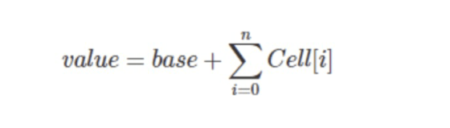

我们可以发现，LongAdder 在操作后的返回值只是一个近似准确的数值，但是 LongAdder 最终返回的是一个准确的数值， 所以**在一些对实时性要求比较高的场景下，LongAdder 并不能取代 AtomicInteger 或 AtomicLong**。

**CAS 乐观锁在平常使用时比较受限，它只能保证单个变量操作的原子性，当涉及到多个变量时，CAS 就无能为力了，但前两讲讲到的悲观锁可以通过对整个代码块加锁来做到这点**。

**CAS 乐观锁在高并发写大于读的场景下，大部分线程的原子操作会失败，失败后的线程将会不断重试 CAS 原子操作，这样就会导致大量线程长时间地占用 CPU 资源，给系统带来很大的性能开销**。在 JDK1.8 中，Java 新增了一个原子类LongAdder，它使用了空间换时间的方法，解决了上述问题。

我是在不同竞争级别的情况下，用不同的读写线程数组合出了四组测试，测试代码使用了计算并发计数器，读线程会去读取计数器的值，而写线程会操作变更计数器值，运行环境是 4 核的 i7 处理器。

[GitHub - nickliuchao/lockTest](https://github.com/nickliuchao/lockTest)

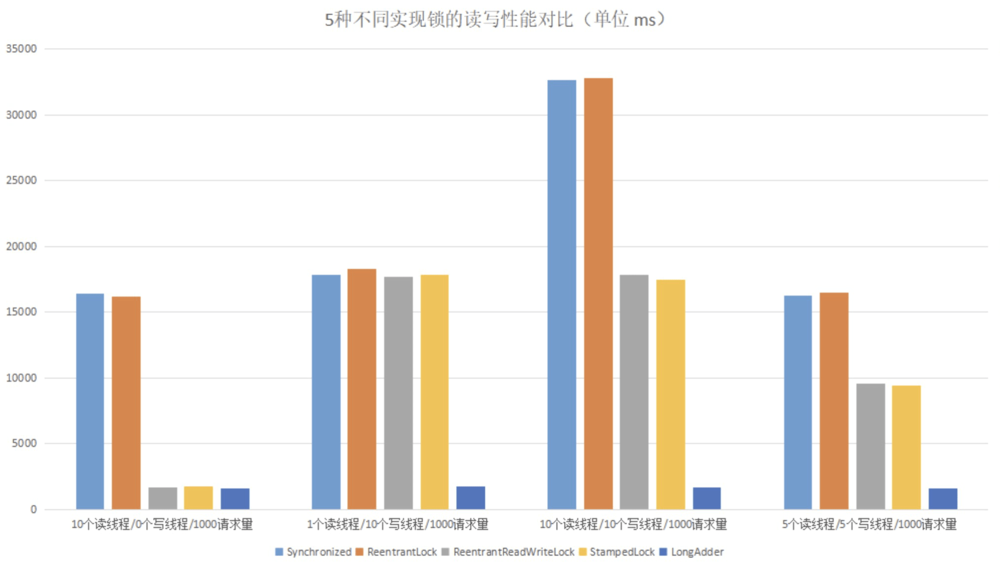

通过以上结果，我们可以发现：**在读大于写的场景下，读写锁 ReentrantReadWriteLock、StampedLock 以及乐观锁的读写性能是最好的**；在写大于读的场景下，乐观锁的性能是最好的，其它 4 种锁的性能则相差不多；**在读和写差不多的场景下，两种读写锁以及乐观锁的性能要优于Synchronized 和 ReentrantLock**。

### 哪些操作导致了上下文切换？

记得我刚入职上家公司的时候，恰好赶上了一次抢购活动。这是系统重构上线后经历的第一次高并发考验，如期出现了大量超时报警，不过比我预料的要好一点，起码没有挂掉重启。

通过工具分析，我发现 cs（上下文切换每秒次数）指标已经接近了 60w ，平时的话最高 5w。再通过日志分析，我发现了大量带有 wait() 的 Exception，由此初步怀疑是大量线程处理不及时导致的，进一步锁定问题是连接池大小设置不合理。后来我就模拟了生产环境配置，对连接数压测进行调节，降低最大线程数，最后系统的性能就上去了。

从实践中总结经验，我知道了**在并发程序中，并不是启动更多的线程就能让程序最大限度地并发执行**。**线程数量设置太小，会导致程序不能充分地利用系统资源；线程数量设置太大，又可能带来资源的过度竞争，导致上下文切换带来额外的系统开销**。

#### 初识上下文切换

**其实在单个处理器的时期，操作系统就能处理多线程并发任务**。**处理器给每个线程分配 CPU 时间片（Time Slice），线程在分配获得的时间片内执行任务**。

CPU 时间片是 CPU 分配给每个线程执行的时间段，一般为几十毫秒。在这么短的时间内线程互相切换，我们根本感觉不到，所以看上去就好像是同时进行的一样。

**时间片决定了一个线程可以连续占用处理器运行的时长**。**当一个线程的时间片用完了，或者因自身原因被迫暂停运行了，这个时候，另外一个线程（可以是同一个线程或者其它进程的线程）就会被操作系统选中，来占用处理器**。这种**一个线程被暂停剥夺使用权，另外一个线程被选中开始或者继续运行的过程就叫做上下文切换（Context Switch）**。

具体来说，一个线程被剥夺处理器的使用权而被暂停运行，就是“切出”；一个线程被选中占用处理器开始或者继续运行，就是“切入”。在这种切出切入的过程中，**操作系统需要保存和恢复相应的进度信息，这个进度信息就是“上下文”了**。

那上下文都包括哪些内容呢？具体来说，它包括了寄存器的存储内容以及程序计数器存储的指令内容。CPU 寄存器负责存储已经、正在和将要执行的任务，程序计数器负责存储CPU 正在执行的指令位置以及即将执行的下一条指令的位置。

在当前 CPU 数量远远不止一个的情况下，操作系统将 CPU轮流分配给线程任务，此时的上下文切换就变得更加频繁了，并且存在跨 CPU 上下文切换，比起单核上下文切换，跨核切换更加昂贵。

#### 多线程上下文切换诱因

在操作系统中，上下文切换的类型还可以分为进程间的上下文切换和线程间的上下文切换。而在多线程编程中，我们主要面对的就是线程间的上下文切换导致的性能问题，下面我们就重点看看究竟是什么原因导致了多线程的上下文切换。

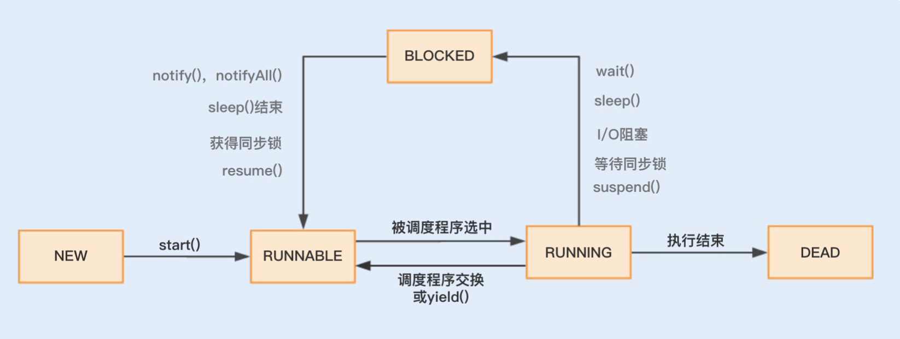

在这个运行过程中，线程由 RUNNABLE 转为非RUNNABLE 的过程就是线程上下文切换。**一个线程的状态由 RUNNING 转为 BLOCKED ，再由BLOCKED 转为 RUNNABLE ，然后再被调度器选中执行，这就是一个上下文切换的过程**。

当一个线程从 RUNNING 状态转为 BLOCKED 状态时，我们称为一个线程的暂停，线程暂停被切出之后，操作系统会保存相应的上下文，以便这个线程稍后再次进入RUNNABLE 状态时能够在之前执行进度的基础上继续执行。

当一个线程从 BLOCKED 状态进入到 RUNNABLE 状态时，我们称为一个线程的唤醒，此时线程将获取上次保存的上下文继续完成执行。

那么在线程运行时，线程状态由 RUNNING 转为BLOCKED 或者由 BLOCKED 转为 RUNNABLE，这又是什么诱发的呢？

我们可以分两种情况来分析，**一种是程序本身触发的切换，这种我们称为自发性上下文切换，另一种是由系统或者虚拟机诱发的非自发性上下文切换**。

##### 自发性上下文切换

线程由 Java 程序调用导致切出，在多线程编程中，执行调用以下方法或关键字，常常就会引发自发性上下文切换。

sleep()、wait()、yield()、join()、park()、synchronized、lock

##### 非自发性上下文切换

线程由于调度器的原因被迫切出。常见的有：**线程被分配的时间片用完，虚拟机垃圾回收导致或者执行优先级的问题导致**。

###### 虚拟机垃圾回收为什么会导致上下文切换

在 Java 虚拟机中，对象的内存都是由虚拟机中的堆分配的，在程序运行过程中，新的对象将不断被创建，如果旧的对象使用后不进行回收，堆内存将很快被耗尽。Java虚拟机提供了一种回收机制，对创建后不再使用的对象进行回收，从而保证堆内存的可持续性分配。而**这种垃圾回收机制的使用有可能会导致 stop-the-world 事件的发生，这其实就是一种线程暂停行为**。

#### 发现上下文切换

在 Linux 系统下，可以使用 Linux 内核提供的 vmstat 命令，来监视 Java 程序运行过程中系统的上下文切换频率，cs 如下图所示：每2s刷新一次，共3次

```sh
[tester@localhost ~]$ vmstat 2 3
procs -----------memory---------- ---swap-- -----io---- -system-- ------cpu-----
 r  b   swpd   free   buff  cache   si   so    bi    bo   in   cs us sy id wa st
 1  0 1830112 133000      0 1308488    0    0     6    10    1    0  1  0 98  0  0
 1  0 1829856 132100      0 1308488   68    0    94   182 3660 2754 15  4 80  1  0
 0  0 1829856 132332      0 1308556    0    0     0    16 2931 1941  2  3 95  0  0
```

如果是监视某个应用的上下文切换，就可以使用 pidstat 命令监控指定进程的 Context Switch 上下文切换。

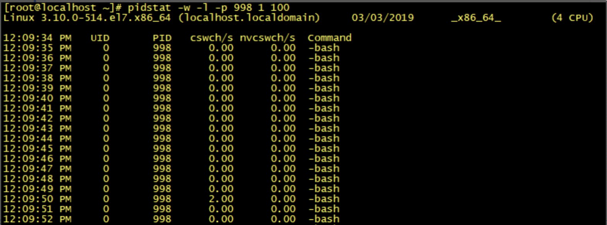

后面的1 100 是每个1s，输出100个。具体的可以看 docs\linux\pidstat使用.md 笔记。

#### 总结

线程越多，系统的运行速度不一定越快。那么我们平时在并发量比较大的情况下，什么时候用单线程，什么时候用多线程呢？

**一般在单个逻辑比较简单，而且速度相对来非常快的情况下，我们可以使用单线程**。例如，我们前面讲到的 Redis，从内存中快速读取值，不用考虑 I/O 瓶颈带来的阻塞问题。

而**在逻辑相对来说很复杂的场景，等待时间相对较长又或者是需要大量计算的场景，我建议使用多线程来提高系统的整体性能**。例如，NIO 时期的文件读写操作、图像处理以及大数据分析等。

#### 问题

你知道在多线程中使用 Synchronized 还会发生进程间的上下文切换吗？具体又会发生在哪些环节呢？

**进程上下文切换，是指用户态和内核态的来回切换**。我们知道，**如果一旦Synchronized锁资源竞争激烈，线程将会被阻塞，阻塞的线程将会从用户态调用内核态，尝试获取mutex，这个过程就是进程上下文切换**。

### 如何优化多线程上下文切换

如果是单个线程，在CPU 调用之后，那么它基本上是不会被调度出去的。**如果可运行的线程数远大于 CPU 数量，那么操作系统最终会将某个正在运行的线程调度出来，从而使其它线程能够使用 CPU，这就会导致上下文切换**。

还有，**在多线程中如果使用了竞争锁，当线程由于等待竞争锁而被阻塞时，JVM 通常会将这个锁挂起，并允许它被交换出去**。如果频繁地发生阻塞，CPU 密集型的程序就会发生更多的上下文切换。

#### 1 减少锁的持有时间

可以将一些与锁无关的代码移出同步代码块，尤其是那些开销较大的操作以及可能被阻塞的操作。

```java
public synchronized void mySyncMethod(){  
    businesscode1();  
    mutextMethod();  
    businesscode2();
}
```

优化后

```java
public void mySyncMethod(){  
    businesscode1();  
    synchronized(this)
    {
        mutextMethod();  
    }
    businesscode2();
}
```

#### 2 降低锁的粒度

同步锁可以保证对象的原子性，**我们可以考虑将锁粒度拆分得更小一些，以此避免所有线程对一个锁资源的竞争过于激烈**。

##### 锁分离

与传统锁不同的是，读写锁实现了锁分离，也就是说读写锁是由“读锁”和“写锁”两个锁实现的，其规则是可以共享都，但只有一个写。在读远大于写的多线程场景中，锁分离避免了在高并发读情况下的资源竞争，从而避免了上下文切换。

##### 锁分段

我们在使用锁来保证集合或者大对象原子性时，可以考虑将锁对象进一步分解。例如，我之前讲过的 Java1.8 之前版本的 ConcurrentHashMap 就使用了锁分段。

#### 3. 非阻塞乐观锁替代竞争锁

volatile 关键字的作用是保障可见性及有序性，volatile 的读写操作不会导致上下文切换，因此开销比较小。 但是，volatile 不能保证操作变量的原子性，因为没有锁的排他性。

然后使用CAS来更新数据，**CAS 是一个无锁算法实现，保障了对一个共享变量读写操作的一致**性。

#### 优化 wait/notify 的使用，减少上下文切换

首先，我们在多个不同消费场景中，可以使用 Object.notify() 替代 Object.notifyAll()。因为 Object.notify() 只会唤醒指定线程，不会过早地唤醒其它未满足需求的阻塞线程，所以可以减少相应的上下文切换。

其次，在生产者执行完 Object.notify() / notifyAll() 唤醒其它线程之后，应该尽快地释放内部锁，以避免其它线程在唤醒之后长时间地持有锁处理业务操作，这样可以避免被唤醒的线程再次申请相应内部锁的时候等待锁的释放。

最后，为了避免长时间等待，我们常会使用 Object.wait (long）设置等待超时时间，但线程无法区分其返回是由于等待超时还是被通知线程唤醒，从而导致线程再次尝试获取锁操作，增加了上下文切换。

建议使用 Lock 锁结合 Condition 接口替代 Synchronized 内部锁中的 wait /notify，实现等待／通知。这样做不仅可以解决上述的 Object.wait(long) 无法区分的问题，还可以解决线程被过早唤醒的问题。

#### 合理地设置线程池大小，避免创建过多线程

**线程池的线程数量设置不宜过大，因为一旦线程池的工作线程总数超过系统所拥有的处理器数量，就会导致过多的上下文切换**。

#### 使用协程实现非阻塞等待

协程是一种比线程更加轻量级的东西，相比于由操作系统内核来管理的进程和线程，协程则**完全由程序本身所控制，也就是在用户态执行**。协程避免了像线程切换那样产生的上下文切换，在性能方面得到了很大的提升。

#### 减少 Java 虚拟机的垃圾回收

### 并发容器的选择

#### MAP容器

##### Hashtabe vs ConcurrentHashMap

虽然 ConcurrentHashMap 的整体性能要优于 Hashtable，但在某些场景中，ConcurrentHashMap 依然不能代替 Hashtable。例如，在强一致的场景中ConcurrentHashMap 就不适用，原因是 ConcurrentHashMap 中的 get、size 等方法没有用到锁，ConcurrentHashMap 是弱一致性的，因此有可能会导致某次读无法马上获取到写入的数据。

##### ConcurrentHashMap vs  ConcurrentSkipListMap

我们再看一个案例，我上家公司的操作系统中有这样一个功能，提醒用户手机卡实时流量不足。主要的流程是服务端先通过虚拟运营商同步用户实时流量，再通过手机端定时触发查询功能，如果流量不足，就弹出系统通知。

该功能的特点是用户量大，并发量高，写入多于查询操作。这时我们就需要设计一个缓存，用来存放这些用户以及对应的流量键值对信息。那么假设让你来实现一个简单的缓存，你会怎么设计呢？

你可能会考虑使用 ConcurrentHashMap 容器，但前面说过，该容器在数据量比较大的时候，链表会转换为红黑树。红黑树在并发情况下，删除和插入过程中有个平衡的过程，会牵涉到大量节点，因此竞争锁资源的代价相对比较高。

而跳跃表的操作针对局部，需要锁住的节点少，因此在并发场景下的性能会更好一些。你可能会问了，在非线程安全的 Map 容器中，我并没有看到基于跳跃表实现的 SkipListMap呀？这是因为在非线程安全的 Map 容器中，基于红黑树实现的 TreeMap 在单线程中的性能表现得并不比跳跃表差。

因此就实现了**在非线程安全的 Map 容器中，用 TreeMap 容器来存取大数据；在线程安全的 Map 容器中，用 SkipListMap 容器来存取大数据**。

##### 跳跃表

#### List 容器

下面我们再来看一个实际生产环境中的案例。在大部分互联网产品中，都会设置一份黑名单。例如，在电商系统中，系统可能会将一些频繁参与抢购却放弃付款的用户放入到黑名单列表。想想这个时候你又会使用哪个容器呢？

首先用户黑名单的数据量并不会很大，但在抢购中需要查询该容器，快速获取到该用户是否存在于黑名单中。其次用户 ID 是整数类型，因此我们可以考虑使用数组来存储。那么ArrayList 是否是你第一时间想到的呢？

**Vector 也是基于 Synchronized 同步锁实现的线程安全，Synchronized 关键字几乎修饰了所有对外暴露的方法，所以在读远大于写的操作场景中，Vector 将会发生大量锁竞争，从而给系统带来性能开销**。

相比之下，**CopyOnWriteArrayList** 是 java.util.concurrent 包提供的方法，**它实现了读操作无锁，写操作则通过操作底层数组的新副本来实现，是一种读写分离的并发策略**。

#### 总结

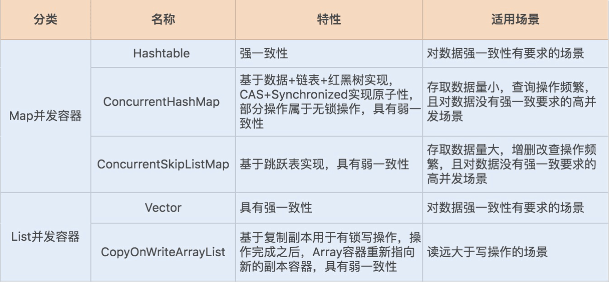

#### 思考题

在抢购类系统中，我们经常会使用队列来实现抢购的排队等待，如果要你来选择或者设计一个队列，你会怎么考虑呢？**写多读少**。

> 假设有一个抢购系统，用户在特定时间段内抢购商品。在这个时间段内，每秒可能有数百甚至上千用户同时访问系统，他们希望尽快地抢购到商品。在这种情况下：
>
> - 写操作：每个用户都会尝试将自己的抢购请求写入队列，表示他们希望购买商品。这会导致大量的写操作，即写入队列。
> - 读操作：相对而言，用户对商品信息的读取操作相对较少。大多数用户已经在抢购前就了解了商品信息，所以他们只是在特定时间段内尝试抢购商品，而不是频繁地读取商品信息。
>
> 因此，抢购系统是一个典型的读少写多的场景，写操作的频率远远高于读操作。

##### 使用非阻塞队列 ConcurrentLinkedQueue

我们常用的线程安全的非阻塞队列是**ConcurrentLinkedQueue**，它是一种无界线程安全队列(FIFO)，基于链表结构实现，利用 CAS 乐观锁来保证线程安全。

**ConcurrentLinkedQueue 是基于 CAS 乐观锁实现的，在并发时的性能要好于其它阻塞队列，因此很适合作为高并发场景下的排队队列**。

### 计算线程池的数量

[GitHub - nickliuchao/threadpollsizetest](https://github.com/nickliuchao/threadpollsizetest)

##### CPU密集型

这种任务消耗的主要是 CPU 资源，可以将线程数设置为 N（CPU 核心数）+1，比 CPU 核心数多出来的一个线程是为了防止线程偶发的缺页中断，或者其它原因导致的任务暂停而带来的影响。一旦任务暂停，CPU 就会处于空闲状态，而在这种情况下多出来的一个线程就可以充分利用 CPU 的空闲时间。

```java
public class CPUTypeTest implements Runnable {

    //整体执行时间，包括在队列中等待的时间
    List<Long> wholeTimeList;
    //真正执行时间
    List<Long> runTimeList;

    private long initStartTime = 0;

    /**
     * 构造函数
     *
     * @param runTimeList
     * @param wholeTimeList
     */
    public CPUTypeTest(List<Long> runTimeList, List<Long> wholeTimeList) {
        initStartTime = System.currentTimeMillis();
        this.runTimeList = runTimeList;
        this.wholeTimeList = wholeTimeList;
    }

    /**
     * 判断素数
     *
     * @param number
     * @return
     */
    public boolean isPrime(final int number) {
        if (number <= 1)
            return false;

        for (int i = 2; i <= Math.sqrt(number); i++) {
            if (number % i == 0)
                return false;
        }
        return true;
    }

    /**
     * 計算素数
     *
     */
    public int countPrimes(final int lower, final int upper) {
        int total = 0;
        for (int i = lower; i <= upper; i++) {
            if (isPrime(i))
                total++;
        }
        return total;
    }

    public void run() {
        long start = System.currentTimeMillis();
//        try {
//            Thread.sleep(1000);// 睡眠1s，会影响速度
//        } catch (InterruptedException e) {
//            // TODO Auto-generated catch block
//            e.printStackTrace();
//        }
        countPrimes(1, 1000000);
        long end = System.currentTimeMillis();

        long wholeTime = end - initStartTime;
        long runTime = end - start;
        wholeTimeList.add(wholeTime);
        runTimeList.add(runTime);
        System.out.println("单个线程花费时间：" + (end - start));
    }
}
```

测试

```java
public class App {
    // 初始化线程池，将线程数量修改为 2、4、8、16、32 查看每个结果
    private static ThreadPoolExecutor threadPool = new ThreadPoolExecutor(32, 32,
            10, TimeUnit.SECONDS, new ArrayBlockingQueue<Runnable>(1000), new ThreadPoolExecutor.DiscardOldestPolicy());

    public static void main(String[] args) throws InterruptedException, ExecutionException, TimeoutException {

        int cores = Runtime.getRuntime().availableProcessors();

        int requestNum = 100;
        System.out.println("CPU核数 " + cores);

        List<Future<?>> futureList = new ArrayList<Future<?>>();

        Vector<Long> wholeTimeList = new Vector<Long>();
        Vector<Long> runTimeList = new Vector<Long>();

        for (int i = 0; i < requestNum; i++) {
            Future<?> future = threadPool.submit(new CPUTypeTest(runTimeList, wholeTimeList));

            //Future<?> future = threadPool.submit(new IOTypeTest(runTimeList, wholeTimeList));
            futureList.add(future);
        }

        for (Future<?> future : futureList) {
            //获取线程执行结果
            future.get(requestNum, TimeUnit.SECONDS);
        }

        long wholeTime = 0;
        for (int i = 0; i < wholeTimeList.size(); i++) {
            wholeTime = wholeTimeList.get(i) + wholeTime;
        }

        long runTime = 0;
        for (int i = 0; i < runTimeList.size(); i++) {
            runTime = runTimeList.get(i) + runTime;
        }

        System.out.println("平均每个线程整体花费时间： " + wholeTime / wholeTimeList.size());
        System.out.println("平均每个线程执行花费时间： " + runTime / runTimeList.size());
    }
}
```

输出结果：这个是睡眠了1s的速度

```java
/**
 * CPU核数 16，i7-10700
 * 睡眠1s
 * 2
 * 平均每个线程整体花费时间： 31266
 * 平均每个线程执行花费时间： 1227
 * 4
 * 平均每个线程整体花费时间： 15913
 * 平均每个线程执行花费时间： 1224
 * 8
 * 平均每个线程整体花费时间： 8452
 * 平均每个线程执行花费时间： 1251
 * 16
 * 平均每个线程整体花费时间： 4816
 * 平均每个线程执行花费时间： 1311
 * 17
 * 平均每个线程整体花费时间： 4518
 * 平均每个线程执行花费时间： 1293
 * 32
 * 平均每个线程整体花费时间： 3234
 * 平均每个线程执行花费时间： 1527
 * 40
 * 平均每个线程整体花费时间： 3096
 * 平均每个线程执行花费时间： 1708
 * 注释了睡眠1s
 * 2
 * 平均每个线程整体花费时间： 5366
 * 平均每个线程执行花费时间： 209
 * 4
 * 平均每个线程整体花费时间： 3050
 * 平均每个线程执行花费时间： 239
 * 6
 * 平均每个线程整体花费时间： 2009
 * 平均每个线程执行花费时间： 227
 * 8
 * 平均每个线程整体花费时间： 1672
 * 平均每个线程执行花费时间： 262
 * 16
 * 平均每个线程整体花费时间： 1333
 * 平均每个线程执行花费时间： 369
 * 17
 * 平均每个线程整体花费时间： 1336
 * 平均每个线程执行花费时间： 393
 * 32
 * 平均每个线程整体花费时间： 1633
 * 平均每个线程执行花费时间： 740
 * 40
 * 平均每个线程整体花费时间： 1420
 * 平均每个线程执行花费时间： 746
 */
```

能够看到，平均每个线程整体花费时间 最少的是16或17个线程的时候。

##### I/O 密集型任务

I/O 密集型任务：这种任务应用起来，系统会用大部分的时间来处理 I/O 交互，而线程在处理 I/O 的时间段内不会占用 CPU 来处理，这时就可以将 CPU 交出给其它线程使用。因此在 I/O 密集型任务的应用中，我们可以多配置一些线程，具体的计算方法是 2N。

**那么碰上一些常规的业务操作，比如，通过一个线程池实现向用户定时推送消息的业务，我们又该如何设置线程池的数量呢**？

**线程数 =N（CPU 核数）*（1+WT（线程等待时间）/ST（线程时间运行时间））**


综合来看，我们可以根据自己的业务场景，从“N+1”和“2N”两个公式中选出一个适合的，计算出一个大概的线程数量，之后通过实际压测，逐渐往“增大线程数量”和“减小线程数量”这两个方向调整，然后观察整体的处理时间变化，最终确定一个具体的线程数量。

我们要提高线程池的处理能力，一定要先保证一个合理的线程数量，也就是保证 CPU 处理线程的最大化。在此前提下，我们再增大线程池队列，通过队列将来不及处理的线程缓存起来。在设置缓存队列时，我们要尽量使用一个有界队列，以防因队列过大而导致的内存溢出问题。
