### 深入JVM即时编译器JIT，优化Java编译

#### 类编译加载执行过程

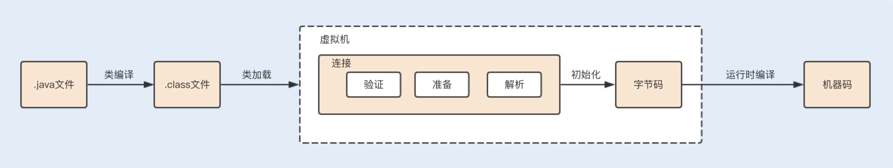

**编译后的字节码文件主要包括常量池和方法表集合这两部分**。

##### 类编译

**常量池主要记录的是类文件中出现的字面量以及符号引用**。字面常量包括字符串常量（例如String str=“abc”，其中"abc"就是常量），声明为 final 的属性以及一些基本类型（例如，范围在 -127-128 之间的整型）的属性。**符号引用包括类和接口的全限定名、类引用、方法引用以及成员变量引用**（例如 String str=“abc”，其中 str 就是成员变量引用）等。

**方法表集合**中主要包含一些方法的字节码、方法访问权限（public、protect、prviate等）、方法名索引（与常量池中的方法引用对应）、描述符索引、JVM 执行指令以及属性集合等。

#### 即时编译

可以看 **docs\java\jvm\运行期优化.md** 笔记。

#### Class.forName 和 ClassLoader.loadClass 区别

我们知道 Class.forName 和 ClassLoader.loadClass 都能加载类，你知道这两者在加载类时的区别吗？

- `Class.forName(String className)` 是一个静态方法，它接受一个类的完全限定名（包括包名）作为参数，并返回相应的类对象。它会加载类并执行静态初始化块，如果没有指定初始化为 false。如果想要延迟加载，可以通过指定 `initialize` 参数为 `false` 来实现。在类未找到或加载失败时会抛出 `ClassNotFoundException`。默认使用调用者的类加载器加载类，也可以使用特定的类加载器。
- `ClassLoader.loadClass(String className)` 是 `ClassLoader` 类的实例方法，它需要一个类的完全限定名作为参数，并返回相应的 `Class` 对象。**它不会执行类的静态初始化块**。在类未找到时会返回 `null`，而不会抛出异常。可以指定特定的类加载器来加载类。

总的来说，`Class.forName()` 更适用于需要在运行时动态加载类并进行初始化的情况，而 `ClassLoader.loadClass()` 更适用于需要更细粒度地控制类加载过程的情况。

### 如何优化垃圾回收机制？

#### 垃圾回收机制

##### 1 回收发生在哪里？

**堆中的回收主要是对象的回收，方法区的回收主要是废弃常量和无用的类的回收**。

##### 2 对象在什么时候可以被回收？

###### 引用计数法

###### 可达性分析法

可以看 **docs\java\jvm** 里的相关笔记

##### 3 如何回收这些对象？

**自动性**：Java 提供了一个系统级的线程来跟踪每一块分配出去的内存空间，当 JVM 处于空闲循环时，垃圾收集器线程会自动检查每一块分配出去的内存空间，然后自动回收每一块空闲的内存块。

**不可预期性**：一旦一个对象没有被引用了，该对象是否立刻被回收呢？答案是不可预期的。我们很难确定一个没有被引用的对象是不是会被立刻回收掉，因为有可能当程序结束后，这个对象仍在内存中。

垃圾回收线程在 JVM 中是自动执行的，Java 程序无法强制执行。我们唯一能做的就是通过调用 System.gc 方法来"建议"执行垃圾收集器，但是否可执行，什么时候执行？仍然不可预期。

#### GC 算法

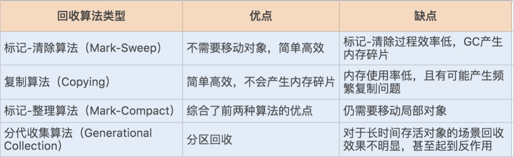

**如果说收集算法是内存回收的方法论，那么垃圾收集器就是内存回收的具体实现**，JDK1.7update14 之后 Hotspot 虚拟机所有的回收器整理如下（以下为服务端垃圾收集器）：

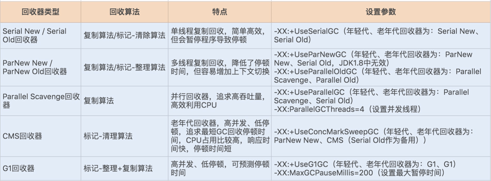

#### GC 性能衡量指标

**吞吐量**：这里的吞吐量是指应用程序所花费的时间和系统总运行时间的比值。我们可以按照这个公式来计算 GC 的吞吐量：系统总运行时间 = 应用程序耗时 +GC 耗时。如果系统运行了 100 分钟，GC 耗时 1 分钟，则系统吞吐量为 99%。GC 的吞吐量一般不能低于95%。

**停顿时间**：指垃圾收集器正在运行时，应用程序的暂停时间。对于串行回收器而言，停顿时间可能会比较长；而使用并发回收器，由于垃圾收集器和应用程序交替运行，程序的停顿时间就会变短，但其效率很可能不如独占垃圾收集器，系统的吞吐量也很可能会降低。

**垃圾回收频率**：多久发生一次指垃圾回收呢？通常垃圾回收的频率越低越好，增大堆内存空间可以有效降低垃圾回收发生的频率，但同时也意味着堆积的回收对象越多，最终也会增加回收时的停顿时间。所以我们只要适当地增大堆内存空间，保证正常的垃圾回收频率即可。

#### 查看 & 分析 GC 日志

参数设置：

```java
-XX:+PrintGC 输出 GC 日志
-XX:+PrintGCDetails 输出 GC 的详细日志
-XX:+PrintGCTimeStamps 输出 GC 的时间戳（以基准时间的形式）
-XX:+PrintGCDateStamps 输出 GC 的时间戳（以日期的形式，如 2013-05-04T21:53:59.234+0800）
-XX:+PrintHeapAtGC 在进行 GC 的前后打印出堆的信息
-Xloggc:../logs/gc.log 日志文件的输出路径
```

这里使用如下参数来打印日志：

` -XX:+PrintGCDateStamps -XX:+PrintGCDetails -Xloggc:./gclogs`

具体的日志也可以看jvm文件夹的相关笔记。

##### 两种查看日志文件的工具

###### GCview

[gcviewer download | SourceForge.net](https://sourceforge.net/projects/gcviewer/)

[gcview对gc文件的分析教程](https://blog.csdn.net/qq_38138069/article/details/125150896)

###### GCeasy

[Universal JVM GC analyzer - Java Garbage collection log analysis made easy (gceasy.io)](https://www.gceasy.io/index.jsp) 

[GC日志分析神器-GCeasy详解](https://blog.csdn.net/qq_40093255/article/details/115376746)

#### GC 调优策略

##### 1. 降低 Minor GC 频率

通常情况下，由于新生代空间较小，Eden 区很快被填满，就会导致频繁 Minor GC，因此我们可以通过增大新生代空间来降低 Minor GC 的频率。

可能你会有这样的疑问，扩容 Eden 区虽然可以减少 Minor GC 的次数，但不会增加单次Minor GC 的时间吗？如果单次 Minor GC 的时间增加，那也很难达到我们期待的优化效果呀。

我们知道，单次 Minor GC 时间是由两部分组成：T1（扫描新生代）和 T2（复制存活对象）。假设一个对象在 Eden 区的存活时间为 500ms，Minor GC 的时间间隔是 300ms，那么正常情况下，Minor GC 的时间为 ：T1+T2。

当我们增大新生代空间，Minor GC 的时间间隔可能会扩大到 600ms，此时一个存活500ms 的对象就会在 Eden 区中被回收掉，此时就不存在复制存活对象了，所以再发生Minor GC 的时间为：两次扫描新生代，即 2T1。

**可见，扩容后，Minor GC 时增加了 T1，但省去了 T2 的时间**。通常在虚拟机中，复制对象的成本要远高于扫描成本。

如果在堆内存中存在较多的长期存活的对象，此时增加年轻代空间，反而会增加 Minor GC的时间。如果堆中的短期对象很多，那么扩容新生代，单次 Minor GC 时间不会显著增加。因此，单次 Minor GC 时间更多取决于 GC 后存活对象的数量，而非 Eden 区的大小。

##### 2. 降低 Full GC 的频率

通常情况下，由于堆内存空间不足或老年代对象太多，会触发 Full GC，频繁的 Full GC 会带来上下文切换，增加系统的性能开销。我们可以使用哪些方法来降低 Full GC 的频率呢？

**减少创建大对象**：在平常的业务场景中，我们习惯一次性从数据库中查询出一个大对象用于web 端显示。例如，我之前碰到过一个一次性查询出 60 个字段的业务操作，这种大对象如果超过年轻代最大对象阈值，会被直接创建在老年代；即使被创建在了年轻代，由于年轻代的内存空间有限，通过 Minor GC 之后也会进入到老年代。这种大对象很容易产生较多的 Full GC。

我们可以将这种大对象拆解出来，首次只查询一些比较重要的字段，如果还需要其它字段辅助查看，再通过第二次查询显示剩余的字段。

**增大堆内存空间**：在堆内存不足的情况下，增大堆内存空间，且设置初始化堆内存为最大堆内存，也可以降低 Full GC 的频率。

#### 选择合适的 GC 回收器

假设我们有这样一个需求，要求每次操作的响应时间必须在 500ms 以内。这个时候我们一般会选择响应速度较快的 GC 回收器，CMS（Concurrent Mark Sweep）回收器和 G1 回收器都是不错的选择。

而当我们的需求对系统吞吐量有要求时，就可以选择 Parallel Scavenge 回收器来提高系统的吞吐量。

### 如何优化JVM内存分配？

**有了什么样的性能问题我们需要对其进行调优呢？又该如何调优呢？**

#### JVM 内存分配性能问题

**JVM 内存分配不合理最直接的表现就是频繁的 GC，这会导致上下文切换等性能问题，从而降低系统的吞吐量、增加系统的响应时间**。因此，**如果你在线上环境或性能测试时，发现频繁的 GC，且是正常的对象创建和回收，这个时候就需要考虑调整 JVM 内存分配了，从而减少 GC 所带来的性能开销**。

#### 查看 JVM 堆内存分配

在默认不配置 JVM 堆内存大小的情况下，JVM 根据默认值来配置当前内存大小。我们可以通过以下命令来查看堆内存配置的默认值：

```sh
java -XX:+PrintFlagsFinal -version | grep HeapSize 
jmap -heap 17284
```

结果

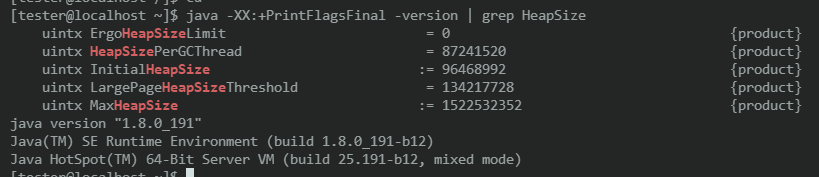

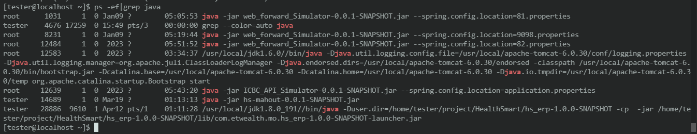

查看具体的堆内存大小

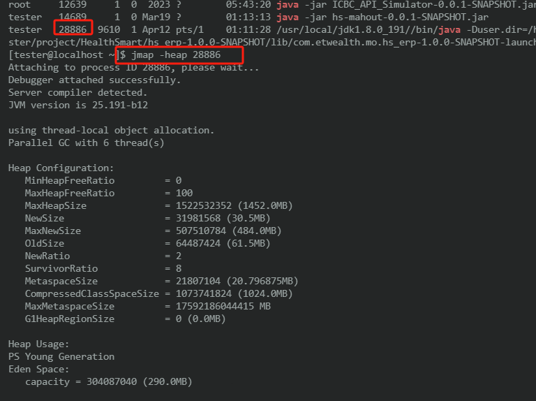

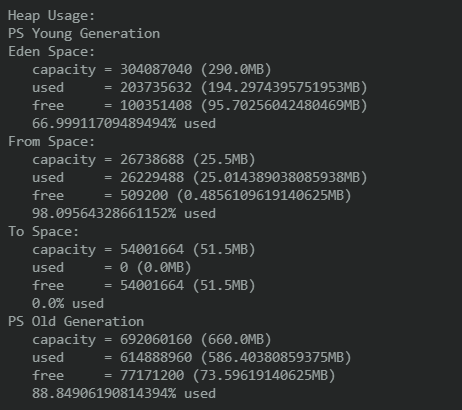

- **MinHeapFreeRatio**：最小堆空闲比例，表示堆内存的最小空闲比例，当堆内存的空闲空间低于此比例时，JVM 将会尝试扩展堆内存。
- **MaxHeapFreeRatio**：最大堆空闲比例，表示堆内存的最大空闲比例，当堆内存的空闲空间超过此比例时，JVM 将会尝试收缩堆内存。
- **MaxHeapSize**：堆内存的最大大小，即堆内存允许使用的最大空间。
- **NewSize**：新生代（Young Generation）的初始大小。
- **MaxNewSize**：新生代（Young Generation）的最大大小。
- **OldSize**：老年代（Old Generation）的初始大小。
- **NewRatio**：新生代和老年代的比例，例如设置为2表示新生代的大小是老年代的一半。
- **SurvivorRatio**：Eden 空间与 Survivor 空间的比例，默认为8，表示 Eden 空间占整个新生代的 8 分之 1。
- **MetaspaceSize**：元空间（Metaspace）的初始大小。
- **CompressedClassSpaceSize**：压缩类空间（Compressed Class Space）的大小，用于存放类的元数据。
- **MaxMetaspaceSize**：元空间（Metaspace）的最大大小。
- **G1HeapRegionSize**：G1 垃圾回收器的堆区域大小。

在 JDK1.7 中，默认情况下年轻代和老年代的比例是 1:2，我们可以通过–XX:NewRatio 重置该配置项。年轻代中的 Eden 和 To Survivor、From Survivor 的比例是 8:1:1，我们可以通过 -XX:SurvivorRatio 重置该配置项。

在 JDK1.7 中如果开启了 -XX:+UseAdaptiveSizePolicy 配置项，JVM 将会动态调整 Java堆中各个区域的大小以及进入老年代的年龄，–XX:NewRatio 和 -XX:SurvivorRatio 将会失效，而 JDK1.8 是默认开启 -XX:+UseAdaptiveSizePolicy 配置项的。

还有，在 JDK1.8 中，不要随便关闭 UseAdaptiveSizePolicy 配置项，除非你已经对初始化堆内存 / 最大堆内存、年轻代 / 老年代以及 Eden 区 /Survivor 区有非常明确的规划了。否则 JVM 将会分配最小堆内存，年轻代和老年代按照默认比例 1:2 进行分配，年轻代中的Eden 和 Survivor 则按照默认比例 8:2 进行分配。这个内存分配未必是应用服务的最佳配置，因此可能会给应用服务带来严重的性能问题。

#### JVM 内存分配的调优过程


### 内存持续上升，如何排查

#### 常用的监控和诊断内存工具

在 Linux 文件笔记下有

##### Linux 命令行工具之 top 命令

##### Linux 命令行工具之 vmstat 命令

##### Linux 命令行工具之 pidstat 命令

##### Linux 命令行工具之 pidstat 命令

##### JDK 工具之 jstat 命令

docs\java\jvm\虚拟机性能监控和故障处理工具.md

```sh
[tester@localhost ~]$ jstat -help
Usage: jstat -help|-options
       jstat -<option> [-t] [-h<lines>] <vmid> [<interval> [<count>]]

Definitions:
  <option>      An option reported by the -options option
  <vmid>        Virtual Machine Identifier. A vmid takes the following form:
                     <lvmid>[@<hostname>[:<port>]]
                Where <lvmid> is the local vm identifier for the target
                Java virtual machine, typically a process id; <hostname> is
                the name of the host running the target Java virtual machine;
                and <port> is the port number for the rmiregistry on the
                target host. See the jvmstat documentation for a more complete
                description of the Virtual Machine Identifier.
  <lines>       Number of samples between header lines.
  <interval>    Sampling interval. The following forms are allowed:
                    <n>["ms"|"s"]
                Where <n> is an integer and the suffix specifies the units as 
                milliseconds("ms") or seconds("s"). The default units are "ms".
  <count>       Number of samples to take before terminating.
  -J<flag>      Pass <flag> directly to the runtime system.
[tester@localhost ~]$ jstat -options
-class
-compiler
-gc
-gccapacity
-gccause
-gcmetacapacity
-gcnew
-gcnewcapacity
-gcold
-gcoldcapacity
-gcutil
-printcompilation
```

实例

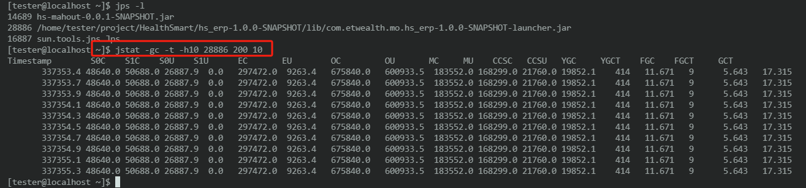
这是使用 `jstat` 命令来查看 JVM 垃圾回收统计信息的命令，具体参数含义如下：

- **-gc**: 指定要查看垃圾回收统计信息。
- **-t**: 在输出中包含时间戳。
- **-h10**: 指定输出中包含 10 次垃圾回收后的统计信息。
- **28886**: 进程 ID，表示要监视的 Java 进程的 PID。
- **200**: 采样间隔，表示每隔 200 毫秒采集一次统计信息。
- **10**: 采样次数，表示总共采集 10 次统计信息。

输出：

| 参数 | 描述                                                  |
| ---- | ----------------------------------------------------- |
| S0C  | 年轻代中 To Survivor 的容量 (KB)                      |
| S1C  | 年轻代中 From Survivor 的容量 (KB)                    |
| S0U  | 年轻代中 To Survivor 目前已使用空间 (KB)              |
| S1U  | 年轻代中 From Survivor 目前已使用空间 (KB)            |
| EC   | 年轻代中 Eden 的容量 (KB)                             |
| EU   | 年轻代中 Eden 目前已使用空间 (KB)                     |
| OC   | Old 代的容量 (KB)                                     |
| OU   | Old 代目前已使用空间 (KB)                             |
| MC   | Metaspace 的容量 (KB)                                 |
| MU   | Metaspace 目前已使用空间 (KB)                         |
| YGC  | 从应用程序启动到采样时年轻代中 gc 次数                |
| YGCT | 从应用程序启动到采样时年轻代中 gc 所用时间 (s)        |
| FGC  | 从应用程序启动到采样时 old 代（全 gc）gc 次数         |
| FGCT | 从应用程序启动到采样时 old 代（全 gc）gc 所用时间 (s) |
| GCT  | 从应用程序启动到采样时 gc 用的总时间 (s)              |

##### JDK 工具之 jstack 命令

docs\java\jvm\虚拟机性能监控和故障处理工具.md

它是一种线程堆栈分析工具，最常用的功能就是使用 jstack pid 命令查看线程的堆栈信息，通常会结合 top -Hp pid 或 pidstat -p pid -t 一起查看具体线程的状态，也经常用来排查一些死锁的异常。

##### JDK 工具之 jmap 命令

我们可以使用 jmap -histo[:live] pid 查看堆内存中的对象数目、大小统计直方图，如果带上 live 则只统计活对象：

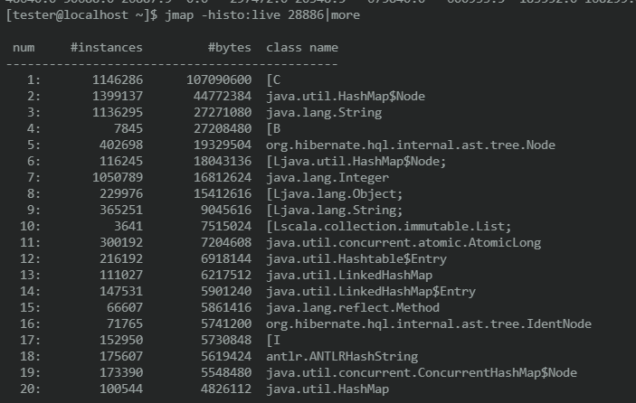

我们可以通过 jmap 命令把堆内存的使用情况 dump 到文件中：

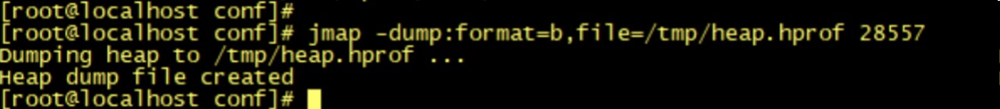

通过 jps 查看具体我们需要分析的进程pid：

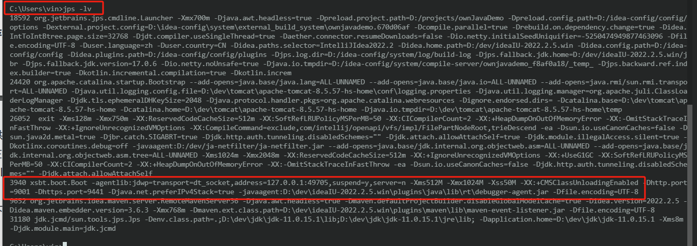

查看到这个是我们运行中的项目。

```sh
C:\Users\vin>jmap -dump:format=b,file="C:\Users\vin\Desktop\heap.hprof" 3940
Heap dump file created
```


我们可以将文件下载下来，使用 [MAT](https://eclipse.dev/mat/) 工具打开文件进行分析：下载低一点的版本，我下载的是1.12.0的，高版本的要求jdk比较高。

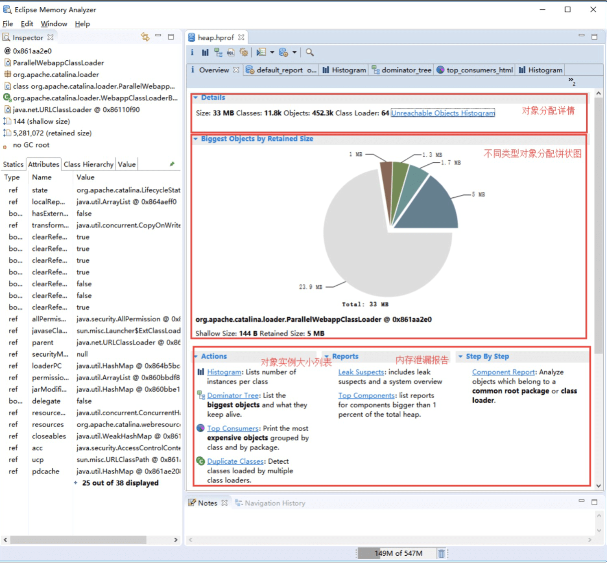

#### 实战演练

我们平时遇到的内存溢出问题一般分为两种，一种是由于大峰值下没有限流，瞬间创建大量对象而导致的内存溢出；另一种则是由于内存泄漏而导致的内存溢出。

使用限流，我们一般就可以解决第一种内存溢出问题，但其实很多时候，内存溢出往往是内存泄漏导致的，这种问题就是程序的 BUG，我们需要及时找到问题代码。

