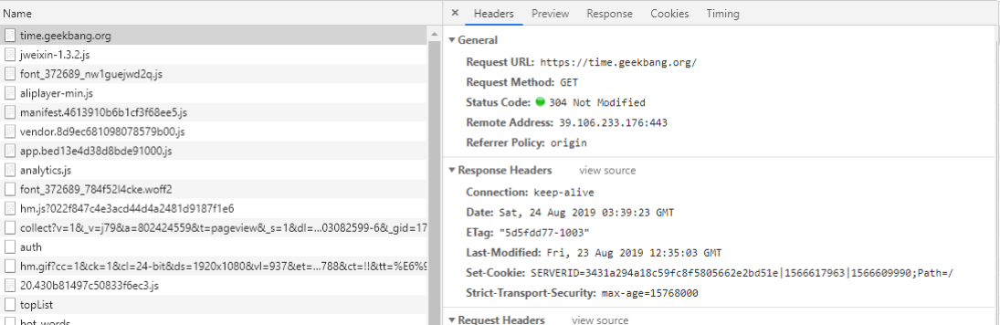
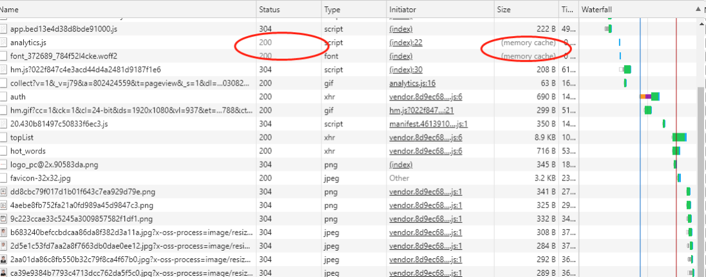
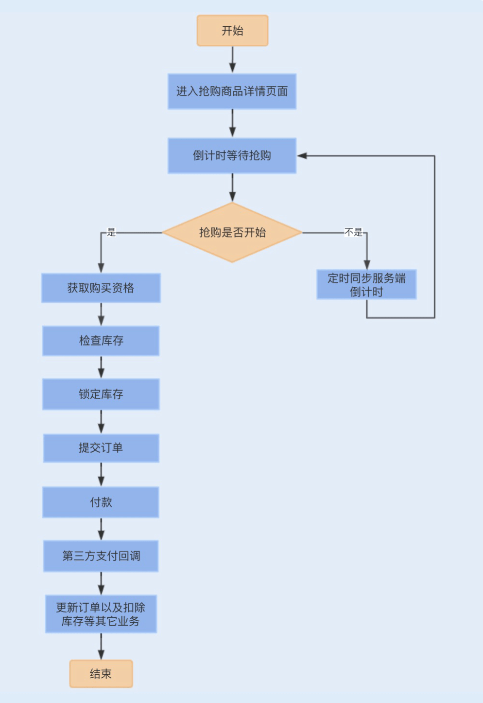

## 缓存优化系统性能

### 前端缓存技术

#### 1 本地缓存

平时使用拦截器（例如 Fiddler）或浏览器 Debug 时，我们经常会发现一些接口返回 304状态码 + Not Modified 字符串，如下图中的极客时间 Web 首页。



如果我们对前端缓存技术不了解，就很容易对此感到困惑。浏览器常用的一种缓存就是这种基于 304 响应状态实现的本地缓存了，通常这种缓存被称为协商缓存

**协商缓存，顾名思义就是与服务端协商之后，通过协商结果来判断是否使用本地缓存**。

一般协商缓存可以基于请求头部中的 If-Modified-Since 字段与返回头部中的 Last-Modified 字段实现，也可以基于请求头部中的 If-None-Match 字段与返回头部中的 ETag字段来实现。

两种方式的实现原理是一样的，前者是基于时间实现的，后者是基于一个唯一标识实现的，相对来说后者可以更加准确地判断文件内容是否被修改，避免由于时间篡改导致的不可靠问题。

**强缓存指的是只要判断缓存没有过期，则直接使用浏览器的本地缓存**。

如下图中，返回的是200 状态码，但在 size 项中标识的是 memory cache。



强缓存是利用 Expires 或者 Cache-Control 这两个 HTTP Response Header 实现的，它们都用来表示资源在客户端缓存的有效期。

Expires 是一个绝对时间，而 Cache-Control 是一个相对时间，即一个过期时间大小，与协商缓存一样，基于 Expires 实现的强缓存也会因为时间问题导致缓存管理出现问题。我建议使用 Cache-Control 来实现强缓存。具体的实现流程如下：

- 当浏览器第一次请求访问服务器资源时，服务器会在返回这个资源的同时，在 Response头部加上 Cache-Control，Cache-Control 中设置了过期时间大小；
- 浏览器再次请求访问服务器中的该资源时，会先通过请求资源的时间与 Cache-Control中设置的过期时间大小，来计算出该资源是否过期，如果没有，则使用该缓存，否则请求服务器；
- 服务器再次收到请求后，会再次更新 Response 头部的 Cache-Control。

#### 2 网关缓存

我们还可以在网关中设置缓存，也就是我们熟悉的 CDN。

CDN 缓存是通过不同地点的缓存节点缓存资源副本，当用户访问相应的资源时，会调用最近的 CDN 节点返回请求资源，这种方式常用于视频资源的缓存。

### 服务层缓存技术

前端缓存一般用于缓存一些不常修改的常量数据或一些资源文件，大部分接口请求的数据都缓存在了服务端，方便统一管理缓存数据。

服务端缓存的初衷是为了提升系统性能。例如，数据库由于并发查询压力过大，可以使用缓存减轻数据库压力；在后台管理中的一些报表计算类数据，每次请求都需要大量计算，消耗系统 CPU 资源，我们可以使用缓存来保存计算结果。

**服务端的缓存也分为进程缓存和分布式缓存，在 Java 中进程缓存就是 JVM 实现的缓存，常见的有我们经常使用的容器类，ArrayList、ConcurrentHashMap 等，分布式缓存则是基于 Redis 实现的缓存**。

#### 1 进程缓存

对于进程缓存，虽然数据的存取会更加高效，**但 JVM 的堆内存数量是有限的，且在分布式环境下很难同步各个服务间的缓存更新，所以我们一般缓存一些数据量不大、更新频率较低的数据**。常见的实现方式如下：

`private static final Map<String, Object> cacheMap= new ConcurrentHashMap<String,Object>;`

除了 Java 自带的容器可以实现进程缓存，我们还可以基于 Google 实现的一套内存缓存组件 Guava Cache 来实现。

Guava Cache 适用于高并发的多线程缓存，它和 ConcurrentHashMap 一样，都是基于分段锁实现的并发缓存。

Guava Cache 同时也实现了数据淘汰机制，当我们设置了缓存的最大值后，当存储的数据超过了最大值时，它就会使用 LRU 算法淘汰数据。我们可以通过以下代码了解下 GuavaCache 的实现：

```java
public class GuavaCacheDemo {
    public static void main(String[] args) {
        Cache<String,String> cache = CacheBuilder.newBuilder()
                .maximumSize(2)
                .build();
        cache.put("key1","value1");
        cache.put("key2","value2");
        cache.put("key3","value3");
        System.out.println(" 第一个值：" + cache.getIfPresent("key1"));
        System.out.println(" 第二个值：" + cache.getIfPresent("key2"));
        System.out.println(" 第三个值：" + cache.getIfPresent("key3"));
    }
}
// 结果
第一个值：null
第二个值：value2
第三个值：value3
```

那如果我们的数据量比较大，且数据更新频繁，又是在分布式部署的情况下，想要使用 JVM 堆内存作为缓存，这时我们又该如何去实现呢？

Ehcache 是一个不错的选择，Ehcache 经常在 Hibernate 中出现，主要用来缓存查询数据结果。Ehcache 是 Apache 开源的一套缓存管理类库，是基于 JVM 堆内存实现的缓存，同时具备多种缓存失效策略，支持磁盘持久化以及分布式缓存机制。

#### 2 分布式缓存

由于高并发对数据一致性的要求比较严格，我一般不建议使用 Ehcache 缓存有一致性要求的数据。对于分布式缓存，**我们建议使用 Redis 来实现**，Redis 相当于一个内存数据库，由于是纯内存操作，又是基于单线程串行实现，查询性能极高，读速度超过了 10W 次 /秒。

### 数据库与缓存数据一致性问题

可以看 readingNotes\redis核心技术与实战 里的笔记，以及：[【经典问题】mysql和redis数据一致性问题 - John-zh - 博客园 (cnblogs.com)](https://www.cnblogs.com/Johnyzh/p/17944675)


## 如何设计更优的分布式锁

- 数据库实现分布式锁

- 使用zookeeper实现分布式锁

- 使用redis的setnx实现

  > 如果是在 Redis 集群环境下，依然存在问题。由于 Redis 集群数据同步到各个节点时是异步的，如果在 Master 节点获取到锁后，在没有同步到其它节点时，Master 节点崩溃了，此时新的 Master 节点依然可以获取锁，所以多个应用服务可以同时获取到锁。
  >
  > Redisson 中实现了 Redis 分布式锁，且支持单点模式和集群模式。在集群模式下，Redisson 使用了 Redlock 算法，避免在 Master 节点崩溃切换到另外一个 Master 时，多个应用同时获得锁。
  >
  > 在不同的节点上使用单个实例获取锁的方式去获得锁，且每次获取锁都有超时时间，如果请求超时，则认为该节点不可用。当应用服务成功获取锁的 Redis 节点超过半数（N/2+1，N 为节点数) 时，并且获取锁消耗的实际时间不超过锁的过期时间，则获取锁成功。
  >
  > 一旦获取锁成功，就会重新计算释放锁的时间，该时间是由原来释放锁的时间减去获取锁所消耗的时间；而如果获取锁失败，客户端依然会释放获取锁成功的节点。

### 数据库实现分布式锁

```mysql
CREATE TABLE `order`  (
  `id` int(11) NOT NULL AUTO_INCREMENT,
  `order_no` int(11) DEFAULT NULL,
  `pay_money` decimal(10, 2) DEFAULT NULL,
  `status` int(4) DEFAULT NULL,
  `create_date` datetime(0) DEFAULT NULL,
  `delete_flag` int(4) DEFAULT NULL,
  PRIMARY KEY (`id`) USING BTREE,
  INDEX `idx_status`(`status`) USING BTREE,
  INDEX `idx_order`(`order_no`) USING BTREE
) ENGINE = InnoDB
```

其次，如果是校验订单的幂等性，就要先查询该记录是否存在数据库中，查询的时候要防止幻读，如果不存在，就插入到数据库，否则，放弃操作。

```mysql
select id from `order` where `order_no`= 'xxxx' for update
```

最后注意下，除了查询时防止幻读，我们还需要保证查询和插入是在同一个事务中，因此我们需要申明事务，具体的实现代码如下：

```java
@Transactional
public int addOrderRecord(Order order) {
    if(orderDao.selectOrderRecord(order)==null){
        int result = orderDao.addOrderRecord(order);
        if(result>0){
            return 1;
        }
    }
    return 0;
}
```

在 RR 事务级别，select 的 for update 操作是基于间隙锁 gap lock 实现的，这是一种悲观锁的实现方式，所以存在阻塞问题。

因此在高并发情况下，当有大量的请求进来时，大部分的请求都会进行排队等待。为了保证数据库的稳定性，事务的超时时间往往又设置得很小，所以就会出现大量事务被中断的情况。

除了阻塞等待之外，因为订单没有删除操作，所以这张锁表的数据将会逐渐累积，我们需要设置另外一个线程，隔一段时间就去删除该表中的过期订单，这就增加了业务的复杂度。

除了这种幂等性校验的分布式锁，有一些单纯基于数据库实现的分布式锁代码块或对象，是需要在锁释放时，删除或修改数据的。如果在获取锁之后，锁一直没有获得释放，即数据没有被删除或修改，这将会引发死锁问题。

### 总结

实现分布式锁的方式有很多，有最简单的数据库实现，还有 Zookeeper 多节点实现和缓存实现。我们可以分别对这三种实现方式进行性能压测，**可以发现在同样的服务器配置下，Redis 的性能是最好的，Zookeeper 次之，数据库最差**。

Redis 分布式锁在集群环境下会出现不同应用服务同时获得锁的可能，而Redisson 中的 Redlock 算法很好地解决了这个问题。那 Redisson 实现的分布式锁是不是就一定不会出现同时获得锁的可能呢？

## 记一次双十一抢购性能瓶颈调优

### 抢购业务流程

在进行具体的性能问题讨论之前，我们不妨先来了解下一个常规的抢购业务流程，这样方便我们更好地理解一个抢购系统的性能瓶颈以及调优过程。

用户登录后会进入到商品详情页面，此时商品购买处于倒计时状态，购买按钮处于置灰状态。

当购买倒计时间结束后，用户点击购买商品，此时用户需要排队等待获取购买资格，如果没有获取到购买资格，抢购活动结束，反之，则进入提交页面。

用户完善订单信息，点击提交订单，此时校验库存，并创建订单，进入锁定库存状态，之后，用户支付订单款。

当用户支付成功后，第三方支付平台将产生支付回调，系统通过回调更新订单状态，并扣除数据库的实际库存，通知用户购买成功。



### 抢购系统中的性能瓶颈

#### 1 商品详情页面

如果你有过抢购商品的经验，相信你遇到过这样一种情况，在抢购马上到来的时候，商品详情页面几乎是无法打开的。

这是因为大部分用户在抢购开始之前，会一直疯狂刷新抢购商品页面，尤其是倒计时一分钟内，查看商品详情页面的请求量会猛增。此时如果商品详情页面没有做好，就很容易成为整个抢购系统中的第一个性能瓶颈。

类似这种问题，我们通常的做法是提前将整个抢购商品页面生成为一个静态页面，并 push到 CDN 节点，并且在浏览器端缓存该页面的静态资源文件，通过 CDN 和浏览器本地缓存这两种缓存静态页面的方式来实现商品详情页面的优化。

#### 2 抢购倒计时

在商品详情页面中，存在一个抢购倒计时，这个倒计时是服务端时间的，初始化时间需要从服务端获取，并且在用户点击购买时，还需要服务端判断抢购时间是否已经到了。

如果商品详情每次刷新都去后端请求最新的时间，这无疑将会把整个后端服务拖垮。我们可以改成初始化时间从客户端获取，每隔一段时间主动去服务端刷新同步一次倒计时，这个时间段是随机时间，避免集中请求服务端。这种方式可以避免用户主动刷新服务端的同步时间接口。

#### 3 获取购买资格

可能你会好奇，**在抢购中我们已经通过库存数量限制用户了，那为什么会出现一个获取购买资格的环节呢**？

我们知道，进入订单详情页面后，需要填写相关的订单信息，例如收货地址、联系方式等，在这样一个过程中，很多用户可能还会犹豫，甚至放弃购买。如果把这个环节设定为一定能购买成功，那我们就只能让同等库存的用户进来，一旦用户放弃购买，这些商品可能无法再次被其他用户抢购，会大大降低商品的抢购销量。

增加购买资格的环节，选择让超过库存的用户量进来提交订单页面，这样就可以保证有足够提交订单的用户量，确保抢购活动中商品的销量最大化。

获取购买资格这步的并发量会非常大，还是基于分布式的，通常我们可以通过 Redis 分布式锁来控制购买资格的发放。

#### 4 提交订单

由于抢购入口的请求量会非常大，可能会占用大量带宽，为了不影响提交订单的请求，我建议将提交订单的子域名与抢购子域名区分开，分别绑定不同网络的服务器。

用户点击提交订单，需要先校验库存，库存足够时，用户先扣除缓存中的库存，再生成订单。如果校验库存和扣除库存都是基于数据库实现的，那么每次都去操作数据库，瞬时的并发量就会非常大，对数据库来说会存在一定的压力，从而会产生性能瓶颈。与获取购买资格一样，我们同样可以通过分布式锁来优化扣除消耗库存的设计。

由于我们已经缓存了库存，所以在提交订单时，库存的查询和冻结并不会给数据库带来性能瓶颈。但在这之后，还有一个订单的幂等校验，为了提高系统性能，我们同样可以使用分布式锁来优化。

而保存订单信息一般都是基于数据库表来实现的，在单表单库的情况下，碰到大量请求，特别是在瞬时高并发的情况下，磁盘 I/O、数据库请求连接数以及带宽等资源都可能会出现性能瓶颈。此时我们可以考虑对订单表进行分库分表，通常我们可以基于 userid 字段来进行hash 取模，实现分库分表，从而提高系统的并发能力。

#### 5 支付回调业务操作

在用户支付订单完成之后，一般会有第三方支付平台回调我们的接口，更新订单状态。

除此之外，还可能存在扣减数据库库存的需求。如果我们的库存是基于缓存来实现查询和扣减，那提交订单时的扣除库存就只是扣除缓存中的库存，为了减少数据库的并发量，我们会在用户付款之后，在支付回调的时候去选择扣除数据库中的库存。

此外，还有订单购买成功的短信通知服务，一些商城还提供了累计积分的服务。在支付回调之后，我们可以通过异步提交的方式，实现订单更新之外的其它业务处理，例如库存扣减、积分累计以及短信通知等。通常我们可以基于 MQ 实现业务的异步提交。

### 性能瓶颈调优

#### 1 限流实现优化

限流是我们常用的兜底策略，无论是倒计时请求接口，还是抢购入口，系统都应该对它们设置最大并发访问数量，防止超出预期的请求集中进入系统，导致系统异常。

通常我们是在网关层实现高并发请求接口的限流，如果我们使用了 Nginx 做反向代理的话，就可以在 Nginx 配置限流算法。Nginx 是基于漏桶算法实现的限流，这样做的好处是能够保证请求的实时处理速度。

Nginx 中包含了两个限流模块：ngx_http_limit_conn_module 和 ngx_http_limit_req_module，前者是用于限制单个 IP 单位时间内的请求数量，后者是用来限制单位时间内所有 IP 的请求数量。以下分别是两个限流的配置：

```conf
limit_conn_zone $binary_remote_addr zone=addr:10m;
 
server {
    location / {
        limit_conn addr 1;
    }
	http {
    limit_req_zone $binary_remote_addr zone=one:10m rate=1r/s;
    server {
        location / {
            limit_req zone=one burst=5 nodelay;
        }
} 
```

在网关层，我们还可以通过 lua 编写 OpenResty 来实现一套限流功能，也可以通过现成的Kong 安装插件来实现。除了网关层的限流之外，我们还可以基于服务层实现接口的限流，通过 Zuul RateLimit 或 Guava RateLimiter 实现。

#### 2 流量削峰

瞬间有大量请求进入到系统后台服务之后，首先是要通过 Redis 分布式锁获取购买资格，这个时候我们看到了大量的“JedisConnectionException Could not get connection from pool”异常。

这个异常是一个 Redis 连接异常，由于我们当时的 Redis 集群是基于哨兵模式部署的，哨兵模式部署的 Redis 也是一种主从模式，我们在写 Redis 的时候都是基于主库来实现的，在高并发操作一个 Redis 实例就很容易出现性能瓶颈。

你可能会想到使用集群分片的方式来实现，但对于分布式锁来说，集群分片的实现只会增加性能消耗，这是因为我们需要基于 Redission 的红锁算法实现，需要对集群的每个实例进行加锁。

后来我们使用 Redission 插件替换 Jedis 插件，由于 Jedis 的读写 I/O 操作还是阻塞式的，方法调用都是基于同步实现，而 Redission 底层是基于 Netty 框架实现的，读写 I/O是非阻塞 I/O 操作，且方法调用是基于异步实现。

但在瞬时并发非常大的情况下，依然会出现类似问题，此时，我们可以考虑在分布式锁前面新增一个等待队列，减缓抢购出现的集中式请求，相当于一个流量削峰。当请求的 key 值放入到队列中，请求线程进入阻塞状态，当线程从队列中获取到请求线程的 key 值时，就会唤醒请求线程获取购买资格。

#### 3 数据丢失问题

无论是服务宕机，还是异步发送给 MQ，都存在请求数据丢失的可能。例如，当第三方支付回调系统时，写入订单成功了，此时通过异步来扣减库存和累计积分，如果应用服务刚好挂掉了，MQ 还没有存储到该消息，那即使我们重启服务，这条请求数据也将无法还原。

重试机制是还原丢失消息的一种解决方案。在以上的回调案例中，我们可以在写入订单时，同时在数据库写入一条异步消息状态，之后再返回第三方支付操作成功结果。在异步业务处理请求成功之后，更新该数据库表中的异步消息状态。

假设我们重启服务，那么系统就会在重启时去数据库中查询是否有未更新的异步消息，如果有，则重新生成 MQ 业务处理消息，供各个业务方消费处理丢失的请求数据。

### 总结

**减少抢购中操作数据库的次数，缩短抢购流程，是抢购系统设计和优化的核心点**。

抢购系统的性能瓶颈主要是在数据库，即使我们对服务进行了横向扩容，当流量瞬间进来，数据库依然无法同时响应处理这么多的请求操作。我们可以对抢购业务表进行分库分表，通过提高数据库的处理能力，来提升系统的并发处理能力。

除此之外，我们还可以分散瞬时的高并发请求，流量削峰是最常用的方式，用一个队列，让请求排队等待，然后有序且有限地进入到后端服务，最终进行数据库操作。当我们的队列满了之后，可以将溢出的请求放弃，这就是限流了。通过限流和削峰，可以有效地保证系统不宕机，确保系统的稳定性。

### 思考题

##### 恶意锁单

在提交了订单之后会进入到支付阶段，此时系统是冻结了库存的，一般我们会给用户一定的等待时间，这样就很容易出现一些用户恶意锁库存，导致抢到商品的用户没办法去支付购买该商品。你觉得该怎么优化设计这个业务操作呢？

> 没有直接的解决方案，但是我们可以通过间接的方案来减少这种恶意锁单的问题。建立信用以及黑名单机制，首先在获取购买资格时将黑名单用户过滤掉，其次在获取购买资格后，信用级别高的用户优先获取到库存。用户一旦恶意锁单就会被加入到黑名单。

**文心一言**的回答：

确实，在抢购系统中，冻结库存并为用户提供支付等待时间是一种常见的做法，但这也可能导致恶意锁库存的问题。针对这一问题，以下是一些建议的优化设计：

1. 缩短支付等待时间
   - 减少用户提交订单到支付完成之间的时间窗口，以减少库存被锁定的时间。
   - 在系统允许的情况下，尽可能实现即时支付，减少用户等待时间。
2. 引入支付超时机制
   - 设定一个支付超时时间，如果用户在该时间内未完成支付，则自动释放锁定的库存。
   - 超时时间应该根据系统的特性和用户体验进行权衡，不宜过长也不宜过短。
3. 用户行为监控与限制（黑名单）
   - 监控用户的订单提交和支付行为，对于频繁提交订单但不支付的用户，可以采取限制措施，如限制其再次参与抢购或增加其支付等待时间。
   - 使用机器学习和大数据技术来识别恶意行为模式，并自动采取相应的防御措施。
4. 预支付或定金机制
   - 在用户提交订单时，要求其支付一定比例的定金或预支付，以表明其真实的购买意图。
   - 定金或预支付金额可以在用户完成支付时抵扣，以减少用户的经济压力。
5. 优化库存分配策略
   - 采用更智能的库存分配算法，根据用户的购买历史、信用评级等因素来分配库存。
   - 对于高信誉度的用户，可以给予更长的支付等待时间或更高的购买优先级。
6. 增强用户教育和提示
   - 通过系统提示、帮助文档等方式，教育用户尽快完成支付，避免恶意锁库存。
   - 在用户进入支付阶段时，可以显示剩余支付时间，提醒用户尽快完成支付。
7. 引入验证码机制
   - 对于频繁提交订单的用户，可以要求其输入验证码以验证其身份和购买意图。
   - 这可以有效减少恶意软件和自动化脚本对系统的滥用。
8. 优化系统性能和稳定性
   - 确保系统在高峰期的性能和稳定性，避免因系统崩溃或延迟而导致用户无法正常支付。
   - 使用分布式架构、负载均衡等技术手段来提高系统的并发处理能力。

通过综合考虑以上优化措施，可以有效减少恶意锁库存的问题，提高抢购系统的公平性和用户体验。
