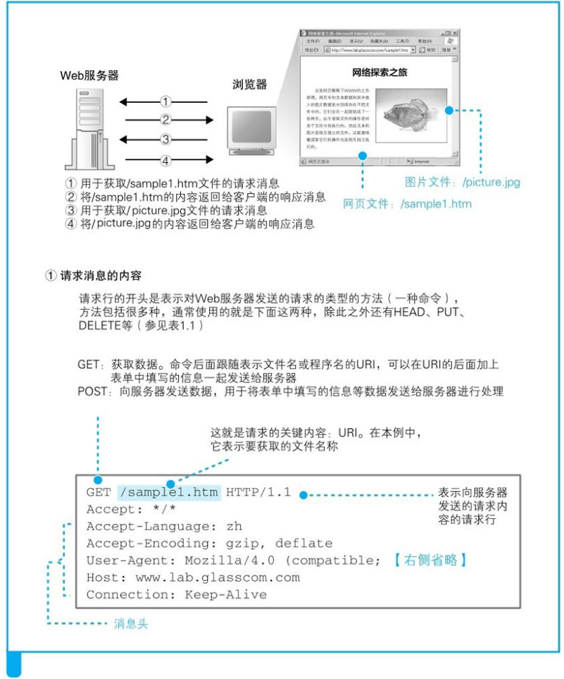

## 生成 HTTP 请求消息

#### 1.1 浏览器解析URL

浏览器要做的第一步工作就是对URL进行解析，从而生成发送给Web服务器的请求消息。

根据HTTP的规格，URL包含图1.2（a）中的这几种元素。当对URL进行解析时，首先需要按照图1.2（a）的格式将其中的各个元素拆分出来，例如图1.2（b）中的URL会拆分成图1.2（c）的样子。

​	图1.2

#### 1.2 省略文件名

`http://www.lab.glasscom.com/dir/`，这种后面的文件名被省略了。代表的是表示访问一个名叫“/”的目录。而且，由于省略了文件名，所以结果就是访问/index.html或者/default.htm这样的文件了。

`http://www.lab.glasscom.com`这次连结尾的“/”都省略了。像这样连目录名都省略时，真不知道到底在请求哪个文件了，实在有些过分。不过，这种写法也是允许的。当没有路径名时，就代表访问根目录下事先设置的默认文件[插图]，也就是/index. html或者/default.htm这些文件，这样就不会发生混乱了。

`http://www.lab.glasscom.com/whatisthis` 一般来说，这种情况会按照下面的惯例进行处理：如果Web服务器上存在名为whatisthis的文件，则将whatisthis作为文件名来处理；如果存在名为whatisthis的目录，则将whatisthis作为目录名来处理。

#### 1.3 HTTP 的基本思路

解析完URL之后，我们就知道应该要访问的目标在哪里了。接下来，浏览器会使用HTTP协议来访问Web服务器。

○：在该版本的规格中定义的项目。△：并非正式规格，而是在规格书附录（Appendix）中定义的附加功能。

上述1.0版本和1.1版本的描述分别基于RFC1945和RFC2616。

HTTP消息中还有一些用来表示附加信息的头字段。客户端向Web服务器发送数据时，会先发送头字段，然后再发送数据。

收到请求消息之后，Web服务器会对其中的内容进行解析，通过URI和方法来判断“对什么”“进行怎样的操作”，并根据这些要求来完成自己的工作，然后将结果存放在响应消息中。

在响应消息的开头有一个状态码，它用来表示操作的执行结果是成功还是发生了错误。当我们访问Web服务器时，遇到找不到的文件就会显示出404 Not Found的错误信息，其实这就是状态码。状态码后面就是头字段和网页数据。响应消息会被发送回客户端，客户端收到之后，浏览器会从消息中读出所需的数据并显示在屏幕上。到这里，HTTP的整个工作就完成了。

#### 1.4 生成HTTP请求消息

按照指定的规则来生成HTTP消息，如图1.5。首先，请求消息的第一行称为请求行。这里的重点是最开头的方法，方法可以告诉Web服务器它应该进行怎样的操作。我们需要判断用什么方法。

浏览器和Web服务器根据此格式来生成消息。准确来说，消息体的格式会通过消息头中的**Content-Type**字段来定义。如下图是一个get和post的请求消息体。

第一行的末尾需要写上HTTP的版本号，这是为了表示该消息是基于哪个版本的HTTP规格编写的。

第二行开始为消息头。尽管通过第一行我们就可以大致理解请求的内容，但**有些情况下还需要一些额外的详细信息，而消息头的功能就是用来存放这些信息**。消息头的规格中定义了很多项目，如日期、客户端支持的数据类型、语言、压缩格式、客户端和服务器的软件名称和版本、数据有效期和最后更新时间等。这些项目表示的都是非常细节的信息，因此要想准确理解这些信息的意思，就需要对HTTP协议有非常深入的了解。

○：在规格中定义的项目。△：并非正式规格，而是在规格书附录（Appendix）中定义的附加功能。

#### 1.5发送请求之后的响应

1条请求消息中只能写1个URI。如果需要获取多个文件，必须对每个文件单独发送1条请求。

消息示例

