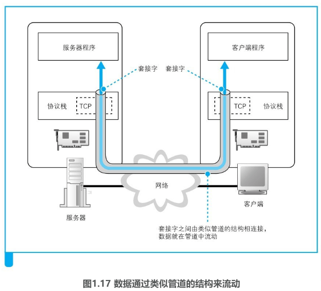
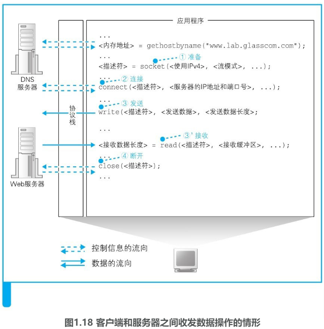

### 委托协议栈发送消息

#### 1 数据收发操作概览

知道了IP地址之后，就可以**委托操作系统内部的协议栈向这个目标IP地址**，也就是**我们要访问的Web服务器发送消息了**。

**要发送给Web服务器的HTTP消息是一种数字信息（digital data）**，因此也可以说是**委托协议栈来发送数字信息**。收发数字信息这一操作不仅限于浏览器，对于各种使用网络的应用程序来说都是共通的。因此，**这一操作的过程也不仅适用于Web，而是适用于任何网络应用程序**。下面就来一起探索这一操作的过程。

和向DNS服务器查询IP地址的操作一样，这里也需要使用Socket库中的程序组件。不过，**查询IP地址只需要调用一个程序组件就可以了，而这里需要按照指定的顺序调用多个程序组件**，这个过程有点复杂。发送数据是一系列操作相结合来实现的，如果不能理解这个操作的全貌，就无法理解其中每个操作的意义。因此，我们先来介绍一下收发数据操作的整体思路。

**向操作系统内部的协议栈发出委托时，需要按照指定的顺序来调用Socket库中的程序组件**。

使用Socket库来收发数据的操作过程如图1.17所示[插图]。简单来说，**收发数据的两台计算机之间连接了一条数据通道，数据沿着这条通道流动，最终到达目的地**。我们可以把数据通道想象成一条管道，将数据从一端送入管道，数据就会到达管道的另一端然后被取出。**数据可以从任何一端被送入管道，数据的流动是双向的**。

收发数据的整体思路就是这样，但还有一点也非常重要。光从图上来看，这条管道好像一开始就有，实际上并不是这样，**在进行收发数据操作之前，双方需要先建立起这条管道才行**。建立管道的关键在于管道两端的数据出入口，这些出入口称为**套接字**。**我们需要先创建套接字，然后再将套接字连接起来形成管道**。

首先，**服务器一方先创建套接字，然后等待客户端向该套接字连接管道**。**当服务器进入等待状态时，客户端就可以连接管道了**。具体来说，**客户端也会先创建一个套接字，然后从该套接字延伸出管道，最后管道连接到服务器端的套接字上**。当双方的套接字连接起来之后，通信准备就完成了。

我们再来看一看收发数据操作结束时的情形。**当数据全部发送完毕之后，连接的管道将会被断开**。**管道在连接时是由客户端发起的，但在断开时可以由客户端或服务器任意一方发起**。其中一方断开后，另一方也会随之断开，当管道断开后，套接字也会被删除。到此为止，通信操作就结束了。

综上所述，收发数据的操作分为若干个阶段，可以大致总结为以下4个。

（1）创建套接字（创建套接字阶段）

（2）将管道连接到服务器端的套接字上（连接阶段）

（3）收发数据（通信阶段）

（4）断开管道并删除套接字（断开阶段）

在每个阶段，Socket库中的程序组件都会被调用来执行相关的数据收发操作。不过，在探索其具体过程之前，我们来补充一点内容。前面这4个操作都是由操作系统中的协议栈来执行的，浏览器等应用程序并不会自己去做连接管道、放入数据这些工作，而是**委托协议栈来代劳**。

此外，**这些委托的操作都是通过调用Socket库中的程序组件来执行的，但这些数据通信用的程序组件其实仅仅充当了一个桥梁的角色，并不执行任何实质性的操作**，应用程序的委托内容**最终会被原原本本地传递给协议栈**。因此，我们无法形象地展示这些程序组件到底完成了怎样的工作，**与其勉强强调Socket库的存在，还不如将Socket库和协议栈看成一个整体**并讲解它们的整体行为让人更容易理解。

#### 2 创建套接字阶段 

下面我们就来探索一下应用程序（浏览器）委托收发数据的过程。这个过程的关键点就是像对DNS服务器发送查询一样，调用Socket库中的特定程序组件。访问DNS服务器时我们调用的是一个叫作gethostbyname的程序组件（也就是解析器），而这一次则需要按照一定的顺序调用若干个程序组件，其过程如图1.18所示。

**首先是套接字创建阶段**。客户端创建套接字的操作非常简单，**只要调用Socket库中的socket程序组件就可以了**（图1.18①）。和调用解析器一样，调用socket之后，控制流程会转移到socket内部并执行创建套接字的操作，完成之后控制流程又会被移交回应用程序。只不过，socket的内部操作并不像解析器那样简单。

**套接字创建完成后，协议栈会返回一个描述符**，应用程序会将收到的**描述符存放在内存中。**

**描述符是用来识别不同的套接字的**，大家可以作如下理解。我们现在只关注了浏览器访问Web服务器的过程，但**实际上计算机中会同时进行多个数据的通信操作**，比如可以打开两个浏览器窗口，同时访问两台Web服务器。这时，有两个数据收发操作在同时进行，也就需要创建两个不同的套接字。这个例子说明，**同一台计算机上可能同时存在多个套接字，在这样的情况下，我们就需要一种方法来识别出某个特定的套接字，这种方法就是描述符**。

**应用程序是通过“描述符”这一类似号码牌的东西来识别套接字的**。

#### 3 连接阶段 

接下来，我们需要委托协议栈将客户端创建的套接字与服务器那边的套接字连接起来。应用程序通过调用Socket库中的名为connect的程序组件来完成这一操作。这里的要点是当调用connect时，需要指定**描述符、服务器IP地址和端口号**这3个参数（图1.18②）。

第1个参数，即**描述符**，就是在创建套接字的时候由协议栈返回的那个描述符。connect会将应用程序指定的描述符告知协议栈，然后协议栈根据这个描述符来判断到底使用哪一个套接字去和服务器端的套接字进行连接，并执行连接的操作。

第2个参数，即**服务器IP地址**，就是通过DNS服务器查询得到的我们要访问的服务器的IP地址。

第3个参数，即**端口号**，**当同时指定IP地址和端口号时，就可以明确识别出某台具体的计算机上的某个具体的套接字**。

也许有人会说：“能不能用前面创建套接字时提到的那个描述符来识别套接字呢？”这种方法其实是行不通的，因为**描述符是和委托创建套接字的应用程序进行交互时使用的，并不是用来告诉网络连接的另一方的**，因此另一方并不知道这个描述符。同样地，客户端也无法知道服务器上的描述符。因此，客户端也无法通过服务器端的描述符去确定位于服务器上的某一个套接字。所以，我们需要另外一个对客户端也同样适用的机制，而这个机制就是端口号。

**如果说描述符是用来在一台计算机内部识别套接字的机制，那么端口号就是用来让通信的另一方能够识别出套接字的机制**。

既然需要通过端口号来确定连接对象的套接字，那么到底应该使用几号端口呢？网址中好像并没有端口号，也不能像IP地址一样去问DNS服务器。找了半天也没有任何线索，这可怎么办？其实，这件事情也并没有那么神奇，**服务器上所使用的端口号是根据应用的种类事先规定好的，仅此而已**。比如Web是80号端口，电子邮件是25号端口。

可能大家还有一个疑问，既然确定连接对象的套接字需要使用端口号，那么**服务器也得知道客户端的套接字号码才行吧，这个问题是怎么解决的呢**？事情是这样的，**首先，客户端在创建套接字时，协议栈会为这个套接字随便分配一个端口号**。接下来，**当协议栈执行连接操作时，会将这个随便分配的端口号通知给服务器**。

#### 4 通信阶段，传送消息 

当套接字连接起来之后，剩下的事情就简单了。**只要将数据送入套接字，数据就会被发送到对方的套接字中**。当然，**应用程序无法直接控制套接字，因此还是要通过Socket库委托协议栈来完成这个操作**。这个操作需要使用**write这个程序组件**，具体过程如下。

首先，应用程序需要在内存中准备好要发送的数据。根据用户输入的网址生成的HTTP请求消息就是我们要发送的数据。

接下来，当调用write时，需要指定描述符和发送数据（图1.18③），然后协议栈就会将数据发送到服务器。由于套接字中已经保存了已连接的通信对象的相关信息，所以只要通过描述符指定套接字，就可以识别出通信对象，并向其发送数据。

接着，发送数据会通过网络到达我们要访问的服务器。接下来，服务器执行接收操作，解析收到的数据内容并执行相应的操作，向客户端返回响应消息。

当消息返回后，需要执行的是接收消息的操作。接收消息的操作是通过**Socket库中的read程序组件**委托协议栈来完成的（图1.18③'）。调用read时需要指定用于存放接收到的响应消息的内存地址，这一内存地址称为**接收缓冲区**。

于是，当服务器返回响应消息时，read就会负责将接收到的响应消息存放到接收缓冲区中。由于接收缓冲区是一块位于应用程序内部的内存空间，因此当消息被存放到接收缓冲区中时，就相当于已经转交给了应用程序。

#### 5 断开阶段 

当浏览器收到数据之后，收发数据的过程就结束了。接下来，我们需要调用**Socket库的close程序组件进入断开阶段**。最终，连接在套接字之间的管道会被断开，套接字本身也会被删除。

断开的过程如下。

Web使用的HTTP协议规定，当Web服务器发送完响应消息之后，应该主动执行断开操作，因此**Web服务器会首先调用close来断开连接**。断开操作传达到客户端之后，客户端的套接字也会进入断开阶段。接下来，当浏览器调用read执行接收数据操作时，read会告知浏览器收发数据操作已结束，连接已经断开。浏览器得知后，也会调用close进入断开阶段。

这就是HTTP的工作过程。HTTP协议将HTML文档和图片都作为单独的对象来处理，每获取一次数据，就要执行一次连接、发送请求消息、接收响应消息、断开的过程。因此，如果一个网页中包含很多张图片，就必须重复进行很多次连接、收发数据、断开的操作。对于同一台服务器来说，重复连接和断开显然是效率很低的，因此后来人们又设计出了能够在一次连接中收发多个请求和响应的方法。在HTTP版本1.1中就可以使用这种方法，在这种情况下，当所有数据都请求完成后，浏览器会主动触发断开连接的操作。

本章我们探索了**浏览器与Web服务器之间收发消息的过程，但实际负责收发消息的是协议栈、网卡驱动和网卡，只有这3者相互配合，数据才能够在网络中流动起来**。

