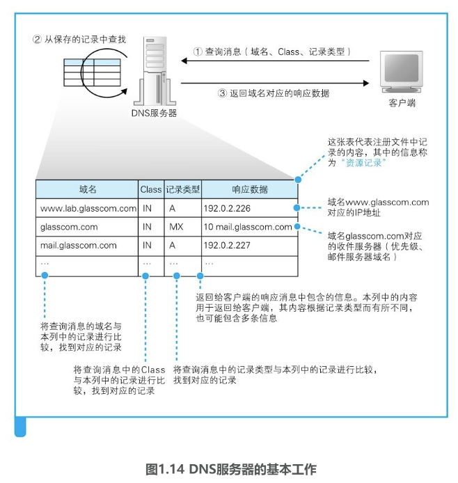
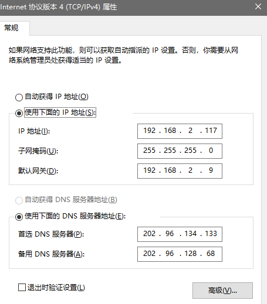
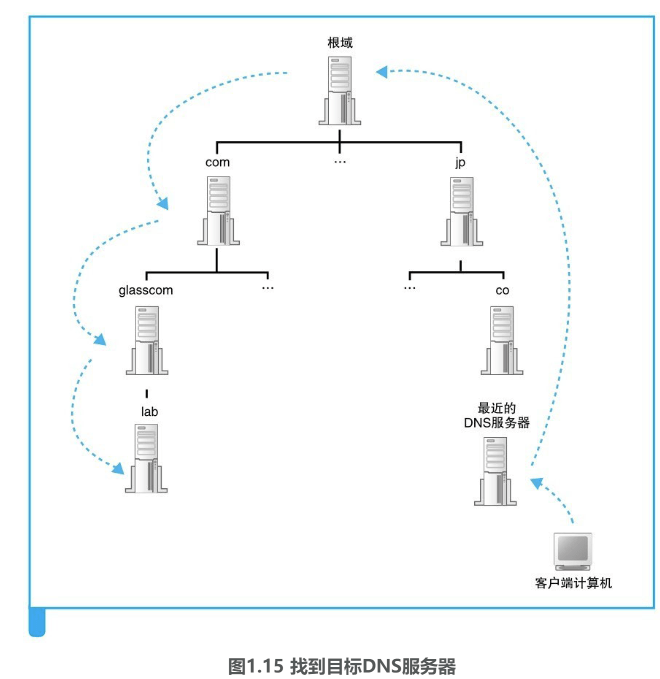
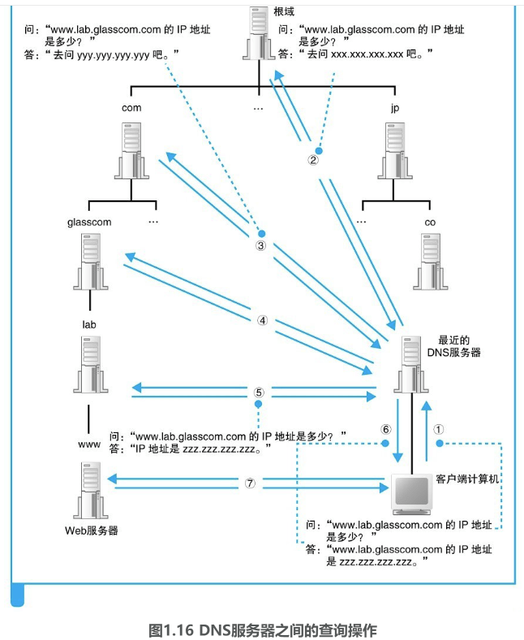
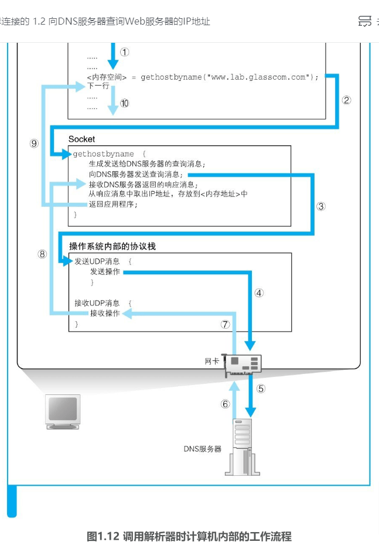

### DNS 服务器

#### 1 DNS服务器的基本工作

DNS服务器的基本工作就是**接收来自客户端的查询消息，然后根据消息的内容返回响应**。

其中，来自客户端的查询消息包含一下3中信息：

（1）域名：服务器、邮件服务器（邮件地址中@后面的部分）的名称

（2）class：在最早设计DNS方案时，DNS在互联网以外的其他网络中的应用也被考虑到了，而Class就是用来识别网络的信息。不过，如今除了互联网并没有其他的网络了，因此Class的值永远是代表互联网的IN。

（3）记录类型：**表示域名对应何种类型的记录**。例如，**当类型为A时，表示域名对应的是IP地址**；**当类型为MX时，表示域名对应的是邮件服务器**。对于不同的记录类型，服务器向客户端返回的信息也会不同。

**DNS服务器上事先保存有前面这3种信息对应的记录数据**，如图1.14所示。DNS服务器就是根据这些记录查找符合查询请求的内容并对客户端作出响应的。

以下是我本机局域网的DNS配置：

例如，如果要查询www.lab.glasscom.com这个域名对应的IP地址，客户端会向DNS服务器发送包含以下信息的查询消息：
（1）域名=www.lab.glasscom.com

（2）Class=IN

（3）记录类型=A

然后，DNS服务器会从已有的记录中查找域名、Class和记录类型全部匹配的记录。假如DNS服务器中的记录如图1.14所示，那么第一行记录与查询消息中的3个项目完全一致。于是，DNS服务器会将记录中的192.0.2.226这个值返回给客户端。

**在查询IP地址时我们使用A这个记录类型，而查询邮件服务器时则要使用MX类型**。**这是因为在DNS服务器上，IP地址是保存在A记录中的，而邮件服务器则是保存在MX记录中的**。

例如，对于一个邮件地址tone@glasscom.com，当需要知道这个地址对应的邮件服务器时，我们需要提供@后面的那一串名称。查询消息的内容如下：
（1）域名=glasscom.com

（2）Class=IN

（3）记录类型=MX

DNS服务器会返回10和mail.glasscom.com这两条信息。当记录类型为MX时，DNS服务器会在记录中保存两种信息，分别是邮件服务器的域名和优先级。此外，MX记录的返回消息还包括邮件服务器mail.glasscom.com的IP地址。上表的第三行就是mail.glasscom.com的IP地址，因此只要用mail.glasscom.com的域名就可以找到这条记录。在这个例子中，我们得到的IP地址是192.0.2.227。

综上所述，DNS服务器的基本工作就是根据需要查询的域名和记录类型查找相关的记录，并向客户端返回响应消息。

总结：

**DNS服务器会从域名与IP地址的对照表中查找相应的记录，并返回IP地址**。

前面只介绍了A和MX这两个记录类型，实际上还有很多其他的类型。例如**根据IP地址反查域名的PTR类型，查询域名相关别名的CNAME类型，查询DNS服务器IP地址的NS类型，以及查询域名属性信息的SOA类型等**。尽管DNS服务器的工作原理很简单，不过是根据查询消息中的域名和记录类型来进行查找并返回响应的信息而已，但通过组合使用不同的记录类型，就可以处理各种各样的信息。

此外，虽然图1.14展示的是表格形式，但实际上这些信息是保存在配置文件中的，表格中的一行信息被称为一条资源记录。

#### 2 域名的层次结构

在前面的讲解中，我们假设要查询的信息已经保存在DNS服务器内部的记录中了。**如果是在像公司内部网络这样Web和邮件服务器数量有限的环境中，所有的信息都可以保存在一台DNS服务器中**，**其工作方式也就完全符合我们前面讲解的内容**。然而，互联网中存在着不计其数的服务器，将这些服务器的信息全部保存在一台DNS服务器中是不可能的，因此**一定会出现在DNS服务器中找不到要查询的信息的情况**。下面来看一看此时DNS服务器是如何工作的

**就是将信息分布保存在多台DNS服务器中，这些DNS服务器相互接力配合，从而查找出要查询的信息**。不过，这个机制其实有点复杂，因此我们先来看一看**信息是如何在DNS服务器上注册并保存的**。

首先，DNS 服务器中的所有信息都是**按照域名以分层次的结构来保存的**。

DNS中的域名都是用句点来分隔的，比如www.lab.glasscom.com，这里的句点代表了不同层次之间的界限，就相当于公司里面的组织结构不用部、科之类的名称来划分，只是用句点来分隔而已。

**在域名中，越靠右的位置表示其层级越高**，比如www.lab.glasscom.com这个域名如果按照公司里的组织结构来说，大概就是“com事业集团glasscom部lab科的www”这样。其中，相当于一个层级的部分称为域。因此，com域的下一层是glasscom域，再下一层是lab域，再下面才是www这个名字。

**这种具有层次结构的域名信息会注册到DNS服务器中，而每个域都是作为一个整体来处理的**。换句话说就是，**一个域的信息是作为一个整体存放在DNS服务器中的，不能将一个域拆开来存放在多台DNS服务器中**。不过，DNS服务器和域之间的关系也并不总是一对一的，**一台DNS服务器中也可以存放多个域的信息**。为了避免把事情搞得太复杂，**这里先假设一台DNS服务器中只存放一个域的信息，后面的讲解也是基于这个前提来进行的**。于是，DNS服务器也具有了像域名一样的层次结构，每个域的信息都存放在相应层级的DNS服务器中。例如，这里有一个公司的域，那么就相应地有一台DNS服务器，其中存放了公司中所有Web服务器和邮件服务器的信息。

对于公司域来说，例如现在需要为每一个事业集团配备一台DNS服务器，分别管理各事业集团自己的信息，但我们之前也说过一个域是不可分割的，这该怎么办呢？没关系，我们可以在域的下面创建**下级域**，然后再将它们分别分配给各个事业集团。比如，假设公司的域为example.co.jp，我们可以在这个域的下面创建两个子域，即 sub1. example.co.jp 和sub2.example.co.jp，然后就可以将这两个下级域分配给不同的事业集团来使用。如果公司下级的组织不是事业部而是子公司，对于域来说也是没有区别的。因为域并不代表“事业集团”这一特定组织，无论是子公司还是什么别的组织名称，都可以分配相应的域。**实际上，互联网中的域也是一样，通过创建下级的域来分配给不同的国家、公司和组织使用**。

通过实际的域名可能更容易理解，比如www.nikkeibp.co.jp这个域名，最上层的jp代表分配给日本这个国家的域；下一层的co是日本国内进行分类的域，代表公司；再下层的nikkeibp就是分配给某个公司的域；最下层的www就是服务器的名称。

#### 3 寻找对应的 DNS 服务器并获取 IP 地址 

下面再来看一看如何找到DNS服务器中存放的信息。这里的**关键在于如何找到我们要访问的Web服务器的信息归哪一台DNS服务器管**。

互联网中有数万台DNS服务器，肯定不能一台一台挨个去找。我们可以采用下面的办法。首先，将负责管理下级域的DNS服务器的IP地址注册到它们的上级DNS服务器中，然后上级DNS服务器的IP地址再注册到更上一级的DNS服务器中，以此类推。也就是说，负责管理lab.glasscom.com这个域的DNS服务器的IP地址需要注册到glasscom.com域的DNS服务器中，而glasscom.com域的DNS服务器的IP地址又需要注册到com域的DNS服务器中。这样，我们就可以通过上级DNS服务器查询出下级DNS服务器的IP地址，也就可以向下级DNS服务器发送查询请求了。

在前面的讲解中，似乎com、jp这些域（称为顶级域）就是最顶层了，它们各自负责保存下级DNS服务器的信息，但实际上并非如此。在互联网中，com和jp的上面还有一级域，称为根域。根域不像com、jp那样有自己的名字，因此在一般书写域名时经常被省略，如果要明确表示根域，应该像www.lab.glasscom.com．这样在**域名的最后再加上一个句点，而这个最后的句点就代表根域**。

不过，一般都不写最后那个句点，因此根域的存在往往被忽略，但根域毕竟是真实存在的，根域的DNS服务器中保管着com、jp等的DNS服务器的信息。由于上级DNS服务器保管着所有下级DNS服务器的信息，所以我们可以从根域开始一路往下顺藤摸瓜找到任意一个域的DNS服务器。

除此之外还需要完成另一项工作，**那就是将根域的DNS服务器信息保存在互联网中所有的DNS服务器中**。这样一来，任何DNS服务器就都可以找到并访问根域DNS服务器了。因此，客户端只要能够找到任意一台DNS服务器，就可以通过它找到根域DNS服务器，然后再一路顺藤摸瓜找到位于下层的某台目标DNS服务器（图1.15）。分配给根域DNS服务器的IP地址在全世界仅有13个，而且这些地址几乎不发生变化，因此将这些地址保存在所有的DNS服务器中也并不是一件难事。实际上，根域DNS服务器的相关信息已经包含在DNS服务器程序的配置文件中了，因此只要安装了DNS服务器程序，这些信息也就被自动配置好了。

到这里所有的准备工作就都完成了。当我们配置一台DNS服务器时，必须要配置好上面这些信息，这样DNS服务器就能够从上万台DNS服务器中找到目标服务器。下面就来看一看这个过程是如何进行的。

如图1.16所示，客户端首先会访问最近的一台DNS服务器（也就是客户端的TCP/IP设置中填写的DNS服务器地址），假设我们要查询www.lab.glasscom.com这台Web服务器的相关信息（图1.16①）。由于最近的DNS服务器中没有存放www.lab.glasscom.com这一域名对应的信息，所以我们需要从顶层开始向下查找。最近的DNS服务器中保存了根域DNS服务器的信息，因此它会将来自客户端的查询消息转发给根域DNS服务器（图1.16②）。根域服务器中也没有www.lab.glasscom.com这个域名，但根据域名结构可以判断这个域名属于com域，因此根域DNS服务器会返回它所管理的com域中的DNS服务器的IP地址，意思是“虽然我不知道你要查的那个域名的地址，但你可以去com域问问看”。接下来，最近的DNS服务器又会向com域的DNS服务器发送查询消息（图1.16③）。com域中也没有www.lab.glasscom.com这个域名的信息，和刚才一样，com域服务器会返回它下面的glasscom.com域的DNS服务器的IP地址。以此类推，只要重复前面的步骤，就可以顺藤摸瓜找到目标DNS服务器（图1.16⑤），只要向目标DNS服务器发送查询消息，就能够得到我们需要的答案，也就是www.lab.glasscom.com的IP地址了。

收到客户端的查询消息之后，DNS服务器会按照前面的方法来查询IP地址，并返回给客户端（图1.16⑥）。这样，客户端就知道了Web服务器的IP地址，也就能够对其进行访问了（图1.16⑦）。

搞清楚了DNS服务器的工作方式之后，我们将图1.12和图1.16连起来看看。图1.16中的①和⑥分别相当于图1.12中的⑤和⑥，将这部分重合起来，就可以将这两张图连起来了。不过，在图1.12和图1.16中，客户端和DNS服务器的上下位置关系是颠倒着的，因此需要将其中一张图倒过来看。这样，我们就可以看清楚浏览器调用gethostbyname查询Web服务器地址的全貌，这也就是向DNS服务器查询IP地址的实际过程。

#### 4 通过缓存加快 DNS 服务器的响应 

图1.16展示的是基本原理，与真实互联网中的工作方式还是有一些区别的。**在真实的互联网中，一台DNS服务器可以管理多个域的信息，因此并不是像图1.16这样每个域都有一台自己的DNS服务器**。图中，每一个域旁边都写着一台DNS服务器，但现实中上级域和下级域有可能共享同一台DNS服务器。在这种情况下，访问上级DNS服务器时就可以向下跳过一级DNS服务器，直接返回再下一级DNS服务器的相关信息。

此外，有时候并不需要从最上级的根域开始查找，因为**DNS服务器有一个缓存功能，可以记住之前查询过的域名**。如果要查询的域名和相关信息已经在缓存中，那么就可以直接返回响应，接下来的查询可以从缓存的位置开始向下进行。相比每次都从根域找起来说，缓存可以减少查询所需的时间。

并且，当要查询的域名不存在时，“不存在”这一响应结果也会被缓存。这样，当下次查询这个不存在的域名时，也可以快速响应。

这个缓存机制中有一点需要注意，那就是信息被缓存后，原本的注册信息可能会发生改变，这时缓存中的信息就有可能是不正确的。因此，DNS服务器中保存的信息都设置有一个有效期，当缓存中的信息超过有效期后，数据就会从缓存中删除。而且，在对查询进行响应时，DNS服务器也会告知客户端这一响应的结果是来自缓存中还是来自负责管理该域名的DNS服务器。

