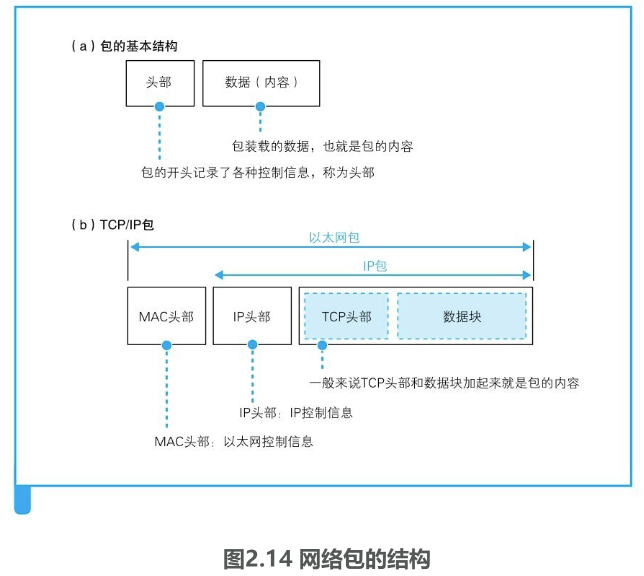
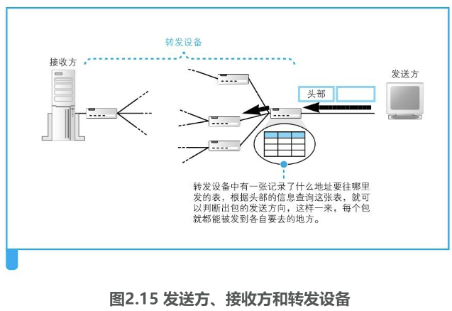
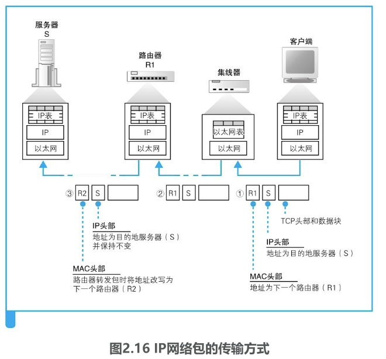

## IP与以太网的包收发操作

#### 包的基本知识

首先，包是由头部和数据两部分构成的（图2.14（a））。头部包含目的地址等控制信息，大家可以把它理解为快递包裹的面单；头部后面就是委托方要发送给对方的数据，也就相当于快递包裹里的货物。一个包发往目的地的过程如图2.15所示。

（1）**路由器根据目标地址判断下一个路由器的位置**

（2）**集线器在子网中将网络包传输到下一个路由**

实际上，集线器是按照以太网规则传输包的设备，而路由器是按照IP规则传输包的设备，因此我们也可以作如下理解。

（1）**IP协议根据目标地址判断下一个IP转发设备的位置**

（2）**子网中的以太网协议将包传输到下一个转发设备**

具体来说，如图2.14（b）所示，TCP/IP包包含如下两个头部。

（a）**MAC头部（用于以太网协议）**（b）**IP头部（用于IP协议）**

这两个头部分别具有不同的作用。首先，发送方将包的目的地，也就是要访问的服务器的IP地址写入IP头部中。这样一来，我们就知道这个包应该发往哪里，IP协议就可以根据这一地址查找包的传输方向，从而找到下一个路由器的位置，也就是图2.16中的路由器R1。接下来，IP协议会委托以太网协议将包传输过去。这时，IP协议会查找下一个路由器的以太网地址（MAC地址），并将这个地址写入MAC头部中。这样一来，以太网协议就知道要将这个包发到哪一个路由器上了。

网络包在传输过程中（图2.16①）会经过集线器，集线器是根据以太网协议工作的设备。为了判断包接下来应该向什么地方传输，**集线器里有一张表（用于以太网协议的表），可根据以太网头部中记录的目的地信息查出相应的传输方向**。这张图中只有一个集线器，当存在多个集线器时，网络包会按顺序逐一通过这些集线器进行传输。

接下来，**包会到达下一个路由器**（图2.16②）。**路由器中有一张IP协议的表，可根据这张表以及IP头部中记录的目的地信息查出接下来应该发往哪个路由器**。**为了将包发到下一个路由器，我们还需要查出下一个路由器的MAC地址，并记录到MAC头部中，大家可以理解为改写了MAC头部**。这样，**网络包就又被发往下一个节点了**。

再往后的过程图上就没有画出来了。网络包会通过路由器到达下一个路由器R2。这个过程不断重复，最终网络包就会被送到目的地，当目的地设备成功接收之后，网络包的传输过程就结束了。

前面**介绍的就是在TCP/IP网络中，一个网络包从出发到到达目的地的全过程**。虽然看起来有点复杂，不过设计这样的分工是有原因的。前面讲了IP和以太网的分工，**其中以太网的部分也可以替换成其他的东西，例如无线局域网、ADSL、FTTH等，它们都可以替代以太网的角色帮助IP协议来传输网络包**。因此，**将IP和负责传输的网络分开，可以更好地根据需要使用各种通信技术**。像互联网这样庞大复杂的网络，在架构上需要保证灵活性，这就是设计这种分工方式的原因。

#### 包收发操作概览