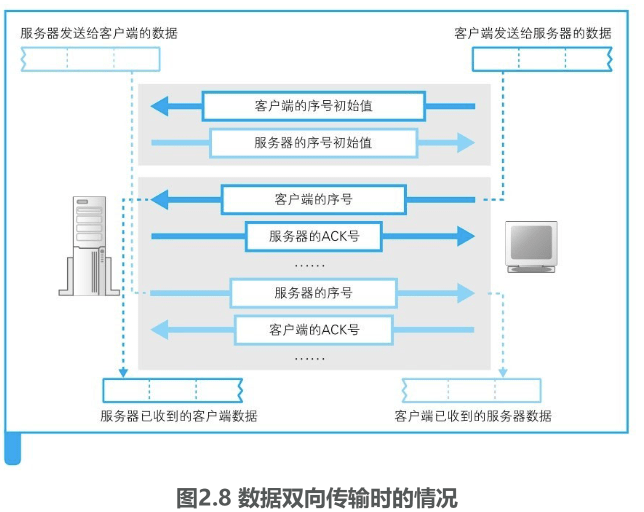
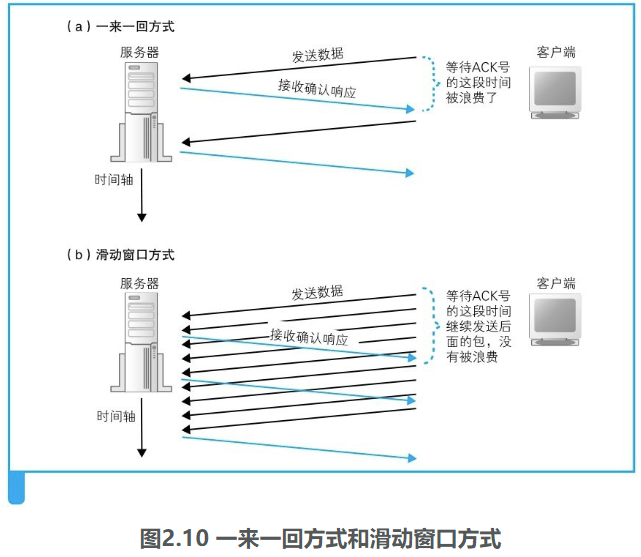

操作系统中的网络控制软件（协议栈）和网络硬件（网卡）是如何将浏览器的消息发送给服务器的？

### 创建套接字

#### 协议栈的内部结构

协议栈的内部如图2.1所示，分为几个部分，分别承担不同的功能。这张图中的上下关系是有一定规则的，上面的部分会向下面的部分委派工作，下面的部分接受委派的工作并实际执行

**上层会向下层逐层委派工作**。

应用程序的下面是Socket库，其中包括解析器，解析器用来向DNS服务器发出查询。

操作系统内部，其中包括协议栈。协议栈的上半部分有两块，**分别是负责用TCP协议收发数据的部分和负责用UDP协议收发数据的部分**，它们会接受应用程序的委托执行收发数据的操作。

像**浏览器、邮件等一般的应用程序都是使用TCP收发数据的，而像DNS查询等收发较短的控制数据的时候则使用UDP**。

下面一半是IP协议控制网络包收发操作的部分。**在互联网上传送数据时，数据会被切分成一个一个的网络包[插图]，而将网络包发送给通信对象的操作就是由IP来负责的**。此外，IP中还包括ICMP协议和ARP协议。**ICMP用于告知网络包传送过程中产生的错误以及各种控制消息，ARP用于根据IP地址查询相应的以太网MAC地址**。

IP下面的**网卡驱动程序负责控制网卡硬件**，而**最下面的网卡则负责完成实际的收发操作，也就是对网线中的信号执行发送和接收的操作**。

#### 套接字的实体就是通信控制信息

**在协议栈内部有一块用于存放控制信息的内存空间，这里记录了用于控制通信操作的控制信息，例如通信对象的IP地址、端口号、通信操作的进行状态等**。

**协议栈在执行操作时需要参阅这些控制信息**。例如，在发送数据时，需要看一看套接字中的通信对象IP地址和端口号，以便向指定的IP地址和端口发送数据。在发送数据之后，协议栈需要等待对方返回收到数据的响应信息，但数据也可能在中途丢失，永远也等不到对方的响应。在这样的情况下，我们不能一直等下去，需要在等待一定时间之后重新发送丢失的数据，这就需要协议栈能够知道执行发送数据操作后过了多长时间。为此，套接字中必须要记录是否已经收到响应，以及发送数据后经过了多长时间，才能根据这些信息按照需要执行重发操作。

**协议栈是根据套接字中记录的控制信息来工作的**。使用命令 `netstat -ano` 查看套接字

图2.2 显示套接字内容

#### 调用 socket 时的操作

看一看当浏览器调用socket、connect等Socket库中的程序组件时，协议栈内部是如何工作的。

首先，我们看一下浏览器通过 Socket 库向协议栈发出委托的一系列操作，图2.3。浏览器委托协议栈使用TCP协议来收发数据，因此下面的讲解都是关于TCP的。

首先是创建套接字的阶段。应用程序调用socket申请创建套接字，协议栈根据应用程序的申请执行创建套接字的操作，如图中1所示。在这个过程中，**协议栈首先会分配用于存放一个套接字所需的内存空间**。用于记录套接字控制信息的内存空间并不是一开始就存在的，因此我们先要开辟出这样一块空间来。

**套接字刚刚创建时，数据收发操作还没有开始，因此需要在套接字的内存空间中写入表示这一初始状态的控制信息**。到这里，创建套接字的操作就完成了。

​																			图2.3 消息收发操作

接下来，**需要将表示这个套接字的描述符告知应用程序**。描述符相当于用来区分协议栈中的多个套接字的号码牌。

收到描述符之后，应用程序在向协议栈进行收发数据委托时就需要提供这个描述符。由于套接字中记录了通信双方的信息以及通信处于怎样的状态，所以只要通过描述符确定了相应的套接字，协议栈就能够获取所有的相关信息，这样一来，应用程序就不需要每次都告诉协议栈应该和谁进行通信了。

### 连接服务器

#### 连接是什么意思

创建套接字之后，应用程序（浏览器）就会调用connect，随后协议栈会将本地的套接字与服务器的套接字进行连接。

网线是一直连接着的，随时都有信号从中流过，如果通信过程只是将数据转换为电信号，那么这一操作随时都可以进行。不过，在这个时间点，也就是套接字刚刚创建完成时，当应用程序委托发送数据的时候，协议栈会如何操作呢？

**套接字刚刚创建完成的时候，里面并没有存放任何数据，也不知道通信的对象是谁**。在这个状态下，**即便应用程序要求发送数据，协议栈也不知道数据应该发送给谁**。浏览器可以根据网址来查询服务器的IP地址，而且根据规则也知道应该使用80号端口，但只有浏览器知道这些必要的信息是不够的，因为在调用socket创建套接字时，这些信息并没有传递给协议栈。因此，我们**需要把服务器的IP地址和端口号等信息告知协议栈，这是连接操作的目的之一**。

服务器这边又是怎样呢？**服务器上也会创建套接字**，但**服务器上的协议栈和客户端一样，只创建套接字是不知道应该和谁进行通信的**。而且，和客户端不同的是，在服务器上，连应用程序也不知道通信对象是谁，这样下去永远也没法开始通信。于是，**我们需要让客户端向服务器告知必要的信息**，比如“我想和你开始通信，我的IP地址是xxx.xxx. xxx.xxx，端口号是yyyy。”可见，**客户端向服务器传达开始通信的请求，也是连接操作的目的之一**。

**连接实际上是通信双方交换控制信息**，在套接字中记录这些必要信息并准备数据收发的一连串操作，像上面提到的客户端将IP地址和端口号告知服务器这样的过程就属于交换控制信息的一个具体的例子。所谓控制信息，就是用来控制数据收发操作所需的一些信息，IP地址和端口号就是典型的例子。此外还有一其他的控制信息。

连接操作中所交换的控制信息是根据通信规则来确定的，只要根据规则执行连接操作，双方就可以得到必要的信息从而完成数据收发的准备。

此外，**当执行数据收发操作时，我们还需要一块用来临时存放要收发的数据的内存空间，这块内存空间称为缓冲区，它也是在连接操作的过程中分配的**。

#### 负责保存控制信息的头部

控制信息可以大体上分为两类。

**第一类是客户端和服务器相互联络时交换的控制信息**。**这些信息不仅连接时需要，包括数据收发和断开连接操作在内，整个通信过程中都需要，这些内容在TCP协议的规格中进行了定义**。具体来说，表2.1中的这些字段就是TCP规格中定义的控制信息。**这些字段是固定的，在连接、收发、断开等各个阶段中，每次客户端和服务器之间进行通信时，都需要提供这些控制信息**。

​											表2.1 TCP头部格式

具体来说，如图2.4（a）所示，**这些信息会被添加在客户端与服务器之间传递的网络包的开头**。在连接阶段，由于数据收发还没有开始，所以如图2.4（b）所示，网络包中没有实际的数据，只有控制信息。**这些控制信息位于网络包的开头，因此被称为头部**。此外，**以太网和IP协议也有自己的控制信息，这些信息也叫头部**，为了避免各种不同的头部发生混淆，我们一般会记作**TCP头部、以太网头部、IP头部**。

> 客户端和服务器在通信中会将必要的信息记录在头部并相互确认，例如下面这样。发送方：“开始数据发送。”接收方：“请继续。”发送方：“现在发送的是××号数据。”接收方：“××号数据已收到。”...

**第二类则是保存在套接字中，用来控制协议栈操作的信息**。

**应用程序传递来的信息以及从通信对象接收到的信息都会保存在这里，还有收发数据操作的执行状态等信息也会保存在这里，协议栈会根据这些信息来执行每一步的操作**。我们可以说，套接字的控制信息和协议栈的程序本身其实是一体的，因此，“协议栈具体需要哪些信息”会根据协议栈本身的实现方式不同而不同。

#### 连接操作的实际过程

这个过程是从应用程序调用Socket库的connect开始的`connect(<描述符>,<服务器IP地址和端口号>,...)`

上面的调用提供了服务器的IP地址和端口号，这些信息会传递给协议栈中的TCP模块。然后，TCP模块会与该IP地址对应的对象，也就是与服务器的TCP模块交换控制信息，这一交互过程包括下面几个步骤。

（1）首先，**客户端先创建一个包含表示开始数据收发操作的控制信息的头部**。如表2.1所示，头部包含很多字段，这里要**关注的重点是发送方和接收方的端口号**。到这里，客户端（发送方）的套接字就准确找到了服务器（接收方）的套接字，也就是搞清楚了我应该连接哪个套接字。

（2）然后，我们**将头部中的控制位的SYN比特设置为1，大家可以认为它表示连接**。

> **连接操作的第一步是在TCP模块处创建表示连接控制信息的头部**。
>
> **通过TCP头部中的发送方和接收方端口号可以找到要连接的套接字**。

**（3）当TCP头部创建好之后，接下来TCP模块会将信息传递给IP模块并委托它进行发送**。IP模块执行网络包发送操作后，网络包就会通过网络到达服务器，然后服务器上的IP模块会将接收到的数据传递给TCP模块，服务器的TCP模块根据TCP头部中的信息找到端口号对应的套接字，也就是说，**从处于等待连接状态的套接字中找到与TCP头部中记录的端口号相同的套接字就可以了**。

**当找到对应的套接字之后，套接字中会写入相应的信息，并将状态改为正在连接**。上述操作完成后，**服务器的TCP模块会返回响应，这个过程和客户端一样，需要在TCP头部中设置发送方和接收方端口号以及SYN比特（正常为1，如果由于某些原因不接受连接，那么将不设置SYN，而是将RST比特设置为1）**。

此外，**在返回响应时还需要将ACK控制位设为1（客户端向服务器发送第一个网络包时，由于服务器还没有接受过网络包，所以需要将ACK比特设为0）**,**这表示已经接收到相应的网络包**。网络中经常会发生错误，网络包也会发生丢失，因此**双方在通信时必须相互确认网络包是否已经送达**，而**设置ACK比特就是用来进行这一确认的**。

接下来，**服务器TCP模块会将TCP头部传递给IP模块，并委托IP模块向客户端返回响应**。

（4）然后，网络包就会返回到客户端，**通过IP模块到达TCP模块，并通过TCP头部的信息确认连接服务器的操作是否成功**。**如果SYN为1则表示连接成功，这时会向套接字中写入服务器的IP地址、端口号等信息，同时还会将状态改为连接完毕**。

（5）到这里，客户端的操作就已经完成，但其实还剩下最后一个步骤。刚才**服务器返回响应时将ACK比特设置为1，相应地，客户端也需要将ACK比特设置为1并发回服务器，告诉服务器刚才的响应包已经收到**。当这个服务器收到这个返回包之后，连接操作才算全部完成。

现在，套接字就可以进入随时可以收发数据的状态了。建立连接之后，协议栈的连接操作就结束了，也就是说connect已经执行完毕，控制流程被交回到应用程序。

### 收发数据

#### 将HTTP请求消息交给协议栈

当控制流程从connect回到应用程序之后，接下来就进入数据收发阶段了。数据收发操作是从应用程序调用write将要发送的数据交给协议栈开始的，协议栈收到数据后执行发送操作。

几个重要的点。

首先，**协议栈并不关心应用程序传来的数据是什么内容**。应用程序在调用write时会指定发送数据的长度，在协议栈看来，要发送的数据就是一定长度的二进制字节序列而已。

其次，**协议栈并不是一收到数据就马上发送出去，而是会将数据存放在内部的发送缓冲区中，并等待应用程序的下一段数据**。应用程序交给协议栈发送的数据长度是由应用程序本身来决定的，不同的应用程序在实现上有所不同，有些程序会一次性传递所有的数据，有些程序则会逐字节或者逐行传递数据。总之，一次将多少数据交给协议栈是由应用程序自行决定的，协议栈并不能控制这一行为。在这样的情况下，如果一收到数据就马上发送出去，就可能会发送大量的小包，导致网络效率下降，因此需要在数据积累到一定量时再发送出去。至于要积累多少数据才能发送，不同种类和版本的操作系统会有所不同，不能一概而论，但都是根据下面几个要素来判断的。

**第一个判断要素是每个网络包能容纳的数据长度**，协议栈会根据一个叫作MTU的参数来进行判断。MTU表示一个网络包的最大长度，在以太网中一般是1500字节（图2.5）。MTU是包含头部的总长度，因此需要从MTU减去头部的长度，然后得到的长度就是一个网络包中所能容纳的最大数据长度，这一长度叫作MSS。当从应用程序收到的数据长度超过或者接近MSS时再发送出去，就可以避免发送大量小包的问题了。

**另一个判断要素是时间**。当应用程序发送数据的频率不高的时候，如果每次都等到长度接近MSS时再发送，可能会因为等待时间太长而造成发送延迟，这种情况下，即便缓冲区中的数据长度没有达到MSS，也应该果断发送出去。为此，协议栈的内部有一个计时器，当经过一定时间之后，就会把网络包发送出去。

**如果长度优先，那么网络的效率会提高，但可能会因为等待填满缓冲区而产生延迟；相反地，如果时间优先，那么延迟时间会变少，但又会降低网络的效率**。在进行发送操作时需要综合考虑这两个要素以达到平衡。不过，TCP协议规格中并没有告诉我们怎样才能平衡，因此实际如何判断是由协议栈的开发者来决定的，也正是由于这个原因，不同种类和版本的操作系统在相关操作上也就存在差异。

**协议栈也给应用程序保留了控制发送时机的余地**。**应用程序在发送数据时可以指定一些选项，比如如果指定“不等待填满缓冲区直接发送”，则协议栈就会按照要求直接发送数据**。像浏览器这种会话型的应用程序在向服务器发送数据时，等待填满缓冲区导致延迟会产生很大影响，因此一般会使用直接发送的选项。

#### 对比较大的数据进行拆分

HTTP请求消息一般不会很长，一个网络包就能装得下，但如果其中要提交表单数据，长度就可能超过一个网络包所能容纳的数据量，比如在博客或者论坛上发表一篇长文就属于这种情况。

这种情况下，发送缓冲区中的数据就会超过MSS的长度，这时我们当然不需要继续等待后面的数据了。**发送缓冲区中的数据会被以MSS长度为单位进行拆分，拆分出来的每块数据会被放进单独的网络包中**。

根据发送缓冲区中的数据拆分的情况，当判断需要发送这些数据时，**就在每一块数据前面加上TCP头部，并根据套接字中记录的控制信息标记发送方和接收方的端口号，然后交给IP模块来执行发送数据的操作**。

应用程序的数据一般都比较大，因此TCP会按照网络包的大小对数据进行拆分。

#### 使用ACK号确认网络包已收到

到这里，**网络包已经装好数据并发往服务器了，但数据发送操作还没有结束**。TCP具备确认对方是否成功收到网络包，以及当对方没收到时进行重发的功能，因此在发送网络包之后，接下来还需要进行确认操作。

**确认的原理**，图2.7。

首先，**TCP模块在拆分数据时，会先算好每一块数据相当于从头开始的第几个字节，接下来在发送这一块数据时，将算好的字节数写在TCP头部中**，**“序号”字段就是派在这个用场上的**。然后，发送数据的长度也需要告知接收方，不过这个并不是放在TCP头部里面的，因为用整个网络包的长度减去头部的长度就可以得到数据的长度，所以接收方可以用这种方法来进行计算。有了上面两个数值，我们就可以知道发送的数据是从第几个字节开始，长度是多少了。

通过这些信息，**接收方还能够检查收到的网络包有没有遗漏**。例如，假设上次接收到第1460字节，那么接下来如果收到序号为1461的包，说明中间没有遗漏；但如果收到的包序号为2921，那就说明中间有包遗漏了。像这样，如果确认没有遗漏，接收方会将到目前为止接收到的数据长度加起来，计算出一共已经收到了多少个字节，然后将这个数值写入TCP头部的ACK号中发送给发送方。简单来说，发送方说的是“现在发送的是从第××字节开始的部分，一共有××字节哦！”而接收方则回复说，“到第××字节之前的数据我已经都收到了哦！”这个**返回ACK号的操作被称为确认响应，通过这样的方式，发送方就能够确认对方到底收到了多少数据**。

​																图2.7 序号和ACK号的用法

然而，图2.7的例子和实际情况还是有些出入的。**在实际的通信中，序号并不是从1开始的，而是需要用随机数计算出一个初始值，这是因为如果序号都从1开始，通信过程就会非常容易预测，有人会利用这一点来发动攻击**。但是如果初始值是随机的，那么对方就搞不清楚序号到底是从多少开始计算的，因此需要在开始收发数据之前将初始值告知通信对象。

大家应该还记得在我们刚才讲过的连接过程中，有一个将SYN控制位设为1并发送给服务器的操作，就是在这一步将序号的初始值告知对方的。**实际上，在将SYN设为1的同时，还需要同时设置序号字段的值，而这里的值就代表序号的初始值**。

前面介绍了**通过序号和ACK号来进行数据确认的思路，但仅凭这些还不够，因为我们刚刚只考虑了单向的数据传输，但TCP数据收发是双向的，在客户端向服务器发送数据的同时，服务器也会向客户端发送数据**，因此必须要想办法应对这样的情况。图2.7中展示的客户端向服务器发送数据的情形，我们只要增加一种左右相反的情形就可以了，如图2.8所示。

**首先客户端先计算出一个序号，然后将序号和数据一起发送给服务器，服务器收到之后会计算ACK号并返回给客户端**；相反地，**服务器也需要先计算出另一个序号，然后将序号和数据一起发送给客户端，客户端收到之后计算ACK号并返回给服务器**。此外，如图所示，**客户端和服务器双方都需要各自计算序号，因此双方需要在连接过程中互相告知自己计算的序号初始值**。

实际的工作过程（图2.9）。

首先，**客户端在连接时需要计算出与从客户端到服务器方向通信相关的序号初始值**，**并将这个值发送给服务器**（图2.9①）。接下来，**服务器会通过这个初始值计算出ACK号并返回给客户端**（图2.9②）。初始值有可能在通信过程中丢失，因此当服务器收到初始值后需要返回ACK号作为确认。同时，**服务器也需要计算出与从服务器到客户端方向通信相关的序号初始值，并将这个值发送给客户端**（图2.9②）。接下来像刚才一样，**客户端也需要根据服务器发来的初始值计算出ACK号并返回给服务器**（图2.9③）。

到这里，序号和ACK号都已经准备完成了，接下来就可以进入数据收发阶段了。**数据收发操作本身是可以双向同时进行的，但Web中是先由客户端向服务器发送请求，序号也会跟随数据一起发送**（图2.9④）。**然后，服务器收到数据后再返回ACK号**（图2.9⑤）。**从服务器向客户端发送数据的过程则正好相反**（图2.9⑥⑦）。

TCP采用这样的方式确认对方是否收到了数据，在得到对方确认之前，发送过的包都会保存在发送缓冲区中。如果对方没有返回某些包对应的ACK号，那么就重新发送这些包。

这一机制非常强大。**通过这一机制，我们可以确认接收方有没有收到某个包，如果没有收到则重新发送**，这样一来，无论网络中发生任何错误，我们都可以发现并采取补救措施（重传网络包）。反过来说，有了这一机制，我们就不需要在其他地方对错误进行补救了。

因此，网卡、集线器、路由器都没有错误补偿机制，一旦检测到错误就直接丢弃相应的包。应用程序也是一样，因为采用TCP传输，即便发生一些错误对方最终也能够收到正确的数据，所以应用程序只管自顾自地发送这些数据就好了。不过，如果发生网络中断、服务器宕机等问题，那么无论TCP怎样重传都不管用。这种情况下，无论如何尝试都是徒劳，因此TCP会在尝试几次重传无效之后强制结束通信，并向应用程序报错。

**通过“序号”和“ACK号”可以确认接收方是否收到了网络包**。

#### 根据网络包平均往返时间调整ACK号等待时间

前面说的只是一些基本原理，实际上网络的错误检测和补偿机制非常复杂。下面来说几个关键的点，首先是**返回ACK号的等待时间（这个等待时间也叫超时时间）**。

当网络传输繁忙时就会发生拥塞，ACK号的返回会变慢，这时我们就必须将等待时间设置得稍微长一点，否则可能会发生已经重传了包之后，前面的ACK号才姗姗来迟的情况。这样的重传是多余的，看上去只是多发一个包而已，但它造成的后果却没那么简单。**因为ACK号的返回变慢大多是由于网络拥塞引起的，因此如果此时再出现很多多余的重传，对于本来就很拥塞的网络来说无疑是雪上加霜**。那么等待时间是不是越长越好呢？也不是。如果等待时间过长，那么包的重传就会出现很大的延迟，也会导致网络速度变慢。

看来等待时间需要设为一个合适的值，不能太长也不能太短，但这谈何容易。根据服务器物理距离的远近，ACK号的返回时间也会产生很大的波动，而且我们还必须考虑到拥塞带来的影响。例如，在公司里的局域网环境下，几毫秒就可以返回ACK号，但在互联网环境中，当遇到拥塞时需要几百毫秒才能返回ACK号也并不稀奇。

正因为波动如此之大，所以将等待时间设置为一个固定值并不是一个好办法。因此，**TCP采用了动态调整等待时间的方法，这个等待时间是根据ACK号返回所需的时间来判断的**。具体来说，**TCP会在发送数据的过程中持续测量ACK号的返回时间，如果ACK号返回变慢，则相应延长等待时间；相对地，如果ACK号马上就能返回，则相应缩短等待时间**。

#### 使用窗口有效管理ACK号

如图2.10（a）所示，每发送一个包就等待一个ACK号的方式是最简单也最容易理解的，但在等待ACK号的这段时间中，如果什么都不做那实在太浪费了。为了减少这样的浪费，**TCP采用图2.10（b）这样的滑动窗口方式来管理数据发送和ACK号的操作**。**所谓滑动窗口，就是在发送一个包之后，不等待ACK号返回，而是直接发送后续的一系列包**。这样一来，**等待ACK号的这段时间就被有效利用起来了**。

虽然这样做能够减少等待ACK号时的时间浪费，但有一些问题需要注意。在一来一回方式中，接收方完成接收操作后返回ACK号，然后发送方收到ACK号之后才继续发送下一个包，因此不会出现发送的包太多接收方处理不过来的情况。但**如果不等返回ACK号就连续发送包，就有可能会出现发送包的频率超过接收方处理能力的情况**。

下面来具体解释一下。当接收方的TCP收到包后，会先将数据存放到接收缓冲区中。然后，接收方需要计算ACK号，将数据块组装起来还原成原本的数据并传递给应用程序，如果这些操作还没完成下一个包就到了也不用担心，因为下一个包也会被暂存在接收缓冲区中。**如果数据到达的速率比处理这些数据并传递给应用程序的速率还要快，那么接收缓冲区中的数据就会越堆越多，最后就会溢出**。缓冲区溢出之后，后面的数据就进不来了，因此接收方就收不到后面的包了，这就和中途出错的结果是一样的，也就意味着超出了接收方处理能力。我们可以通过下面的方法来避免这种情况的发生。**首先，接收方需要告诉发送方自己最多能接收多少数据，然后发送方根据这个值对数据发送操作进行控制，这就是滑动窗口方式的基本思路**。

关于滑动窗口的具体工作方式，还是看图更容易理解（图2.11）。在这张图中，**接收方将数据暂存到接收缓冲区中并执行接收操作**。**当接收操作完成后，接收缓冲区中的空间会被释放出来，也就可以接收更多的数据了，这时接收方会通过TCP头部中的窗口字段将自己能接收的数据量告知发送方**。这样一来，发送方就不会发送过多的数据，导致超出接收方的处理能力了。

此外，单从图上看，大家可能会以为接收方在等待接收缓冲区被填满之前似乎什么都没做，实际上并不是这样。这张图是为了讲解方便，故意体现一种接收方来不及处理收到的包，导致缓冲区被填满的情况。实际上，接收方在收到数据之后马上就会开始进行处理，如果接收方的性能高，处理速度比包的到达速率还快，缓冲区马上就会被清空，并通过窗口字段告知发送方。

还有，图2.11中只显示了从右往左发送数据的操作，实际上和序号、ACK号一样，发送操作也是双向进行的。前面提到的**能够接收的最大数据量称为窗口大小，它是TCP调优参数中非常有名的一个**。

​															图2.11 滑动窗口与接收缓冲区

#### ACK与窗口的合并

如果假定这两个参数是相互独立的，分别用两个单独的包来发送，结果会如何呢？

首先，什么时候需要更新窗口大小呢？当收到的数据刚刚开始填入缓冲区时，其实没必要每次都向发送方更新窗口大小，因为只要发送方在每次发送数据时减掉已发送的数据长度就可以自行计算出当前窗口的剩余长度。因此，更新窗口大小的时机应该是接收方从缓冲区中取出数据传递给应用程序的时候。这个操作是接收方应用程序发出请求时才会进行的，而发送方不知道什么时候会进行这样的操作，因此当接收方将数据传递给应用程序，导致接收缓冲区剩余容量增加时，就需要告知发送方，这就是更新窗口大小的时机。

那么ACK号又是什么情况呢？当接收方收到数据时，如果确认内容没有问题，就应该向发送方返回ACK号，因此我们可以认为收到数据之后马上就应该进行这一操作。

如果将前面两个因素结合起来看，首先，发送方的数据到达接收方，在接收操作完成之后就需要向发送方返回ACK号，而再经过一段时间[插图]，当数据传递给应用程序之后才需要更新窗口大小。但如果根据这样的设计来实现，每收到一个包，就需要向发送方分别发送ACK号和窗口更新这两个单独的包[插图]，这样一来，接收方发给发送方的包就太多了，导致网络效率下降。

因此，接收方在发送ACK号和窗口更新时，并不会马上把包发送出去，而是会等待一段时间，在这个过程中很有可能会出现其他的通知操作，这样就可以把两种通知合并在一个包里面发送了。举个例子，在等待发送ACK号的时候正好需要更新窗口，这时就可以把ACK号和窗口更新放在一个包里发送，从而减少包的数量。当需要连续发送多个ACK号时，也可以减少包的数量，这是因为ACK号表示的是已收到的数据量，也就是说，它是告诉发送方目前已接收的数据的最后位置在哪里，因此当需要连续发送ACK号时，只要发送最后一个ACK号就可以了，中间的可以全部省略。当需要连续发送多个窗口更新时也可以减少包的数量，因为连续发生窗口更新说明应用程序连续请求了数据，接收缓冲区的剩余空间连续增加。这种情况和ACK号一样，可以省略中间过程，只要发送最终的结果就可以了。

#### 接收HTTP响应消息

首先，浏览器在委托协议栈发送请求消息之后，会调用read程序（之前的图2.3④）来获取响应消息。

然后，控制流程会通过read转移到协议栈，然后协议栈会执行接下来的操作。和发送数据一样，接收数据也需要将数据暂存到接收缓冲区中，这里的操作过程如下。首先，协议栈尝试从接收缓冲区中取出数据并传递给应用程序，但这个时候请求消息刚刚发送出去，响应消息可能还没返回。响应消息的返回还需要等待一段时间，因此这时接收缓冲区中并没有数据，那么接收数据的操作也就无法继续。这时，协议栈会将应用程序的委托，也就是从接收缓冲区中取出数据并传递给应用程序的工作暂时挂起，等服务器返回的响应消息到达之后再继续执行接收操作。

​																					图2.3 

协议栈接收数据的具体操作过程已经在发送数据的部分讲解过了，因此这里我们就简单总结一下[插图]。

首先，协议栈会检查收到的数据块和TCP头部的内容，判断是否有数据丢失，如果没有问题则返回ACK号。

然后，协议栈将数据块暂存到接收缓冲区中，并将数据块按顺序连接起来还原出原始的数据，最后将数据交给应用程序。具体来说，协议栈会将接收到的数据复制到应用程序指定的内存地址中，然后将控制流程交回应用程序。将数据交给应用程序之后，协议栈还需要找到合适的时机向发送方发送窗口更新。

### 从服务器断开并删除套接字

#### 数据发送完毕后断开连接

毫无疑问，收发数据结束的时间点应该是应用程序判断所有数据都已经发送完毕的时候。这时，数据发送完毕的一方会发起断开过程，但不同的应用程序会选择不同的断开时机。**以Web为例，浏览器向Web服务器发送请求消息，Web服务器再返回响应消息，这时收发数据的过程就全部结束了，服务器一方会发起断开过程**。当然，可能也有一些程序是客户端发送完数据就结束了，不用等服务器响应，这时客户端会先发起断开过程。这一判断是应用程序作出的，协议栈在设计上允许任何一方先发起断开过程。

无论哪种情况，完成数据发送的一方会发起断开过程，这里我们以**服务器一方发起断开过程**为例来进行讲解。

首先，**服务器一方的应用程序会调用Socket库的close程序**。然后，**服务器的协议栈会生成包含断开信息的TCP头部，具体来说就是将控制位中的FIN比特设为1**。接下来，**协议栈会委托IP模块向客户端发送数据**（图2.12①）。同时，**服务器的套接字中也会记录下断开操作的相关信息**。

接下来轮到**客户端**了。**当收到服务器发来的FIN为1的TCP头部时，客户端的协议栈会将自己的套接字标记为进入断开操作状态**。然后，**为了告知服务器已收到FIN为1的包，客户端会向服务器返回一个ACK号**（图2.12②）。这些操作完成后，**协议栈就可以等待应用程序来取数据了**。

过了一会儿，应用程序就会调用read来读取数据[插图]。这时，协议栈不会向应用程序传递数据[插图]，而是会告知应用程序（浏览器）来自服务器的数据已经全部收到了。根据规则，服务器返回请求之后，Web通信操作就全部结束了，因此只要收到服务器返回的所有数据，客户端的操作也就随之结束了。因此，**客户端应用程序会调用close来结束数据收发操作**，这时**客户端的协议栈也会和服务器一样，生成一个FIN比特为1的TCP包，然后委托IP模块发送给服务器**（图2.12③）。**一段时间之后，服务器就会返回ACK号**（图2.12④）。到这里，客户端和服务器的通信就全部结束了。

#### 删除套接字

和服务器的通信结束之后，用来通信的套接字也就不会再使用了，这时我们就可以删除这个套接字了。不过，套接字并不会立即被删除，而是会等待一段时间之后再被删除。

等待这段时间是为了防止误操作，引发误操作的原因有很多，这里无法全部列举，下面来举一个最容易理解的例子。假设和图2.12的过程相反，客户端先发起断开，则断开的操作顺序如下。

（1）客户端发送FIN（2）服务器返回ACK号（3）服务器发送FIN（4）客户端返回ACK号

如果最后客户端返回的ACK号丢失了，结果会如何呢？这时，服务器没有接收到ACK号，可能会重发一次FIN。如果这时客户端的套接字已经删除了，会发生什么事呢？套接字被删除，那么套接字中保存的控制信息也就跟着消失了，套接字对应的端口号就会被释放出来。这时，如果别的应用程序要创建套接字，新套接字碰巧又被分配了同一个端口号[插图]，而服务器重发的FIN正好到达，会怎么样呢？本来这个FIN是要发给刚刚删除的那个套接字的，但新套接字具有相同的端口号，于是这个FIN就会错误地跑到新套接字里面，新套接字就开始执行断开操作了。之所以不马上删除套接字，就是为了防止这样的误操作。

至于具体等待多长时间，这和包重传的操作方式有关。网络包丢失之后会进行重传，这个操作通常要持续几分钟。如果重传了几分钟之后依然无效，则停止重传。在这段时间内，网络中可能存在重传的包，也就有可能发生前面讲到的这种误操作，因此需要等待到重传完全结束。协议中对于这个等待时间没有明确的规定，一般来说会等待几分钟之后再删除套接字。

#### 数据收发小结

数据收发操作的**第一步是创建套接字**。一般来说，服务器一方的应用程序在启动时就会创建好套接字并进入等待连接的状态。客户端则一般是在用户触发特定动作，需要访问服务器的时候创建套接字。在这个阶段，还没有开始传输网络包。

创建套接字之后，**客户端会向服务器发起连接操作**。

首先，**客户端会生成一个SYN为1的TCP包并发送给服务器**（图2.13①）。**这个TCP包的头部还包含了客户端向服务器发送数据时使用的初始序号，以及服务器向客户端发送数据时需要用到的窗口大小**。

**当这个包到达服务器之后，服务器会返回一个SYN为1的TCP包**（图2.13②）。和图2.13①一样，**这个包的头部中也包含了序号和窗口大小，此外还包含表示确认已收到包①的ACK号**。

**当这个包到达客户端时，客户端会向服务器返回一个包含表示确认的ACK号的TCP包**（图2.13③）。到这里，连接操作就完成了，双方进入数据收发阶段。

​															图2.13 TCP的整体流程

数据收发阶段的操作根据应用程序的不同而有一些差异，以Web为例，

**首先客户端会向服务器发送请求消息**。TCP会将请求消息切分成一定大小的块，并在每一块前面加上TCP头部，然后发送给服务器（图2.13④）。TCP头部中包含序号，它表示当前发送的是第几个字节的数据。

**当服务器收到数据时，会向客户端返回ACK号**（图2.13⑤）。在最初的阶段，服务器只是不断接收数据，随着数据收发的进行，数据不断传递给应用程序，接收缓冲区就会被逐步释放。这时，服务器需要将新的窗口大小告知客户端。

当服务器收到客户端的请求消息后，会向客户端返回响应消息，这个过程和刚才的过程正好相反（图2.13⑥⑦）。

服务器的响应消息发送完毕之后，数据收发操作就结束了，这时就会开始执行**断开操作**。以Web为例，

**服务器会先发起断开过程**。在这个过程中，**服务器先发送一个FIN为1的TCP包**（图2.13⑧），**然后客户端返回一个表示确认收到的ACK号**（图2.13⑨）。接下来，**双方还会交换一组方向相反的FIN为1的TCP包（图2.13⑩）和包含ACK号的TCP包（图2.13⑪）**。最后，**在等待一段时间后，套接字会被删除**。