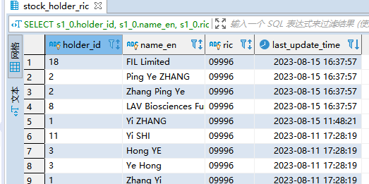
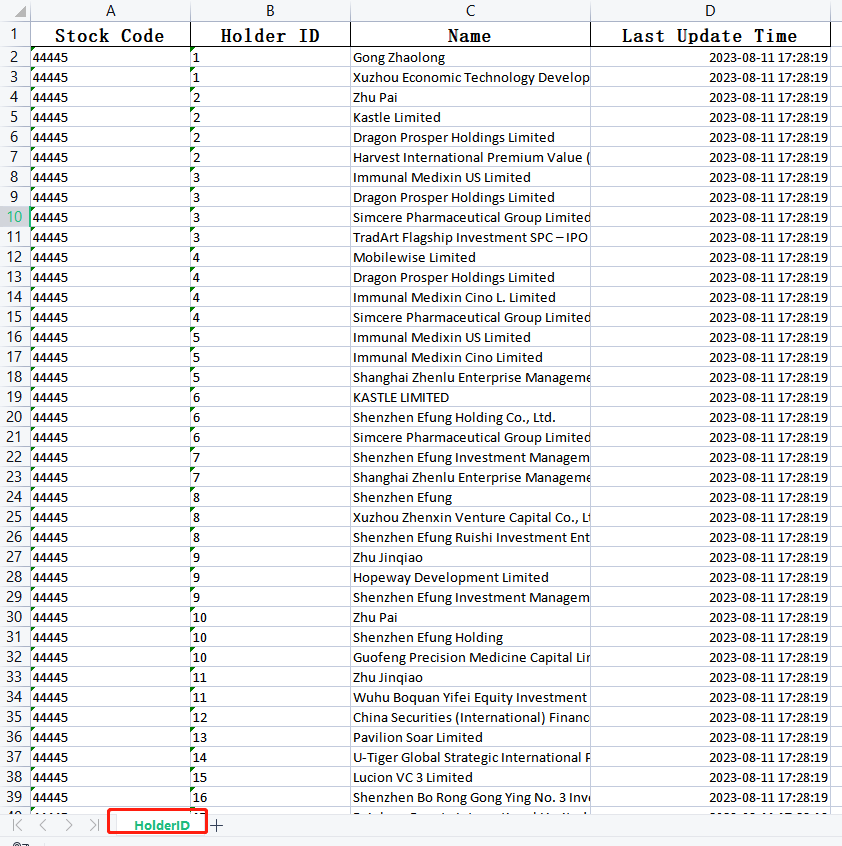

#### spring boot 导出excel文件

##### 后端数据



##### 最终导出的文件效果



#### 步骤

##### 前端

前端使用的是angularjs，其中需要使用到 `ngFileSaver` 服务，和 相对应的js文件。

js导入文件：

```javascript
<script type="text/javascript" src="./javascripts/jquery/jquery.min.js"></script>
    <!-- Bootstrap JS-->
    <script type="text/javascript" src="./javascripts/bootstrap.min.js"></script>

    <script type="text/javascript" src="./javascripts/blob/Blob.js"></script>
    <script type="text/javascript" src="./javascripts/fileSaver/FileSaver.min.js"></script>

    <!-- angular JS-->
    <script type="text/javascript" src="./javascripts/angular/angular.min.js"></script>
    <script type="text/javascript" src="./javascripts/angular/angular-cookies.min.js"></script>
    <script type="text/javascript" src="./javascripts/angular/angular-resource.min.js"></script>
    <script type="text/javascript" src="./javascripts/angular/angular-translate.min.js"></script>
    <script type="text/javascript" src="./javascripts/angular/angular-translate-loader-static-files.min.js"></script>
    <script type="text/javascript" src="./javascripts/angular/angular-translate-handler-log.min.js"></script>
    <script type="text/javascript" src="./javascripts/angular/angular-local-storage.min.js"></script>
    <script type="text/javascript" src="./javascripts/angular/angular-animate.min.js"></script>
    <script type="text/javascript" src="./javascripts/angular/angular-route.min.js"></script>
    <script type="text/javascript" src="./javascripts/angular/angular-ui-router.min.js"></script>
    <script type="text/javascript" src="./javascripts/angular/angular-file-saver.bundle.min.js"></script>
    <script type="text/javascript" src="./javascripts/angular/angular-file-saver.min.js"></script>
    <script type="text/javascript" src="./javascripts/ngDialog/ngDialog.min.js"></script>
    <script type="text/javascript" src="./javascripts/underscore-min.js"></script>
    <script type="text/javascript" src="./javascripts/moment/moment-with-locales-2.14.1.min.js"></script>
    <script type="text/javascript" src="./javascripts/reconnecting-websocket.min.js"></script>
    <script type="text/javascript" src="./javascripts/daterangepicker/daterangepicker.min.js"></script>
```

具体的js

```javascript

angular.module('backOffice.holderIdCheck', ['app.service', 'ngFileSaver']).controller('holderIdCheckCtrl', ['$scope', '$rootScope', '$window', '$sce', '$http', '$translate', '$location', 'localStorageService', 'httpService', '$timeout', '$compile', '$filter', '$stateParams', 'redirectService', 'ModalService', 'sharedProperties', 'SwalService', '$cookies', 'FileSaver', function ($scope, $rootScope, $window, $sce, $http, $translate, $location, localStorageService, httpService, $timeout, $compile, $filter, $stateParams, redirectService, ModalService, sharedProperties, SwalService, $cookies, FileSaver) {
$scope.exportData = function () {
    let stockCodes = [], holderIds = [], names = [];
    _.each($scope.stockCodeCondition, function (item) {
        stockCodes.push(item.key);
    });
    _.each($scope.holderIdCondition, function (item) {
        holderIds.push(item.key);
    });
    _.each($scope.nameCondition, function (item) {
        names.push(item.key);
    });

    let $postData = {
        'stockCodes': stockCodes,
        'holderIds': holderIds,
        'names': names,
        'page': {
            'sortFields': ['lastUpdateTime', 'id.ric', 'id.holderId'],
            'sortTypes': [SORT_DESC, SORT_ASC, SORT_ASC]
        },
    };

    $scope.showImportingIndicator = true;
    httpService.post({
        url: getAPIBaseURL() + '/stock/exportHolderIdCheck',
        data: $postData,
        overrideResponse: true,
        config: {
            responseType: 'blob'
        }
    }, function successCallBack(response) {
        // 主要逻辑
        let file = new Blob([response['data']], {
            type: response['data']['type']
        });
        let fileName = response.headers('fileName');
        FileSaver.saveAs(file, fileName);
        $timeout(function () {
            $scope.showImportingIndicator = false;
        }, 500);
    }, function failCallBack(errorCode) {
        $scope.showImportingIndicator = false;
    });
}
}]);

var post = function (param, successCallback, failCallback) {
        var url = param['url'];
        var overrideResponse = param['overrideResponse'] == undefined ? false : param['overrideResponse'];
        var $$scope = param['scope'], overrideErrorModal = (false === param['overrideErrorModal']);
        $http.post(url, param['data'], param['config'] || {}).then(function success(response) {
            if (overrideResponse) {
                successCallback && successCallback(response);
            } else {
                if (response['data']['returnCode'] == SESSIONEXPIREDWITHHASPOWERTOKEN) {
                    var absUrl = $location.absUrl();
                    var urlObject = parseURL(absUrl);
                    sharedProperties.setLastUrl(urlObject.source);
                    redirectService.goPowerIndex();
                } else if (response['data']['returnCode'] == SESSIONEXPIRED) {
                    $rootScope.$broadcast("SessionTimeout");
                    ModalService.open(getBaseURL() + '/nav/sessionTimeout.html', 'SESSIONEXPIRED');
                    failCallback && failCallback(response['data']['returnCode'], response);
                } else if (response['data']['returnCode'] == UNAUTHORIZEDOPERATION) {
                    $rootScope.$broadcast("UnauthorizedOperation");
                    ModalService.open(getBaseURL() + '/nav/unauthorizedOperationModal.html', 'UNAUTHORIZEDOPERATION');
                    failCallback && failCallback(response['data']['returnCode'], response);
                } else if (response['data']['returnCode'] == SUCCESS) {
                    successCallback && successCallback(response);
                } else {
                    var _showWarning = function () {
                        var modalScope = $$scope ? $$scope.$new() : $rootScope.$new();
                        modalScope['responseErrorCode'] = response['data']['returnCode'];
                        modalScope['responseErrorMsg'] = response['data']['returnMsg'];
                        ModalService.open(getBaseURL() + '/nav/warning.html', response['data']['returnCode'], modalScope);
                    }
                    if (!overrideErrorModal) {
                        _showWarning();
                    }
                    // return true to show warning.html
                    failCallback && failCallback(response['data']['returnCode'], response) && _showWarning();
                }
            }
        }, function fail(response) {
            console.log("Request fail. Status:" + response['status']);
            var _showWarning = function () {
                var modalScope = $$scope ? $$scope.$new() : $rootScope.$new();
                modalScope['responseErrorCode'] = FAIL;
                ModalService.open(getBaseURL() + '/nav/warning.html', FAIL, modalScope);
            }
            if (!overrideErrorModal) {
                _showWarning();
            }
            failCallback && failCallback(FAIL) && _showWarning();
        });
    }
```

##### 后端

使用jpa作为一个查询方式：

###### controller

```java
@PostMapping("/exportHolderIdCheck")
public void exportSearchFile(@RequestBody HolderIdCheckForm stockForm, HttpServletResponse servletResponse) {
   try {
      HolderIdCheckResponse res = holderIdCheckService.exportData(stockForm);
      List<HolderIdCheckingVo> resultList = res.getList();

      LocalDate localDate = LocalDate.now();
      DateTimeFormatter formatter = DateTimeFormatter.ofPattern("yyyyMMdd");
      String dateStr = localDate.format(formatter);
      String fileName = URLEncoder.encode("HolderID_" + dateStr + ".xlsx", StandardCharsets.UTF_8.displayName());

      servletResponse.setHeader(HttpHeaders.ACCEPT_RANGES, "bytes");
      servletResponse.setHeader(HttpHeaders.CONTENT_TYPE, "application/octet-stream;charset=UTF-8");
      servletResponse.setHeader(HttpHeaders.CONTENT_DISPOSITION, "attachment;filename=\"" + fileName + "\"");
      servletResponse.addHeader("fileName", URLEncoder.encode(fileName, StandardCharsets.UTF_8.displayName()));

      WriteSheet sheet = EasyExcel.writerSheet(0, "HolderID").build();
      ExcelWriter writer = EasyExcel.write(servletResponse.getOutputStream()).head(HolderIdCheckingVo.class).excelType(ExcelTypeEnum.XLSX).build();
      writer.write(resultList, sheet);
      writer.finish();
      servletResponse.setStatus(HttpStatus.OK.value());
      writer.close();
   } catch (IOException e) {
      servletResponse.setStatus(HttpStatus.INTERNAL_SERVER_ERROR.value());
      log.info("occur IO exception when exporting Holder ID Checking Data!");
   }
}
```

###### service

```java
// 接口
HolderIdCheckResponse exportData(HolderIdCheckForm conditionForm);
// 实现类
public HolderIdCheckResponse exportData(HolderIdCheckForm conditionForm) {
    HolderIdCheckResponse res = new HolderIdCheckResponse();
    Specification<StockHolderRicRec> specification = this.createSpecification(conditionForm);
    List<StockHolderRicRec> list = idCheckRepository.findAll(specification);
    for (StockHolderRicRec rec : list) {
        HolderIdCheckingVo vo = new HolderIdCheckingVo();
        vo.setHolderId(rec.getId().getHolderId());
        vo.setRic(rec.getId().getRic());
        vo.setNameEn(rec.getId().getNameEn());
        Timestamp lastUpdateTime = rec.getLastUpdateTime();
        vo.setLastUpdateTime(lastUpdateTime);
        vo.setLastUpdateTimeForExcel(lastUpdateTime);
        res.getList().add(vo);
    }
    res.setReturnCode(ErrorCode.Success);
    return res;
}
```

填充的Java类

```java
@Data
public class HolderIdCheckingVo {
    @ExcelProperty(value = "Stock Code", index = 0)
    @ColumnWidth(20)
    @HeadStyle(fillForegroundColor = 1) // 设置表头背景色为白色
    @HeadFontStyle(fontHeightInPoints = 14)
    private String ric;

    @ExcelProperty(value = "Holder ID", index = 1)
    @ColumnWidth(20)
    @HeadStyle(fillForegroundColor = 1)
    @HeadFontStyle(fontHeightInPoints = 14)
    private String holderId;

    @ExcelProperty(value = "Name", index = 2)
    @ColumnWidth(30)
    @HeadStyle(fillForegroundColor = 1)
    @HeadFontStyle(fontHeightInPoints = 14)
    private String nameEn;

    @ExcelIgnore
    @JsonFormat(pattern = "yyyy-MM-dd HH:mm:ss")
    private Date lastUpdateTime;

    @ExcelProperty(value = "Last Update Time", index = 3)
    @DateTimeFormat("yyyy-MM-dd HH:mm:ss")
    @ColumnWidth(30)
    @HeadStyle(fillForegroundColor = 1)
    @HeadFontStyle(fontHeightInPoints = 14)
    private Date lastUpdateTimeForExcel;
}
```

### 使用 easyexcel 导出文件

[集成 EasyExcel 3.x 优雅实现Excel导入导出](https://blog.csdn.net/qq991658923/article/details/128153012)

[【Excel】使用 SpringBoot 实现 Excel 文件的导入与导出](https://blog.csdn.net/sco5282/article/details/121303881)

##### 设置excel的样式

[导出Excel 自定义 表头颜色](https://blog.csdn.net/xydxiong/article/details/125918485EasyExcel)

[EasyExcel 样式注解大全](https://blog.csdn.net/qq_48922459/article/details/124032490)

[Java EasyExcel 设置表头及内容字体大小](https://blog.csdn.net/qq_41525524/article/details/124314250)


