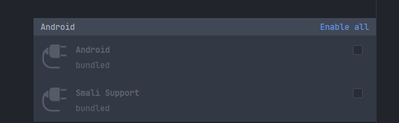
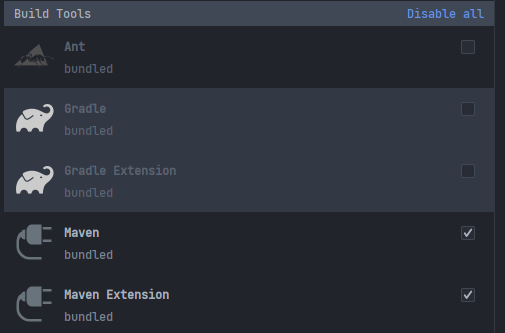
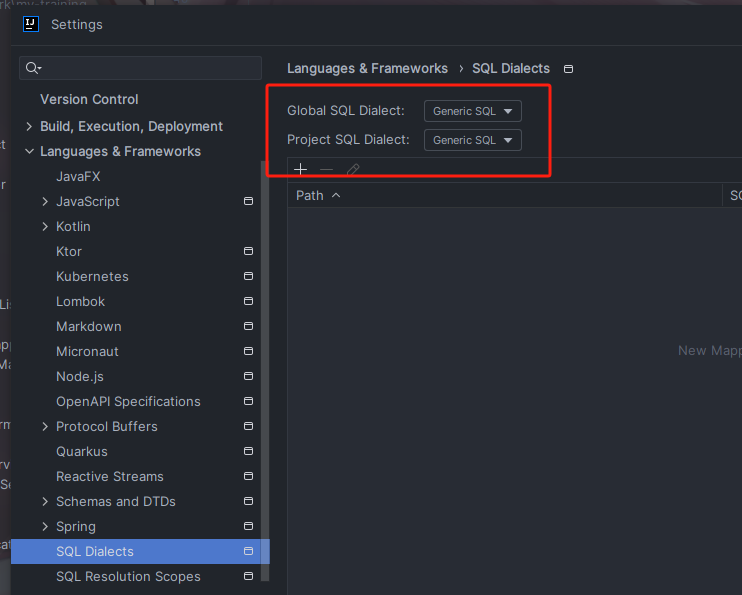
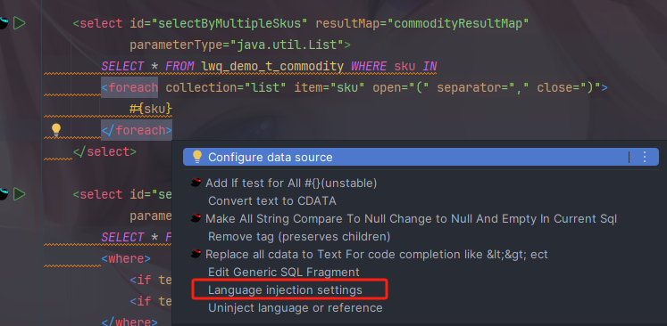
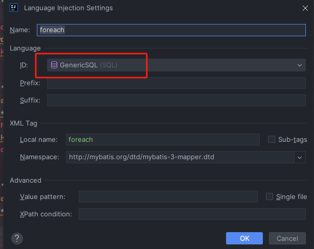

#### 使用Intellij idea鼠标放在某个方法或类上自动显示注释设置


#### idea2022.2.5 配置热部署

https://blog.csdn.net/gcglhd/article/details/110160903 

##### 1 添加maven依赖

```xml
<dependency>
   <groupId>org.springframework.boot</groupId>
   <artifactId>spring-boot-devtools</artifactId>
   <scope>true</scope>
   <optional>true</optional>
</dependency>
```

深层原理是使用了两个 ClassLoader，一个 Classloader 加载那些不会改变的类（第三方Jar 包），另一个 ClassLoader 加载会更改的类，称为 restart ClassLoader,这样在有代码更改的时候，原来的 restart ClassLoader 被丢弃，重新创建一个restart ClassLoader，由于需要加载的类相比较少，所以实现了较快的重启时间。

##### 2 idea 配置

（1）File-Settings-Compiler-Build Project automatically


##### 设置不需要热部署的文件和配置热部署

```properties
#spring.devtools.restart.exclude=application.properties
spring.devtools.restart.enabled=true
```

（2）ctrl + shift + alt + / ,选择 Registry,勾上 Compiler autoMake allow when app running，


idea 高版本修改到下面这个位置了。


##### 具体操作

- 第一种就是直接修改代码文件，会等待5秒左右自动的进行重新的编译运行。
- 第二种直接点击Ctrl + F9 会立即重启编译。

##### 设置spring boot热部署更新时间


#### 设置git的代理

```html
git config --global http.proxy http://代理地址:端口号

git config --global https.proxy https://代理地址:端口号
```

#### 取消设置代理

```html
git config --global --unset http.proxy

git config --global --unset https.proxy
```

#### 禁用其他插件

##### IDEA2023.1.3自带插件禁用，减少内存占用

[IDEA2023.1.3自带插件禁用，减少内存占用_idea哪些插件可以关闭-CSDN博客](https://blog.csdn.net/weixin_43165220/article/details/131534552)

##### 安卓开发



##### 构建工具

只保留了maven的



##### Code Coverage 代码覆盖率

java的代码覆盖率插件

具体的按需求取消或者使用插件。


#### idea mybatis xml 提示 ＜statement＞ or DELIMITER expected , got ‘id’

[idea mybatis xml 提示 ＜statement＞ or DELIMITER expected , got ‘id’_xml statement expected-CSDN博客](https://blog.csdn.net/zhh347713307/article/details/117926583)






foreach标签里面报红：



