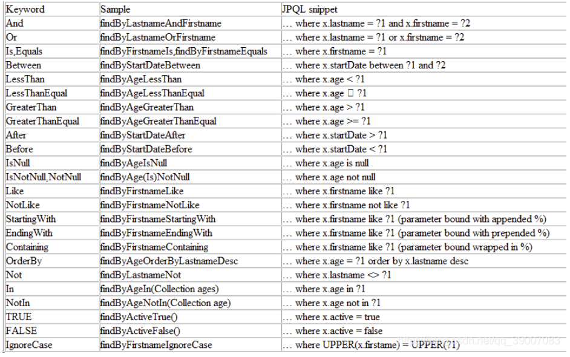

关键字： [Repository query keywords](https://docs.spring.io/spring-data/jpa/docs/current/reference/html/#appendix.query.method.predicate)  

#### 命名约定

1. 基于属性查询：
   - `findBy<属性名>`: 根据属性值查询单个实体对象。
   - `findAllBy<属性名>`: 根据属性值查询多个实体对象。
   - `deleteBy<属性名>`: 根据属性值删除实体对象。
2. 基于多个属性查询：
   - `findBy<属性名1>And<属性名2>`: 根据多个属性的值进行AND条件查询。
   - `findBy<属性名1>Or<属性名2>`: 根据多个属性的值进行OR条件查询。
3. 比较运算符查询：
   - `findBy<属性名>Is<比较运算符>`: 根据比较运算符进行查询，如`IsGreaterThan`、`IsLessThan`、`IsBetween`等。
4. 模糊查询：
   - `findBy<属性名>Like`: 根据属性值进行模糊查询。
5. 排序查询：
   - `findBy<属性名>OrderBy<属性名>Desc`: 根据属性进行降序排序查询。
6. 分页查询：
   - `findBy<属性名>(Pageable pageable)`: 根据属性进行分页查询。
7. 统计查询：
   - `countBy<属性名>`: 根据属性进行计数查询。

#### 开发踩坑记录之 An Errors/BindingResult argument is expected to be declared immediately after the model

https://blog.csdn.net/m0_49025634/article/details/124479542 

### 三种查询方式

##### 实体类

```java
@Entity
@Table(name = "report_ar")
public class ReportArRec {
    @EmbeddedId
    private ReportArId id;

    @Column(name = "ric")
    private String ric;

    @Column(name = "holder_id")
    private String holderId;

    @Column(name = "name_of_sub_shareholder_eng")
    private String nameOfSubShareholderEng;

    @Column(name = "name_of_sub_shareholder_chi")
    private String nameOfSubShareholderChi;
    ...
}
```

##### 复合主键

```java
@Data
@Embeddable
public class ReportArId implements Serializable {
    @Column(name = "serial_number")
    private Integer serialNumber;

    @Column(name = "stock_code")
    private String stockCode;

    @Column(name = "report_year")
    private Integer reportYear;

    @Column(name = "report_quarter")
    private String reportQuarter;
}
```

#### 1 通过命名方法实现sql查询

例如有一个 repository 接口，不想写 sql 的话可以通过定义方法来实现类似于sql的作用：

```java
@Repository
public interface ReportArRepository extends JpaRepository<ReportArRec, ReportArId>, JpaSpecificationExecutor<ReportArRec> {
    @Modifying
    @Transactional
    @Query("DELETE FROM ReportArRec r WHERE r.id.stockCode = :stockCode AND r.id.reportYear = :reportYear AND r.id.reportQuarter = :reportQuarter")
    int deleteByCodeAndYearAndQuarter(@Param("stockCode") String stockCode, @Param("reportYear") Integer reportYear, @Param("reportQuarter") String reportQuarter);

    List<ReportArRec> findByIdReportQuarterAndIdReportYear(String reportQuarter, int reportYear);

    List<ReportArRec> findByIdReportQuarterAndIdReportYearAndIdStockCode(String reportQuarter, int reportYear, String stockCode);
}
```

上面的代码中： `List<ReportArRec> findByIdReportQuarterAndIdReportYear(String reportQuarter, int reportYear);` 方法便是通过方法的命名实现查询，这个原理是框架会识别属性。

##### 官方文档：[Defining Query Methods](https://docs.spring.io/spring-data/jpa/docs/current/reference/html/#repositories.query-methods.details)  

#### 2 通过 @Query 实现查询

```java
@Repository
public interface ReportArRepository extends JpaRepository<ReportArRec, ReportArId>, JpaSpecificationExecutor<ReportArRec> {
    @Modifying
    @Transactional
    @Query("DELETE FROM ReportArRec r WHERE r.id.stockCode = :stockCode AND r.id.reportYear = :reportYear AND r.id.reportQuarter = :reportQuarter")
    int deleteByCodeAndYearAndQuarter(@Param("stockCode") String stockCode, @Param("reportYear") Integer reportYear, @Param("reportQuarter") String reportQuarter);
}
```

调用的时候

#### 3 通过 Specification 实现查询

这里我们调用的时候，`root` 是 `ReportArRec` 类，可以通过 `root.get("id").get("stockCode")` 获取主键中的属性，或者只获取 `ReportArRec` 的属性：`root.get("holderId")`。

```java
/**
* 根据不同的repository查询分页结果
* @param repository 具体的实体类repository
* @param stockForm 条件
* @return 查询的分页结果
* @param <T> 具体的实体类repository
*/
public <T> Page<T> queryPage(JpaSpecificationExecutor<T> repository, StockForm stockForm) {
    Pages pages = stockForm.getPage();
    Pageable pageable = PageRequest.of(pages.getCurrentPage() -  1, pages.getPageSize());
    return repository.findAll((Specification<T>) (root, query, cb) -> {
        List<Predicate> predicates = new ArrayList<>();

        if (!StringUtils.isEmpty(stockForm.getStockId())) {
            predicates.add(cb.like(root.get("id").get("stockCode").as(String.class), "%" + stockForm.getStockId() + "%"));
        }

        if (stockForm.getStockIds() != null && !stockForm.getStockIds().isEmpty()) {
            predicates.add(cb.in(root.get("id").get("stockCode").as(String.class).in(stockForm.getStockIds())));
        }

        if (stockForm.getYear() != null) {
            predicates.add(cb.equal(root.get("id").get("reportYear").as(Integer.class), stockForm.getYear()));
        }

        if (stockForm.getYears() != null && !stockForm.getYears().isEmpty()) {
 predicates.add(cb.in(root.get("id").get("reportYear").as(Integer.class).in(stockForm.getYears())));
        }

        if (!StringUtils.isEmpty(stockForm.getQuarter())) {
            predicates.add(cb.like(root.get("id").get("reportQuarter").as(String.class), "%" + stockForm.getQuarter() + "%"));
        }

        if (stockForm.getQuarters() != null && !stockForm.getQuarters().isEmpty()) {
  predicates.add(cb.in(root.get("id").get("stockCode").as(String.class).in(stockForm.getStockIds())));
        }
        Predicate[] p = new Predicate[predicates.size()];
        query.where(predicates.toArray(p));
        query.orderBy(cb.asc(root.get("id").get("stockCode")));
        return query.where(predicates.toArray(p)).getRestriction();
    }, pageable);
}
```

#### JPA 实现分页查询

```java
import com.etwealth.hsicms.req.Pages;
import org.springframework.data.domain.PageRequest;
import org.springframework.data.domain.Pageable;
import org.springframework.data.domain.Sort;

import java.util.ArrayList;
import java.util.List;

/**
 * @author Lan
 * @createTime 2023-06-07  10:11
 **/
public class PageUtils {

    
    private final static int SIZE = 20;
    private final static int PAGE = 0;

    /**
     * pages.getSortField() 是复合主键中的字段的话，则需要这样使用：如 {@link ReportArRec} 中有复合主键 {@link ReportArId}
     * 则当排序为 {@link ReportArId} 中的 stockCode 时，field = id.stockCode。
     * 如果不是复合主键则可以直接传递实体类的属性。如排序为 holderId 时， field = holderId。
     *
     * @param pages 分页数据
     * @return 分页对象
     */
    public static Pageable createPageRequest(Pages pages) {
        Sort sort;
        if (pages.getSortFields().isEmpty() && pages.getSortTypes().isEmpty()) {
            Sort.Direction direction = pages.getSortType().equals(Sort.Direction.DESC.name()) ? Sort.Direction.DESC : Sort.Direction.ASC;
            Sort.Order order = new Sort.Order(direction, pages.getSortField());
            sort = Sort.by(order);
        } else {
            List<Sort.Order> orders = new ArrayList<>();
            for (int i = 0; i < pages.getSortFields().size(); i++) {
                String sortType = pages.getSortTypes().get(i);
                String sortField = pages.getSortFields().get(i);
                Sort.Direction direction = sortType.equals(Sort.Direction.DESC.name()) ? Sort.Direction.DESC : Sort.Direction.ASC;
                Sort.Order order = new Sort.Order(direction, sortField);
                orders.add(order);
            }
            sort = Sort.by(orders);
        }

        return PageRequest.of(pages.getCurrentPage() <= 0 ? PAGE : pages.getCurrentPage() - 1,
                pages.getPageSize() <= 0 ? SIZE : pages.getPageSize(),
                sort);
    }
}
```

当使用pageutil构建复合主键中的字段排序时候会报错：No property stockCode of ReportRec。

[Spring data JPA: No property XXX found for type XXX](https://blog.csdn.net/weixin_44712778/article/details/115896555)  

我前端传递的参数是：

```json
{
    "stockId": "0000",
    "quarter": "Q1",
    "year": 2022,
    "annualReport": false,
    "sdiDatabase": false,
    "ipoAllocations": false,
    "cornerStoneInvestor": true,
    "page": {
        "currentPage": 1,
        "pageSize": 2,
        "sortField": "stockCode",
        "sortType": "ASC"
    }
}
```

根据 sortFiled  动态构建排序字段，但是 stockCode 是复合主键中的属性。上面的pageUtils直接使用会有问题。

使用方法：

```java
/**
* 根据不同的repository查询分页结果
* @param repository 具体的实体类repository
* @param stockForm 条件
* @return 查询的分页结果
* @param <T> 具体的实体类repository
*/
public <T> Page<T> queryPage(JpaSpecificationExecutor<T> repository, StockForm stockForm) {
    Pages pages = stockForm.getPage();
    Pageable pageable = PageRequest.of(pages.getCurrentPage() -  1, pages.getPageSize());
    return repository.findAll((Specification<T>) (root, query, cb) -> {
        List<Predicate> predicates = new ArrayList<>();

        if (!StringUtils.isEmpty(stockForm.getStockId())) {
            predicates.add(cb.like(root.get("id").get("stockCode").as(String.class), "%" + stockForm.getStockId() + "%"));
        }

        if (stockForm.getStockIds() != null && !stockForm.getStockIds().isEmpty()) {
            predicates.add(cb.in(root.get("id").get("stockCode").as(String.class).in(stockForm.getStockIds())));
        }

        if (stockForm.getYear() != null) {
            predicates.add(cb.equal(root.get("id").get("reportYear").as(Integer.class), stockForm.getYear()));
        }

        if (stockForm.getYears() != null && !stockForm.getYears().isEmpty()) {
            predicates.add(cb.in(root.get("id").get("reportYear").as(Integer.class).in(stockForm.getYears())));
        }

        if (!StringUtils.isEmpty(stockForm.getQuarter())) {
            predicates.add(cb.like(root.get("id").get("reportQuarter").as(String.class), "%" + stockForm.getQuarter() + "%"));
        }

        if (stockForm.getQuarters() != null && !stockForm.getQuarters().isEmpty()) {
            predicates.add(cb.in(root.get("id").get("stockCode").as(String.class).in(stockForm.getStockIds())));
        }
        Predicate[] p = new Predicate[predicates.size()];
        query.where(predicates.toArray(p));
        // ******* 这里使用 这样排序是没问题的。暂时是先这样解决
        query.orderBy(cb.asc(root.get("id").get("stockCode")));
        return query.where(predicates.toArray(p)).getRestriction();
    }, pageable);
}
```

repository：继承了接口 `JpaSpecificationExecutor` 会自动有上面的方法

```java
@Repository
public interface ReportArRepository extends JpaRepository<ReportArRec, ReportArId>, JpaSpecificationExecutor<ReportArRec> {

}
```

如果需要修改上面的问题则需要采用如下传递方式：

```java
/**
 * pages.getSortField() 是复合主键中的字段的话，则需要这样使用：如 {@link ReportArRec} 中有复合主键 {@link ReportArId}
 * 则当排序为 {@link ReportArId} 中的 stockCode 时，field = id.stockCode。
 * 如果不是复合主键则可以直接传递实体类的属性。如排序为 holderId 时， field = holderId。
 * @param pages 分页数据
 * @return 分页对象
 */
{
    "stockId": "0000",
    "quarter": "Q1",
    "year": 2022,
    "annualReport": false,
    "sdiDatabase": false,
    "ipoAllocations": false,
    "cornerStoneInvestor": true,
    "page": {
        "currentPage": 1,
        "pageSize": 5,
        // 需要修改这个值
        "sortField": "id.stockCode",
        "sortType": "DSC"
    }
}
```

### 批量条件操作

```java
public interface ReportArRepository extends JpaRepository<ReportArRec, ReportArId>, JpaSpecificationExecutor<ReportArRec> {
// 实现这个方法
@Override
List<ReportArRec> findAllById(Iterable<ReportArId> reportArIds);
}
```

##### 2 JPA 表达式

参考下面： 自定义查询方法。

##### 3 JPQL 方式

所谓JPQL就是在方法名上加个注解@Query，在注解里就可以自己写sql了。


如果只是查询的话，就只需要加@Query一个注解，然后@Query第一个参数value写上自己的sql，参数按需传，sql中的占位下标是参数顺序（从1开始），第二个参数nativeQuery值设为true即可。一个查询的JPQL就写完了。

如果你要增/删/改的话，还需要添加其他两个注解，即@Transactional，@Modifying，这两个注解不加会报错的。

### 多条件动态查询(更详细一点)

[https://blog.csdn.net/qq_39007083/article/details/106888268](https://blog.csdn.net/qq_39007083/article/details/106888268) 

#### 1 使用JPA接口

`JpaRepository`继承于`PagingAndSortingRepository`，所以它传递性地拥有了以上接口的所有方法，同时，它还继承了另外一个 `QueryByExampleExecutor` 接口。

```java
package org.springframework.data.jpa.repository;
 
import java.io.Serializable;
import java.util.List;
 
import javax.persistence.EntityManager;
 
import org.springframework.data.domain.Example;
import org.springframework.data.domain.Sort;
import org.springframework.data.repository.NoRepositoryBean;
import org.springframework.data.repository.PagingAndSortingRepository;
import org.springframework.data.repository.query.QueryByExampleExecutor;
 
@NoRepositoryBean
public interface JpaRepository<T, ID extends Serializable>
		extends PagingAndSortingRepository<T, ID>, QueryByExampleExecutor<T> {
 
	List<T> findAll(); // 查询所有实体
 
	List<T> findAll(Sort sort); // 查询所有实体并排序
 
	List<T> findAll(Iterable<ID> ids); // 根据ID集合查询实体
 
	<S extends T> List<S> save(Iterable<S> entities); // 保存并返回（修改后的）实体集合
 
	void flush(); // 提交事务
 
	<S extends T> S saveAndFlush(S entity); // 保存实体并立即提交事务
 
	void deleteInBatch(Iterable<T> entities); // 批量删除实体集合
 
	void deleteAllInBatch();// 批量删除所有实体
 
	T getOne(ID id); // 根据ID查询实体
 
	@Override
	<S extends T> List<S> findAll(Example<S> example); // 查询与指定Example匹配的所有实体
 
	@Override
	<S extends T> List<S> findAll(Example<S> example, Sort sort);// 查询与指定Example匹配的所有实体并排序
}
```

`QueryByExampleExecutor` 接口方法如下：

```java
package org.springframework.data.repository.query;
 
import org.springframework.data.domain.Example;
import org.springframework.data.domain.Page;
import org.springframework.data.domain.Pageable;
import org.springframework.data.domain.Sort;
 
public interface QueryByExampleExecutor<T> {
 
	<S extends T> S findOne(Example<S> example); // 查询与指定Example匹配的唯一实体
 
	<S extends T> Iterable<S> findAll(Example<S> example); // 查询与指定Example匹配的所有实体
 
	<S extends T> Iterable<S> findAll(Example<S> example, Sort sort); // 查询与指定Example匹配的所有实体并排序
 
	<S extends T> Page<S> findAll(Example<S> example, Pageable pageable);// 分页查询与指定Example匹配的所有实体
 
	<S extends T> long count(Example<S> example); // 查询与指定Example匹配的实体数量
 
	<S extends T> boolean exists(Example<S> example); // 判断与指定Example匹配的实体是否存在
}
```

以部门实体资源库接口DepartmentRepository为例，只需继承 CrudRepository 接口便会自动拥有基础的增删查改功能，无须编写一条SQL。

```java
@Repository
public interface DepartmentRepository extends CrudRepository<Department, Long> {
 
}
```

最方便是直接继承  JpaRepository，因为 JpaRepository 继承了  ListCrudRepository。

```java
@Repository
public interface ReportArRepository extends JpaRepository<ReportArRec, ReportArId>, JpaSpecificationExecutor<ReportArRec> {
    
}

public interface JpaRepository<T, ID> extends ListCrudRepository<T, ID>, ListPagingAndSortingRepository<T, ID>, QueryByExampleExecutor<T> {
    
}
```

#### 2 自定义查询方法

Spring Data JPA能够根据其方法名为其自动生成SQL，除了使用示例中的 find 关键字，还支持的关键字有：query、get、read、count、delete等。

关键字： [Repository query keywords](https://docs.spring.io/spring-data/jpa/docs/current/reference/html/#appendix.query.method.predicate) 



 另外，Spring Data JPA 还提供了对分页查询、自定义SQL、查询指定N条记录、联表查询等功能的支持，以员工实体资源库接口EmployeeRepository为例，功能代码示意如下。

```java
@Repository
public interface EmployeeRepository extends JpaRepository<Employee, Long> {
 
	/**
	 * 根据部门ID获取员工数量
	 */
	int countByDepartmentId(Long departmentId);
 
	/**
	 * 根据部门ID分页查询
	 */
	Page<Employee> queryByDepartmentId(Long departmentId, Pageable pageable);
 
	/**
	 * 根据员工ID升序查询前10条
	 */
	List<Employee> readTop10ByOrderById();
 
	/**
	 * 根据员工姓名取第一条记录
	 */
	Employee getFirstByName(String name, Sort sort);
 
	/**
	 * 联表查询
	 */
	@Query("select e.id as employeeId,e.name as employeeName,d.id as departmentId,d.name as departmentName from Employee e , Department d where e.id= ?1 and d.id= ?2")
	EmployeeDetail getEmployeeJoinDepartment(Long eid, Long did);
 
	/**
	 * 修改指定ID员工的姓名
	 */
	@Modifying
	@Transactional(timeout = 10)
	@Query("update Employee e set e.name = ?1 where e.id = ?2")
	int modifyEmployeeNameById(String name, Long id);
 
	/**
	 * 删除指定ID的员工
	 */
	@Transactional(timeout = 10)
	@Modifying
	@Query("delete from Employee where id = ?1")
	void deleteById(Long id);
}
```

#### 3 Specification 多条件动态查询

在使用Spring Data JPA的时候，只要我们的Repo层继承 `JpaSpecificationExecutor`接口就可以使用 `Specification` 进行多条件动态查询了，我们先看下`JpaSpecificationExecutor`接口：

```java
public interface JpaSpecificationExecutor<T> {
    T findOne(Specification<T> spec);
    List<T> findAll(Specification<T> spec);
    Page<T> findAll(Specification<T> spec, Pageable pageable);
    List<T> findAll(Specification<T> spec, Sort sort);
    long count(Specification<T> spec);
}
```

Specification 接口：

```java
public interface Specification<T> {
    Predicate toPredicate(Root<T> root, CriteriaQuery<?> query, CriteriaBuilder cb);
}
```

其中就一个方法，返回的是动态查询的数据结构。

```java
javax.persistence.criteria.Predicate toPredicate(javax.persistence.criteria.Root<T> root,
javax.persistence.criteria.CriteriaQuery<?> query,
javax.persistence.criteria.CriteriaBuilder cb);
```

Predicate类：一个简单或复杂的谓词类型，用来拼接条件。 

Criteria 查询是以元模型的概念为基础的，元模型是为具体持久化单元的受管实体定义的，这些实体可以是实体类，嵌入类或者映射的父类。

 Root接口：代表Criteria查询的根对象，能够提供查询用到的数据库字段。

 CriteriaQuery接口：代表一个specific的顶层查询对象，用来执行最后的操作，它包含着查询的各个部分，比如：select 、from、where、group by、order by等。注意：CriteriaQuery对象只对实体类型或嵌入式类型的Criteria查询起作用。 

CriteriaBuilder接口：表示具体的比较条件。

上面有例子：使用的是 predicate 数组，使用的是 add 拼接。

使用 and 拼接。

```java
public class TaskProjectSpecs {
    public static Specification<Task> where(Map params, String userId, List<String> taskIds) {
        //lambda表达式
        return (Root<Task> root, CriteriaQuery<?> query, CriteriaBuilder criteriaBuilder) -> {
            //开始
            Predicate finalConditions = criteriaBuilder.conjunction();
            
            //提取参数
            String taskFast = MapUtils.getString(params, "taskFast");

            //lile 和join 用法 join可跟,JoinType.LEFT等
            if (StringUtils.isNotBlank(taskFast)) {
                Predicate taskFastPre = criteriaBuilder.like(root.join("taskType",JoinType.LEFT).<String>get("id"), "%" + taskFast + "%");
                finalConditions = criteriaBuilder.and(finalConditions, taskFastPre);
            }
            //between用法
            if ((null != createBegin) && (null != createEnd)) {
                Predicate datePredicate = null;
                if (createBegin.after(createEnd)) {
                    datePredicate = criteriaBuilder.between(root.get("gmtCreate"), createEnd, createBegin);
                } else {
                    datePredicate = criteriaBuilder.between(root.get("gmtCreate"), createBegin, createEnd);
                }
                finalConditions = criteriaBuilder.and(finalConditions, datePredicate);
            }
            //equale
            if (null != emergency && 0 != emergency) {
                finalConditions = criteriaBuilder.and(finalConditions, criteriaBuilder.equal(root.get("emergencyLevel"), emergency));
            }
            //大于 不等于
            if (status != null) {
                finalConditions = criteriaBuilder.and(finalConditions, criteriaBuilder.greaterThan(root.get("startDate"), new Date()));
                finalConditions = criteriaBuilder.and(finalConditions, criteriaBuilder.notEqual(root.get("status"), 1));
                
            }
            // or 
            if (StringUtils.isNotBlank(keyword)) {
                finalConditions = criteriaBuilder.and(finalConditions, criteriaBuilder.or(
                        criteriaBuilder.like(root.get("taskName"), "%" + keyword + "%"),
                        criteriaBuilder.like(root.join("project").get("name"), "%" + keyword + "%"))
                );
            }
            //in
            if (taskIds.size() > 0) {
                CriteriaBuilder.In<Object> in = criteriaBuilder.in(root.get("id"));
                for (String id : taskIds) {
                    in.value(id);
                }
                finalConditions = criteriaBuilder.and(finalConditions, in);
            }
            return query.where(finalConditions).getRestriction();
        };
    }
}
```

#### 4 Query 语句查询

> https://blog.csdn.net/qq_22161527/article/details/84390418

```java
//更新 必有@Modifying，和使用hiberna一样，HQL语句的写法
@Transactional(rollbackFor = Exception.class)
@Modifying
@Query("update SysUserEntity  u set u.isDelete = ?2 ,u.gmtModified= ?3  where u.id = ?1 ")
int deleteIsUpdate(String id, int deleted, Date date);

//查询 
@Query("select u from SysUserEntity u where  u.id in ?1 and u.isDelete = 0 ")
Page<SysUserEntity> findAllUser(List<String> userIds, Pageable pageable);

//多表查询
 @Query(value = " select p  from DictionaryEntity p , DictionaryContentEntity w " +
            " Where w.ContentEntity.id = ?1 and p.id = w.DictionaryEntity.id and p.deleted = ?2 ORDER BY p.dictionary")
    List<WebsiteDictionaryEntity> webOnwDictionary(String id,int isDeleted);
   
```

#### 5 Query 语句加原生sql实现连表查询

```java
  @Query(value="select serve.* from service_serve serve " +
            "left join company_info_user cominfo on serve.company_info_user_id=cominfo.company_info_user_id" +
            " left  join user_company company on cominfo.company_info_user_id=company.company_info_user_id " +
            " left  join employee employeeen3_ on company.user_company_id=employeeen3_.user_company_id " +
            " left  join user userentity4_  on employeeen3_.user_id=userentity4_.user_id " +
            " where userentity4_.user_id=?1 and employeeen3_.activity_management_power=1" +
            " order by serve.gmt_create desc " +
            "limit ?2 , ?3 " ,nativeQuery = true)
    List<ServiceServeEntity> queryByCompany(String userId,int startPoint,int endPoint);
```

