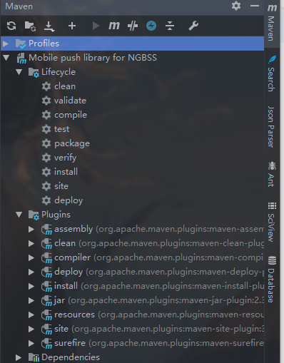

#### 1 idea 使用maven打jar包 

##### 一、打无依赖的jar包

1. pom.xml 文件中加入配置

```xml
<plugins>
    <plugin>
        <groupId>org.apache.maven.plugins</groupId>
        <artifactId>maven-compiler-plugin</artifactId>
        <version>3.1</version>
        <configuration>
            <encoding>ISO-8859-1</encoding>
            <source>${jdk.version}</source>
            <target>${jdk.version}</target>
        </configuration>
    </plugin>
 	<plugin>
      <groupId>org.apache.maven.plugins</groupId>
      <artifactId>maven-jar-plugin</artifactId>
      <version>2.4</version>
      <configuration>
        <archive>
              <!--生成的jar中，不要包含pom.xml和pom.properties这两个文件-->
          <addMavenDescriptor>false</addMavenDescriptor>
          <manifest>
                 <!--是否要把第三方jar放到manifest的classpath中-->
            <addClasspath>true</addClasspath>
                <!-- 生成的manifest中classpath的前缀，因为要把第三方jar放到lib目录下，所以classpath的前缀是lib/-->
            <classpathPrefix>lib/</classpathPrefix>
                 <!--应用的main class-->
            <mainClass>com.yourClass</mainClass>
          </manifest>
        </archive>
           <!-- 过滤掉不希望包含在jar中的文件 -->
        <excludes>
          <exclude>${project.basedir}/xml/*</exclude>
        </excludes>
         <!--指定最终生成的名字--> <finalName>${project.artifactId}-${project.version}-${maven.build.timestamp}</finalName>
     </configuration>
 </plugin> 
</plugins>

```

2. 点击maven管理工具


3. 运行完就会生成 jar 包


##### 二、打包含依赖的jar包

1. pom.xml 文件中添加配置

使用的是 `maven-assembly-plugin` 插件。

```xml

  <build>
     <plugins>
      <plugin>
        <groupId>org.apache.maven.plugins</groupId>
        <artifactId>maven-compiler-plugin</artifactId>
        <version>3.1</version>
      </plugin>
      <plugin>
        <artifactId>maven-assembly-plugin</artifactId>
        <configuration>
          <archive>
            <manifest>
              <mainClass>com.test.app</mainClass>
            </manifest>
          </archive>
          <descriptorRefs>
            <descriptorRef>jar-with-dependencies</descriptorRef>
          </descriptorRefs>
        </configuration>
        <!--下面是为了使用 mvn package命令，如果不加则使用mvn assembly-->
        <executions>
          <execution>
            <id>make-assemble</id>
            <phase>package</phase>
            <goals>
              <goal>single</goal>
            </goals>
          </execution>
        </executions>
      </plugin>
     </plugins>
  </build>

```

然后执行 maven 的package 命令。详细的可以参考： [博客](https://blog.csdn.net/branwel/article/details/79918018) 。执行完之后可以看到jar包，中间的就是打的包含依赖的。 


##### 三、方法二的扩展 

配置文件：[maven-assembly-plugin使用描述](https://www.cnblogs.com/f-zhao/p/6929814.html)  

```xml
<build>
        <extensions>
          <extension>
            <groupId>org.apache.maven.wagon</groupId>
            <artifactId>wagon-ssh</artifactId>
            <version>2.4</version>
          </extension>
        </extensions>
        <plugins>
            <plugin>
                <groupId>org.apache.maven.plugins</groupId>
                <artifactId>maven-compiler-plugin</artifactId>
                <version>3.1</version>
                <configuration>
                    <encoding>ISO-8859-1</encoding>
                    <source>${jdk.version}</source>
                    <target>${jdk.version}</target>
                </configuration>
            </plugin>
            <plugin>
                <groupId>org.apache.maven.plugins</groupId>
                <artifactId>maven-jar-plugin</artifactId>
                <version>2.3.2</version>
                <configuration>
                  <excludes>
                    <exclude>**/*.properties</exclude>
                    <exclude>**/*.p12</exclude>
                    <exclude>**/*.json</exclude>
                  </excludes>
                  <finalName>${project.artifactId}-${project.version}-${maven.build.timestamp}</finalName>
                </configuration>
            </plugin>
            <plugin>
                <artifactId>maven-assembly-plugin</artifactId>
                <configuration>
                    <!--<descriptorRefs>
                        <descriptorRef>jar-with-dependencies</descriptorRef>
                    </descriptorRefs>-->
                    <descriptors>
                        <descriptor>src/main/assembly/package.xml</descriptor>
                    </descriptors>
                </configuration>
                <!--下面是为了使用 mvn package命令，如果不加则使用mvn assembly-->
                <executions>
                    <execution>
                        <id>make-assemble</id>
                        <phase>package</phase>
                        <goals>
                            <goal>single</goal>
                        </goals>
                    </execution>
                </executions>
            </plugin>
        </plugins>
    </build>
```

新建一个 package.xml 文件放在 src\main 下面

```xml
<?xml version='1.0' encoding='UTF-8'?>
<assembly>
    <id>test</id>
    <formats>
        <format>jar</format>
    </formats>
    <includeBaseDirectory>false</includeBaseDirectory>

    <dependencySets>
        <dependencySet>
            <outputDirectory>/lib</outputDirectory>
            <useProjectArtifact>false</useProjectArtifact>
            <unpack>false</unpack>
        </dependencySet>
    </dependencySets>

    <fileSets>
        <fileSet>
            <directory>${project.build.directory}/classes</directory>
            <outputDirectory>/</outputDirectory>
            <excludes>
                <exclude>**/*.properties</exclude>
                <exclude>**/*.p12</exclude>
                <exclude>**/*.json</exclude>
            </excludes>
        </fileSet>
    </fileSets>
</assembly>

```

在使用 maven 工具打包，效果如下：lib 是依赖，配置文件没有打包进去。


另外的配置，解压jar包，并且不包含配置文件啥的。

maven 配置

```xml
<build>
    <extensions>
      <extension>
        <groupId>org.apache.maven.wagon</groupId>
        <artifactId>wagon-ssh</artifactId>
        <version>2.4</version>
      </extension>
    </extensions>
    <plugins>
        <plugin>
            <groupId>org.apache.maven.plugins</groupId>
            <artifactId>maven-compiler-plugin</artifactId>
            <version>3.1</version>
            <configuration>
                <encoding>ISO-8859-1</encoding>
                <source>${jdk.version}</source>
                <target>${jdk.version}</target>
            </configuration>
        </plugin>
        <!--<plugin>
            <groupId>org.apache.maven.plugins</groupId>
            <artifactId>maven-jar-plugin</artifactId>
            <version>2.3.2</version>
            <configuration>
              <excludes>
                <exclude>**/*.properties</exclude>
                <exclude>**/*.p12</exclude>
                <exclude>**/*.json</exclude>
              </excludes>
              <finalName>${project.artifactId}-${project.version}-${maven.build.timestamp}</finalName>
            </configuration>
        </plugin>-->
        <plugin>
            <artifactId>maven-assembly-plugin</artifactId>
            <configuration>
                <!--<descriptorRefs>
                    <descriptorRef>jar-with-dependencies</descriptorRef>
                </descriptorRefs>-->
                <descriptors>
                    <descriptor>src/main/assembly/package.xml</descriptor>
                </descriptors>
                <finalName>${project.artifactId}-${project.version}-${maven.build.timestamp}</finalName>
            </configuration>
            <!--下面是为了使用 mvn package命令，如果不加则使用mvn assembly-->
            <executions>
                <execution>
                    <id>make-assemble</id>
                    <phase>package</phase>
                    <goals>
                        <goal>single</goal>
                    </goals>
                </execution>
            </executions>
        </plugin>
    </plugins>
</build>
```

package.xml 配置

```xml
<?xml version='1.0' encoding='UTF-8'?>
<assembly>
    <id>test</id>
    <formats>
        <format>jar</format>
    </formats>
    <includeBaseDirectory>false</includeBaseDirectory>

    <dependencySets>
        <dependencySet>
            <outputDirectory>/</outputDirectory>
            <useProjectArtifact>false</useProjectArtifact>
            <unpack>true</unpack>
        </dependencySet>
    </dependencySets>

    <fileSets>
        <fileSet>
            <directory>${project.build.directory}/classes</directory>
            <outputDirectory>/</outputDirectory>
            <excludes>
                <exclude>**/*.properties</exclude>
                <exclude>**/*.p12</exclude>
                <exclude>**/*.json</exclude>
            </excludes>
        </fileSet>
    </fileSets>
</assembly>
```

打包完之后的效果：


有时需要排除一些新项目中已经存在的jar包，所以需要在这里排除一些jar包。


```xml
<?xml version='1.0' encoding='UTF-8'?>
<assembly>
    <id>test</id>
    <formats>
        <format>jar</format>
    </formats>
    <includeBaseDirectory>false</includeBaseDirectory>

    <dependencySets>
        <dependencySet>
            <outputDirectory>/</outputDirectory>
            <useProjectArtifact>false</useProjectArtifact>
            <unpack>true</unpack>
            <excludes>
                <!-- 排除一些要使用项目已经有的相关依赖-->
                <exclude>commons-beanutils:commons-beanutils</exclude>
                <exclude>commons-codec:commons-codec</exclude>
                <exclude>commons-collections:commons-collections</exclude>
                <exclude>commons-digester:commons-digester</exclude>
                <exclude>commons-lang:commons-lang</exclude>
                <exclude>commons-logging:commons-logging</exclude>
            </excludes>
        </dependencySet>
    </dependencySets>

    <fileSets>
        <fileSet>
            <directory>${project.build.directory}/classes</directory>
            <outputDirectory>/</outputDirectory>
            <excludes>
                <exclude>**/*.properties</exclude>
                <exclude>**/*.p12</exclude>
                <exclude>**/*.json</exclude>
            </excludes>
        </fileSet>
    </fileSets>
</assembly>

```


完整的 package.xml 文件：参考[博客](https://blog.csdn.net/branwel/article/details/79918018) 

```xml

<assembly>
  <id>bin</id>
  <!-- 最终打包成一个用于发布的zip文件 -->
  <formats>
      <format>zip</format>
  </formats>
  <!-- Adds dependencies to zip package under lib directory -->
  <dependencySets>
      <dependencySet>
          <!--
             不使用项目的artifact，第三方jar不要解压，打包进zip文件的lib目录
         -->
          <useProjectArtifact>false</useProjectArtifact>
          <outputDirectory>lib</outputDirectory>
          <unpack>false</unpack>
      </dependencySet>
  </dependencySets>

  <fileSets>
      <!-- 把项目相关的说明文件，打包进zip文件的根目录 -->
      <fileSet>
          <directory>${project.basedir}</directory>
          <outputDirectory>/</outputDirectory>
          <includes>
              <include>README*</include>
              <include>LICENSE*</include>
              <include>NOTICE*</include>
          </includes>
      </fileSet>

      <!-- 把项目的配置文件，打包进zip文件的config目录 -->
      <fileSet>
          <directory>${project.basedir}/src/main/config</directory>
          <outputDirectory>config</outputDirectory>
          <includes>
              <include>*.xml</include>
              <include>*.properties</include>
          </includes>
      </fileSet>

      <!-- 把项目的脚本文件目录（ src/main/scripts ）中的启动脚本文件，打包进zip文件的跟目录 -->
      <fileSet>
          <directory>${project.build.scriptSourceDirectory}</directory>
          <outputDirectory></outputDirectory>
          <includes>
              <include>startup.*</include>
          </includes>
      </fileSet>

      <!-- 把项目的脚本文件（除了启动脚本文件），打包进zip文件的script目录 -->
      <fileSet>
          <directory>${project.build.scriptSourceDirectory}</directory>
          <outputDirectory></outputDirectory>

          <excludes>
              <exclude>startup.*</exclude>
          </excludes>
      </fileSet>

      <!-- 把项目自己编译出来的jar文件，打包进zip文件的根目录 -->
      <fileSet>
          <directory>${project.build.directory}</directory>
          <outputDirectory></outputDirectory>
          <includes>
              <include>*.jar</include>
          </includes>
      </fileSet>
  </fileSets>
</assembly>

```


##### 另外的方法：使用 maven-shade-plugin 插件 

[maven-shade-plugin介绍及使用](https://blog.csdn.net/yangguosb/article/details/80619481) 

maven 中已经有了一些插件；



下面的配置是这个博客的 [链接](https://blog.csdn.net/u012369535/article/details/90546987) ，因为我也需要打包含依赖的jar包出来。

```xml

<build>
    <plugins>
      <plugin>
        <groupId>org.scala-tools</groupId>
        <artifactId>maven-scala-plugin</artifactId>
        <version>2.15.2</version>
        <executions>
          <execution>
            <goals>
              <goal>compile</goal>
              <goal>testCompile</goal>
            </goals>
          </execution>
        </executions>
      </plugin>

      <plugin>
        <artifactId>maven-compiler-plugin</artifactId>
        <version>3.6.0</version>
        <configuration>
          <source>1.8</source>
          <target>1.8</target>
        </configuration>
      </plugin>
        <!--这里就是上面方法里的了-->
      <plugin>
        <groupId>org.apache.maven.plugins</groupId>
        <artifactId>maven-assembly-plugin</artifactId>
        <version>2.3</version>
        <configuration>
          <descriptorRefs>
            <descriptorRef>jar-with-dependencies</descriptorRef>
          </descriptorRefs>
        </configuration>
      </plugin>

      <plugin>
        <groupId>org.apache.maven.plugins</groupId>
        <artifactId>maven-surefire-plugin</artifactId>
        <version>2.19</version>
        <configuration>
          <skip>true</skip>
        </configuration>
      </plugin>

      <plugin>
         <groupId>org.apache.maven.plugins</groupId>
         <artifactId>maven-shade-plugin</artifactId>
         <version>2.4.3</version>
         <executions>
              <execution>
                <phase>package</phase>
                <goals>
                  <goal>shade</goal>
                </goals>
                <configuration>
                  <filters>
                    <filter>
                      <artifact>*:*</artifact>
                      <excludes>
                        <exclude>META-INF/*.SF</exclude>
                        <exclude>META-INF/*.DSA</exclude>
                        <exclude>META-INF/*.RSA</exclude>
                      </excludes>
                    </filter>
                  </filters>
                  <transformers>
                    <transformer implementation="org.apache.maven.plugins.shade.resource.ManifestResourceTransformer">
                      <mainClass></mainClass>
                    </transformer>
                  </transformers>
                </configuration>
              </execution>
            </executions>
          </plugin>
    </plugins>
    <defaultGoal>compile</defaultGoal>
  </build>

```

添加后等待Maven加载完，再次点击package，不一会儿Maven就打包完成，会打成两个jar包，一个是有包含依赖jar包的，一个是没有依赖jar包的。


#### 2 maven 的一些插件

##### maven-shade-plugin 插件 

[maven-shade-plugin介绍及使用](https://blog.csdn.net/yangguosb/article/details/80619481)  

#### 3 maven 打包 jar，scope 的范围 


**compile**：默认值，适用于所有阶段（**开发、测试、部署、运行**），本jar会一直存在所有阶段。
**provided**：**只在开发、测试阶段使用，目的是不让Servlet容器和你本地仓库的jar包冲突 ，告诉maven这个jar包未来在我的服务器中有，不需要将它打包在工程中**；实际项目打包的时候，lib文件夹里面maven导入的provided包（jar包）都没有。对于编译，测试的classpath都有效，但对于运行无效。因为由容器已经提供，例如servlet-api。
**runtime**：**只在运行时使用**，如JDBC驱动，适用运行和测试阶段。
**test**：**只在测试时使用，用于编译和运行测试代码**。不会随项目发布。
**system**：（类似provided，需要显式提供包含依赖的jar，Maven不会在Repository中查找它）系统范围，与provided类似，只是标记为该scope的依赖包需要明确指定基于文件系统的jar包路径。因为需要通过systemPath指定本地jar文件路径，所以该scope是不推荐的。如果是基于组织的，一般会建立本地镜像，会把本地的或组织的基础组件加入本地镜像管理，避过使用该scope的情况。


#### 4 maven 的六大属性 

##### 内置属性

主要有两个常用内置属性：`${basedir}`项目的根目录(包含pom.xml文件的目录)，`${version}`项目版本。

##### pom 属性

用户可以使用该属性引用POM文件中对应元素的值，常用的POM属性包括：

`${project.build.sourceDirectory}`：项目的主源码目录，默认为 src/main/java.

`${project.build.testSourceDirectory}`：项目的测试源码目录，默认为 src/test/java。

`${project.build.directory}`：项目构件输出目录，默认为 target/。

`${project.outputDirectory}`：项目主代码编译输出目录，默认为 target/classes/。

`${project.testOutputDirectory}`：项目测试代码编译输出目录，默认为 target/test-classes/。

`${project.groupId}`：项目的 groupId。

`${project.artifactId}`：项目的 artifactId。

`${project.version}`：项目的 version，与${version}等价。

`${project.build.fianlName}`：项目打包输出文件的名称。默认为`${project.artifactId}-${project.version}`

##### 自定义属性

用户可以在POM的`<properties>`元素下自定义Maven属性。

```xml
<properties>
    <project.build.sourceEncoding>UTF-8</project.build.sourceEncoding>
    <spring.version>4.3.4.RELEASE</spring.version>
    <scala.version>2.11.8</scala.version>
    <play2.plugin.version>1.0.0-rc3</play2.plugin.version>
    <play2.version>2.6.3</play2.version>
</properties>
```

##### setting 属性 

用户使用`settings.`开头的属性引用 settings.xml 文件中XML元素的值。

##### Java系统属性

所有Java系统属性都可以使用Maven属性引用。

##### 环境变量属性

所有环境变量都可以使用以env.开头的Maven属性引用。

###### 在依赖中 使用pom变量

```xml
<dependencies>
    <dependency>
        <groupId>${project.groupId}</groupId>
        <artifactId>part-a</artifactId>
        <version>${project.version}</version>
    </dependency>
    <dependency>
        <groupId>${project.groupId}</groupId>
        <artifactId>part-b</artifactId>
        <version>${project-version}</version>
    </dependency>
</dependencies>
```

###### 在插件中使用pom变量

```xml
<plugin>
    <groupId>org.apache.maven.plugins</groupId>
    <artifactId>maven-surefire-plugin</artifactId>
    <version>2.5</version>
    <configuration>
        <repositoryDirectory>${project.build.directory}/test-reports</repositoryDirectory>
    </configuration>
</plugin>
```

#### 5 maven 配置中指定仓库 

```xml
<repositories>
    <repository>
        <id>1_etwgitrepo</id>
        <name>etw-git-repo</name>
        <url>https://gitlab.ettrade.com.hk/maven/</url>
        <snapshots>
            <enabled>true</enabled>
            <updatePolicy>always</updatePolicy>
        </snapshots>
    </repository>
    <repository>
        <id>2_etwmavenrepo</id>
        <name>etw-maven-repo</name>
        <url>http://202.130.86.228/maven/</url>
        <layout>default</layout>
    </repository>
    <repository>
        <id>3_central</id>
        <name>Central</name>
        <url>https://repo.maven.apache.org/maven2/</url>
        <layout>default</layout>
    </repository>
</repositories>
```

#### 6 maven 配置 resource 和插件

```xml
<build>
    <sourceDirectory>${project.basedir}/src/main/java</sourceDirectory>
    <resources>
        <resource>
            <directory>${project.basedir}/app</directory>
        </resource>
        <resource>
            <directory>${project.basedir}/src/main/resources</directory>
        </resource>
        <resource>
            <directory>${project.basedir}/conf</directory>
        </resource>
        <resource>
            <directory>${project.basedir}/public</directory>
            <targetPath>public</targetPath>
        </resource>
    </resources>
    <plugins>
        <plugin>
            <groupId>com.google.code.sbt-compiler-maven-plugin</groupId>
            <artifactId>sbt-compiler-maven-plugin</artifactId>
            <version>1.0.0</version>
        </plugin>      
        <plugin>
            <groupId>com.google.code.play2-maven-plugin</groupId>
            <artifactId>play2-maven-plugin</artifactId>
            <version>${play2.plugin.version}</version>
            <extensions>true</extensions>
            <configuration>
                <devSettings>
                    play.server.http.port=9000
                </devSettings>
            </configuration>
        </plugin>            
        <plugin>
            <groupId>org.codehaus.mojo</groupId>
            <artifactId>build-helper-maven-plugin</artifactId>
            <version>1.8</version>
            <executions>
                <execution>
                    <id>add-source</id>
                    <phase>generate-sources</phase>
                    <goals>
                        <goal>add-source</goal>
                    </goals>
                    <configuration>
                        <sources>
                            <!--<source>${project.basedir}/module</source>-->
                            <source>${project.basedir}/app</source>
                        </sources>
                    </configuration>
                </execution>
            </executions>
        </plugin>
        <plugin>
            <groupId>org.apache.maven.plugins</groupId>
            <artifactId>maven-compiler-plugin</artifactId>
            <version>3.3</version>
            <configuration>
                <source>${java.version}</source>
                <target>${java.version}</target>
            </configuration>
        </plugin>
        <plugin>
            <groupId>org.apache.maven.plugins</groupId>
            <artifactId>maven-jar-plugin</artifactId>
            <version>3.0.2</version>
        </plugin>
        <plugin>
            <groupId>org.apache.maven.plugins</groupId>
            <artifactId>maven-resources-plugin</artifactId>
            <version>3.0.2</version>
        </plugin>
        <plugin>
            <groupId>org.apache.maven.plugins</groupId>
            <artifactId>maven-surefire-plugin</artifactId>
            <version>2.9</version>
        </plugin>          
        <plugin>
            <groupId>org.apache.maven.plugins</groupId>
            <artifactId>maven-install-plugin</artifactId>
            <version>2.5.1</version>
        </plugin>
        <plugin>
            <groupId>org.apache.maven.plugins</groupId>
            <artifactId>maven-deploy-plugin</artifactId>
            <version>2.8.2</version>
        </plugin>
        <plugin>
            <artifactId>maven-clean-plugin</artifactId>
            <version>2.4.1</version>
            <executions>
                <execution>
                    <id>auto-clean</id>
                    <phase>initialize</phase>
                    <goals>
                        <goal>clean</goal>
                    </goals>
                </execution>
            </executions>
        </plugin>
        <plugin>
            <artifactId>maven-dependency-plugin</artifactId>
            <version>3.0.2</version>
            <executions>
                <execution>
                    <phase>package</phase>
                    <goals>
                        <goal>copy-dependencies</goal>
                    </goals>
                    <configuration>
                        <outputDirectory>${project.build.directory}/lib</outputDirectory>
                    </configuration>
                </execution>
            </executions>
        </plugin>
    </plugins>

    <extensions>
        <extension>
            <groupId>org.apache.maven.wagon</groupId>
            <artifactId>wagon-ssh</artifactId>
            <version>2.10</version>
        </extension>
    </extensions>

</build>
```

#### 7 引用外部包 

```xml
<dependency>
    <groupId>com.ngbss</groupId>
    <artifactId>ngbss-push-utils</artifactId>
    <scope>system</scope>
    <version>5.0.1</version>
    <systemPath>${project.basedir}/lib/ngbss-push-utils-5.0.1-test.jar</systemPath>
</dependency>
```

