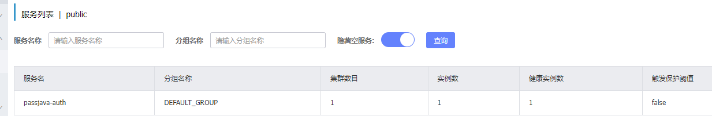
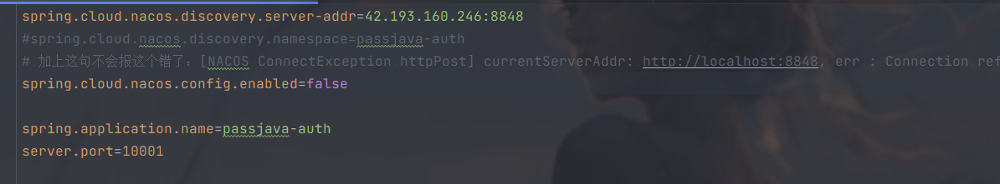
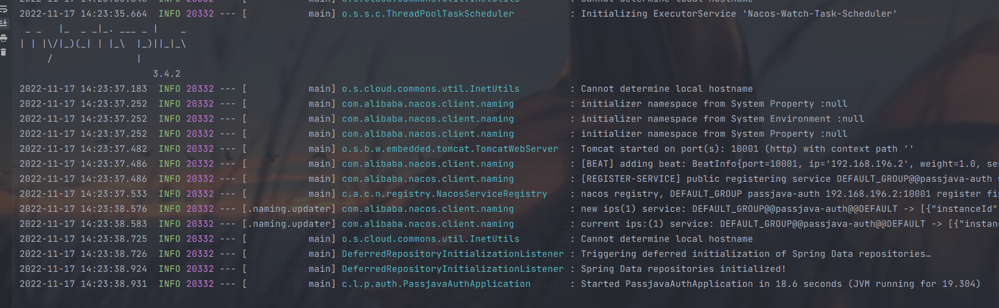

#### nacos连接远程服务器报错currentServerAddr:http://localhost:8848， err : Connect timed out 

```java
[NACOS ConnectException httpPost] currentServerAddr: http://localhost:8848, err : Connection refused: connect
```


这里一直提示连接本地的[nacos](https://so.csdn.net/so/search?q=nacos&spm=1001.2101.3001.7020)报错，但是服务器已经发现注册的服务



加入：`spring.cloud.nacos.config.enabled=false`



成功解决问题

