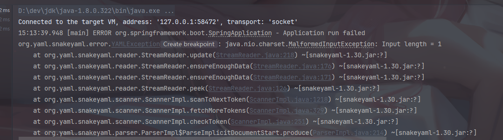

#### 1 spring boot 和 cloud 的版本对应

博客：[Spring Boot、Spring Cloud与Spring Cloud Alibaba版本对应关系_@lehao的博客-CSDN博客_alibaba cloud 版本对应关系](https://blog.csdn.net/qq_18432653/article/details/109612235) 

##### 一 、前言

在搭建SpringCloud项目环境架构的时候，需要选择SpringBoot和SpringCloud进行兼容的版本号，因此对于选择SpringBoot版本与SpringCloud版本的对应关系很重要，如果版本关系不对应，常见的会遇见项目启动不起来，怪异的则会是你的项目出现一些诡异的问题，查资料也不好查。

##### 1 历史版本图


##### 二、查看版本关系

`https://start.spring.io/actuator/info ` 

```json
{
    "git": {
        "branch": "f5360b578faa5e3530069e319097acbe5b609af8",
        "commit": {
            "id": "f5360b5",
            "time": "2022-11-01T16:47:02Z"
        }
    },
    "build": {
        "version": "0.0.1-SNAPSHOT",
        "artifact": "start-site",
        "versions": {
            "spring-boot": "2.7.5",
            "initializr": "0.13.0"
        },
        "name": "start.spring.io website",
        "time": "2022-11-01T16:50:14.056Z",
        "group": "io.spring.start"
    },
    "bom-ranges": {
        "codecentric-spring-boot-admin": {
            "2.4.3": "Spring Boot >=2.3.0.M1 and <2.5.0-M1",
            "2.5.6": "Spring Boot >=2.5.0.M1 and <2.6.0-M1",
            "2.6.8": "Spring Boot >=2.6.0.M1 and <2.7.0-M1",
            "2.7.4": "Spring Boot >=2.7.0.M1 and <3.0.0-M1",
            "3.0.0-M4": "Spring Boot >=3.0.0-M1 and <3.1.0-M1"
        },
        "solace-spring-boot": {
            "1.1.0": "Spring Boot >=2.3.0.M1 and <2.6.0-M1",
            "1.2.2": "Spring Boot >=2.6.0.M1 and <3.0.0-M1"
        },
        "solace-spring-cloud": {
            "1.1.1": "Spring Boot >=2.3.0.M1 and <2.4.0-M1",
            "2.1.0": "Spring Boot >=2.4.0.M1 and <2.6.0-M1",
            "2.3.2": "Spring Boot >=2.6.0.M1 and <3.0.0-M1"
        },
        "spring-cloud": {
            "Hoxton.SR12": "Spring Boot >=2.2.0.RELEASE and <2.4.0.M1",
            "2020.0.6": "Spring Boot >=2.4.0.M1 and <2.6.0-M1",
            "2021.0.0-M1": "Spring Boot >=2.6.0-M1 and <2.6.0-M3",
            "2021.0.0-M3": "Spring Boot >=2.6.0-M3 and <2.6.0-RC1",
            "2021.0.0-RC1": "Spring Boot >=2.6.0-RC1 and <2.6.1",
            "2021.0.4": "Spring Boot >=2.6.1 and <3.0.0-M1",
            "2022.0.0-M1": "Spring Boot >=3.0.0-M1 and <3.0.0-M2",
            "2022.0.0-M2": "Spring Boot >=3.0.0-M2 and <3.0.0-M3",
            "2022.0.0-M3": "Spring Boot >=3.0.0-M3 and <3.0.0-M4",
            "2022.0.0-M4": "Spring Boot >=3.0.0-M4 and <3.0.0-M5",
            "2022.0.0-M5": "Spring Boot >=3.0.0-M5 and <3.1.0-M1"
        },
        "spring-cloud-azure": {
            "4.3.0": "Spring Boot >=2.5.0.M1 and <2.7.0-M1",
            "4.4.1": "Spring Boot >=2.7.0-M1 and <3.0.0-M1"
        },
        "spring-cloud-gcp": {
            "2.0.11": "Spring Boot >=2.4.0-M1 and <2.6.0-M1",
            "3.4.0": "Spring Boot >=2.6.0-M1 and <3.0.0-M1"
        },
        "spring-cloud-services": {
            "2.3.0.RELEASE": "Spring Boot >=2.3.0.RELEASE and <2.4.0-M1",
            "2.4.1": "Spring Boot >=2.4.0-M1 and <2.5.0-M1",
            "3.3.0": "Spring Boot >=2.5.0-M1 and <2.6.0-M1",
            "3.4.0": "Spring Boot >=2.6.0-M1 and <2.7.0-M1",
            "3.5.0": "Spring Boot >=2.7.0-M1 and <3.0.0-M1"
        },
        "spring-geode": {
            "1.3.12.RELEASE": "Spring Boot >=2.3.0.M1 and <2.4.0-M1",
            "1.4.13": "Spring Boot >=2.4.0-M1 and <2.5.0-M1",
            "1.5.14": "Spring Boot >=2.5.0-M1 and <2.6.0-M1",
            "1.6.12": "Spring Boot >=2.6.0-M1 and <2.7.0-M1",
            "1.7.4": "Spring Boot >=2.7.0-M1 and <3.0.0-M1",
            "2.0.0-M5": "Spring Boot >=3.0.0-M1 and <3.1.0-M1"
        },
        "spring-shell": {
            "2.1.3": "Spring Boot >=2.7.0 and <3.0.0-M1",
            "3.0.0-M2": "Spring Boot >=3.0.0-M1 and <3.1.0-M1"
        },
        "vaadin": {
            "14.8.20": "Spring Boot >=2.1.0.RELEASE and <2.6.0-M1",
            "23.2.6": "Spring Boot >=2.6.0-M1 and <2.8.0-M1"
        },
        "wavefront": {
            "2.0.2": "Spring Boot >=2.1.0.RELEASE and <2.4.0-M1",
            "2.1.1": "Spring Boot >=2.4.0-M1 and <2.5.0-M1",
            "2.2.2": "Spring Boot >=2.5.0-M1 and <2.7.0-M1",
            "2.3.0": "Spring Boot >=2.7.0-M1 and <3.0.0-M1"
        }
    },
    "dependency-ranges": {
        "native": {
            "0.9.0": "Spring Boot >=2.4.3 and <2.4.4",
            "0.9.1": "Spring Boot >=2.4.4 and <2.4.5",
            "0.9.2": "Spring Boot >=2.4.5 and <2.5.0-M1",
            "0.10.0": "Spring Boot >=2.5.0-M1 and <2.5.2",
            "0.10.1": "Spring Boot >=2.5.2 and <2.5.3",
            "0.10.2": "Spring Boot >=2.5.3 and <2.5.4",
            "0.10.3": "Spring Boot >=2.5.4 and <2.5.5",
            "0.10.4": "Spring Boot >=2.5.5 and <2.5.6",
            "0.10.5": "Spring Boot >=2.5.6 and <2.5.9",
            "0.10.6": "Spring Boot >=2.5.9 and <2.6.0-M1",
            "0.11.0-M1": "Spring Boot >=2.6.0-M1 and <2.6.0-RC1",
            "0.11.0-M2": "Spring Boot >=2.6.0-RC1 and <2.6.0",
            "0.11.0-RC1": "Spring Boot >=2.6.0 and <2.6.1",
            "0.11.0": "Spring Boot >=2.6.1 and <2.6.2",
            "0.11.1": "Spring Boot >=2.6.2 and <2.6.3",
            "0.11.2": "Spring Boot >=2.6.3 and <2.6.4",
            "0.11.3": "Spring Boot >=2.6.4 and <2.6.6",
            "0.11.5": "Spring Boot >=2.6.6 and <2.7.0-M1",
            "0.12.0": "Spring Boot >=2.7.0-M1 and <2.7.1",
            "0.12.1": "Spring Boot >=2.7.1 and <3.0.0-M1"
        },
        "okta": {
            "1.4.0": "Spring Boot >=2.2.0.RELEASE and <2.4.0-M1",
            "1.5.1": "Spring Boot >=2.4.0-M1 and <2.4.1",
            "2.0.1": "Spring Boot >=2.4.1 and <2.5.0-M1",
            "2.1.6": "Spring Boot >=2.5.0-M1 and <3.0.0-M1"
        },
        "mybatis": {
            "2.1.4": "Spring Boot >=2.1.0.RELEASE and <2.5.0-M1",
            "2.2.2": "Spring Boot >=2.5.0-M1"
        },
        "camel": {
            "3.5.0": "Spring Boot >=2.3.0.M1 and <2.4.0-M1",
            "3.10.0": "Spring Boot >=2.4.0.M1 and <2.5.0-M1",
            "3.13.0": "Spring Boot >=2.5.0.M1 and <2.6.0-M1",
            "3.17.0": "Spring Boot >=2.6.0.M1 and <2.7.0-M1",
            "3.19.0": "Spring Boot >=2.7.0.M1 and <3.0.0-M1"
        },
        "picocli": {
            "4.6.3": "Spring Boot >=2.4.0.RELEASE and <3.0.0-M1"
        },
        "open-service-broker": {
            "3.2.0": "Spring Boot >=2.3.0.M1 and <2.4.0-M1",
            "3.3.1": "Spring Boot >=2.4.0-M1 and <2.5.0-M1",
            "3.4.1": "Spring Boot >=2.5.0-M1 and <2.6.0-M1",
            "3.5.0": "Spring Boot >=2.6.0-M1 and <2.7.0-M1"
        }
    }
}
```

##### 三、如何选择SpringBoot与SpringCloud版本号

项目搭建初期，如何对SpringBoot和SpringCloud的一个相互兼容性版本号进行选择，这是很重要的一步，例如SpringCloud的Hoxton.SR3这个版本，他对应的"Spring Boot >=2.2.0.M4 and <2.3.0.BUILD-SNAPSHOT"版本，意思就是如果选择使用SpringCloud 的Hoxton.SR3这个版本，那么SpringBoot的版本需要大于等于2.2.0小于2.3.0即可满足兼容性。

###### 1 . 引入SpringCloud版本管理

```xml
 <dependencyManagement>
        <dependencies>
            <dependency>
                <groupId>org.springframework.cloud</groupId>
                <artifactId>spring-cloud-dependencies</artifactId>
                <version>Hoxton.SR3</version>
                <type>pom</type>
                <scope>import</scope>
            </dependency>
        </dependencies>
 </dependencyManagement>
```

###### 2 使用Spring Boot

`Spring Boot`可以也像父工程那样管理自己内部的兼容版本号，如下：

```xml
<parent>
   <groupId>org.springframework.boot</groupId>
   <artifactId>spring-boot-starter-parent</artifactId>
   <version>2.2.5.RELEASE</version>
   <relativePath/> <!-- lookup parent from repository -->
</parent>
```

##### 四、SpringBoot、SpringCloud、SpringCloudAlibaba版本对应关系

由于`Spring Cloud`基于`Spring Boot`构建，而`Spring Cloud Alibaba`又基于`Spring Cloud Common`的规范实现，所以当我们使用``Spring Cloud Alibaba`来构建微服务应用的时候，需要知道这三者之间的版本关系。

###### 毕业版本依赖关系(推荐使用)

由于 Spring Boot 2.4+ 和以下版本之间变化较大，目前企业级客户老项目相关 Spring Boot 版本仍停留在 Spring Boot 2.4 以下，为了同时满足存量用户和新用户不同需求，社区以 Spring Boot 2.4 为分界线，同时维护 2.2.x 和 2021.x 两个分支迭代。

###### 2021.x 分支

适配 Spring Boot 2.4，Spring Cloud 2021.x 版本及以上的 Spring Cloud Alibaba 版本按从新到旧排列如下表（最新版本用*标记）： *(注意，该分支 Spring Cloud Alibaba 版本命名方式进行了调整，未来将对应 Spring Cloud 版本，前三位为 Spring Cloud 版本，最后一位为扩展版本，比如适配 Spring Cloud 2021.0.1 版本对应的 Spring Cloud Alibaba 第一个版本为：2021.0.1.0，第个二版本为：2021.0.1.1，依此类推)*

| Spring Cloud Alibaba Version | Spring Cloud Version  | Spring Boot Version |
| ---------------------------- | --------------------- | ------------------- |
| 2021.0.4.0*                  | Spring Cloud 2021.0.4 | 2.6.11              |
| 2021.0.1.0                   | Spring Cloud 2021.0.1 | 2.6.3               |
| 2021.1                       | Spring Cloud 2020.0.1 | 2.4.2               |

###### 2.2.x 分支

适配 Spring Boot 为 2.4，Spring Cloud Hoxton 版本及以下的 Spring Cloud Alibaba 版本按从新到旧排列如下表（最新版本用*标记）：

| Spring Cloud Alibaba Version      | Spring Cloud Version        | Spring Boot Version |
| --------------------------------- | --------------------------- | ------------------- |
| 2.2.9.RELEASE*                    | Spring Cloud Hoxton.SR12    | 2.3.12.RELEASE      |
| 2.2.8.RELEASE                     | Spring Cloud Hoxton.SR12    | 2.3.12.RELEASE      |
| 2.2.7.RELEASE                     | Spring Cloud Hoxton.SR12    | 2.3.12.RELEASE      |
| 2.2.6.RELEASE                     | Spring Cloud Hoxton.SR9     | 2.3.2.RELEASE       |
| 2.1.4.RELEASE                     | Spring Cloud Greenwich.SR6  | 2.1.13.RELEASE      |
| 2.2.1.RELEASE                     | Spring Cloud Hoxton.SR3     | 2.2.5.RELEASE       |
| 2.2.0.RELEASE                     | Spring Cloud Hoxton.RELEASE | 2.2.X.RELEASE       |
| 2.1.2.RELEASE                     | Spring Cloud Greenwich      | 2.1.X.RELEASE       |
| 2.0.4.RELEASE(停止维护，建议升级) | Spring Cloud Finchley       | 2.0.X.RELEASE       |
| 1.5.1.RELEASE(停止维护，建议升级) | Spring Cloud Edgware        | 1.5.X.RELEASE       |

##### 五. Spring Cloud Alibaba与组件版本关系

###### 组件版本关系

每个 Spring Cloud Alibaba 版本及其自身所适配的各组件对应版本如下表所示（注意，Spring Cloud Dubbo 从 2021.0.1.0 起已被移除出主干，不再随主干演进）：

| Spring Cloud Alibaba Version                              | Sentinel Version | Nacos Version | RocketMQ Version | Dubbo Version | Seata Version |
| --------------------------------------------------------- | ---------------- | ------------- | ---------------- | ------------- | ------------- |
| 2.2.9.RELEASE                                             | 1.8.5            | 2.1.0         | 4.9.4            | ~             | 1.5.2         |
| 2021.0.4.0                                                | 1.8.5            | 2.0.4         | 4.9.4            | ~             | 1.5.2         |
| 2.2.8.RELEASE                                             | 1.8.4            | 2.1.0         | 4.9.3            | ~             | 1.5.1         |
| 2021.0.1.0                                                | 1.8.3            | 1.4.2         | 4.9.2            | ~             | 1.4.2         |
| 2.2.7.RELEASE                                             | 1.8.1            | 2.0.3         | 4.6.1            | 2.7.13        | 1.3.0         |
| 2.2.6.RELEASE                                             | 1.8.1            | 1.4.2         | 4.4.0            | 2.7.8         | 1.3.0         |
| 2021.1 or 2.2.5.RELEASE or 2.1.4.RELEASE or 2.0.4.RELEASE | 1.8.0            | 1.4.1         | 4.4.0            | 2.7.8         | 1.3.0         |
| 2.2.3.RELEASE or 2.1.3.RELEASE or 2.0.3.RELEASE           | 1.8.0            | 1.3.3         | 4.4.0            | 2.7.8         | 1.3.0         |
| 2.2.1.RELEASE or 2.1.2.RELEASE or 2.0.2.RELEASE           | 1.7.1            | 1.2.1         | 4.4.0            | 2.7.6         | 1.2.0         |
| 2.2.0.RELEASE                                             | 1.7.1            | 1.1.4         | 4.4.0            | 2.7.4.1       | 1.0.0         |
| 2.1.1.RELEASE or 2.0.1.RELEASE or 1.5.1.RELEASE           | 1.7.0            | 1.1.4         | 4.4.0            | 2.7.3         | 0.9.0         |
| 2.1.0.RELEASE or 2.0.0.RELEASE or 1.5.0.RELEASE           | 1.6.3            | 1.1.1         | 4.4.0            | 2.7.3         | 0.7.1         |

##### 六、依赖管理

Spring Cloud Alibaba BOM 包含了它所使用的所有依赖的版本。

###### RELEASE 版本

**Spring Cloud Hoxton**

如果需要使用 Spring Cloud Hoxton 版本，请在 dependencyManagement中添加如下配置

```xml
<dependency>
    <groupId>com.alibaba.cloud</groupId>
    <artifactId>spring-cloud-alibaba-dependencies</artifactId>
    <version>2.2.3.RELEASE</version>
    <type>pom</type>
    <scope>import</scope>
</dependency>
```

然后在dependencies 中添加自己所需使用的依赖即可使用。

**Spring Cloud Greenwich**

如果需要使用 Spring Cloud Greenwich版本，请在 dependencyManagement中添加如下配置

```xml
<dependency>
    <groupId>com.alibaba.cloud</groupId>
    <artifactId>spring-cloud-alibaba-dependencies</artifactId>
    <version>2.1.3.RELEASE</version>
    <type>pom</type>
    <scope>import</scope>
</dependency>
```

然后在 dependencies中添加自己所需使用的依赖即可使用。

**Spring Cloud Finchley**

如果需要使用 Spring Cloud Finchley版本，请在 dependencyManagement中添加如下配置

```xml
<dependency>
    <groupId>com.alibaba.cloud</groupId>
    <artifactId>spring-cloud-alibaba-dependencies</artifactId>
    <version>2.0.3.RELEASE</version>
    <type>pom</type>
    <scope>import</scope>
</dependency>
```

然后在dependencies中添加自己所需使用的依赖即可使用。

**Spring Cloud Edgware**

如果需要使用 Spring Cloud Edgware 版本，请在 dependencyManagement中添加如下配置

```xml
<dependency>
    <groupId>com.alibaba.cloud</groupId>
    <artifactId>spring-cloud-alibaba-dependencies</artifactId>
    <version>1.5.1.RELEASE</version>
    <type>pom</type>
    <scope>import</scope>
</dependency>
```

然后在 dependencies中添加自己所需使用的依赖即可使用。

###### 版本管理规范

项目的版本号格式为 x.x.x 的形式，其中 x 的数值类型为数字，从 0 开始取值，且不限于 0~9 这个范围。项目处于孵化器阶段时，第一位版本号固定使用 0，即版本号为 0.x.x 的格式。

由于 `Spring Boot 1 和 Spring Boot 2 在 Actuator 模块的接口和注解有很大的变更，且 spring-cloud-commons 从 1.x.x 版本升级到 2.0.0 版本也有较大的变更，因此我们采取跟 SpringBoot 版本号一致的版本:

**1.5.x 版本适用于 Spring Boot 1.5.x**

**2.0.x 版本适用于 Spring Boot 2.0.x**

**2.1.x 版本适用于 Spring Boot 2.1.x**

**2.2.x 版本适用于 Spring Boot 2.2.x**

##### 参考

1. Spring-Cloud-Alibaba版本说明：[https://github.com/alibaba/spring-cloud-alibaba/wiki/版本说明](https://github.com/alibaba/spring-cloud-alibaba/wiki/版本说明) 

2. SpringCloudAlibaba中文社区地址: [https://github.com/alibaba/spring-cloud-alibaba/blob/master/README-zh.md]( https://github.com/alibaba/spring-cloud-alibaba/blob/master/README-zh.md) 
3. SpringCloud官方文档： [Spring Cloud Gateway](https://cloud.spring.io/spring-cloud-static/spring-cloud-gateway/2.2.1.RELEASE/reference/html/) 

#### 2 记录java.lang.NoClassDefFoundError: org/springframework/boot/logging/DeferredLogFactory错误

今天学习springboot出现java.lang.NoClassDefFoundError: org/springframework/boot/logging/DeferredLogFactory 错误，原因是修改了springboot版本，导致boot版本与cloud版本不一致导致的。

原本的boot版本为2.7.5，被我修改为了2.3.2.RELEASE，因此需要修改cloud的版本.

```xml
<properties>
    <java.version>1.8</java.version>
    <spring-cloud.version>2021.0.4</spring-cloud.version>
</properties>
```

原本的 spring-cloud 的版本。需要修改成和 boot 对应的版本，需要查询到对应的版本，地址： https://github.com/spring-cloud/spring-cloud-release/wiki/Spring-Cloud-Hoxton-Release-Notes 

spring boot版本是：

```xml
<parent>
    <groupId>org.springframework.boot</groupId>
    <artifactId>spring-boot-starter-parent</artifactId>
    <version>2.3.2.RELEASE</version>
    <relativePath/> <!-- lookup parent from repository -->
</parent>
```

可以参考：https://blog.csdn.net/m0_37824308/article/details/122717359 

springboot 和spring cloud的版本对应


需要将版本改成：

```xml
<properties>
    <java.version>1.8</java.version>
    <spring-cloud.version>Hoxton.SR12</spring-cloud.version>
</properties>
```

#### 3 spring boot 项目时间映射错误，while it seems to fit format ‘yyyy-MM-dd‘T‘HH:mm:ss.SSSZ，

> nested exception is com.fasterxml.jackson.databind.exc.InvalidFormatException: Cannot deserialize value of type `java.util.Date` from String "2022-10-28 09:36:10.100": not a valid representation (error: Failed to parse Date value '2022-10-28 09:36:10.100': Cannot parse date "2022-10-28 09:36:10.100": while it seems to fit format 'yyyy-MM-dd'T'HH:mm:ss.SSSX', parsing fails (leniency? null))

报错的是 jackson 的一个解析异常，搜索网上解决方案，在配置文件里加上一个配置：

```yaml
spring: 
  jackson:
    date-format: yyyy-MM-dd HH:mm:ss
```

正常的spring mvc 是在字段上加上注解 `@DateTimeFormat(pattern = "yyyy-MM-dd HH:mm:ss")`。


此时请求成功。

#### 4 springCloud-Gateway 出现 Unable to start ServletWebServerApplicationContext due to missing ServletWebServerFactory bean. 错误


 [彻底找到Spring Webflux与WebMVC 冲突原因](https://zhuanlan.zhihu.com/p/359849941) 

从报错内容上来看是找不到ServletWebServerFactory这个bean导致的错误。从Spring Framework 5.0开始，引入的新的响应式Web框架（Spring WebFlux），与Spring MVC不同，它不需要Servlet API，完全异步和非阻塞。Spring Cloud Gateway 运用了响应式编程（WebFlux）,因此它需要依赖于Servlet API，但是启动的时候为什么还是去找Servlet呢？百思不得其解。


#### 5 springCloud-Gateway 出现org.[springframework](https://so.csdn.net/so/search?q=springframework&spm=1001.2101.3001.7020).http.codec.ServerCodecConfigurer’ that could not be found错误 

Spring MVC与Spring Cloud网关不兼容。请删除spring-boot-start-web依赖项。
因为**spring cloud gateway是基于webflux**的，如果非要web支持的话需要导入spring-boot-starter-webflux而不是spring-boot-start-web。

或者添加

```xml
<dependency>
    <groupId>org.springframework.boot</groupId>
    <artifactId>spring-boot-starter-web</artifactId>
    <exclusions>
        <exclusion>
            <groupId>org.springframework</groupId>
            <artifactId>spring-webmvc</artifactId>
        </exclusion>
    </exclusions>
</dependency>
```

#### 使用 Gson 将对象格式化成JSON

```java
    private static TypeAdapter<ErrorCode> errorCodeTypeAdapter = new TypeAdapter<ErrorCode>() {
        @Override
        public ErrorCode read(final JsonReader in) throws IOException {
            return null;
        }

        @Override
        public void write(final JsonWriter out, final ErrorCode errorCode) throws IOException {
            if (errorCode == null) {
                out.value("");
            }
            else {
                out.value(errorCode.getValue());
            }
        }
    };

    public static Gson create() {
        Gson gson =
            new com.google.gson.GsonBuilder().registerTypeAdapter(
                ErrorCode.class,
                errorCodeTypeAdapter).serializeNulls().setDateFormat("yyyyMMddHHmmss").create();
        return gson;
    }
    
    public static Gson create2() {
        Gson gson =
            new com.google.gson.GsonBuilder().registerTypeAdapter(ErrorCode.class, new EnumSerializer()).serializeNulls().setDateFormat("yyyyMMddHHmmss").create();
        return gson;
    }
    
    // 添加这个类型适配器，会将对象里的 ErrorCode转换成对应的字符串，以及会转换null和设置时间格式类型。
    public static Gson create(String dateFormat) {
        Gson gson =
            new com.google.gson.GsonBuilder().registerTypeAdapter(
                ErrorCode.class,
                errorCodeTypeAdapter).serializeNulls().setDateFormat(dateFormat).create();
        return gson;
    }
}

public enum ErrorCode {

    Success("00000000"),
    Failed("00000001");

    private String value;

    ErrorCode(String value) {
        this.value = value;
    }

    @JsonValue
    public String getValue() {
        return value;
    }

    public void setValue(String value) {
        this.value = value;
    }

    public boolean isSuccess() {
        return this == Success;
    }

    public static ErrorCode getCode(String value) {
        return Arrays.stream(ErrorCode.values()).filter(
                errorCode -> StringUtils.equals(errorCode.getValue(), value)).findFirst().orElse(Failed);
    }
} 
```

使用方式：

```java
GsonBuilder.create().toJson(response)
```

配置文件：

```xml
<dependency>
    <groupId>com.google.code.gson</groupId>
    <artifactId>gson</artifactId>
    <version>2.10.1</version>
</dependency>
```

这样就可以将对象中的所有属性都格式化成 json 字段了，可以和 JsonFilter搭配使用。

#### post请求参数接收

[SpringBoot]@RequestParam接收不到POST请求的数据。

这个时候需要注意看前端发送请求的header是不是设置了 `Content-Type`。

```js
header:{
	'Content-Type':'application/json'
}
```

这会导致@RequestParam接收不到POST请求的数据。 正确的做法是设置：

```js
header:{
	'Content-Type':'application/x-www-form-urlencoded'
}
```

如果想继续使用 `Content-Type’:‘application/json` ，只能使用**@RequestBody**来接收。

此时有几种方法接收参数：

- 使用 Map 接收 post 请求参数。

```java
@PostMapping("/delete")
public ApiResponse delete(@RequestBody Map<String,String> params){
    Long id = params.get("id");
    if (id == null) {
        throw AppException("参数错误");
    }
    service.deleteById(id);
    return ApiResponse.createBySuccess();
}
```

- 使用 String 类型接收 post 请求参数

```java
@PostMapping("/delete")
public ApiResponse delete(@RequestBody String params){
    JSONObject paramsJSONObject = JSONObject.parseObject(params);
    Long id = paramsJSONObject.getLong("id");
    if (id == null) {
        throw AppException("参数错误");
    }
    service.deleteById(id);
    return ApiResponse.createBySuccess();
}
```

- 从 request 种获取参数

```java
@PostMapping("/delete")
public ApiResponse delete(HttpServletRequest request) {
    String body = getRequestBody(request);
    JSONObject paramsJSONObject = JSONObject.parseObjec(body);
    Long id = paramsJSONObject.getLong("id");
    if (id == null) {
        throw AppException("参数错误");
    }
    service.deleteById(id);
    return ApiResponse.createBySuccess();
}

/**
 * 从 request 中获取 body
 */
private String getRequestBody(HttpServletRequest servletRequest) {
    StringBuilder stringBuilder = new StringBuilder();
    try {
        BufferedReader reader = servletRequest.getReader();
        char[] buf = new char[1024];
        int length;
        while ((length = reader.read(buf)) != -1) {
            stringBuilder.append(buf, 0, length);
        }
    } catch (IOException e) {
        log.error("读取流异常", e);
        throw new AppException(SystemError.PARSE_PARAMS_FAIL);
    }
    return stringBuilder.toString();
}
```

- 使用 Java Bean 接收

```java
@PostMapping("/delete")
public ApiResponse delete(@RequestBody IdBean idBean) {
    if (idBean == null || idBean.getId() == null) {
        throw AppException("参数错误");
    }
    service.deleteById(id);
    return ApiResponse.createBySuccess();
}
@Data
public class IdBean {
    private Long id;
}
```

- 自定义参数解析，类似 @RequestParam

https://blog.csdn.net/qq_35787138/article/details/105376731

#### spring boot 用实体接收 Get 请求传递的多个参数

1 controller 层不带任何注解接收参数

```java
/**
 * @author zhangzhixiang
 * @since v1.0.0
 */
@RestController
@RequestMapping(path = "/ui/institution")
public class InstitutionManagementController {
 
    @GetMapping(value = "/pageQueryForAssign")
    public void pageQueryInstitutionsForAssign(InstitutionQueryDTO queryDTO) {
 
    }
}
```

前端传参数：`http://192.168.63.125/ui/institution/pageQueryForAssign?name='xxx'&sex='男'`，这个name和sex是实体类种的属性。

2 controller 通过 @ModelAttribute 接收参数

```java
/**
 * @author zhangzhixiang
 * @since v1.0.0
 */
@RestController
@RequestMapping(path = "/ui/institution")
public class InstitutionManagementController {
 
    @GetMapping(value = "/test")
    public void test(@ModelAttribute InstitutionQueryDTO queryDTO){
 
    }
}
```

这里的重点是@ModelAttribute注解，他也会将前端传过来的参数填充到业务实体中，前端传参格式与方法一相同。

#### java 使用spring Boot 3.0和spring data jpa时，由方法名创建的查询会报告错误

项目启动时，报告了一个错误，但一切正常
Spring Boot 2.7下正常无报错
Spring Boot 3.0.1+ spring data jpa 3.0.1由Spring初始化程序创建。

https://www.saoniuhuo.com/question/detail-2419397.html

#### spring boot 版本

[SpringBoot系列-全网最全的版本变更史 - 知乎 (zhihu.com)](https://zhuanlan.zhihu.com/p/652895555)


#### IDEA2023版本创建Sping项目只能勾选17和21，却无法使用Java8？（已解决）

原文链接：https://blog.csdn.net/qq_44231797/article/details/134630733

方案一：替换创建项目的源
我们只知道IDEA页面创建Spring项目，其实是访问spring initializr去创建项目。故我们可以通过阿里云国服去间接创建Spring项目。将https://start.spring.io/或者http://start.springboot.io/替换为 https://start.aliyun.com/

方案二：升级JDK版本

采用JDK17或者21版本，创建项目后，springboot的版本要改为3.0以下，在pom.xml中把java改为1.8，如下图。

#### springboot 配置 druid 数据库连接池

[Spring Boot——集成Druid数据库连接池_spring boot durid 连接池-CSDN博客](https://blog.csdn.net/wpc2018/article/details/116948255)


剩下的配置：


#### spring boot上传下载文件

[【File】使用 SpringBoot 实现文件的上传与下载_spring boot 下载fle文件-CSDN博客](https://blog.csdn.net/sco5282/article/details/121275436)

[【Excel】使用 SpringBoot 实现 Excel 文件的导入与导出_springboot excel-CSDN博客](https://blog.csdn.net/sco5282/article/details/121303881)


#### springboot+mybatis多数据源配置(亲测)

[springboot+mybatis多数据源配置(亲测)_mybatis 配置指定数据源-CSDN博客](https://blog.csdn.net/yuanshangshenghuo/article/details/119223504)

#### springboot 配置整合 shardingJDBC

[Springboot系列：整合Shardingjdbc实现分表、含项目实践！ - 知乎 (zhihu.com)](https://zhuanlan.zhihu.com/p/689898174) 这个是 5.1.2 版本的，比较新

[SpringBoot+Sharding-JDBC操作分库分表（超超超详细）_springboot~sharding-jdbc实现分库分表-CSDN博客](https://blog.csdn.net/s1078229131/article/details/106785894)

报错信息 


```java
Caused by: java.lang.NoClassDefFoundError: org/apache/tomcat/dbcp/dbcp2/BasicDataSource
	at org.apache.shardingsphere.infra.datasource.pool.metadata.type.dbcp.TomcatDBCPDataSourcePoolMetaData.getType(TomcatDBCPDataSourcePoolMetaData.java:67)
	at org.apache.shardingsphere.spi.typed.TypedSPIRegistry.lambda$findRegisteredService$0(TypedSPIRegistry.java:44)
	at java.util.stream.ReferencePipeline$2$1.accept(ReferencePipeline.java:174)
	at java.util.ArrayList$ArrayListSpliterator.tryAdvance(ArrayList.java:1361)
	at java.util.stream.ReferencePipeline.forEachWithCancel(ReferencePipeline.java:126)
	at java.util.stream.AbstractPipeline.copyIntoWithCancel(AbstractPipeline.java:499)
	at java.util.stream.AbstractPipeline.copyInto(AbstractPipeline.java:486)
	at java.util.stream.AbstractPipeline.wrapAndCopyInto(AbstractPipeline.java:472)
	at java.util.stream.FindOps$FindOp.evaluateSequential(FindOps.java:152)
	at java.util.stream.AbstractPipeline.evaluate(AbstractPipeline.java:234)
	at java.util.stream.ReferencePipeline.findFirst(ReferencePipeline.java:531)
	at org.apache.shardingsphere.spi.typed.TypedSPIRegistry.findRegisteredService(TypedSPIRegistry.java:44)
	at org.apache.shardingsphere.infra.datasource.pool.metadata.DataSourcePoolMetaDataFactory.newInstance(DataSourcePoolMetaDataFactory.java:46)
	at org.apache.shardingsphere.infra.datasource.props.DataSourceProperties.<init>(DataSourceProperties.java:53)
	at org.apache.shardingsphere.spring.boot.datasource.DataSourceMapSetter.getDataSource(DataSourceMapSetter.java:92)
	at org.apache.shardingsphere.spring.boot.datasource.DataSourceMapSetter.getDataSourceMap(DataSourceMapSetter.java:65)
	at org.apache.shardingsphere.spring.boot.ShardingSphereAutoConfiguration.setEnvironment(ShardingSphereAutoConfiguration.java:122)
	at org.springframework.context.support.ApplicationContextAwareProcessor.invokeAwareInterfaces(ApplicationContextAwareProcessor.java:110)
	at org.springframework.context.support.ApplicationContextAwareProcessor.postProcessBeforeInitialization(ApplicationContextAwareProcessor.java:102)
	at org.springframework.beans.factory.support.AbstractAutowireCapableBeanFactory.applyBeanPostProcessorsBeforeInitialization(AbstractAutowireCapableBeanFactory.java:440)
	at org.springframework.beans.factory.support.AbstractAutowireCapableBeanFactory.initializeBean(AbstractAutowireCapableBeanFactory.java:1796)
	at org.springframework.beans.factory.support.AbstractAutowireCapableBeanFactory.doCreateBean(AbstractAutowireCapableBeanFactory.java:620)
	... 94 more
Caused by: java.lang.ClassNotFoundException: org.apache.tomcat.dbcp.dbcp2.BasicDataSource
	at java.net.URLClassLoader.findClass(URLClassLoader.java:387)
	at java.lang.ClassLoader.loadClass(ClassLoader.java:418)
	at sun.misc.Launcher$AppClassLoader.loadClass(Launcher.java:352)
	at java.lang.ClassLoader.loadClass(ClassLoader.java:351)
	... 116 more
```

issue：[java.lang.NoClassDefFoundError: org/apache/tomcat/dbcp/dbcp2/BasicDataSource · Issue #16116 · apache/shardingsphere (github.com)](https://github.com/apache/shardingsphere/issues/16116)


#### 配置文件

```yml
application:
  apis:
    selector: com.duoke.tiktok.service.controller
  name: DuoKe Tiktok Service Application
  description: Tiktok平台服务
  version: 1.0
spring:
  mvc:
    pathmatch:
      matching-strategy: ant_path_matcher
  profiles:
    active: dev
    include: ${spring.profiles.active}-kafka,${spring.profiles.active}-sharding,gray-config
management:
  health:
    db:
      enabled: false
nature:
  restApi:
    enabled: false
```

针对

```yml
spring:
  mvc:
    pathmatch:
      matching-strategy: ant_path_matcher
  profiles:
    active: dev
    include: ${spring.profiles.active}-kafka,${spring.profiles.active}-sharding,gray-config
```

1. `application.yml` 或 `application.properties`：主配置文件，首先加载。
2. `application-dev.yml` 或 `application-dev.properties`：根据 `spring.profiles.active=dev` 加载的配置文件，覆盖主配置文件中的相应配置。
3. `application-dev-kafka.yml` 或 `application-dev-kafka.properties`：根据 `spring.profiles.include=dev-kafka` 加载的配置文件，进一步覆盖先前加载的配置。
4. `application-dev-sharding.yml` 或 `application-dev-sharding.properties`：根据 `spring.profiles.include=dev-sharding` 加载的配置文件，进一步覆盖先前加载的配置。

假如src的resource下配置

```xml
src/main/resources/
  application.yml
  application-dev.yml
  application-dev-kafka.yml
  application-dev-sharding.yml
```

在你提供的配置中，Spring Boot 将会加载以下配置文件：

1. `application.yml` 或 `application.properties`
2. `application-dev.yml` 或 `application-dev.properties`
3. `application-dev-kafka.yml` 或 `application-dev-kafka.properties`
4. `application-dev-sharding.yml` 或 `application-dev-sharding.properties`

如果 `application-dev.yml` 配置了nacos的话，也会从nacos加载配置文件

```yml
nacos:
  config:
    server-addr: config-dev.meiyunji.net:8848   # nacos配置中心地址，注意：结尾不能带斜杠/
    namespace: dk-dev
    group: dk-tiktok-service   # 指定分组名
    #配置自动刷新
    auto-refresh: true
    # 配置编码
    encode: UTF-8
    bootstrap:
      enable: true
      log-enable: true
    type: yaml
    # 指定了要加载的配置文件的 Data IDs
    data-ids: application-${spring.profiles.active}-sharding.yml,application-${spring.profiles.active}-kafka.yml,application-gray-config.yml
    remote-first: true # 设置了优先从远程加载配置。
    username: dk_ro
    password: Dk_Ro893*%
```

#### springboot出现yaml input -1 问题



问题原因是配置文件的编码有问题，需要到idea的文件编码出去修改，如果是已经编译过了，需要将编译了的文件删掉，重新编译


